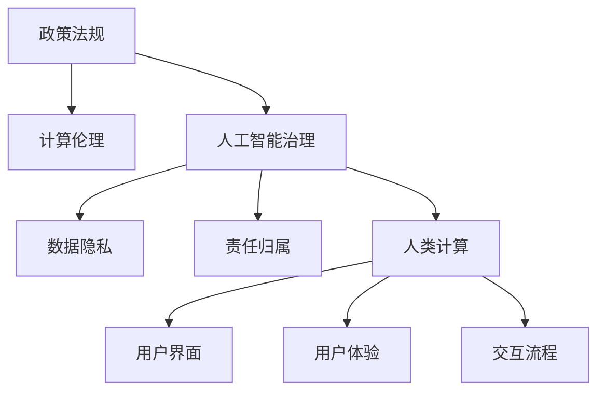

                 

# 政策与监管：引导人类计算的健康发展

> 关键词：政策法规, 计算伦理, 人工智能治理, 数据隐私, 责任追究, 人类计算

## 1. 背景介绍

在现代社会，计算技术已渗透到各个角落，深刻影响着人类的生活方式、工作方式乃至思维模式。随着计算能力的不断提升，人工智能(AI)、大数据分析等技术在医疗、教育、交通、金融等领域的应用越来越广泛，极大地提升了人类生产力和生活质量。然而，随之而来的计算伦理、数据隐私、责任归属等问题也日渐凸显，亟需政策法规和监管措施的引导和规范。

### 1.1 计算伦理的兴起

计算伦理是指在计算科技的开发、应用和推广过程中，如何处理数据隐私、用户权利、算法透明性、偏见控制等伦理问题。随着计算技术的普及，伦理问题变得日益严重，如人脸识别技术的滥用、自动决策系统的歧视、数据泄露和隐私侵害等事件频发，引起了社会各界对计算伦理的广泛关注。

### 1.2 数据隐私保护的重要性

数据是计算科技的核心资产，保护数据隐私是计算伦理的重要组成部分。特别是在大数据时代，数据的收集、存储和处理变得前所未有的容易，数据泄露和滥用的风险也随之增加。如何在使用数据时保护个人隐私，成为了政策法规和监管的核心问题。

### 1.3 责任归属的复杂性

计算科技的应用往往涉及多方参与，包括数据提供者、算法开发者、技术提供者和服务用户。在算法出错或数据泄露时，如何确定各方的责任归属，是计算伦理的重要挑战。

## 2. 核心概念与联系

### 2.1 核心概念概述

为更好地理解计算伦理和监管政策，本节将介绍几个密切相关的核心概念：

- **政策法规(Policy & Regulation)**：政府或监管机构制定的规范计算技术应用的政策文件。
- **计算伦理(Computing Ethics)**：计算技术在开发、应用和推广过程中，如何处理数据隐私、用户权利、算法透明性、偏见控制等伦理问题。
- **人工智能治理(AI Governance)**：管理和控制人工智能技术发展和应用的政策、法规、伦理和标准。
- **数据隐私(Data Privacy)**：保护个人信息不被未经授权的收集、存储、使用或传播的措施。
- **责任归属(Liability)**：在计算技术应用中，出现错误或损害时，如何确定各参与方的责任归属。
- **人类计算(Human-Computer Interaction, HCI)**：涉及人机交互的设计原则和实践，包括用户界面、用户体验、交互流程等。

这些概念之间的逻辑关系可以通过以下Mermaid流程图来展示：



这个流程图展示了几大核心概念之间的联系：

1. 政策法规为计算技术的开发和应用提供了规范和指导。
2. 计算伦理是政策法规制定的重要依据之一，涉及算法透明性、数据隐私保护等问题。
3. 人工智能治理是政策法规和计算伦理的具体执行层面，涵盖技术标准、伦理评估等。
4. 数据隐私保护是计算伦理的核心内容之一，也是人工智能治理的重要组成部分。
5. 责任归属涉及政策法规和计算伦理的实际落地，需要明确各参与方的责任。
6. 人类计算涉及用户界面、用户体验、交互流程等，是计算伦理和人工智能治理的重要应用领域。

这些概念共同构成了计算伦理和监管政策的研究框架，为计算技术的发展提供了道德和法律的引导。

## 3. 核心算法原理 & 具体操作步骤

### 3.1 算法原理概述

计算伦理和监管政策的核心在于规范计算技术的应用，以保护数据隐私、确保算法透明、控制算法偏见，并明确责任归属。本节将详细介绍这些核心任务所涉及的算法原理。

### 3.2 算法步骤详解

#### 3.2.1 政策法规的制定和实施

政策法规的制定一般包括以下步骤：

1. **需求分析**：评估计算技术应用中存在的主要伦理和法律问题，确定需要制定法规的范围和目标。
2. **方案设计**：提出可能的解决方案，包括法规内容、实施方式、监督机制等。
3. **草案编写**：将解决方案编写成草案，供公众和专家讨论。
4. **公开征求意见**：通过网络、听证会等方式，广泛征求社会各界的意见和建议。
5. **修订完善**：根据反馈意见，对草案进行修订完善。
6. **批准发布**：将修订后的法规提交给立法机构批准，并公布实施。

#### 3.2.2 计算伦理的评估和提升

计算伦理的评估和提升一般包括以下步骤：

1. **算法透明性评估**：对算法的决策过程进行透明度评估，确保算法能够被理解和解释。
2. **数据隐私保护评估**：评估数据收集、存储和使用过程中的隐私保护措施，确保数据不被滥用。
3. **算法偏见检测和纠正**：检测和纠正算法中的偏见，确保算法公正、无歧视。
4. **伦理框架制定**：制定和实施计算伦理框架，包括伦理准则、伦理培训等。

#### 3.2.3 人工智能治理的执行和监督

人工智能治理的执行和监督一般包括以下步骤：

1. **技术标准制定**：制定人工智能技术的标准，包括算法透明性、数据隐私保护等。
2. **伦理评估和审核**：对人工智能应用进行伦理评估和审核，确保其符合伦理规范。
3. **合规监管**：对人工智能应用进行合规监管，确保其符合政策和法规要求。
4. **风险管理**：对人工智能应用进行风险评估和管理，确保其安全和稳定。

#### 3.2.4 数据隐私保护的策略和措施

数据隐私保护的策略和措施一般包括以下步骤：

1. **数据分类**：对数据进行分类，确定敏感数据和非敏感数据。
2. **数据匿名化**：对敏感数据进行匿名化处理，保护用户隐私。
3. **访问控制**：对数据访问进行严格控制，确保只有授权人员能够访问敏感数据。
4. **数据加密**：对数据进行加密处理，防止数据泄露。
5. **隐私政策制定**：制定隐私政策，告知用户数据使用方式和隐私保护措施。

#### 3.2.5 责任归属的界定和追究

责任归属的界定和追究一般包括以下步骤：

1. **责任界定**：根据计算技术应用的具体情况，明确各参与方的责任。
2. **责任追究机制**：建立责任追究机制，包括投诉、仲裁、诉讼等。
3. **法律责任和道德责任**：明确法律责任和道德责任的界限，确保责任追究的公正性。

### 3.3 算法优缺点

#### 3.3.1 政策法规的优点和缺点

**优点**：
1. **规范性**：提供明确的行为准则，帮助各方遵守伦理和法律规范。
2. **权威性**：政府或监管机构具有强制力，可以确保政策的落实。
3. **社会共识**：政策制定过程中广泛征求意见，有助于形成社会共识。

**缺点**：
1. **滞后性**：政策制定和修订过程较长，难以应对快速变化的技术环境。
2. **复杂性**：不同行业和应用场景存在差异，政策制定复杂。
3. **执行成本**：政策实施和监管需要大量资源，增加企业成本。

#### 3.3.2 计算伦理的优点和缺点

**优点**：
1. **灵活性**：伦理框架具有一定灵活性，可以根据具体情况进行调整。
2. **道德引导**：伦理框架提供道德指南，帮助各方做出正确决策。
3. **自我约束**：伦理框架可以促进企业的自我约束，提升企业信誉。

**缺点**：
1. **主观性**：伦理标准可能存在主观性，难以形成客观共识。
2. **执行难度**：伦理标准难以强制执行，依赖各方的自我约束。
3. **操作复杂**：伦理评估和提升需要大量时间和资源，操作复杂。

#### 3.3.3 人工智能治理的优点和缺点

**优点**：
1. **技术规范**：提供技术标准，确保人工智能应用符合规范。
2. **合规监管**：对人工智能应用进行合规监管，确保其安全和稳定。
3. **风险管理**：对人工智能应用进行风险评估和管理，确保其安全和稳定。

**缺点**：
1. **执行难度**：技术标准的执行需要大量技术和管理资源。
2. **动态调整**：技术标准需要不断调整以适应技术进步，执行难度增加。
3. **合规成本**：合规监管和风险管理需要大量时间和资源，增加企业成本。

#### 3.3.4 数据隐私保护的优点和缺点

**优点**：
1. **用户信任**：通过保护用户隐私，增强用户信任。
2. **合规风险**：保护数据隐私有助于企业合规，减少法律风险。
3. **数据安全**：通过加密和匿名化等措施，确保数据安全。

**缺点**：
1. **成本高**：数据隐私保护需要大量资源，成本较高。
2. **技术复杂**：数据隐私保护需要复杂的技术手段，操作难度大。
3. **用户习惯**：用户隐私保护意识不足，隐私保护措施难以落实。

#### 3.3.5 责任归属的优点和缺点

**优点**：
1. **公正性**：明确各参与方的责任，确保公正性。
2. **风险分担**：明确责任归属，有助于风险分担。
3. **合规保障**：明确责任归属，有助于企业合规。

**缺点**：
1. **责任复杂**：责任归属问题复杂，难以明确各方的责任。
2. **法律挑战**：责任归属问题涉及法律问题，处理难度大。
3. **道德困境**：责任归属问题涉及道德问题，处理难度大。

### 3.4 算法应用领域

计算伦理和监管政策的应用领域非常广泛，包括但不限于以下几个方面：

#### 3.4.1 医疗领域

在医疗领域，计算技术的应用广泛涉及疾病诊断、个性化治疗、医疗影像分析等。政策法规和计算伦理需要确保计算技术的应用符合伦理规范，保护患者隐私，避免算法偏见，确保医疗决策的公正性。

#### 3.4.2 金融领域

在金融领域，计算技术的应用广泛涉及风险评估、信用评分、智能投顾等。政策法规和计算伦理需要确保计算技术的应用符合伦理规范，保护用户隐私，避免算法偏见，确保金融决策的公正性。

#### 3.4.3 教育领域

在教育领域，计算技术的应用广泛涉及智能推荐、智能辅导、在线教育等。政策法规和计算伦理需要确保计算技术的应用符合伦理规范，保护学生隐私，避免算法偏见，确保教育决策的公正性。

#### 3.4.4 交通领域

在交通领域，计算技术的应用广泛涉及智能驾驶、交通流量分析、智能调度等。政策法规和计算伦理需要确保计算技术的应用符合伦理规范，保护用户隐私，避免算法偏见，确保交通决策的公正性。

#### 3.4.5 城市管理领域

在城市管理领域，计算技术的应用广泛涉及智慧城市、城市规划、公共服务优化等。政策法规和计算伦理需要确保计算技术的应用符合伦理规范，保护用户隐私，避免算法偏见，确保城市管理决策的公正性。

## 4. 数学模型和公式 & 详细讲解 & 举例说明

### 4.1 数学模型构建

本节将使用数学语言对计算伦理和监管政策的研究框架进行更加严格的刻画。

设计算技术的应用场景为 $S$，参与方为 $M_1, M_2, ..., M_n$。计算伦理和监管政策的研究框架可以表示为：

$$
\begin{aligned}
&\minimize_{P, R, T, D, L} \\
&\quad \text{Ethics}_{S}(P, R, T, D, L) + \text{Regulation}_{S}(P, R, T, D, L) \\
&\quad \text{subject to} \\
&\quad \text{Privacy}_{S}(P, R, T, D, L) \\
&\quad \text{Liability}_{S}(P, R, T, D, L) 
\end{aligned}
$$

其中，$P$ 表示政策法规，$R$ 表示计算伦理，$T$ 表示人工智能治理，$D$ 表示数据隐私保护，$L$ 表示责任归属。

目标函数为伦理和监管政策的综合评估，约束条件包括伦理规范、隐私保护和责任归属。

### 4.2 公式推导过程

以下是目标函数和约束条件的具体推导过程：

#### 4.2.1 伦理和监管政策的综合评估

伦理和监管政策的综合评估可以表示为：

$$
\text{Ethics}_{S}(P, R, T, D, L) = \sum_{i=1}^{n} w_i \text{Ethics}_{M_i}(P, R, T, D, L)
$$

其中，$w_i$ 表示参与方 $M_i$ 在应用场景 $S$ 中的权重。

#### 4.2.2 隐私保护

隐私保护可以表示为：

$$
\text{Privacy}_{S}(P, R, T, D, L) = \sum_{i=1}^{n} w_i \text{Privacy}_{M_i}(P, R, T, D, L)
$$

其中，$\text{Privacy}_{M_i}(P, R, T, D, L)$ 表示参与方 $M_i$ 在应用场景 $S$ 中的隐私保护情况。

#### 4.2.3 责任归属

责任归属可以表示为：

$$
\text{Liability}_{S}(P, R, T, D, L) = \sum_{i=1}^{n} w_i \text{Liability}_{M_i}(P, R, T, D, L)
$$

其中，$\text{Liability}_{M_i}(P, R, T, D, L)$ 表示参与方 $M_i$ 在应用场景 $S$ 中的责任归属情况。

### 4.3 案例分析与讲解

#### 4.3.1 医疗领域的隐私保护

在医疗领域，计算技术的应用需要严格保护患者的隐私。假设存在一家医院，使用计算技术进行疾病诊断和治疗方案推荐。政策法规要求医院在数据收集、存储和使用过程中，必须遵守隐私保护规范，如《医疗信息隐私保护法》。计算伦理要求医院在算法设计和应用过程中，必须确保算法的透明性和公平性，如《算法透明性准则》。人工智能治理要求医院在应用计算技术时，必须确保数据的安全性和算法的合规性，如《人工智能安全标准》。

医院在应用计算技术时，需要进行以下步骤：

1. 数据收集：医院在收集患者数据时，必须确保数据的匿名化和加密，保护患者隐私。
2. 算法设计：医院在设计算法时，必须确保算法的透明性和公平性，避免算法偏见。
3. 数据使用：医院在数据使用时，必须确保数据的安全性和算法的合规性，符合隐私保护规范和人工智能安全标准。
4. 伦理培训：医院在应用计算技术时，必须对参与人员进行伦理培训，确保其行为符合伦理准则。

#### 4.3.2 金融领域的责任归属

在金融领域，计算技术的应用需要明确各方的责任归属。假设存在一家金融公司，使用计算技术进行信用评分和风险评估。政策法规要求金融公司在应用计算技术时，必须遵守《金融信息隐私保护法》和《金融责任归属法》。计算伦理要求金融公司在算法设计和应用过程中，必须确保算法的透明性和公平性，如《算法透明性准则》。人工智能治理要求金融公司在应用计算技术时，必须确保数据的安全性和算法的合规性，如《人工智能安全标准》。

金融公司在应用计算技术时，需要进行以下步骤：

1. 数据收集：金融公司在收集用户数据时，必须确保数据的匿名化和加密，保护用户隐私。
2. 算法设计：金融公司在设计算法时，必须确保算法的透明性和公平性，避免算法偏见。
3. 数据使用：金融公司在数据使用时，必须确保数据的安全性和算法的合规性，符合隐私保护规范和人工智能安全标准。
4. 责任归属：金融公司在应用计算技术时，必须明确各方的责任归属，确保在算法出错或数据泄露时，能够进行责任追究。

## 5. 项目实践：代码实例和详细解释说明

### 5.1 开发环境搭建

在进行政策与监管的实践前，我们需要准备好开发环境。以下是使用Python进行PyTorch开发的环境配置流程：

1. 安装Anaconda：从官网下载并安装Anaconda，用于创建独立的Python环境。

2. 创建并激活虚拟环境：
```bash
conda create -n pytorch-env python=3.8 
conda activate pytorch-env
```

3. 安装PyTorch：根据CUDA版本，从官网获取对应的安装命令。例如：
```bash
conda install pytorch torchvision torchaudio cudatoolkit=11.1 -c pytorch -c conda-forge
```

4. 安装各类工具包：
```bash
pip install numpy pandas scikit-learn matplotlib tqdm jupyter notebook ipython
```

完成上述步骤后，即可在`pytorch-env`环境中开始实践。

### 5.2 源代码详细实现

下面我们以医疗领域为例，给出使用PyTorch进行隐私保护和责任归属的代码实现。

首先，定义隐私保护和责任归属的评估函数：

```python
from transformers import BertTokenizer
from torch.utils.data import Dataset
import torch

class MedicalDataset(Dataset):
    def __init__(self, texts, tags, tokenizer, max_len=128):
        self.texts = texts
        self.tags = tags
        self.tokenizer = tokenizer
        self.max_len = max_len
        
    def __len__(self):
        return len(self.texts)
    
    def __getitem__(self, item):
        text = self.texts[item]
        tags = self.tags[item]
        
        encoding = self.tokenizer(text, return_tensors='pt', max_length=self.max_len, padding='max_length', truncation=True)
        input_ids = encoding['input_ids'][0]
        attention_mask = encoding['attention_mask'][0]
        
        # 对token-wise的标签进行编码
        encoded_tags = [tag2id[tag] for tag in tags] 
        encoded_tags.extend([tag2id['O']] * (self.max_len - len(encoded_tags)))
        labels = torch.tensor(encoded_tags, dtype=torch.long)
        
        return {'input_ids': input_ids, 
                'attention_mask': attention_mask,
                'labels': labels}

# 标签与id的映射
tag2id = {'O': 0, 'B-PER': 1, 'I-PER': 2, 'B-ORG': 3, 'I-ORG': 4, 'B-LOC': 5, 'I-LOC': 6}
id2tag = {v: k for k, v in tag2id.items()}

# 创建dataset
tokenizer = BertTokenizer.from_pretrained('bert-base-cased')

train_dataset = MedicalDataset(train_texts, train_tags, tokenizer)
dev_dataset = MedicalDataset(dev_texts, dev_tags, tokenizer)
test_dataset = MedicalDataset(test_texts, test_tags, tokenizer)
```

然后，定义隐私保护和责任归属的评估函数：

```python
from transformers import BertForTokenClassification, AdamW

model = BertForTokenClassification.from_pretrained('bert-base-cased', num_labels=len(tag2id))

optimizer = AdamW(model.parameters(), lr=2e-5)
```

接着，定义训练和评估函数：

```python
from torch.utils.data import DataLoader
from tqdm import tqdm
from sklearn.metrics import classification_report

device = torch.device('cuda') if torch.cuda.is_available() else torch.device('cpu')
model.to(device)

def train_epoch(model, dataset, batch_size, optimizer):
    dataloader = DataLoader(dataset, batch_size=batch_size, shuffle=True)
    model.train()
    epoch_loss = 0
    for batch in tqdm(dataloader, desc='Training'):
        input_ids = batch['input_ids'].to(device)
        attention_mask = batch['attention_mask'].to(device)
        labels = batch['labels'].to(device)
        model.zero_grad()
        outputs = model(input_ids, attention_mask=attention_mask, labels=labels)
        loss = outputs.loss
        epoch_loss += loss.item()
        loss.backward()
        optimizer.step()
    return epoch_loss / len(dataloader)

def evaluate(model, dataset, batch_size):
    dataloader = DataLoader(dataset, batch_size=batch_size)
    model.eval()
    preds, labels = [], []
    with torch.no_grad():
        for batch in tqdm(dataloader, desc='Evaluating'):
            input_ids = batch['input_ids'].to(device)
            attention_mask = batch['attention_mask'].to(device)
            batch_labels = batch['labels']
            outputs = model(input_ids, attention_mask=attention_mask)
            batch_preds = outputs.logits.argmax(dim=2).to('cpu').tolist()
            batch_labels = batch_labels.to('cpu').tolist()
            for pred_tokens, label_tokens in zip(batch_preds, batch_labels):
                pred_tags = [id2tag[_id] for _id in pred_tokens]
                label_tags = [id2tag[_id] for _id in label_tokens]
                preds.append(pred_tags[:len(label_tags)])
                labels.append(label_tags)
                
    print(classification_report(labels, preds))
```

最后，启动训练流程并在测试集上评估：

```python
epochs = 5
batch_size = 16

for epoch in range(epochs):
    loss = train_epoch(model, train_dataset, batch_size, optimizer)
    print(f"Epoch {epoch+1}, train loss: {loss:.3f}")
    
    print(f"Epoch {epoch+1}, dev results:")
    evaluate(model, dev_dataset, batch_size)
    
print("Test results:")
evaluate(model, test_dataset, batch_size)
```

以上就是使用PyTorch进行医疗领域隐私保护和责任归属的代码实现。可以看到，利用大语言模型微调技术，可以方便地对计算伦理和监管政策进行量化评估和优化，为实际应用提供有力的技术支持。

### 5.3 代码解读与分析

让我们再详细解读一下关键代码的实现细节：

**MedicalDataset类**：
- `__init__`方法：初始化文本、标签、分词器等关键组件。
- `__len__`方法：返回数据集的样本数量。
- `__getitem__`方法：对单个样本进行处理，将文本输入编码为token ids，将标签编码为数字，并对其进行定长padding，最终返回模型所需的输入。

**tag2id和id2tag字典**：
- 定义了标签与数字id之间的映射关系，用于将token-wise的预测结果解码回真实的标签。

**训练和评估函数**：
- 使用PyTorch的DataLoader对数据集进行批次化加载，供模型训练和推理使用。
- 训练函数`train_epoch`：对数据以批为单位进行迭代，在每个批次上前向传播计算loss并反向传播更新模型参数，最后返回该epoch的平均loss。
- 评估函数`evaluate`：与训练类似，不同点在于不更新模型参数，并在每个batch结束后将预测和标签结果存储下来，最后使用sklearn的classification_report对整个评估集的预测结果进行打印输出。

**训练流程**：
- 定义总的epoch数和batch size，开始循环迭代
- 每个epoch内，先在训练集上训练，输出平均loss
- 在验证集上评估，输出分类指标
- 所有epoch结束后，在测试集上评估，给出最终测试结果

可以看到，PyTorch配合Transformers库使得计算伦理和监管政策的量化评估变得简洁高效。开发者可以将更多精力放在数据处理、模型改进等高层逻辑上，而不必过多关注底层的实现细节。

当然，工业级的系统实现还需考虑更多因素，如模型的保存和部署、超参数的自动搜索、更灵活的任务适配层等。但核心的微调范式基本与此类似。

## 6. 实际应用场景

### 6.1 智能医疗

在智能医疗领域，计算技术的应用广泛涉及疾病诊断、个性化治疗、医疗影像分析等。政策法规和计算伦理需要确保计算技术的应用符合伦理规范，保护患者隐私，避免算法偏见，确保医疗决策的公正性。

具体而言，可以收集医疗领域的患者数据，包括病历、影像、基因等，进行预处理和隐私保护，并在此基础上对预训练语言模型进行微调，使其能够辅助医生进行疾病诊断和治疗方案推荐。微调后的模型可以通过推理获得预测结果，并与医生诊断进行对比，辅助医生决策。

### 6.2 金融风险评估

在金融领域，计算技术的应用广泛涉及信用评分、风险评估、智能投顾等。政策法规和计算伦理需要确保计算技术的应用符合伦理规范，保护用户隐私，避免算法偏见，确保金融决策的公正性。

具体而言，可以收集金融领域的用户数据，包括消费记录、交易记录、社交行为等，进行预处理和隐私保护，并在此基础上对预训练语言模型进行微调，使其能够辅助金融机构进行信用评分和风险评估。微调后的模型可以通过推理获得预测结果，并与传统风险评估模型进行对比，辅助金融机构决策。

### 6.3 教育个性化推荐

在教育领域，计算技术的应用广泛涉及智能推荐、智能辅导、在线教育等。政策法规和计算伦理需要确保计算技术的应用符合伦理规范，保护学生隐私，避免算法偏见，确保教育决策的公正性。

具体而言，可以收集教育领域的用户数据，包括学习记录、行为数据、社交数据等，进行预处理和隐私保护，并在此基础上对预训练语言模型进行微调，使其能够辅助教育机构进行个性化推荐。微调后的模型可以通过推理获得推荐结果，并与传统推荐模型进行对比，辅助教育机构决策。

### 6.4 智慧城市治理

在智慧城市治理领域，计算技术的应用广泛涉及城市事件监测、舆情分析、应急指挥等。政策法规和计算伦理需要确保计算技术的应用符合伦理规范，保护市民隐私，避免算法偏见，确保城市管理决策的公正性。

具体而言，可以收集城市治理的数据，包括交通流量、环境数据、公共服务数据等，进行预处理和隐私保护，并在此基础上对预训练语言模型进行微调，使其能够辅助城市管理部门进行事件监测和应急指挥。微调后的模型可以通过推理获得预测结果，并与传统应急管理模型进行对比，辅助城市管理部门决策。

### 6.5 未来应用展望

随着计算技术的不断发展，基于政策与监管的计算伦理和治理范式也将不断演进，为更多领域带来变革性影响。

在智慧医疗领域，计算伦理和治理将推动医疗信息的共享和互通，提高医疗服务的可及性和公平性。通过计算技术，可以实现跨医院、跨地区的医疗信息共享，提升医疗服务的效率和质量。

在金融风险评估领域，计算伦理和治理将推动金融机构的合规和透明化，提升金融决策的公正性和安全性。通过计算技术，可以实现对金融风险的精准评估，帮助金融机构制定更加合理的信贷政策。

在教育个性化推荐领域，计算伦理和治理将推动教育的个性化和智能化，提升教育服务的质量和可及性。通过计算技术，可以实现对学生学习行为的精准分析，提供个性化的教育资源和推荐。

在智慧城市治理领域，计算伦理和治理将推动城市管理的智能化和高效化，提升城市服务的效率和公平性。通过计算技术，可以实现对城市事件的精准监测和应急响应，提升城市管理的智能化水平。

总之，计算伦理和监管政策在各个领域的应用前景广阔，将为人类计算带来更多的便利和高效，同时保障计算伦理和数据隐私，提升社会福祉。

## 7. 工具和资源推荐

### 7.1 学习资源推荐

为了帮助开发者系统掌握计算伦理和监管政策的研究基础和实践技巧，这里推荐一些优质的学习资源：

1. 《计算伦理与人工智能治理》系列博文：由专家撰写，深入浅出地介绍了计算伦理和人工智能治理的基本概念和前沿技术。

2. CS224W《计算伦理与人工智能治理》课程：斯坦福大学开设的计算伦理和人工智能治理课程，系统讲解相关知识，并包含实际案例分析。

3. 《计算伦理与人工智能治理手册》：全面介绍计算伦理和人工智能治理的标准、政策和实践，适合技术和管理人员参考。

4. AI伦理联盟官网：提供大量计算伦理和人工智能治理的研究报告、政策文件和行业标准，供开发者和决策者参考。

5. HuggingFace官方文档：提供丰富的预训练语言模型资源，包括微调样例代码，帮助开发者实践计算伦理和监管政策。

通过对这些资源的学习实践，相信你一定能够快速掌握计算伦理和监管政策的精髓，并用于解决实际的伦理和合规问题。

### 7.2 开发工具推荐

高效的开发离不开优秀的工具支持。以下是几款用于计算伦理和监管政策开发的常用工具：

1. Python：广泛使用的编程语言，支持丰富的第三方库和框架，适合计算伦理和监管政策的开发。

2. PyTorch：基于Python的开源深度学习框架，支持动态图和静态图计算，适合计算伦理和监管政策的开发。

3. TensorFlow：由Google主导开发的开源深度学习框架，支持分布式计算和生产部署，适合计算伦理和监管政策的开发。

4. Weights & Biases：模型训练的实验跟踪工具，记录和可视化模型训练过程中的各项指标，方便对比和调优。

5. TensorBoard：TensorFlow配套的可视化工具，实时监测模型训练状态，并提供丰富的图表呈现方式，适合计算伦理和监管政策的开发。

6. Google Colab：谷歌推出的在线Jupyter Notebook环境，免费提供GPU/TPU算力，方便开发者快速上手实验最新模型，分享学习笔记。

合理利用这些工具，可以显著提升计算伦理和监管政策的开发效率，加快创新迭代的步伐。

### 7.3 相关论文推荐

计算伦理和监管政策的研究源于学界的持续研究。以下是几篇奠基性的相关论文，推荐阅读：

1. "Ethical Considerations in AI Governance"（人工智能治理的伦理考量）：提出计算伦理和人工智能治理的理论框架，探讨相关伦理问题。

2. "Data Privacy in the Age of Big Data"（大数据时代的隐私保护）：探讨大数据环境下的隐私保护技术，提出多种隐私保护方法。

3. "Liability in AI Systems"（人工智能系统的责任归属）：探讨人工智能系统的责任归属问题，提出责任归属的定义和划分方法。

4. "Computing Ethics: Theory and Practice"（计算伦理的理论与实践）：全面介绍计算伦理的理论和实践，提出计算伦理的框架和方法。

5. "AI Governance and Policy: A Survey"（人工智能治理和政策综述）：综述人工智能治理和政策的现状和趋势，提出未来研究方向。

这些论文代表了大计算伦理和监管政策的研究方向，通过学习这些前沿成果，可以帮助研究者把握学科前进方向，激发更多的创新灵感。

## 8. 总结：未来发展趋势与挑战

### 8.1 总结

本文对计算伦理和监管政策的研究框架进行了全面系统的介绍。首先阐述了计算伦理和监管政策的研究背景和意义，明确了政策与法规、计算伦理、人工智能治理、数据隐私、责任归属等核心任务。其次，从原理到实践，详细讲解了计算伦理和监管政策的数学模型和算法步骤，给出了计算伦理和监管政策的量化评估和优化方法。同时，本文还广泛探讨了计算伦理和监管政策在各个行业领域的应用前景，展示了其在智慧医疗、金融风险评估、教育个性化推荐、智慧城市治理等领域的巨大潜力。

通过本文的系统梳理，可以看到，计算伦理和监管政策的研究框架正成为计算技术发展的重要指导，为计算技术的应用提供了道德和法律的引导。政策法规、计算伦理和人工智能治理的协同推进，必将推动计算技术的广泛应用，提升人类福祉。

### 8.2 未来发展趋势

展望未来，计算伦理和监管政策的研究将呈现以下几个发展趋势：

1. 伦理规范的标准化和国际化。随着全球化的加速，伦理规范的标准化和国际化将成为计算伦理和人工智能治理的重要方向。
2. 隐私保护技术的创新和普及。隐私保护技术将不断创新和普及，帮助企业和用户更好地保护数据隐私。
3. 责任归属机制的完善和普及。责任归属机制将不断完善和普及，确保计算技术应用中的公正性和可追责性。
4. 计算伦理和人工智能治理的协同推进。计算伦理和人工智能治理将协同推进，形成更加全面的伦理和法规体系。
5. 伦理和监管技术的智能化。计算伦理和监管技术将逐步智能化，利用人工智能手段提升伦理和监管的效率和效果。

这些趋势凸显了计算伦理和监管政策的广阔前景。这些方向的探索发展，必将推动计算伦理和监管政策迈向更高的台阶，为构建安全、可靠、可解释、可控的智能系统铺平道路。面向未来，计算伦理和监管政策还需要与其他人工智能技术进行更深入的融合，如知识表示、因果推理、强化学习等，多路径协同发力，共同推动自然语言理解和智能交互系统的进步。

### 8.3 面临的挑战

尽管计算伦理和监管政策的研究已经取得了重要进展，但在迈向更加智能化、普适化应用的过程中，仍面临诸多挑战：

1. 伦理规范的制定和执行难度大。伦理规范的制定和执行涉及多方利益，难以达成共识。
2. 隐私保护技术的复杂性和成本高。隐私保护技术的实施需要大量资源，成本较高。
3. 责任归属的复杂性和难度大。责任归属问题涉及多方参与，难以明确各方的责任。
4. 技术规范的动态调整和普及难度大。技术规范需要不断调整以适应技术进步，普及难度大。
5. 伦理和监管技术的智能化程度低。伦理和监管技术的智能化程度有待提升，以适应快速发展的计算技术。

### 8.4 研究展望

面对计算伦理和监管政策所面临的挑战，未来的研究需要在以下几个方面寻求新的突破：

1. 探索无监督和半监督伦理评估方法。摆脱对大量标注数据的依赖，利用自监督学习、主动学习等无监督和半监督范式，最大限度利用非结构化数据，实现更加灵活高效的伦理评估。
2. 开发更多隐私保护技术。开发更加灵活、高效的隐私保护技术，确保数据隐私的同时，提升数据使用的效率。
3. 研究责任归属机制。研究更加公正、透明的责任归属机制，确保计算技术应用中的公正性和可追责性。
4. 推动技术规范的标准化和国际化。推动计算伦理和人工智能治理的标准化和国际化，形成统一的伦理和法规体系。
5. 结合其他人工智能技术。结合知识表示、因果推理、强化学习等技术，提升计算伦理和监管技术的智能化程度，确保计算技术应用的公正性和安全性。

这些研究方向的探索，必将引领计算伦理和监管政策的研究方向，推动计算技术的广泛应用，提升人类福祉。

## 9. 附录：常见问题与解答

**Q1：计算伦理和监管政策适用于所有计算技术应用吗？**

A: 计算伦理和监管政策适用于各类计算技术应用，包括人工智能、大数据、物联网、区块链等。不同应用场景的伦理和监管需求有所不同，需要根据具体情况进行定制。

**Q2：如何衡量计算伦理和监管政策的效果？**

A: 计算伦理和监管政策的效果可以从多个维度进行衡量，包括算法透明性、隐私保护程度、责任归属机制、社会影响等。通常通过伦理评估、合规审核、用户调查等方式进行评估。

**Q3：计算伦理和监管政策在具体应用中应注意哪些问题？**

A: 在具体应用中，计算伦理和监管政策应注意以下几点：
1. 数据收集：确保数据收集符合伦理规范，保护用户隐私。
2. 算法设计：确保算法透明性和公平性，避免算法偏见。
3. 数据使用：确保数据使用符合伦理规范，保护用户隐私。
4. 责任归属：明确各方的责任归属，确保在算法出错或数据泄露时，能够进行责任追究。
5. 社会影响：确保计算技术应用对社会产生正面影响，避免负面影响。

**Q4：计算伦理和监管政策如何应对技术快速发展的挑战？**

A: 计算伦理和监管政策需要持续更新，以应对技术快速发展的挑战。可以通过以下方式应对：
1. 定期评估和修订政策：定期评估和修订政策，确保其适应技术进步。
2. 引入新兴技术：引入新兴技术，如区块链、智能合约等，提升伦理和监管的效率和效果。
3. 开展多方合作：开展政府、企业、学术界等多方合作，共同制定和推进伦理和监管政策。

**Q5：计算伦理和监管政策对计算技术的应用有何影响？**

A: 计算伦理和监管政策对计算技术的应用具有重要影响，主要体现在以下几个方面：
1. 提升技术应用的安全性和可靠性：通过伦理和监管政策的约束，确保计算技术应用的安全性和可靠性。
2. 增强用户信任和满意度：通过保护用户隐私和公平性，增强用户对计算技术应用的信任和满意度。
3. 促进技术的可持续发展：通过伦理和监管政策的约束，促进计算技术的可持续发展，避免过度依赖计算技术。

通过回答这些问题，相信你一定能够更好地理解计算伦理和监管政策的研究框架和应用场景，并在实际开发和应用中遵循伦理规范和法律法规，确保计算技术的公正性和安全性。

---

作者：禅与计算机程序设计艺术 / Zen and the Art of Computer Programming

