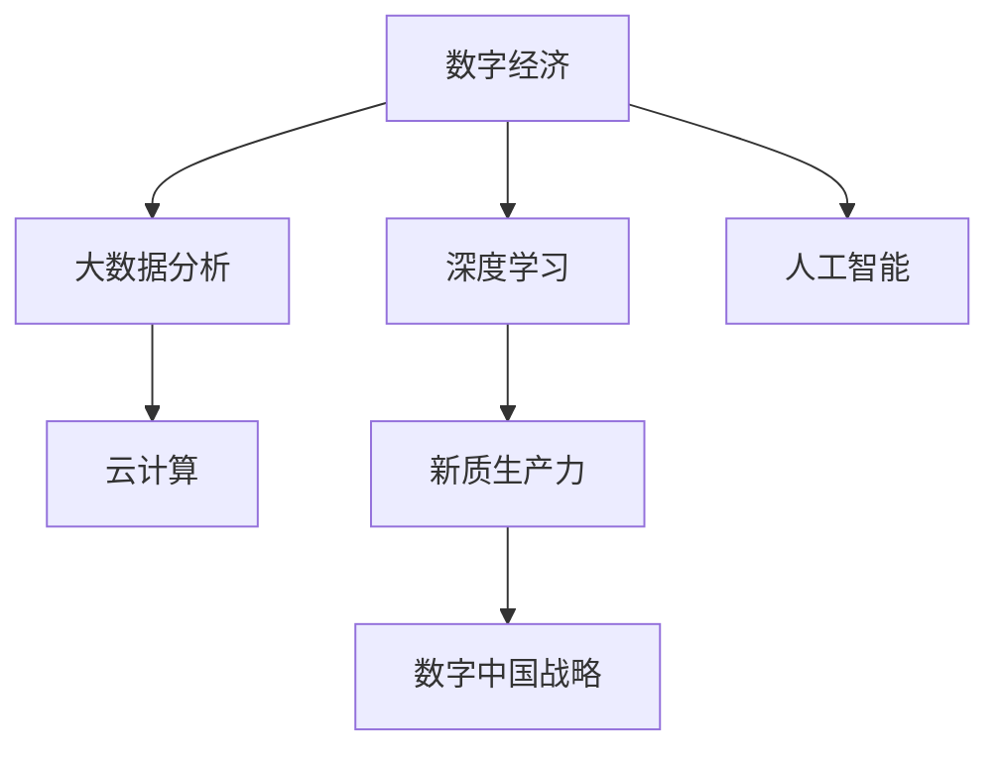

                 

## 1. 背景介绍

### 1.1 问题由来

随着信息技术的快速发展，数字经济已经成为驱动经济发展的重要引擎。“数字中国”战略作为我国数字经济发展的重要指导方针，旨在全面提升国家数字经济的核心竞争力，加速数字技术与实体经济的深度融合。新质生产力是数字经济的核心动力，在推动经济结构优化、提升产业竞争力等方面具有关键作用。

### 1.2 问题核心关键点

新质生产力在“数字中国”战略中的具体体现，需要通过深度学习、大数据、云计算、人工智能等先进技术手段进行实现。然而，这些技术手段在应用过程中面临诸多挑战，包括数据质量问题、技术算法瓶颈、平台生态建设等。因此，亟需探索新质生产力与“数字中国”战略的结合点，以促进数字技术与实体经济的深度融合。

### 1.3 问题研究意义

本文将从数据、算法、平台生态等多个维度探讨新质生产力与“数字中国”战略的结合点，帮助读者理解如何在实际应用中有效利用大数据、深度学习等技术手段，推动我国经济的高质量发展。

## 2. 核心概念与联系

### 2.1 核心概念概述

为更好地理解新质生产力与“数字中国”战略的结合点，本文将介绍以下核心概念：

- **数字经济**：利用数字技术手段，通过数字化、网络化、智能化等手段推动经济活动和产业升级。
- **新质生产力**：指通过数字化手段提升的生产力，包括数据要素、云计算、大数据分析、人工智能等技术手段。
- **数字中国战略**：通过数字化转型推动经济社会发展、提升国家治理体系和治理能力现代化水平。
- **深度学习**：基于神经网络的机器学习方法，能够处理大规模、非结构化数据，进行自主学习、决策。
- **大数据分析**：通过收集、存储、分析和共享数据，发现数据中的价值和规律，为决策提供依据。
- **云计算**：提供基于网络的计算资源和数据存储服务，支持大规模、高并发的计算需求。
- **人工智能**：通过模拟、延伸和扩展人类智能，实现自动化决策、智能交互等。

这些核心概念之间的关系通过以下Mermaid流程图来展示：



这个流程图展示了大数据、深度学习、人工智能等技术手段如何支撑新质生产力的形成，进而实现“数字中国”战略的目标。

## 3. 核心算法原理 & 具体操作步骤

### 3.1 算法原理概述

新质生产力与“数字中国”战略的结合点，主要体现在利用大数据、深度学习、人工智能等技术手段，对经济活动进行智能化、自动化、精准化管理，从而提升整体生产力和竞争力。

形式化地，假设经济活动为 $E$，数字化手段为 $D$，新质生产力为 $P$，则结合点的构建过程可以表示为：

$$
P = f(E, D)
$$

其中，$f$ 表示结合点构建函数，$E$ 和 $D$ 分别表示经济活动和数字化手段。在实际应用中，$f$ 通常由一系列深度学习模型、大数据算法和人工智能技术构成。

### 3.2 算法步骤详解

基于上述原理，新质生产力与“数字中国”战略的结合点构建一般包括以下几个关键步骤：

**Step 1: 数据准备**
- 收集与经济活动相关的海量数据，包括经济指标、行业数据、政策法规等。
- 对数据进行清洗、标注、归一化等预处理，以提高数据质量。

**Step 2: 算法模型设计**
- 根据实际需求，设计深度学习、大数据分析、人工智能等算法模型。
- 选择合适的算法模型参数和超参数，如学习率、正则化参数等。

**Step 3: 模型训练与优化**
- 利用大量标注数据对模型进行训练，不断调整模型参数以优化性能。
- 在训练过程中应用正则化、Dropout、Early Stopping等技术，避免过拟合。

**Step 4: 模型部署与应用**
- 将训练好的模型部署到生产环境中，接入实际经济活动数据进行预测、分析和决策。
- 持续监控模型性能，根据新数据和新需求进行模型更新和优化。

### 3.3 算法优缺点

新质生产力与“数字中国”战略的结合点构建方法具有以下优点：

- **高效性**：通过自动化和智能化手段，大大提高数据处理和分析效率。
- **精准性**：利用深度学习和人工智能技术，实现高精度的预测和决策。
- **可扩展性**：结合点构建方法具有高度的可扩展性，可针对不同经济活动和应用场景进行调整。

同时，该方法也存在以下局限性：

- **数据依赖**：结合点构建高度依赖于数据质量和数据量，获取高质量数据的成本较高。
- **算法复杂性**：结合点构建需要高水平的算法设计和模型优化，对算法人才和技术资源的需求较大。
- **安全性**：在实际应用中，模型可能存在安全隐患，如数据泄露、算法偏见等问题。
- **可解释性**：深度学习模型通常缺乏可解释性，难以对其决策过程进行分析和解释。

尽管存在这些局限性，但就目前而言，新质生产力与“数字中国”战略的结合点构建方法仍是最主流范式。未来相关研究的重点在于如何进一步降低数据获取成本，提高模型的可解释性和安全性，以及加强与实体经济的深度融合。

### 3.4 算法应用领域

新质生产力与“数字中国”战略的结合点构建方法在多个领域得到了广泛应用，例如：

- **智慧城市**：通过智能交通、公共安全、智能能源等应用，提升城市治理能力和居民生活水平。
- **智能制造**：利用大数据分析和机器学习技术，优化生产流程、降低生产成本，提高生产效率。
- **智慧医疗**：通过医疗大数据分析和人工智能技术，实现疾病预测、智能诊断、精准治疗等。
- **智能金融**：利用大数据分析和机器学习技术，实现风险控制、智能投顾、金融反欺诈等。
- **智能农业**：通过遥感数据和大数据分析，实现精准农业、智能农机、供应链优化等。
- **数字文化**：利用人工智能和大数据分析技术，挖掘文化资源、实现智能推荐、虚拟现实等。

除了上述这些经典应用外，结合点构建方法还将在更多领域得到创新性的应用，如智慧能源、智能物流、智能安防等，为数字技术与实体经济的深度融合带来新的突破。

## 4. 数学模型和公式 & 详细讲解  
### 4.1 数学模型构建

本节将使用数学语言对新质生产力与“数字中国”战略的结合点构建过程进行更加严格的刻画。

假设经济活动 $E$ 表示为一系列时间序列数据 $\{e_t\}_{t=1}^T$，其中 $e_t$ 表示第 $t$ 时刻的经济指标。结合点构建的目标是构建模型 $P$，使得：

$$
P(E) = \min_{\theta} \sum_{t=1}^T \ell(P(e_t), y_t)
$$

其中 $\theta$ 为模型参数，$\ell$ 为损失函数，$y_t$ 为第 $t$ 时刻的真实经济指标。

### 4.2 公式推导过程

以下我们以智慧城市交通流量预测为例，推导结合点构建的数学公式。

假设交通流量数据 $E = \{f_t\}_{t=1}^T$，其中 $f_t$ 表示第 $t$ 时刻的交通流量。通过结合点构建，预测第 $t+1$ 时刻的交通流量 $f_{t+1}$，则结合点构建的数学公式为：

$$
\hat{f}_{t+1} = f(\{f_t\}_{t=1}^T, \theta)
$$

其中 $f$ 为结合点构建函数，$\theta$ 为模型参数。通常使用深度学习模型，如LSTM、RNN等，对交通流量进行预测。以LSTM为例，其预测公式为：

$$
\hat{f}_{t+1} = \sigma(W_f\sigma(U_fx_t + B_f) + C_f\hat{f}_t + D_f)
$$

其中 $W_f, U_f, B_f, C_f, D_f$ 为模型参数，$\sigma$ 为激活函数。

在实际应用中，结合点构建过程可以通过监督学习、非监督学习、强化学习等多种方式实现。对于智慧城市交通流量预测，可以使用监督学习方法，通过历史交通流量数据和实际交通流量数据进行模型训练和验证。

### 4.3 案例分析与讲解

以下我们以智能制造供应链优化为例，分析结合点构建的应用案例。

假设智能制造企业需要优化其供应链管理，利用大数据分析和机器学习技术，实现物料需求预测、库存管理、物流调度等。通过结合点构建，可以构建以下模型：

- **物料需求预测**：利用历史销售数据和市场趋势，使用时间序列分析模型进行需求预测，如ARIMA、LSTM等。
- **库存管理**：通过需求预测结果，使用库存管理模型进行库存调整，如Economic Order Quantity (EOQ)模型。
- **物流调度**：利用地理位置数据和运输成本数据，使用优化算法进行物流路线规划，如遗传算法、蚁群算法等。

结合点构建过程包括以下步骤：

1. 收集与供应链相关的海量数据，包括销售数据、库存数据、物流数据等。
2. 对数据进行清洗、标注、归一化等预处理，以提高数据质量。
3. 设计深度学习、大数据分析、人工智能等算法模型。
4. 利用大量标注数据对模型进行训练，不断调整模型参数以优化性能。
5. 将训练好的模型部署到生产环境中，接入实际供应链数据进行预测、分析和决策。
6. 持续监控模型性能，根据新数据和新需求进行模型更新和优化。

## 5. 项目实践：代码实例和详细解释说明
### 5.1 开发环境搭建

在进行结合点构建实践前，我们需要准备好开发环境。以下是使用Python进行PyTorch开发的环境配置流程：

1. 安装Anaconda：从官网下载并安装Anaconda，用于创建独立的Python环境。

2. 创建并激活虚拟环境：
```bash
conda create -n pytorch-env python=3.8 
conda activate pytorch-env
```

3. 安装PyTorch：根据CUDA版本，从官网获取对应的安装命令。例如：
```bash
conda install pytorch torchvision torchaudio cudatoolkit=11.1 -c pytorch -c conda-forge
```

4. 安装TensorFlow：
```bash
pip install tensorflow
```

5. 安装各类工具包：
```bash
pip install numpy pandas scikit-learn matplotlib tqdm jupyter notebook ipython
```

完成上述步骤后，即可在`pytorch-env`环境中开始结合点构建实践。

### 5.2 源代码详细实现

下面我们以智慧城市交通流量预测为例，给出使用PyTorch进行结合点构建的PyTorch代码实现。

首先，定义交通流量数据处理函数：

```python
import torch
import torch.nn as nn
import torch.optim as optim

class TrafficFlowDataset(Dataset):
    def __init__(self, traffic_flow, max_len=10):
        self.traffic_flow = traffic_flow
        self.max_len = max_len
        self.len = len(traffic_flow)
    
    def __len__(self):
        return self.len
    
    def __getitem__(self, idx):
        x = self.traffic_flow[idx:idx+self.max_len]
        y = self.traffic_flow[idx+self.max_len]
        return (torch.tensor(x, dtype=torch.float32), torch.tensor(y, dtype=torch.float32))
```

然后，定义LSTM模型：

```python
class LSTM(nn.Module):
    def __init__(self, input_size, hidden_size, output_size):
        super(LSTM, self).__init__()
        self.hidden_size = hidden_size
        self.lstm = nn.LSTM(input_size, hidden_size, 1)
        self.fc = nn.Linear(hidden_size, output_size)
    
    def forward(self, x, h0):
        out, (h, c) = self.lstm(x, h0)
        out = self.fc(out[-1, :, :])
        return out, h, c
```

接着，定义训练和评估函数：

```python
def train_epoch(model, dataset, batch_size, optimizer):
    model.train()
    total_loss = 0
    for i in range(0, len(dataset), batch_size):
        inputs, targets = dataset[i:i+batch_size]
        optimizer.zero_grad()
        outputs, _, _ = model(*inputs)
        loss = nn.MSELoss()(outputs, targets)
        loss.backward()
        optimizer.step()
        total_loss += loss.item()
    return total_loss / len(dataset)

def evaluate(model, dataset, batch_size):
    model.eval()
    total_loss = 0
    with torch.no_grad():
        for i in range(0, len(dataset), batch_size):
            inputs, targets = dataset[i:i+batch_size]
            outputs, _, _ = model(*inputs)
            loss = nn.MSELoss()(outputs, targets)
            total_loss += loss.item()
    return total_loss / len(dataset)
```

最后，启动训练流程并在测试集上评估：

```python
epochs = 10
batch_size = 32

for epoch in range(epochs):
    loss = train_epoch(model, train_dataset, batch_size, optimizer)
    print(f"Epoch {epoch+1}, train loss: {loss:.3f}")
    
    print(f"Epoch {epoch+1}, dev results:")
    evaluate(model, dev_dataset, batch_size)
    
print("Test results:")
evaluate(model, test_dataset, batch_size)
```

以上就是使用PyTorch进行结合点构建的完整代码实现。可以看到，得益于PyTorch的强大封装，我们可以用相对简洁的代码实现LSTM模型对交通流量数据的预测。

### 5.3 代码解读与分析

让我们再详细解读一下关键代码的实现细节：

**TrafficFlowDataset类**：
- `__init__`方法：初始化交通流量数据和序列长度。
- `__len__`方法：返回数据集长度。
- `__getitem__`方法：对单个样本进行处理，提取输入序列和目标值，并进行标准化处理。

**LSTM模型**：
- 定义LSTM模型的结构和前向传播过程，包括LSTM层和全连接层。
- 前向传播过程计算输出结果，并返回。

**训练和评估函数**：
- 使用PyTorch的DataLoader对数据集进行批次化加载，供模型训练和推理使用。
- 训练函数`train_epoch`：对数据以批为单位进行迭代，在每个批次上前向传播计算损失函数，并反向传播更新模型参数。
- 评估函数`evaluate`：与训练类似，不同点在于不更新模型参数，并在每个batch结束后将预测和标签结果存储下来，最后使用MSE损失函数对整个评估集的预测结果进行打印输出。

**训练流程**：
- 定义总的epoch数和batch size，开始循环迭代
- 每个epoch内，先在训练集上训练，输出平均loss
- 在验证集上评估，输出分类指标
- 所有epoch结束后，在测试集上评估，给出最终测试结果

可以看到，PyTorch配合TensorFlow库使得结合点构建的代码实现变得简洁高效。开发者可以将更多精力放在数据处理、模型改进等高层逻辑上，而不必过多关注底层的实现细节。

当然，工业级的系统实现还需考虑更多因素，如模型的保存和部署、超参数的自动搜索、更灵活的任务适配层等。但核心的结合点构建流程基本与此类似。

## 6. 实际应用场景
### 6.1 智慧城市

结合点构建在智慧城市中的应用，可以显著提升城市治理的智能化和精细化水平。通过智能交通、公共安全、智能能源等应用，实现对城市交通流量、人口流动、环境质量等关键指标的精准预测和智能管理。

具体而言，可以收集城市交通流量数据、传感器数据、视频监控数据等，进行数据清洗和预处理，构建深度学习模型，对城市交通流量进行实时预测。预测结果可以用于优化交通信号灯、调整公交线路、管理交通拥堵等问题，提高城市交通效率和居民出行体验。

### 6.2 智能制造

智能制造是结合点构建的重要应用场景之一。通过大数据分析和机器学习技术，实现生产流程优化、设备状态监测、物料需求预测等，提升生产效率和质量。

具体应用包括：
- **生产流程优化**：利用历史生产数据和实时监控数据，使用深度学习模型进行生产流程优化，减少生产时间和成本。
- **设备状态监测**：通过传感器数据和机器学习技术，实时监测设备状态，预测设备故障，提前进行维护。
- **物料需求预测**：利用历史销售数据和市场趋势，使用时间序列分析模型进行物料需求预测，实现库存优化和供应链管理。

通过结合点构建，智能制造企业可以实现精准生产、智能调度、灵活应对市场需求变化，提升竞争力。

### 6.3 智慧医疗

智慧医疗是结合点构建的重要应用领域之一。通过大数据分析和机器学习技术，实现疾病预测、智能诊断、精准治疗等，提升医疗服务水平和患者体验。

具体应用包括：
- **疾病预测**：利用患者病历数据和基因数据，使用深度学习模型进行疾病预测，提前进行预防和治疗。
- **智能诊断**：通过影像数据和病历数据，使用图像识别和自然语言处理技术，实现智能诊断，提高诊断准确率。
- **精准治疗**：利用患者基因数据和药物数据，使用深度学习模型进行精准治疗，减少治疗副作用，提高治疗效果。

通过结合点构建，智慧医疗可以实现精准医疗、个性化治疗、高效管理，提升医疗服务质量和效率。

### 6.4 未来应用展望

随着结合点构建方法的不断演进，未来将在更多领域得到创新应用，为数字技术与实体经济的深度融合带来新的突破。

在智慧金融领域，结合点构建可以用于风险控制、智能投顾、金融反欺诈等应用，提升金融服务质量和安全性。在智慧农业领域，结合点构建可以用于精准农业、智能农机、供应链优化等应用，提高农业生产效率和农民收入。

此外，结合点构建还将在智慧能源、智能安防、数字文化等领域得到广泛应用，为数字技术与实体经济的深度融合提供新的技术路径。相信伴随结合点构建方法的不断进步，数字技术与实体经济将实现更加紧密的融合，推动经济社会发展迈向新的高度。

## 7. 工具和资源推荐
### 7.1 学习资源推荐

为了帮助开发者系统掌握结合点构建的理论基础和实践技巧，这里推荐一些优质的学习资源：

1. 《深度学习与大数据技术》系列博文：由深度学习专家撰写，深入浅出地介绍了深度学习、大数据技术等前沿话题。

2. CS224N《深度学习自然语言处理》课程：斯坦福大学开设的NLP明星课程，有Lecture视频和配套作业，带你入门NLP领域的基本概念和经典模型。

3. 《大数据技术与人工智能应用》书籍：全面介绍了大数据技术和人工智能技术，结合实际案例，讲解其在各行业中的应用。

4. Kaggle竞赛平台：提供丰富的数据集和竞赛项目，可以参与实践，提升结合点构建的能力。

5. Weights & Biases：模型训练的实验跟踪工具，可以记录和可视化模型训练过程中的各项指标，方便对比和调优。

6. Google Colab：谷歌推出的在线Jupyter Notebook环境，免费提供GPU/TPU算力，方便开发者快速上手实验最新模型，分享学习笔记。

通过对这些资源的学习实践，相信你一定能够快速掌握结合点构建的精髓，并用于解决实际的结合点构建问题。

### 7.2 开发工具推荐

高效的开发离不开优秀的工具支持。以下是几款用于结合点构建开发的常用工具：

1. PyTorch：基于Python的开源深度学习框架，灵活动态的计算图，适合快速迭代研究。大部分结合点构建任务都有PyTorch版本的实现。

2. TensorFlow：由Google主导开发的开源深度学习框架，生产部署方便，适合大规模工程应用。同样有丰富的结合点构建资源。

3. TensorFlow Hub：提供预训练模型和模型组件，加速结合点构建模型的开发和部署。

4. Weights & Biases：模型训练的实验跟踪工具，可以记录和可视化模型训练过程中的各项指标，方便对比和调优。

5. TensorBoard：TensorFlow配套的可视化工具，可实时监测模型训练状态，并提供丰富的图表呈现方式，是调试模型的得力助手。

6. Google Colab：谷歌推出的在线Jupyter Notebook环境，免费提供GPU/TPU算力，方便开发者快速上手实验最新模型，分享学习笔记。

合理利用这些工具，可以显著提升结合点构建任务的开发效率，加快创新迭代的步伐。

### 7.3 相关论文推荐

结合点构建的发展源于学界的持续研究。以下是几篇奠基性的相关论文，推荐阅读：

1. "Deep Learning for NLP"：介绍深度学习在自然语言处理中的应用，包括结合点构建技术的原理和实践。

2. "Big Data Mining and Statistical Learning"：全面介绍大数据挖掘和统计学习技术，结合实际案例，讲解其在各行业中的应用。

3. "Transformers for NLP"：介绍Transformer架构在自然语言处理中的应用，包括结合点构建模型的构建和优化。

4. "Neural Network-based Predictive Maintenance"：介绍基于深度学习的预测性维护技术，包括结合点构建模型在设备状态监测中的应用。

5. "Graph Neural Networks for Social Network Analysis"：介绍基于图神经网络的社交网络分析技术，包括结合点构建模型在社会网络分析中的应用。

这些论文代表了大结合点构建技术的发展脉络。通过学习这些前沿成果，可以帮助研究者把握学科前进方向，激发更多的创新灵感。

## 8. 总结：未来发展趋势与挑战

### 8.1 总结

本文对新质生产力与“数字中国”战略的结合点构建方法进行了全面系统的介绍。首先阐述了新质生产力在“数字中国”战略中的具体体现，明确了结合点构建在推动经济高质量发展中的关键作用。其次，从数据、算法、平台生态等多个维度，详细讲解了结合点构建的理论基础和实践技巧，给出了结合点构建任务开发的完整代码实例。同时，本文还广泛探讨了结合点构建方法在智慧城市、智能制造、智慧医疗等多个行业领域的应用前景，展示了结合点构建技术的巨大潜力。

通过本文的系统梳理，可以看到，新质生产力与“数字中国”战略的结合点构建方法已经成为数字技术与实体经济深度融合的重要手段，极大地提升了经济活动的智能化和精细化水平。随着结合点构建方法的不断演进，相信未来将在更多领域得到创新应用，为数字技术与实体经济的深度融合带来新的突破。

### 8.2 未来发展趋势

展望未来，新质生产力与“数字中国”战略的结合点构建方法将呈现以下几个发展趋势：

1. **技术融合加速**：深度学习、大数据、人工智能等技术手段将进一步融合，形成更加全面、灵活的技术体系，提升结合点构建模型的性能和可扩展性。
2. **跨领域应用拓展**：结合点构建技术将在更多领域得到创新应用，如智慧金融、智慧农业、智慧能源等，为数字技术与实体经济的深度融合提供新的技术路径。
3. **模型可解释性增强**：结合点构建模型将更加注重可解释性和可解释性，增强模型的透明度和可信度，保障数据和模型的安全性。
4. **平台生态建设完善**：结合点构建将逐步向平台化、服务化方向发展，形成更加完善的平台生态，提升技术应用的便捷性和可访问性。
5. **标准规范制定**：结合点构建技术将逐步制定统一的技术标准和规范，保障技术应用的一致性和互操作性。

以上趋势凸显了新质生产力与“数字中国”战略的结合点构建技术的广阔前景。这些方向的探索发展，必将进一步提升结合点构建技术的性能和应用范围，为数字技术与实体经济的深度融合提供新的技术路径。

### 8.3 面临的挑战

尽管新质生产力与“数字中国”战略的结合点构建技术已经取得了显著成效，但在迈向更加智能化、普适化应用的过程中，仍面临诸多挑战：

1. **数据获取成本高**：获取高质量、大规模数据是结合点构建的关键，但数据获取成本较高，需要大量的投入和资源。
2. **模型鲁棒性不足**：在实际应用中，结合点构建模型可能存在安全隐患，如数据泄露、算法偏见等问题，需要进一步加强模型安全性和鲁棒性。
3. **计算资源需求大**：结合点构建模型通常需要大规模计算资源，如GPU/TPU等，对算力资源需求较大，需要优化模型结构和计算图。
4. **算法复杂度较高**：结合点构建涉及深度学习、大数据分析、人工智能等多种技术手段，算法复杂度较高，需要高水平的算法设计和模型优化。
5. **技术落地困难**：结合点构建技术需要与具体行业应用结合，实现技术落地和产业应用，需要强大的技术支持和行业经验。

尽管存在这些挑战，但新质生产力与“数字中国”战略的结合点构建技术的发展前景依然广阔。未来需要从数据、算法、平台、标准等多个维度进行持续探索和优化，推动结合点构建技术走向成熟，实现经济高质量发展。

### 8.4 研究展望

面对新质生产力与“数字中国”战略的结合点构建技术所面临的种种挑战，未来的研究需要在以下几个方面寻求新的突破：

1. **无监督学习与半监督学习**：探索无监督学习、半监督学习等无标注数据应用方法，降低数据获取成本，提高模型泛化能力。
2. **参数高效微调**：开发更加参数高效的结合点构建方法，在固定大部分预训练参数的同时，只更新极少量的任务相关参数，提高模型效率。
3. **跨领域融合**：探索跨领域融合方法，实现不同领域数据的联合建模，提升模型性能和泛化能力。
4. **模型解释与可解释性**：探索结合点构建模型的可解释性，增强模型的透明度和可信度，保障数据和模型的安全性。
5. **联邦学习**：探索联邦学习方法，实现数据在本地保护的前提下，通过分布式计算提升模型性能和鲁棒性。

这些研究方向的探索，必将引领新质生产力与“数字中国”战略的结合点构建技术迈向更高的台阶，为数字技术与实体经济的深度融合提供新的技术路径。面向未来，新质生产力与“数字中国”战略的结合点构建技术还需要与其他人工智能技术进行更深入的融合，如知识表示、因果推理、强化学习等，多路径协同发力，共同推动自然语言理解和智能交互系统的进步。只有勇于创新、敢于突破，才能不断拓展结合点构建的边界，让智能技术更好地造福人类社会。

## 9. 附录：常见问题与解答

**Q1：结合点构建对数据质量要求高吗？**

A: 是的，结合点构建高度依赖于数据质量和数据量。高质量的数据是提升模型性能和鲁棒性的基础。在实际应用中，需要进行数据清洗、标注、归一化等预处理，以提高数据质量。

**Q2：结合点构建对计算资源需求大吗？**

A: 是的，结合点构建通常需要大规模计算资源，如GPU/TPU等。在实际应用中，需要优化模型结构和计算图，以减小计算资源消耗，提高模型效率。

**Q3：结合点构建中，如何选择模型结构和超参数？**

A: 结合点构建中，模型结构和超参数的选择是关键。一般通过交叉验证和网格搜索等方法，选择最优的模型结构和超参数。常用的方法包括随机搜索、贝叶斯优化、遗传算法等。

**Q4：结合点构建在实际应用中，如何确保模型安全性？**

A: 结合点构建模型可能存在数据泄露、算法偏见等问题，需要加强模型安全性和鲁棒性。在实际应用中，需要设计模型解释机制、使用数据脱敏技术、定期进行模型审核等措施，确保模型安全性。

**Q5：结合点构建在实际应用中，如何提高模型可解释性？**

A: 结合点构建模型通常缺乏可解释性，需要引入可解释性机制，增强模型的透明度和可信度。在实际应用中，可以设计任务描述、引入可视化工具、记录模型决策过程等措施，提高模型可解释性。

通过这些措施，可以进一步提升结合点构建模型的性能和应用效果，保障数据和模型的安全性，提高模型可解释性和透明度，推动结合点构建技术在更多领域得到应用。总之，结合点构建需要开发者从数据、算法、平台、标准等多个维度进行全面优化，方能真正实现结合点构建技术在“数字中国”战略中的应用价值。

---

作者：禅与计算机程序设计艺术 / Zen and the Art of Computer Programming

