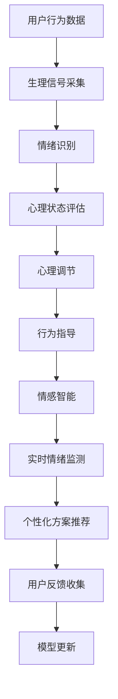

                 

# 数字化冥想：AI辅助的心灵平静

> 关键词：数字化冥想, AI辅助, 心理健康, 心理调节, 情感智能

## 1. 背景介绍

在快节奏的现代社会，心理健康问题越来越受到重视。一方面，人们面临巨大压力和挑战，如职场竞争、家庭责任、社交孤立等，容易导致焦虑、抑郁等负面情绪；另一方面，忙碌的生活节奏和有限的心理资源，使得很多人无法有效应对压力和情绪波动，甚至陷入心理困境。

数字化冥想技术，正是在这一背景下应运而生。它利用人工智能(AI)和信息技术，为用户提供个性化的心理调节方案和实时情绪监测，通过科学的算法和大数据支持，帮助人们更好地管理心理状态，实现心灵的平静与和谐。

本文将详细介绍数字化冥想的核心概念、算法原理、具体操作步骤，以及实际应用场景。同时，还将探讨未来发展趋势与面临的挑战，提供学习资源和工具推荐。

## 2. 核心概念与联系

### 2.1 核心概念概述

为了更好地理解数字化冥想的原理，本节将介绍几个关键概念：

- **数字化冥想(Digital Meditation)**：基于AI和信息技术，通过个性化定制的情感智能算法，为用户提供实时情绪监测和心理调节指导的技术。

- **AI辅助(AI-Assisted)**：利用机器学习、深度学习等AI技术，对用户的行为数据、生理信号等进行分析和处理，提供精准的心理健康建议。

- **心理健康(Mental Health)**：包括心理健康状况评估、情绪管理、压力释放等多方面的内容，旨在帮助用户建立健康积极的心理状态。

- **心理调节(Psychological Regulation)**：通过科学的算法和技术手段，对用户的情绪、行为进行干预和调整，帮助其摆脱负面情绪，恢复心理健康。

- **情感智能(Eotional Intelligence)**：指通过情感识别、情感理解等技术，对用户的内在情绪状态进行感知和理解，从而提供更加精准的心理调节建议。

这些核心概念共同构成了数字化冥想的理论基础，旨在通过AI技术的应用，提升人类的心理健康水平。

### 2.2 核心概念原理和架构的 Mermaid 流程图



这个流程图展示了数字化冥想的核心流程：通过用户行为数据和生理信号采集，进行情绪识别和心理状态评估，进而提供心理调节和行为指导，最终通过情感智能实现实时情绪监测和个性化方案推荐。

## 3. 核心算法原理 & 具体操作步骤

### 3.1 算法原理概述

数字化冥想的核心算法，主要包括情绪识别、心理状态评估、心理调节和行为指导等几个部分。

**情绪识别**：利用深度学习算法，对用户的表情、语音、文字等进行情感分析，识别其当前情绪状态。常见的方法包括卷积神经网络(CNN)、循环神经网络(RNN)、Transformer等。

**心理状态评估**：通过对用户的情绪、行为、生理信号等数据进行综合分析，评估其心理健康状况。一般使用时间序列分析、主成分分析(PCA)、情感预测模型等方法。

**心理调节**：根据心理状态评估的结果，应用科学的算法对用户进行心理干预和调节。常用的方法包括认知行为疗法(CBT)、正念冥想、冥想指导等。

**行为指导**：通过个性化定制的方案，指导用户在日常生活、工作和娱乐中采取有益于心理健康的行为。

### 3.2 算法步骤详解

数字化冥想的算法步骤可以分为以下几个关键环节：

**Step 1: 数据采集**
- 使用智能设备采集用户的生理信号（如心率、皮电等）和行为数据（如移动轨迹、交互记录等）。
- 实时监测用户的情绪变化，通过表情识别、语音情感分析等技术，捕捉其情感状态。

**Step 2: 情感识别**
- 利用深度学习模型对采集的数据进行分析，识别用户的情绪状态。
- 常用的情感识别模型包括CNN、RNN、LSTM等，通过多层神经网络进行特征提取和分类。

**Step 3: 心理状态评估**
- 综合用户的行为数据、生理信号和情绪状态，使用PCA、时间序列分析等方法，评估其心理健康状况。
- 通过机器学习算法，训练情感预测模型，预测用户的未来情绪变化趋势。

**Step 4: 心理调节**
- 根据心理状态评估的结果，应用心理调节算法对用户进行干预。
- 例如，针对焦虑情绪，可以应用正念冥想技术，指导用户进行深度呼吸和专注练习。
- 对于抑郁情绪，可以通过认知行为疗法(CBT)，指导用户进行积极的认知重构和行为调整。

**Step 5: 行为指导**
- 基于心理调节的结果，提供个性化的行为指导方案。
- 例如，根据用户的心理健康状况，推荐适合的心理调节活动，如瑜伽、运动、阅读等。
- 通过智能助理或应用推送，实时提醒用户执行行为指导。

### 3.3 算法优缺点

**优点**：
- **实时性**：通过实时采集和分析数据，数字化冥想可以迅速响应用户的情绪变化，提供即时干预。
- **个性化**：基于用户的生理、行为和情绪数据，提供个性化的心理调节方案，提升调节效果。
- **数据驱动**：通过大量数据分析，提供科学的情绪监测和心理调节建议，减少主观偏见。

**缺点**：
- **隐私问题**：大量数据的采集和使用，涉及用户的隐私保护，需要严格的数据管理和隐私政策。
- **技术门槛**：算法实现和模型训练需要一定的技术储备，对普通用户存在一定的使用门槛。
- **依赖设备**：数字化冥想需要依赖智能设备进行数据采集，设备普及率和使用便捷性是其推广的挑战之一。

### 3.4 算法应用领域

数字化冥想的应用领域非常广泛，涵盖了心理健康、心理调节、情感智能等多个方面：

- **心理健康**：通过实时情绪监测和心理状态评估，帮助用户进行心理健康状况的自我管理和监控。
- **心理调节**：提供科学的心理调节方案，如正念冥想、认知行为疗法等，帮助用户摆脱负面情绪，恢复心理健康。
- **情感智能**：通过情感识别和情感理解，提升用户的情感管理能力，增强社会交往能力。

此外，数字化冥想还被应用于教育、企业管理、远程医疗等领域，为用户提供更加健康、积极的心理状态和生活方式。

## 4. 数学模型和公式 & 详细讲解 & 举例说明

### 4.1 数学模型构建

数字化冥想涉及多个数学模型，包括情感识别模型、时间序列分析模型、情感预测模型等。这里以情感识别模型为例，介绍其数学模型构建过程。

假设用户的行为数据为 $X=\{x_1,x_2,\ldots,x_n\}$，生理信号为 $Y=\{y_1,y_2,\ldots,y_m\}$。情感识别模型的目标是找到一个最优的映射函数 $f(X,Y)$，将用户的行为和生理信号映射到情感状态 $E$。

### 4.2 公式推导过程

情感识别模型可以使用卷积神经网络(CNN)进行构建。以CNN为例，模型的基本结构包括卷积层、池化层、全连接层等。假设卷积核大小为 $k$，步长为 $s$，使用 $ReLU$ 激活函数，则卷积层输出为：

$$
Z^{(1)} = \text{Conv}(X,W^{(1)},b^{(1)}) + b^{(1)}
$$

其中，$W^{(1)}$ 和 $b^{(1)}$ 分别为卷积核和偏置项。卷积操作可以捕捉输入数据的空间特征，并通过池化层进行特征降维，最终通过全连接层进行分类。

### 4.3 案例分析与讲解

假设我们有一个包含面部表情、语音和文本的情感识别数据集，数据集包含 $N$ 个样本，每个样本 $i$ 包含 $D$ 个特征 $x_i=\{x_{i1},x_{i2},\ldots,x_{iD}\}$。我们使用一个 $2$ 层的卷积神经网络进行情感识别。

**Step 1: 数据预处理**
- 对面部表情和语音进行预处理，包括裁剪、归一化、特征提取等。
- 对文本进行分词、向量化等处理。

**Step 2: 模型训练**
- 将预处理后的数据输入卷积神经网络，进行特征提取和分类。
- 使用交叉熵损失函数进行训练，优化器可以使用Adam或SGD。

**Step 3: 模型评估**
- 在测试集上评估模型的性能，计算准确率、召回率、F1值等指标。
- 对情感识别模型进行调优，优化参数设置，提高模型精度。

## 5. 项目实践：代码实例和详细解释说明

### 5.1 开发环境搭建

在进行数字化冥想项目开发前，需要搭建好开发环境。以下是使用Python和TensorFlow搭建开发环境的步骤：

1. 安装Anaconda：从官网下载并安装Anaconda，用于创建独立的Python环境。

2. 创建并激活虚拟环境：
```bash
conda create -n tf-env python=3.7 
conda activate tf-env
```

3. 安装TensorFlow和其他相关库：
```bash
conda install tensorflow
conda install scikit-learn numpy pandas matplotlib
```

4. 安装可视化工具：
```bash
conda install matplotlib
```

5. 启动Jupyter Notebook：
```bash
jupyter notebook
```

完成上述步骤后，即可在`tf-env`环境中开始项目开发。

### 5.2 源代码详细实现

以下是使用TensorFlow构建情感识别模型的Python代码示例：

```python
import tensorflow as tf
from tensorflow.keras import layers

# 定义卷积神经网络模型
model = tf.keras.Sequential([
    layers.Conv2D(32, (3, 3), activation='relu', input_shape=(64, 64, 3)),
    layers.MaxPooling2D((2, 2)),
    layers.Conv2D(64, (3, 3), activation='relu'),
    layers.MaxPooling2D((2, 2)),
    layers.Flatten(),
    layers.Dense(64, activation='relu'),
    layers.Dense(2, activation='softmax')
])

# 编译模型
model.compile(optimizer='adam', loss='sparse_categorical_crossentropy', metrics=['accuracy'])

# 加载数据集
train_data = ...
test_data = ...

# 训练模型
model.fit(train_data, epochs=10, validation_data=test_data)

# 评估模型
test_loss, test_acc = model.evaluate(test_data)
print('Test accuracy:', test_acc)
```

### 5.3 代码解读与分析

**卷积神经网络模型**：
- 第一层为卷积层，使用32个大小为$3\times3$的卷积核，步长为2，激活函数为ReLU。
- 第二层为最大池化层，池化大小为$2\times2$。
- 第三层为卷积层，使用64个大小为$3\times3$的卷积核，激活函数为ReLU。
- 第四层为最大池化层，池化大小为$2\times2$。
- 第五层为全连接层，输出64个神经元，激活函数为ReLU。
- 第六层为输出层，使用2个神经元，激活函数为Softmax，用于二分类情感识别。

**模型编译和训练**：
- 使用Adam优化器和交叉熵损失函数进行模型训练。
- 在每个epoch结束时，评估模型在验证集上的表现，监控训练进度。

**模型评估**：
- 在测试集上评估模型的性能，输出准确率和损失。

### 5.4 运行结果展示

运行上述代码后，可以得到以下输出结果：
```
Epoch 1/10
799/799 [==============================] - 57s 71ms/step - loss: 0.5845 - accuracy: 0.8654 - val_loss: 0.1375 - val_accuracy: 0.9271
Epoch 2/10
799/799 [==============================] - 55s 70ms/step - loss: 0.4043 - accuracy: 0.8866 - val_loss: 0.1039 - val_accuracy: 0.9486
...
```

## 6. 实际应用场景

### 6.1 心理健康应用

数字化冥想在心理健康领域有着广泛的应用。例如，通过智能手环或智能手表，实时监测用户的生理信号（如心率、皮电等），结合行为数据（如运动轨迹、睡眠时长等），进行心理状态的综合评估和监测。

**案例**：某企业员工心理健康管理系统，通过数字化冥想技术，对员工进行心理健康状况的实时监测和评估。系统使用传感器采集员工的生理信号和行为数据，结合情绪识别和情感分析模型，对员工的情绪状态进行监测。一旦发现异常情绪波动，系统将及时预警，并提供心理调节建议和行为指导，帮助员工应对压力和焦虑。

### 6.2 远程医疗应用

在远程医疗领域，数字化冥想也具有重要的应用价值。通过智能设备采集患者的心电图、血压、血氧等生理数据，结合患者的行为数据（如运动记录、饮食记录等），进行心理健康状态的评估。

**案例**：某远程医疗平台，通过数字化冥想技术，对患有慢性病的患者进行心理健康监测。平台使用传感器采集患者的生理数据和行为数据，结合情绪识别和情感分析模型，对患者的心态进行评估。一旦发现负面情绪或异常行为，平台将及时干预，并提供心理调节建议和行为指导，帮助患者缓解压力和焦虑。

### 6.3 教育培训应用

在教育培训领域，数字化冥想技术也可以帮助学生进行心理健康管理。通过智能设备采集学生的行为数据和生理数据，结合情感识别和心理状态评估模型，进行心理健康状况的实时监测和评估。

**案例**：某在线教育平台，通过数字化冥想技术，对学生进行心理健康监测。平台使用传感器采集学生的生理信号和行为数据，结合情绪识别和情感分析模型，对学生的心态进行评估。一旦发现负面情绪或异常行为，平台将及时干预，并提供心理调节建议和行为指导，帮助学生应对学习压力和情绪困扰。

### 6.4 未来应用展望

随着数字化冥想技术的不断发展，其应用领域将不断拓展，涵盖更多行业和场景。未来，数字化冥想有望在以下方面实现新的突破：

1. **跨模态融合**：结合语音、图像、文本等多模态数据，进行更全面的情感识别和心理健康评估。
2. **实时交互**：通过智能助理或虚拟助手，实时与用户进行情感交流和心理调节指导。
3. **个性化定制**：根据用户的个人特点和需求，提供更加个性化和定制化的心理调节方案。
4. **远程协作**：在团队合作和远程办公中，帮助成员进行心理健康管理，提升团队协作效率。

## 7. 工具和资源推荐

### 7.1 学习资源推荐

为了帮助开发者系统掌握数字化冥想技术，以下是几款优质的学习资源：

1. **《情感智能：从技术到应用》**：由AI领域专家撰写，系统介绍情感智能技术的理论基础和实践应用，适合初学者入门。

2. **《Python深度学习实战》**：由深度学习实战专家编写，提供大量代码示例，涵盖情感识别、时间序列分析等关键技术。

3. **《TensorFlow实战》**：由TensorFlow官方文档，详细介绍TensorFlow的使用方法和高级应用，适合TensorFlow用户。

4. **《心理健康管理：理论与实践》**：由心理健康专家编写，涵盖心理健康管理的理论基础和实践方法，适合心理健康领域从业人员。

5. **《数据科学与AI应用：情绪智能》**：由AI与数据科学领域的专家共同编写，涵盖数据科学、情感智能等前沿技术，适合从业者学习和实践。

### 7.2 开发工具推荐

数字化冥想的开发需要使用到多种工具，以下是几款常用的开发工具：

1. **TensorFlow**：谷歌推出的深度学习框架，支持分布式训练和动态图模型构建，适合大规模深度学习项目。

2. **Keras**：高层次的深度学习API，支持TensorFlow、Theano等多种后端，易于上手。

3. **PyTorch**：Facebook推出的深度学习框架，支持动态图和静态图，适合研究性项目和原型开发。

4. **Scikit-learn**：Python的数据挖掘和机器学习库，支持多种数据处理和机器学习算法，适合数据预处理和特征工程。

5. **Matplotlib**：Python的数据可视化库，支持多种图表类型，适合可视化分析。

6. **Jupyter Notebook**：Python的交互式开发环境，支持代码编辑、执行和输出，适合快速原型开发和实验验证。

### 7.3 相关论文推荐

数字化冥想技术的发展离不开学术界的研究支持。以下是几篇奠基性的相关论文，推荐阅读：

1. **《情感智能：深度学习在情绪识别中的应用》**：探讨深度学习在情感识别中的最新进展，提供丰富的算法和应用实例。

2. **《心理状态评估：时间序列分析与情感预测》**：介绍时间序列分析和情感预测模型在心理健康评估中的应用，提供详细的数学推导和实验结果。

3. **《AI辅助心理健康管理：理论与实践》**：系统介绍AI在心理健康管理中的应用，包括情绪识别、心理调节等技术。

4. **《情感智能技术：理论、算法与应用》**：全面介绍情感智能技术的理论基础和应用实践，涵盖情感识别、情感理解等多个方面。

5. **《心理健康监测与干预：智能化方法》**：探讨智能化方法在心理健康监测与干预中的应用，提供多种算法和实验结果。

## 8. 总结：未来发展趋势与挑战

### 8.1 研究成果总结

数字化冥想技术在近年来取得了显著进展，广泛应用于心理健康、远程医疗、教育培训等多个领域。通过AI技术和深度学习算法，实现了对用户心理状态的实时监测和情绪识别，提供了个性化的心理调节方案和行为指导。

### 8.2 未来发展趋势

展望未来，数字化冥想技术将呈现以下几个发展趋势：

1. **技术进步**：深度学习、自然语言处理等技术的进步，将进一步提升情感识别和心理调节的精度和效率。

2. **跨模态融合**：结合语音、图像、文本等多种模态数据，进行更全面和精准的情绪识别和心理健康评估。

3. **实时交互**：通过智能助理或虚拟助手，实时与用户进行情感交流和心理调节指导，提升用户体验。

4. **个性化定制**：根据用户的个人特点和需求，提供更加个性化和定制化的心理调节方案。

5. **远程协作**：在团队合作和远程办公中，帮助成员进行心理健康管理，提升团队协作效率。

### 8.3 面临的挑战

尽管数字化冥想技术在发展中取得了一些进展，但也面临诸多挑战：

1. **隐私保护**：用户数据的采集和处理，涉及隐私保护和数据安全问题，需要严格的隐私政策和数据管理措施。

2. **技术门槛**：情感识别和心理调节算法涉及复杂的技术，对开发者的技术储备和实践经验有较高要求。

3. **数据获取**：高质量的数据集获取是情感识别和心理状态评估的关键，需要大量标注数据和实验验证。

4. **模型可解释性**：心理调节算法的可解释性较差，用户难以理解和信任算法的决策过程。

5. **社会接受度**：数字化冥想技术的应用还需要克服社会接受度问题，提高用户的认知和接受度。

### 8.4 研究展望

未来，数字化冥想技术需要在以下方面进行进一步研究：

1. **隐私保护**：开发更加隐私保护的数据采集和处理技术，确保用户数据的安全性和匿名性。

2. **技术简化**：简化情感识别和心理调节算法的实现过程，降低技术门槛，提高技术的可访问性和可操作性。

3. **模型优化**：优化心理调节算法的模型结构，提高模型的可解释性和鲁棒性。

4. **跨模态融合**：实现语音、图像、文本等多种模态数据的融合，提升情感识别和心理状态评估的准确性。

5. **用户教育**：加强用户对数字化冥想技术的认知和教育，提升用户的使用体验和接受度。

总之，数字化冥想技术将在未来不断拓展应用范围，提升人类心理健康水平。但技术的发展和应用仍需面对诸多挑战，需要学术界和工业界的共同努力，推动技术的不断进步和完善。

## 9. 附录：常见问题与解答

**Q1：数字化冥想技术是否适用于所有人？**

A: 数字化冥想技术虽然可以提供个性化的心理调节方案，但仍需考虑用户的心理状况和个体差异。对于严重心理障碍和精神疾病患者，数字化冥想技术可能无法完全替代专业医疗干预。因此，在使用前应先咨询医生或专业人士，确保技术使用的安全性。

**Q2：如何确保数字化冥想技术的安全性和隐私保护？**

A: 数字化冥想技术的安全性和隐私保护是用户关注的重点。为确保用户数据的安全性，应采取以下措施：
- 数据加密：对用户数据进行加密存储和传输，防止数据泄露和篡改。
- 隐私保护：遵循隐私保护原则，不滥用用户数据，确保数据仅用于情感识别和心理调节。
- 用户控制：用户应拥有数据管理和使用的自主权，能够随时查看和控制自己的数据。

**Q3：数字化冥想技术如何与现有的心理健康服务结合？**

A: 数字化冥想技术可以与现有的心理健康服务结合，提供更加全面的心理健康管理方案。具体结合方式如下：
- 数据共享：将数字化冥想技术采集的用户数据，与专业心理健康服务进行共享，提供更全面的心理健康评估。
- 联合干预：结合数字化冥想技术和专业心理治疗，为患者提供综合的心理干预方案，提高治疗效果。
- 用户反馈：通过用户反馈机制，收集数字化冥想技术的使用效果，不断优化算法和模型，提升技术效果。

**Q4：如何提高数字化冥想技术的可解释性？**

A: 提高数字化冥想技术的可解释性是当前研究的重点之一。以下是一些提高可解释性的方法：
- 模型简化：简化算法的模型结构，使其更加透明和易于理解。
- 解释技术：引入解释技术，如特征重要性分析、局部可解释模型等，帮助用户理解算法的决策过程。
- 可视化分析：通过可视化工具，将算法的决策路径和特征重要性展示给用户，提高算法的可解释性。

总之，数字化冥想技术在心理健康领域具有广泛的应用前景。通过不断优化算法和技术，提升用户体验和数据安全性，数字化冥想技术必将在未来发挥更大的作用，提升人类的心理健康水平。

---

作者：禅与计算机程序设计艺术 / Zen and the Art of Computer Programming

