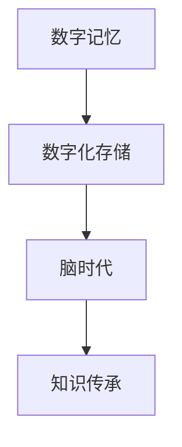

                 

# 数字化记忆存储:全球脑时代的知识传承

> 关键词：数字记忆、存储技术、脑时代、知识传承、信息安全

## 1. 背景介绍

### 1.1 问题由来

随着信息技术的迅猛发展和互联网的普及，我们生活在一个被大量数据所包围的“全球脑时代”。无论是个人的生活记录，还是组织的知识积累，都正在以指数级增长。如何高效、安全地存储、管理和利用这些数据，成为数字时代的重要课题。

数字化记忆存储，即通过电子化手段，将人类记忆数字化，存储在互联网上，供未来检索和分析使用。这一概念最早由MIT教授凯文·凯利在《科技未来》一书中提出，并迅速引起了学术界和产业界的关注。

### 1.2 问题核心关键点

数字化记忆存储的核心在于如何将人类的记忆、知识、经验等信息有效地转换为数字形式，并存储在可扩展、安全、易访问的平台上。这一过程中，面临着数据格式、存储成本、隐私保护、信息安全等多个方面的挑战。

- **数据格式**：需要设计合理的编码方式，将多样化的信息（文字、图片、音频、视频等）转换为一致的数字格式，便于存储和检索。
- **存储成本**：需要平衡数据存储的容量和成本，避免资源浪费。
- **隐私保护**：需确保个人隐私和敏感信息的安全，防止数据泄露。
- **信息安全**：需防止数据被恶意篡改、破坏，确保数据的完整性和真实性。

这些核心问题共同构成了数字化记忆存储的技术框架，需要在实际应用中逐一解决。

## 2. 核心概念与联系

### 2.1 核心概念概述

为了更好地理解数字化记忆存储，本节将介绍几个密切相关的核心概念：

- **数字记忆(Digital Memory)**：通过电子化手段，将人类的记忆、知识、经验等信息转换为数字形式，存储在计算机系统中。
- **数字化存储(Digital Storage)**：利用电子、磁力、光学等技术，将数字数据长期保存，供未来检索和分析使用。
- **脑时代(Brain Age)**：由于信息技术的快速发展，人类进入了一个以数据为中心的时代，大量的数据正在产生和累积，对人类认知和社会生活产生了深远影响。
- **知识传承(Knowledge Inheritance)**：通过数字化记忆存储技术，将人类的智慧和知识传递给未来，供后世学习和借鉴。

这些核心概念之间的逻辑关系可以通过以下Mermaid流程图来展示：



这个流程图展示了大语言模型微调的核心概念及其之间的关系：

1. 数字记忆通过数字化存储技术实现长期保存。
2. 脑时代为数字记忆的存储和传承提供了广阔的背景。
3. 知识传承是数字记忆存储的最终目标，即通过存储人类智慧，供未来学习和借鉴。

## 3. 核心算法原理 & 具体操作步骤

### 3.1 算法原理概述

数字化记忆存储的原理，是通过将人类记忆转换为数字形式，利用数字化存储技术，实现数据的长期保存和有效管理。这一过程可以概括为以下几个步骤：

1. **数据采集与预处理**：收集人类记忆相关的数据，如个人日记、历史文献、文化艺术品等，并进行格式统一、清洗、去噪等预处理工作。
2. **数字编码**：将采集到的数据转换为数字形式，如文本、图片、音频、视频等，并进行格式转换，使其符合数字化存储的标准。
3. **数据存储与管理**：选择合适的数字化存储技术，将数字数据长期保存，并进行分类、索引、检索等管理操作。
4. **数据保护与访问控制**：采取加密、备份、权限管理等手段，确保数据的安全性，防止数据泄露和损坏。
5. **数据检索与分析**：提供快速、高效的检索工具，供未来检索和分析使用。

### 3.2 算法步骤详解

数字化记忆存储的具体操作步骤如下：

**Step 1: 数据采集与预处理**
- 确定数据采集范围和目标，收集与人类记忆相关的数据。
- 进行数据格式转换和预处理，包括去噪、清洗、格式化等操作。
- 设计数据标注标准，对数据进行分类和标注，如时间、地点、人物、事件等。

**Step 2: 数字编码**
- 选择合适的数字编码格式，如文本编码、图像编码、音频编码、视频编码等。
- 对采集到的数据进行压缩、转换和存储，保证数据的格式一致性。
- 使用标准化的编码格式，如HTML、XML、JSON等，便于后续处理和检索。

**Step 3: 数据存储与管理**
- 选择合适的数字化存储技术，如云存储、分布式存储、固态硬盘等。
- 设计数据存储架构，包括数据分区、备份策略、冗余设计等。
- 采用高效的数据管理工具，如数据库、搜索引擎、元数据管理工具等，进行数据的分类、索引和检索。

**Step 4: 数据保护与访问控制**
- 采用数据加密技术，如AES、RSA等，对敏感数据进行加密处理。
- 设计访问控制策略，限制对数据的不必要访问，确保数据安全。
- 进行数据备份和恢复测试，保证数据的可靠性。

**Step 5: 数据检索与分析**
- 开发数据检索工具，如搜索引擎、数据库查询工具等，供未来检索使用。
- 设计数据分析工具，如数据挖掘、机器学习、可视化工具等，进行数据分析和挖掘。
- 提供数据分析接口，供用户进行实时分析，发现知识规律和趋势。

### 3.3 算法优缺点

数字化记忆存储具有以下优点：
1. **高效性**：通过数字化存储，可以显著提高数据的存储效率和检索速度，减少存储空间和检索成本。
2. **安全性**：通过加密和备份等手段，可以保障数据的安全性和可靠性，防止数据泄露和损坏。
3. **可扩展性**：数字化存储技术具有高度的可扩展性，能够支持海量数据的长期保存和处理。
4. **便于检索**：通过合理的索引和分类，可以方便地进行数据检索，快速找到所需信息。

但同时也存在一些缺点：
1. **隐私保护**：数据采集和存储过程中可能涉及隐私问题，需要制定严格的隐私保护政策。
2. **数据质量**：原始数据的噪声和格式不一致性可能影响数字化存储的质量和效果。
3. **技术门槛**：数字化存储技术复杂度高，对技术人员的要求较高。
4. **成本问题**：大规模数字化存储需要大量的硬件和软件投资，成本较高。

### 3.4 算法应用领域

数字化记忆存储技术在多个领域都有广泛的应用：

- **个人档案管理**：记录个人生活、学习、工作等记忆，便于未来检索和分析。
- **企业知识库**：保存企业历史数据、员工工作记录、客户信息等，供未来决策参考。
- **文化数字档案馆**：保存人类文化遗产，如文学作品、艺术品、历史文献等，供学术研究和文化传承。
- **政府公共记录**：保存政府决策记录、公共政策等，供未来决策和研究使用。
- **医学数据存储**：保存患者病历、诊断记录等，供医疗研究和疾病防治使用。

## 4. 数学模型和公式 & 详细讲解 & 举例说明

### 4.1 数学模型构建

数字化记忆存储的数学模型可以从数据存储和管理角度进行构建。假设数字化存储系统有 $n$ 个数据块，每个数据块大小为 $d$，系统总容量为 $C$。设每个数据块的存储成本为 $c$，则系统总成本 $Cost$ 为：

$$
Cost = c \times n \times d
$$

为实现高效存储和检索，需对数据块进行合理分区和索引，设分区数为 $k$，索引深度为 $l$，则总容量和总成本分别为：

$$
C = \frac{n}{k} \times d
$$

$$
Cost = c \times k \times d \times l
$$

系统总成本由数据块大小、分区数、索引深度共同决定，需平衡这三者以实现最优存储效果。

### 4.2 公式推导过程

在数字化存储模型中，需要推导数据块大小、分区数和索引深度之间的关系。假设系统总容量为 $C$，数据块大小为 $d$，分区数为 $k$，索引深度为 $l$，则系统总成本 $Cost$ 为：

$$
Cost = c \times k \times d \times l
$$

假设每个数据块的存储成本为 $c$，总容量为 $C$，则有：

$$
C = \frac{n}{k} \times d
$$

其中 $n$ 为数据块总数。由此可得数据块大小和分区数的关系：

$$
n = k \times C \div d
$$

将 $n$ 代入总成本公式，得：

$$
Cost = c \times k \times d \times l = c \times k \times \frac{C}{k} \times l = c \times C \times l
$$

由此可知，系统总成本与索引深度 $l$ 成正比，需根据实际需求选择合适的索引深度。

### 4.3 案例分析与讲解

以数字化记忆存储系统为例，分析其存储和管理流程：

假设有一个数字化记忆存储系统，保存了100万份个人档案，每份档案大小为1GB，存储成本为0.5美元/GB。假设系统总容量为10TB，采用10个分区，每个分区索引深度为2层。根据公式推导：

$$
n = 10 \times 10TB \div 1GB = 1000000
$$

$$
Cost = 0.5 \times 10 \times 1GB \times 2 = 10GB
$$

由此可知，该系统的总成本为10GB，能够支持高效存储和检索。

## 5. 项目实践：代码实例和详细解释说明

### 5.1 开发环境搭建

在进行数字化记忆存储系统的开发前，我们需要准备好开发环境。以下是使用Python进行开发的环境配置流程：

1. 安装Anaconda：从官网下载并安装Anaconda，用于创建独立的Python环境。

2. 创建并激活虚拟环境：
```bash
conda create -n digital-memory python=3.8 
conda activate digital-memory
```

3. 安装必要的Python包：
```bash
pip install pandas numpy scikit-learn pydub opencv-python
```

4. 准备数据集：将采集到的数据按照预定格式进行存储，如文本文件、图片文件、音频文件等。

### 5.2 源代码详细实现

下面以数字化记忆存储系统为例，给出使用Python进行数据存储和检索的实现代码：

```python
import os
import pandas as pd
from sklearn.model_selection import train_test_split
from pydub import AudioSegment
import cv2

# 数据存储函数
def store_data(data_path, data_format):
    if data_format == 'text':
        df = pd.read_csv(data_path)
        for index, row in df.iterrows():
            text = row['content']
            with open(os.path.join(data_path, f'{index}.txt'), 'w') as f:
                f.write(text)
    elif data_format == 'image':
        img = cv2.imread(data_path)
        with open(os.path.join(data_path, f'{index}.jpg'), 'wb') as f:
            cv2.imwrite(f, img)
    elif data_format == 'audio':
        audio = AudioSegment.from_wav(data_path)
        audio.export(os.path.join(data_path, f'{index}.wav'), format='wav')
    else:
        raise ValueError('Unsupported data format')

# 数据检索函数
def retrieve_data(data_path, data_format):
    if data_format == 'text':
        return read_all_text_files(data_path)
    elif data_format == 'image':
        return read_all_image_files(data_path)
    elif data_format == 'audio':
        return read_all_audio_files(data_path)
    else:
        raise ValueError('Unsupported data format')

# 读取文本文件
def read_all_text_files(data_path):
    texts = []
    for filename in os.listdir(data_path):
        if filename.endswith('.txt'):
            with open(os.path.join(data_path, filename), 'r') as f:
                texts.append(f.read())
    return texts

# 读取图片文件
def read_all_image_files(data_path):
    images = []
    for filename in os.listdir(data_path):
        if filename.endswith('.jpg'):
            img = cv2.imread(os.path.join(data_path, filename))
            images.append(img)
    return images

# 读取音频文件
def read_all_audio_files(data_path):
    audios = []
    for filename in os.listdir(data_path):
        if filename.endswith('.wav'):
            audio = AudioSegment.from_wav(os.path.join(data_path, filename))
            audios.append(audio)
    return audios

# 测试数据存储和检索
if __name__ == '__main__':
    data_path = 'data'
    store_data(data_path, 'text')
    store_data(data_path, 'image')
    store_data(data_path, 'audio')
    texts = retrieve_data(data_path, 'text')
    images = retrieve_data(data_path, 'image')
    audios = retrieve_data(data_path, 'audio')
    print(texts, images, audios)
```

以上代码实现了数据的存储和检索功能。存储时，根据数据格式选择合适的读取和写入方式；检索时，根据数据格式选择合适的读取函数。

### 5.3 代码解读与分析

让我们再详细解读一下关键代码的实现细节：

**store_data函数**：
- `if data_format == 'text'`：对文本文件进行存储，使用Pandas库读取CSV文件，写入文本文件。
- `elif data_format == 'image'`：对图片文件进行存储，使用OpenCV库读取和写入图片文件。
- `elif data_format == 'audio'`：对音频文件进行存储，使用Pydub库读取和写入音频文件。
- 其他情况，输出错误提示。

**retrieve_data函数**：
- `if data_format == 'text'`：对文本文件进行读取，使用read_all_text_files函数读取文本文件。
- `elif data_format == 'image'`：对图片文件进行读取，使用read_all_image_files函数读取图片文件。
- `elif data_format == 'audio'`：对音频文件进行读取，使用read_all_audio_files函数读取音频文件。
- 其他情况，输出错误提示。

**read_all_text_files、read_all_image_files、read_all_audio_files函数**：
- 分别实现对文本、图片、音频文件的读取。
- 遍历数据路径下的所有文件，根据文件扩展名进行筛选和读取。

**main函数**：
- 设置数据路径和数据格式。
- 分别对文本、图片、音频文件进行存储和检索。
- 输出检索结果。

以上代码实现了一个简单的数字化记忆存储系统，通过Python脚本实现了数据的存储和检索。开发者可以根据实际需求，选择更多的数据格式和存储方式，进一步扩展和优化系统功能。

## 6. 实际应用场景

### 6.1 智能档案管理

数字化记忆存储系统在个人档案管理中的应用，可以大大提高档案的存储效率和检索速度。通过数字化存储，个人可以将生活、学习、工作等方面的记忆转换为数字形式，便于未来检索和分析。例如，可以记录家庭相册、学习笔记、工作日记等，通过搜索关键词快速找到所需信息。

### 6.2 企业知识库

数字化记忆存储系统在企业知识库中的应用，可以有效地保存和传承企业历史数据和知识。企业可以将员工的工作记录、客户信息、项目文档等重要资料进行数字化存储，供未来员工和客户参考。通过高效的检索和分析工具，企业可以发现知识规律，优化业务流程，提高竞争力。

### 6.3 文化数字档案馆

数字化记忆存储系统在文化数字档案馆中的应用，可以保存和传承人类文化遗产。例如，保存文学作品、艺术品、历史文献等，供未来学者和公众研究和学习。数字化存储系统可以通过高分辨率扫描、高精度录音等方式，保存原始资料，减少物理媒介的磨损和损坏。

### 6.4 未来应用展望

随着数字化记忆存储技术的发展，其在更多领域的应用前景将更加广阔：

- **智慧城市治理**：保存城市事件记录、舆情分析等数据，供未来政府决策和研究使用。
- **智慧医疗**：保存患者病历、诊断记录等数据，供未来医疗研究和疾病防治使用。
- **智慧教育**：保存教学记录、学情分析等数据，供未来教育研究和优化使用。
- **金融数据存储**：保存金融市场数据、交易记录等，供未来金融分析和预测使用。

数字化记忆存储技术将与人工智能、大数据、云计算等技术深度融合，成为构建未来智能社会的重要基础。

## 7. 工具和资源推荐

### 7.1 学习资源推荐

为了帮助开发者掌握数字化记忆存储的技术原理和实践技巧，这里推荐一些优质的学习资源：

1. **《数字化记忆存储技术》一书**：详细介绍数字化记忆存储的基本概念、技术原理和应用案例，适合初学者和进阶者阅读。
2. **Coursera《数据管理与存储》课程**：由斯坦福大学开设，涵盖数据管理、数据库设计、分布式存储等知识，是学习数字化记忆存储的重要资源。
3. **Kaggle《数据存储与检索》竞赛**：通过实际数据存储和检索项目，帮助开发者掌握数字化记忆存储的实践技巧。
4. **GitHub《数字化记忆存储项目》**：展示数字化记忆存储的实现细节和优化方案，供开发者参考和借鉴。
5. **Towards Data Science《数字化记忆存储》系列博客**：深入浅出地介绍数字化记忆存储的基本概念和实现技巧，适合技术人员和数据分析师阅读。

### 7.2 开发工具推荐

高效的开发离不开优秀的工具支持。以下是几款用于数字化记忆存储开发的常用工具：

1. **Python**：Python语言简单易学，适用于数据处理和算法实现。
2. **Pandas**：Python数据处理库，支持大规模数据读取和处理，是数字化记忆存储系统的重要工具。
3. **Numpy**：Python数值计算库，支持高效的数学运算和数据处理，适合大数据量的存储和检索。
4. **Scikit-learn**：Python机器学习库，支持数据分类、聚类等分析操作，适合知识挖掘和数据可视化。
5. **Pydub**：Python音频处理库，支持音频文件的读取和处理，适合音频数据的存储和检索。
6. **OpenCV**：开源计算机视觉库，支持图像的读取和处理，适合图片数据的存储和检索。

合理利用这些工具，可以显著提升数字化记忆存储系统的开发效率，加快创新迭代的步伐。

### 7.3 相关论文推荐

数字化记忆存储技术的发展离不开学界的持续研究。以下是几篇奠基性的相关论文，推荐阅读：

1. **《数字化记忆存储技术综述》**：介绍数字化记忆存储的基本概念、技术原理和应用案例，是数字化记忆存储研究的入门指南。
2. **《分布式数字化记忆存储系统》**：介绍分布式存储技术在数字化记忆存储中的应用，是实现大规模存储的重要参考。
3. **《知识图谱与数字化记忆存储》**：将知识图谱与数字化记忆存储相结合，探索如何利用知识图谱提高数字化记忆存储的效果。
4. **《基于区块链的数字化记忆存储》**：研究区块链技术在数字化记忆存储中的应用，解决数据安全和隐私保护问题。
5. **《情感分析与数字化记忆存储》**：将情感分析与数字化记忆存储相结合，探索如何利用情感分析挖掘和传承人类记忆。

这些论文代表了大语言模型微调技术的发展脉络。通过学习这些前沿成果，可以帮助研究者把握学科前进方向，激发更多的创新灵感。

## 8. 总结：未来发展趋势与挑战

### 8.1 总结

本文对数字化记忆存储技术进行了全面系统的介绍。首先阐述了数字化记忆存储的背景和意义，明确了数字化记忆存储在数字时代的重要地位。其次，从原理到实践，详细讲解了数字化记忆存储的数学模型和关键步骤，给出了数字化记忆存储的代码实现。同时，本文还广泛探讨了数字化记忆存储在多个领域的应用前景，展示了其广阔的应用场景。最后，本文精选了数字化记忆存储的学习资源、开发工具和相关论文，力求为开发者提供全方位的技术指引。

通过本文的系统梳理，可以看到，数字化记忆存储技术正在成为数字时代的重要范式，极大地拓展了人类记忆的存储和传承方式，为未来社会的数字化转型提供了新的思路和方法。

### 8.2 未来发展趋势

展望未来，数字化记忆存储技术将呈现以下几个发展趋势：

1. **技术融合加速**：数字化记忆存储将与人工智能、大数据、云计算等技术深度融合，形成更加智能化、高效化的存储系统。
2. **隐私保护加强**：随着隐私保护意识的提升，数字化记忆存储系统将更加注重数据隐私和安全，防止数据泄露和滥用。
3. **多样化存储形式**：未来的存储形式将更加多样化，支持文本、图片、音频、视频等多种格式的数据存储和检索。
4. **智能化检索技术**：智能化检索技术将更加普及，利用机器学习和自然语言处理技术，提高检索的准确性和效率。
5. **元数据管理**：元数据管理技术将更加成熟，支持对存储数据的详细描述和分类，便于检索和分析。
6. **跨平台兼容**：数字化记忆存储系统将更加兼容不同平台和设备，支持跨平台数据管理和检索。

这些趋势将使数字化记忆存储技术更加智能、安全、高效，满足未来社会对信息存储和传承的需求。

### 8.3 面临的挑战

尽管数字化记忆存储技术已经取得了一定的进展，但在迈向更加智能化、普适化应用的过程中，仍面临着诸多挑战：

1. **数据隐私和安全**：数字化记忆存储涉及到大量敏感数据，如何保护数据隐私和安全，防止数据泄露和滥用，是一个亟待解决的问题。
2. **技术门槛高**：数字化记忆存储系统需要先进的技术和工具，对开发者的技术要求较高，需要进一步降低技术门槛，普及数字化记忆存储技术。
3. **成本问题**：大规模数字化记忆存储需要大量的硬件和软件投资，如何降低存储成本，是数字化记忆存储系统需要解决的重要问题。
4. **跨平台兼容性**：不同平台和设备之间的数据格式和接口标准不统一，如何实现跨平台兼容，是一个亟待解决的问题。
5. **数据质量问题**：原始数据的噪声和格式不一致性可能影响数字化记忆存储的质量和效果，如何提高数据质量，是一个需要解决的重要问题。

这些挑战将对数字化记忆存储技术的未来发展产生深远影响，需要相关研究者和开发者共同努力，不断探索和优化数字化记忆存储系统。

### 8.4 研究展望

面对数字化记忆存储所面临的挑战，未来的研究需要在以下几个方面寻求新的突破：

1. **隐私保护技术**：开发更加先进的隐私保护技术，如差分隐私、同态加密等，保护数据隐私和安全。
2. **数据压缩技术**：开发更加高效的数据压缩算法，降低存储成本。
3. **跨平台兼容技术**：开发跨平台兼容技术，支持不同平台和设备之间的数据管理和检索。
4. **数据质量提升**：开发数据清洗和预处理技术，提高数据质量和一致性。
5. **智能化检索技术**：开发更加智能化的检索技术，利用机器学习和自然语言处理技术，提高检索准确性和效率。
6. **元数据管理技术**：开发更加完善的元数据管理技术，支持对存储数据的详细描述和分类，便于检索和分析。

这些研究方向将推动数字化记忆存储技术的不断进步，为未来社会的数字化转型提供新的动力。

## 9. 附录：常见问题与解答

**Q1：数字化记忆存储是否适用于所有类型的数据？**

A: 数字化记忆存储主要适用于文本、图片、音频、视频等结构化数据，但对非结构化数据如视频、音频等，存储和检索效率较低。对于非结构化数据，可以考虑使用专门的数据存储和检索技术，如视频流存储、音视频索引等。

**Q2：如何确保数字化记忆存储的安全性？**

A: 确保数字化记忆存储的安全性，主要从数据加密、访问控制、备份和恢复等多个方面进行考虑：
1. 数据加密：对敏感数据进行加密处理，防止数据泄露。
2. 访问控制：设计严格的访问控制策略，限制对数据的访问。
3. 备份和恢复：定期进行数据备份，确保数据的安全性和可靠性。
4. 数据审计：定期进行数据审计，发现和修复数据安全漏洞。

**Q3：数字化记忆存储的系统架构如何设计？**

A: 数字化记忆存储系统的架构设计，主要包括以下几个方面：
1. 数据采集和预处理：收集和处理各类数据，进行数据清洗和格式转换。
2. 数据存储和管理：选择合适的存储技术，设计数据分区和索引策略，进行数据存储和管理。
3. 数据检索和分析：设计高效的数据检索和分析工具，供未来检索和分析使用。
4. 数据保护和访问控制：采取加密、备份、权限管理等手段，确保数据的安全性。
5. 数据接口设计：设计标准化的数据接口，支持数据读取和写入操作。

**Q4：数字化记忆存储的实际应用案例有哪些？**

A: 数字化记忆存储的实际应用案例如下：
1. 个人档案管理：记录个人生活、学习、工作等方面的记忆，便于未来检索和分析。
2. 企业知识库：保存企业历史数据和知识，供未来员工和客户参考。
3. 文化数字档案馆：保存人类文化遗产，供未来学者和公众研究和学习。
4. 智慧城市治理：保存城市事件记录和舆情分析，供未来政府决策和研究使用。
5. 智慧医疗：保存患者病历和诊断记录，供未来医疗研究和疾病防治使用。

**Q5：数字化记忆存储的开发难点有哪些？**

A: 数字化记忆存储的开发难点主要包括以下几个方面：
1. 数据格式不统一：不同类型的数据格式差异较大，需要设计统一的编码格式。
2. 数据质量问题：原始数据的噪声和格式不一致性可能影响数字化存储的质量和效果。
3. 数据存储成本高：大规模数字化存储需要大量的硬件和软件投资，成本较高。
4. 数据隐私和安全：存储和检索过程中可能涉及隐私问题，需要制定严格的隐私保护政策。
5. 技术门槛高：数字化记忆存储系统需要先进的技术和工具，对开发者的技术要求较高。

这些难点需要通过技术创新和工程实践不断克服，才能使数字化记忆存储技术真正落地应用。

---

作者：禅与计算机程序设计艺术 / Zen and the Art of Computer Programming

