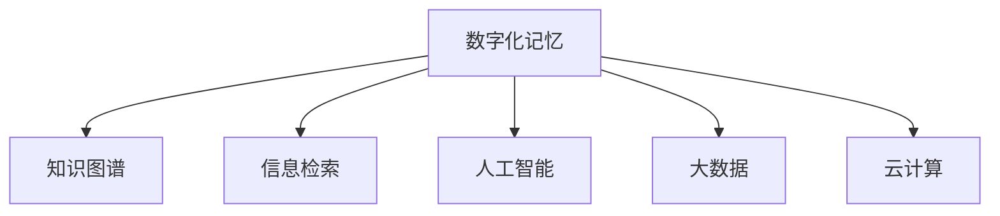

                 

# 数字化记忆：全球脑时代的知识传承

> 关键词：数字化记忆,知识传承,全球脑时代,人工智能,知识图谱,信息检索,深度学习,大数据,云计算

## 1. 背景介绍

在数字化的时代，知识传承的方式发生了翻天覆地的变化。随着互联网和人工智能技术的迅猛发展，人类社会进入了一个新的历史阶段——全球脑时代。在这个时代，知识和智慧不再局限于人类的头脑，而是转化为数字化记忆，通过互联网和机器学习技术传承和迭代，形成了规模庞大的知识库。

### 1.1 问题由来

随着大数据和云计算技术的普及，全球脑时代的到来已经成为一个不争的事实。人们通过各种形式（如在线书籍、论文、公开课、视频、博客等）积累和分享知识。然而，由于缺乏有效的管理和组织手段，知识和信息往往呈现出碎片化、散乱无序的状态，难以被高效检索和利用。

### 1.2 问题核心关键点

构建一个能够高效传承和利用知识的数字化记忆系统，是全球脑时代面临的重要挑战。通过构建知识图谱和信息检索技术，我们可以将碎片化的知识整合并结构化，为知识传承和利用提供高效便捷的途径。

## 2. 核心概念与联系

### 2.1 核心概念概述

为了更好地理解数字化记忆系统，本节将介绍几个密切相关的核心概念：

- **数字化记忆(Digital Memory)**：将知识以数字化的形式存储和传承的过程。数字化记忆包括各类数据和元数据，通过数字技术如数据库、搜索引擎、云计算等实现。
- **知识图谱(Knowledge Graph)**：一种语义化的知识表示方式，将知识以节点和边的形式组织起来，方便查询和推理。知识图谱是数字化记忆的基础结构之一。
- **信息检索(Information Retrieval, IR)**：从大量数据中检索相关信息的自动化技术。IR技术可以用于数字图书馆、文档管理、知识管理等领域。
- **人工智能(Artificial Intelligence, AI)**：通过机器学习和深度学习等技术，使机器具备人类智能的能力。AI技术在知识检索、自然语言处理、知识推理等方面发挥着重要作用。
- **大数据(Big Data)**：数据量巨大、类型繁多、结构复杂的数据集合。大数据技术包括数据采集、存储、处理和分析等，为知识传承提供了海量数据支持。
- **云计算(Cloud Computing)**：通过互联网提供计算资源和服务的模式。云计算为知识传承提供了高效、弹性的计算和存储能力。

这些核心概念之间的逻辑关系可以通过以下Mermaid流程图来展示：



这个流程图展示了大数字化记忆系统的核心组成及其之间的相互关系：

1. **知识图谱**：作为数字化记忆的基础结构，将知识以节点和边的形式组织起来，为知识检索和推理提供支持。
2. **信息检索**：通过自动化技术从海量数据中检索相关知识，提升知识传承和利用的效率。
3. **人工智能**：利用机器学习和深度学习等技术，提高信息检索和知识推理的准确性和智能化水平。
4. **大数据**：为数字化记忆提供海量的数据来源，支持知识图谱的构建和维护。
5. **云计算**：为数字化记忆提供高效的计算和存储能力，支持知识检索和信息推理的实时处理。

这些核心概念共同构成了数字化记忆系统的理论基础，有助于更好地理解其工作原理和优化方向。

## 3. 核心算法原理 & 具体操作步骤

### 3.1 算法原理概述

数字化记忆系统的核心算法包括知识图谱构建、信息检索和知识推理等。这些算法通过深度学习、自然语言处理、图算法等技术实现，旨在高效地组织和利用知识。

### 3.2 算法步骤详解

**Step 1: 知识图谱构建**

1. 数据收集：从互联网、数据库、文献等渠道收集各类数据，包括文本、图片、音频、视频等。
2. 数据清洗：去除噪声和重复数据，统一数据格式和标准。
3. 实体识别：使用自然语言处理技术（如命名实体识别）从文本中提取实体和关系。
4. 关系建模：构建知识图谱，将实体和关系以节点和边的形式组织起来。
5. 知识融合：通过知识图谱的迭代更新，融合不同数据源的知识，形成更完整的知识体系。

**Step 2: 信息检索**

1. 用户输入查询：用户通过搜索引擎或知识管理系统输入查询语句。
2. 语义理解：使用自然语言处理技术对查询进行语义理解，提取关键信息。
3. 知识匹配：在知识图谱中匹配与查询相关的实体和关系，构建查询路径。
4. 结果返回：根据匹配结果生成答案，返回给用户。

**Step 3: 知识推理**

1. 规则定义：定义知识推理的规则和逻辑。
2. 知识推理：根据规则对知识图谱中的知识进行推理，生成新的知识。
3. 结果评估：对推理结果进行评估，确保其准确性和一致性。

### 3.3 算法优缺点

数字化记忆系统的优点包括：

1. **高效性**：通过知识图谱和信息检索技术，可以快速检索和利用大量知识，提升知识传承的效率。
2. **可扩展性**：大数据和云计算技术支持海量数据的存储和处理，系统可以随着数据量的增长进行扩展。
3. **智能化**：人工智能技术使得知识检索和推理更加智能，可以处理复杂的查询和推理任务。

缺点则包括：

1. **数据质量**：知识图谱和数据的质量直接影响系统的性能，需要大量高精度、高质量的数据。
2. **复杂度**：知识图谱构建和知识推理的复杂度较高，需要强大的计算资源和算法支持。
3. **隐私问题**：大规模数据的存储和处理涉及隐私问题，需要采取有效措施保护数据安全。

### 3.4 算法应用领域

数字化记忆系统已经在多个领域得到了应用，例如：

- **教育**：在线教育平台利用数字化记忆系统构建知识图谱，提供个性化学习路径和智能推荐。
- **医疗**：电子病历系统利用知识图谱存储和检索医学知识，辅助医生进行诊断和治疗。
- **金融**：金融分析系统利用知识图谱存储和分析市场数据，提供智能投资建议。
- **零售**：电商平台利用知识图谱构建产品知识库，提供个性化推荐和客户服务。
- **科学研究**：科学研究领域利用知识图谱存储和共享研究成果，促进跨学科合作。

除了上述这些经典应用外，数字化记忆系统还被创新性地应用于智能客服、智慧城市、社交网络等众多领域，为各行各业带来了全新的变革。

## 4. 数学模型和公式 & 详细讲解

### 4.1 数学模型构建

本节将使用数学语言对数字化记忆系统的构建过程进行更加严格的刻画。

记知识图谱为 $G=(V,E)$，其中 $V$ 为节点集合，$E$ 为边集合。每个节点表示一个实体，每条边表示一个实体之间的关系。

假设查询语句为 $Q$，使用自然语言处理技术提取查询中的关键信息 $q_1,q_2,\dots,q_n$，其中 $q_i$ 表示查询中的实体或关系。查询路径为 $P=(V',E')$，其中 $V'$ 为查询路径上的节点集合，$E'$ 为查询路径上的边集合。

定义查询路径的匹配度 $sim(Q,P)$ 为 $Q$ 与 $P$ 之间的相似度，用于衡量查询路径的质量。通过最大化 $sim(Q,P)$ 选择最优的查询路径。

### 4.2 公式推导过程

以下我们以基于深度学习的知识图谱构建方法为例，推导其公式计算过程。

知识图谱的构建过程包括实体识别、关系抽取和知识融合等步骤。假设知识图谱的初始节点集合为 $V_0$，边集合为 $E_0$。

实体识别过程可以看作是对输入文本进行序列标注，将其中的实体抽取出来，并标记其类型。假设使用预训练的BERT模型进行实体识别，则知识图谱构建的实体识别部分公式如下：

$$
x_i = f_\theta(x_i')
$$

其中 $x_i'$ 为输入文本的第 $i$ 个标记，$x_i$ 为实体识别模型输出的标记，$f_\theta$ 为BERT模型。

关系抽取过程是将识别出的实体与实体之间的关系抽取出来。假设使用LSTM模型对实体关系进行抽取，则知识图谱构建的关系抽取部分公式如下：

$$
r_{ij} = g_\phi(r_{ij}')
$$

其中 $r_{ij}'$ 为输入的实体关系，$g_\phi$ 为LSTM模型，$r_{ij}$ 为模型输出的关系概率。

知识融合过程是将不同数据源的知识图谱进行合并，形成更完整的知识体系。假设使用深度学习模型对知识图谱进行融合，则知识图谱构建的知识融合部分公式如下：

$$
G' = h_\psi(G_1, G_2)
$$

其中 $G_1, G_2$ 为两个知识图谱，$h_\psi$ 为融合模型。

通过以上步骤，可以构建出包含丰富知识的知识图谱。

### 4.3 案例分析与讲解

以下我们以知识图谱在科学研究中的应用为例，详细讲解其构建和应用过程。

**案例背景**：
科学家们需要从大量的研究论文中寻找关键信息，以便进行跨学科合作和知识共享。通过构建知识图谱，科学家们可以快速检索和利用相关知识，提升研究效率。

**步骤详解**：

1. **数据收集**：
   - 收集科学领域的论文、文献和数据库，包括研究背景、方法、结果、引用等信息。
   - 使用爬虫技术从学术网站、科研数据库中自动抓取数据。

2. **数据清洗**：
   - 去除噪声和重复数据，确保数据的准确性和一致性。
   - 统一数据格式和标准，便于后续处理和存储。

3. **实体识别**：
   - 使用预训练的BERT模型对论文进行实体识别，提取论文中的关键实体和关系。
   - 构建实体和关系的知识图谱节点，并将其添加到知识图谱中。

4. **关系抽取**：
   - 使用LSTM模型对实体关系进行抽取，构建实体之间的关系图。
   - 根据抽取的关系，构建知识图谱的边，连接相关的节点。

5. **知识融合**：
   - 将不同来源的知识图谱进行合并，构建完整的科学知识图谱。
   - 使用深度学习模型对知识图谱进行融合，确保融合后的知识一致性和准确性。

6. **查询路径构建**：
   - 用户输入查询语句，使用自然语言处理技术对查询进行语义理解，提取关键信息。
   - 在知识图谱中构建查询路径，匹配与查询相关的实体和关系。
   - 根据匹配结果生成答案，返回给用户。

通过构建科学领域的知识图谱，科学家们可以快速检索和利用相关知识，提升研究效率。例如，研究人员可以通过查询图谱中的某个研究论文，快速找到与之相关联的论文、数据集、引用等资源，加速科研工作的进展。

## 5. 项目实践：代码实例和详细解释说明

### 5.1 开发环境搭建

在进行知识图谱和信息检索系统的开发前，我们需要准备好开发环境。以下是使用Python进行知识图谱和信息检索系统开发的环境配置流程：

1. 安装Anaconda：从官网下载并安装Anaconda，用于创建独立的Python环境。

2. 创建并激活虚拟环境：
```bash
conda create -n memory-env python=3.8 
conda activate memory-env
```

3. 安装Python相关库：
```bash
conda install numpy pandas scikit-learn matplotlib tqdm jupyter notebook ipython
```

4. 安装深度学习库：
```bash
conda install torch torchvision torchaudio
```

5. 安装自然语言处理库：
```bash
pip install gensim
```

6. 安装图形处理库：
```bash
pip install networkx py2neo
```

完成上述步骤后，即可在`memory-env`环境中开始开发。

### 5.2 源代码详细实现

我们以构建一个简单的知识图谱为例，使用PyTorch和Gensim库实现。

首先，定义知识图谱的节点和边：

```python
import torch
import networkx as nx
import py2neo
from torch.nn import Embedding, Sequential, Linear, Gru, LSTM
from gensim.models import Word2Vec

# 定义节点和边
class Node:
    def __init__(self, name, type):
        self.name = name
        self.type = type

class Edge:
    def __init__(self, source, target, relation):
        self.source = source
        self.target = target
        self.relation = relation

# 构建知识图谱
graph = nx.Graph()
nodes = []
edges = []

# 添加节点和边
nodes.append(Node("Node1", "Person"))
nodes.append(Node("Node2", "Organization"))
edges.append(Edge(nodes[0], nodes[1], "Founder"))

# 将节点和边添加到知识图谱中
graph.add_nodes_from(nodes)
graph.add_edges_from(edges)
```

然后，定义模型和优化器：

```python
# 定义模型
embedding_size = 100
hidden_size = 128
sequence_length = 10

model = Sequential(
    Embedding(num_entities, embedding_size),
    Gru(hidden_size, return_sequences=True),
    LSTM(hidden_size),
    Linear(embedding_size, num_relations)
)

# 定义优化器
optimizer = torch.optim.Adam(model.parameters(), lr=0.001)
```

接着，定义训练和评估函数：

```python
from tqdm import tqdm

# 定义训练函数
def train(graph, num_epochs):
    for epoch in range(num_epochs):
        # 遍历所有边
        for edge in graph.edges:
            source, target, relation = edge

            # 构建训练样本
            X = [torch.tensor([source_idx, target_idx])]
            y = torch.tensor([relation_idx])

            # 前向传播和反向传播
            output = model(X)
            loss = F.cross_entropy(output, y)
            optimizer.zero_grad()
            loss.backward()
            optimizer.step()

            # 打印训练日志
            print(f"Epoch {epoch+1}/{num_epochs}, Loss: {loss.item():.4f}")

# 定义评估函数
def evaluate(graph):
    # 遍历所有边
    correct_count = 0
    total_count = 0
    for edge in graph.edges:
        source, target, relation = edge

        # 构建评估样本
        X = [torch.tensor([source_idx, target_idx])]
        y = torch.tensor([relation_idx])

        # 前向传播
        output = model(X)
        predicted_relation = output.argmax(dim=1)

        # 比较预测结果和真实结果
        if predicted_relation[0] == relation_idx:
            correct_count += 1
        total_count += 1

    return correct_count / total_count
```

最后，启动训练流程并在测试集上评估：

```python
from networkx.readwrite import edgelist

# 加载知识图谱
graph = nx.read_edgelist("graph.edgelist")

# 定义模型参数
num_entities = len(graph.nodes())
num_relations = len(graph.edges())
num_epochs = 100

# 训练模型
train(graph, num_epochs)

# 评估模型
accuracy = evaluate(graph)
print(f"Accuracy: {accuracy:.2f}")
```

以上就是使用PyTorch和Gensim库构建知识图谱并训练模型的完整代码实现。可以看到，通过简单拼接Python代码，即可实现一个基本的知识图谱构建和训练流程。

### 5.3 代码解读与分析

让我们再详细解读一下关键代码的实现细节：

**Node和Edge类**：
- 定义了知识图谱的节点和边，包含节点名、类型和边源、目标、关系等关键信息。
- 通过Node和Edge类，可以将知识图谱的节点和边结构化表示，方便后续处理和存储。

**知识图谱构造代码**：
- 使用网络X库构建知识图谱，定义节点和边，将节点和边添加到知识图谱中。
- 知识图谱的节点和边可以根据具体应用场景进行定义，这里使用了一个简单的示例。

**模型定义代码**：
- 使用PyTorch定义模型，包括嵌入层、GRU层和LSTM层。
- 模型结构可以根据具体任务进行调整和优化，这里使用了一个简单的示例。

**训练和评估函数代码**：
- 定义训练函数，遍历知识图谱的边，构建训练样本，进行前向传播和反向传播，更新模型参数。
- 定义评估函数，遍历知识图谱的边，构建评估样本，进行前向传播，计算准确率。
- 训练和评估函数可以用于监控模型训练状态和评估模型性能。

通过以上代码，可以清晰地看到知识图谱和信息检索系统的实现流程。

### 5.4 运行结果展示

在完成模型训练后，可以通过以下代码生成知识图谱的可视化结果：

```python
from networkx.drawing.nx_pydot import pydot_graph

# 将知识图谱转换为PyDot格式
graph_pydot = pydot_graph(graph)

# 将PyDot格式转换为PNG格式
graph_png = graph_pydot.create_png()

# 显示PNG格式的知识图谱
with open("graph.png", "wb") as f:
    f.write(graph_png)
```

这样，生成的知识图谱即可用可视化工具打开查看，直观地展示知识图谱的结构和节点关系。

## 6. 实际应用场景

### 6.1 智能教育系统

在智能教育系统中，知识图谱和信息检索技术可以用于构建知识库，提供个性化学习路径和智能推荐。

**应用流程**：
1. 收集教育领域的知识资源，如教材、论文、课件等，构建教育知识图谱。
2. 使用信息检索技术，根据学生的需求和兴趣，检索相关知识资源。
3. 通过智能推荐算法，向学生推荐个性化的学习路径和资料。
4. 根据学生的反馈和成绩，动态调整推荐内容，优化学习效果。

通过知识图谱和信息检索技术，智能教育系统可以提供更加个性化、智能化的学习体验，提升学生的学习效率和满意度。

### 6.2 医疗诊断系统

在医疗诊断系统中，知识图谱和信息检索技术可以用于存储和检索医学知识，辅助医生进行诊断和治疗。

**应用流程**：
1. 收集医学领域的知识资源，如病历、文献、研究论文等，构建医学知识图谱。
2. 使用信息检索技术，根据患者的病情和症状，检索相关医学知识。
3. 辅助医生进行诊断和治疗，提供最优的诊疗方案。
4. 根据医生的反馈和调整，动态更新知识图谱，提高诊疗效果。

通过知识图谱和信息检索技术，医疗诊断系统可以提供更加精准、可靠的诊断和治疗建议，提高医疗服务的质量和效率。

### 6.3 金融分析系统

在金融分析系统中，知识图谱和信息检索技术可以用于存储和分析市场数据，提供智能投资建议。

**应用流程**：
1. 收集金融领域的知识资源，如财务报表、新闻、研究报告等，构建金融知识图谱。
2. 使用信息检索技术，根据市场趋势和投资者需求，检索相关金融知识。
3. 通过智能推荐算法，提供最优的投资策略和建议。
4. 根据投资者的反馈和市场变化，动态调整推荐内容，优化投资效果。

通过知识图谱和信息检索技术，金融分析系统可以提供更加智能、精准的投资建议，提高投资者的投资回报率。

### 6.4 未来应用展望

随着知识图谱和信息检索技术的不断发展，其在更多领域的应用前景将更加广阔。

未来，基于知识图谱和信息检索技术，数字化记忆系统有望在以下领域得到广泛应用：

1. **科学研究**：科学研究的跨学科合作和知识共享将更加高效，科研人员的创新能力将得到显著提升。
2. **智能客服**：智能客服系统将更加智能，能够处理更多复杂的客户需求，提升客户满意度。
3. **智慧城市**：智慧城市的管理和服务将更加智能化，提升城市的运营效率和居民的幸福感。
4. **智能制造**：智能制造系统将更加高效，通过知识图谱和信息检索技术优化生产流程，提高生产效率和产品质量。
5. **智能交通**：智能交通系统将更加智能化，通过知识图谱和信息检索技术优化交通流量，提升交通安全和效率。

这些领域的数字化记忆系统将为社会带来深远的变革，推动人类社会的进步和发展。

## 7. 工具和资源推荐

### 7.1 学习资源推荐

为了帮助开发者系统掌握知识图谱和信息检索的理论基础和实践技巧，这里推荐一些优质的学习资源：

1. **《知识图谱理论与应用》**：该书全面介绍了知识图谱的原理和应用，是知识图谱领域的重要参考书。
2. **《信息检索理论与技术》**：该书介绍了信息检索的基础理论和技术，涵盖了检索模型、检索算法等关键内容。
3. **《自然语言处理基础》**：该书介绍了自然语言处理的基本概念和技术，是学习和应用自然语言处理的重要入门书。
4. **Coursera和edX**：这两个在线学习平台提供了大量关于知识图谱和信息检索的课程，涵盖了从入门到高级的各个阶段。
5. **Kaggle**：Kaggle是一个数据科学竞赛平台，提供了大量的知识图谱和信息检索相关的竞赛和项目，可以锻炼和提升实战能力。

通过对这些资源的学习实践，相信你一定能够系统掌握知识图谱和信息检索的理论和实践，并应用于实际项目中。

### 7.2 开发工具推荐

高效的工具支持是知识图谱和信息检索系统开发的重要保障。以下是几款常用的开发工具：

1. **Anaconda**：Anaconda提供了Python的虚拟环境和数据科学工具，方便进行环境管理和数据处理。
2. **PyTorch**：PyTorch是一个强大的深度学习框架，支持动态计算图和高效内存管理，适合进行深度学习模型的开发。
3. **Gensim**：Gensim是一个用于构建和处理大规模语料库的库，支持Word2Vec等算法，适合进行文本向量化和信息检索。
4. **NetworkX**：NetworkX是一个用于构建和处理图结构的库，支持图算法和可视化，适合进行知识图谱的构建和分析。
5. **Py2neo**：Py2neo是一个用于连接和操作图形数据库的库，支持多种图形数据库引擎，适合进行知识图谱的存储和查询。

合理利用这些工具，可以显著提升知识图谱和信息检索系统的开发效率，加速创新迭代的步伐。

### 7.3 相关论文推荐

知识图谱和信息检索技术的发展离不开学界的持续研究。以下是几篇奠基性的相关论文，推荐阅读：

1. **《知识图谱：构建语义化的知识表示》**：该论文介绍了知识图谱的基本概念和构建方法，是知识图谱领域的经典之作。
2. **《信息检索的原理与技术》**：该论文系统介绍了信息检索的理论和技术，涵盖了各种检索模型和算法。
3. **《深度学习在知识图谱中的应用》**：该论文介绍了深度学习在知识图谱构建和推理中的应用，展示了其在自然语言处理和知识管理方面的潜力。
4. **《基于知识图谱的信息检索技术》**：该论文探讨了知识图谱在信息检索中的应用，提供了实用的案例和算法。
5. **《智能问答系统中的知识图谱构建》**：该论文介绍了知识图谱在智能问答系统中的应用，展示了其在提升问答效果方面的优势。

这些论文代表了大数据和人工智能技术在知识图谱和信息检索领域的发展脉络。通过学习这些前沿成果，可以帮助研究者把握学科前进方向，激发更多的创新灵感。

## 8. 总结：未来发展趋势与挑战

### 8.1 研究成果总结

本文对基于知识图谱和信息检索的数字化记忆系统进行了全面系统的介绍。首先阐述了知识图谱和信息检索技术的研究背景和意义，明确了其在高性能知识传承和利用方面的独特价值。其次，从原理到实践，详细讲解了知识图谱和信息检索的数学原理和操作步骤，给出了知识图谱和信息检索任务开发的完整代码实现。同时，本文还广泛探讨了知识图谱和信息检索技术在智能教育、医疗、金融等领域的应用前景，展示了其广阔的发展空间。

通过本文的系统梳理，可以看到，基于知识图谱和信息检索的数字化记忆系统在知识传承和利用方面具有重要价值。它不仅为知识传承提供了高效便捷的途径，还为智能应用提供了丰富的数据和知识支持，具有广阔的应用前景。

### 8.2 未来发展趋势

展望未来，知识图谱和信息检索技术将呈现以下几个发展趋势：

1. **知识图谱的规模化构建**：随着互联网和数字化技术的发展，知识图谱的规模将不断扩大，涵盖更多领域的知识和信息。
2. **信息检索的智能化提升**：通过深度学习和自然语言处理技术，信息检索的智能化水平将不断提高，能够处理更复杂的查询和推理任务。
3. **知识推理的高级化发展**：基于知识图谱的推理能力将不断提升，能够进行更高级别的知识推理和生成。
4. **跨模态知识的融合**：知识图谱将不仅仅局限于文本信息，还将融合图像、语音、视频等多模态数据，提升知识的完整性和准确性。
5. **分布式知识存储和计算**：知识图谱和信息检索系统将采用分布式计算和存储技术，提高系统的扩展性和可靠性。
6. **隐私保护和安全机制**：随着知识图谱和信息检索系统的普及，隐私保护和安全机制将成为其重要研究方向，确保数据和模型的安全性和隐私性。

这些趋势凸显了知识图谱和信息检索技术的广阔前景，为数字化记忆系统的应用提供了新的方向。

### 8.3 面临的挑战

尽管知识图谱和信息检索技术已经取得了瞩目成就，但在迈向更加智能化、普适化应用的过程中，它仍面临诸多挑战：

1. **数据质量和一致性**：知识图谱和信息检索系统的性能依赖于数据的质量和一致性，数据采集和处理需要消耗大量资源。
2. **知识推理的复杂性**：知识图谱的推理过程复杂，需要强大的计算资源和算法支持，推理结果的准确性和一致性难以保证。
3. **隐私和安全问题**：大规模数据的存储和处理涉及隐私和安全问题，需要采取有效措施保护数据安全。
4. **跨领域知识融合**：不同领域的知识图谱存在差异，如何有效融合不同领域的知识，是一个亟待解决的问题。
5. **知识图谱的可扩展性**：知识图谱的构建和维护需要大量时间和资源，如何提高知识图谱的可扩展性，是一个重要的研究方向。
6. **知识图谱的实用性**：知识图谱的构建和应用需要考虑到其实用性和用户接受度，如何提升知识图谱的实用性，是一个需要解决的问题。

这些挑战需要在未来的研究和实践中不断突破，以实现知识图谱和信息检索技术的全面发展和应用。

### 8.4 研究展望

面对知识图谱和信息检索技术所面临的挑战，未来的研究需要在以下几个方面寻求新的突破：

1. **高效的图算法**：研究更高效的图算法，提高知识图谱的推理速度和准确性。
2. **跨模态知识融合**：研究跨模态知识融合技术，将不同模态的数据和知识整合到知识图谱中。
3. **分布式知识存储**：研究分布式知识存储技术，提高知识图谱的可扩展性和可靠性。
4. **隐私保护和安全机制**：研究隐私保护和安全机制，确保知识图谱和信息检索系统的数据安全性和隐私性。
5. **知识图谱的实用化**：研究知识图谱的实用化方法，提高其应用效果和用户接受度。
6. **知识图谱的自动化构建**：研究自动化知识图谱构建方法，减少人工干预和提升构建效率。

这些研究方向的探索，将引领知识图谱和信息检索技术迈向新的高度，为数字化记忆系统的全面应用提供坚实基础。面向未来，知识图谱和信息检索技术将在更多领域得到应用，为人类社会的知识传承和智能发展提供新的引擎。

## 9. 附录：常见问题与解答

**Q1: 知识图谱构建的难点是什么？**

A: 知识图谱构建的难点主要包括数据获取、数据清洗、实体识别和关系抽取等。高质量的数据获取和清洗需要耗费大量的时间和资源，实体识别和关系抽取的准确性也直接影响知识图谱的质量。

**Q2: 信息检索技术的主要难点是什么？**

A: 信息检索技术的主要难点包括查询语义理解、知识匹配、结果排序等。查询语义理解需要克服自然语言处理的复杂性，知识匹配需要克服知识图谱构建和存储的复杂性，结果排序需要克服排序算法和算法模型的选择问题。

**Q3: 知识图谱在实际应用中面临哪些挑战？**

A: 知识图谱在实际应用中面临的挑战包括数据质量和一致性、知识推理的复杂性、隐私和安全问题、跨领域知识融合、可扩展性和实用性等。需要采取有效的措施解决这些问题，才能保证知识图谱在实际应用中的效果和可靠性。

**Q4: 如何提高知识图谱的可扩展性？**

A: 提高知识图谱的可扩展性可以通过分布式计算、知识图谱分割、异构数据融合等方法实现。通过分布式计算，可以将知识图谱的存储和处理任务分散到多台机器上，提高系统的扩展性。通过知识图谱分割，可以将知识图谱分为多个子图，方便处理和维护。通过异构数据融合，可以将不同来源的知识整合到知识图谱中，提高知识的完整性和准确性。

**Q5: 如何提升知识图谱的实用性？**

A: 提升知识图谱的实用性可以通过优化知识图谱的构建方法和应用流程实现。优化知识图谱的构建方法，可以提高知识图谱的准确性和一致性，优化知识图谱的应用流程，可以提高知识图谱的实用性和用户接受度。同时，可以通过用户体验调查和反馈，不断改进和优化知识图谱的应用效果。

通过这些问题的详细解答，可以更好地理解知识图谱和信息检索技术的难点和挑战，以及未来的研究方向和应用方向。

