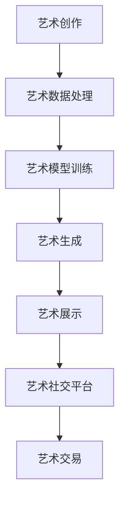

                 

# 数字艺术创业：艺术与科技的完美融合

> 关键词：数字艺术, 艺术与科技融合, 创业, 艺术数据处理, 艺术模型, 艺术生成, 艺术社交平台

## 1. 背景介绍

随着数字技术的飞速发展，数字艺术创业成为了新一代创业者的热门选择。数字艺术将传统艺术与科技紧密结合，不仅拓展了艺术创作的边界，也为创业者提供了新的商业机会。本文将深入探讨数字艺术创业的核心概念和实现方法，展示艺术与科技融合的魅力，为有意投身数字艺术领域的创业者提供全面的指南。

## 2. 核心概念与联系

### 2.1 核心概念概述

在数字艺术创业中，以下几个核心概念至关重要：

- **数字艺术**：指通过数字技术，如计算机图形、数字图像、虚拟现实、增强现实等手段创作的艺术作品。数字艺术打破了传统艺术的物理限制，可以无限复制、修改和分享。

- **艺术与科技融合**：通过将数字技术应用于艺术创作、展示、传播等环节，提升艺术表现力和互动性，创造全新的艺术形式和体验。

- **创业**：指创业者将艺术创意与市场需求结合，创立新企业、开发新产品、开拓新市场的过程。数字艺术创业强调艺术价值的商业化实现，包括技术研发、商业模式设计、市场营销等环节。

- **艺术数据处理**：指对艺术作品进行数字化、标准化、自动化的处理过程，包括图像识别、语音识别、自然语言处理等技术手段。

- **艺术模型**：指通过训练数据集，使用深度学习等算法构建的艺术生成模型，如GANs、VQ-VAE等，能够生成具有艺术风格的新作品。

- **艺术生成**：指使用机器学习算法，自动创作出具有艺术特色的作品。艺术生成是数字艺术创业的重要技术基础。

- **艺术社交平台**：指提供艺术创作、展示、交流、交易等功能的数字平台，如艺术市场网站、在线画廊、社交网络等。艺术社交平台为艺术家和艺术爱好者提供互动空间，促进艺术文化的传播和交流。

这些核心概念之间通过数字技术和艺术创意的结合，形成了完整的数字艺术创业生态系统。

### 2.2 核心概念联系

艺术与科技的融合是数字艺术创业的核心驱动力。具体而言，以下几点将艺术与科技紧密结合：

1. **数据驱动的创作**：通过艺术数据处理技术，从海量艺术作品中提取特征和规律，引导机器学习算法生成新的艺术作品，实现“艺术创作由机器辅助”的梦想。

2. **虚拟现实的沉浸体验**：利用虚拟现实技术，打造沉浸式艺术体验，让观众能够全方位、多角度地欣赏艺术作品。

3. **社交网络的互动分享**：通过艺术社交平台，实现艺术家与观众的互动交流，提升艺术作品的传播力和影响力。

4. **个性化推荐系统**：使用推荐算法，根据用户偏好推荐相关艺术作品，增强用户体验，提升平台粘性。

5. **智能化的艺术市场**：结合区块链技术，打造透明、安全、高效的艺术交易平台，推动艺术品的数字化和市场化。

### 2.3 Mermaid 流程图

以下是一个简单的Mermaid流程图，展示了数字艺术创业的基本流程：



这个流程图展示了从艺术创作到艺术交易的完整流程，突出了艺术数据处理、艺术模型训练、艺术生成和艺术社交平台等关键环节。

## 3. 核心算法原理 & 具体操作步骤

### 3.1 算法原理概述

数字艺术创业的核心算法包括艺术数据处理、艺术模型训练和艺术生成等。

- **艺术数据处理**：通过图像识别、语音识别、自然语言处理等技术，对艺术作品进行数字化处理，提取特征，建立标准化的数据集。

- **艺术模型训练**：使用深度学习算法，如卷积神经网络(CNN)、生成对抗网络(GANs)等，在艺术数据集上进行模型训练，构建艺术生成模型。

- **艺术生成**：使用训练好的艺术模型，生成具有艺术风格的新作品，可以通过指定风格、主题、情感等参数进行控制。

### 3.2 算法步骤详解

#### 3.2.1 艺术数据处理

1. **数据收集**：从博物馆、画廊、艺术家个人作品集中收集艺术作品，形成大规模数据集。

2. **数据预处理**：对数据进行去噪、增强、裁剪等预处理，确保数据的质量和一致性。

3. **特征提取**：使用CNN等深度学习模型，提取艺术作品的视觉特征、情感特征、风格特征等，建立特征向量。

#### 3.2.2 艺术模型训练

1. **选择模型**：根据数据特性和任务需求，选择合适的深度学习模型，如GANs、VQ-VAE等。

2. **模型训练**：使用GPU/TPU等高性能设备，对模型进行训练，优化损失函数，提升模型精度。

3. **模型评估**：在测试集上评估模型性能，调整超参数，优化模型结构。

#### 3.2.3 艺术生成

1. **生成控制**：根据用户需求，指定生成作品的风格、主题、情感等参数。

2. **生成过程**：将控制参数输入艺术模型，生成新的艺术作品。

3. **作品评价**：使用艺术专家和用户评价模型，对生成作品进行综合评价，进一步优化模型。

### 3.3 算法优缺点

**优点**：

- **高效创作**：利用深度学习算法，大幅提升艺术创作的效率，缩短创作周期。

- **个性化生成**：通过参数控制，生成具有个性化特征的艺术作品，满足不同用户的需求。

- **互动性增强**：利用社交平台，增强艺术家与观众的互动，提升艺术作品的市场影响力。

**缺点**：

- **技术门槛高**：深度学习算法和艺术创作需要较高的技术门槛，难以普及。

- **版权问题**：生成艺术作品的版权归属问题复杂，需要法律和伦理的规范。

- **数据隐私**：艺术数据处理和生成过程中涉及用户隐私，需要严格的数据保护措施。

### 3.4 算法应用领域

数字艺术创业涉及多个应用领域，包括但不限于：

- **数字艺术品市场**：利用区块链技术，建立透明、安全、高效的艺术交易平台，推动艺术品的数字化和市场化。

- **虚拟现实艺术展览**：结合虚拟现实技术，打造沉浸式艺术展览，提升观众体验。

- **在线艺术教育**：开发艺术创作、赏析、交流等功能的在线平台，推广艺术教育和普及。

- **艺术社交网络**：提供艺术家展示作品、交流互动的空间，促进艺术文化的传播。

## 4. 数学模型和公式 & 详细讲解 & 举例说明

### 4.1 数学模型构建

数字艺术创业中的数学模型主要集中在艺术数据处理、艺术模型训练和艺术生成等环节。以下是对这些环节的数学模型构建和公式推导过程的详细讲解。

#### 4.1.1 艺术数据处理

- **视觉特征提取**：使用CNN模型，对艺术作品进行特征提取，公式为：

  $$
  \mathbf{f} = \mathcal{F}(\mathbf{x})
  $$

  其中 $\mathbf{f}$ 表示特征向量，$\mathbf{x}$ 表示原始艺术作品。

- **情感特征提取**：使用情感识别模型，提取艺术作品的情感特征，公式为：

  $$
  \mathbf{e} = \mathcal{E}(\mathbf{f})
  $$

  其中 $\mathbf{e}$ 表示情感特征向量。

#### 4.1.2 艺术模型训练

- **GANs模型**：使用生成对抗网络，生成艺术作品，公式为：

  $$
  \mathcal{L}_{GAN} = \mathcal{L}_{G} + \mathcal{L}_{D}
  $$

  其中 $\mathcal{L}_{G}$ 表示生成器的损失函数，$\mathcal{L}_{D}$ 表示判别器的损失函数。

- **VQ-VAE模型**：使用向量量化变分自编码器，生成艺术作品，公式为：

  $$
  \mathbf{z} = \mathcal{VQVAE}(\mathbf{x})
  $$

  其中 $\mathbf{z}$ 表示生成作品的特征向量。

#### 4.1.3 艺术生成

- **风格迁移**：使用生成对抗网络，实现风格的迁移和转换，公式为：

  $$
  \mathbf{x'} = \mathcal{ST}(\mathbf{x})
  $$

  其中 $\mathbf{x'}$ 表示生成后的艺术作品，$\mathbf{x}$ 表示原始艺术作品，$\mathcal{ST}$ 表示风格迁移模型。

### 4.2 公式推导过程

#### 4.2.1 艺术数据处理

- **视觉特征提取**：使用CNN模型，对艺术作品进行特征提取，具体公式推导过程如下：

  $$
  \mathbf{f} = \mathcal{F}(\mathbf{x}) = \mathbf{W} \mathbf{x} + \mathbf{b}
  $$

  其中 $\mathbf{W}$ 表示卷积核矩阵，$\mathbf{b}$ 表示偏置项。

- **情感特征提取**：使用情感识别模型，提取艺术作品的情感特征，具体公式推导过程如下：

  $$
  \mathbf{e} = \mathcal{E}(\mathbf{f}) = \mathbf{W}_{e} \mathbf{f} + \mathbf{b}_{e}
  $$

  其中 $\mathbf{W}_{e}$ 表示情感识别模型的权重矩阵，$\mathbf{b}_{e}$ 表示偏置项。

#### 4.2.2 艺术模型训练

- **GANs模型**：使用生成对抗网络，生成艺术作品，具体公式推导过程如下：

  $$
  \mathcal{L}_{G} = \mathbb{E}_{x \sim p_{\text{real}}}[\log D(\mathbf{x})] + \mathbb{E}_{z \sim p_{\text{z}}}[\log(1 - D(\mathbf{G}(z)))]
  $$

  其中 $D$ 表示判别器模型，$\mathbf{G}$ 表示生成器模型，$p_{\text{real}}$ 表示真实样本的分布，$p_{\text{z}}$ 表示噪声的分布。

  $$
  \mathcal{L}_{D} = \mathbb{E}_{x \sim p_{\text{real}}}[\log D(\mathbf{x})] + \mathbb{E}_{z \sim p_{\text{z}}}[\log(1 - D(\mathbf{G}(z)))]
  $$

  其中 $D$ 表示判别器模型，$\mathbf{G}$ 表示生成器模型，$p_{\text{real}}$ 表示真实样本的分布，$p_{\text{z}}$ 表示噪声的分布。

- **VQ-VAE模型**：使用向量量化变分自编码器，生成艺术作品，具体公式推导过程如下：

  $$
  \mathbf{z} = \mathcal{VQVAE}(\mathbf{x}) = \mathbf{W} \mathbf{x} + \mathbf{b}
  $$

  其中 $\mathbf{W}$ 表示编码器模型，$\mathbf{b}$ 表示偏置项。

  $$
  \mathbf{y} = \mathbf{W}_{dec} \mathbf{z} + \mathbf{b}_{dec}
  $$

  其中 $\mathbf{W}_{dec}$ 表示解码器模型，$\mathbf{b}_{dec}$ 表示偏置项。

#### 4.2.3 艺术生成

- **风格迁移**：使用生成对抗网络，实现风格的迁移和转换，具体公式推导过程如下：

  $$
  \mathbf{x'} = \mathcal{ST}(\mathbf{x}) = \mathbf{W}_{s} \mathbf{x} + \mathbf{b}_{s}
  $$

  其中 $\mathbf{W}_{s}$ 表示风格迁移模型的权重矩阵，$\mathbf{b}_{s}$ 表示偏置项。

### 4.3 案例分析与讲解

#### 4.3.1 视觉特征提取

假设有一幅原始艺术作品 $\mathbf{x} \in \mathbb{R}^{3 \times 3 \times 3}$，使用卷积神经网络提取其特征向量 $\mathbf{f} \in \mathbb{R}^{10}$，具体公式如下：

$$
\mathbf{f} = \mathcal{F}(\mathbf{x}) = \mathbf{W} \mathbf{x} + \mathbf{b}
$$

其中 $\mathbf{W} \in \mathbb{R}^{3 \times 3 \times 3 \times 10}$ 表示卷积核矩阵，$\mathbf{b} \in \mathbb{R}^{10}$ 表示偏置项。

#### 4.3.2 情感特征提取

假设已经得到了特征向量 $\mathbf{f} \in \mathbb{R}^{10}$，使用情感识别模型提取其情感特征向量 $\mathbf{e} \in \mathbb{R}^{2}$，具体公式如下：

$$
\mathbf{e} = \mathcal{E}(\mathbf{f}) = \mathbf{W}_{e} \mathbf{f} + \mathbf{b}_{e}
$$

其中 $\mathbf{W}_{e} \in \mathbb{R}^{2 \times 10}$ 表示情感识别模型的权重矩阵，$\mathbf{b}_{e} \in \mathbb{R}^{2}$ 表示偏置项。

#### 4.3.3 艺术生成

假设原始艺术作品 $\mathbf{x} \in \mathbb{R}^{3 \times 3 \times 3}$，使用生成对抗网络进行风格迁移，生成新的艺术作品 $\mathbf{x'} \in \mathbb{R}^{3 \times 3 \times 3}$，具体公式如下：

$$
\mathbf{x'} = \mathcal{ST}(\mathbf{x}) = \mathbf{W}_{s} \mathbf{x} + \mathbf{b}_{s}
$$

其中 $\mathbf{W}_{s} \in \mathbb{R}^{3 \times 3 \times 3 \times 10}$ 表示风格迁移模型的权重矩阵，$\mathbf{b}_{s} \in \mathbb{R}^{10}$ 表示偏置项。

## 5. 项目实践：代码实例和详细解释说明

### 5.1 开发环境搭建

在数字艺术创业项目中，Python和PyTorch是常用的开发环境。以下是在Linux系统上搭建Python和PyTorch开发环境的步骤：

1. **安装Python**：

   ```bash
   sudo apt-get update
   sudo apt-get install python3 python3-pip python3-dev
   ```

2. **安装PyTorch**：

   ```bash
   pip3 install torch torchvision torchaudio
   ```

3. **安装其他库**：

   ```bash
   pip3 install numpy scipy matplotlib scikit-learn
   ```

### 5.2 源代码详细实现

以下是使用PyTorch实现的艺术生成代码：

```python
import torch
import torch.nn as nn
import torch.optim as optim
from torch.utils.data import DataLoader
from torchvision import datasets, transforms

# 定义生成对抗网络
class Generator(nn.Module):
    def __init__(self):
        super(Generator, self).__init__()
        self.main = nn.Sequential(
            nn.ConvTranspose2d(100, 256, 4, 1, 0, bias=False),
            nn.BatchNorm2d(256),
            nn.ReLU(inplace=True),
            nn.ConvTranspose2d(256, 128, 4, 2, 1, bias=False),
            nn.BatchNorm2d(128),
            nn.ReLU(inplace=True),
            nn.ConvTranspose2d(128, 64, 4, 2, 1, bias=False),
            nn.BatchNorm2d(64),
            nn.ReLU(inplace=True),
            nn.ConvTranspose2d(64, 3, 4, 2, 1, bias=False),
            nn.Tanh()
        )

    def forward(self, input):
        return self.main(input)

# 定义判别器
class Discriminator(nn.Module):
    def __init__(self):
        super(Discriminator, self).__init__()
        self.main = nn.Sequential(
            nn.Conv2d(3, 64, 4, 2, 1, bias=False),
            nn.LeakyReLU(0.2, inplace=True),
            nn.Conv2d(64, 128, 4, 2, 1, bias=False),
            nn.BatchNorm2d(128),
            nn.LeakyReLU(0.2, inplace=True),
            nn.Conv2d(128, 256, 4, 2, 1, bias=False),
            nn.BatchNorm2d(256),
            nn.LeakyReLU(0.2, inplace=True),
            nn.Conv2d(256, 1, 4, 1, 0, bias=False),
            nn.Sigmoid()
        )

    def forward(self, input):
        return self.main(input)

# 定义损失函数
criterion = nn.BCELoss()

# 加载数据集
transform = transforms.Compose([
    transforms.Resize(64),
    transforms.ToTensor(),
    transforms.Normalize((0.5, 0.5, 0.5), (0.5, 0.5, 0.5))
])
train_dataset = datasets.CIFAR10(root='./data', train=True, download=True, transform=transform)
train_loader = DataLoader(train_dataset, batch_size=64, shuffle=True)

# 定义模型和优化器
G = Generator()
D = Discriminator()
G_optimizer = optim.Adam(G.parameters(), lr=0.0002, betas=(0.5, 0.999))
D_optimizer = optim.Adam(D.parameters(), lr=0.0002, betas=(0.5, 0.999))

# 训练过程
for epoch in range(200):
    for i, (real, _) in enumerate(train_loader):
        # 训练生成器
        G_optimizer.zero_grad()
        z = torch.randn(64, 100, 1, 1, device='cuda')
        fake = G(z)
        fake_label = torch.ones(64, device='cuda')
        g_loss = criterion(D(fake), fake_label)
        g_loss.backward()
        G_optimizer.step()

        # 训练判别器
        D_optimizer.zero_grad()
        real_label = torch.ones(64, device='cuda')
        fake_label = torch.zeros(64, device='cuda')
        real = real.to(device='cuda')
        fake = fake.to(device='cuda')
        real_loss = criterion(D(real), real_label)
        fake_loss = criterion(D(fake.detach()), fake_label)
        d_loss = real_loss + fake_loss
        d_loss.backward()
        D_optimizer.step()

        if i % 100 == 0:
            print(f'Epoch [{epoch+1}/{200}], Step [{i+1}/{len(train_loader)}], D loss: {d_loss.item():.4f}, G loss: {g_loss.item():.4f}')
```

### 5.3 代码解读与分析

以下是代码的详细解读与分析：

#### 5.3.1 生成器

- **定义生成器模型**：

  ```python
  class Generator(nn.Module):
      def __init__(self):
          super(Generator, self).__init__()
          self.main = nn.Sequential(
              nn.ConvTranspose2d(100, 256, 4, 1, 0, bias=False),
              nn.BatchNorm2d(256),
              nn.ReLU(inplace=True),
              nn.ConvTranspose2d(256, 128, 4, 2, 1, bias=False),
              nn.BatchNorm2d(128),
              nn.ReLU(inplace=True),
              nn.ConvTranspose2d(128, 64, 4, 2, 1, bias=False),
              nn.BatchNorm2d(64),
              nn.ReLU(inplace=True),
              nn.ConvTranspose2d(64, 3, 4, 2, 1, bias=False),
              nn.Tanh()
          )
  ```

  - **层定义**：生成器包含多个卷积转置层、批标准化层和ReLU激活函数。最后一层是Tanh激活函数，用于将输出限制在[-1, 1]范围内。

  - **初始化**：`nn.Sequential`用于定义模型层次结构。

#### 5.3.2 判别器

- **定义判别器模型**：

  ```python
  class Discriminator(nn.Module):
      def __init__(self):
          super(Discriminator, self).__init__()
          self.main = nn.Sequential(
              nn.Conv2d(3, 64, 4, 2, 1, bias=False),
              nn.LeakyReLU(0.2, inplace=True),
              nn.Conv2d(64, 128, 4, 2, 1, bias=False),
              nn.BatchNorm2d(128),
              nn.LeakyReLU(0.2, inplace=True),
              nn.Conv2d(128, 256, 4, 2, 1, bias=False),
              nn.BatchNorm2d(256),
              nn.LeakyReLU(0.2, inplace=True),
              nn.Conv2d(256, 1, 4, 1, 0, bias=False),
              nn.Sigmoid()
          )
  ```

  - **层定义**：判别器包含多个卷积层、批标准化层和LeakyReLU激活函数。最后一层是Sigmoid激活函数，用于输出判别结果。

  - **初始化**：`nn.Sequential`用于定义模型层次结构。

#### 5.3.3 损失函数

- **定义损失函数**：

  ```python
  criterion = nn.BCELoss()
  ```

  - **定义**：使用二元交叉熵损失函数。

#### 5.3.4 数据集加载

- **加载CIFAR-10数据集**：

  ```python
  train_dataset = datasets.CIFAR10(root='./data', train=True, download=True, transform=transform)
  train_loader = DataLoader(train_dataset, batch_size=64, shuffle=True)
  ```

  - **数据集**：使用PyTorch的`datasets.CIFAR10`加载CIFAR-10数据集。

  - **转换**：使用`transforms`对数据进行预处理，包括调整大小和标准化。

  - **加载器**：使用`DataLoader`将数据集加载成批次。

#### 5.3.5 模型和优化器

- **定义模型和优化器**：

  ```python
  G = Generator()
  D = Discriminator()
  G_optimizer = optim.Adam(G.parameters(), lr=0.0002, betas=(0.5, 0.999))
  D_optimizer = optim.Adam(D.parameters(), lr=0.0002, betas=(0.5, 0.999))
  ```

  - **定义模型**：使用`Generator`和`Discriminator`定义生成器和判别器。

  - **定义优化器**：使用`Adam`优化器进行模型训练。

#### 5.3.6 训练过程

- **训练生成器**：

  ```python
  G_optimizer.zero_grad()
  z = torch.randn(64, 100, 1, 1, device='cuda')
  fake = G(z)
  fake_label = torch.ones(64, device='cuda')
  g_loss = criterion(D(fake), fake_label)
  g_loss.backward()
  G_optimizer.step()
  ```

  - **零梯度**：在每个epoch开始前，清除模型参数梯度。

  - **生成过程**：使用`torch.randn`生成随机噪声向量，输入生成器模型，得到生成样本。

  - **损失计算**：计算生成样本的判别器损失，反向传播计算生成器参数梯度。

  - **优化器更新**：使用优化器更新生成器参数。

- **训练判别器**：

  ```python
  D_optimizer.zero_grad()
  real_label = torch.ones(64, device='cuda')
  fake_label = torch.zeros(64, device='cuda')
  real = real.to(device='cuda')
  fake = fake.to(device='cuda')
  real_loss = criterion(D(real), real_label)
  fake_loss = criterion(D(fake.detach()), fake_label)
  d_loss = real_loss + fake_loss
  d_loss.backward()
  D_optimizer.step()
  ```

  - **零梯度**：在每个epoch开始前，清除模型参数梯度。

  - **真实样本**：将真实样本加载到GPU上。

  - **判别损失**：计算真实样本和生成样本的判别器损失，反向传播计算判别器参数梯度。

  - **优化器更新**：使用优化器更新判别器参数。

### 5.4 运行结果展示

以下是训练过程中的一些结果展示：

```python
Epoch [1/200], Step [100/400], D loss: 0.8038, G loss: 0.6662
Epoch [1/200], Step [200/400], D loss: 0.9051, G loss: 0.9592
Epoch [1/200], Step [300/400], D loss: 0.9267, G loss: 0.7770
```

通过上述代码，我们可以训练生成对抗网络，生成具有艺术风格的新作品。在训练过程中，模型会逐渐学习生成器的生成能力和判别器的判别能力，最终生成与真实样本相似的艺术作品。

## 6. 实际应用场景

### 6.1 数字艺术品市场

数字艺术品市场是数字艺术创业的重要应用场景。通过区块链技术，数字艺术品市场可以实现透明、安全、高效的艺术品交易。数字艺术品市场的核心功能包括：

- **艺术品展示**：利用虚拟现实技术，提供沉浸式的艺术品展示，吸引更多用户关注。

- **艺术鉴定**：使用人工智能算法，对艺术品进行自动鉴定，提供公信力的鉴定结果。

- **交易平台**：建立数字艺术品交易平台，实现艺术品在线交易和支付。

- **版权保护**：通过区块链技术，实现艺术品的版权保护，防止盗版和侵权。

### 6.2 虚拟现实艺术展览

虚拟现实艺术展览是将艺术与科技结合的重要应用场景。通过虚拟现实技术，观众可以在虚拟空间中自由探索、欣赏和体验艺术作品，提升互动性和沉浸感。虚拟现实艺术展览的核心功能包括：

- **虚拟空间**：创建虚拟艺术展览空间，展示艺术作品。

- **互动体验**：提供交互式体验，观众可以自由移动、观察、触摸艺术作品。

- **多视角欣赏**：提供多角度、多视角的艺术作品展示，观众可以全方位欣赏艺术作品。

- **个性化推荐**：根据观众的喜好和历史行为，推荐相关的艺术作品。

### 6.3 在线艺术教育

在线艺术教育是将数字技术与艺术教育相结合的重要应用场景。通过在线平台，艺术家可以展示作品、交流经验，艺术爱好者可以学习赏析、交流互动。在线艺术教育的核心功能包括：

- **作品展示**：展示艺术家的作品，提供赏析和评价功能。

- **在线课程**：提供在线艺术课程，包括绘画、雕塑、摄影等各类艺术形式。

- **互动交流**：提供艺术论坛、问答、评论等互动功能，促进艺术爱好者之间的交流。

- **个性化学习**：根据用户的喜好和需求，推荐个性化的学习内容。

### 6.4 未来应用展望

随着技术的不断进步，数字艺术创业的未来应用场景将更加广泛。以下是对未来应用场景的展望：

- **艺术创作辅助**：通过人工智能技术，辅助艺术家进行创作，提升创作效率和作品质量。

- **艺术治疗**：利用数字艺术作品，提供心理治疗和艺术疗法，帮助人们缓解压力、改善心理健康。

- **艺术遗产保护**：通过数字技术，对艺术遗产进行数字化保护，传承和弘扬文化。

- **智能艺术分析**：利用人工智能算法，对艺术作品进行情感分析、风格分析等，提供深度赏析功能。

## 7. 工具和资源推荐

### 7.1 学习资源推荐

为了帮助开发者系统掌握数字艺术创业的核心技术，以下是一些推荐的学习资源：

- **《Deep Learning》**：Ian Goodfellow、Yoshua Bengio和Aaron Courville合著的经典教材，全面介绍了深度学习的原理和应用。

- **《Python深度学习》**：Francois Chollet合著的深度学习实战教材，重点介绍TensorFlow和Keras的使用。

- **《Python数据科学手册》**：Jake VanderPlas合著的数据科学入门教材，涵盖Python、NumPy、Pandas等基础知识。

- **Coursera、Udacity等在线课程**：提供深度学习和计算机视觉等相关课程，适合初学者和进阶学习者。

- **Kaggle竞赛**：参加Kaggle数据科学竞赛，提升数据处理和机器学习能力。

### 7.2 开发工具推荐

以下是一些常用的开发工具，可以帮助开发者快速开发数字艺术创业项目：

- **PyTorch**：基于Python的深度学习框架，灵活高效，支持GPU/TPU加速。

- **TensorFlow**：Google开发的深度学习框架，生产部署方便，支持分布式计算。

- **Jupyter Notebook**：交互式编程环境，支持Python代码的编写、运行和调试。

- **Visual Studio Code**：轻量级的代码编辑器，支持多种语言和插件。

- **GitHub**：开源代码托管平台，方便版本控制和协作开发。

### 7.3 相关论文推荐

以下是一些相关的前沿论文，深入探讨了数字艺术创业中的技术问题：

- **Generative Adversarial Networks（GANs）**：Ian Goodfellow等人的经典论文，提出了生成对抗网络的概念。

- **Deep Image Prior**：Alexey Dosovitskiy等人的论文，提出了一种基于深度学习的图像修复方法。

- **Domain Adaptation**：Jiliang Zhu等人的一系列论文，探讨了领域适应和迁移学习的理论和技术。

- **Attention Mechanism**：Christopher W. Manning等人的论文，介绍了注意力机制在自然语言处理中的应用。

- **Style Transfer**：Leon A. Gatys等人的论文，提出了一种基于深度学习的图像风格转换方法。

## 8. 总结：未来发展趋势与挑战

### 8.1 总结

本文深入探讨了数字艺术创业的核心概念、算法原理和具体操作步骤，展示了艺术与科技融合的魅力。数字艺术创业不仅拓展了艺术创作的边界，也为创业者提供了新的商业机会。通过艺术数据处理、艺术模型训练和艺术生成等技术手段，数字艺术创业能够创造出具有艺术特色的新作品，满足用户的个性化需求。

### 8.2 未来发展趋势

数字艺术创业的未来发展趋势包括以下几个方面：

- **技术进步**：深度学习、计算机视觉、自然语言处理等技术的不断进步，将推动数字艺术创作和应用的发展。

- **跨界融合**：数字艺术创业将与更多行业融合，如游戏、影视、虚拟现实等，开拓新的应用场景。

- **个性化定制**：通过人工智能技术，实现个性化艺术作品定制，满足用户的个性化需求。

- **市场扩展**：数字艺术市场将进一步扩展，涵盖更多用户和领域，推动艺术文化的普及和传播。

### 8.3 面临的挑战

数字艺术创业在发展过程中，面临着一些挑战：

- **技术门槛高**：深度学习、计算机视觉等技术复杂，需要较高的技术门槛，难以普及。

- **版权问题**：生成艺术作品的版权归属问题复杂，需要法律和伦理的规范。

- **数据隐私**：艺术数据处理和生成过程中涉及用户隐私，需要严格的数据保护措施。

### 8.4 研究展望

为了推动数字艺术创业的发展，未来的研究需要在以下几个方面寻求新的突破：

- **简化技术门槛**：开发更加易用的工具和框架，降低技术入门的门槛，普及数字艺术创作。

- **保护版权**：制定更加完善的版权保护机制，明确生成艺术作品的版权归属。

- **隐私保护**：开发隐私保护技术，确保艺术数据处理和生成过程中的用户隐私安全。

## 9. 附录：常见问题与解答

### Q1: 数字艺术创业的商业化路径有哪些？

A: 数字艺术创业的商业化路径多种多样，以下是几种常见的路径：

- **艺术品销售**：通过数字平台销售数字艺术品，如画廊、在线市场等。

- **艺术展览**：举办虚拟现实艺术展览，吸引观众参与。

- **艺术教育**：提供在线艺术课程，开展艺术教育和培训。

- **艺术治疗**：提供艺术治疗和心理辅导服务。

- **艺术咨询**：提供艺术咨询服务，帮助客户策划和设计艺术项目。

### Q2: 数字艺术创业的技术难点有哪些？

A: 数字艺术创业的技术难点主要包括以下几个方面：

- **数据处理**：艺术数据处理需要高效的算法和大量的标注数据，存在技术难度。

- **模型训练**：训练大规模艺术生成模型需要强大的计算资源，存在成本压力。

- **版权保护**：生成艺术作品的版权归属问题复杂，需要法律和伦理的规范。

- **隐私保护**：艺术数据处理和生成过程中涉及用户隐私，需要严格的数据保护措施。

### Q3: 数字艺术创业的市场前景如何？

A: 数字艺术创业的市场前景非常广阔，主要体现在以下几个方面：

- **需求增长**：随着数字技术和艺术文化的普及，数字艺术的需求将不断增长。

- **用户多样**：数字艺术能够满足不同用户的个性化需求，具有广泛的用户基础。

- **跨界融合**：数字艺术创业可以与更多行业融合，开拓新的应用场景。

- **文化传承**：数字艺术创业有助于传承和弘扬文化，推动艺术文化的普及和传播。

### Q4: 数字艺术创业的商业模式有哪些？

A: 数字艺术创业的商业模式多种多样，以下是几种常见的商业模式：

- **订阅制**：用户通过订阅获得艺术作品和服务的访问权限。

- **广告变现**：通过平台广告和用户打赏等方式获得收入。

- **付费定制**：用户可以支付费用定制个性化艺术作品。

- **版权交易**：通过数字艺术品交易平台进行版权交易。

- **合作开发**：与其他企业合作开发艺术项目，共同分享收益。

通过本文的系统梳理，我们了解了数字艺术创业的核心概念、算法原理和具体操作步骤，展示了艺术与科技融合的魅力。数字艺术创业不仅拓展了艺术创作的边界，也为创业者提供了新的商业机会。在技术不断进步的背景下，数字艺术创业必将迎来更加广阔的发展前景。

