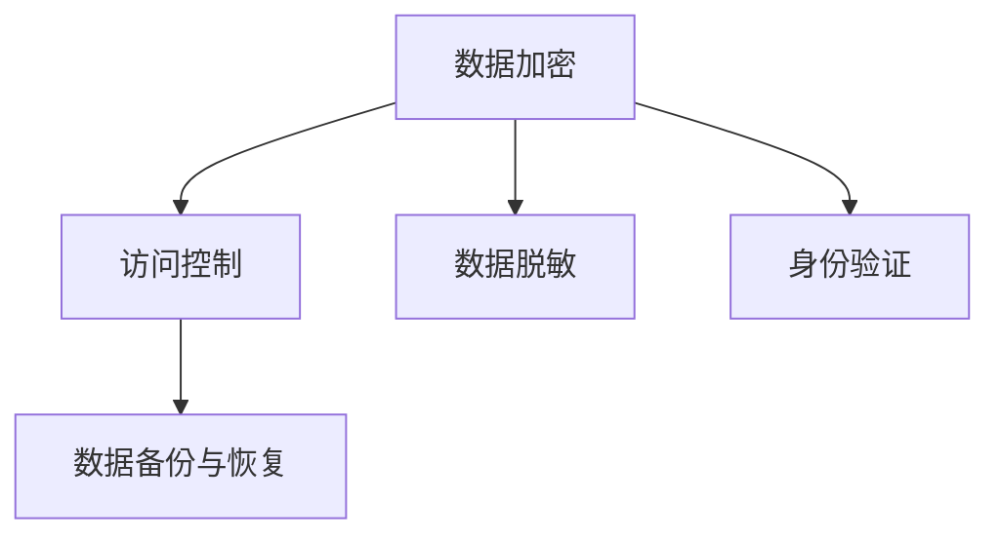

                 

# 数据安全：如何保护数据不被泄露和滥用？

在数字化时代，数据安全问题已经成为企业和个人关注的焦点。无论是数据泄露、身份盗窃还是数据滥用，都可能给用户和企业带来巨大的损失。本文将深入探讨数据安全的核心概念与技术，从理论到实践，提供全面系统的解决方案。

## 1. 背景介绍

### 1.1 问题由来

随着互联网的普及和数字技术的快速发展，人们的生活和工作越来越依赖于数据的收集、存储和处理。然而，数据安全问题也随之而来，成为全球关注的焦点。数据泄露事件频发，个人信息、企业机密等敏感数据被非法获取和滥用，导致用户隐私权受损、企业信誉下降和经济损失。

### 1.2 问题核心关键点

数据安全的核心在于保护数据的机密性、完整性和可用性。机密性是指防止未经授权的访问；完整性是指防止数据的篡改或损坏；可用性是指保证数据在需要时能够被合法用户访问。

解决数据安全问题，需要从技术、管理、法规等多个层面综合考虑，采取合适的措施来保护数据免受泄露和滥用。本文将聚焦于从技术角度，介绍几种常见的数据保护策略和方法。

## 2. 核心概念与联系

### 2.1 核心概念概述

为更好地理解数据安全技术，本节将介绍几个密切相关的核心概念：

- 数据加密(Data Encryption)：通过某种算法将原始数据转换成不可读的密文，只有经过授权的用户才能解密还原为原始数据。
- 访问控制(Access Control)：通过身份认证和权限管理，限制用户对数据的访问权限，确保只有合法用户才能访问数据。
- 数据脱敏(Data Masking)：对敏感数据进行伪装处理，使其在显示时不泄露敏感信息，但仍能满足业务需求。
- 身份验证(Identity Verification)：通过各种方式验证用户身份的真实性，确保身份的真实性。
- 数据备份与恢复(Data Backup and Recovery)：定期备份数据，防止数据丢失，并在数据被破坏或损坏时能够快速恢复。

这些核心概念之间的逻辑关系可以通过以下Mermaid流程图来展示：



这个流程图展示了几类数据保护技术的相互关系：

1. 数据加密和访问控制是基础的数据保护手段，确保数据在传输和存储过程中的安全性。
2. 数据脱敏和身份验证可以进一步增强数据保护的效果，使数据在不泄露敏感信息的前提下仍然可用。
3. 数据备份与恢复则提供了数据完整性和可用性的保障，在数据损坏或丢失时能够快速恢复。

## 3. 核心算法原理 & 具体操作步骤
### 3.1 算法原理概述

数据安全技术包括加密算法、访问控制技术、身份验证方法等，其中核心算法原理如下：

- **对称加密算法**：使用相同的密钥加密和解密数据，速度较快，适用于数据量大且传输频繁的场景。
- **非对称加密算法**：使用公钥加密数据，私钥解密数据，提供更高的安全性，但加解密速度较慢。
- **哈希函数**：将任意长度的数据转换为固定长度的哈希值，常用于验证数据完整性。
- **访问控制列表(ACL)**：根据用户角色和权限，限制对数据的访问。
- **多因素身份验证(MFA)**：结合多种身份验证方式，提高身份验证的安全性。

### 3.2 算法步骤详解

下面以对称加密算法为例，详细介绍其具体操作步骤：

1. **密钥生成**：选择一段随机密钥，并将其与原始数据一起进行加密。
2. **数据加密**：使用对称加密算法将原始数据加密为密文。
3. **密钥分发**：将密钥安全地传输给解密方。
4. **数据解密**：解密方使用相同的密钥将密文解密为原始数据。

使用对称加密算法时，密钥的安全分发是关键。常见的分发方式包括密钥交换协议和密钥管理服务。

### 3.3 算法优缺点

数据加密技术的优点包括：

- 保障数据在传输和存储过程中的机密性。
- 对数据的访问和处理进行严格控制。
- 通过哈希函数验证数据的完整性。

然而，数据加密也存在一些缺点：

- 密钥分发和管理难度较大。
- 对高性能计算资源的要求较高。
- 存在密钥泄露的风险。

### 3.4 算法应用领域

数据加密技术在金融、医疗、政府等敏感领域得到广泛应用，确保数据的安全性和隐私性。例如，金融行业使用非对称加密算法进行电子支付和交易验证，医疗行业使用数据脱敏技术保护患者隐私，政府部门使用访问控制技术保护国家机密。

## 4. 数学模型和公式 & 详细讲解 & 举例说明

### 4.1 数学模型构建

假设原始数据为 $M$，密钥为 $K$，使用对称加密算法 $E$ 进行加密，得到密文 $C$。解密过程使用解密算法 $D$，得到原始数据 $M'$。

数学模型可以表示为：

$$
C = E(M, K) \\
M' = D(C, K)
$$

### 4.2 公式推导过程

对于常见的AES算法，其加密过程可表示为：

1. **字节替换**：将数据按字节进行替换。
2. **行移位**：将数据分为多个行，进行移位操作。
3. **列混淆**：将数据列进行混淆。
4. **轮密钥加**：将数据与轮密钥进行异或运算。

解密过程与加密过程类似，只是使用相反的运算步骤。

### 4.3 案例分析与讲解

以RSA算法为例，其公钥和私钥分别为 $(e, n)$ 和 $(d, n)$。设原始数据为 $M$，公钥为 $(e, n)$，密文为 $C$。

$$
C = M^e \mod n \\
M = C^d \mod n
$$

RSA算法通过公钥加密，私钥解密，确保数据的安全性。其优点是密钥分发和管理相对简单，但加解密速度较慢。

## 5. 项目实践：代码实例和详细解释说明

### 5.1 开发环境搭建

在进行数据安全实践前，我们需要准备好开发环境。以下是使用Python进行加密开发的环境配置流程：

1. 安装Anaconda：从官网下载并安装Anaconda，用于创建独立的Python环境。

2. 创建并激活虚拟环境：
```bash
conda create -n cryptography-env python=3.8 
conda activate cryptography-env
```

3. 安装必要的库：
```bash
pip install pycrypto cryptography
```

4. 配置密钥：
```python
from cryptography.fernet import Fernet

key = Fernet.generate_key()
cipher_suite = Fernet(key)
```

完成上述步骤后，即可在`cryptography-env`环境中开始加密实践。

### 5.2 源代码详细实现

下面以对称加密算法AES为例，给出使用pycrypto库进行加密和解密的PyTorch代码实现。

```python
from cryptography.fernet import Fernet

def encrypt_message(message, key):
    cipher_suite = Fernet(key)
    return cipher_suite.encrypt(message.encode())

def decrypt_message(ciphertext, key):
    cipher_suite = Fernet(key)
    return cipher_suite.decrypt(ciphertext).decode()

key = Fernet.generate_key()

message = "Hello, world!"
ciphertext = encrypt_message(message, key)
decrypted_message = decrypt_message(ciphertext, key)

print(f"Original message: {message}")
print(f"Ciphertext: {ciphertext}")
print(f"Decrypted message: {decrypted_message}")
```

### 5.3 代码解读与分析

让我们再详细解读一下关键代码的实现细节：

- **加密函数encrypt_message**：接受明文消息和密钥，使用AES算法进行加密，返回密文。
- **解密函数decrypt_message**：接受密文和密钥，使用AES算法进行解密，返回明文。
- **生成密钥函数Fernet.generate_key**：生成一段随机密钥，用于加密和解密操作。

在实际应用中，需要根据具体场景选择合适的加密算法和密钥管理策略。例如，对于传输数据的加密，通常采用非对称加密算法，如RSA；对于存储数据的加密，通常采用对称加密算法，如AES。

## 6. 实际应用场景

### 6.1 金融领域

在金融领域，数据安全尤为重要。银行和金融机构需要保护客户的账户信息、交易记录等敏感数据，防止数据泄露和非法访问。常见措施包括：

- **加密传输**：使用SSL/TLS协议加密银行网站和应用程序的数据传输。
- **访问控制**：限制用户的访问权限，只允许授权人员访问敏感数据。
- **多因素身份验证**：结合密码、手机验证码、指纹等多种身份验证方式，提高身份验证的安全性。

### 6.2 医疗行业

医疗行业涉及大量患者隐私数据，如病历、诊断报告等。为了保护患者隐私，医疗机构通常采取以下措施：

- **数据脱敏**：对敏感数据进行脱敏处理，如姓名、身份证号等，保护患者隐私。
- **访问控制**：限制医护人员对患者数据的访问权限，确保数据仅对授权人员可见。
- **加密存储**：使用加密技术对患者数据进行存储，防止数据泄露。

### 6.3 政府机构

政府机构需要保护国家机密、公民个人信息等敏感数据，防止数据被非法获取和滥用。常见措施包括：

- **加密传输**：使用VPN和加密技术保护政府网络的数据传输。
- **访问控制**：使用访问控制列表(ACL)限制用户访问权限，确保数据仅对授权人员可见。
- **身份验证**：使用多因素身份验证(MFA)和生物识别技术，提高身份验证的安全性。

### 6.4 未来应用展望

随着技术的发展，未来数据安全技术将更加先进和智能。以下是一些未来发展趋势：

- **区块链技术**：结合区块链技术的不可篡改特性，实现数据的去中心化和透明化。
- **零知识证明**：在不泄露数据的前提下，验证数据的正确性。
- **深度学习**：使用深度学习算法，提升身份验证和异常检测的准确性。
- **量子计算**：使用量子计算技术，提升加密算法的安全性。

## 7. 工具和资源推荐
### 7.1 学习资源推荐

为了帮助开发者系统掌握数据安全技术的理论基础和实践技巧，这里推荐一些优质的学习资源：

1. 《密码学原理与应用》系列书籍：由密码学专家撰写，系统介绍了现代密码学的基础知识和应用场景。
2. 《数据安全技术导论》：全面介绍了数据加密、访问控制、身份验证等数据安全技术的基本原理和实践方法。
3. CS446《网络安全》课程：由斯坦福大学开设的网络安全课程，涵盖了网络安全的基础知识和实际应用案例。
4. 《信息安全与隐私保护》：系统介绍了信息安全的基本概念、技术和实践。

通过对这些资源的学习实践，相信你一定能够快速掌握数据安全技术的精髓，并用于解决实际的数据安全问题。

### 7.2 开发工具推荐

高效的开发离不开优秀的工具支持。以下是几款用于数据安全开发的常用工具：

1. Python：Python拥有丰富的加密和解密库，如pycrypto、cryptography等，适合数据安全相关任务的开发。
2. OpenSSL：开源的加密套接字库，支持SSL/TLS协议，广泛用于加密传输和数字证书管理。
3. OpenPGP：开源的加密工具，支持PGP加密标准，适合文件和邮件加密。
4. GnuPG：一个实现OpenPGP协议的开源工具，提供强大的加密和签名功能。
5. Wireshark：网络协议分析工具，用于网络流量分析和数据包加密的检测。

合理利用这些工具，可以显著提升数据安全开发的效率，确保数据的安全性和隐私性。

### 7.3 相关论文推荐

数据安全技术的发展源于学界的持续研究。以下是几篇奠基性的相关论文，推荐阅读：

1. "Public-Key Cryptosystems Without Random Oracles"：提出了RSA加密算法，开创了非对称加密技术的先河。
2. "On the Formulation of Requirements for Security"：提出了信息安全的五个基本要素：机密性、完整性、可用性、身份认证和不可否认性。
3. "Practical Cryptographic Systems: Protocols, Algorithms, and Analysis"：详细介绍了现代密码学的基本概念和应用场景，是密码学研究的经典之作。
4. "Secure Communication Over Insecure Channels"：介绍了SSL/TLS协议的工作原理和安全性分析。
5. "Zero-Knowledge Proofs of Knowledge"：提出了零知识证明的概念，在不泄露信息的情况下验证数据的正确性。

这些论文代表了大数据安全技术的发展脉络。通过学习这些前沿成果，可以帮助研究者把握学科前进方向，激发更多的创新灵感。

## 8. 总结：未来发展趋势与挑战

### 8.1 总结

本文对数据安全的核心概念与技术进行了全面系统的介绍。首先阐述了数据安全的背景和重要性，明确了数据安全的目标和手段。其次，从理论到实践，详细讲解了数据加密、访问控制、身份验证等数据保护技术。最后，提供了实际应用场景和未来发展趋势的展望。

通过本文的系统梳理，可以看到，数据安全技术在大数据时代尤为重要，保障数据的机密性、完整性和可用性，是构建安全可信的信息系统的基础。未来，伴随技术的发展和应用场景的变化，数据安全技术还需要持续创新，以应对新的挑战和需求。

### 8.2 未来发展趋势

展望未来，数据安全技术将呈现以下几个发展趋势：

1. **区块链技术的应用**：区块链技术的去中心化和不可篡改特性，将进一步提升数据的安全性和透明性。
2. **量子计算的影响**：量子计算的出现，对传统加密算法提出了新的挑战，需要开发新的量子安全加密技术。
3. **人工智能的应用**：结合人工智能技术，提升身份验证和异常检测的准确性和效率。
4. **隐私计算的发展**：隐私计算技术如差分隐私、多方安全计算等，将进一步保护数据隐私，确保数据在不泄露的前提下进行分析和处理。
5. **边缘计算的崛起**：边缘计算技术将数据处理和存储从云端转移到设备端，提升了数据的安全性和隐私保护能力。

### 8.3 面临的挑战

尽管数据安全技术已经取得了长足进步，但在迈向更加智能化、普适化应用的过程中，仍面临诸多挑战：

1. **技术复杂性**：数据安全技术涉及多个层次和环节，技术实现和应用部署较为复杂。
2. **性能瓶颈**：数据加密和解密过程对性能要求较高，特别是在大规模数据处理和高并发场景下，性能瓶颈显著。
3. **成本问题**：数据安全技术需要高昂的成本投入，包括硬件、软件和人力资源等。
4. **跨平台兼容性**：不同平台和系统之间的数据安全技术标准不统一，导致兼容性和互操作性问题。
5. **法规和合规性**：各国对数据安全法规和合规性要求不同，增加了数据安全技术应用的复杂性。

### 8.4 研究展望

面对数据安全技术面临的挑战，未来的研究需要在以下几个方面寻求新的突破：

1. **简化技术实现**：开发更加简洁高效的数据安全算法和工具，降低技术实现和应用部署的复杂度。
2. **优化性能**：提升数据加密和解密算法的性能，适应大规模数据处理和高并发场景的需求。
3. **降低成本**：探索低成本的数据安全技术方案，降低应用成本，提高数据安全技术的普及率。
4. **统一标准**：制定和推广统一的数据安全标准，提高数据安全技术的跨平台兼容性和互操作性。
5. **加强法规合规性**：结合各国法规和合规性要求，开发符合法律法规的数据安全技术，确保数据安全技术的应用合法性和规范性。

## 9. 附录：常见问题与解答

**Q1：数据加密有哪些常见的算法和应用场景？**

A: 常见的数据加密算法包括对称加密算法（如AES）、非对称加密算法（如RSA）、哈希函数（如SHA-256）等。

对称加密算法适合数据量大且传输频繁的场景，如加密存储、数据传输等。非对称加密算法适合密钥分发和管理难度较大的场景，如数字证书、加密邮件等。哈希函数适合验证数据的完整性，如数据校验、数字签名等。

**Q2：如何进行数据脱敏处理？**

A: 数据脱敏通常使用假数据替换真实数据，但保留数据的基本结构。常见的脱敏方法包括：

1. **屏蔽**：将敏感信息用“***”或“[mask]”替换。
2. **泛化**：将具体数据转换为泛化数据，如年龄替换为“25-35岁”。
3. **扰动**：对数据进行微小扰动，使数据难以识别。
4. **掩码**：将数据部分遮盖，只保留必要信息。

根据具体场景选择合适的脱敏方法，确保数据在隐私保护的前提下仍然可用。

**Q3：如何实现身份验证的多因素认证？**

A: 多因素身份验证(MFA)通常结合密码、手机验证码、指纹等多种身份验证方式。常见实现方式包括：

1. **短信验证码**：用户使用手机获取短信验证码，结合密码进行身份验证。
2. **生物识别**：使用指纹、面部识别等生物特征进行身份验证。
3. **硬件令牌**：使用硬件设备生成一次性令牌，结合密码进行身份验证。

多因素身份验证提高了身份验证的安全性，减少了密码泄露的风险。

**Q4：数据备份与恢复的最佳实践是什么？**

A: 数据备份与恢复的最佳实践包括：

1. **定期备份**：定期对关键数据进行备份，确保数据在意外损坏或丢失时能够恢复。
2. **多备份**：使用多个备份存储位置，避免单点故障导致的备份失效。
3. **增量备份**：只备份变化的数据，减少备份存储的压力。
4. **自动化恢复**：使用自动化工具进行数据恢复，确保数据恢复的快速性和准确性。

遵循这些最佳实践，可以确保数据备份与恢复的可靠性，保障数据的安全性和完整性。

**Q5：如何确保数据传输的安全性？**

A: 确保数据传输的安全性需要采用以下措施：

1. **加密传输**：使用SSL/TLS协议对数据传输进行加密。
2. **身份验证**：对通信双方进行身份验证，确保通信安全。
3. **访问控制**：限制通信双方的访问权限，确保数据仅对授权人员可见。
4. **网络隔离**：将敏感数据传输隔离在安全的网络环境中，防止网络攻击和数据泄露。

通过这些措施，可以确保数据在传输过程中的机密性和完整性。

---

作者：禅与计算机程序设计艺术 / Zen and the Art of Computer Programming

