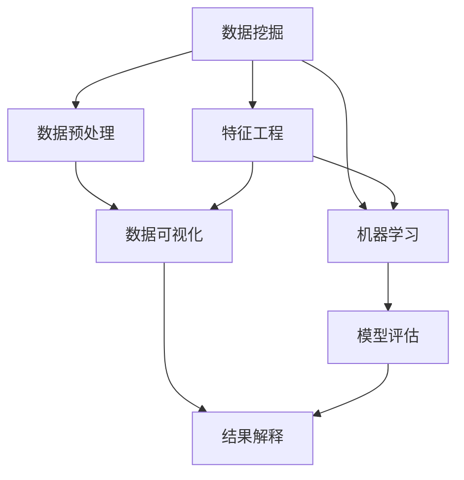

                 

# 数据挖掘 原理与代码实例讲解

> 关键词：数据挖掘, 机器学习, 特征工程, 数据可视化, 统计学习

## 1. 背景介绍

数据挖掘（Data Mining），通常被认为是从数据集中发现有用信息和知识的过程。其目的是通过对数据进行自动化处理，挖掘出有价值的模式、关系、规律和趋势，以此来支持决策制定。随着大数据时代的来临，数据挖掘技术在科学研究、商业智能、医疗健康、金融分析等多个领域都得到了广泛应用。

### 1.1 问题由来

在实际应用中，数据挖掘面临的一个主要问题是如何在庞大的数据集中快速、准确地发现有用的信息。传统的数据挖掘方法通常需要人工介入，依赖数据专家对数据的理解和领域知识，这不仅耗时耗力，还容易受到主观偏见的影响。而现代数据挖掘方法通过机器学习、统计学习等算法，可以自动化地进行数据处理和模式发现，大幅提高了数据挖掘的效率和效果。

### 1.2 问题核心关键点

数据挖掘的核心问题包括：
- 数据预处理：包括数据清洗、缺失值填补、数据归一化等步骤。
- 特征选择和工程：从原始数据中提取和构造对目标任务有用的特征。
- 模型训练和选择：选择合适的模型算法进行训练，并对模型性能进行评估。
- 模型优化和调参：通过超参数优化，提高模型性能和泛化能力。
- 结果解释和可视化：将模型结果转化为易于理解和展示的形式，帮助用户理解发现的知识。

## 2. 核心概念与联系

### 2.1 核心概念概述

为更好地理解数据挖掘方法，本节将介绍几个密切相关的核心概念：

- 数据挖掘（Data Mining）：通过自动化或半自动化的方式，从数据集中发现有用信息和知识的过程。
- 机器学习（Machine Learning）：通过数据学习预测模型，实现对新数据的预测和分类。
- 特征工程（Feature Engineering）：从原始数据中提取、选择和构造对目标任务有用的特征。
- 统计学习（Statistical Learning）：通过统计学方法对数据进行建模和分析。
- 数据可视化（Data Visualization）：将数据转化为图表、图形等可视化形式，帮助理解和解释数据。
- 数据预处理（Data Preprocessing）：包括数据清洗、缺失值填补、数据归一化等步骤，准备数据进行进一步分析。

这些核心概念之间的逻辑关系可以通过以下Mermaid流程图来展示：



这个流程图展示数据挖掘的核心概念及其之间的关系：

1. 数据挖掘通过数据预处理获得高质量数据。
2. 特征工程对数据进行特征提取，选择和构造对模型训练有用的特征。
3. 机器学习模型在特征工程的基础上进行训练，学习数据的模式和规律。
4. 模型评估对训练好的模型进行性能测试和验证。
5. 数据可视化将模型结果转化为易于理解的图表形式。
6. 结果解释帮助用户理解和应用模型发现的知识。

## 3. 核心算法原理 & 具体操作步骤

### 3.1 算法原理概述

数据挖掘通常包括以下几个步骤：

1. **数据收集**：从不同来源收集数据，包括结构化数据（如数据库、表格）和非结构化数据（如文本、图像）。
2. **数据预处理**：清洗和整理数据，处理缺失值、异常值和重复数据，进行数据归一化等。
3. **特征选择和构造**：根据任务需求，从原始数据中提取和构造特征。
4. **模型训练**：选择合适的机器学习或统计学习算法，训练数据模型。
5. **模型评估**：使用测试集对模型进行性能评估，选择最优模型。
6. **结果解释**：将模型结果转化为可视化形式，帮助理解模型发现的知识。

### 3.2 算法步骤详解

**Step 1: 数据收集**

数据收集是数据挖掘的第一步，包括数据获取、数据清洗和数据整合。数据来源多样，可能来自数据库、互联网、传感器等。数据收集后，需要对数据进行初步清洗和整合，以确保数据的完整性和一致性。

**Step 2: 数据预处理**

数据预处理是对数据进行清洗和整理，主要包括数据清洗、缺失值填补、数据归一化等步骤。数据清洗包括去除重复数据、处理缺失值、检测并处理异常值等。缺失值填补可以采用均值填补、插值法、KNN算法等方法。数据归一化包括标准化和归一化，使数据在0到1之间，便于算法处理。

**Step 3: 特征选择和构造**

特征选择和构造是从原始数据中提取、选择和构造对目标任务有用的特征。特征选择方法包括过滤式、包裹式和嵌入式。过滤式方法是在模型训练之前进行特征选择，包括信息增益、卡方检验等。包裹式方法是在模型训练过程中进行特征选择，如递归特征消除。嵌入式方法是在模型训练中同时进行特征选择和模型训练，如Lasso回归。特征构造方法包括特征组合、特征变换等，如多项式特征、热图等。

**Step 4: 模型训练**

模型训练是使用特征工程后的数据，选择合适的机器学习或统计学习算法，训练数据模型。常见算法包括决策树、随机森林、K近邻、支持向量机、神经网络等。模型训练过程中，需要通过交叉验证等方法进行模型调参和优化。

**Step 5: 模型评估**

模型评估是对训练好的模型进行性能测试和验证，评估模型在新数据上的泛化能力。评估指标包括准确率、召回率、F1分数、AUC等。模型评估可以通过测试集进行，也可以使用留出法、交叉验证等方法。

**Step 6: 结果解释**

结果解释是将模型结果转化为可视化形式，帮助用户理解和应用模型发现的知识。结果解释方法包括图表、热图、可视化工具等，如Matplotlib、Seaborn、Tableau等。结果解释有助于用户理解模型发现的知识，帮助决策制定。

### 3.3 算法优缺点

数据挖掘方法具有以下优点：

- **自动化处理**：数据挖掘方法能够自动化地处理和分析大量数据，提高了效率和效果。
- **高准确性**：数据挖掘方法通常基于统计学和机器学习算法，能够实现高精度的预测和分类。
- **泛化能力**：数据挖掘模型能够在新数据上泛化，帮助发现数据中的规律和趋势。

同时，数据挖掘方法也存在以下缺点：

- **数据依赖**：数据挖掘结果高度依赖于数据的质量和特征选择，数据噪声和异常值可能会影响模型性能。
- **模型复杂度**：复杂的模型容易过拟合，需要更多数据和更强的计算资源。
- **结果解释性不足**：数据挖掘模型通常是黑盒模型，结果解释性不足，难以理解模型的内部机制。

尽管存在这些局限性，但就目前而言，数据挖掘方法仍然是数据分析和决策制定的重要工具。未来研究重点在于如何进一步提高数据挖掘的自动化和准确性，减少数据依赖，增强模型解释性。

### 3.4 算法应用领域

数据挖掘方法在多个领域得到了广泛应用，例如：

- 医疗健康：用于疾病诊断、患者分群、基因分析等，帮助提高医疗决策的准确性和效率。
- 金融分析：用于信用评分、风险评估、市场预测等，帮助金融机构制定更加精准的策略。
- 商业智能：用于市场分析、客户细分、产品推荐等，帮助企业制定更加有效的市场策略。
- 客户服务：用于客户分类、服务预测、情感分析等，帮助企业提升客户满意度和服务质量。
- 网络安全：用于异常检测、入侵检测、威胁分析等，帮助提高网络安全水平。

## 4. 数学模型和公式 & 详细讲解 & 举例说明

### 4.1 数学模型构建

数据挖掘的数学模型构建通常包括以下几个步骤：

1. **数据描述性统计**：计算数据的均值、方差、标准差等统计量。
2. **数据分布假设检验**：使用t检验、卡方检验等方法，检验数据分布是否符合假设。
3. **回归模型构建**：构建线性回归、多项式回归、岭回归等模型，预测变量之间的线性关系。
4. **分类模型构建**：构建逻辑回归、决策树、随机森林等模型，分类不同类别的数据。
5. **聚类模型构建**：构建K-means、层次聚类等模型，将数据分为不同类别。

### 4.2 公式推导过程

以线性回归模型为例，其公式推导过程如下：

设样本数据集为 $D=\{(x_i,y_i)\}_{i=1}^n$，其中 $x_i=(x_{i1},x_{i2},\cdots,x_{ip})$ 为自变量，$y_i$ 为因变量。线性回归模型的目标是最小化残差平方和：

$$
\min_{\beta_0,\beta_1,\cdots,\beta_p} \sum_{i=1}^n(y_i - \beta_0 - \beta_1x_{i1} - \cdots - \beta_px_{ip})^2
$$

其中，$\beta_0,\beta_1,\cdots,\beta_p$ 为模型参数，表示回归系数。通过最小二乘法求解上述优化问题，得到回归系数的解：

$$
\beta_0 = \frac{\sum_{i=1}^n(y_i - \bar{y})}{\sum_{i=1}^n(x_{i1} - \bar{x_1})^2}
$$

$$
\beta_j = \frac{\sum_{i=1}^n(x_{ij} - \bar{x_j})(y_i - \bar{y})}{\sum_{i=1}^n(x_{ij} - \bar{x_j})^2} \quad (j=1,\cdots,p)
$$

其中，$\bar{x_j}$ 和 $\bar{y}$ 分别为自变量和因变量的均值。

### 4.3 案例分析与讲解

**案例1: 信用评分模型**

信用评分模型是数据挖掘在金融分析中的一个典型应用。其主要任务是根据客户的历史贷款记录，预测其未来的还款能力。数据集包括客户的年龄、收入、贷款记录等特征，以及对应的信用评分标签。

数据预处理包括数据清洗、缺失值填补、数据归一化等步骤。特征工程包括特征选择和构造，如提取客户的平均还款周期、还款金额等特征。模型训练可以选择线性回归、决策树等算法，通过交叉验证等方法进行调参和优化。模型评估可以使用准确率、AUC等指标进行。结果解释可以通过图表、热图等形式进行可视化。

**案例2: 客户细分模型**

客户细分模型是数据挖掘在市场营销中的一个重要应用。其主要任务是将客户分为不同的群体，以便制定更加精准的市场策略。数据集包括客户的购买记录、浏览记录等特征，以及对应的客户细分标签。

数据预处理包括数据清洗、缺失值填补等步骤。特征工程包括特征选择和构造，如提取客户的购买频率、浏览时间等特征。模型训练可以选择聚类算法，如K-means、层次聚类等。模型评估可以使用轮廓系数、F1分数等指标进行。结果解释可以通过热图、散点图等形式进行可视化。

## 5. 项目实践：代码实例和详细解释说明

### 5.1 开发环境搭建

在进行数据挖掘项目实践前，我们需要准备好开发环境。以下是使用Python进行Scikit-learn开发的环境配置流程：

1. 安装Anaconda：从官网下载并安装Anaconda，用于创建独立的Python环境。

2. 创建并激活虚拟环境：
```bash
conda create -n sklearn-env python=3.8 
conda activate sklearn-env
```

3. 安装Scikit-learn：
```bash
conda install scikit-learn
```

4. 安装其他必要的库：
```bash
pip install numpy pandas matplotlib seaborn
```

完成上述步骤后，即可在`sklearn-env`环境中开始数据挖掘实践。

### 5.2 源代码详细实现

下面我们以信用评分模型为例，给出使用Scikit-learn库进行线性回归的Python代码实现。

首先，导入所需的库和数据集：

```python
import numpy as np
import pandas as pd
from sklearn.linear_model import LinearRegression
from sklearn.model_selection import train_test_split
from sklearn.metrics import mean_squared_error, r2_score

# 导入数据集
data = pd.read_csv('credit_data.csv')
```

然后，定义数据预处理函数：

```python
def preprocess_data(data):
    # 数据清洗
    data = data.dropna()  # 删除缺失值
    
    # 特征工程
    data['avg_loan_amount'] = data['loan_amount'].mean()  # 均值填补缺失值
    data = data.drop(columns=['loan_amount'])  # 删除已填补的特征
    
    # 数据归一化
    data = (data - data.mean()) / data.std()  # 标准化
    
    return data
```

接着，定义模型训练函数：

```python
def train_model(data, target):
    X = data.drop(columns=[target])
    y = data[target]
    
    X_train, X_test, y_train, y_test = train_test_split(X, y, test_size=0.2, random_state=42)
    
    model = LinearRegression()
    model.fit(X_train, y_train)
    
    return model, X_test, y_test
```

最后，启动模型训练和评估流程：

```python
# 数据预处理
data = preprocess_data(data)

# 模型训练
model, X_test, y_test = train_model(data, 'credit_score')

# 模型评估
y_pred = model.predict(X_test)
mse = mean_squared_error(y_test, y_pred)
r2 = r2_score(y_test, y_pred)
print(f"Mean Squared Error: {mse:.3f}")
print(f"R^2 Score: {r2:.3f}")
```

以上就是使用Scikit-learn库进行线性回归的完整代码实现。可以看到，利用Scikit-learn库，数据预处理、模型训练和评估等步骤都可以通过简单的函数调用实现，极大地简化了数据挖掘任务的开发过程。

### 5.3 代码解读与分析

让我们再详细解读一下关键代码的实现细节：

**preprocess_data函数**：
- 数据清洗：删除缺失值。
- 特征工程：计算平均贷款金额，填补缺失值，并删除已填补的特征。
- 数据归一化：标准化数据，使其均值为0，标准差为1。

**train_model函数**：
- 数据分割：将数据集分割为训练集和测试集。
- 模型训练：训练线性回归模型，返回模型、测试集数据和标签。

**启动模型训练和评估**：
- 数据预处理：对原始数据进行预处理。
- 模型训练：训练线性回归模型，并保存测试集数据和标签。
- 模型评估：计算测试集的均方误差和R^2分数，输出结果。

**数据挖掘任务实现**：
- 数据收集：导入数据集。
- 数据预处理：对数据进行清洗、缺失值填补和归一化。
- 特征选择和构造：从原始数据中选择和构造对目标任务有用的特征。
- 模型训练：选择合适的算法进行训练，返回模型和测试集数据。
- 模型评估：计算测试集的性能指标，输出结果。

通过这些代码，我们展示了数据挖掘任务的全过程，从数据预处理到模型训练和评估。

## 6. 实际应用场景

### 6.1 智慧医疗

智慧医疗领域，数据挖掘技术可以用于疾病预测、患者分群、基因分析等，帮助提高医疗决策的准确性和效率。例如，利用患者的病历数据、基因数据等，构建机器学习模型进行疾病预测，可以有效识别高风险患者，制定个性化的治疗方案。

### 6.2 金融风控

金融风控领域，数据挖掘技术可以用于信用评分、风险评估、市场预测等，帮助金融机构制定更加精准的策略。例如，利用客户的贷款记录、消费记录等数据，构建机器学习模型进行信用评分，可以有效识别高风险客户，降低坏账率。

### 6.3 客户服务

客户服务领域，数据挖掘技术可以用于客户分类、服务预测、情感分析等，帮助企业提升客户满意度和服务质量。例如，利用客户的购买记录、浏览记录等数据，构建聚类模型进行客户细分，可以制定更加精准的市场策略，提升客户体验。

### 6.4 未来应用展望

随着数据挖掘技术的不断发展，未来将在更多领域得到应用，为各行各业带来变革性影响。

- **智慧城市**：数据挖掘技术可以用于城市事件监测、舆情分析、应急指挥等环节，提高城市管理的自动化和智能化水平，构建更安全、高效的未来城市。
- **智慧农业**：数据挖掘技术可以用于土壤分析、作物识别、病虫害监测等，帮助农业生产智能化、精准化。
- **智慧交通**：数据挖掘技术可以用于交通流量预测、交通事故分析、智能导航等，提高交通系统的效率和安全性。

此外，数据挖掘技术还将与其他人工智能技术进行更深入的融合，如知识表示、因果推理、强化学习等，多路径协同发力，共同推动自然语言理解和智能交互系统的进步。

## 7. 工具和资源推荐

### 7.1 学习资源推荐

为了帮助开发者系统掌握数据挖掘的理论基础和实践技巧，这里推荐一些优质的学习资源：

1. 《机器学习》（周志华著）：经典的机器学习教材，涵盖了数据挖掘、统计学习、机器学习等核心内容。
2. Coursera《机器学习》课程：斯坦福大学Andrew Ng教授的机器学习课程，深入浅出地介绍了机器学习的基础知识和应用。
3. Kaggle平台：数据挖掘竞赛平台，提供丰富的数据集和算法实现，可以实践和提升数据挖掘技能。
4. Scikit-learn官方文档：Scikit-learn库的官方文档，提供了详细的使用指南和算法实现，是学习数据挖掘的好帮手。

通过对这些资源的学习实践，相信你一定能够快速掌握数据挖掘的精髓，并用于解决实际的业务问题。

### 7.2 开发工具推荐

高效的数据挖掘离不开优秀的工具支持。以下是几款用于数据挖掘开发的常用工具：

1. Scikit-learn：基于Python的开源机器学习库，集成了众多经典算法，使用方便。
2. TensorFlow：由Google主导开发的开源机器学习框架，支持分布式计算，适合大规模工程应用。
3. R语言：统计分析领域的语言，拥有丰富的数据挖掘和统计分析库，如caret、randomForest等。
4. Python数据挖掘库：包括Pandas、NumPy、SciPy等，提供高效的数据处理和分析工具。
5. 可视化工具：包括Matplotlib、Seaborn、Tableau等，帮助数据可视化，发现数据中的规律和趋势。

合理利用这些工具，可以显著提升数据挖掘任务的开发效率，加快创新迭代的步伐。

### 7.3 相关论文推荐

数据挖掘技术的发展源于学界的持续研究。以下是几篇奠基性的相关论文，推荐阅读：

1. "Data Mining: Concepts and Techniques"（第五版）：由Jerry Kilgour等编写的数据挖掘经典教材，介绍了数据挖掘的核心概念和方法。
2. "Introduction to Data Mining and Statistical Learning"（第二版）：由Gareth James等编写的数据挖掘教材，涵盖了数据预处理、特征工程、模型训练等内容。
3. "A Review of Data Mining Techniques for Predictive Maintenance"：一篇关于数据挖掘在预测性维护中的应用综述，介绍了多种数据挖掘算法和技术。

这些论文代表了大数据挖掘技术的发展脉络。通过学习这些前沿成果，可以帮助研究者把握学科前进方向，激发更多的创新灵感。

## 8. 总结：未来发展趋势与挑战

### 8.1 总结

本文对数据挖掘方法进行了全面系统的介绍。首先阐述了数据挖掘方法的研究背景和意义，明确了数据挖掘在提升数据利用效率、支持决策制定等方面的重要价值。其次，从原理到实践，详细讲解了数据挖掘的数学模型构建、特征工程、模型训练、模型评估等核心步骤，给出了数据挖掘任务开发的完整代码实例。同时，本文还广泛探讨了数据挖掘方法在医疗健康、金融风控、客户服务等多个行业领域的应用前景，展示了数据挖掘方法的广阔应用空间。此外，本文精选了数据挖掘技术的各类学习资源，力求为读者提供全方位的技术指引。

通过本文的系统梳理，可以看到，数据挖掘方法正在成为数据应用和决策制定的重要工具。这些方法的自动化、高效性和准确性，使其在科学研究、商业智能、医疗健康等多个领域得到了广泛应用。未来，伴随数据挖掘技术的不断演进，数据驱动的决策制定将更加智能化和自动化，数据挖掘将为人类的生产和生活带来更大的便利和价值。

### 8.2 未来发展趋势

展望未来，数据挖掘技术将呈现以下几个发展趋势：

1. **自动化程度提高**：未来数据挖掘将更加自动化和智能化，能够自动处理和分析大量数据，降低人工介入的需求。
2. **数据质量提升**：随着数据采集和处理技术的进步，数据的准确性和完整性将进一步提升，数据挖掘结果的可靠性和准确性也将提高。
3. **跨领域应用扩展**：数据挖掘方法将进一步扩展到更多领域，如智慧农业、智慧交通等，推动各行业的智能化和数字化转型。
4. **模型复杂度增加**：未来数据挖掘模型将更加复杂，能够处理更高维度的数据和多模态信息，提高模型的泛化能力和解释性。
5. **可解释性增强**：数据挖掘模型的可解释性将进一步增强，帮助用户理解模型的决策过程和结果，提高模型的可信度和接受度。
6. **数据安全保障**：数据挖掘过程中将更加注重数据隐私和安全，采用数据加密、数据脱敏等技术，确保数据安全。

以上趋势凸显了数据挖掘技术的广阔前景。这些方向的探索发展，必将进一步提升数据挖掘的自动化和准确性，增强模型的可解释性和安全性，为各行业的数据应用带来更大的价值。

### 8.3 面临的挑战

尽管数据挖掘技术已经取得了显著成果，但在迈向更加智能化、普适化应用的过程中，它仍面临诸多挑战：

1. **数据隐私和伦理**：数据挖掘过程中需要处理大量敏感数据，如何确保数据隐私和安全是一个重要问题。
2. **模型鲁棒性不足**：现有数据挖掘模型对数据噪声和异常值的鲁棒性不足，容易受到数据分布变化的影响。
3. **模型解释性不足**：数据挖掘模型通常是黑盒模型，难以解释其内部工作机制和决策逻辑。
4. **数据集成复杂**：不同数据源的数据格式、精度等不一致，数据集成和融合是一个复杂的技术挑战。
5. **计算资源需求高**：大规模数据挖掘任务需要大量的计算资源，如何优化计算效率是一个重要问题。
6. **业务理解不足**：数据挖掘模型需要业务专家的理解和指导，才能有效应用于实际业务场景。

正视数据挖掘面临的这些挑战，积极应对并寻求突破，将是大数据挖掘技术走向成熟的必由之路。相信随着学界和产业界的共同努力，这些挑战终将一一被克服，数据挖掘技术将为各行各业带来更多的创新和价值。

### 8.4 研究展望

面对数据挖掘所面临的挑战，未来的研究需要在以下几个方面寻求新的突破：

1. **数据隐私保护**：开发更加安全的数据处理和分析方法，如差分隐私、联邦学习等，确保数据隐私和安全。
2. **模型鲁棒性提升**：研究更加鲁棒的数据挖掘算法，提高模型对噪声和异常值的抵抗能力。
3. **模型解释性增强**：开发可解释的数据挖掘模型，如可解释的机器学习算法、可视化工具等，帮助用户理解模型的决策过程。
4. **数据集成优化**：研究高效的数据集成和融合方法，如数据匹配、数据清洗等，确保数据的质量和一致性。
5. **计算效率优化**：开发高效的数据挖掘算法和计算框架，如分布式计算、内存计算等，优化计算效率。
6. **业务应用深化**：加强数据挖掘模型与业务场景的结合，开发更具针对性的数据挖掘应用，推动数据驱动的决策制定。

这些研究方向将推动数据挖掘技术向更高效、更安全、更可解释的方向发展，为数据驱动的决策制定提供更强大的技术支持。

## 9. 附录：常见问题与解答

**Q1：数据挖掘是否只能用于数据分析？**

A: 数据挖掘不仅限于数据分析，它还包括数据预处理、特征工程、模型训练、模型评估等多个环节。在实际应用中，数据挖掘可以帮助发现数据中的规律和趋势，从而支持决策制定。

**Q2：数据挖掘是否需要大量的标注数据？**

A: 数据挖掘通常不需要标注数据，可以通过无监督学习、半监督学习等方法发现数据中的模式和规律。但针对特定任务，如分类、回归等，需要少量的标注数据进行模型训练和优化。

**Q3：数据挖掘结果是否总是可靠的？**

A: 数据挖掘结果的可靠性取决于数据的质量、特征的选择、模型的训练等多个因素。数据挖掘过程中需要经过严格的预处理和验证，确保结果的准确性和可信度。

**Q4：数据挖掘结果是否容易被解释？**

A: 数据挖掘模型通常是黑盒模型，难以解释其内部工作机制和决策逻辑。因此，需要开发可解释的数据挖掘模型，或者使用可视化工具帮助用户理解模型的结果。

**Q5：数据挖掘是否适用于所有的数据集？**

A: 数据挖掘技术适用于大多数数据集，但不同的数据集可能需要不同的处理方法。对于大规模、高维度的数据集，需要采用高效的算法和计算资源。对于小规模、低维度的数据集，可以选择简单的算法进行处理。

这些问题的回答，可以帮助读者更好地理解数据挖掘技术的原理和应用，为实际应用提供指导和参考。

---

作者：禅与计算机程序设计艺术 / Zen and the Art of Computer Programming

