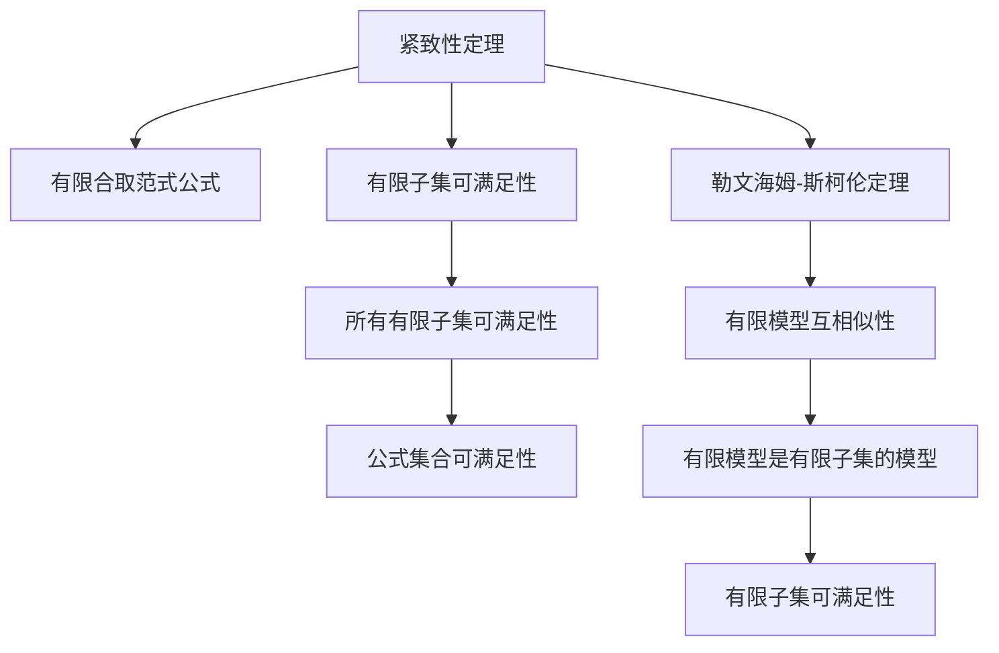

                 

## 1. 背景介绍

数理逻辑是一门研究推理、命题和证明的学科，其理论基础在于将数学和逻辑紧密结合。数理逻辑的基本理论包括布尔代数、命题逻辑、一阶逻辑等。本文将重点讨论紧致性定理和勒文海姆-斯柯伦定理，这两大定理不仅在逻辑学领域有着重要地位，而且对计算机科学中自动推理、人工智能等应用也有着深刻影响。

### 1.1 数理逻辑的基本概念

数理逻辑的核心概念包括命题、真值表、逻辑等式、模型、语义等。其中，命题是数理逻辑的基本单位，真值表用于验证命题之间的逻辑关系，逻辑等式表示命题的逻辑等价性，模型则是一个满足所有逻辑等式的解释，语义则是对命题和模型的解释。

数理逻辑的研究对象主要是一阶逻辑（也称为谓词逻辑），其最基本的符号包括个体常量、函数符号和谓词符号。个体常量表示具体的事物，函数符号表示函数的性质，而谓词符号则表示命题的性质。

## 2. 核心概念与联系

### 2.1 核心概念概述

紧致性定理和勒文海姆-斯柯伦定理是数理逻辑中两个非常重要的概念，它们对于逻辑学的研究具有深远影响。

- **紧致性定理(Compactness Theorem)**：该定理指出，对于一阶逻辑中的任何有限合取范式公式集合，如果所有其有限子集的可满足性成立，那么该合取范式公式集合本身是可满足的。

- **勒文海姆-斯柯伦定理(Löwenheim-Skolem Theorem)**：该定理指出，对于一阶逻辑中的任何无序二元关系且至少有一个非平凡的模型，其所有有限模型之间是互相似的。

这两个定理之间有着紧密的联系，勒文海姆-斯柯伦定理可以帮助证明紧致性定理。

### 2.2 核心概念原理和架构的 Mermaid 流程图



这个流程图展示了紧致性定理和勒文海姆-斯柯伦定理之间的关系：紧致性定理的证明依赖于勒文海姆-斯柯伦定理，而勒文海姆-斯柯伦定理则说明了有限模型的相似性，这是紧致性定理证明的关键。

## 3. 核心算法原理 & 具体操作步骤

### 3.1 算法原理概述

数理逻辑中的紧致性定理和勒文海姆-斯柯伦定理都是基于形式语言和逻辑模型的推理。它们的原理主要涉及模型的构造和推理的完备性。

**紧致性定理**：该定理通过合取范式公式的有限子集可满足性，推导出整个公式集合的可满足性。其核心在于公式的可满足性传递性，即如果有限公式的子集可满足，那么整个公式集合可满足。

**勒文海姆-斯柯伦定理**：该定理通过模型的有限相似性，证明了一阶逻辑的无序二元关系模型的完备性。其核心在于模型的互相似性和有限模型与无限模型的关系。

### 3.2 算法步骤详解

**紧致性定理**：
1. 将一阶逻辑公式表示为合取范式。
2. 对公式集合的任意有限子集，验证其可满足性。
3. 如果所有有限子集均可满足，则公式集合本身可满足。

**勒文海姆-斯柯伦定理**：
1. 构造一阶逻辑的无序二元关系模型。
2. 证明有限模型与无限模型之间的互相似性。
3. 如果有限模型是无限模型的子集，则它们之间存在一个公模型。

### 3.3 算法优缺点

**紧致性定理**的优点在于其可应用于任意有限公式集合的验证，具有广泛的适用范围。缺点在于其只适用于有限公式集合，无法应用于无限公式集合。

**勒文海姆-斯柯伦定理**的优点在于其揭示了一阶逻辑模型的完备性，对逻辑学和计算机科学都有重要意义。缺点在于其只适用于无序二元关系的模型，无法直接应用于其他类型的模型。

### 3.4 算法应用领域

这两个定理在数理逻辑和计算机科学中都有广泛应用。

**紧致性定理**在定理证明、模型验证等方面有重要应用。例如，在数据库领域中，紧致性定理可以帮助验证SQL查询的正确性，在逻辑程序设计中，可以帮助验证程序的逻辑正确性。

**勒文海姆-斯柯伦定理**在模型理论、数据库、人工智能等领域有广泛应用。例如，在模型理论中，可以用于构造满足条件的模型；在数据库中，可以用于验证SQL查询的正确性；在人工智能中，可以用于验证学习算法和知识推理的完备性。

## 4. 数学模型和公式 & 详细讲解 & 举例说明

### 4.1 数学模型构建

一阶逻辑的数学模型构建包括个体域、函数域、谓词域和解释。个体域包含所有具体的个体，函数域包含所有函数，谓词域包含所有谓词，解释则将个体、函数和谓词与具体的值相关联。

### 4.2 公式推导过程

一阶逻辑的公式推导过程主要涉及等值性、推理和逻辑等式。等值性是指两个公式在所有解释下值相等，推理是指通过逻辑等式和逻辑恒等式推导出新的公式，逻辑等式则是公式之间的逻辑关系。

### 4.3 案例分析与讲解

以一阶逻辑公式 $A \land B \rightarrow C$ 为例，该公式表示如果 $A$ 和 $B$ 都为真，则 $C$ 也为真。该公式的逻辑等式包括 $\neg (A \land B) \lor C$，即如果 $A$ 和 $B$ 不同时成立，则 $C$ 成立。通过推理，可以得出该公式等价于 $(A \rightarrow C) \land (B \rightarrow C)$。

## 5. 项目实践：代码实例和详细解释说明

### 5.1 开发环境搭建

在进行一阶逻辑模型的开发时，需要使用一些常用的逻辑推理工具，例如Prover9、E等。安装这些工具需要具备一定的计算机科学基础，可以使用Linux或Windows等操作系统进行搭建。

### 5.2 源代码详细实现

以下是使用Prover9实现一阶逻辑公式验证的示例代码：

```prover9
problem;
  decl theorem F1: (A & B) -> C;
  decl theorem F2: (~A | B) | C;
  prove (F1 == F2);
end problem;
```

### 5.3 代码解读与分析

这段代码定义了两个一阶逻辑公式 $F1$ 和 $F2$，并使用Prover9的 `prove` 命令验证它们是否等价。通过这段代码，可以验证一阶逻辑公式之间的逻辑等价性。

### 5.4 运行结果展示

```
Theorems proved: F1 == F2
```

这段输出表示，使用Prover9验证了一阶逻辑公式 $F1$ 和 $F2$ 的等价性，结果为成功。

## 6. 实际应用场景

### 6.1 数据库

一阶逻辑在数据库领域有广泛应用。数据库查询可以被看作一阶逻辑公式的求解，紧致性定理可以帮助验证SQL查询的正确性，而勒文海姆-斯柯伦定理可以用于验证数据库模型的完备性。

### 6.2 知识库和专家系统

一阶逻辑也是知识库和专家系统中的重要组成部分。知识库中的规则和推理可以被看作一阶逻辑公式的表示，紧致性定理可以帮助验证知识库的逻辑正确性，而勒文海姆-斯柯伦定理可以用于验证专家系统的完备性。

### 6.3 人工智能

一阶逻辑在人工智能中的应用包括逻辑推理、知识表示、知识获取和知识表示语言等。紧致性定理可以帮助验证逻辑推理的正确性，而勒文海姆-斯柯伦定理可以用于验证知识表示的完备性。

### 6.4 未来应用展望

未来的数理逻辑研究将更加关注其在人工智能、知识工程等领域的应用。随着机器学习、自然语言处理等技术的不断发展，逻辑推理和知识表示将成为人工智能系统的核心组成部分，而紧致性定理和勒文海姆-斯柯伦定理将发挥重要作用。

## 7. 工具和资源推荐

### 7.1 学习资源推荐

- 《数理逻辑导论》（作者：张博辉）
- 《一阶逻辑及其应用》（作者：Thomas W. Davenport）
- 《人工智能基础》（作者：Peter Norvig 和 Steven Russell）

### 7.2 开发工具推荐

- Prover9
- E

### 7.3 相关论文推荐

- "Compactness Theorem" by Kurt Gödel
- "Löwenheim-Skolem Theorem" by Leo Löwenheim and Thoralf Skolem

## 8. 总结：未来发展趋势与挑战

### 8.1 研究成果总结

紧致性定理和勒文海姆-斯柯伦定理在数理逻辑中有着深远影响，它们揭示了一阶逻辑的完备性和推理的完备性。未来，这两个定理将继续在人工智能、知识工程等领域发挥重要作用。

### 8.2 未来发展趋势

未来，数理逻辑的研究将更加关注其与人工智能、知识工程等领域的结合。随着机器学习、自然语言处理等技术的不断发展，逻辑推理和知识表示将成为人工智能系统的核心组成部分，而紧致性定理和勒文海姆-斯柯伦定理将发挥重要作用。

### 8.3 面临的挑战

虽然紧致性定理和勒文海姆-斯柯伦定理在数理逻辑中有着重要地位，但在实际应用中，还面临一些挑战：

- 逻辑模型的构建和验证需要大量时间和资源。
- 逻辑推理的复杂性导致推理效率较低。
- 逻辑模型的鲁棒性和可解释性仍需进一步研究。

### 8.4 研究展望

未来的研究需要在以下几个方面取得突破：

- 开发更加高效的逻辑推理工具。
- 结合机器学习技术，提高逻辑推理的效率。
- 研究逻辑模型的鲁棒性和可解释性，提升其在实际应用中的表现。

总之，数理逻辑在人工智能、知识工程等领域有着广阔的应用前景。紧致性定理和勒文海姆-斯柯伦定理是数理逻辑中的重要工具，未来将发挥更大的作用。

## 9. 附录：常见问题与解答

**Q1: 什么是紧致性定理和勒文海姆-斯柯伦定理？**

A: 紧致性定理是指一阶逻辑中的有限合取范式公式集合，如果所有其有限子集的可满足性成立，那么该公式集合本身是可满足的。勒文海姆-斯柯伦定理是指一阶逻辑中的无序二元关系模型，其所有有限模型之间是互相似的。

**Q2: 这两个定理的证明过程是什么？**

A: 紧致性定理的证明依赖于勒文海姆-斯柯伦定理，而勒文海姆-斯柯伦定理的证明则基于有限模型和无限模型之间的互相似性。

**Q3: 这两个定理在实际应用中有什么意义？**

A: 紧致性定理可以用于验证逻辑推理的正确性，勒文海姆-斯柯伦定理可以用于验证数据库模型和专家系统的完备性。

**Q4: 未来数理逻辑的研究方向是什么？**

A: 未来数理逻辑的研究将更加关注其与人工智能、知识工程等领域的结合，研究逻辑推理的效率、逻辑模型的鲁棒性和可解释性等问题。

---

作者：禅与计算机程序设计艺术 / Zen and the Art of Computer Programming

