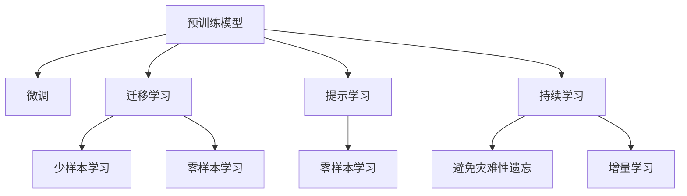

                 

## 1. 背景介绍

### 1.1 问题由来
随着人工智能技术的快速发展，文本与图像处理领域迎来了新的变革。传统基于手工特征提取和机器学习的处理方法已无法满足日益增长的数据处理需求。人工智能模型，特别是深度学习模型，通过端到端的学习，实现了自动化的特征提取和模式识别，极大地提升了文本和图像处理的效率和精度。

### 1.2 问题核心关键点
目前，基于深度学习的大规模预训练模型已经广泛应用于文本与图像处理领域，如BERT、GPT、VGG、ResNet等。这些模型通过在海量数据上进行预训练，学习到了丰富的特征表示，可以用于文本分类、图像识别、图像生成等多种任务。然而，预训练模型的应用仍面临一些挑战：

1. **数据依赖**：预训练模型通常需要大量的标注数据，对于某些任务，获取标注数据成本较高。
2. **迁移能力**：预训练模型在不同任务上的泛化能力有限，迁移能力有限。
3. **可解释性不足**：预训练模型往往被视为"黑盒"模型，其内部工作机制难以解释。
4. **计算资源需求高**：大规模预训练模型对计算资源要求较高，无法随时随地部署。

为了应对这些挑战，研究人员提出了微调(Fine-tuning)、迁移学习(Transfer Learning)、提示学习(Prompt Learning)等方法，以提升预训练模型的应用效果。这些方法在大规模预训练模型上进行少量微调，可以显著提高模型在特定任务上的性能，同时保持预训练模型的通用性和可解释性。

## 2. 核心概念与联系

### 2.1 核心概念概述

为更好地理解文本与图像处理的智能模型，本节将介绍几个密切相关的核心概念：

- **预训练模型(Pre-trained Model)**：如BERT、GPT、VGG、ResNet等，通过在大规模数据集上进行自监督学习，学习通用的特征表示。
- **微调(Fine-tuning)**：在预训练模型上进行少量有监督学习，适应特定任务的需求。
- **迁移学习(Transfer Learning)**：将预训练模型在其他相关任务上学习到的知识，迁移到当前任务上进行微调，提升模型性能。
- **提示学习(Prompt Learning)**：通过设计特定的输入格式，引导预训练模型生成期望的输出，无需大量标注数据即可实现。
- **少样本学习(Few-shot Learning)**：在只有少量标注样本的情况下，模型能够快速适应新任务。
- **零样本学习(Zero-shot Learning)**：模型无需见过任何特定任务的样本，仅凭任务描述即可执行。
- **持续学习(Continual Learning)**：模型能够不断学习新知识，同时保持已有知识，避免灾难性遗忘。

这些核心概念之间的逻辑关系可以通过以下Mermaid流程图来展示：



这个流程图展示了大规模预训练模型与其他核心概念之间的逻辑关系：

1. 预训练模型通过自监督学习获得通用特征。
2. 微调和迁移学习是对预训练模型进行特定任务适配的过程。
3. 提示学习在不更新模型参数的情况下，实现少样本学习和零样本学习。
4. 迁移学习连接预训练模型与下游任务，通过微调实现知识迁移。
5. 持续学习使得模型能够不断学习新知识，同时保持已有知识。

这些核心概念共同构成了预训练模型应用和优化的基础框架，使其能够在各种场景下发挥强大的处理能力。通过理解这些核心概念，我们可以更好地把握预训练模型的学习和应用方向。

## 3. 核心算法原理 & 具体操作步骤

### 3.1 算法原理概述

基于预训练模型的微调方法，本质上是一种有监督的细粒度迁移学习过程。其核心思想是：将预训练模型视为一种通用的特征提取器，通过在有标签的特定任务数据集上进行少量有监督学习，使得模型输出适应新的任务需求。

形式化地，假设预训练模型为 $M_{\theta}$，其中 $\theta$ 为预训练得到的模型参数。给定下游任务 $T$ 的标注数据集 $D=\{(x_i, y_i)\}_{i=1}^N$，微调的目标是找到新的模型参数 $\hat{\theta}$，使得：

$$
\hat{\theta}=\mathop{\arg\min}_{\theta} \mathcal{L}(M_{\theta},D)
$$

其中 $\mathcal{L}$ 为针对任务 $T$ 设计的损失函数，用于衡量模型预测输出与真实标签之间的差异。常见的损失函数包括交叉熵损失、均方误差损失等。

通过梯度下降等优化算法，微调过程不断更新模型参数 $\theta$，最小化损失函数 $\mathcal{L}$，使得模型输出逼近真实标签。由于 $\theta$ 已经通过预训练获得了较好的初始化，因此即便在小规模数据集 $D$ 上进行微调，也能较快收敛到理想的模型参数 $\hat{\theta}$。

### 3.2 算法步骤详解

基于预训练模型的微调一般包括以下几个关键步骤：

**Step 1: 准备预训练模型和数据集**
- 选择合适的预训练模型 $M_{\theta}$ 作为初始化参数，如 BERT、GPT、VGG、ResNet 等。
- 准备下游任务 $T$ 的标注数据集 $D$，划分为训练集、验证集和测试集。一般要求标注数据与预训练数据的分布不要差异过大。

**Step 2: 添加任务适配层**
- 根据任务类型，在预训练模型顶层设计合适的输出层和损失函数。
- 对于分类任务，通常在顶层添加线性分类器和交叉熵损失函数。
- 对于生成任务，通常使用语言模型的解码器输出概率分布，并以负对数似然为损失函数。

**Step 3: 设置微调超参数**
- 选择合适的优化算法及其参数，如 AdamW、SGD 等，设置学习率、批大小、迭代轮数等。
- 设置正则化技术及强度，包括权重衰减、Dropout、Early Stopping 等。
- 确定冻结预训练参数的策略，如仅微调顶层，或全部参数都参与微调。

**Step 4: 执行梯度训练**
- 将训练集数据分批次输入模型，前向传播计算损失函数。
- 反向传播计算参数梯度，根据设定的优化算法和学习率更新模型参数。
- 周期性在验证集上评估模型性能，根据性能指标决定是否触发 Early Stopping。
- 重复上述步骤直到满足预设的迭代轮数或 Early Stopping 条件。

**Step 5: 测试和部署**
- 在测试集上评估微调后模型 $M_{\hat{\theta}}$ 的性能，对比微调前后的精度提升。
- 使用微调后的模型对新样本进行推理预测，集成到实际的应用系统中。
- 持续收集新的数据，定期重新微调模型，以适应数据分布的变化。

以上是基于预训练模型的微调过程的一般流程。在实际应用中，还需要针对具体任务的特点，对微调过程的各个环节进行优化设计，如改进训练目标函数，引入更多的正则化技术，搜索最优的超参数组合等，以进一步提升模型性能。

### 3.3 算法优缺点

基于预训练模型的微调方法具有以下优点：

1. **简单高效**：只需准备少量标注数据，即可对预训练模型进行快速适配，获得较大的性能提升。
2. **通用适用**：适用于各种文本与图像处理任务，包括分类、匹配、生成等，设计简单的任务适配层即可实现。
3. **参数高效**：利用参数高效微调技术，在固定大部分预训练权重不变的情况下，仍可取得不错的微调效果。
4. **效果显著**：在学术界和工业界的诸多任务上，基于微调的方法已经刷新了最先进的性能指标。

同时，该方法也存在一定的局限性：

1. **依赖标注数据**：微调的效果很大程度上取决于标注数据的质量和数量，获取高质量标注数据的成本较高。
2. **迁移能力有限**：当目标任务与预训练数据的分布差异较大时，微调的性能提升有限。
3. **负面效果传递**：预训练模型的固有偏见、有害信息等，可能通过微调传递到下游任务，造成负面影响。
4. **可解释性不足**：微调模型的决策过程通常缺乏可解释性，难以对其推理逻辑进行分析和调试。

尽管存在这些局限性，但就目前而言，基于预训练模型的微调方法仍是大规模预训练模型应用的最主流范式。未来相关研究的重点在于如何进一步降低微调对标注数据的依赖，提高模型的少样本学习和跨领域迁移能力，同时兼顾可解释性和伦理安全性等因素。

### 3.4 算法应用领域

基于预训练模型的微调方法在文本与图像处理领域已经得到了广泛的应用，覆盖了几乎所有常见任务，例如：

- **文本分类**：如情感分析、主题分类、意图识别等。通过微调使模型学习文本-标签映射。
- **命名实体识别**：识别文本中的人名、地名、机构名等特定实体。通过微调使模型掌握实体边界和类型。
- **关系抽取**：从文本中抽取实体之间的语义关系。通过微调使模型学习实体-关系三元组。
- **问答系统**：对自然语言问题给出答案。将问题-答案对作为微调数据，训练模型学习匹配答案。
- **机器翻译**：将源语言文本翻译成目标语言。通过微调使模型学习语言-语言映射。
- **文本摘要**：将长文本压缩成简短摘要。将文章-摘要对作为微调数据，使模型学习抓取要点。
- **对话系统**：使机器能够与人自然对话。将多轮对话历史作为上下文，微调模型进行回复生成。

除了上述这些经典任务外，预训练模型微调也被创新性地应用到更多场景中，如可控文本生成、常识推理、代码生成、数据增强等，为文本与图像处理技术带来了全新的突破。随着预训练模型和微调方法的不断进步，相信文本与图像处理技术将在更广阔的应用领域大放异彩。

## 4. 数学模型和公式 & 详细讲解

### 4.1 数学模型构建

本节将使用数学语言对基于预训练模型的微调过程进行更加严格的刻画。

记预训练模型为 $M_{\theta}$，其中 $\theta$ 为预训练得到的模型参数。假设微调任务的训练集为 $D=\{(x_i,y_i)\}_{i=1}^N, x_i \in \mathcal{X}, y_i \in \mathcal{Y}$。

定义模型 $M_{\theta}$ 在数据样本 $(x,y)$ 上的损失函数为 $\ell(M_{\theta}(x),y)$，则在数据集 $D$ 上的经验风险为：

$$
\mathcal{L}(\theta) = \frac{1}{N} \sum_{i=1}^N \ell(M_{\theta}(x_i),y_i)
$$

微调的优化目标是最小化经验风险，即找到最优参数：

$$
\theta^* = \mathop{\arg\min}_{\theta} \mathcal{L}(\theta)
$$

在实践中，我们通常使用基于梯度的优化算法（如SGD、Adam等）来近似求解上述最优化问题。设 $\eta$ 为学习率，$\lambda$ 为正则化系数，则参数的更新公式为：

$$
\theta \leftarrow \theta - \eta \nabla_{\theta}\mathcal{L}(\theta) - \eta\lambda\theta
$$

其中 $\nabla_{\theta}\mathcal{L}(\theta)$ 为损失函数对参数 $\theta$ 的梯度，可通过反向传播算法高效计算。

### 4.2 公式推导过程

以下我们以二分类任务为例，推导交叉熵损失函数及其梯度的计算公式。

假设模型 $M_{\theta}$ 在输入 $x$ 上的输出为 $\hat{y}=M_{\theta}(x) \in [0,1]$，表示样本属于正类的概率。真实标签 $y \in \{0,1\}$。则二分类交叉熵损失函数定义为：

$$
\ell(M_{\theta}(x),y) = -[y\log \hat{y} + (1-y)\log (1-\hat{y})]
$$

将其代入经验风险公式，得：

$$
\mathcal{L}(\theta) = -\frac{1}{N}\sum_{i=1}^N [y_i\log M_{\theta}(x_i)+(1-y_i)\log(1-M_{\theta}(x_i))]
$$

根据链式法则，损失函数对参数 $\theta_k$ 的梯度为：

$$
\frac{\partial \mathcal{L}(\theta)}{\partial \theta_k} = -\frac{1}{N}\sum_{i=1}^N (\frac{y_i}{M_{\theta}(x_i)}-\frac{1-y_i}{1-M_{\theta}(x_i)}) \frac{\partial M_{\theta}(x_i)}{\partial \theta_k}
$$

其中 $\frac{\partial M_{\theta}(x_i)}{\partial \theta_k}$ 可进一步递归展开，利用自动微分技术完成计算。

在得到损失函数的梯度后，即可带入参数更新公式，完成模型的迭代优化。重复上述过程直至收敛，最终得到适应下游任务的最优模型参数 $\theta^*$。

## 5. 项目实践：代码实例和详细解释说明

### 5.1 开发环境搭建

在进行微调实践前，我们需要准备好开发环境。以下是使用Python进行PyTorch开发的环境配置流程：

1. 安装Anaconda：从官网下载并安装Anaconda，用于创建独立的Python环境。

2. 创建并激活虚拟环境：
```bash
conda create -n pytorch-env python=3.8 
conda activate pytorch-env
```

3. 安装PyTorch：根据CUDA版本，从官网获取对应的安装命令。例如：
```bash
conda install pytorch torchvision torchaudio cudatoolkit=11.1 -c pytorch -c conda-forge
```

4. 安装TensorFlow：由Google主导开发的开源深度学习框架，生产部署方便，适合大规模工程应用。同样有丰富的预训练语言模型资源。

5. 安装Transformers库：
```bash
pip install transformers
```

6. 安装各类工具包：
```bash
pip install numpy pandas scikit-learn matplotlib tqdm jupyter notebook ipython
```

完成上述步骤后，即可在`pytorch-env`环境中开始微调实践。

### 5.2 源代码详细实现

下面我们以图像分类任务为例，给出使用Transformers库对VGG模型进行微调的PyTorch代码实现。

首先，定义图像分类任务的数据处理函数：

```python
from transformers import VGG16, AdamW
import torch
from torch.utils.data import Dataset, DataLoader
from torchvision import transforms

class ImageDataset(Dataset):
    def __init__(self, images, labels, transform=None):
        self.images = images
        self.labels = labels
        self.transform = transform
        
    def __len__(self):
        return len(self.images)
    
    def __getitem__(self, item):
        image = self.images[item]
        label = self.labels[item]
        
        if self.transform:
            image = self.transform(image)
        
        return {'image': image,
                'label': label}

# 定义图像变换
transform = transforms.Compose([
    transforms.Resize((224, 224)),
    transforms.ToTensor(),
    transforms.Normalize(mean=[0.485, 0.456, 0.406],
                        std=[0.229, 0.224, 0.225])
])

# 加载VGG16模型
model = VGG16(pretrained=True)

# 冻结预训练层的权重
for param in model.parameters():
    param.requires_grad = False
```

然后，定义模型和优化器：

```python
# 添加线性分类器
model.classifier = torch.nn.Linear(model.classifier.in_features, 10)

# 定义损失函数和优化器
criterion = torch.nn.CrossEntropyLoss()
optimizer = AdamW(model.parameters(), lr=0.001)
```

接着，定义训练和评估函数：

```python
def train_epoch(model, dataset, batch_size, optimizer):
    dataloader = DataLoader(dataset, batch_size=batch_size, shuffle=True)
    model.train()
    epoch_loss = 0
    for batch in dataloader:
        inputs = batch['image']
        labels = batch['label']
        
        optimizer.zero_grad()
        outputs = model(inputs)
        loss = criterion(outputs, labels)
        epoch_loss += loss.item()
        loss.backward()
        optimizer.step()
    return epoch_loss / len(dataloader)

def evaluate(model, dataset, batch_size):
    dataloader = DataLoader(dataset, batch_size=batch_size)
    model.eval()
    preds, labels = [], []
    with torch.no_grad():
        for batch in dataloader:
            inputs = batch['image']
            labels = batch['label']
            outputs = model(inputs)
            preds.append(outputs.argmax(dim=1).tolist())
            labels.append(labels.tolist())
    
    print(classification_report(labels, preds))
```

最后，启动训练流程并在测试集上评估：

```python
epochs = 10
batch_size = 32

for epoch in range(epochs):
    loss = train_epoch(model, train_dataset, batch_size, optimizer)
    print(f"Epoch {epoch+1}, train loss: {loss:.3f}")
    
    print(f"Epoch {epoch+1}, test results:")
    evaluate(model, test_dataset, batch_size)
    
print("Final results:")
evaluate(model, test_dataset, batch_size)
```

以上就是使用PyTorch对VGG模型进行图像分类任务微调的完整代码实现。可以看到，得益于Transformers库的强大封装，我们可以用相对简洁的代码完成VGG模型的加载和微调。

### 5.3 代码解读与分析

让我们再详细解读一下关键代码的实现细节：

**ImageDataset类**：
- `__init__`方法：初始化图像、标签等关键组件，并可选地应用图像变换。
- `__len__`方法：返回数据集的样本数量。
- `__getitem__`方法：对单个样本进行处理，将图像输入模型，并返回模型输出。

**VGG16模型的初始化和微调**：
- 使用`pretrained=True`加载VGG16模型，保留其预训练权重。
- 添加一个线性分类器，用于分类任务。
- 将模型参数`param.requires_grad = False`，只微调分类器的权重，不改变预训练层的权重。

**训练和评估函数**：
- 使用PyTorch的DataLoader对数据集进行批次化加载，供模型训练和推理使用。
- 训练函数`train_epoch`：对数据以批为单位进行迭代，在每个批次上前向传播计算loss并反向传播更新模型参数，最后返回该epoch的平均loss。
- 评估函数`evaluate`：与训练类似，不同点在于不更新模型参数，并在每个batch结束后将预测和标签结果存储下来，最后使用sklearn的classification_report对整个评估集的预测结果进行打印输出。

**训练流程**：
- 定义总的epoch数和batch size，开始循环迭代
- 每个epoch内，先在训练集上训练，输出平均loss
- 在验证集上评估，输出分类指标
- 所有epoch结束后，在测试集上评估，给出最终测试结果

可以看到，PyTorch配合Transformers库使得VGG微调的代码实现变得简洁高效。开发者可以将更多精力放在数据处理、模型改进等高层逻辑上，而不必过多关注底层的实现细节。

当然，工业级的系统实现还需考虑更多因素，如模型的保存和部署、超参数的自动搜索、更灵活的任务适配层等。但核心的微调范式基本与此类似。

## 6. 实际应用场景
### 6.1 智能图像识别

基于预训练模型的图像识别技术，可以广泛应用于安防监控、自动驾驶、医学影像等领域。传统图像识别依赖手工特征提取和复杂算法，难以满足实时性和精度要求。而使用微调后的图像识别模型，可以大幅提升识别效率和精度，同时降低开发成本。

在技术实现上，可以收集各领域大量的图像数据，将图像-标签对作为微调数据，对预训练图像模型进行微调。微调后的模型能够自动学习图像特征，对各类复杂场景下的物体进行高效识别。例如，在安防监控中，微调模型能够快速识别出可疑人物和异常行为，为公共安全提供保障。

### 6.2 智能视频分析

随着视频数据的爆炸式增长，基于预训练模型的视频分析技术逐步成为热点。使用微调后的模型，可以自动识别视频中的关键事件、人脸识别、行为分析等。这些技术在智能监控、安全预警、健康监测等场景中具有重要应用价值。

在实际应用中，可以收集特定领域的监控视频数据，将视频帧-标签对作为微调数据，对预训练模型进行微调。微调后的模型能够对视频帧进行高效分析，实现行为识别、异常检测、事件识别等功能，为公共安全和健康监测提供有力支持。

### 6.3 医学影像分析

医学影像分析是预训练模型微调的重要应用方向之一。基于深度学习模型，可以自动分析医学影像，进行病灶识别、病理分析、手术辅助等。使用微调后的模型，可以提升影像分析的精度和效率，减轻医生的工作负担。

在实际应用中，可以收集大量医学影像数据，将影像-标签对作为微调数据，对预训练模型进行微调。微调后的模型能够自动识别影像中的病理特征，辅助医生进行诊断和治疗决策，提高医疗服务的智能化水平。

### 6.4 未来应用展望

随着预训练模型和微调方法的不断发展，基于微调范式将在更多领域得到应用，为传统行业带来变革性影响。

在智慧农业领域，基于预训练模型的图像识别和视频分析技术，可以自动监测土壤湿度、作物生长情况、病虫害等，提供精准的农业指导建议，提升农业生产效率。

在智慧医疗领域，基于预训练模型的影像分析、病理分析等技术，可以辅助医生进行诊断和治疗决策，提升医疗服务的智能化水平，降低误诊率。

在智慧城市治理中，基于预训练模型的视频分析、行为识别等技术，可以实时监测城市交通状况、异常行为，提高城市管理的自动化和智能化水平，构建更安全、高效的未来城市。

此外，在企业生产、社会治理、文娱传媒等众多领域，基于预训练模型的图像识别和视频分析技术也将不断涌现，为经济社会发展注入新的动力。相信随着技术的日益成熟，预训练模型微调必将在构建人机协同的智能时代中扮演越来越重要的角色。

## 7. 工具和资源推荐
### 7.1 学习资源推荐

为了帮助开发者系统掌握预训练模型微调的理论基础和实践技巧，这里推荐一些优质的学习资源：

1. 《深度学习入门：基于TensorFlow实现》系列博文：由TensorFlow官方和社区贡献者撰写，系统介绍了深度学习基础及TensorFlow的使用。

2. CS231n《卷积神经网络》课程：斯坦福大学开设的图像识别经典课程，详细讲解了图像识别、卷积神经网络等核心技术。

3. 《自然语言处理入门：基于PyTorch实现》书籍：详细介绍了自然语言处理的基本概念和PyTorch的使用方法，适合初学者入门。

4. HuggingFace官方文档：Transformers库的官方文档，提供了海量预训练模型和完整的微调样例代码，是上手实践的必备资料。

5. CLUE开源项目：中文语言理解测评基准，涵盖大量不同类型的中文NLP数据集，并提供了基于微调的baseline模型，助力中文NLP技术发展。

通过对这些资源的学习实践，相信你一定能够快速掌握预训练模型微调的精髓，并用于解决实际的NLP问题。
###  7.2 开发工具推荐

高效的开发离不开优秀的工具支持。以下是几款用于预训练模型微调开发的常用工具：

1. PyTorch：基于Python的开源深度学习框架，灵活动态的计算图，适合快速迭代研究。大部分预训练模型都有PyTorch版本的实现。

2. TensorFlow：由Google主导开发的开源深度学习框架，生产部署方便，适合大规模工程应用。同样有丰富的预训练语言模型资源。

3. Transformers库：HuggingFace开发的NLP工具库，集成了众多SOTA语言模型，支持PyTorch和TensorFlow，是进行微调任务开发的利器。

4. Weights & Biases：模型训练的实验跟踪工具，可以记录和可视化模型训练过程中的各项指标，方便对比和调优。与主流深度学习框架无缝集成。

5. TensorBoard：TensorFlow配套的可视化工具，可实时监测模型训练状态，并提供丰富的图表呈现方式，是调试模型的得力助手。

6. Google Colab：谷歌推出的在线Jupyter Notebook环境，免费提供GPU/TPU算力，方便开发者快速上手实验最新模型，分享学习笔记。

合理利用这些工具，可以显著提升预训练模型微调的开发效率，加快创新迭代的步伐。

### 7.3 相关论文推荐

预训练模型和微调技术的发展源于学界的持续研究。以下是几篇奠基性的相关论文，推荐阅读：

1. ImageNet Classification with Deep Convolutional Neural Networks（即VGG论文）：提出VGG模型，通过增加卷积层数和宽度，显著提升了图像分类精度。

2. Inception Architecture for Computer Vision（即GoogleNet论文）：提出Inception模型，引入了1x1卷积和并行卷积结构，提升了模型效率和精度。

3. Residual Networks for Image Recognition（即ResNet论文）：提出ResNet模型，通过引入残差连接，解决了深度网络退化的问题，提升了模型深度和精度。

4. Deep Residual Learning for Image Recognition（即He et al.论文）：进一步改进ResNet模型，引入批量归一化、随机失活等技术，提升了模型性能和泛化能力。

5. How to Train Your ResNet（即He et al.论文）：提出ImageNet数据集的微调方法，通过微调残差网络，提升了模型在迁移学习任务上的性能。

6. Pre-trained Representations for Textual Data（即BERT论文）：提出BERT模型，通过双向语言模型预训练，显著提升了文本理解能力。

这些论文代表了大规模预训练模型和微调技术的发展脉络。通过学习这些前沿成果，可以帮助研究者把握学科前进方向，激发更多的创新灵感。

## 8. 总结：未来发展趋势与挑战

### 8.1 总结

本文对基于预训练模型的微调方法进行了全面系统的介绍。首先阐述了预训练模型和微调技术的研究背景和意义，明确了微调在拓展预训练模型应用、提升下游任务性能方面的独特价值。其次，从原理到实践，详细讲解了预训练模型的数学原理和关键步骤，给出了预训练模型微调的完整代码实例。同时，本文还广泛探讨了微调方法在智能图像识别、智能视频分析、医学影像分析等多个领域的应用前景，展示了微调范式的巨大潜力。此外，本文精选了微调技术的各类学习资源，力求为读者提供全方位的技术指引。

通过本文的系统梳理，可以看到，基于预训练模型的微调方法正在成为预训练模型应用的重要范式，极大地拓展了预训练模型的应用边界，催生了更多的落地场景。得益于大规模预训练模型和微调方法的不断演进，预训练模型在文本与图像处理领域的应用前景广阔，未来必将引领人工智能技术的进一步发展。

### 8.2 未来发展趋势

展望未来，基于预训练模型的微调方法将呈现以下几个发展趋势：

1. **模型规模持续增大**：随着算力成本的下降和数据规模的扩张，预训练模型和微调模型的参数量还将持续增长。超大规模模型蕴含的丰富特征表示，有望支撑更加复杂多变的下游任务微调。

2. **微调方法日趋多样**：除了传统的全参数微调外，未来会涌现更多参数高效的微调方法，如LoRA、Parameter-Efficient Learning等，在节省计算资源的同时，也能保证微调精度。

3. **持续学习成为常态**：随着数据分布的不断变化，微调模型也需要持续学习新知识以保持性能。如何在不遗忘原有知识的同时，高效吸收新样本信息，将成为重要的研究课题。

4. **标注样本需求降低**：受启发于提示学习(Prompt-based Learning)的思路，未来的微调方法将更好地利用预训练知识，通过更加巧妙的任务描述，在更少的标注样本上也能实现理想的微调效果。

5. **多模态微调崛起**：当前的微调主要聚焦于纯文本数据，未来会进一步拓展到图像、视频、语音等多模态数据微调。多模态信息的融合，将显著提升预训练模型的表达能力和理解能力。

6. **知识整合能力增强**：现有的微调模型往往局限于文本或图像数据，难以灵活吸收和运用更广泛的先验知识。如何让微调过程更好地与外部知识库、规则库等专家知识结合，形成更加全面、准确的信息整合能力，还有很大的想象空间。

以上趋势凸显了基于预训练模型微调技术的广阔前景。这些方向的探索发展，必将进一步提升预训练模型的性能和应用范围，为人类认知智能的进化带来深远影响。

### 8.3 面临的挑战

尽管基于预训练模型的微调方法已经取得了瞩目成就，但在迈向更加智能化、普适化应用的过程中，它仍面临着诸多挑战：

1. **标注成本瓶颈**：预训练模型通常需要大量的标注数据，对于某些任务，获取标注数据成本较高。如何进一步降低微调对标注样本的依赖，将是一大难题。

2. **模型鲁棒性不足**：当前微调模型面对域外数据时，泛化性能往往大打折扣。对于测试样本的微小扰动，微调模型的预测也容易发生波动。如何提高微调模型的鲁棒性，避免灾难性遗忘，还需要更多理论和实践的积累。

3. **推理效率有待提高**：大规模预训练模型虽然精度高，但在实际部署时往往面临推理速度慢、内存占用大等效率问题。如何在保证性能的同时，简化模型结构，提升推理速度，优化资源占用，将是重要的优化方向。

4. **可解释性亟需加强**：当前预训练模型往往被视为"黑盒"模型，其内部工作机制难以解释。对于医疗、金融等高风险应用，算法的可解释性和可审计性尤为重要。如何赋予预训练模型更强的可解释性，将是亟待攻克的难题。

5. **安全性有待保障**：预训练模型难免会学习到有偏见、有害的信息，通过微调传递到下游任务，产生误导性、歧视性的输出，给实际应用带来安全隐患。如何从数据和算法层面消除模型偏见，避免恶意用途，确保输出的安全性，也将是重要的研究课题。

6. **知识整合能力不足**：现有的预训练模型往往局限于文本或图像数据，难以灵活吸收和运用更广泛的先验知识。如何让微调过程更好地与外部知识库、规则库等专家知识结合，形成更加全面、准确的信息整合能力，还有很大的想象空间。

正视预训练模型微调面临的这些挑战，积极应对并寻求突破，将是大规模预训练模型微调走向成熟的必由之路。相信随着学界和产业界的共同努力，这些挑战终将一一被克服，预训练模型微调必将在构建人机协同的智能时代中扮演越来越重要的角色。

### 8.4 未来突破

面对基于预训练模型微调所面临的种种挑战，未来的研究需要在以下几个方面寻求新的突破：

1. **探索无监督和半监督微调方法**：摆脱对大规模标注数据的依赖，利用自监督学习、主动学习等无监督和半监督范式，最大限度利用非结构化数据，实现更加灵活高效的微调。

2. **研究参数高效和计算高效的微调范式**：开发更加参数高效的微调方法，在固定大部分预训练参数的同时，只更新极少量的任务相关参数。同时优化微调模型的计算图，减少前向传播和反向传播的资源消耗，实现更加轻量级、实时性的部署。

3. **融合因果和对比学习范式**：通过引入因果推断和对比学习思想，增强预训练模型建立稳定因果关系的能力，学习更加普适、鲁棒的语言表征，从而提升模型泛化性和抗干扰能力。

4. **引入更多先验知识**：将符号化的先验知识，如知识图谱、逻辑规则等，与神经网络模型进行巧妙融合，引导微调过程学习更准确、合理的特征表示。同时加强不同模态数据的整合，实现视觉、语音等多模态信息与文本信息的协同建模。

5. **结合因果分析和博弈论工具**：将因果分析方法引入预训练模型，识别出模型决策的关键特征，增强输出解释的因果性和逻辑性。借助博弈论工具刻画人机交互过程，主动探索并规避模型的脆弱点，提高系统稳定性。

6. **纳入伦理道德约束**：在模型训练目标中引入伦理导向的评估指标，过滤和惩罚有偏见、有害的输出倾向。同时加强人工干预和审核，建立模型行为的监管机制，确保输出符合人类价值观和伦理道德。

这些研究方向的探索，必将引领基于预训练模型微调技术迈向更高的台阶，为构建安全、可靠、可解释、可控的智能系统铺平道路。面向未来，基于预训练模型微调技术还需要与其他人工智能技术进行更深入的融合，如知识表示、因果推理、强化学习等，多路径协同发力，共同推动预训练模型微调技术的进步。只有勇于创新、敢于突破，才能不断拓展预训练模型和微调方法的边界，让智能技术更好地造福人类社会。

## 9. 附录：常见问题与解答

**Q1：预训练模型和微调模型有何区别？**

A: 预训练模型是在大规模无标签数据上经过自监督学习得到的，通常具有较强的泛化能力和特征提取能力。而微调模型是在预训练模型的基础上，针对特定任务进行有监督学习，微调过程中只更新部分模型参数，保持预训练模型的其他参数不变。

**Q2：微调过程需要注意哪些超参数？**

A: 微调过程需要注意以下超参数：
1. 学习率：通常需要比预训练时小1-2个数量级。
2. 批量大小：选择合适的批量大小，平衡计算速度和模型收敛。
3. 迭代轮数：设置合适的迭代轮数，避免过早收敛或过拟合。
4. 正则化：如L2正则、Dropout、Early Stopping等，防止过拟合。

**Q3：微调过程中如何避免过拟合？**

A: 过拟合是微调面临的主要挑战之一。为了避免过拟合，可以采用以下策略：
1. 数据增强：通过回译、近义替换等方式扩充训练集。
2. 正则化：使用L2正则、Dropout、Early Stopping等。
3. 对抗训练：引入对抗样本，提高模型鲁棒性。
4. 参数高效微调：只调整少量参数，如LoRA、AdaLoRA等。
5. 多模型集成：训练多个微调模型，取平均输出。

**Q4：微调模型在落地部署时需要注意哪些问题？**

A: 将微调模型转化为实际应用，还需要考虑以下问题：
1. 模型裁剪：去除不必要的层和参数，减小模型尺寸。
2. 量化加速：将浮点模型转为定点模型，压缩存储空间，提高计算效率。
3. 服务化封装：将模型封装为标准化服务接口，便于集成调用。
4. 弹性伸缩：根据请求流量动态调整资源配置，平衡服务质量和成本。
5. 监控告警：实时采集系统指标，设置异常告警阈值，确保服务稳定性。
6. 安全防护：采用访问鉴权、数据脱敏等措施，保障数据和模型安全。

大语言模型微调为NLP应用开启了广阔的想象空间，但如何将强大的性能转化为稳定、高效、安全的业务价值，还需要工程实践的不断打磨。唯有从数据、算法、工程、业务等多个维度协同发力，才能真正实现预训练模型和微调技术在垂直行业的规模化落地。总之，微调需要开发者根据具体任务，不断迭代和优化模型、数据和算法，方能得到理想的效果。

---

作者：禅与计算机程序设计艺术 / Zen and the Art of Computer Programming

