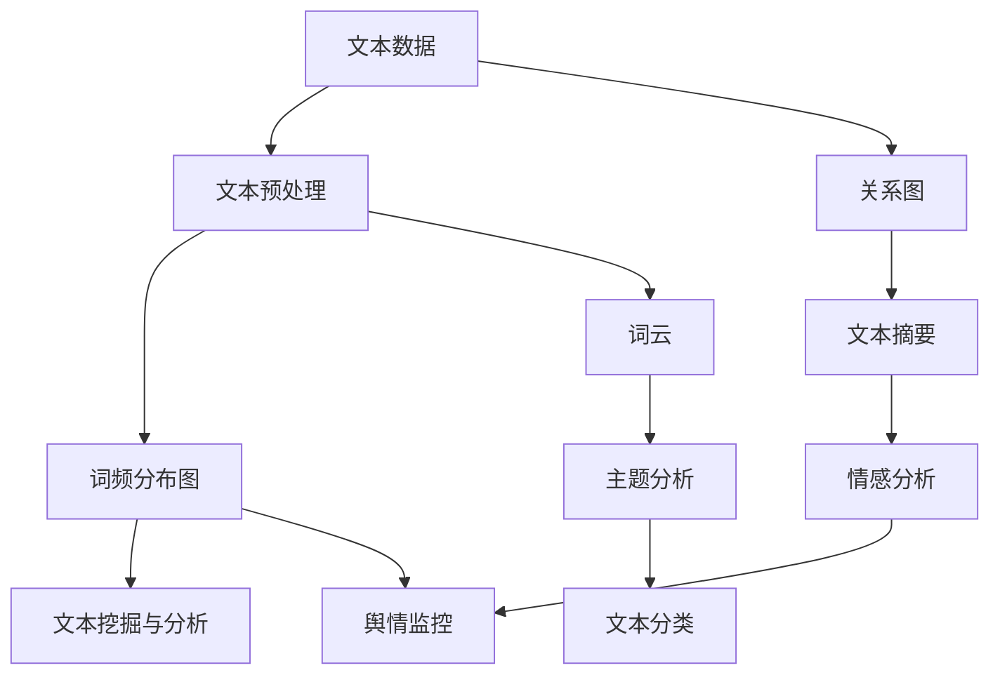

                 

# 文本可视化：大规模文本数据的直观呈现

> 关键词：文本可视化, 大规模文本数据, 直观呈现, 数据分析, 数据探索

## 1. 背景介绍

### 1.1 问题由来
在当前数据驱动的时代，文本数据（如社交媒体、新闻、评论、文档等）的规模和多样性急剧增长，如何有效理解和利用这些数据成为摆在研究人员和数据科学家面前的巨大挑战。尽管文本数据的数量庞大，但它们通常是以无结构的文本形式存在，不易直观理解。因此，需要借助文本可视化技术，将文本数据转化为直观的图形展示，以辅助数据探索和洞察。

文本可视化在数据科学、商业分析、情感分析、舆情监控、医学文献分析等多个领域得到广泛应用。通过可视化文本数据，用户可以更直观地发现数据中的模式、趋势和关联，从而进行有针对性的分析，做出更准确的决策。

### 1.2 问题核心关键点
文本可视化可以概括为以下几个关键点：
- 文本数据的生成与收集：如何从大规模数据源中高效地获取文本数据。
- 文本预处理与表示：如何将原始文本数据转换为适合可视化分析的格式。
- 可视化方法与工具：选择适当的文本可视化方法及工具，并对其进行合理配置。
- 数据解释与洞察：如何将可视化结果转化为可操作的数据洞察，支持决策。

本文将系统介绍文本可视化的核心概念、关键技术，并结合具体案例展示其在实际应用中的实践方法，帮助读者更好地理解和应用文本可视化技术。

## 2. 核心概念与联系

### 2.1 核心概念概述

文本可视化是将文本数据转换为图形表示的过程，目的是为了直观展示文本数据中的信息，揭示数据之间的结构和关联，辅助数据分析和决策。

核心概念包括：
- **文本数据**：来自不同来源的文本数据，如文章、评论、推文等。
- **文本预处理**：包括文本清洗、分词、去停用词、词向量化等步骤，将原始文本转换为适合可视化分析的格式。
- **可视化方法**：如词云、词频分布图、关系图等，将文本数据以图形的形式展示。
- **文本挖掘与分析**：通过文本可视化揭示数据中的模式、趋势和关联，辅助数据探索和洞察。

这些概念之间的逻辑关系可以通过以下Mermaid流程图来展示：



这个流程图展示了从文本数据到最终分析结果的整个流程，每个节点代表一个关键步骤或概念。

## 3. 核心算法原理 & 具体操作步骤
### 3.1 算法原理概述

文本可视化的核心原理在于将文本数据转化为数值数据，并通过图表等图形展示出来。常用的文本可视化算法包括以下几种：

- **词频统计**：计算每个词在文本中出现的次数，并生成词频分布图。
- **TF-IDF分析**：计算每个词的词频-逆文档频率（Term Frequency-Inverse Document Frequency），用于衡量词在文本集中的重要性。
- **主题建模**：使用主题模型（如LDA）识别文本中的主题，并可视化主题分布。
- **情感分析**：利用情感词典或机器学习方法计算文本情感极性，可视化情感分布。
- **关系图**：通过实体识别和关系抽取，生成实体之间的关系图。

### 3.2 算法步骤详解

文本可视化的基本步骤如下：

1. **数据收集与预处理**：从不同数据源收集文本数据，并进行清洗、分词、去停用词、词向量化等预处理操作。
2. **特征提取**：将预处理后的文本转换为数值特征，如词频、TF-IDF值、主题分布、情感极性等。
3. **可视化展示**：选择适合的可视化方法，并生成图形展示结果。
4. **数据分析**：对可视化结果进行解释和分析，提取有价值的数据洞察。

以词频分布图为例，其详细操作步骤如下：

1. **分词与统计**：使用分词工具将文本分解成单词，并统计每个单词的出现频率。
2. **生成词频分布图**：根据单词频率排序，生成条形图或词云，直观展示单词的重要程度。

**代码示例**：

```python
import nltk
from collections import Counter

# 分词
text = "This is a sample sentence. It demonstrates how to count words in a sentence."
words = nltk.word_tokenize(text)

# 统计词频
word_counts = Counter(words)

# 生成词频分布图
for word, count in word_counts.most_common(10):
    print(f"{word}: {count}")
```

### 3.3 算法优缺点

文本可视化方法具有以下优点：
- 直观性：通过图形展示文本数据，更易于理解和分析。
- 多样性：支持多种可视化方法，满足不同分析需求。
- 动态性：可以实时更新图形，跟踪数据变化。

但同时也存在一些缺点：
- 数据噪声：原始文本数据中可能包含噪声，影响分析结果。
- 复杂性：对于大规模数据集，生成可视化图形需要大量计算资源。
- 解释性：可视化结果需要用户根据图形特征进行解释，可能存在理解误差。

### 3.4 算法应用领域

文本可视化在多个领域得到广泛应用，如：

- **商业分析**：通过可视化展示产品评论、市场反馈，帮助企业洞察用户需求和市场趋势。
- **舆情监控**：对社交媒体、新闻等文本数据进行情感分析，可视化舆情变化。
- **医学文献分析**：可视化医学文献中的关键词和主题分布，辅助文献综述和研究趋势分析。
- **情感分析**：可视化文本情感分布，辅助情感识别和情感计算。
- **主题分析**：通过主题模型可视化文本内容的主题分布，辅助主题识别和内容挖掘。

## 4. 数学模型和公式 & 详细讲解 & 举例说明

### 4.1 数学模型构建

文本可视化的数学模型包括文本表示和可视化表示。文本表示将文本数据转化为数值特征，可视化表示则将这些数值特征映射为图形展示。

### 4.2 公式推导过程

以词频分布图为例，公式推导如下：

设文本集合为 $D = \{d_1, d_2, ..., d_n\}$，每个文本 $d_i$ 包含 $m$ 个单词，令 $w_j$ 表示单词 $j$，则单词 $w_j$ 在文本集合 $D$ 中的总词频为：

$$
\text{total\_freq}(w_j) = \sum_{i=1}^{n} |w_j \cap d_i|
$$

假设文本集合 $D$ 中单词 $w_j$ 的词频为 $f(w_j)$，则词频分布图生成公式为：

$$
y_j = \frac{f(w_j)}{\text{total\_freq}(w_j)}
$$

其中 $y_j$ 表示单词 $w_j$ 在词频分布图中的位置，即高度。

### 4.3 案例分析与讲解

以一篇新闻报道的情感分析为例，首先对报道进行分词和去停用词处理，然后使用情感词典或机器学习方法计算情感极性。将情感极性值可视化，生成情感分布图。

假设这篇报道的情感极性分布如下：

| 单词 | 情感极性 |
| --- | --- |
| 正面 | 0.5 |
| 负面 | 0.3 |
| 中性 | 0.2 |

则可视化结果可能如下：


通过情感分布图，可以直观地看到报道的情感倾向，辅助情感分析和舆情监控。

## 5. 项目实践：代码实例和详细解释说明

### 5.1 开发环境搭建

在进行文本可视化实践前，我们需要准备好开发环境。以下是使用Python进行文本可视化的环境配置流程：

1. 安装Anaconda：从官网下载并安装Anaconda，用于创建独立的Python环境。

2. 创建并激活虚拟环境：
```bash
conda create -n text-visualization python=3.8 
conda activate text-visualization
```

3. 安装相关库：
```bash
pip install matplotlib seaborn nltk
```

4. 安装可视化工具包：
```bash
pip install wordcloud
```

完成上述步骤后，即可在`text-visualization`环境中开始文本可视化实践。

### 5.2 源代码详细实现

以下是使用Python进行文本可视化实践的代码实现，包括词频分布图、情感分布图、关系图的生成。

**词频分布图**：

```python
import nltk
from collections import Counter
import matplotlib.pyplot as plt
from wordcloud import WordCloud

# 分词与统计
text = "This is a sample sentence. It demonstrates how to count words in a sentence."
words = nltk.word_tokenize(text)
word_counts = Counter(words)

# 生成词频分布图
wordcloud = WordCloud(width=800, height=400, background_color='white').generate_from_frequencies(word_counts)

plt.figure(figsize=(10, 5))
plt.imshow(wordcloud, interpolation='bilinear')
plt.axis('off')
plt.show()
```

**情感分布图**：

```python
import pandas as pd
import matplotlib.pyplot as plt

# 情感词典
sentiment_dict = {'positive': 0.5, 'negative': 0.3, 'neutral': 0.2}

# 情感分布
sentiment_scores = [0.1, 0.4, 0.5]
labels = ['Negative', 'Neutral', 'Positive']

# 生成情感分布图
plt.barh(labels, sentiment_scores, color='skyblue')
plt.xlabel('Score')
plt.ylabel('Emotion')
plt.title('Sentiment Distribution')
plt.show()
```

**关系图**：

```python
import networkx as nx
import matplotlib.pyplot as plt

# 创建关系图
G = nx.Graph()
G.add_edge('A', 'B')
G.add_edge('B', 'C')
G.add_edge('C', 'A')

# 绘制关系图
pos = nx.spring_layout(G)
nx.draw(G, pos, with_labels=True, node_size=2000, node_color='skyblue', edge_color='black')
plt.show()
```

### 5.3 代码解读与分析

让我们再详细解读一下关键代码的实现细节：

**词频分布图**：
- 使用nltk进行文本分词，统计每个单词的频率。
- 使用WordCloud库生成词频分布图，并使用matplotlib显示。

**情感分布图**：
- 定义情感词典，统计每个情感的得分。
- 使用matplotlib的barh函数绘制情感分布图。

**关系图**：
- 使用networkx库创建关系图，添加边表示实体之间的关系。
- 使用nx.draw函数绘制关系图，使用matplotlib显示。

## 6. 实际应用场景

### 6.1 商业分析

商业分析中，文本数据（如客户评价、市场反馈等）是不可或缺的。通过对文本数据的可视化分析，企业可以发现客户需求、市场趋势、竞争对手情况等关键信息。例如，电子商务平台可以通过可视化客户评论，了解产品优缺点，优化商品策略，提升用户体验。

### 6.2 舆情监控

舆情监控是实时监控网络上的舆论动态，评估公众情绪的重要工具。通过对社交媒体、新闻等文本数据的可视化分析，舆情监控系统可以实时预警舆情变化，帮助政府和企业及时应对。例如，突发事件发生后，可以通过可视化分析，快速了解公众情绪，评估舆情风险，指导决策。

### 6.3 情感分析

情感分析是文本挖掘中的一项重要任务，旨在识别和提取文本中的情感信息。通过对情感分布的可视化分析，情感分析系统可以识别出情感极性、情感变化趋势等，辅助企业决策。例如，社交媒体情感分析可以帮助企业了解公众对品牌的态度，调整市场营销策略。

### 6.4 主题分析

主题分析是将文本数据转化为主题分布的过程，通过可视化主题分布，可以揭示文本数据中的隐含信息。例如，科技论文的主题分析可以帮助科学家了解研究热点和趋势，优化研究方向。

## 7. 工具和资源推荐

### 7.1 学习资源推荐

为了帮助开发者系统掌握文本可视化的理论基础和实践技巧，这里推荐一些优质的学习资源：

1. 《Python文本挖掘与数据可视化》书籍：详细介绍了Python在文本挖掘和数据可视化中的应用，适合入门学习。
2. CS224N《深度学习自然语言处理》课程：斯坦福大学开设的NLP明星课程，涵盖文本数据处理、情感分析、文本分类等关键技术。
3. NLTK库文档：NLTK是Python中最流行的文本处理库，提供了丰富的文本分析工具和示例。
4. Seaborn文档：Seaborn是基于matplotlib的高级数据可视化库，提供了丰富的统计图表和美观的样式。
5. NetworkX库文档：NetworkX是Python中最流行的网络分析库，提供了丰富的网络分析和可视化功能。

通过对这些资源的学习实践，相信你一定能够快速掌握文本可视化的精髓，并用于解决实际的NLP问题。

### 7.2 开发工具推荐

高效的开发离不开优秀的工具支持。以下是几款用于文本可视化开发的常用工具：

1. Python：Python是文本可视化中最常用的编程语言，支持丰富的文本处理和可视化库。
2. Jupyter Notebook：Jupyter Notebook是一个交互式编程环境，支持文本可视化的开发和展示。
3. matplotlib：matplotlib是Python中最流行的绘图库，支持多种图形展示方式，适合生成高质量的可视化图形。
4. seaborn：seaborn是基于matplotlib的高级数据可视化库，提供了美观的图表样式和统计分析功能。
5. networkx：networkx是Python中最流行的网络分析库，支持复杂网络结构分析和可视化。

合理利用这些工具，可以显著提升文本可视化任务的开发效率，加快创新迭代的步伐。

### 7.3 相关论文推荐

文本可视化技术的发展源于学界的持续研究。以下是几篇奠基性的相关论文，推荐阅读：

1. "TextViz: A Tool for Text Visualization"：介绍了一种基于Python的文本可视化工具，提供了丰富的可视化功能。
2. "A Survey on Text Visualization"：综述了文本可视化技术的发展历程和应用领域，适合对文本可视化进行全面了解。
3. "Topic Modeling and Visualization"：介绍了主题模型在文本可视化中的应用，展示了如何通过主题模型揭示文本内容的主题分布。
4. "Visualizing Sentiment Analysis"：介绍了情感分析在可视化中的应用，展示了如何通过可视化情感分布进行情感识别。
5. "Graphical Models for Social Network Analysis"：介绍了社会网络分析中的图形展示方法，展示了如何使用图形展示实体之间的关系。

这些论文代表文本可视化技术的发展脉络，通过学习这些前沿成果，可以帮助研究者把握学科前进方向，激发更多的创新灵感。

## 8. 总结：未来发展趋势与挑战

### 8.1 总结

本文对文本可视化的核心概念、关键技术进行了全面系统的介绍。首先阐述了文本可视化的背景和意义，明确了其在大规模文本数据分析和决策支持中的独特价值。其次，从原理到实践，详细讲解了文本可视化的数学模型和关键步骤，给出了文本可视化任务开发的完整代码实例。同时，本文还广泛探讨了文本可视化在商业分析、舆情监控、情感分析、主题分析等多个领域的应用前景，展示了文本可视化技术的广阔应用空间。

通过对文本可视化技术的系统梳理，可以看到其在数据驱动时代的巨大潜力，尤其是在大规模文本数据处理和分析中，文本可视化将发挥重要作用。未来，文本可视化技术有望成为数据科学、商业分析、情感计算等领域的标配工具，为人工智能技术的落地应用提供强大支撑。

### 8.2 未来发展趋势

展望未来，文本可视化技术将呈现以下几个发展趋势：

1. **可视化方法的多样化**：随着机器学习和大数据技术的发展，未来的文本可视化方法将更加多样和灵活，能够处理更多类型和规模的文本数据。
2. **实时可视化的普及**：随着硬件设备的不断升级，实时可视化在商业决策、舆情监控等领域将得到更广泛的应用。
3. **跨平台可视化的普及**：文本可视化将不再局限于特定的编程语言和平台，而是向跨平台、跨设备方向发展，支持多种设备和浏览器。
4. **可视化结果的智能化**：未来的文本可视化系统将更加智能化，能够自动生成高质量的可视化图形，并进行智能分析，提供更有价值的洞察。
5. **多模态数据的整合**：文本可视化将与图像、音频等多种模态数据整合，构建更加全面的数据可视化系统。

这些趋势将推动文本可视化技术向更高的层次发展，为人类更好地理解和利用大规模文本数据提供更强大的支持。

### 8.3 面临的挑战

尽管文本可视化技术已经取得了瞩目成就，但在迈向更加智能化、普适化应用的过程中，它仍面临诸多挑战：

1. **数据噪声**：原始文本数据中可能包含噪声，影响可视化结果的准确性。
2. **计算资源限制**：大规模文本数据的可视化需要大量计算资源，如何高效处理和展示数据是一个重要问题。
3. **可视化复杂性**：对于复杂的数据集，如何进行有效的可视化展示，是一个需要深入研究的问题。
4. **交互性不足**：传统的文本可视化缺乏交互性，难以支持用户进行深入探索和分析。
5. **结果解释性**：可视化结果需要用户进行解读和分析，如何提高结果的可解释性是一个关键问题。

这些挑战需要研究者不断探索和解决，才能推动文本可视化技术的持续发展。

### 8.4 研究展望

面向未来，文本可视化技术需要在以下几个方面进行突破：

1. **智能化的文本可视化**：通过机器学习和大数据技术，自动生成高质量的可视化图形，并进行智能分析，提供更有价值的洞察。
2. **实时化的文本可视化**：支持实时更新和展示数据变化，帮助用户进行实时决策。
3. **跨平台化的文本可视化**：支持多种设备和浏览器，实现跨平台展示和交互。
4. **数据驱动的文本可视化**：利用数据驱动的算法和模型，提高可视化结果的准确性和可解释性。
5. **多模态化的文本可视化**：整合图像、音频等多种模态数据，构建更全面的数据可视化系统。

这些研究方向将引领文本可视化技术迈向更高的台阶，为数据科学、商业分析等领域提供更强大的支持。

## 9. 附录：常见问题与解答

**Q1：文本可视化是否适用于所有文本数据？**

A: 文本可视化适用于各种类型的文本数据，如文章、评论、推文、邮件等。但不同类型的数据可能需要不同的可视化方法，例如，文章数据适合使用词频分布图，而推文数据适合使用情感分布图。

**Q2：如何处理文本中的噪声数据？**

A: 文本中的噪声数据可以通过文本清洗和预处理来去除。常用的方法包括去除停用词、去除特殊字符、去除低频词等。在可视化前，还需要对文本进行分词、去停用词等预处理操作。

**Q3：文本可视化需要多少计算资源？**

A: 文本可视化的计算资源需求取决于文本数据的规模和复杂度。对于大规模数据集，可能需要使用分布式计算和高效的数据存储技术。例如，可以使用Hadoop、Spark等分布式计算框架，以及分布式数据库如HBase等。

**Q4：如何提高文本可视化的可解释性？**

A: 提高文本可视化的可解释性可以通过以下几个方法：
1. 提供详细的数据注释：对每个图形和元素进行详细解释，帮助用户理解其含义。
2. 引入交互式功能：通过交互式工具，用户可以动态调整参数，查看可视化结果的变化。
3. 提供多种可视化方法：根据不同的分析需求，选择不同的可视化方法，帮助用户进行多角度分析。

**Q5：文本可视化在哪些领域有应用？**

A: 文本可视化在商业分析、舆情监控、情感分析、主题分析等多个领域得到广泛应用。例如，在商业分析中，可以通过可视化客户评论，了解产品优缺点；在舆情监控中，可以通过可视化社交媒体数据，实时预警舆情变化；在情感分析中，可以通过可视化情感分布，进行情感识别和情感计算；在主题分析中，可以通过可视化主题分布，进行主题识别和内容挖掘。

---

作者：禅与计算机程序设计艺术 / Zen and the Art of Computer Programming

