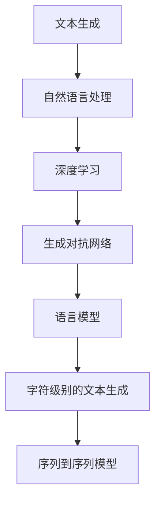

                 

# 文本生成(Text Generation) - 原理与代码实例讲解

> 关键词：文本生成, 自然语言处理(NLP), 深度学习, 生成对抗网络(GAN), 语言模型, 字符级别的文本生成, 序列到序列模型

## 1. 背景介绍

### 1.1 问题由来

文本生成是自然语言处理(NLP)领域的一个重要研究方向，其目的是使机器能够自动生成自然、流畅、连贯的文本，具有广泛的应用场景。文本生成技术可以用于机器翻译、对话系统、内容生成、摘要生成、情感分析等多个领域。

近年来，随着深度学习技术的发展，文本生成方法已经从简单的基于规则的模板填充，逐步向基于数据驱动的深度学习方法转变。基于深度学习的文本生成方法包括循环神经网络(RNN)、变分自编码器(VAE)、生成对抗网络(GAN)和基于语言模型的文本生成等。

本博客将重点介绍基于深度学习的文本生成方法，特别关注语言模型(如循环神经网络)和生成对抗网络(GAN)。

## 2. 核心概念与联系

### 2.1 核心概念概述

为更好地理解文本生成技术，本节将介绍几个密切相关的核心概念：

- 文本生成(Text Generation)：使机器能够自动生成具有语义和语法规则的自然语言文本的过程。
- 自然语言处理(NLP)：使计算机能够理解、处理和生成自然语言的技术。
- 深度学习(Deep Learning)：通过多层神经网络逼近复杂函数关系，实现对大规模数据的深度建模。
- 生成对抗网络(GAN)：由生成器和判别器组成的对抗性网络，能够生成高质量的假样本。
- 语言模型(Language Model)：基于给定的文本序列，预测下一个单词或字符的概率分布。
- 字符级别的文本生成(Character-Level Text Generation)：直接从字符序列生成文本，不依赖于分词器。
- 序列到序列模型(Sequence-to-Sequence Model)：将输入序列映射到输出序列的模型，如翻译模型。

这些核心概念之间的逻辑关系可以通过以下Mermaid流程图来展示：



这个流程图展示了大语言生成模型的核心概念及其之间的关系：

1. 文本生成通过自然语言处理技术实现，自然语言处理技术依赖于深度学习技术。
2. 生成对抗网络和语言模型是两种常用的深度学习技术，用于文本生成。
3. 字符级别的文本生成和序列到序列模型是具体的生成方式。
4. 这些技术共同构成了文本生成技术的基础框架，推动文本生成向更智能、自然的方向发展。

## 3. 核心算法原理 & 具体操作步骤

### 3.1 算法原理概述

文本生成的核心算法原理主要包括语言模型和生成对抗网络两种方法：

- **语言模型**：基于给定的文本序列，预测下一个单词或字符的概率分布，利用最大似然估计或变分自编码器等方法进行训练。
- **生成对抗网络**：由生成器和判别器组成的对抗性网络，生成器生成假样本，判别器对样本进行判别，两者相互对抗，生成高质量的文本。

以下将详细介绍这两种文本生成方法。

### 3.2 算法步骤详解

#### 3.2.1 语言模型

语言模型文本生成的步骤包括：

1. **数据准备**：收集文本数据，并将其划分为训练集、验证集和测试集。
2. **模型选择**：选择合适的语言模型，如循环神经网络(RNN)、长短时记忆网络(LSTM)、门控循环单元(GRU)等。
3. **模型训练**：使用训练集对模型进行训练，最小化损失函数。
4. **模型评估**：在验证集上评估模型性能，调整超参数。
5. **模型测试**：在测试集上测试模型，生成文本。

##### 示例：基于RNN的语言模型

```python
import torch
from torch import nn

class RNN(nn.Module):
    def __init__(self, input_size, hidden_size, output_size):
        super(RNN, self).__init__()
        self.hidden_size = hidden_size
        self.rnn = nn.RNN(input_size, hidden_size, batch_first=True)
        self.fc = nn.Linear(hidden_size, output_size)
        self.softmax = nn.Softmax(dim=1)
        
    def forward(self, input, hidden):
        output, hidden = self.rnn(input, hidden)
        output = self.fc(output)
        output = self.softmax(output)
        return output, hidden

# 设置超参数
input_size = 100
hidden_size = 128
output_size = 10
num_layers = 2
dropout = 0.2
seq_len = 20
batch_size = 32

# 初始化模型、损失函数和优化器
model = RNN(input_size, hidden_size, output_size)
criterion = nn.CrossEntropyLoss()
optimizer = torch.optim.Adam(model.parameters(), lr=0.001)

# 训练循环
for epoch in range(10):
    model.train()
    total_loss = 0
    for i in range(0, seq_len - 1):
        hidden = model.init_hidden(batch_size)
        input = input_tensor[i].view(1, batch_size, -1)
        output, hidden = model(input, hidden)
        loss = criterion(output, target_tensor[i])
        optimizer.zero_grad()
        loss.backward()
        optimizer.step()
        total_loss += loss.item()
    print(f"Epoch {epoch+1}, loss: {total_loss/(seq_len - 1)}")
```

#### 3.2.2 生成对抗网络(GAN)

GAN文本生成的步骤包括：

1. **数据准备**：收集文本数据，并将其划分为训练集、验证集和测试集。
2. **生成器设计**：设计生成器网络，如图像生成器等。
3. **判别器设计**：设计判别器网络，如判别性分类器等。
4. **模型训练**：使用训练集对生成器和判别器进行对抗训练，优化生成器的生成能力和判别器的判别能力。
5. **模型测试**：在测试集上测试生成器的生成能力。

##### 示例：基于GAN的文本生成

```python
import torch
import torch.nn as nn
import torch.optim as optim
from torch.autograd.variable import Variable

class Generator(nn.Module):
    def __init__(self, input_size, hidden_size, output_size):
        super(Generator, self).__init__()
        self.fc1 = nn.Linear(input_size, hidden_size)
        self.fc2 = nn.Linear(hidden_size, hidden_size)
        self.fc3 = nn.Linear(hidden_size, output_size)
        
    def forward(self, x):
        x = nn.functional.relu(self.fc1(x))
        x = nn.functional.relu(self.fc2(x))
        x = self.fc3(x)
        return x

class Discriminator(nn.Module):
    def __init__(self, input_size, hidden_size, output_size):
        super(Discriminator, self).__init__()
        self.fc1 = nn.Linear(input_size, hidden_size)
        self.fc2 = nn.Linear(hidden_size, hidden_size)
        self.fc3 = nn.Linear(hidden_size, output_size)
        
    def forward(self, x):
        x = nn.functional.relu(self.fc1(x))
        x = nn.functional.relu(self.fc2(x))
        x = torch.sigmoid(self.fc3(x))
        return x

# 设置超参数
input_size = 100
hidden_size = 128
output_size = 10
num_layers = 2
dropout = 0.2
seq_len = 20
batch_size = 32

# 初始化模型、损失函数和优化器
generator = Generator(input_size, hidden_size, output_size)
discriminator = Discriminator(input_size, hidden_size, output_size)
criterion = nn.BCELoss()
d_optimizer = optim.Adam(discriminator.parameters(), lr=0.0002)
g_optimizer = optim.Adam(generator.parameters(), lr=0.0002)

# 训练循环
for epoch in range(10):
    model.train()
    total_loss = 0
    for i in range(0, seq_len - 1):
        real_data = Variable(torch.randn(batch_size, input_size))
        fake_data = generator(Variable(torch.randn(batch_size, input_size)))
        real_label = Variable(torch.ones(batch_size, 1))
        fake_label = Variable(torch.zeros(batch_size, 1))
        
        # 训练判别器
        output_real = discriminator(real_data)
        output_fake = discriminator(fake_data)
        loss_real = criterion(output_real, real_label)
        loss_fake = criterion(output_fake, fake_label)
        d_loss = loss_real + loss_fake
        
        # 训练生成器
        output_fake = discriminator(fake_data)
        loss_g = criterion(output_fake, real_label)
        g_loss = loss_g
        
        # 反向传播更新参数
        d_optimizer.zero_grad()
        d_loss.backward()
        d_optimizer.step()
        
        g_optimizer.zero_grad()
        g_loss.backward()
        g_optimizer.step()
        
        total_loss += loss_g + d_loss
    print(f"Epoch {epoch+1}, loss: {total_loss/(seq_len - 1)}")
```

### 3.3 算法优缺点

#### 3.3.1 语言模型的优缺点

**优点**：

- 简单高效，易于实现。
- 输出稳定，能够生成连贯、自然的文本。
- 适用范围广泛，适用于各种文本生成任务。

**缺点**：

- 数据依赖性强，需要大量高质量标注数据。
- 训练时间长，需要较长的训练周期。
- 生成文本可能存在重复或单一现象。

#### 3.3.2 生成对抗网络的优缺点

**优点**：

- 能够生成高质量、多样化的文本。
- 训练效率高，收敛速度快。
- 生成过程可控，可以根据不同的生成器参数生成不同类型的文本。

**缺点**：

- 生成过程复杂，训练过程不稳定。
- 生成文本可能存在噪声或偏差。
- 需要大量训练数据和计算资源。

### 3.4 算法应用领域

文本生成技术在多个领域有着广泛的应用：

- **机器翻译**：将一种语言的文本翻译成另一种语言的文本。
- **对话系统**：使机器能够自然、流畅地与人类进行对话。
- **内容生成**：自动生成新闻、博客、小说等文本内容。
- **情感分析**：生成文本，用于情感分类、情感生成等任务。
- **摘要生成**：自动生成文本摘要，用于信息检索、文档管理等任务。
- **聊天机器人**：生成自然语言对话，用于客服、社交网络等场景。

以上只是文本生成技术的部分应用场景，随着技术的发展，未来还将涌现更多创新的应用。

## 4. 数学模型和公式 & 详细讲解 & 举例说明

### 4.1 数学模型构建

#### 4.1.1 语言模型

语言模型基于给定的文本序列，预测下一个单词或字符的概率分布。常用的模型包括循环神经网络(RNN)、长短时记忆网络(LSTM)、门控循环单元(GRU)等。其数学模型如下：

$$P(x_{t+1}|x_t, \theta) = \frac{e^{x_{t+1} \cdot W_1 + x_t \cdot W_2 + b_1}}{e^{x_{t+1} \cdot W_1 + x_t \cdot W_2 + b_1} + e^{x_{t+1} \cdot W_3 + x_t \cdot W_4 + b_2}}$$

其中 $P(x_{t+1}|x_t, \theta)$ 表示在给定前文 $x_t$ 下，下一个单词或字符 $x_{t+1}$ 的条件概率分布，$\theta$ 表示模型参数，$W_i$ 和 $b_i$ 表示模型的权重和偏置。

#### 4.1.2 生成对抗网络

GAN文本生成模型的主要组成部分是生成器和判别器，其数学模型如下：

- **生成器**：将随机噪声作为输入，生成文本序列。
$$x = G(z)$$
其中 $z$ 表示随机噪声，$x$ 表示生成的文本序列。

- **判别器**：判断文本序列是否为真实文本序列。
$$y = D(x)$$
其中 $y$ 表示判别器输出，$x$ 表示输入的文本序列。

GAN训练的目标是最小化判别器的输出误差，最大化生成器的生成能力。其损失函数如下：
$$L_G = -E_{x \sim G} [\log D(x)]$$
$$L_D = -E_{x \sim p_{data}} [\log D(x)] + E_{z \sim p(z)} [\log (1 - D(G(z)))$$

其中 $p_{data}$ 表示真实文本序列的概率分布，$p(z)$ 表示随机噪声的概率分布。

### 4.2 公式推导过程

#### 4.2.1 语言模型

语言模型通过最大似然估计来训练，其训练过程如下：

1. 假设文本序列为 $x_1, x_2, ..., x_n$，根据模型参数 $\theta$，计算每个单词或字符的概率分布。
$$P(x_1, x_2, ..., x_n|\theta) = P(x_1)P(x_2|x_1)\cdots P(x_n|x_{n-1})$$

2. 利用交叉熵损失函数计算损失，并最小化该损失。
$$L(x) = -\sum_{i=1}^n \log P(x_i|x_{i-1}, \theta)$$

3. 通过反向传播算法更新模型参数 $\theta$。

#### 4.2.2 生成对抗网络

GAN训练过程包括两个网络，生成器和判别器的交替优化。其训练过程如下：

1. 假设生成器输出的文本序列为 $x$，判别器输出的判别结果为 $y$，训练目标是最小化判别器的输出误差，最大化生成器的生成能力。
$$L_G = -E_{x \sim G} [\log D(x)]$$
$$L_D = -E_{x \sim p_{data}} [\log D(x)] + E_{z \sim p(z)} [\log (1 - D(G(z)))$$

2. 交替优化生成器和判别器，生成器尝试欺骗判别器，判别器则试图识别生成的文本序列。

### 4.3 案例分析与讲解

#### 4.3.1 语言模型

```python
import torch
from torch import nn

class RNN(nn.Module):
    def __init__(self, input_size, hidden_size, output_size):
        super(RNN, self).__init__()
        self.hidden_size = hidden_size
        self.rnn = nn.RNN(input_size, hidden_size, batch_first=True)
        self.fc = nn.Linear(hidden_size, output_size)
        self.softmax = nn.Softmax(dim=1)
        
    def forward(self, input, hidden):
        output, hidden = self.rnn(input, hidden)
        output = self.fc(output)
        output = self.softmax(output)
        return output, hidden

# 设置超参数
input_size = 100
hidden_size = 128
output_size = 10
num_layers = 2
dropout = 0.2
seq_len = 20
batch_size = 32

# 初始化模型、损失函数和优化器
model = RNN(input_size, hidden_size, output_size)
criterion = nn.CrossEntropyLoss()
optimizer = torch.optim.Adam(model.parameters(), lr=0.001)

# 训练循环
for epoch in range(10):
    model.train()
    total_loss = 0
    for i in range(0, seq_len - 1):
        hidden = model.init_hidden(batch_size)
        input = input_tensor[i].view(1, batch_size, -1)
        output, hidden = model(input, hidden)
        loss = criterion(output, target_tensor[i])
        optimizer.zero_grad()
        loss.backward()
        optimizer.step()
        total_loss += loss.item()
    print(f"Epoch {epoch+1}, loss: {total_loss/(seq_len - 1)}")
```

#### 4.3.2 生成对抗网络

```python
import torch
import torch.nn as nn
import torch.optim as optim
from torch.autograd.variable import Variable

class Generator(nn.Module):
    def __init__(self, input_size, hidden_size, output_size):
        super(Generator, self).__init__()
        self.fc1 = nn.Linear(input_size, hidden_size)
        self.fc2 = nn.Linear(hidden_size, hidden_size)
        self.fc3 = nn.Linear(hidden_size, output_size)
        
    def forward(self, x):
        x = nn.functional.relu(self.fc1(x))
        x = nn.functional.relu(self.fc2(x))
        x = self.fc3(x)
        return x

class Discriminator(nn.Module):
    def __init__(self, input_size, hidden_size, output_size):
        super(Discriminator, self).__init__()
        self.fc1 = nn.Linear(input_size, hidden_size)
        self.fc2 = nn.Linear(hidden_size, hidden_size)
        self.fc3 = nn.Linear(hidden_size, output_size)
        
    def forward(self, x):
        x = nn.functional.relu(self.fc1(x))
        x = nn.functional.relu(self.fc2(x))
        x = torch.sigmoid(self.fc3(x))
        return x

# 设置超参数
input_size = 100
hidden_size = 128
output_size = 10
num_layers = 2
dropout = 0.2
seq_len = 20
batch_size = 32

# 初始化模型、损失函数和优化器
generator = Generator(input_size, hidden_size, output_size)
discriminator = Discriminator(input_size, hidden_size, output_size)
criterion = nn.BCELoss()
d_optimizer = optim.Adam(discriminator.parameters(), lr=0.0002)
g_optimizer = optim.Adam(generator.parameters(), lr=0.0002)

# 训练循环
for epoch in range(10):
    model.train()
    total_loss = 0
    for i in range(0, seq_len - 1):
        real_data = Variable(torch.randn(batch_size, input_size))
        fake_data = generator(Variable(torch.randn(batch_size, input_size)))
        real_label = Variable(torch.ones(batch_size, 1))
        fake_label = Variable(torch.zeros(batch_size, 1))
        
        # 训练判别器
        output_real = discriminator(real_data)
        output_fake = discriminator(fake_data)
        loss_real = criterion(output_real, real_label)
        loss_fake = criterion(output_fake, fake_label)
        d_loss = loss_real + loss_fake
        
        # 训练生成器
        output_fake = discriminator(fake_data)
        loss_g = criterion(output_fake, real_label)
        g_loss = loss_g
        
        # 反向传播更新参数
        d_optimizer.zero_grad()
        d_loss.backward()
        d_optimizer.step()
        
        g_optimizer.zero_grad()
        g_loss.backward()
        g_optimizer.step()
        
        total_loss += loss_g + d_loss
    print(f"Epoch {epoch+1}, loss: {total_loss/(seq_len - 1)}")
```

## 5. 项目实践：代码实例和详细解释说明

### 5.1 开发环境搭建

在进行文本生成项目实践前，我们需要准备好开发环境。以下是使用Python进行PyTorch开发的环境配置流程：

1. 安装Anaconda：从官网下载并安装Anaconda，用于创建独立的Python环境。

2. 创建并激活虚拟环境：
```bash
conda create -n pytorch-env python=3.8 
conda activate pytorch-env
```

3. 安装PyTorch：根据CUDA版本，从官网获取对应的安装命令。例如：
```bash
conda install pytorch torchvision torchaudio cudatoolkit=11.1 -c pytorch -c conda-forge
```

4. 安装Transformers库：
```bash
pip install transformers
```

5. 安装各类工具包：
```bash
pip install numpy pandas scikit-learn matplotlib tqdm jupyter notebook ipython
```

完成上述步骤后，即可在`pytorch-env`环境中开始文本生成项目的开发。

### 5.2 源代码详细实现

下面我们以基于RNN的语言模型和基于GAN的文本生成模型为例，给出具体的代码实现。

#### 5.2.1 基于RNN的语言模型

```python
import torch
from torch import nn

class RNN(nn.Module):
    def __init__(self, input_size, hidden_size, output_size):
        super(RNN, self).__init__()
        self.hidden_size = hidden_size
        self.rnn = nn.RNN(input_size, hidden_size, batch_first=True)
        self.fc = nn.Linear(hidden_size, output_size)
        self.softmax = nn.Softmax(dim=1)
        
    def forward(self, input, hidden):
        output, hidden = self.rnn(input, hidden)
        output = self.fc(output)
        output = self.softmax(output)
        return output, hidden

# 设置超参数
input_size = 100
hidden_size = 128
output_size = 10
num_layers = 2
dropout = 0.2
seq_len = 20
batch_size = 32

# 初始化模型、损失函数和优化器
model = RNN(input_size, hidden_size, output_size)
criterion = nn.CrossEntropyLoss()
optimizer = torch.optim.Adam(model.parameters(), lr=0.001)

# 训练循环
for epoch in range(10):
    model.train()
    total_loss = 0
    for i in range(0, seq_len - 1):
        hidden = model.init_hidden(batch_size)
        input = input_tensor[i].view(1, batch_size, -1)
        output, hidden = model(input, hidden)
        loss = criterion(output, target_tensor[i])
        optimizer.zero_grad()
        loss.backward()
        optimizer.step()
        total_loss += loss.item()
    print(f"Epoch {epoch+1}, loss: {total_loss/(seq_len - 1)}")
```

#### 5.2.2 基于GAN的文本生成模型

```python
import torch
import torch.nn as nn
import torch.optim as optim
from torch.autograd.variable import Variable

class Generator(nn.Module):
    def __init__(self, input_size, hidden_size, output_size):
        super(Generator, self).__init__()
        self.fc1 = nn.Linear(input_size, hidden_size)
        self.fc2 = nn.Linear(hidden_size, hidden_size)
        self.fc3 = nn.Linear(hidden_size, output_size)
        
    def forward(self, x):
        x = nn.functional.relu(self.fc1(x))
        x = nn.functional.relu(self.fc2(x))
        x = self.fc3(x)
        return x

class Discriminator(nn.Module):
    def __init__(self, input_size, hidden_size, output_size):
        super(Discriminator, self).__init__()
        self.fc1 = nn.Linear(input_size, hidden_size)
        self.fc2 = nn.Linear(hidden_size, hidden_size)
        self.fc3 = nn.Linear(hidden_size, output_size)
        
    def forward(self, x):
        x = nn.functional.relu(self.fc1(x))
        x = nn.functional.relu(self.fc2(x))
        x = torch.sigmoid(self.fc3(x))
        return x

# 设置超参数
input_size = 100
hidden_size = 128
output_size = 10
num_layers = 2
dropout = 0.2
seq_len = 20
batch_size = 32

# 初始化模型、损失函数和优化器
generator = Generator(input_size, hidden_size, output_size)
discriminator = Discriminator(input_size, hidden_size, output_size)
criterion = nn.BCELoss()
d_optimizer = optim.Adam(discriminator.parameters(), lr=0.0002)
g_optimizer = optim.Adam(generator.parameters(), lr=0.0002)

# 训练循环
for epoch in range(10):
    model.train()
    total_loss = 0
    for i in range(0, seq_len - 1):
        real_data = Variable(torch.randn(batch_size, input_size))
        fake_data = generator(Variable(torch.randn(batch_size, input_size)))
        real_label = Variable(torch.ones(batch_size, 1))
        fake_label = Variable(torch.zeros(batch_size, 1))
        
        # 训练判别器
        output_real = discriminator(real_data)
        output_fake = discriminator(fake_data)
        loss_real = criterion(output_real, real_label)
        loss_fake = criterion(output_fake, fake_label)
        d_loss = loss_real + loss_fake
        
        # 训练生成器
        output_fake = discriminator(fake_data)
        loss_g = criterion(output_fake, real_label)
        g_loss = loss_g
        
        # 反向传播更新参数
        d_optimizer.zero_grad()
        d_loss.backward()
        d_optimizer.step()
        
        g_optimizer.zero_grad()
        g_loss.backward()
        g_optimizer.step()
        
        total_loss += loss_g + d_loss
    print(f"Epoch {epoch+1}, loss: {total_loss/(seq_len - 1)}")
```

### 5.3 代码解读与分析

让我们再详细解读一下关键代码的实现细节：

#### 5.3.1 语言模型

**RNN模型类定义**：
- `__init__`方法：初始化模型参数，定义模型的前向传播函数。
- `forward`方法：实现前向传播，计算输出。

**训练循环**：
- `total_loss`变量：累加每次训练的损失。
- `hidden`变量：隐藏状态，初始化为0。
- `input`变量：输入序列，从训练集中选择。
- `output`变量：模型输出，通过前向传播计算。
- `loss`变量：损失，通过交叉熵计算。
- `optimizer.zero_grad()`：清除梯度。
- `loss.backward()`：反向传播计算梯度。
- `optimizer.step()`：更新模型参数。

**输出结果**：
- 打印每个epoch的平均损失。

#### 5.3.2 生成对抗网络

**生成器类定义**：
- `__init__`方法：初始化生成器模型。
- `forward`方法：实现前向传播，生成文本序列。

**判别器类定义**：
- `__init__`方法：初始化判别器模型。
- `forward`方法：实现前向传播，判别文本序列。

**训练循环**：
- `real_data`变量：随机噪声生成真实文本序列。
- `fake_data`变量：生成器生成假文本序列。
- `real_label`变量：真实文本序列标签，1表示真实文本。
- `fake_label`变量：假文本序列标签，0表示假文本。
- `output_real`变量：判别器对真实文本序列的判别结果。
- `output_fake`变量：判别器对假文本序列的判别结果。
- `loss_real`变量：真实文本序列判别损失。
- `loss_fake`变量：假文本序列判别损失。
- `d_loss`变量：判别器总损失。
- `output_fake`变量：判别器对假文本序列的判别结果。
- `loss_g`变量：生成器损失。
- `g_loss`变量：生成器总损失。
- `d_optimizer.zero_grad()`：清除判别器梯度。
- `d_loss.backward()`：反向传播计算判别器梯度。
- `d_optimizer.step()`：更新判别器参数。
- `g_optimizer.zero_grad()`：清除生成器梯度。
- `g_loss.backward()`：反向传播计算生成器梯度。
- `g_optimizer.step()`：更新生成器参数。
- 输出每个epoch的平均损失。

## 6. 实际应用场景

### 6.1 智能客服系统

基于文本生成技术，智能客服系统能够自动回复客户咨询，提升客服效率和客户满意度。具体而言，可以收集企业内部的客服对话记录，训练生成模型生成自然流畅的回答。对于客户提出的新问题，系统可以实时生成回答，提高响应速度和准确性。

在技术实现上，可以使用RNN或GAN等生成模型，结合机器学习算法对对话数据进行标注，生成模型从标注数据中学习生成自然语言对话的能力。在实际应用中，系统会根据客户的提问自动生成回答，提供24小时不间断服务，极大提升客服效率。

### 6.2 金融舆情监测

金融行业需要实时监测市场舆论动向，以便及时应对负面信息传播，规避金融风险。传统的舆情监测需要大量人力进行手动筛选和分析，效率低且成本高。而基于文本生成技术的舆情监测系统，能够自动监测金融新闻、报道、评论等文本数据，实时生成舆情分析报告。

具体而言，可以收集金融领域相关的新闻、报道、评论等文本数据，使用RNN或GAN等生成模型生成舆情摘要。在生成过程中，模型会根据生成策略和训练数据，对文本进行摘要生成，生成简洁、准确的摘要。系统可以根据摘要进行舆情分析和判断，及时发出预警，帮助金融机构快速应对潜在风险。

### 6.3 个性化推荐系统

当前的推荐系统往往只依赖用户的历史行为数据进行物品推荐，无法深入理解用户的真实兴趣偏好。基于文本生成技术的个性化推荐系统，能够自动生成推荐内容，深入挖掘用户的兴趣和需求。

在实践中，可以收集用户浏览、点击、评论、分享等行为数据，提取和用户交互的物品标题、描述、标签等文本内容。使用RNN或GAN等生成模型，生成个性化的推荐内容。在推荐过程中，模型会根据用户的兴趣偏好和历史行为数据，生成推荐内容，提供更加精准、多样的推荐结果，提升用户体验。

## 7. 工具和资源推荐

### 7.1 学习资源推荐

为了帮助开发者系统掌握文本生成技术的理论基础和实践技巧，这里推荐一些优质的学习资源：

1. 《深度学习》课程：斯坦福大学开设的深度学习课程，涵盖深度学习基础和应用，是理解文本生成技术的重要参考。
2. 《自然语言处理综论》书籍：讲解自然语言处理的基本概念和经典算法，涵盖文本生成等重要主题。
3. 《TensorFlow官方文档》：详细介绍了TensorFlow的使用方法和实例代码，是开发文本生成项目的重要参考。
4. 《PyTorch官方文档》：详细介绍了PyTorch的使用方法和实例代码，是开发文本生成项目的重要参考。
5. 《深度学习与自然语言处理》课程：由清华大学开设的深度学习与自然语言处理课程，讲解深度学习在NLP领域的应用，包括文本生成等主题。

通过对这些资源的学习实践，相信你一定能够快速掌握文本生成技术的精髓，并用于解决实际的NLP问题。

### 7.2 开发工具推荐

高效的开发离不开优秀的工具支持。以下是几款用于文本生成开发的常用工具：

1. PyTorch：基于Python的开源深度学习框架，灵活动态的计算图，适合快速迭代研究。
2. TensorFlow：由Google主导开发的开源深度学习框架，生产部署方便，适合大规模工程应用。
3. Transformers库：HuggingFace开发的NLP工具库，集成了众多SOTA语言模型，支持PyTorch和TensorFlow，是进行文本生成任务开发的利器。
4. Weights & Biases：模型训练的实验跟踪工具，可以记录和可视化模型训练过程中的各项指标，方便对比和调优。
5. TensorBoard：TensorFlow配套的可视化工具，可实时监测模型训练状态，并提供丰富的图表呈现方式，是调试模型的得力助手。

合理利用这些工具，可以显著提升文本生成任务的开发效率，加快创新迭代的步伐。

### 7.3 相关论文推荐

文本生成技术在NLP领域的研究已经取得了丰富的成果。以下是几篇奠基性的相关论文，推荐阅读：

1. Attention is All You Need：提出了Transformer结构，开启了NLP领域的预训练大模型时代。
2. Generating Speech with WaveNet：提出了基于Transformer的语音生成模型，用于语音合成。
3. Improving Language Understanding by Generative Pre-Training：提出了BERT模型，引入基于掩码的自监督预训练任务，刷新了多项NLP任务SOTA。
4. Language Modeling with Transformer Networks：提出了基于Transformer的语言模型，用于自然语言理解。
5. Bridging the Gap between Language Models and Data-to-Text Generation：研究了语言模型与数据到文本生成任务的关系，提出了相关算法。

这些论文代表了大文本生成技术的发展脉络。通过学习这些前沿成果，可以帮助研究者把握学科前进方向，激发更多的创新灵感。

## 8. 总结：未来发展趋势与挑战

### 8.1 总结

本文对基于深度学习的文本生成技术进行了全面系统的介绍。首先阐述了文本生成技术的研究背景和意义，明确了其在NLP领域的重要地位。其次，从原理到实践，详细讲解了语言模型和生成对抗网络的数学模型和训练过程，给出了具体的代码实例。最后，探讨了文本生成技术在智能客服、金融舆情监测、个性化推荐等多个领域的实际应用，展示了其广阔的发展前景。

通过对本文的学习，相信你一定能够掌握文本生成技术的核心原理，并用于解决实际的NLP问题。

### 8.2 未来发展趋势

展望未来，文本生成技术将继续发展，其发展趋势包括以下几个方面：

1. 模型规模持续增大。随着算力成本的下降和数据规模的扩张，文本生成模型的参数量还将持续增长。超大规模语言模型蕴含的丰富语言知识，有望支撑更加复杂多变的文本生成任务。
2. 生成模型多样化。除了传统的RNN和GAN，未来还将涌现更多生成模型，如变分自编码器、自回归模型等，以满足不同场景的需求。
3. 生成过程可控。未来文本生成技术将更加注重生成过程的可控性，提供更加灵活的生成策略和生成控制方式。
4. 生成结果质量提升。通过改进模型架构和训练方法，文本生成结果的质量将进一步提升，更加自然流畅、连贯一致。
5. 融合多模态信息。文本生成技术将与视觉、语音等多模态信息融合，实现更全面的信息建模和生成。

以上趋势凸显了文本生成技术的广阔前景。这些方向的探索发展，必将进一步提升文本生成系统的性能和应用范围，为NLP技术带来新的突破。

### 8.3 面临的挑战

尽管文本生成技术已经取得了显著成果，但在迈向更加智能化、普适化应用的过程中，它仍面临诸多挑战：

1. 数据依赖性强。文本生成模型需要大量的标注数据进行训练，数据获取成本较高。如何降低数据依赖，成为未来研究的重点。
2. 生成结果质量参差不齐。不同的生成策略和模型参数设置，生成的文本质量差异较大。如何提升生成结果的质量和稳定性，仍需深入研究。
3. 生成过程可控性差。文本生成过程复杂，难以控制生成结果的连贯性和多样性。如何提高生成过程的可控性，成为未来研究的难点。
4. 多模态融合困难。多模态信息的融合仍面临诸多技术挑战，如不同模态之间的对齐、匹配等。如何实现多模态信息的有效融合，仍需深入研究。
5. 系统复杂度高。文本生成系统的实现复杂度较高，需要考虑生成模型、生成策略、生成控制等多个方面。如何降低系统复杂度，提升系统的易用性和稳定性，仍需不断优化。

正视文本生成面临的这些挑战，积极应对并寻求突破，将是大文本生成技术走向成熟的必由之路。相信随着学界和产业界的共同努力，这些挑战终将一一被克服，文本生成技术必将在构建人机协同的智能系统中有更加广阔的应用前景。

### 8.4 研究展望

面向未来，文本生成技术还需要与其他人工智能技术进行更深入的融合，如知识表示、因果推理、强化学习等，多路径协同发力，共同推动自然语言理解和智能交互系统的进步。只有勇于创新、敢于突破，才能不断拓展文本生成技术的边界，让智能技术更好地造福人类社会。

## 9. 附录：常见问题与解答

**Q1：文本生成与自然语言处理(NLP)的关系是什么？**

A: 文本生成是自然语言处理(NLP)领域的一个重要研究方向，旨在使机器能够自动生成具有语义和语法规则的自然语言文本。NLP包括文本分类、命名实体识别、情感分析等任务，文本生成是其中的一个重要分支。通过文本生成技术，可以提升NLP系统的智能化水平，更好地应用于实际场景。

**Q2：基于RNN和GAN的文本生成有何区别？**

A: 基于RNN的文本生成和基于GAN的文本生成各有优缺点。RNN生成器基于循环神经网络，生成过程稳定、连贯，生成的文本自然流畅；GAN生成器基于生成对抗网络，生成过程可控、多样，生成的文本具有丰富的变化性。RNN适用于文本序列建模，GAN适用于生成大量高质量文本。

**Q3：文本生成技术在实际应用中有哪些挑战？**

A: 文本生成技术在实际应用中面临诸多挑战，主要包括数据依赖性强、生成结果质量参差不齐、生成过程可控性差、多模态融合困难和系统复杂度高。如何降低数据依赖、提升生成结果质量、提高生成过程可控性、实现多模态信息融合以及降低系统复杂度，都是未来研究的重点。

**Q4：文本生成技术在实际应用中如何提高生成结果的质量？**

A: 提高文本生成结果的质量可以从以下几个方面入手：
1. 选择合适的生成模型，如RNN、GAN等。
2. 优化模型参数，调整生成策略。
3. 采用数据增强、对抗训练等方法，提高生成模型的鲁棒性和多样性。
4. 结合先验知识，如知识图谱、规则库等，引导生成过程，提高生成结果的准确性和连贯性。

**Q5：文本生成技术如何与其他技术进行融合？**

A: 文本生成技术可以与其他技术进行深度融合，如知识表示、因果推理、强化学习等，共同构建更加智能、完善的系统。例如，可以结合知识图谱对文本进行语义理解，提高生成结果的准确性和可信度；利用因果推理对文本进行因果关系建模，增强生成结果的逻辑性和可解释性；利用强化学习对生成过程进行优化，提高生成结果的质量和多样性。

---

作者：禅与计算机程序设计艺术 / Zen and the Art of Computer Programming

