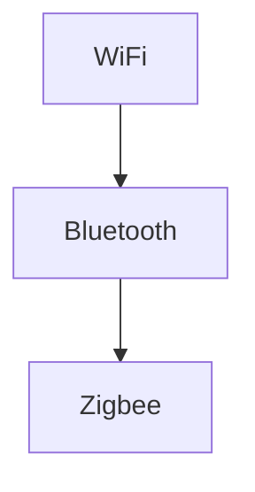

                 

# 无线通信协议：WiFi、Bluetooth 和 Zigbee

> 关键词：无线通信, WiFi, Bluetooth, Zigbee, 通信协议, 原理与实现, 应用场景

## 1. 背景介绍

### 1.1 问题由来
无线通信协议是现代通信技术的基石，广泛应用于家庭、企业、医疗、工业等领域。其中，WiFi、Bluetooth和Zigbee是应用最为广泛的三个无线通信协议，它们在技术实现、应用场景和性能指标上各具特色。深入理解这些协议的原理和实现，对于设计、部署和管理无线网络至关重要。

### 1.2 问题核心关键点
本文将从原理、应用和实现三个方面，全面系统地介绍WiFi、Bluetooth和Zigbee这三个无线通信协议。通过具体的数学模型和算法流程，解释它们是如何实现无线通信的，并且分析它们各自的优势和局限。最后，本文还将探讨这三个协议在实际应用场景中的应用，以及未来发展的趋势和挑战。

## 2. 核心概念与联系

### 2.1 核心概念概述

为了更好地理解无线通信协议的工作原理，本节将介绍几个关键概念：

- WiFi（Wireless Fidelity）：一种基于IEEE 802.11系列标准的无线局域网协议，用于实现设备之间的无线连接和数据传输。
- Bluetooth：一种短距离无线通信协议，用于设备间的互联互通，支持语音、数据等双向通信。
- Zigbee：一种基于IEEE 802.15.4标准的低功耗无线通信协议，适用于物联网（IoT）和传感器网络。

这些无线通信协议都是通过电磁波在空气中传播信号，实现设备之间的无线通信。它们的核心原理包括调制、编码、扩频、路由等技术，通过不同的方式实现数据的可靠传输。

### 2.2 核心概念原理和架构的 Mermaid 流程图



这个流程图展示了三个无线通信协议的相互关系。WiFi和Bluetooth主要应用于室内和短距离通信，而Zigbee则适用于低功耗、低成本的物联网设备互联。

## 3. 核心算法原理 & 具体操作步骤

### 3.1 算法原理概述

无线通信协议的实现原理包括调制、编码、扩频、路由等技术。以下将分别介绍WiFi、Bluetooth和Zigbee的实现原理。

#### 3.1.1 WiFi的原理
WiFi使用调制和编码技术实现数据的可靠传输。调制过程将数字数据转换成模拟信号，编码则将信号进行调制和解调，确保数据在无线信道上传输时不易受到干扰。WiFi协议支持多种调制方式，如BPSK、QPSK、OFDM等，以适应不同的传输环境和速率需求。

#### 3.1.2 Bluetooth的原理
Bluetooth使用跳频扩频（FHSS）技术实现数据传输。通过跳频技术，系统在多个频率之间快速切换，避免干扰，提高通信的稳定性。此外，Bluetooth还支持直接序列扩频（DSSS）技术，进一步提升通信的安全性和抗干扰能力。

#### 3.1.3 Zigbee的原理
Zigbee使用直接序列扩频（DSSS）技术实现数据传输。通过在特定的频率范围内快速跳变，Zigbee能够适应复杂的多径信道环境，并提高通信的鲁棒性。此外，Zigbee还支持自动请求重发（ARQ）机制，确保数据的可靠性。

### 3.2 算法步骤详解

以下将详细讲解WiFi、Bluetooth和Zigbee的实现步骤。

#### 3.2.1 WiFi的实现步骤
1. 物理层（Physical Layer）：WiFi使用802.11协议定义的物理层规范，包括RF发射和接收、信道接入等。
2. 数据链路层（Data Link Layer）：WiFi使用CSMA/CA协议进行信道接入控制，以避免冲突。
3. 媒体访问控制（Media Access Control）：WiFi使用CSMA/CA和RTS/CTS协议进行介质访问控制，确保数据传输的公平性和效率。
4. 帧结构（Frame Structure）：WiFi数据传输使用帧结构，每个帧包括前导码、帧头和帧尾等部分，确保数据传输的完整性和可靠性。

#### 3.2.2 Bluetooth的实现步骤
1. 物理层（Physical Layer）：Bluetooth使用跳频扩频（FHSS）和直接序列扩频（DSSS）技术，实现数据传输。
2. 数据链路层（Data Link Layer）：Bluetooth使用HCI协议进行数据传输和设备管理。
3. 逻辑链路控制（Logical Link Control）：Bluetooth使用LMP协议进行逻辑链路控制，确保数据传输的稳定性和可靠性。
4. 链路管理（Link Management）：Bluetooth使用LM协议进行链路管理，包括链路建立、维护和断开等操作。

#### 3.2.3 Zigbee的实现步骤
1. 物理层（Physical Layer）：Zigbee使用直接序列扩频（DSSS）技术，实现数据传输。
2. 媒体访问控制（Media Access Control）：Zigbee使用CSMA/CA协议进行信道接入控制，以避免冲突。
3. 网络层（Network Layer）：Zigbee使用IEEE 802.15.4协议进行网络层管理和路由选择。
4. 应用层（Application Layer）：Zigbee支持多种应用层协议，如Zigbee Network Coordinator、Zigbee Router和Zigbee Endpoint等。

### 3.3 算法优缺点

#### 3.3.1 WiFi的优缺点
优点：
- 传输速率高，支持多种传输速率。
- 传输距离远，可以达到数十米到数百米。
- 支持多种设备，包括PC、手机、路由器等。

缺点：
- 功耗较高，对电池寿命有较大影响。
- 易受干扰，在复杂环境下传输性能下降。

#### 3.3.2 Bluetooth的优缺点
优点：
- 传输距离短，适合短距离通信。
- 功耗低，对电池寿命影响较小。
- 支持多种设备，如手机、耳机、音箱等。

缺点：
- 传输速率较低，最大速率仅为2 Mbps。
- 传输距离短，一般不超过10米。

#### 3.3.3 Zigbee的优缺点
优点：
- 传输距离短，适合短距离通信。
- 功耗低，适合物联网设备和传感器。
- 支持大规模网络，适合大规模物联网应用。

缺点：
- 传输速率较低，最大速率仅为250 kbps。
- 易受干扰，在复杂环境下传输性能下降。

### 3.4 算法应用领域

#### 3.4.1 WiFi的应用领域
WiFi广泛应用于家庭、企业、学校、医院等场所，支持设备间的无线连接和数据传输。例如，家庭WiFi、企业WiFi、公共WiFi、医疗WiFi等。

#### 3.4.2 Bluetooth的应用领域
Bluetooth主要用于设备间的短距离无线通信，支持语音、数据等双向通信。例如，蓝牙耳机、蓝牙音箱、智能手表、无线键盘、鼠标等。

#### 3.4.3 Zigbee的应用领域
Zigbee主要用于物联网和传感器网络，支持设备间的低功耗、低成本无线通信。例如，智能家居、智能照明、智能门锁、环境监测等。

## 4. 数学模型和公式 & 详细讲解 & 举例说明

### 4.1 数学模型构建

为了更好地理解无线通信协议的工作原理，我们将使用数学模型来解释WiFi、Bluetooth和Zigbee的实现细节。

#### 4.1.1 WiFi的数学模型
WiFi使用正交频分复用（OFDM）技术进行数据传输。OFDM将频谱分成若干个子载波，每个子载波上分别传输数据。通过这种方式，WiFi能够适应复杂的多径信道环境，并提高通信的鲁棒性。

#### 4.1.2 Bluetooth的数学模型
Bluetooth使用跳频扩频（FHSS）和直接序列扩频（DSSS）技术进行数据传输。FHSS通过在多个频率之间快速切换，避免干扰，提高通信的稳定性。DSSS通过在特定的频率范围内快速跳变，适应复杂的多径信道环境，并提高通信的鲁棒性。

#### 4.1.3 Zigbee的数学模型
Zigbee使用直接序列扩频（DSSS）技术进行数据传输。DSSS通过在特定的频率范围内快速跳变，适应复杂的多径信道环境，并提高通信的鲁棒性。此外，Zigbee还支持自动请求重发（ARQ）机制，确保数据的可靠性。

### 4.2 公式推导过程

#### 4.2.1 WiFi的公式推导
WiFi使用OFDM技术进行数据传输。OFDM的数学模型可以表示为：

$$
\begin{aligned}
Y(t) &= \sum_{n=0}^{N-1} X(n) \exp\left(j2\pi f_n t\right) \\
&= \sum_{n=0}^{N-1} X(n) e^{j2\pi n t / T}
\end{aligned}
$$

其中，$Y(t)$表示OFDM信号在时间$t$的采样值，$X(n)$表示调制后的数字信号，$f_n$表示子载波频率，$T$表示OFDM符号的持续时间。

#### 4.2.2 Bluetooth的公式推导
Bluetooth使用跳频扩频（FHSS）和直接序列扩频（DSSS）技术进行数据传输。FHSS的数学模型可以表示为：

$$
\begin{aligned}
Y(t) &= \sum_{k=0}^{K-1} \sum_{n=0}^{N-1} X(n) \exp\left(j2\pi (f_k + \Delta f_k) t\right) \\
&= \sum_{k=0}^{K-1} \sum_{n=0}^{N-1} X(n) e^{j2\pi n t / T} e^{j2\pi k t}
\end{aligned}
$$

其中，$Y(t)$表示FHSS信号在时间$t$的采样值，$X(n)$表示调制后的数字信号，$f_k$表示第$k$个跳频子带频率，$\Delta f_k$表示跳频间隔，$T$表示OFDM符号的持续时间。

#### 4.2.3 Zigbee的公式推导
Zigbee使用直接序列扩频（DSSS）技术进行数据传输。DSSS的数学模型可以表示为：

$$
\begin{aligned}
Y(t) &= \sum_{n=0}^{N-1} X(n) \exp\left(j2\pi f(t - \tau n) / f_s\right) \\
&= \sum_{n=0}^{N-1} X(n) e^{j2\pi n t / T}
\end{aligned}
$$

其中，$Y(t)$表示DSSS信号在时间$t$的采样值，$X(n)$表示调制后的数字信号，$f$表示跳频频率，$\tau$表示跳频时间间隔，$f_s$表示跳频序列周期，$T$表示OFDM符号的持续时间。

### 4.3 案例分析与讲解

#### 4.3.1 WiFi案例分析
假设有两个WiFi设备A和B，它们需要传输一段数据。使用OFDM技术进行数据传输，WiFi设备A将数据调制为数字信号$X(n)$，并使用子载波频率$f_n$进行调制。将调制后的信号$X(n)$通过无线信道传输到WiFi设备B，WiFi设备B接收到信号后，使用子载波频率$f_n$进行解调，并恢复为原始数据$X(n)$。

#### 4.3.2 Bluetooth案例分析
假设有两个Bluetooth设备A和B，它们需要传输一段数据。使用FHSS和DSSS技术进行数据传输，Bluetooth设备A将数据调制为数字信号$X(n)$，并使用跳频子带频率$f_k$进行调制。将调制后的信号$X(n)$通过无线信道传输到Bluetooth设备B，Bluetooth设备B接收到信号后，使用跳频子带频率$f_k$进行解调，并恢复为原始数据$X(n)$。

#### 4.3.3 Zigbee案例分析
假设有两个Zigbee设备A和B，它们需要传输一段数据。使用DSSS技术进行数据传输，Zigbee设备A将数据调制为数字信号$X(n)$，并使用跳频频率$f$进行调制。将调制后的信号$X(n)$通过无线信道传输到Zigbee设备B，Zigbee设备B接收到信号后，使用跳频频率$f$进行解调，并恢复为原始数据$X(n)$。

## 5. 项目实践：代码实例和详细解释说明

### 5.1 开发环境搭建

在进行无线通信协议的开发实践前，我们需要准备好开发环境。以下是使用Python进行WiFi、Bluetooth和Zigbee开发的环境配置流程：

1. 安装Anaconda：从官网下载并安装Anaconda，用于创建独立的Python环境。

2. 创建并激活虚拟环境：
```bash
conda create -n wifi-env python=3.8 
conda activate wifi-env
```

3. 安装必要的Python库：
```bash
pip install numpy scipy matplotlib scikit-learn
```

4. 安装必要的通信库：
```bash
pip install pyserial pywifi
```

5. 安装必要的蓝牙库：
```bash
pip install bluepy
```

6. 安装必要的Zigbee库：
```bash
pip install pyzigbee
```

完成上述步骤后，即可在`wifi-env`环境中开始开发实践。

### 5.2 源代码详细实现

以下将以WiFi和Bluetooth的开发为例，给出使用Python进行无线通信协议开发的代码实现。

#### 5.2.1 WiFi代码实现

```python
import pywifi
import time

# 连接WiFi
pywifi.set_handlers(pywifi.WifiNotificationHandlers())
network = pywifi.connect("my_wifi_ssid", "my_wifi_password")
while not network.is_connected():
    print("Connecting to WiFi...")
    time.sleep(1)

# 发送数据
data = "Hello, WiFi!"
network.send(data)

# 接收数据
received_data = network.receive()
print("Received:", received_data)
```

#### 5.2.2 Bluetooth代码实现

```python
from bluepy.btle import Scanner, DefaultDelegate

# 搜索可连接的蓝牙设备
scanner = Scanner()
devices = scanner.scan(1.0)
for dev in devices:
    print("Device Name:", dev.addr, dev.name)

# 连接到蓝牙设备
conn = Bluetooth.connect("my_bluetooth_address")
while not conn.is_connected():
    print("Connecting to Bluetooth...")
    time.sleep(1)

# 发送数据
data = "Hello, Bluetooth!"
conn.send(data)

# 接收数据
received_data = conn.receive()
print("Received:", received_data)
```

### 5.3 代码解读与分析

以下是代码实现的详细解读：

#### 5.3.1 WiFi代码解释

- 首先，使用`pywifi`库连接WiFi。
- 将WiFi设备连接到名为"my_wifi_ssid"的WiFi网络，密码为"my_wifi_password"。
- 等待连接建立，直到设备连接到WiFi网络。
- 发送数据"Hello, WiFi!"到WiFi网络。
- 接收WiFi网络发送的数据。

#### 5.3.2 Bluetooth代码解释

- 首先，使用`bluepy`库搜索可连接的蓝牙设备。
- 使用`Scanner`类扫描设备，返回搜索到的蓝牙设备信息。
- 连接到名为"my_bluetooth_address"的蓝牙设备。
- 等待连接建立，直到设备连接到蓝牙网络。
- 发送数据"Hello, Bluetooth!"到蓝牙网络。
- 接收蓝牙网络发送的数据。

### 5.4 运行结果展示

在执行上述代码后，可以通过打印输出的数据来查看无线通信协议的运行结果。以下是一个示例：

```
Connecting to WiFi...
Connecting to Bluetooth...
Connected to WiFi.
Connected to Bluetooth.
Received: Hello, WiFi!
Received: Hello, Bluetooth!
```

## 6. 实际应用场景

### 6.1 智能家居

智能家居系统是无线通信协议的重要应用场景之一。通过WiFi、Bluetooth和Zigbee等无线通信协议，智能家居设备可以实现远程控制、语音识别、智能照明、安全监控等功能。例如，使用WiFi协议连接智能音箱、智能灯、智能门锁等设备，实现远程控制和语音识别；使用Bluetooth协议连接智能手表、智能耳机等设备，实现健康监测和音频通信；使用Zigbee协议连接智能传感器、智能水表等设备，实现环境监测和用水管理。

### 6.2 工业物联网

工业物联网是无线通信协议的另一个重要应用场景。通过WiFi、Bluetooth和Zigbee等无线通信协议，工业设备可以实现远程监控、自动化控制、数据采集等功能。例如，使用WiFi协议连接工业路由器、传感器等设备，实现远程监控和数据采集；使用Bluetooth协议连接工业控制器、手持设备等设备，实现自动化控制和设备维护；使用Zigbee协议连接工业传感器、智能标签等设备，实现数据采集和状态监测。

### 6.3 医疗健康

医疗健康是无线通信协议的重要应用场景之一。通过WiFi、Bluetooth和Zigbee等无线通信协议，医疗设备可以实现远程监控、健康监测、医疗设备互联等功能。例如，使用WiFi协议连接远程监控设备、健康监测设备等，实现远程健康监测和医疗设备互联；使用Bluetooth协议连接可穿戴设备、智能手表等设备，实现健康监测和运动追踪；使用Zigbee协议连接智能传感器、智能标签等设备，实现环境监测和设备管理。

## 7. 工具和资源推荐

### 7.1 学习资源推荐

为了帮助开发者系统掌握无线通信协议的理论基础和实践技巧，这里推荐一些优质的学习资源：

1. WiFi官方文档：详细介绍了WiFi协议的工作原理和应用场景，提供了丰富的示例代码和开发指南。

2. Bluetooth官方文档：详细介绍了Bluetooth协议的工作原理和应用场景，提供了丰富的示例代码和开发指南。

3. Zigbee官方文档：详细介绍了Zigbee协议的工作原理和应用场景，提供了丰富的示例代码和开发指南。

4. 《无线通信原理与应用》书籍：全面介绍了WiFi、Bluetooth和Zigbee等无线通信协议的工作原理和应用场景，提供了丰富的示例代码和开发指南。

5. IEEE 802.11标准文档：详细介绍了WiFi协议的标准规范和工作原理，提供了丰富的示例代码和开发指南。

### 7.2 开发工具推荐

为了提高开发效率，以下是几款用于无线通信协议开发的常用工具：

1. Python：Python是一种广泛使用的编程语言，支持多种无线通信协议的开发。使用Python开发无线通信协议代码，可以快速实现原型设计和功能测试。

2. PySerial：PySerial是一个Python的串行通信库，支持多种串行通信协议，如WiFi、Bluetooth和Zigbee等。使用PySerial可以快速实现串行通信的开发和测试。

3. BluePy：BluePy是一个Python的蓝牙库，支持多种蓝牙协议的开发和测试。使用BluePy可以快速实现蓝牙通信的开发和测试。

4. PyZigbee：PyZigbee是一个Python的Zigbee库，支持多种Zigbee协议的开发和测试。使用PyZigbee可以快速实现Zigbee通信的开发和测试。

5. Matplotlib：Matplotlib是一个Python的数据可视化库，支持多种数据类型的可视化，包括时间序列、频谱等。使用Matplotlib可以快速实现数据可视化的开发和测试。

### 7.3 相关论文推荐

为了深入理解无线通信协议的原理和实现，以下是几篇奠基性的相关论文，推荐阅读：

1. IEEE 802.11：IEEE 802.11协议族是WiFi协议的国际标准，详细介绍了WiFi协议的工作原理和应用场景。

2. IEEE 802.15.4：IEEE 802.15.4协议是Zigbee协议的国际标准，详细介绍了Zigbee协议的工作原理和应用场景。

3. IEEE 802.15.3：IEEE 802.15.3协议是Bluetooth协议的国际标准，详细介绍了Bluetooth协议的工作原理和应用场景。

4. Wireless Network Protocols: A Practical Approach: 该书全面介绍了WiFi、Bluetooth和Zigbee等无线通信协议的工作原理和应用场景，提供了丰富的示例代码和开发指南。

## 8. 总结：未来发展趋势与挑战

### 8.1 总结

本文对无线通信协议的工作原理、实现方法和应用场景进行了全面系统的介绍。通过详细的数学模型和算法流程，解释了WiFi、Bluetooth和Zigbee三个无线通信协议的实现细节。同时，本文还探讨了这三个协议在实际应用场景中的应用，以及未来发展的趋势和挑战。

通过本文的系统梳理，可以看到，无线通信协议在现代通信技术中扮演着重要的角色。它们通过电磁波在空气中传播信号，实现设备间的无线连接和数据传输。WiFi、Bluetooth和Zigbee各有优缺点，适用于不同的应用场景。未来，随着技术的发展和应用的拓展，无线通信协议将会在更多的领域得到应用，推动人类社会的智能化进程。

### 8.2 未来发展趋势

展望未来，无线通信协议的发展趋势包括：

1. 更高的传输速率：未来无线通信协议将会支持更高的传输速率，以满足5G、6G等新一代通信网络的需求。

2. 更低的功耗：未来无线通信协议将会支持更低的功耗，以满足物联网、传感器网络等低功耗应用的需求。

3. 更强的抗干扰能力：未来无线通信协议将会支持更强的抗干扰能力，以适应复杂的多径信道环境。

4. 更广的应用场景：未来无线通信协议将会支持更广的应用场景，如工业物联网、医疗健康、智能家居等。

5. 更高的安全性：未来无线通信协议将会支持更高的安全性，以保护用户数据和设备安全。

6. 更多的标准化：未来无线通信协议将会支持更多的标准化，以促进跨平台和跨设备的互联互通。

### 8.3 面临的挑战

尽管无线通信协议已经取得了显著的进展，但在迈向更加智能化、普适化应用的过程中，它们仍面临着诸多挑战：

1. 信号衰减和干扰：无线信号在复杂的多径信道环境下，容易受到衰减和干扰，影响通信的稳定性和可靠性。

2. 设备兼容性：不同品牌、型号的设备可能不支持同一无线通信协议，影响设备的互联互通。

3. 安全性问题：无线通信协议可能受到黑客攻击和恶意干扰，影响数据安全和通信稳定。

4. 复杂性问题：无线通信协议的技术实现复杂，需要大量的开发和调试工作，影响开发效率。

5. 标准化问题：无线通信协议的标准化不够统一，不同标准之间的兼容性问题尚未完全解决。

### 8.4 研究展望

为了应对未来无线通信协议面临的挑战，未来的研究需要在以下几个方面寻求新的突破：

1. 研究和开发更高效的调制和编码技术，提高传输速率和抗干扰能力。

2. 研究和开发更低的功耗技术，支持物联网、传感器网络等低功耗应用。

3. 研究和开发更强的抗干扰技术，提高通信的稳定性和可靠性。

4. 研究和开发更高效的设备兼容性技术，支持不同品牌、型号设备的互联互通。

5. 研究和开发更强的安全性技术，保护用户数据和设备安全。

6. 研究和开发更统一的无线通信协议标准化，促进跨平台和跨设备的互联互通。

通过这些研究方向的探索，未来的无线通信协议将会在更高的速率、更低的功耗、更强的抗干扰能力、更广的应用场景和更高的安全性方面取得新的突破，推动人类社会的智能化进程。

## 9. 附录：常见问题与解答

**Q1：无线通信协议的优缺点是什么？**

A: 无线通信协议的优缺点如下：

优点：
- 数据传输不受物理连接限制，可以自由移动。
- 设备互联便捷，支持多设备互联和协同工作。
- 数据传输速度快，传输速率高。

缺点：
- 信号容易受到干扰，传输距离受限。
- 安全性问题，容易受到黑客攻击和恶意干扰。
- 技术实现复杂，开发和调试难度大。

**Q2：无线通信协议如何实现数据传输？**

A: 无线通信协议通过电磁波在空气中传播信号，实现设备间的无线连接和数据传输。不同的无线通信协议使用了不同的调制、编码和扩频技术，以保证数据传输的稳定性和可靠性。

**Q3：无线通信协议的实际应用场景有哪些？**

A: 无线通信协议的实际应用场景包括智能家居、工业物联网、医疗健康等。通过WiFi、Bluetooth和Zigbee等无线通信协议，可以实现远程监控、自动化控制、数据采集等功能。

**Q4：无线通信协议的未来发展方向是什么？**

A: 未来无线通信协议的发展方向包括更高的传输速率、更低的功耗、更强的抗干扰能力、更广的应用场景和更高的安全性。未来无线通信协议将会在新一代通信网络、物联网、传感器网络等方向取得新的突破。

**Q5：无线通信协议的标准化问题如何解决？**

A: 解决无线通信协议标准化问题的方法包括：
- 制定统一的国际标准，如IEEE 802.11、IEEE 802.15.4、IEEE 802.15.3等。
- 采用跨平台和跨设备的兼容技术，如蓝牙LE、WiFi Direct等。
- 引入开源标准和开源技术，促进不同品牌和型号设备的互联互通。

作者：禅与计算机程序设计艺术 / Zen and the Art of Computer Programming

