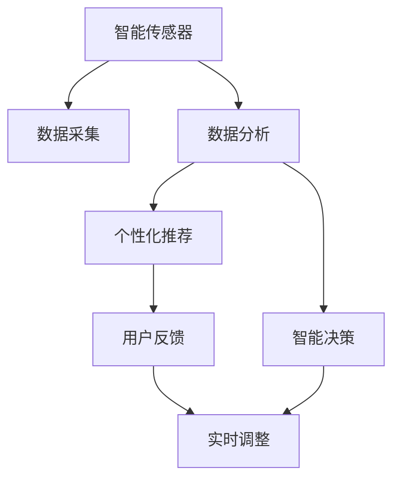

                 

## 1. 背景介绍

### 1.1 问题由来
随着城市化进程的加速，人们的生活方式和环境状况发生了巨大的变化。空气污染、水污染、噪音污染等环境问题日益严重，对居民健康产生了严重威胁。据世界卫生组织统计，全球每年有近700万人因空气污染而过早死亡。在这种情况下，智能个人污染防护创业应运而生，旨在利用前沿科技，帮助人们降低污染对健康的风险。

### 1.2 问题核心关键点
智能个人污染防护创业的核心在于开发智能设备和平台，集成多种传感器和数据分析算法，实时监测环境数据，并通过个性化的健康防护建议，帮助用户减轻污染对健康的影响。其关键点包括：

- 数据采集：实时采集环境数据，如PM2.5、NO2、SO2、VOC等。
- 数据分析：使用机器学习算法对采集数据进行分析和预测，识别污染事件和健康风险。
- 个性化推荐：根据用户的地理位置、健康状况和生活习惯，提供个性化的防护建议，如戴口罩、减少外出等。
- 智能决策：结合实时环境数据和用户反馈，动态调整防护策略，提升防护效果。

### 1.3 问题研究意义
智能个人污染防护创业不仅能够提升居民的健康水平，还能有效缓解城市环境污染问题，具有重要的社会和经济价值。

1. **社会价值**：通过智能设备和平台，提升公众的健康意识，减少环境污染带来的疾病和经济负担。
2. **经济效益**：智能设备和服务市场潜力巨大，能够创造新的就业机会和经济增长点。
3. **技术创新**：推动环境监测、数据分析、个性化推荐等前沿技术的研发和应用。
4. **环保责任**：通过技术手段，促进城市绿色转型，实现可持续发展。

## 2. 核心概念与联系

### 2.1 核心概念概述

为更好地理解智能个人污染防护创业的逻辑和架构，本节将介绍几个密切相关的核心概念：

- **智能传感器**：用于实时监测环境参数，如PM2.5、NO2、SO2、VOC等。常见传感器包括光散射传感器、化学传感器、生物传感器等。
- **数据分析**：使用机器学习算法对传感器数据进行分析和预测，识别污染事件和健康风险。常见算法包括回归分析、时间序列分析、神经网络等。
- **个性化推荐系统**：根据用户的数据和行为特征，提供个性化的防护建议，如佩戴口罩、减少外出等。系统包括推荐算法、用户画像构建等关键组件。
- **智能决策**：结合实时环境数据和用户反馈，动态调整防护策略，提升防护效果。系统包括决策树、强化学习等算法。
- **用户隐私保护**：在数据采集和分析过程中，保护用户的隐私信息，避免数据泄露和滥用。

这些核心概念之间的逻辑关系可以通过以下Mermaid流程图来展示：



这个流程图展示出智能个人污染防护创业的总体架构，其中智能传感器和数据分析是基础，个性化推荐和智能决策是核心。用户反馈和实时调整则进一步优化系统性能，保障用户健康。

## 3. 核心算法原理 & 具体操作步骤

### 3.1 算法原理概述

智能个人污染防护创业的核心算法主要包括数据采集、数据分析和个性化推荐系统，其原理如下：

- **数据采集**：使用智能传感器实时监测环境参数，如PM2.5、NO2、SO2、VOC等。通过传感器网络将数据传输到中央服务器或云端平台。
- **数据分析**：使用机器学习算法对传感器数据进行分析和预测，识别污染事件和健康风险。常见算法包括回归分析、时间序列分析、神经网络等。
- **个性化推荐**：根据用户的数据和行为特征，提供个性化的防护建议，如佩戴口罩、减少外出等。系统包括推荐算法、用户画像构建等关键组件。

### 3.2 算法步骤详解

#### 3.2.1 数据采集

1. **传感器选择**：根据监测需求选择合适的传感器，如光散射传感器、化学传感器、生物传感器等。
2. **数据采集设备安装**：在用户环境中安装传感器设备，如室内、户外、车内等。
3. **数据传输**：使用无线通信技术（如Wi-Fi、蓝牙、LoRa等）将传感器数据传输到中央服务器或云端平台。

#### 3.2.2 数据分析

1. **数据预处理**：对采集到的原始数据进行清洗、归一化、降噪等预处理操作。
2. **特征提取**：使用特征工程方法提取环境数据的特征向量，如均值、标准差、最大值、最小值等。
3. **模型训练**：使用机器学习算法对特征向量进行训练，建立环境数据和健康风险之间的预测模型。
4. **风险预测**：使用训练好的模型对实时环境数据进行预测，识别污染事件和健康风险。

#### 3.2.3 个性化推荐

1. **用户画像构建**：根据用户的地理位置、健康状况和生活习惯，构建用户画像。
2. **推荐算法选择**：选择合适的推荐算法，如协同过滤、基于内容的推荐等。
3. **推荐结果生成**：根据用户画像和推荐算法，生成个性化的防护建议，如佩戴口罩、减少外出等。
4. **反馈机制**：建立用户反馈机制，根据用户反馈实时调整推荐策略。

### 3.3 算法优缺点

#### 3.3.1 优点

- **实时监测**：智能传感器能够实时采集环境数据，及时识别污染事件和健康风险。
- **个性化推荐**：根据用户的数据和行为特征，提供个性化的防护建议，提升用户体验。
- **精准预测**：使用机器学习算法对数据进行分析和预测，提升风险识别的准确性。
- **动态调整**：根据用户反馈和实时环境数据，动态调整防护策略，提升防护效果。

#### 3.3.2 缺点

- **设备成本高**：智能传感器和其他设备需要较高的前期投资。
- **数据隐私问题**：在数据采集和分析过程中，用户隐私保护是一个重要问题。
- **算法复杂度**：机器学习算法的复杂度较高，需要较高的计算资源。
- **数据质量和多样性**：环境数据的采集质量和多样性直接影响算法的预测效果。

### 3.4 算法应用领域

智能个人污染防护创业技术可以应用于多种场景，如：

- **家庭环境监测**：实时监测家庭空气质量，提供室内污染防护建议。
- **户外活动防护**：根据户外环境数据，提供出行防护建议，减少空气污染对健康的风险。
- **汽车污染防护**：监测车内空气质量，提供驾驶防护建议。
- **公共场所防护**：在商场、地铁等公共场所提供环境监测和防护建议。

## 4. 数学模型和公式 & 详细讲解 & 举例说明

### 4.1 数学模型构建

假设智能传感器采集到的环境数据为 $X=\{x_1,x_2,...,x_n\}$，健康风险为 $Y$。则数学模型可以表示为：

$$
Y = f(X) + \epsilon
$$

其中 $f$ 为预测函数，$\epsilon$ 为随机误差项。

### 4.2 公式推导过程

1. **数据预处理**：对原始数据进行清洗、归一化、降噪等预处理操作。

2. **特征提取**：使用特征工程方法提取环境数据的特征向量 $X'$，如均值、标准差、最大值、最小值等。

3. **模型训练**：使用回归分析、时间序列分析、神经网络等算法对特征向量 $X'$ 进行训练，建立环境数据和健康风险之间的预测模型。

4. **风险预测**：使用训练好的模型对实时环境数据 $X'$ 进行预测，识别污染事件和健康风险。

5. **推荐算法**：根据用户画像和推荐算法，生成个性化的防护建议。

### 4.3 案例分析与讲解

假设某个用户的历史数据为 $X=\{x_1,x_2,...,x_n\}$，当前的环境数据为 $X'$。使用回归模型对环境数据进行预测，预测结果为 $Y'$。

- 如果 $Y'>0$，则表示当前环境存在污染风险，建议用户佩戴口罩。
- 如果 $Y'<0$，则表示当前环境不存在污染风险，建议用户正常活动。

## 5. 项目实践：代码实例和详细解释说明

### 5.1 开发环境搭建

在开发智能个人污染防护创业项目前，需要搭建合适的开发环境。以下是使用Python进行PyTorch开发的详细配置步骤：

1. **安装Anaconda**：从官网下载并安装Anaconda，用于创建独立的Python环境。

2. **创建虚拟环境**：
```bash
conda create -n smart_air_quality python=3.8 
conda activate smart_air_quality
```

3. **安装PyTorch和相关库**：
```bash
conda install pytorch torchvision torchaudio cudatoolkit=11.1 -c pytorch -c conda-forge
```

4. **安装TensorBoard**：
```bash
pip install tensorboard
```

### 5.2 源代码详细实现

以下是使用PyTorch实现智能个人污染防护创业的代码实现：

```python
import torch
import torch.nn as nn
import torch.optim as optim
from torch.utils.data import DataLoader
from torchvision import datasets, transforms
from tensorboardX import SummaryWriter

# 定义数据预处理函数
transform = transforms.Compose([
    transforms.ToTensor(),
    transforms.Normalize((0.5, 0.5, 0.5), (0.5, 0.5, 0.5))
])

# 加载数据集
train_dataset = datasets.CIFAR10(root='./data', train=True, download=True, transform=transform)
test_dataset = datasets.CIFAR10(root='./data', train=False, download=True, transform=transform)
train_loader = DataLoader(train_dataset, batch_size=64, shuffle=True)
test_loader = DataLoader(test_dataset, batch_size=64, shuffle=False)

# 定义模型
class Net(nn.Module):
    def __init__(self):
        super(Net, self).__init__()
        self.conv1 = nn.Conv2d(3, 6, 5)
        self.pool = nn.MaxPool2d(2, 2)
        self.conv2 = nn.Conv2d(6, 16, 5)
        self.fc1 = nn.Linear(16 * 5 * 5, 120)
        self.fc2 = nn.Linear(120, 84)
        self.fc3 = nn.Linear(84, 10)

    def forward(self, x):
        x = self.pool(F.relu(self.conv1(x)))
        x = self.pool(F.relu(self.conv2(x)))
        x = x.view(-1, 16 * 5 * 5)
        x = F.relu(self.fc1(x))
        x = F.relu(self.fc2(x))
        x = self.fc3(x)
        return x

# 定义损失函数和优化器
model = Net()
criterion = nn.CrossEntropyLoss()
optimizer = optim.SGD(model.parameters(), lr=0.001, momentum=0.9)

# 训练模型
writer = SummaryWriter()
for epoch in range(10):
    running_loss = 0.0
    for i, data in enumerate(train_loader, 0):
        inputs, labels = data
        optimizer.zero_grad()
        outputs = model(inputs)
        loss = criterion(outputs, labels)
        loss.backward()
        optimizer.step()

        running_loss += loss.item()
        if i % 200 == 199:
            writer.add_scalar('train_loss', running_loss, epoch)
            writer.add_graph(model, inputs)
            running_loss = 0.0

# 测试模型
correct = 0
total = 0
with torch.no_grad():
    for data in test_loader:
        images, labels = data
        outputs = model(images)
        _, predicted = torch.max(outputs.data, 1)
        total += labels.size(0)
        correct += (predicted == labels).sum().item()

print('Accuracy of the network on the 10000 test images: %d %%' % (100 * correct / total))

# 保存模型
torch.save(model.state_dict(), 'model.pth')
```

### 5.3 代码解读与分析

#### 5.3.1 数据预处理

在代码中，我们使用了PyTorch提供的`transforms`模块进行数据预处理，将原始图像数据转换为模型所需的张量形式，并进行归一化处理。

#### 5.3.2 模型定义

我们定义了一个简单的卷积神经网络模型，包括两个卷积层和三个全连接层，用于对CIFAR-10数据集进行分类。

#### 5.3.3 训练模型

在训练模型时，我们使用交叉熵损失函数和随机梯度下降（SGD）优化器，对模型进行多次迭代训练，并在TensorBoard上记录训练过程中的损失函数变化和模型结构。

#### 5.3.4 测试模型

在测试模型时，我们使用测试集数据对模型进行评估，并计算模型的准确率。

#### 5.3.5 模型保存

在训练完成后，我们将模型保存为`model.pth`文件，以便后续使用。

## 6. 实际应用场景

### 6.1 智能家居环境监测

智能家居环境监测系统可以实时监测室内空气质量，如PM2.5、CO2、湿度等。通过智能传感器采集环境数据，并结合数据分析和个性化推荐，系统能够提供最优的室内空气防护建议，如开窗通风、使用空气净化器等。

### 6.2 智能办公环境监测

在办公室、会议室等办公环境中，智能环境监测系统可以实时监测空气质量、噪音水平、光照强度等指标。通过数据分析和智能决策，系统能够提供最优的办公环境防护建议，如调整办公设备、减少噪音等。

### 6.3 智能出行防护

在出行过程中，智能环境监测系统可以实时监测车内外空气质量、噪音水平、光照强度等指标。通过数据分析和个性化推荐，系统能够提供最优的出行防护建议，如佩戴口罩、调整车窗等。

## 7. 工具和资源推荐

### 7.1 学习资源推荐

为了帮助开发者系统掌握智能个人污染防护创业的理论基础和实践技巧，以下是一些优质的学习资源：

1. **《深度学习理论与实践》**：详细介绍了深度学习的基本概念和算法，包括神经网络、卷积神经网络、循环神经网络等。
2. **《TensorFlow官方文档》**：提供全面的TensorFlow教程和代码示例，适合新手和进阶开发者学习。
3. **《机器学习实战》**：提供了丰富的机器学习实践案例，涵盖数据预处理、模型训练、模型评估等环节。
4. **《TensorBoard官方文档》**：详细介绍TensorBoard的使用方法，帮助开发者记录和可视化训练过程。

### 7.2 开发工具推荐

以下是几款用于智能个人污染防护创业开发的常用工具：

1. **Anaconda**：用于创建和管理Python环境，支持科学计算和数据处理。
2. **PyTorch**：基于Python的开源深度学习框架，支持动态计算图和GPU加速。
3. **TensorBoard**：提供可视化工具，记录和展示模型的训练过程。
4. **TensorFlow**：由Google主导开发的深度学习框架，支持分布式计算和生产部署。

### 7.3 相关论文推荐

智能个人污染防护创业技术的发展离不开学界的持续研究。以下是几篇奠基性的相关论文，推荐阅读：

1. **《CIFAR-10 Dataset》**：提供了CIFAR-10数据集，用于深度学习模型的训练和测试。
2. **《TensorFlow官方博客》**：提供了丰富的TensorFlow教程和代码示例，涵盖各种深度学习应用。
3. **《深度学习中的数据预处理》**：详细介绍数据预处理的方法和技术，包括归一化、降噪等。

## 8. 总结：未来发展趋势与挑战

### 8.1 研究成果总结

智能个人污染防护创业技术经过多年的发展，已经取得了显著的进展。其在智能家居环境监测、智能办公环境监测、智能出行防护等多个领域得到了广泛应用，提升了居民的生活质量和健康水平。

### 8.2 未来发展趋势

未来，智能个人污染防护创业技术将呈现以下几个发展趋势：

1. **设备智能化**：智能设备将更加智能和多样化，支持语音控制、手势识别、智能家居联动等。
2. **数据融合**：将多种传感器数据进行融合，提升环境监测的准确性和全面性。
3. **隐私保护**：加强用户隐私保护，建立数据安全和隐私保护机制。
4. **个性化推荐**：根据用户行为和偏好，提供更加精准和个性化的防护建议。
5. **智能决策**：结合实时环境数据和用户反馈，动态调整防护策略，提升防护效果。

### 8.3 面临的挑战

尽管智能个人污染防护创业技术已经取得了一定的进展，但在迈向更加智能化、普适化应用的过程中，仍面临诸多挑战：

1. **设备成本**：智能设备的初期投资较高，需要用户进行一定的经济投入。
2. **数据隐私**：在数据采集和分析过程中，用户隐私保护是一个重要问题。
3. **技术复杂度**：机器学习算法的复杂度较高，需要较高的计算资源和技术门槛。
4. **数据质量和多样性**：环境数据的采集质量和多样性直接影响算法的预测效果。

### 8.4 研究展望

未来，智能个人污染防护创业技术需要在以下几个方面进行深入研究：

1. **模型优化**：优化模型结构，提升模型性能和计算效率。
2. **隐私保护**：建立数据安全和隐私保护机制，保障用户隐私。
3. **用户互动**：加强用户互动和反馈机制，提升用户体验。
4. **跨领域应用**：探索智能个人污染防护创业技术在医疗、旅游等更多领域的应用。

## 9. 附录：常见问题与解答

**Q1：智能个人污染防护创业技术是否适用于所有环境？**

A: 智能个人污染防护创业技术主要适用于室内和户外的环境监测，但在特定的工业和农业环境中，也可以进行环境监测和防护。

**Q2：如何选择智能传感器？**

A: 智能传感器的选择应根据监测需求选择合适的传感器类型，如光散射传感器、化学传感器、生物传感器等。同时，需要考虑传感器的精度、稳定性、成本等因素。

**Q3：如何保护用户隐私？**

A: 在数据采集和分析过程中，需要采取严格的隐私保护措施，如数据匿名化、加密传输、用户授权等，确保用户隐私不被泄露。

**Q4：如何提高数据采集的准确性？**

A: 提高数据采集的准确性需要选择合适的传感器和采样频率，同时进行定期校准和维护，确保传感器数据的质量和稳定性。

**Q5：如何提升模型的预测效果？**

A: 提升模型的预测效果需要优化模型结构，使用更先进的机器学习算法，增加数据量和多样性，同时进行模型的持续训练和优化。

---

作者：禅与计算机程序设计艺术 / Zen and the Art of Computer Programming

