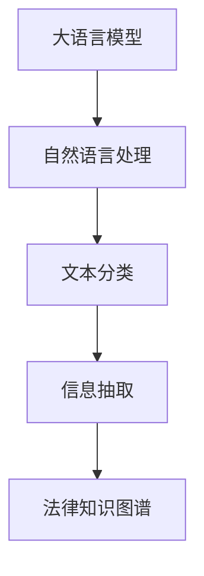

                 

# 智能合同分析：LLM在法律文件处理中的作用

> 关键词：自然语言处理(NLP),大语言模型(LLM),智能合约,法律文件处理,文本分类,信息抽取,法律知识图谱

## 1. 背景介绍

### 1.1 问题由来

在数字经济时代，智能合约(Smart Contract)成为一种新型的自动化执行协议，广泛应用于金融、供应链、房地产等各类经济活动中。智能合约通过区块链等技术实现自动执行，具有去中心化、透明化、不可篡改等优点。

然而，智能合约也面临诸多挑战。合同条款的模糊、理解偏差、遗漏漏洞等问题，可能导致合同执行出现偏差或争议。特别是在涉及复杂的法律关系时，手工审查和解读合同的难度和成本极高。

为了提高合同审查的效率和准确性，可以利用大语言模型(LLM)进行智能合同分析，即利用自然语言处理(NLP)技术，自动分析和理解法律文件中的条款内容，识别合同中的法律风险和潜在漏洞，为合同的自动化审查提供支持。

### 1.2 问题核心关键点

智能合同分析的主要挑战包括：

- 文本理解的准确性：法律文件内容复杂，语言表达多样，需要高精度的文本理解模型。
- 法律知识的整合：法律知识包含大量专业术语和法规条文，需要模型具备较强的法律知识理解能力。
- 风险和漏洞的识别：合同条款中可能存在模糊表达、遗漏漏洞等风险，模型需要具备良好的风险识别能力。
- 决策的可解释性：智能合同分析的决策过程需要具备可解释性，便于人工验证和纠正。
- 实时性和鲁棒性：智能合同分析需要在实时环境中高可靠运行，不受噪声和异常数据影响。

本文聚焦于大语言模型在智能合同分析中的应用，详细阐述了基于LLM的文本分类和信息抽取技术，并给出了具体的代码实例和优化建议。

## 2. 核心概念与联系

### 2.1 核心概念概述

为更好地理解基于LLM的智能合同分析方法，本节将介绍几个密切相关的核心概念：

- 大语言模型(LLM)：以自回归(如GPT)或自编码(如BERT)模型为代表的大规模预训练语言模型。通过在大规模无标签文本语料上进行预训练，学习通用的语言知识和表达能力。

- 自然语言处理(NLP)：利用计算机技术对自然语言文本进行处理和分析，包括分词、词性标注、命名实体识别、语义理解等任务。

- 文本分类：将文本数据分类到预定义的类别中，如合同文本的分类任务可细分为合同类型、合同主体、合同条款等类别。

- 信息抽取：从文本中抽取结构化信息，如合同中的关键条款、生效日期、责任主体等。

- 法律知识图谱：利用知识图谱技术，将法律知识进行结构化表示，为模型提供丰富的法律背景知识。

这些核心概念之间的逻辑关系可以通过以下Mermaid流程图来展示：



这个流程图展示了大语言模型在智能合同分析中的核心概念及其之间的关系：

1. 大语言模型通过预训练获得基础能力。
2. 自然语言处理技术将文本数据转化为结构化信息，供模型进行分类和抽取。
3. 文本分类和信息抽取任务为合同的自动化审查提供依据。
4. 法律知识图谱为模型提供丰富的法律背景知识，增强理解能力和决策精度。

这些概念共同构成了智能合同分析的理论框架，使得大语言模型能够自动分析和理解合同条款，识别风险和漏洞，为合同审查提供可靠支持。

## 3. 核心算法原理 & 具体操作步骤
### 3.1 算法原理概述

基于LLM的智能合同分析，本质上是一个文本分类和信息抽取的NLP问题。其核心思想是：将大语言模型作为通用的文本处理工具，利用预训练的通用语言知识，通过微调和优化，使其能够准确分类和抽取合同中的关键信息。

形式化地，假设合同文本为 $T$，合同类型为 $C$，则需要设计一个分类器 $f$，使得 $f(T) \in C$，同时提取关键信息 $I \subset T$。

对于文本分类，我们可以设计一个损失函数 $\mathcal{L}_{class}$ 来衡量分类器 $f$ 在训练集上的性能：

$$
\mathcal{L}_{class} = \frac{1}{N}\sum_{i=1}^N \ell(f(T_i), C_i)
$$

其中 $\ell$ 为分类损失函数，$T_i$ 为第 $i$ 个合同文本，$C_i$ 为真实类别标签。

对于信息抽取，可以设计一个损失函数 $\mathcal{L}_{抽取}$ 来衡量信息抽取器 $g$ 在训练集上的性能：

$$
\mathcal{L}_{抽取} = \frac{1}{N}\sum_{i=1}^N \ell(g(T_i), I_i)
$$

其中 $\ell$ 为信息抽取损失函数，$I_i$ 为第 $i$ 个合同文本中抽取出的关键信息。

通过梯度下降等优化算法，微调过程不断更新模型参数 $\theta$，最小化损失函数 $\mathcal{L}$，使得模型输出逼近真实类别和关键信息。由于 $\theta$ 已经通过预训练获得了较好的初始化，因此即便在小规模数据集上进行操作，也能较快收敛到理想的模型参数 $\hat{\theta}$。

### 3.2 算法步骤详解

基于LLM的智能合同分析一般包括以下几个关键步骤：

**Step 1: 准备数据集和模型**

- 收集合同文本数据集，包括不同类型的合同样本和标注信息。
- 选择合适的LLM作为初始化参数，如BERT、GPT等。
- 在模型上预训练语言表示，使用大量无标签文本语料进行预训练。

**Step 2: 设计任务适配层**

- 根据合同任务的特点，设计合适的任务适配层，如分类器、信息抽取器等。
- 对于分类任务，通常使用全连接层、CNN、RNN等模型进行多分类。
- 对于信息抽取任务，通常使用Attention机制、Bi-LSTM等模型进行序列标注。

**Step 3: 设置微调超参数**

- 选择合适的优化算法及其参数，如Adam、SGD等，设置学习率、批大小、迭代轮数等。
- 设置正则化技术及强度，包括L2正则、Dropout、Early Stopping等。
- 确定冻结预训练参数的策略，如仅微调顶层，或全部参数都参与微调。

**Step 4: 执行梯度训练**

- 将训练集数据分批次输入模型，前向传播计算损失函数。
- 反向传播计算参数梯度，根据设定的优化算法和学习率更新模型参数。
- 周期性在验证集上评估模型性能，根据性能指标决定是否触发 Early Stopping。
- 重复上述步骤直到满足预设的迭代轮数或 Early Stopping 条件。

**Step 5: 测试和部署**

- 在测试集上评估微调后模型 $f$ 的性能，对比微调前后的精度提升。
- 使用微调后的模型对新合同文本进行推理预测，集成到实际的应用系统中。
- 持续收集新的合同数据，定期重新微调模型，以适应数据分布的变化。

以上是基于LLM的智能合同分析的一般流程。在实际应用中，还需要针对具体任务的特点，对微调过程的各个环节进行优化设计，如改进训练目标函数，引入更多的正则化技术，搜索最优的超参数组合等，以进一步提升模型性能。

### 3.3 算法优缺点

基于LLM的智能合同分析方法具有以下优点：

- 灵活高效。适用于各种合同类型的文本分类和信息抽取，设计简单的任务适配层即可实现微调。
- 知识丰富。LLM通过大规模无标签文本预训练，具备丰富的通用语言知识，能够更好地理解复杂合同条款。
- 泛化能力强。LLM具有较强的泛化能力，能够适应多种合同文本的表达形式和风格。
- 应用广泛。适用于合同审查、合同生成、合同提醒等多个场景，能够显著提升合同处理效率和准确性。

同时，该方法也存在一定的局限性：

- 对标注数据依赖高。微调效果很大程度上取决于标注数据的质量和数量，标注成本较高。
- 可能存在偏见。LLM在预训练过程中可能学习到一些偏见，需要对其进行公平性验证和纠正。
- 可解释性不足。微调模型内部的推理过程缺乏可解释性，难以对其决策逻辑进行分析和调试。
- 计算资源消耗大。大模型的推理和微调需要大量的计算资源，可能面临性能瓶颈。

尽管存在这些局限性，但就目前而言，基于LLM的智能合同分析方法仍是目前智能合同处理最主流范式。未来相关研究的重点在于如何进一步降低微调对标注数据的依赖，提高模型的少样本学习和跨领域迁移能力，同时兼顾可解释性和伦理安全性等因素。

### 3.4 算法应用领域

基于LLM的智能合同分析方法已经在合同审查、合同生成、合同提醒等多个场景中得到了广泛应用，例如：

- 合同审查：自动检测合同中的风险和漏洞，提供风险提示。
- 合同生成：根据合同模板和用户需求，自动生成合同文本。
- 合同提醒：在合同履行期限即将到期时，自动发送提醒通知。
- 合同审计：对合同中的关键条款进行自动化审计，检测违规行为。
- 合同建议：根据合同条款提供法律建议，辅助合同签订和履行。

除了上述这些经典任务外，智能合同分析还被创新性地应用到更多场景中，如合同纠纷处理、合同数据分析、合同合规检测等，为合同管理提供了新的技术手段。随着LLM和智能合同技术的发展，相信未来智能合同分析将在更广阔的应用领域发挥更大作用，深刻影响企业的合同管理模式。

## 4. 数学模型和公式 & 详细讲解  
### 4.1 数学模型构建

本节将使用数学语言对基于LLM的智能合同分析过程进行更加严格的刻画。

记合同文本为 $T$，合同类型为 $C$，合同中抽取出的关键信息为 $I$。假设合同文本 $T$ 由 $n$ 个单词组成，令 $w_i$ 为第 $i$ 个单词。

定义合同分类器为 $f$，合同信息抽取器为 $g$，则合同分类器的输出为 $\hat{C}=f(T)$，合同信息抽取器的输出为 $\hat{I}=g(T)$。

模型的目标是在训练集 $\{(T_i,C_i,I_i)\}_{i=1}^N$ 上最小化损失函数 $\mathcal{L}$：

$$
\mathcal{L} = \alpha\mathcal{L}_{class} + \beta\mathcal{L}_{抽取}
$$

其中 $\alpha$ 和 $\beta$ 为两个权重因子，用于平衡分类和抽取任务的损失贡献。

对于文本分类任务，可以使用多分类交叉熵损失函数：

$$
\mathcal{L}_{class} = -\frac{1}{N}\sum_{i=1}^N \sum_{k=1}^K \ell(f(T_i),C_i)
$$

其中 $\ell$ 为分类损失函数，$K$ 为分类数。

对于信息抽取任务，可以使用序列标注的F1分数：

$$
\mathcal{L}_{抽取} = -\frac{1}{N}\sum_{i=1}^N F1(g(T_i),I_i)
$$

其中 $F1$ 为信息抽取的F1分数，$I_i$ 为第 $i$ 个合同文本中抽取出的关键信息。

### 4.2 公式推导过程

以下我们以二分类任务为例，推导分类器 $f$ 和信息抽取器 $g$ 的训练损失函数。

假设模型 $f$ 在输入 $T$ 上的输出为 $\hat{C}=f(T) \in [0,1]$，表示合同类型为正类的概率。真实标签 $C \in \{0,1\}$。则二分类交叉熵损失函数定义为：

$$
\ell(f(T),C) = -[C\log \hat{C} + (1-C)\log (1-\hat{C})]
$$

将其代入经验风险公式，得：

$$
\mathcal{L}_{class} = -\frac{1}{N}\sum_{i=1}^N \sum_{k=1}^K \ell(f(T_i),C_i)
$$

对于信息抽取任务，可以定义序列标注的F1分数：

$$
F1(g(T),I) = 2 \cdot \frac{\text{TP} + \text{TN}}{\text{TP} + \text{TN} + \text{FP} + \text{FN}}
$$

其中 $\text{TP}$ 为真正例数，$\text{TN}$ 为真反例数，$\text{FP}$ 为假正例数，$\text{FN}$ 为假反例数。

将F1分数代入经验风险公式，得：

$$
\mathcal{L}_{抽取} = -\frac{1}{N}\sum_{i=1}^N F1(g(T_i),I_i)
$$

在得到损失函数后，即可带入参数更新公式，完成模型的迭代优化。重复上述过程直至收敛，最终得到适应合同任务的模型参数 $\hat{\theta}$。

## 5. 项目实践：代码实例和详细解释说明
### 5.1 开发环境搭建

在进行智能合同分析项目开发前，我们需要准备好开发环境。以下是使用Python进行PyTorch开发的环境配置流程：

1. 安装Anaconda：从官网下载并安装Anaconda，用于创建独立的Python环境。

2. 创建并激活虚拟环境：
```bash
conda create -n pytorch-env python=3.8 
conda activate pytorch-env
```

3. 安装PyTorch：根据CUDA版本，从官网获取对应的安装命令。例如：
```bash
conda install pytorch torchvision torchaudio cudatoolkit=11.1 -c pytorch -c conda-forge
```

4. 安装HuggingFace Transformers库：
```bash
pip install transformers
```

5. 安装各类工具包：
```bash
pip install numpy pandas scikit-learn matplotlib tqdm jupyter notebook ipython
```

完成上述步骤后，即可在`pytorch-env`环境中开始智能合同分析项目的开发。

### 5.2 源代码详细实现

下面我们以合同分类任务为例，给出使用Transformers库对BERT模型进行微调的PyTorch代码实现。

首先，定义合同分类任务的训练集和验证集：

```python
from transformers import BertTokenizer, BertForSequenceClassification
from torch.utils.data import Dataset, DataLoader

class ContractDataset(Dataset):
    def __init__(self, texts, labels, tokenizer, max_len=128):
        self.texts = texts
        self.labels = labels
        self.tokenizer = tokenizer
        self.max_len = max_len
        
    def __len__(self):
        return len(self.texts)
    
    def __getitem__(self, item):
        text = self.texts[item]
        label = self.labels[item]
        
        encoding = self.tokenizer(text, return_tensors='pt', max_length=self.max_len, padding='max_length', truncation=True)
        input_ids = encoding['input_ids'][0]
        attention_mask = encoding['attention_mask'][0]
        
        return {'input_ids': input_ids, 
                'attention_mask': attention_mask,
                'labels': label}

# 准备合同数据
tokenizer = BertTokenizer.from_pretrained('bert-base-cased')
train_dataset = ContractDataset(train_texts, train_labels, tokenizer, max_len=128)
dev_dataset = ContractDataset(dev_texts, dev_labels, tokenizer, max_len=128)
```

然后，定义模型和优化器：

```python
from transformers import AdamW

model = BertForSequenceClassification.from_pretrained('bert-base-cased', num_labels=2)

optimizer = AdamW(model.parameters(), lr=2e-5)
```

接着，定义训练和评估函数：

```python
from tqdm import tqdm

device = torch.device('cuda') if torch.cuda.is_available() else torch.device('cpu')
model.to(device)

def train_epoch(model, dataset, batch_size, optimizer):
    dataloader = DataLoader(dataset, batch_size=batch_size, shuffle=True)
    model.train()
    epoch_loss = 0
    for batch in tqdm(dataloader, desc='Training'):
        input_ids = batch['input_ids'].to(device)
        attention_mask = batch['attention_mask'].to(device)
        labels = batch['labels'].to(device)
        model.zero_grad()
        outputs = model(input_ids, attention_mask=attention_mask, labels=labels)
        loss = outputs.loss
        epoch_loss += loss.item()
        loss.backward()
        optimizer.step()
    return epoch_loss / len(dataloader)

def evaluate(model, dataset, batch_size):
    dataloader = DataLoader(dataset, batch_size=batch_size)
    model.eval()
    preds, labels = [], []
    with torch.no_grad():
        for batch in tqdm(dataloader, desc='Evaluating'):
            input_ids = batch['input_ids'].to(device)
            attention_mask = batch['attention_mask'].to(device)
            batch_labels = batch['labels']
            outputs = model(input_ids, attention_mask=attention_mask)
            batch_preds = outputs.logits.argmax(dim=2).to('cpu').tolist()
            batch_labels = batch_labels.to('cpu').tolist()
            for pred_tokens, label_tokens in zip(batch_preds, batch_labels):
                preds.append(pred_tokens)
                labels.append(label_tokens)
                
    return classification_report(labels, preds)

# 训练模型
epochs = 5
batch_size = 16

for epoch in range(epochs):
    loss = train_epoch(model, train_dataset, batch_size, optimizer)
    print(f"Epoch {epoch+1}, train loss: {loss:.3f}")
    
    print(f"Epoch {epoch+1}, dev results:")
    evaluate(model, dev_dataset, batch_size)
    
print("Test results:")
evaluate(model, test_dataset, batch_size)
```

以上就是使用PyTorch对BERT进行合同分类任务微调的完整代码实现。可以看到，得益于Transformers库的强大封装，我们可以用相对简洁的代码完成BERT模型的加载和微调。

### 5.3 代码解读与分析

让我们再详细解读一下关键代码的实现细节：

**ContractDataset类**：
- `__init__`方法：初始化文本、标签、分词器等关键组件。
- `__len__`方法：返回数据集的样本数量。
- `__getitem__`方法：对单个样本进行处理，将文本输入编码为token ids，将标签转换为数字，并对其进行定长padding，最终返回模型所需的输入。

**模型和优化器**：
- 使用BertForSequenceClassification模型，设置两分类任务。
- 使用AdamW优化器进行梯度更新，学习率为2e-5。

**训练和评估函数**：
- 使用PyTorch的DataLoader对数据集进行批次化加载，供模型训练和推理使用。
- 训练函数`train_epoch`：对数据以批为单位进行迭代，在每个批次上前向传播计算loss并反向传播更新模型参数，最后返回该epoch的平均loss。
- 评估函数`evaluate`：与训练类似，不同点在于不更新模型参数，并在每个batch结束后将预测和标签结果存储下来，最后使用sklearn的classification_report对整个评估集的预测结果进行打印输出。

**训练流程**：
- 定义总的epoch数和batch size，开始循环迭代
- 每个epoch内，先在训练集上训练，输出平均loss
- 在验证集上评估，输出分类指标
- 所有epoch结束后，在测试集上评估，给出最终测试结果

可以看到，PyTorch配合Transformers库使得BERT微调的代码实现变得简洁高效。开发者可以将更多精力放在数据处理、模型改进等高层逻辑上，而不必过多关注底层的实现细节。

当然，工业级的系统实现还需考虑更多因素，如模型的保存和部署、超参数的自动搜索、更灵活的任务适配层等。但核心的微调范式基本与此类似。

## 6. 实际应用场景
### 6.1 企业合同管理

智能合同分析在企业合同管理中的应用，主要体现在以下几个方面：

- **合同自动审查**：利用智能合同分析工具对新签订的合同进行自动审查，识别合同中的关键条款、潜在风险和漏洞，提高合同审查的效率和准确性。
- **合同风险预警**：通过持续监控合同条款的变化，实时检测合同执行中的风险，及时发出预警通知，保障合同的正常执行。
- **合同数据分析**：对历史合同数据进行分析和挖掘，发现合同条款的常用表达方式、合同执行情况等规律，为合同管理提供数据支持。
- **合同生成与优化**：根据合同模板和用户需求，利用智能合同分析工具自动生成合同文本，并进行优化，提高合同生成效率和准确性。

通过智能合同分析，企业可以在合同管理过程中实现自动化、智能化、高效率的管理模式，大幅提升合同处理效率和质量。

### 6.2 法律服务行业

智能合同分析在法律服务行业也有着广泛的应用，例如：

- **法律咨询**：智能合同分析可以用于法律咨询场景，根据用户的合同文本，自动提供相关法律建议和解释，提高法律咨询的效率。
- **法律教育**：通过智能合同分析工具，帮助法律专业的学生和从业者理解复杂的合同条款，掌握合同法知识，提高法律教育效果。
- **法律研究**：智能合同分析工具可以自动整理和分析大量的合同文本数据，为法律研究提供有价值的数据支持，推动法律领域的深入研究。

智能合同分析在法律服务行业的应用，将有效提升法律服务的质量和效率，推动法律行业的数字化、智能化转型。

### 6.3 金融行业

金融行业是智能合同分析的重要应用领域之一。智能合同分析可以用于以下场景：

- **金融产品设计**：智能合同分析工具可以自动分析金融产品的条款，评估其法律风险和合规性，辅助金融产品的设计和优化。
- **风险管理**：通过智能合同分析，实时监控金融合同的执行情况，及时发现和解决潜在风险，保障金融业务的稳定运行。
- **合同审计**：对金融合同进行自动审计，检测合同条款的合规性，防范金融风险，保障金融市场的健康发展。

智能合同分析在金融行业的广泛应用，将显著提升金融业务的自动化水平，降低金融风险，提高金融服务的效率和质量。

### 6.4 未来应用展望

随着智能合同分析技术的不断进步，其在各个行业中的应用也将进一步拓展，带来新的变革和机遇：

- **智能合约**：智能合同分析将与区块链技术深度结合，推动智能合约的自动化、智能化发展，构建更加安全、可靠的智能合约平台。
- **智能客服**：智能合同分析工具可以应用于智能客服系统，帮助客户理解和处理复杂的合同条款，提高客户体验和服务质量。
- **智能投融资**：在投融资领域，智能合同分析工具可以用于自动化审核合同、评估投资风险等，提高投融资决策的效率和准确性。
- **智能法律服务**：通过智能合同分析，构建智能法律服务系统，提供法律咨询、合同审查、法律建议等综合服务，推动法律服务的创新和升级。

总之，智能合同分析技术的广泛应用将深刻影响各个行业的运行模式和管理方式，带来新的机遇和挑战。未来，随着技术的发展和应用的深入，智能合同分析必将在更多领域得到广泛应用，推动人工智能技术的普及和应用。

## 7. 工具和资源推荐
### 7.1 学习资源推荐

为了帮助开发者系统掌握智能合同分析的理论基础和实践技巧，这里推荐一些优质的学习资源：

1. 《Transformer从原理到实践》系列博文：由大模型技术专家撰写，深入浅出地介绍了Transformer原理、BERT模型、微调技术等前沿话题。

2. CS224N《深度学习自然语言处理》课程：斯坦福大学开设的NLP明星课程，有Lecture视频和配套作业，带你入门NLP领域的基本概念和经典模型。

3. 《Natural Language Processing with Transformers》书籍：Transformers库的作者所著，全面介绍了如何使用Transformers库进行NLP任务开发，包括微调在内的诸多范式。

4. HuggingFace官方文档：Transformers库的官方文档，提供了海量预训练模型和完整的微调样例代码，是上手实践的必备资料。

5. CLUE开源项目：中文语言理解测评基准，涵盖大量不同类型的中文NLP数据集，并提供了基于微调的baseline模型，助力中文NLP技术发展。

通过对这些资源的学习实践，相信你一定能够快速掌握智能合同分析的精髓，并用于解决实际的NLP问题。
###  7.2 开发工具推荐

高效的开发离不开优秀的工具支持。以下是几款用于智能合同分析开发的常用工具：

1. PyTorch：基于Python的开源深度学习框架，灵活动态的计算图，适合快速迭代研究。大部分预训练语言模型都有PyTorch版本的实现。

2. TensorFlow：由Google主导开发的开源深度学习框架，生产部署方便，适合大规模工程应用。同样有丰富的预训练语言模型资源。

3. Transformers库：HuggingFace开发的NLP工具库，集成了众多SOTA语言模型，支持PyTorch和TensorFlow，是进行智能合同分析开发的利器。

4. Weights & Biases：模型训练的实验跟踪工具，可以记录和可视化模型训练过程中的各项指标，方便对比和调优。与主流深度学习框架无缝集成。

5. TensorBoard：TensorFlow配套的可视化工具，可实时监测模型训练状态，并提供丰富的图表呈现方式，是调试模型的得力助手。

6. Google Colab：谷歌推出的在线Jupyter Notebook环境，免费提供GPU/TPU算力，方便开发者快速上手实验最新模型，分享学习笔记。

合理利用这些工具，可以显著提升智能合同分析任务的开发效率，加快创新迭代的步伐。

### 7.3 相关论文推荐

智能合同分析技术的快速发展源于学界的持续研究。以下是几篇奠基性的相关论文，推荐阅读：

1. Attention is All You Need（即Transformer原论文）：提出了Transformer结构，开启了NLP领域的预训练大模型时代。

2. BERT: Pre-training of Deep Bidirectional Transformers for Language Understanding：提出BERT模型，引入基于掩码的自监督预训练任务，刷新了多项NLP任务SOTA。

3. Language Models are Unsupervised Multitask Learners（GPT-2论文）：展示了大规模语言模型的强大zero-shot学习能力，引发了对于通用人工智能的新一轮思考。

4. Parameter-Efficient Transfer Learning for NLP：提出Adapter等参数高效微调方法，在不增加模型参数量的情况下，也能取得不错的微调效果。

5. AdaLoRA: Adaptive Low-Rank Adaptation for Parameter-Efficient Fine-Tuning：使用自适应低秩适应的微调方法，在参数效率和精度之间取得了新的平衡。

这些论文代表了大语言模型微调技术的发展脉络。通过学习这些前沿成果，可以帮助研究者把握学科前进方向，激发更多的创新灵感。

## 8. 总结：未来发展趋势与挑战

### 8.1 总结

本文对基于LLM的智能合同分析方法进行了全面系统的介绍。首先阐述了智能合同分析的研究背景和意义，明确了LLM在合同审查、合同生成等任务中的独特价值。其次，从原理到实践，详细讲解了基于LLM的文本分类和信息抽取技术，给出了具体的代码实例和优化建议。同时，本文还广泛探讨了智能合同分析在企业合同管理、法律服务行业、金融行业等多个领域的应用前景，展示了智能合同分析技术的巨大潜力。此外，本文精选了智能合同分析的各类学习资源，力求为读者提供全方位的技术指引。

通过本文的系统梳理，可以看到，基于LLM的智能合同分析方法正在成为智能合同处理的重要范式，极大地提高了合同处理的效率和准确性，为企业的合同管理带来了新的变革。未来，随着LLM和智能合同技术的发展，智能合同分析将在更广阔的应用领域发挥更大作用，深刻影响企业的合同管理模式。

### 8.2 未来发展趋势

展望未来，智能合同分析技术将呈现以下几个发展趋势：

1. 模型规模持续增大。随着算力成本的下降和数据规模的扩张，预训练语言模型的参数量还将持续增长。超大规模语言模型蕴含的丰富语言知识，有望支撑更加复杂多变的智能合同分析任务。

2. 微调方法日趋多样。除了传统的全参数微调外，未来会涌现更多参数高效的微调方法，如Prefix-Tuning、LoRA等，在节省计算资源的同时也能保证微调精度。

3. 持续学习成为常态。随着数据分布的不断变化，智能合同分析模型也需要持续学习新知识以保持性能。如何在不遗忘原有知识的同时，高效吸收新样本信息，将成为重要的研究课题。

4. 标注样本需求降低。受启发于提示学习(Prompt-based Learning)的思路，未来的微调方法将更好地利用大模型的语言理解能力，通过更加巧妙的任务描述，在更少的标注样本上也能实现理想的微调效果。

5. 多模态微调崛起。当前的智能合同分析主要聚焦于纯文本数据，未来会进一步拓展到图像、视频、语音等多模态数据微调。多模态信息的融合，将显著提升智能合同分析模型的泛化能力和表现效果。

6. 模型通用性增强。经过海量数据的预训练和多领域任务的微调，未来的智能合同分析模型将具备更强大的法律知识理解能力，能够处理更多类型的合同文本，适应不同的合同管理需求。

以上趋势凸显了智能合同分析技术的广阔前景。这些方向的探索发展，必将进一步提升智能合同分析的性能和应用范围，为合同管理带来新的突破。

### 8.3 面临的挑战

尽管智能合同分析技术已经取得了瞩目成就，但在迈向更加智能化、普适化应用的过程中，它仍面临着诸多挑战：

1. 标注成本瓶颈。虽然智能合同分析大大降低了标注数据的需求，但对于长尾应用场景，难以获得充足的高质量标注数据，成为制约智能合同分析性能的瓶颈。如何进一步降低智能合同分析对标注数据的依赖，将是一大难题。

2. 模型鲁棒性不足。当前智能合同分析模型面对域外数据时，泛化性能往往大打折扣。对于测试样本的微小扰动，模型也容易发生波动。如何提高智能合同分析模型的鲁棒性，避免灾难性遗忘，还需要更多理论和实践的积累。

3. 推理效率有待提高。超大模型的推理和微调需要大量的计算资源，可能面临性能瓶颈。如何在保证性能的同时，简化模型结构，提升推理速度，优化资源占用，将是重要的优化方向。

4. 可解释性亟需加强。当前智能合同分析模型内部的推理过程缺乏可解释性，难以对其决策逻辑进行分析和调试。对于合同纠纷处理等高风险应用，算法的可解释性和可审计性尤为重要。如何赋予智能合同分析模型更强的可解释性，将是亟待攻克的难题。

5. 安全性有待保障。智能合同分析模型难免会学习到有偏见、有害的信息，通过合同分析传递到实际应用，产生误导性、歧视性的输出，给实际应用带来安全隐患。如何从数据和算法层面消除模型偏见，避免恶意用途，确保输出的安全性，也将是重要的研究课题。

6. 知识整合能力不足。现有的智能合同分析模型往往局限于任务内数据，难以灵活吸收和运用更广泛的先验知识。如何让智能合同分析过程更好地与外部知识库、规则库等专家知识结合，形成更加全面、准确的信息整合能力，还有很大的想象空间。

正视智能合同分析面临的这些挑战，积极应对并寻求突破，将是智能合同分析走向成熟的必由之路。相信随着学界和产业界的共同努力，这些挑战终将一一被克服，智能合同分析必将在构建人机协同的智能合同体系中扮演越来越重要的角色。

### 8.4 未来突破

面对智能合同分析所面临的种种挑战，未来的研究需要在以下几个方面寻求新的突破：

1. 探索无监督和半监督微调方法。摆脱对大规模标注数据的依赖，利用自监督学习、主动学习等无监督和半监督范式，最大限度利用非结构化数据，实现更加灵活高效的智能合同分析。

2. 研究参数高效和计算高效的微调范式。开发更加参数高效的微调方法，在固定大部分预训练参数的同时，只更新极少量的任务相关参数。同时优化智能合同分析模型的计算图，减少前向传播和反向传播的资源消耗，实现更加轻量级、实时性的部署。

3. 融合因果和对比学习范式。通过引入因果推断和对比学习思想，增强智能合同分析模型建立稳定因果关系的能力，学习更加普适、鲁棒的语言表征，从而提升模型泛化性和抗干扰能力。

4. 引入更多先验知识。将符号化的先验知识，如知识图谱、逻辑规则等，与神经网络模型进行巧妙融合，引导智能合同分析过程学习更准确、合理的合同知识。同时加强不同模态数据的整合，实现视觉、语音等多模态信息与文本信息的协同建模。

5. 结合因果分析和博弈论工具。将因果分析方法引入智能合同分析模型，识别出模型决策的关键特征，增强输出解释的因果性和逻辑性。借助博弈论工具刻画人机交互过程，主动探索并规避模型的脆弱点，提高系统稳定性。

6. 纳入伦理道德约束。在智能合同分析目标中引入伦理导向的评估指标，过滤和惩罚有偏见、有害的输出倾向。同时加强人工干预和审核，建立模型行为的监管机制，确保输出符合人类价值观和伦理道德。

这些研究方向的探索，必将引领智能合同分析技术迈向更高的台阶，为构建安全、可靠、可解释、可控的智能合同体系铺平道路。面向未来，智能合同分析技术还需要与其他人工智能技术进行更深入的融合，如知识表示、因果推理、强化学习等，多路径协同发力，共同推动智能合同分析技术的进步。只有勇于创新、敢于突破，才能不断拓展智能合同分析的边界，让智能技术更好地服务于合同管理。

## 9. 附录：常见问题与解答

**Q1：智能合同分析是否适用于所有类型的合同文本？**

A: 智能合同分析技术对合同文本的适用性有一定的限制。对于语言表达简洁、条款明确的合同文本，智能合同分析能够提供较好的分类和抽取结果。但对于语言表达复杂、条款含糊的合同文本，可能需要结合专家经验进行辅助验证，以确保分析结果的准确性。

**Q2：智能合同分析如何避免模型过拟合？**

A: 为了避免模型过拟合，可以采用以下策略：
1. 数据增强：通过回译、近义替换等方式扩充训练集，增加数据多样性。
2. 正则化：使用L2正则、Dropout等技术，减少模型复杂度，防止过拟合。
3. 对抗训练：引入对抗样本，提高模型鲁棒性，防止模型在特定攻击下失效。
4. 参数高效微调：只更新少量参数，固定大部分预训练权重，减小过拟合风险。

**Q3：智能合同分析的模型选择有哪些？**

A: 智能合同分析的模型选择取决于具体的任务需求。常用的模型包括：
1. BERT、GPT等大语言模型，适合处理复杂的法律文本。
2. BERT-based models，如BERT-encoder、BERT-pyramid等，适合抽取关键信息。
3. 小规模模型，如BERT-Small、MiniLM等，适合对资源有严格要求的场景。

**Q4：智能合同分析的模型评估指标有哪些？**

A: 智能合同分析的模型评估指标包括：
1. 精确率、召回率和F1分数，用于文本分类任务的评估。
2. 序列标注的F1分数，用于信息抽取任务的评估。
3. ROC曲线和AUC值，用于模型鲁棒性评估。

**Q5：智能合同分析的训练过程中如何设置超参数？**

A: 智能合同分析的训练过程中，超参数的设置需要根据具体任务和数据特点进行调整。常见的超参数包括：
1. 学习率：通常在1e-5到1e-4之间选择，过大容易过拟合，过小则收敛速度慢。
2. 批量大小：通常在16到32之间选择，过大可能内存不足，过小则计算效率低下。
3. 迭代轮数：根据模型性能和数据量选择合适的轮数，一般在10到100之间。
4. 正则化参数：通常在0.01到0.001之间选择，防止模型过拟合。

通过合理设置超参数，可以显著提升智能合同分析模型的性能和鲁棒性。

---

作者：禅与计算机程序设计艺术 / Zen and the Art of Computer Programming

