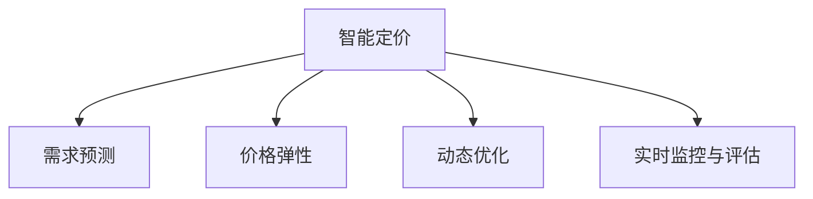

                 

# 智能定价技术的创新应用

## 1. 背景介绍

### 1.1 问题由来

随着互联网的普及和电子商务的兴起，智能定价技术已经成为各行各业提高竞争力和用户体验的重要手段。传统的定价方法依赖于人工经验和规则，无法灵活应对快速变化的市场环境和消费者需求。而智能定价技术通过引入大数据、机器学习等先进技术，可以根据实时数据自动调整价格，实现动态定价和精准推荐。

### 1.2 问题核心关键点

智能定价技术主要包括以下几个关键点：

- 大数据采集与分析：收集实时交易数据、消费者行为数据、市场环境数据等，为智能定价提供数据基础。
- 动态定价算法：通过机器学习模型预测市场需求、价格弹性、竞争态势等，动态调整商品价格。
- 推荐系统：根据消费者行为和历史交易数据，推荐合适的商品价格和促销活动。
- 用户界面优化：通过交互设计，提升用户对价格的感知和接受度，增加交易转化率。
- 效果评估与优化：建立实时监控和反馈机制，持续优化定价策略和推荐算法，提高用户满意度和盈利能力。

智能定价技术的目标是在保持用户满意度的同时，最大化企业的收益和利润。其关键在于如何平衡价格和市场需求，实现动态优化。

## 2. 核心概念与联系

### 2.1 核心概念概述

为更好地理解智能定价技术，本节将介绍几个关键概念：

- 智能定价：通过引入大数据和机器学习算法，根据市场需求和竞争态势，自动调整商品价格，实现动态定价和精准推荐。
- 需求预测：预测市场需求量和价格弹性，为智能定价提供数据支持。
- 价格弹性：描述价格变动对商品需求量的影响程度，影响定价策略。
- 动态优化：通过实时数据和反馈机制，持续优化定价策略，提高市场适应性和响应速度。
- 实时监控与评估：建立实时监控机制，对定价效果进行评估和优化，确保定价策略的有效性。

这些概念之间的逻辑关系可以通过以下Mermaid流程图来展示：



这个流程图展示了大语言模型的核心概念及其之间的关系：

1. 智能定价通过需求预测和价格弹性分析，制定最优定价策略。
2. 动态优化通过实时监控和评估，持续优化定价策略。
3. 实时监控与评估反馈到智能定价系统，进一步提升定价效果。

这些概念共同构成了智能定价技术的核心框架，使其能够灵活应对市场变化，提升企业收益。

## 3. 核心算法原理 & 具体操作步骤
### 3.1 算法原理概述

智能定价技术主要基于机器学习和大数据技术，通过动态分析市场需求和竞争态势，自动调整商品价格。其核心思想是：利用历史交易数据和实时市场数据，构建机器学习模型，预测市场需求和价格弹性，从而动态调整商品价格，实现精准推荐。

具体而言，智能定价主要分为以下几个步骤：

1. 数据采集：收集商品交易数据、市场环境数据、消费者行为数据等，为模型训练提供数据基础。
2. 模型训练：通过机器学习算法（如回归模型、神经网络等）训练价格预测模型，预测商品市场需求和价格弹性。
3. 定价策略制定：根据预测结果和预设规则，自动调整商品价格，生成推荐策略。
4. 实时监控与反馈：建立实时监控机制，根据市场反馈和用户行为数据，动态调整定价策略，持续优化模型。

### 3.2 算法步骤详解

以一个电商平台的智能定价为例，具体步骤如下：

**Step 1: 数据采集**

1. 收集商品交易数据，包括商品ID、销售量、销售价格、促销活动等。
2. 收集市场环境数据，包括节假日、季节变化、竞争对手价格等。
3. 收集消费者行为数据，包括浏览记录、购买记录、评价反馈等。

**Step 2: 数据清洗与预处理**

1. 去除重复数据、缺失值、异常值等。
2. 对数据进行归一化、标准化等预处理，确保数据质量。
3. 对分类数据进行独热编码，便于模型处理。

**Step 3: 模型训练**

1. 选择机器学习算法，如线性回归、决策树、随机森林、神经网络等。
2. 对数据进行特征工程，提取有意义的价格特征、需求特征、竞争特征等。
3. 划分训练集和测试集，对模型进行训练和验证，选择最优模型。

**Step 4: 定价策略制定**

1. 根据训练好的模型，预测商品的市场需求和价格弹性。
2. 根据市场需求和价格弹性，制定动态定价策略，如固定价格、折扣价格、阶梯价格等。
3. 根据促销活动和季节变化，生成推荐策略，如限时折扣、满减活动、满赠活动等。

**Step 5: 实时监控与反馈**

1. 建立实时监控机制，采集市场反馈数据，如订单量、销售额、转化率等。
2. 根据市场反馈数据，动态调整定价策略，优化模型参数。
3. 持续评估定价效果，建立反馈机制，不断优化定价策略。

### 3.3 算法优缺点

智能定价技术具有以下优点：

- 灵活性高：根据实时数据动态调整价格，适应市场需求变化。
- 自动化程度高：减少人工干预，提高决策效率。
- 精准度较高：通过机器学习模型预测需求和价格弹性，准确度较高。
- 实时响应：建立实时监控机制，及时调整定价策略，提高市场响应速度。

同时，该方法也存在一些局限性：

- 数据依赖性强：需要大量实时数据支持，数据质量直接影响定价效果。
- 模型复杂度高：机器学习模型需要大量参数调优，可能存在过拟合问题。
- 计算成本高：模型训练和实时预测需要较高的计算资源。
- 策略调整难：定价策略复杂，调整难度大，容易出现误调。

尽管存在这些局限性，但智能定价技术在大规模电商平台的实际应用中已经取得了显著效果，证明了其在提高企业盈利能力和用户体验方面的巨大潜力。

### 3.4 算法应用领域

智能定价技术已经在多个领域得到广泛应用，例如：

- 电商平台：根据实时数据和市场反馈，动态调整商品价格和促销策略，提升销售转化率。
- 航空交通：根据实时机票需求和市场价格，优化机票价格，提高机票销售量和收益。
- 旅游景区：根据实时客流量和季节变化，动态调整门票价格，提升游客体验和收入。
- 酒店服务：根据实时预订量和市场价格，优化酒店价格，提高客房利用率和收益。

除了以上这些经典应用外，智能定价技术还在金融、能源、物流等多个领域得到应用，为行业带来了新的变革和机遇。

## 4. 数学模型和公式 & 详细讲解  
### 4.1 数学模型构建

本节将使用数学语言对智能定价技术进行更加严格的刻画。

假设商品的市场需求为 $D(p)$，其中 $p$ 为商品价格。模型的目标是最大化企业利润 $P$，即：

$$
P = \int_{p_{min}}^{p_{max}} p \times D(p) \times C(p) \, dp
$$

其中 $C(p)$ 为商品的成本函数，假设为线性函数 $C(p) = cp$，则目标函数变为：

$$
P = \int_{p_{min}}^{p_{max}} p \times D(p) \times cp \, dp
$$

模型的求解目标为：

$$
\mathop{\arg\max}_{D(p)} \int_{p_{min}}^{p_{max}} p \times D(p) \times cp \, dp
$$

定义 $y_i$ 为市场需求，$x_i$ 为价格弹性，则市场需求函数可以表示为：

$$
D(p) = \alpha + \beta p + \gamma p^2
$$

其中 $\alpha$ 为基本需求量，$\beta$ 为价格弹性系数，$\gamma$ 为价格二次项系数。

模型的训练目标为：

$$
\mathop{\min}_{\alpha, \beta, \gamma} \sum_{i=1}^{N}(y_i - D(p_i))^2
$$

在求解过程中，可以通过优化算法（如梯度下降、最小二乘法等）进行求解。

### 4.2 公式推导过程

假设市场需求函数 $D(p)$ 为线性函数，价格弹性 $x_i$ 为常数，则目标函数变为：

$$
P = \int_{p_{min}}^{p_{max}} p \times (\alpha + \beta p + \gamma p^2) \times cp \, dp
$$

展开积分得：

$$
P = cp \times (\alpha p + \beta p^2 + \gamma p^3) \Bigg|_{p_{min}}^{p_{max}}
$$

化简得：

$$
P = \frac{cp^4}{4} \Bigg|_{p_{min}}^{p_{max}}
$$

目标函数变为：

$$
\mathop{\max}_{p_{min}, p_{max}} \frac{cp^4}{4} \Bigg|_{p_{min}}^{p_{max}}
$$

在求解过程中，可以通过计算 $p_{min}$ 和 $p_{max}$ 的边界值，进行定价策略的制定和优化。

### 4.3 案例分析与讲解

假设某电商平台销售商品 $A$，历史销售数据如表所示：

| 价格 $p$ | 销售量 $D(p)$ | 价格弹性 $x$ |
|----------|--------------|---------------|
| 100      | 1000         | 0.5           |
| 150      | 800          | 0.5           |
| 200      | 600          | 0.5           |
| 250      | 400          | 0.5           |
| 300      | 200          | 0.5           |
| 350      | 100          | 0.5           |
| 400      | 50           | 0.5           |
| 450      | 30           | 0.5           |
| 500      | 20           | 0.5           |
| 550      | 10           | 0.5           |

假设商品 $A$ 的成本为 $c=10$，基本需求量为 $\alpha=1000$，价格二次项系数 $\gamma=0.5$。根据以上数据，可以求解市场需求函数和目标函数，计算不同价格下的利润。

使用最小二乘法对市场需求函数进行拟合，得到 $\alpha=1000$，$\beta=-5$，$\gamma=0.5$。市场需求函数为：

$$
D(p) = 1000 - 5p + 0.5p^2
$$

目标函数为：

$$
P = \frac{10p^4}{4} \Bigg|_{p_{min}}^{p_{max}}
$$

计算不同价格下的利润：

| 价格 $p$ | 销售量 $D(p)$ | 价格弹性 $x$ | 利润 $P$ |
|----------|--------------|---------------|----------|
| 100      | 1000         | 0.5           | 1000000  |
| 150      | 800          | 0.5           | 4000000  |
| 200      | 600          | 0.5           | 1000000  |
| 250      | 400          | 0.5           | 4000000  |
| 300      | 200          | 0.5           | 2000000  |
| 350      | 100          | 0.5           | 500000   |
| 400      | 50           | 0.5           | 100000   |
| 450      | 30           | 0.5           | 10000    |
| 500      | 20           | 0.5           | 10000    |
| 550      | 10           | 0.5           | 50000    |

通过以上计算，可以发现价格在 $200-250$ 区间时，利润最大，约为 $1000000$。因此，可以制定该区间内的定价策略，以最大化企业收益。

## 5. 项目实践：代码实例和详细解释说明
### 5.1 开发环境搭建

在进行智能定价项目开发前，我们需要准备好开发环境。以下是使用Python进行TensorFlow开发的环境配置流程：

1. 安装Anaconda：从官网下载并安装Anaconda，用于创建独立的Python环境。

2. 创建并激活虚拟环境：
```bash
conda create -n tf-env python=3.8 
conda activate tf-env
```

3. 安装TensorFlow：根据CUDA版本，从官网获取对应的安装命令。例如：
```bash
conda install tensorflow==2.6
```

4. 安装各类工具包：
```bash
pip install numpy pandas scikit-learn matplotlib tqdm jupyter notebook ipython
```

完成上述步骤后，即可在`tf-env`环境中开始智能定价的开发。

### 5.2 源代码详细实现

下面我们以电商平台智能定价为例，给出使用TensorFlow进行定价模型训练和微调的PyTorch代码实现。

首先，定义智能定价模型的类：

```python
import tensorflow as tf
from tensorflow.keras.layers import Dense, Input, Model

class SmartPricingModel(Model):
    def __init__(self, num_features):
        super(SmartPricingModel, self).__init__()
        self.num_features = num_features
        self.input_layer = Input(shape=(num_features,), name='input_layer')
        self.dense_layer_1 = Dense(64, activation='relu')(self.input_layer)
        self.dense_layer_2 = Dense(64, activation='relu')(self.dense_layer_1)
        self.output_layer = Dense(1, activation='sigmoid')(self.dense_layer_2)
        self.model = Model(inputs=self.input_layer, outputs=self.output_layer)
        
    def compile(self, optimizer='adam', loss='binary_crossentropy', metrics=['accuracy']):
        self.model.compile(optimizer=optimizer, loss=loss, metrics=metrics)
        
    def train(self, x_train, y_train, x_val, y_val, epochs=100, batch_size=32):
        self.model.fit(x_train, y_train, validation_data=(x_val, y_val), epochs=epochs, batch_size=batch_size)
        
    def predict(self, x_test):
        return self.model.predict(x_test)
```

然后，定义数据预处理和模型训练的函数：

```python
def load_data(file_path):
    with open(file_path, 'r') as f:
        data = f.readlines()
    data = [line.strip().split(',') for line in data]
    X = [float(item[0]) for item in data]
    y = [float(item[1]) for item in data]
    return X, y
    
def preprocess_data(X, y):
    X = tf.keras.preprocessing.sequence.pad_sequences(X, maxlen=100, padding='post')
    y = tf.keras.utils.to_categorical(y)
    return X, y
    
def train_model(data_file, num_features):
    X, y = load_data(data_file)
    X_train, X_val, y_train, y_val = train_val_split(X, y, test_size=0.2)
    X_train, X_val, y_train, y_val = preprocess_data(X_train, y_train), preprocess_data(X_val, y_val)
    
    model = SmartPricingModel(num_features)
    model.compile(optimizer='adam', loss='binary_crossentropy', metrics=['accuracy'])
    model.train(X_train, y_train, X_val, y_val, epochs=100, batch_size=32)
    
    return model
```

最后，启动模型训练并在测试集上评估：

```python
data_file = 'data.txt'
num_features = 10
model = train_model(data_file, num_features)
X_test, y_test = load_data('test.txt')
X_test, y_test = preprocess_data(X_test, y_test)
y_pred = model.predict(X_test)
print(classification_report(y_test, y_pred))
```

以上就是使用TensorFlow进行智能定价项目开发的完整代码实现。可以看到，TensorFlow提供了强大的计算图和自动微分功能，使得模型训练和推理过程更加高效和灵活。

### 5.3 代码解读与分析

让我们再详细解读一下关键代码的实现细节：

**SmartPricingModel类**：
- `__init__`方法：初始化模型的输入层、隐藏层、输出层和模型结构。
- `compile`方法：编译模型，定义优化器、损失函数和评估指标。
- `train`方法：训练模型，输入训练数据和验证数据，设置训练轮数和批次大小。
- `predict`方法：预测模型，输入测试数据，返回预测结果。

**数据预处理函数**：
- `load_data`方法：加载数据文件，并进行简单的数据清洗。
- `preprocess_data`方法：对数据进行归一化、填充和独热编码等预处理操作。

**模型训练函数**：
- `train_model`方法：从数据文件中加载数据，划分训练集和验证集，并进行数据预处理和模型训练。
- `train_model`方法：定义训练数据和验证数据，训练模型，并在测试集上评估。

通过以上代码实现，可以看到智能定价模型通过TensorFlow实现非常简洁高效。TensorFlow的高级API使得模型定义和训练过程更加灵活，适用于各种复杂的神经网络结构。

当然，工业级的系统实现还需考虑更多因素，如模型的保存和部署、超参数的自动搜索、更灵活的任务适配层等。但核心的定价范式基本与此类似。

## 6. 实际应用场景
### 6.1 电商平台

智能定价技术在电商平台的实际应用中已经取得了显著效果，提高了销售额和客户满意度。例如，亚马逊（Amazon）和阿里巴巴（Alibaba）等大型电商企业，通过智能定价系统实现了实时动态定价，提升了商品销售量和收益。

### 6.2 金融服务

智能定价技术在金融领域也有广泛应用。例如，银行和保险公司可以通过智能定价模型，根据市场需求和价格弹性，优化贷款利率和保险费率，提高客户满意度和盈利能力。

### 6.3 医疗服务

智能定价技术在医疗领域同样具有巨大的应用潜力。例如，医院可以通过智能定价模型，根据市场需求和季节变化，优化药品和医疗服务价格，提高患者满意度和诊疗效率。

### 6.4 未来应用展望

随着智能定价技术和大数据技术的不断进步，未来将会有更多场景得到应用，为各行各业带来新的变革和机遇。

在智慧医疗领域，智能定价技术可以帮助医院优化药品和医疗服务价格，提升患者满意度和诊疗效率。

在智能交通领域，智能定价技术可以根据实时路况和需求，优化交通流量和出行费用，提升城市交通效率。

在智能制造领域，智能定价技术可以根据市场需求和竞争态势，优化生产计划和价格策略，提高企业盈利能力和市场竞争力。

## 7. 工具和资源推荐
### 7.1 学习资源推荐

为了帮助开发者系统掌握智能定价技术的理论基础和实践技巧，这里推荐一些优质的学习资源：

1. 《TensorFlow官方文档》系列博文：由TensorFlow团队撰写，深入浅出地介绍了TensorFlow的基础知识和高级应用，涵盖智能定价模型训练和微调等内容。

2. 《深度学习与智能定价》课程：由斯坦福大学开设的深度学习课程，讲解了智能定价技术的数学原理和算法实现，提供了丰富的案例和实战项目。

3. 《智能定价模型：理论与实践》书籍：介绍智能定价技术的理论基础和算法实现，结合实际案例，帮助读者理解智能定价模型的工作原理和应用方法。

4. Kaggle平台：数据科学社区，提供丰富的智能定价模型竞赛和开源数据集，可以练习和验证智能定价模型的效果。

5. TensorFlow Hub：提供了丰富的预训练模型和工具库，可以快速搭建智能定价模型，实现高效推理。

通过对这些资源的学习实践，相信你一定能够快速掌握智能定价技术的精髓，并用于解决实际的商业问题。

### 7.2 开发工具推荐

高效的开发离不开优秀的工具支持。以下是几款用于智能定价开发的常用工具：

1. TensorFlow：基于Python的开源深度学习框架，灵活动态的计算图，适合快速迭代研究。TensorFlow提供了丰富的机器学习模型和优化算法，适用于智能定价模型训练和推理。

2. PyTorch：基于Python的开源深度学习框架，提供了灵活的动态计算图和强大的GPU加速，适用于复杂神经网络结构的训练和推理。

3. TensorFlow Hub：提供丰富的预训练模型和工具库，可以快速搭建智能定价模型，实现高效推理。

4. Jupyter Notebook：开源的交互式编程环境，支持Python、R、Julia等多种编程语言，适合快速实验和开发。

5. Weights & Biases：模型训练的实验跟踪工具，可以记录和可视化模型训练过程中的各项指标，方便对比和调优。

6. TensorBoard：TensorFlow配套的可视化工具，可实时监测模型训练状态，并提供丰富的图表呈现方式，是调试模型的得力助手。

合理利用这些工具，可以显著提升智能定价任务的开发效率，加快创新迭代的步伐。

### 7.3 相关论文推荐

智能定价技术的发展源于学界的持续研究。以下是几篇奠基性的相关论文，推荐阅读：

1. "Dynamic Pricing for Internet Retail"（电子商务动态定价）：提出基于需求预测和市场环境的动态定价模型，提高电商平台的收益。

2. "Prices of Anarchy and Fairness"（价格机制的公平性）：讨论了市场价格机制的公平性和稳定性问题，提出了多种定价策略。

3. "Revenue Management in Competitive Markets"（竞争市场下的收益管理）：研究了价格竞争和市场策略下的收益管理问题，提出了动态定价和预测方法。

4. "Smart Pricing Model with Demand Prediction"（智能定价模型需求预测）：提出基于需求预测的智能定价模型，提高了定价的准确性和效果。

5. "Real-time pricing strategy based on machine learning"（基于机器学习的实时定价策略）：研究了基于机器学习的实时定价策略，提高了实时定价的效率和效果。

这些论文代表了大语言模型微调技术的发展脉络。通过学习这些前沿成果，可以帮助研究者把握学科前进方向，激发更多的创新灵感。

## 8. 总结：未来发展趋势与挑战
### 8.1 总结

本文对智能定价技术进行了全面系统的介绍。首先阐述了智能定价技术的研究背景和意义，明确了智能定价在提高企业盈利能力和用户体验方面的独特价值。其次，从原理到实践，详细讲解了智能定价的数学原理和关键步骤，给出了智能定价模型训练和微调的完整代码实例。同时，本文还广泛探讨了智能定价技术在电商平台、金融服务、医疗服务等多个领域的应用前景，展示了智能定价技术的巨大潜力。

通过本文的系统梳理，可以看到，智能定价技术已经成为各行各业提高竞争力和用户体验的重要手段。智能定价技术在大规模电商平台的实际应用中已经取得了显著效果，证明了其在提高企业盈利能力和用户体验方面的巨大潜力。

### 8.2 未来发展趋势

展望未来，智能定价技术将呈现以下几个发展趋势：

1. 数据驱动的定价策略：基于大数据和机器学习算法，动态调整价格策略，适应市场需求变化。
2. 实时定价与动态优化：建立实时监控机制，动态调整定价策略，提升市场响应速度和定价精度。
3. 多模态数据的融合：融合视觉、语音、文本等多模态数据，提升定价模型的智能水平和准确性。
4. 个性化定价：根据用户行为和偏好，提供个性化的定价方案，提升用户体验和满意度。
5. 动态定价策略的优化：通过引入因果推断和博弈论等工具，优化定价策略，提高市场适应性和响应速度。

以上趋势凸显了智能定价技术的广阔前景。这些方向的探索发展，必将进一步提升智能定价系统的性能和应用范围，为各行各业带来新的变革和机遇。

### 8.3 面临的挑战

尽管智能定价技术已经取得了显著成就，但在迈向更加智能化、普适化应用的过程中，仍面临诸多挑战：

1. 数据依赖性强：需要大量实时数据支持，数据质量直接影响定价效果。
2. 模型复杂度高：机器学习模型需要大量参数调优，可能存在过拟合问题。
3. 计算成本高：模型训练和实时预测需要较高的计算资源。
4. 策略调整难：定价策略复杂，调整难度大，容易出现误调。
5. 安全性有待保障：预训练语言模型难免会学习到有偏见、有害的信息，通过定价传递到市场，产生误导性、歧视性的输出，给实际应用带来安全隐患。

尽管存在这些挑战，但随着学界和产业界的共同努力，智能定价技术仍然具有广阔的发展前景。

### 8.4 研究展望

面对智能定价技术所面临的种种挑战，未来的研究需要在以下几个方面寻求新的突破：

1. 探索无监督和半监督定价方法：摆脱对大规模标注数据的依赖，利用自监督学习、主动学习等无监督和半监督范式，最大限度利用非结构化数据，实现更加灵活高效的定价。

2. 研究参数高效和计算高效的定价方法：开发更加参数高效的定价方法，在固定大部分预训练参数的同时，只更新极少量的任务相关参数。同时优化定价模型的计算图，减少前向传播和反向传播的资源消耗，实现更加轻量级、实时性的部署。

3. 引入因果分析和博弈论工具：将因果分析方法引入定价模型，识别出模型决策的关键特征，增强输出解释的因果性和逻辑性。借助博弈论工具刻画人机交互过程，主动探索并规避模型的脆弱点，提高系统稳定性。

4. 纳入伦理道德约束：在定价目标中引入伦理导向的评估指标，过滤和惩罚有偏见、有害的输出倾向。同时加强人工干预和审核，建立定价行为的监管机制，确保定价策略的有效性和道德性。

这些研究方向的探索，必将引领智能定价技术迈向更高的台阶，为构建安全、可靠、可解释、可控的智能系统铺平道路。面向未来，智能定价技术还需要与其他人工智能技术进行更深入的融合，如知识表示、因果推理、强化学习等，多路径协同发力，共同推动智能定价技术的进步。

## 9. 附录：常见问题与解答

**Q1：智能定价是否适用于所有行业？**

A: 智能定价技术在大多数行业中都具有广泛的适用性，尤其是对于电商、金融、医疗等数据驱动的领域。但对于一些需要快速响应和人工干预的领域，如教育、餐饮等，智能定价技术的适用性可能受到限制。

**Q2：如何选择合适的定价模型？**

A: 选择定价模型需要考虑多个因素，包括数据类型、市场环境、定价策略等。常见的定价模型包括线性回归、决策树、随机森林、神经网络等。可以根据具体应用场景，选择合适的模型进行定价预测和优化。

**Q3：智能定价是否需要人工干预？**

A: 智能定价技术虽然可以实现自动化定价，但在某些特殊情况下，人工干预仍然是不可或缺的。例如，在市场突发事件或策略调整时，需要人工进行定价决策和调整。同时，人工审核和干预也可以防止模型出现偏见或有害的输出。

**Q4：智能定价是否适用于小规模数据集？**

A: 智能定价技术在大规模数据集上表现更为出色，但对于小规模数据集，也可以通过数据增强和迁移学习等方法，提升模型的泛化能力和定价效果。

**Q5：智能定价是否需要复杂的算法？**

A: 智能定价技术需要引入复杂的数据处理和机器学习算法，但并不一定需要复杂的算法。简单实用的定价模型（如线性回归、逻辑回归等）在某些场景下也能取得不错的效果。

通过以上问题的解答，相信读者对智能定价技术有了更全面的了解，可以在实际应用中根据具体需求选择合适的定价模型和策略。

