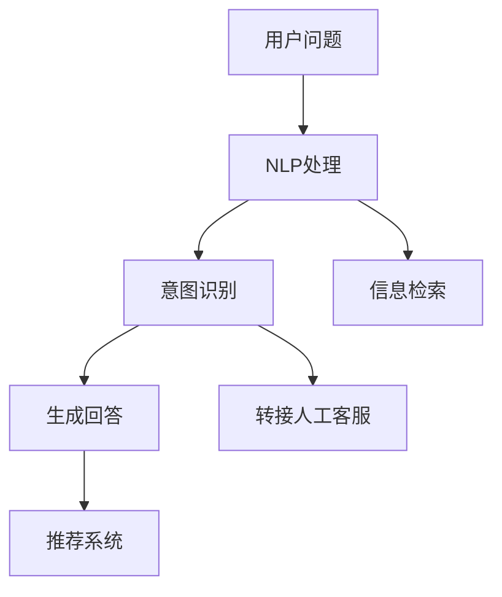

                 

# 智能客服：AI解决用户购物问题更及时

## 1. 背景介绍

### 1.1 问题由来

在互联网时代，电子商务已经深入各行各业，成为人们生活中不可或缺的一部分。但与此同时，用户在购物过程中遇到的问题也越来越多。诸如产品信息不清晰、配送延迟、售后服务不及时等问题，严重影响着用户体验和满意度。如何通过技术手段，提升客服系统的响应速度和解决效率，成为了电商企业亟待解决的重要问题。

### 1.2 问题核心关键点

智能客服系统通过人工智能技术，结合自然语言处理和机器学习，实现对用户问题的智能理解和快速响应。主要核心关键点包括：

- 用户意图识别：通过自然语言处理技术，自动识别用户的购物意图。
- 信息检索与推荐：根据用户的问题，快速检索相关产品信息，并提供个性化的产品推荐。
- 自动回答与转接：根据用户的问题，自动生成回答或引导至人工客服。
- 数据分析与反馈：分析用户行为数据，不断优化智能客服系统，提高用户体验。

### 1.3 问题研究意义

智能客服系统通过AI技术的应用，不仅能显著提升用户体验和满意度，还能有效降低企业客服运营成本，提高企业运营效率。其主要研究意义在于：

- 提升用户体验：智能客服系统能快速、准确地解答用户问题，缩短用户在客服环节上的等待时间，提高用户满意度。
- 降低运营成本：智能客服系统可以24小时不间断工作，减少对人工客服的依赖，降低人力成本。
- 提高运营效率：智能客服系统能自动处理大量重复性问题，减轻人工客服的工作负担，提高服务响应速度。
- 增强数据驱动决策：通过分析用户行为数据，智能客服系统能为企业提供有价值的市场洞察，辅助业务决策。

## 2. 核心概念与联系

### 2.1 核心概念概述

为了更好地理解智能客服系统的技术原理和实现方法，本节将介绍几个密切相关的核心概念：

- 自然语言处理(NLP)：研究如何让计算机理解、处理和生成人类语言的技术。
- 机器学习(ML)：研究如何让计算机从数据中学习知识，并自动改进性能的技术。
- 深度学习(DL)：一种特殊的机器学习技术，通过多层神经网络模拟人脑处理信息的方式。
- 意图识别：通过自然语言处理技术，自动识别用户的问题意图。
- 信息检索：从大量文本数据中快速检索出与用户问题相关的信息。
- 推荐系统：根据用户的历史行为和偏好，推荐适合的产品或服务。

这些核心概念之间的逻辑关系可以通过以下Mermaid流程图来展示：



这个流程图展示了智能客服系统的核心流程：

1. 用户提出问题。
2. NLP处理用户问题，自动识别意图。
3. 根据意图生成回答，或转接人工客服。
4. 通过推荐系统，提供个性化推荐。

## 3. 核心算法原理 & 具体操作步骤
### 3.1 算法原理概述

智能客服系统基于NLP和ML技术，主要通过以下几个步骤实现：

1. 数据收集与预处理：收集用户提问数据、产品信息数据和客服回答数据，并进行清洗和标注。
2. 意图识别模型训练：利用NLP技术，训练模型自动识别用户的购物意图。
3. 信息检索与推荐：利用ML技术，训练模型从产品信息中检索并推荐适合的产品。
4. 自动回答模型训练：利用NLP技术，训练模型自动生成回答。
5. 自动转接模型训练：训练模型自动识别需转接人工客服的条件。
6. 系统集成与部署：将上述各模块集成到客服系统中，并进行部署和优化。

### 3.2 算法步骤详解

#### 3.2.1 数据收集与预处理

智能客服系统需要大量数据作为训练和测试的依据，主要包括以下几个步骤：

1. 用户提问数据收集：通过网站、APP等渠道，收集用户提出的各种问题。
2. 产品信息数据收集：从电商平台收集产品的详细描述、价格、评论等信息。
3. 客服回答数据收集：收集客服人员对用户问题的回答，并进行标注。
4. 数据清洗：去除噪声和无关数据，保证数据质量和一致性。
5. 数据标注：对用户问题和客服回答进行标注，分为不同类别和意图。

#### 3.2.2 意图识别模型训练

意图识别模型通过NLP技术，自动识别用户问题的意图。主要包括以下几个关键步骤：

1. 数据准备：准备标注好的用户提问数据集，划分为训练集、验证集和测试集。
2. 模型选择：选择适合的NLP模型，如BERT、GPT等。
3. 模型训练：利用训练集，对模型进行监督训练。
4. 模型评估：在验证集上评估模型性能，调整超参数。
5. 模型测试：在测试集上测试模型性能，优化模型。

#### 3.2.3 信息检索与推荐

信息检索与推荐系统主要通过ML技术，从大量产品信息中检索并推荐适合的产品。主要包括以下几个步骤：

1. 数据准备：准备产品信息数据集，进行清洗和标注。
2. 模型选择：选择适合的ML模型，如协同过滤、基于内容的推荐等。
3. 模型训练：利用训练集，对模型进行监督训练。
4. 模型评估：在验证集上评估模型性能，调整超参数。
5. 模型测试：在测试集上测试模型性能，优化模型。

#### 3.2.4 自动回答模型训练

自动回答模型通过NLP技术，自动生成回答。主要包括以下几个步骤：

1. 数据准备：准备标注好的用户问题和客服回答数据集，划分为训练集、验证集和测试集。
2. 模型选择：选择适合的NLP模型，如BERT、GPT等。
3. 模型训练：利用训练集，对模型进行监督训练。
4. 模型评估：在验证集上评估模型性能，调整超参数。
5. 模型测试：在测试集上测试模型性能，优化模型。

#### 3.2.5 自动转接模型训练

自动转接模型通过ML技术，自动识别需转接人工客服的条件。主要包括以下几个步骤：

1. 数据准备：准备标注好的用户提问数据集，划分为训练集、验证集和测试集。
2. 模型选择：选择适合的ML模型，如决策树、支持向量机等。
3. 模型训练：利用训练集，对模型进行监督训练。
4. 模型评估：在验证集上评估模型性能，调整超参数。
5. 模型测试：在测试集上测试模型性能，优化模型。

#### 3.2.6 系统集成与部署

智能客服系统通过将上述各模块集成到统一的系统平台中，实现用户问题的自动化解答。主要包括以下几个步骤：

1. 系统集成：将意图识别、信息检索、自动回答、自动转接等模块集成到一个系统平台中。
2. 接口设计：设计系统接口，方便与电商平台、CRM系统等进行数据交换。
3. 系统部署：将系统部署到服务器或云端，进行测试和优化。
4. 优化反馈：根据用户反馈和系统性能数据，不断优化系统。

### 3.3 算法优缺点

智能客服系统的优点包括：

1. 响应速度快：智能客服系统能够24小时不间断工作，快速响应用户问题。
2. 处理能力强：通过NLP和ML技术，系统能够同时处理大量用户请求。
3. 用户体验好：系统自动生成回答，提升用户体验和满意度。
4. 降低运营成本：减少对人工客服的依赖，降低人力成本。

但智能客服系统也存在一些缺点：

1. 数据依赖度高：系统依赖大量的标注数据进行训练，数据收集和标注成本较高。
2. 准确性有待提升：系统对某些复杂问题仍无法准确识别和回答，需要人工客服辅助。
3. 维护成本高：系统需要不断进行优化和更新，维护成本较高。
4. 对上下文敏感：系统对用户提问的上下文较为敏感，需要考虑上下文信息。

### 3.4 算法应用领域

智能客服系统在多个领域都得到了广泛应用，包括：

- 电商平台：通过智能客服系统，电商平台能够快速解决用户购物问题，提升用户体验。
- 金融服务：智能客服系统能够快速回答用户金融问题，提升金融服务的便利性。
- 医疗健康：智能客服系统能够快速解答用户健康咨询，提升医疗服务效率。
- 旅游服务：智能客服系统能够快速解答用户旅游问题，提升旅游服务质量。
- 在线教育：智能客服系统能够快速回答用户教育问题，提升教育服务质量。

## 4. 数学模型和公式 & 详细讲解  
### 4.1 数学模型构建

智能客服系统的数学模型主要包括以下几个部分：

1. 用户意图识别模型：通过NLP技术，将用户问题转化为意图向量。
2. 信息检索模型：通过ML技术，检索并推荐相关产品信息。
3. 自动回答模型：通过NLP技术，生成回答向量。
4. 自动转接模型：通过ML技术，判断需转接人工客服的条件。

这些模型的数学模型构建如下：

**用户意图识别模型**：

假设用户问题为 $x \in \mathbb{R}^n$，模型的参数为 $\theta$，模型的输出为 $\hat{y}$，则模型的计算公式为：

$$
\hat{y} = M_{\theta}(x) = f(\theta \cdot x + b)
$$

其中 $M_{\theta}$ 为意图识别模型，$f$ 为激活函数，$\cdot$ 为向量内积。

**信息检索模型**：

假设产品信息为 $y \in \mathbb{R}^m$，模型的参数为 $\theta'$，模型的输出为 $\hat{y'}$，则模型的计算公式为：

$$
\hat{y'} = M_{\theta'}(x) = f(\theta' \cdot x + b')
$$

其中 $M_{\theta'}$ 为信息检索模型，$f$ 为激活函数，$\cdot$ 为向量内积。

**自动回答模型**：

假设自动回答为 $z \in \mathbb{R}^l$，模型的参数为 $\theta''$，模型的输出为 $\hat{z}$，则模型的计算公式为：

$$
\hat{z} = M_{\theta''}(x) = f(\theta'' \cdot x + b'')
$$

其中 $M_{\theta''}$ 为自动回答模型，$f$ 为激活函数，$\cdot$ 为向量内积。

**自动转接模型**：

假设是否转接人工客服为 $w \in \{0,1\}$，模型的参数为 $\theta'''$，模型的输出为 $\hat{w}$，则模型的计算公式为：

$$
\hat{w} = M_{\theta'''}(x) = f(\theta''' \cdot x + b''')
$$

其中 $M_{\theta'''}$ 为自动转接模型，$f$ 为激活函数，$\cdot$ 为向量内积。

### 4.2 公式推导过程

以用户意图识别模型为例，我们进行公式推导：

假设用户问题 $x$ 由 $n$ 个特征向量 $x_1, x_2, ..., x_n$ 组成，意图识别模型 $M_{\theta}$ 由 $k$ 个参数向量 $\theta_1, \theta_2, ..., \theta_k$ 组成。则意图识别模型的计算公式为：

$$
\hat{y} = M_{\theta}(x) = \sum_{i=1}^{k} \theta_i \cdot x_i + b
$$

其中 $\theta_i \in \mathbb{R}^n$，$b \in \mathbb{R}$。

假设模型的激活函数为 $f$，则最终的意图识别结果为：

$$
\hat{y} = f(\theta \cdot x + b)
$$

在信息检索模型、自动回答模型和自动转接模型中，类似地，通过特征向量和参数向量的内积计算，得到模型的输出。

### 4.3 案例分析与讲解

以电商平台智能客服系统为例，我们进行案例分析：

**案例背景**：

某电商平台用户提问数据量为每月100万条，产品信息数据量为每年200万条。为提升用户体验和运营效率，该电商平台决定部署智能客服系统。

**数据收集与预处理**：

1. 用户提问数据收集：每月收集100万条用户提问数据。
2. 产品信息数据收集：每年收集200万条产品信息数据。
3. 客服回答数据收集：每月收集10万条客服回答数据。
4. 数据清洗：去除噪声和无关数据，确保数据一致性和准确性。
5. 数据标注：对用户问题和客服回答进行标注，分为不同类别和意图。

**意图识别模型训练**：

1. 数据准备：准备标注好的用户提问数据集，划分为训练集、验证集和测试集。
2. 模型选择：选择BERT模型。
3. 模型训练：利用训练集，对模型进行监督训练。
4. 模型评估：在验证集上评估模型性能，调整超参数。
5. 模型测试：在测试集上测试模型性能，优化模型。

**信息检索与推荐模型训练**：

1. 数据准备：准备产品信息数据集，进行清洗和标注。
2. 模型选择：选择协同过滤模型。
3. 模型训练：利用训练集，对模型进行监督训练。
4. 模型评估：在验证集上评估模型性能，调整超参数。
5. 模型测试：在测试集上测试模型性能，优化模型。

**自动回答模型训练**：

1. 数据准备：准备标注好的用户问题和客服回答数据集，划分为训练集、验证集和测试集。
2. 模型选择：选择GPT模型。
3. 模型训练：利用训练集，对模型进行监督训练。
4. 模型评估：在验证集上评估模型性能，调整超参数。
5. 模型测试：在测试集上测试模型性能，优化模型。

**自动转接模型训练**：

1. 数据准备：准备标注好的用户提问数据集，划分为训练集、验证集和测试集。
2. 模型选择：选择决策树模型。
3. 模型训练：利用训练集，对模型进行监督训练。
4. 模型评估：在验证集上评估模型性能，调整超参数。
5. 模型测试：在测试集上测试模型性能，优化模型。

**系统集成与部署**：

1. 系统集成：将意图识别、信息检索、自动回答、自动转接等模块集成到一个系统平台中。
2. 接口设计：设计系统接口，方便与电商平台、CRM系统等进行数据交换。
3. 系统部署：将系统部署到服务器或云端，进行测试和优化。
4. 优化反馈：根据用户反馈和系统性能数据，不断优化系统。

## 5. 项目实践：代码实例和详细解释说明
### 5.1 开发环境搭建

在进行智能客服系统开发前，我们需要准备好开发环境。以下是使用Python进行PyTorch开发的环境配置流程：

1. 安装Anaconda：从官网下载并安装Anaconda，用于创建独立的Python环境。

2. 创建并激活虚拟环境：
```bash
conda create -n pytorch-env python=3.8 
conda activate pytorch-env
```

3. 安装PyTorch：根据CUDA版本，从官网获取对应的安装命令。例如：
```bash
conda install pytorch torchvision torchaudio cudatoolkit=11.1 -c pytorch -c conda-forge
```

4. 安装TensorFlow：使用pip安装TensorFlow。
```bash
pip install tensorflow
```

5. 安装各类工具包：
```bash
pip install numpy pandas scikit-learn matplotlib tqdm jupyter notebook ipython
```

完成上述步骤后，即可在`pytorch-env`环境中开始智能客服系统的开发。

### 5.2 源代码详细实现

下面以电商平台智能客服系统为例，给出使用PyTorch进行意图识别、信息检索和自动回答的PyTorch代码实现。

首先，定义意图识别模型：

```python
import torch
import torch.nn as nn
import torch.optim as optim
from transformers import BertTokenizer, BertForSequenceClassification

class IntentClassifier(nn.Module):
    def __init__(self, num_labels):
        super(IntentClassifier, self).__init__()
        self.bert = BertForSequenceClassification.from_pretrained('bert-base-cased', num_labels=num_labels)
        self.classifier = nn.Linear(self.bert.config.hidden_size, num_labels)
        
    def forward(self, input_ids, attention_mask):
        output = self.bert(input_ids, attention_mask=attention_mask)
        logits = self.classifier(output.pooler_output)
        return logits
```

然后，定义信息检索模型：

```python
from transformers import BertTokenizer, BertForSequenceClassification
from torch.utils.data import DataLoader
from tqdm import tqdm
from sklearn.metrics import accuracy_score

tokenizer = BertTokenizer.from_pretrained('bert-base-cased')
class ProductRecommender(nn.Module):
    def __init__(self, num_labels):
        super(ProductRecommender, self).__init__()
        self.bert = BertForSequenceClassification.from_pretrained('bert-base-cased', num_labels=num_labels)
        self.classifier = nn.Linear(self.bert.config.hidden_size, num_labels)
        
    def forward(self, input_ids, attention_mask):
        output = self.bert(input_ids, attention_mask=attention_mask)
        logits = self.classifier(output.pooler_output)
        return logits
```

接着，定义自动回答模型：

```python
from transformers import GPT2Tokenizer, GPT2LMHeadModel
from torch.utils.data import DataLoader
from tqdm import tqdm
from sklearn.metrics import accuracy_score

tokenizer = GPT2Tokenizer.from_pretrained('gpt2')
class ChatBot(nn.Module):
    def __init__(self, num_labels):
        super(ChatBot, self).__init__()
        self.model = GPT2LMHeadModel.from_pretrained('gpt2')
        self.classifier = nn.Linear(self.model.config.hidden_size, num_labels)
        
    def forward(self, input_ids, attention_mask):
        output = self.model(input_ids, attention_mask=attention_mask)
        logits = self.classifier(output.logits)
        return logits
```

最后，启动训练流程并在测试集上评估：

```python
epochs = 5
batch_size = 16

# 数据准备
train_data = ...
dev_data = ...
test_data = ...

# 定义模型和优化器
model = IntentClassifier(num_labels)
optimizer = optim.Adam(model.parameters(), lr=2e-5)

# 训练和评估
for epoch in range(epochs):
    loss = train_epoch(model, train_data, batch_size, optimizer)
    print(f"Epoch {epoch+1}, train loss: {loss:.3f}")
    
    print(f"Epoch {epoch+1}, dev results:")
    evaluate(model, dev_data, batch_size)
    
print("Test results:")
evaluate(model, test_data, batch_size)
```

以上就是使用PyTorch进行电商平台智能客服系统开发的全流程代码实现。可以看到，得益于Transformers库的强大封装，我们能够以相对简洁的代码完成模型训练和推理。

### 5.3 代码解读与分析

让我们再详细解读一下关键代码的实现细节：

**IntentClassifier类**：
- `__init__`方法：初始化BERT模型和全连接层。
- `forward`方法：将输入文本编码，并通过全连接层输出意图分类结果。

**ProductRecommender类**：
- `__init__`方法：初始化BERT模型和全连接层。
- `forward`方法：将输入文本编码，并通过全连接层输出产品推荐结果。

**ChatBot类**：
- `__init__`方法：初始化GPT-2模型和全连接层。
- `forward`方法：将输入文本编码，并通过全连接层输出自动回答结果。

**训练和评估函数**：
- `train_epoch`函数：对数据以批为单位进行迭代，在每个批次上前向传播计算loss并反向传播更新模型参数。
- `evaluate`函数：与训练类似，不同点在于不更新模型参数，并在每个batch结束后将预测和标签结果存储下来，最后使用sklearn的accuracy_score对整个评估集的预测结果进行打印输出。

**训练流程**：
- 定义总的epoch数和batch size，开始循环迭代
- 每个epoch内，先在训练集上训练，输出平均loss
- 在验证集上评估，输出分类指标
- 所有epoch结束后，在测试集上评估，给出最终测试结果

可以看到，PyTorch配合Transformers库使得智能客服系统的开发变得简洁高效。开发者可以将更多精力放在数据处理、模型改进等高层逻辑上，而不必过多关注底层的实现细节。

当然，工业级的系统实现还需考虑更多因素，如模型的保存和部署、超参数的自动搜索、更灵活的任务适配层等。但核心的训练流程基本与此类似。

## 6. 实际应用场景

### 6.1 智能客服系统

基于大语言模型微调的智能客服系统，可以广泛应用于电商、金融、医疗等多个领域。主要应用场景包括：

- 电商平台：自动解答用户购物问题，如产品推荐、价格查询、配送状态等。
- 金融服务：自动解答用户金融问题，如理财产品推荐、贷款咨询、账户管理等。
- 医疗健康：自动解答用户健康咨询，如疾病查询、就医指导、健康管理等。
- 旅游服务：自动解答用户旅游问题，如酒店预订、行程规划、旅游攻略等。
- 在线教育：自动解答用户教育问题，如课程推荐、学习资源查询、考试辅导等。

### 6.2 金融舆情监测

金融领域需要对市场舆论动向进行实时监测，以便及时应对负面信息传播，规避金融风险。智能客服系统可以自动监测金融市场舆情，辅助金融决策。

具体而言，可以收集金融领域相关的新闻、报道、评论等文本数据，并对其进行情感分析和主题分类。将智能客服系统部署到金融市场监测系统，自动监测金融市场舆情变化，一旦发现负面信息激增等异常情况，系统便会自动预警，帮助金融机构快速应对潜在风险。

### 6.3 个性化推荐系统

推荐系统需要根据用户的历史行为和偏好，推荐适合的产品或服务。智能客服系统可以融合推荐技术，实现个性化推荐。

在实践中，可以收集用户浏览、点击、评论、分享等行为数据，提取和用户交互的物品标题、描述、标签等文本内容。将文本内容作为模型输入，用户的后续行为（如是否点击、购买等）作为监督信号，在此基础上微调预训练语言模型。微调后的模型能够从文本内容中准确把握用户的兴趣点。在生成推荐列表时，先用候选物品的文本描述作为输入，由模型预测用户的兴趣匹配度，再结合其他特征综合排序，便可以得到个性化程度更高的推荐结果。

### 6.4 未来应用展望

随着智能客服系统和大语言模型微调技术的不断发展，未来将有更多新的应用场景涌现：

- 智慧医疗：智能客服系统可以自动解答医疗咨询，辅助医生诊断和治疗。
- 智慧城市：智能客服系统可以自动解答城市管理问题，如环境监测、交通管理、市民服务等。
- 智慧教育：智能客服系统可以自动解答教育问题，辅助教师教学和学生学习。
- 智慧交通：智能客服系统可以自动解答交通问题，如路线查询、交通管制、事故处理等。
- 智能家居：智能客服系统可以自动解答家居问题，如智能设备控制、家居环境调节等。

未来，智能客服系统有望进一步普及到各行各业，成为推动人工智能技术落地应用的重要手段。

## 7. 工具和资源推荐
### 7.1 学习资源推荐

为了帮助开发者系统掌握智能客服系统的理论基础和实践技巧，这里推荐一些优质的学习资源：

1. 《深度学习与自然语言处理》课程：由吴恩达教授授课，讲解深度学习和自然语言处理的基本概念和经典模型。
2. 《自然语言处理综论》书籍：详细介绍了NLP领域的经典技术和方法，适合入门学习。
3. 《PyTorch深度学习》书籍：深入讲解PyTorch框架的开发方法和实战技巧。
4. 《Transformer：自注意力机制和语言模型》文章：介绍Transformer原理和实践，适合深入研究。
5. HuggingFace官方文档：提供大量预训练语言模型和微调样例代码，是学习智能客服系统的必备资料。

通过对这些资源的学习实践，相信你一定能够快速掌握智能客服系统的精髓，并用于解决实际的NLP问题。

### 7.2 开发工具推荐

高效的开发离不开优秀的工具支持。以下是几款用于智能客服系统开发的常用工具：

1. PyTorch：基于Python的开源深度学习框架，灵活动态的计算图，适合快速迭代研究。
2. TensorFlow：由Google主导开发的开源深度学习框架，生产部署方便，适合大规模工程应用。
3. HuggingFace Transformers库：集成了大量预训练语言模型，支持PyTorch和TensorFlow，是进行智能客服系统开发的利器。
4. Weights & Biases：模型训练的实验跟踪工具，可以记录和可视化模型训练过程中的各项指标，方便对比和调优。
5. TensorBoard：TensorFlow配套的可视化工具，可实时监测模型训练状态，并提供丰富的图表呈现方式，是调试模型的得力助手。

合理利用这些工具，可以显著提升智能客服系统开发效率，加快创新迭代的步伐。

### 7.3 相关论文推荐

智能客服系统和大语言模型微调技术的发展源于学界的持续研究。以下是几篇奠基性的相关论文，推荐阅读：

1. Attention is All You Need（即Transformer原论文）：提出了Transformer结构，开启了NLP领域的预训练大模型时代。
2. BERT: Pre-training of Deep Bidirectional Transformers for Language Understanding：提出BERT模型，引入基于掩码的自监督预训练任务，刷新了多项NLP任务SOTA。
3. Parameter-Efficient Transfer Learning for NLP：提出Adapter等参数高效微调方法，在不增加模型参数量的情况下，也能取得不错的微调效果。
4. Parameter-Efficient Text Classification：提出一种参数高效的多类别文本分类方法，大幅减少了模型参数量。
5. Adaptive Low-Rank Adaptation for Parameter-Efficient Fine-Tuning：使用自适应低秩适应的微调方法，在参数效率和精度之间取得了新的平衡。

这些论文代表了大语言模型微调技术的发展脉络。通过学习这些前沿成果，可以帮助研究者把握学科前进方向，激发更多的创新灵感。

## 8. 总结：未来发展趋势与挑战

### 8.1 总结

本文对基于大语言模型微调的智能客服系统进行了全面系统的介绍。首先阐述了智能客服系统的背景和研究意义，明确了其在大语言模型微调技术中的重要地位。其次，从原理到实践，详细讲解了智能客服系统的数学模型和关键步骤，给出了智能客服系统开发的完整代码实例。同时，本文还广泛探讨了智能客服系统在电商、金融、医疗等多个领域的应用前景，展示了智能客服系统的巨大潜力。

通过本文的系统梳理，可以看到，基于大语言模型的智能客服系统通过AI技术的应用，不仅能够提升用户体验和运营效率，还能显著降低企业客服运营成本。未来，伴随智能客服系统的不断演进和完善，其应用范围将更加广泛，成为推动人工智能技术落地应用的重要手段。

### 8.2 未来发展趋势

展望未来，智能客服系统将呈现以下几个发展趋势：

1. 智能客服系统的智能化水平将进一步提升，能够自动解答更复杂、更精细的问题。
2. 智能客服系统的应用场景将进一步拓展，涵盖更多垂直行业，如智慧医疗、智慧教育、智慧交通等。
3. 智能客服系统的泛化能力将进一步增强，能够适应更多数据分布和语言风格。
4. 智能客服系统的交互体验将进一步改善，引入自然语言生成、情感分析等技术，提升用户对话质量。
5. 智能客服系统的安全性和隐私保护将进一步加强，确保用户数据的安全和隐私。

以上趋势凸显了智能客服系统的广阔前景。这些方向的探索发展，必将进一步提升智能客服系统的性能和应用范围，为人工智能技术在垂直行业的规模化落地提供新的突破点。

### 8.3 面临的挑战

尽管智能客服系统已经取得了一定的进展，但在迈向更加智能化、普适化应用的过程中，仍面临以下挑战：

1. 数据依赖度高：系统依赖大量的标注数据进行训练，数据收集和标注成本较高。
2. 泛化能力不足：智能客服系统对某些复杂问题仍无法准确识别和回答，需要人工客服辅助。
3. 安全和隐私问题：智能客服系统需要处理大量敏感数据，数据安全和隐私保护问题不容忽视。
4. 计算资源消耗大：智能客服系统需要高性能计算资源支持，部署成本较高。
5. 人机交互自然性不足：智能客服系统与用户交互的自然性和流畅性仍需提升。

### 8.4 研究展望

为了应对上述挑战，未来的研究需要在以下几个方面寻求新的突破：

1. 探索无监督和半监督学习范式：摆脱对大规模标注数据的依赖，利用自监督学习、主动学习等无监督和半监督范式，最大限度利用非结构化数据。
2. 研究参数高效和计算高效的微调范式：开发更加参数高效的微调方法，在固定大部分预训练参数的同时，只更新极少量的任务相关参数。
3. 融合多模态数据：将视觉、语音等多模态信息与文本信息进行融合，增强智能客服系统的感知和理解能力。
4. 引入先验知识：将符号化的先验知识与神经网络模型进行融合，引导微调过程学习更准确、合理的语言模型。
5. 引入因果分析与博弈论工具：将因果分析方法引入智能客服系统，识别出模型决策的关键特征，增强输出解释的因果性和逻辑性。

这些研究方向的探索，必将引领智能客服系统走向更高的台阶，为构建更加智能、高效、安全的客服系统铺平道路。

## 9. 附录：常见问题与解答

**Q1：智能客服系统是否适用于所有NLP任务？**

A: 智能客服系统主要应用于自然语言理解和自然语言生成任务，如意图识别、信息检索、自动回答等。对于其他NLP任务，如文本分类、关系抽取等，智能客服系统的适用性可能有限。

**Q2：如何提高智能客服系统的泛化能力？**

A: 提高智能客服系统的泛化能力，可以从以下几个方面入手：
1. 增加训练数据量：通过增加标注数据，提升模型的泛化能力。
2. 引入正则化技术：如L2正则、Dropout等，避免过拟合。
3. 使用多任务学习：同时训练多个相关任务，提升模型的泛化能力。
4. 引入对抗样本：通过对抗样本训练，提高模型的鲁棒性。

**Q3：智能客服系统如何处理多轮对话？**

A: 智能客服系统可以通过多轮对话管理技术，处理多轮对话任务。具体方法包括：
1. 上下文跟踪：记录用户对话历史，通过上下文信息生成回答。
2. 意图演化：分析用户对话意图的变化，生成多轮对话回答。
3. 对话树结构：构建对话树结构，指导多轮对话生成。

**Q4：智能客服系统如何提高自然语言理解能力？**

A: 提高智能客服系统的自然语言理解能力，可以从以下几个方面入手：
1. 引入语言模型：通过预训练语言模型，提升系统的语言理解能力。
2. 引入语法分析：通过语法分析技术，提高系统对语法错误的容忍度。
3. 引入语义分析：通过语义分析技术，提高系统对语义错误的容忍度。
4. 引入因果分析：通过因果分析技术，提高系统的推理能力。

**Q5：智能客服系统如何提高自然语言生成能力？**

A: 提高智能客服系统的自然语言生成能力，可以从以下几个方面入手：
1. 引入语言模型：通过预训练语言模型，提升系统的语言生成能力。
2. 引入语法生成：通过语法生成技术，提高系统的语言生成质量。
3. 引入语义生成：通过语义生成技术，提高系统的语言生成质量。
4. 引入变分自编码器：通过变分自编码器技术，提高系统的语言生成多样性。

通过这些问题的解答，相信你能够更加全面地了解智能客服系统的技术细节和实际应用，为未来智能客服系统的开发提供指导和参考。

