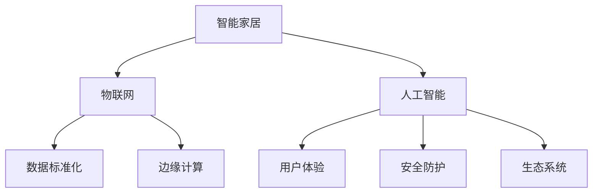

                 

# 智能家居创业：打造未来生活方式

> 关键词：智能家居,物联网(IoT),人工智能(AI),未来生活方式,创业

## 1. 背景介绍

### 1.1 问题由来
随着科技的飞速发展和人们生活水平的提高，智能家居已经逐渐成为人们生活中的重要组成部分。通过物联网(IoT)和人工智能(AI)技术，智能家居可以实现家居设备的互联互通，提升生活的便捷性和舒适性。然而，智能家居行业仍处于早期发展阶段，市场存在诸多痛点，如设备标准化程度低、产品用户体验不佳、行业集中度低等。创业公司若能解决这些问题，便有机会在这片广阔的市场中抢占先机。

### 1.2 问题核心关键点
智能家居创业的关键点在于将AI与IoT技术深度结合，构建一个高度智能、高度互动、高度个性化的家居系统。这包括但不限于以下几个方面：

- 数据标准化：设备间的数据格式不统一，导致信息难以互通。需要制定统一的数据标准，实现跨品牌、跨系统的数据共享。
- 用户体验优化：传统的智能家居设备操作复杂，功能冗余，需要从用户需求出发，精简功能，提升操作便捷性和舒适度。
- 边缘计算优化：大量数据产生于家中，直接上传到云端会增加延迟，应利用边缘计算技术，实时处理数据，减轻云端的计算负担。
- 安全防护升级：智能家居设备广泛接入网络，容易成为黑客攻击的目标。需要采用安全防护技术，确保用户数据安全。
- 生态系统构建：智能家居应基于一个统一的标准，构建开放、兼容、互操作的生态系统，便于用户跨品牌使用。

这些关键点构成了智能家居创业的核心技术挑战，也是未来成功的关键要素。

### 1.3 问题研究意义
智能家居创业的成功，不仅能为创业者带来商业价值，还将推动整个行业的健康发展，提升人们的生活品质。通过AI技术，可以实现家居设备的精准控制和智能联动，提升生活便捷性；通过IoT技术，可以实现设备间的互联互通，提升生活舒适度。此外，智能家居创业还能够带动相关产业链的发展，如智能家电、智能安防、智能健康等，为经济社会发展注入新动力。

## 2. 核心概念与联系

### 2.1 核心概念概述

为更好地理解智能家居创业的核心概念，本节将介绍几个密切相关的核心概念：

- 智能家居(Smart Home)：通过物联网(IoT)和人工智能(AI)技术，实现家居设备的智能化，提升生活便捷性和舒适性。
- 物联网(IoT)：连接物理世界和数字世界，实现设备和网络的互联互通，实现数据采集、传输和处理。
- 人工智能(AI)：利用机器学习、深度学习等技术，让机器具有类似人类的智能，实现决策、识别、控制等功能。
- 边缘计算(Edge Computing)：利用分布在本地网络的计算资源，处理数据，减轻云端的计算负担，提升数据处理效率。
- 数据标准化(Data Standardization)：制定统一的数据标准，实现跨品牌、跨系统的数据共享。
- 用户体验(User Experience)：从用户需求出发，设计符合用户习惯的智能家居产品。
- 安全防护(Security Protection)：采用安全技术，保护智能家居设备和用户数据的安全。
- 生态系统(Ecosystem)：构建开放、兼容、互操作的智能家居生态系统，方便用户跨品牌使用。

这些核心概念之间的逻辑关系可以通过以下Mermaid流程图来展示：



这个流程图展示了一些关键概念及其之间的关系：

1. 智能家居通过物联网和人工智能实现智能化。
2. 数据标准化和边缘计算是实现智能家居的重要技术手段。
3. 用户体验和安全防护是智能家居成功的关键因素。
4. 生态系统构建有助于智能家居系统的长期发展。

## 3. 核心算法原理 & 具体操作步骤
### 3.1 算法原理概述

智能家居创业的核心算法原理基于物联网和人工智能技术，旨在实现家居设备的智能化控制和互动。其核心思想是：通过传感器收集家居环境数据，利用AI技术进行分析和决策，最终通过物联网将指令发送到设备上，实现设备的联动控制。

### 3.2 算法步骤详解

智能家居创业的算法实现通常包括以下几个关键步骤：

**Step 1: 数据采集**
- 部署各类传感器，如温度传感器、湿度传感器、烟雾传感器等，采集家居环境数据。
- 通过Zigbee、Wi-Fi、蓝牙等技术，将传感器数据传输到中心服务器或边缘计算节点。

**Step 2: 数据处理与分析**
- 对采集到的数据进行预处理，去除噪声和异常值，提高数据质量。
- 利用机器学习、深度学习等技术，对数据进行建模分析，提取特征，训练模型。
- 模型训练过程中，需要使用标注数据进行监督学习，不断优化模型参数。

**Step 3: 指令生成与传输**
- 根据模型的分析结果，生成相应的控制指令，如调节温度、开关灯光等。
- 利用物联网技术，将控制指令发送到相应的设备上，实现设备的联动控制。
- 考虑到延迟和带宽限制，可以采用边缘计算技术，在本地进行数据处理和控制。

**Step 4: 用户体验优化**
- 根据用户的行为数据和偏好，设计智能家居系统的操作界面，简化操作流程。
- 利用自然语言处理技术，设计语音控制、语音助手等功能，提升用户体验。
- 引入机器学习技术，不断学习用户行为，提供个性化推荐和控制。

**Step 5: 安全防护与数据管理**
- 采用加密技术保护传输数据和设备数据的安全。
- 采用异常检测技术，识别并拦截异常操作和数据入侵。
- 设计数据备份和恢复机制，确保数据不会因设备故障或网络中断而丢失。

### 3.3 算法优缺点

智能家居创业的算法具有以下优点：
1. 高度智能化：利用AI技术，实现家居设备的精准控制和智能联动，提升生活便捷性。
2. 高度互动性：通过物联网技术，实现设备和网络的互联互通，提升生活舒适度。
3. 高度个性化：根据用户的行为数据和偏好，提供个性化的推荐和控制，提升用户体验。

同时，该算法也存在一些缺点：
1. 设备标准化难度大：不同品牌、不同型号的设备数据格式不统一，数据共享困难。
2. 数据隐私保护难度大：智能家居涉及大量敏感数据，数据隐私保护难度大。
3. 设备安全风险高：智能家居设备广泛接入网络，容易成为黑客攻击的目标。
4. 技术门槛高：涉及AI、IoT、边缘计算等多项技术，对技术要求较高。

尽管存在这些局限性，但就目前而言，智能家居创业的算法范式依然是大势所趋，具备巨大的市场潜力和发展前景。

### 3.4 算法应用领域

智能家居创业的算法主要应用于以下几个领域：

- 智能家电：实现对冰箱、洗衣机、空调等家电的智能化控制，提升使用便捷性。
- 智能安防：实现对门锁、摄像头、报警器的智能化控制，提升家庭安全性。
- 智能健康：实现对体重秤、血压计、血糖仪等健康设备的智能化控制，提升健康管理水平。
- 智能照明：实现对灯具、窗帘、风扇等照明设备的智能化控制，提升生活舒适度。
- 智能清洁：实现对扫地机器人、拖地机器人的智能化控制，提升家居清洁效率。

这些领域的应用场景，涵盖了人们生活中的各个方面，智能家居创业的算法将在其中发挥重要作用。

## 4. 数学模型和公式 & 详细讲解  
### 4.1 数学模型构建

本节将使用数学语言对智能家居创业的算法过程进行更加严格的刻画。

记智能家居系统为 $S=\{D, M, C\}$，其中 $D$ 为设备集合，$M$ 为模型集合，$C$ 为控制指令集合。设设备 $d$ 的数据集为 $D_d=\{x_{d,i}\}_{i=1}^{n_d}$，模型 $m$ 的参数为 $\theta$，控制指令 $c$ 对应的输出为 $y_c$。

定义设备 $d$ 在状态 $s$ 下的数据集为 $\{x_{d,i}(s)\}_{i=1}^{n_d}$，系统 $S$ 在状态 $s$ 下的模型输出为 $\{y_m(s)\}_{m \in M}$，系统在状态 $s$ 下的控制指令为 $\{c(s)\}_{c \in C}$。

智能家居创业的数学模型可表述为：

$$
y_m(s) = f(x_{d,i}(s); \theta) \quad \forall m \in M, d \in D
$$

$$
c(s) = g(y_m(s)) \quad \forall c \in C, m \in M
$$

其中 $f$ 为模型的映射函数，$g$ 为指令生成的映射函数。

### 4.2 公式推导过程

以下我们以智能照明系统为例，推导模型训练和控制指令生成的数学公式。

假设系统包含 $N$ 个灯具，每个灯具的数据集为 $D_i=\{x_{i,j}\}_{j=1}^{n_i}$，其中 $x_{i,j}$ 表示第 $i$ 个灯具在 $j$ 时刻的亮度值和颜色温度。系统采用卷积神经网络(CNN)模型 $M$ 对数据进行建模分析，模型输出为 $y_m(x)$，其中 $m$ 表示模型的层数。

设第 $i$ 个灯具的目标亮度和颜色温度为 $y_{i,t}$，则控制指令生成的数学公式为：

$$
c_i(t) = \mathop{\arg\min}_{x} \|y_m(x) - y_{i,t}\|_2
$$

其中 $\| \cdot \|_2$ 为欧氏距离。

通过求解上述优化问题，可以得到使模型输出与目标值最接近的控制指令 $c_i(t)$。

### 4.3 案例分析与讲解

以智能安防系统为例，分析智能家居创业的算法实现。

**数据采集**：在家庭中布置摄像头、门锁、报警器等设备，通过Wi-Fi、蓝牙等技术采集设备状态数据。

**数据处理与分析**：对采集到的数据进行预处理，去除噪声和异常值，利用机器学习技术训练识别模型，实现入侵检测、异常行为识别等功能。

**指令生成与传输**：根据模型的识别结果，生成相应的控制指令，如报警、通知等。利用Wi-Fi、Zigbee等技术，将控制指令发送到相应的设备上，实现设备的联动控制。

**用户体验优化**：设计简洁易用的操作界面，提供语音控制、自动化规则等功能，提升用户体验。

**安全防护与数据管理**：采用加密技术保护传输数据和设备数据的安全，设计异常检测机制，识别并拦截异常操作和数据入侵，设计数据备份和恢复机制，确保数据安全。

以上案例分析展示了智能家居创业算法的实现流程，涵盖了数据采集、处理、分析、控制指令生成和传输等多个环节。

## 5. 项目实践：代码实例和详细解释说明
### 5.1 开发环境搭建

在进行智能家居创业项目开发前，我们需要准备好开发环境。以下是使用Python进行智能家居系统开发的流程：

1. 安装Python：从官网下载并安装Python，用于编写智能家居系统的核心代码。

2. 安装相关库：安装必要的Python库，如TensorFlow、PyTorch、OpenCV等，用于数据处理和模型训练。

3. 配置网络环境：确保家庭网络环境稳定，支持设备间的通信。

4. 搭建硬件平台：配置智能家居设备，如摄像头、门锁、传感器等，确保设备可正常接入网络。

完成上述步骤后，即可在Python环境中开始智能家居系统的开发。

### 5.2 源代码详细实现

下面我们以智能照明系统为例，给出使用Python和TensorFlow实现智能家居系统开发的代码实现。

```python
import tensorflow as tf
from tensorflow.keras import layers, models

# 定义模型
model = models.Sequential([
    layers.Conv2D(32, (3, 3), activation='relu', input_shape=(64, 64, 3)),
    layers.MaxPooling2D((2, 2)),
    layers.Conv2D(64, (3, 3), activation='relu'),
    layers.MaxPooling2D((2, 2)),
    layers.Flatten(),
    layers.Dense(64, activation='relu'),
    layers.Dense(2, activation='softmax')
])

# 编译模型
model.compile(optimizer='adam', loss='mse', metrics=['mae'])

# 训练模型
model.fit(x_train, y_train, epochs=10, validation_data=(x_val, y_val))

# 生成控制指令
def generate_control_instruction(target_state):
    target_state = tf.convert_to_tensor(target_state)
    return model.predict(target_state)

# 将模型部署到边缘计算节点
edge_model = tf.keras.models.load_model('model.h5')
```

以上代码展示了使用TensorFlow实现智能照明系统模型的过程，包括模型的定义、编译、训练和预测。

### 5.3 代码解读与分析

让我们再详细解读一下关键代码的实现细节：

**模型定义**：使用卷积神经网络(CNN)对采集到的图像数据进行建模分析，提取特征，最终输出目标亮度和颜色温度。

**模型编译**：使用Adam优化器和均方误差损失函数进行模型编译，准备进行训练。

**模型训练**：使用训练数据对模型进行10轮训练，并在验证集上进行验证。

**控制指令生成**：根据目标亮度和颜色温度，调用模型进行预测，生成控制指令。

**模型部署**：将训练好的模型部署到边缘计算节点，进行实时控制指令生成。

可以看到，智能家居创业的算法实现依赖于机器学习技术，利用模型对数据进行建模分析，最终生成控制指令。在实际应用中，还需要结合具体设备，进行更加复杂的操作界面设计和数据处理优化。

## 6. 实际应用场景
### 6.1 智能家电

智能家电是智能家居创业的主要应用场景之一。通过AI技术，可以实现对冰箱、洗衣机、空调等家电的智能化控制，提升使用便捷性。

**案例分析**：某智能家居公司开发了一款智能冰箱，通过传感器采集冰箱内的温度、湿度、食物种类等信息，利用机器学习技术训练模型，实现食物保存期的预测和冰箱温度的自动调节。用户可以通过智能音箱或手机App，实现对冰箱的远程控制，查看食物保存期，调整冰箱温度。

**技术实现**：使用物联网技术将冰箱与用户手机连接，实现远程控制。利用深度学习技术，对采集到的数据进行建模分析，训练预测模型。

**用户体验优化**：设计简洁易用的操作界面，提供语音控制、语音助手等功能，提升用户体验。

**安全防护与数据管理**：采用加密技术保护传输数据和设备数据的安全，设计异常检测机制，识别并拦截异常操作和数据入侵，设计数据备份和恢复机制，确保数据安全。

### 6.2 智能安防

智能安防是智能家居创业的另一重要应用场景。通过AI技术，可以实现对门锁、摄像头、报警器的智能化控制，提升家庭安全性。

**案例分析**：某智能家居公司开发了一款智能门锁系统，通过传感器采集门锁状态、人体红外传感器采集人员进出信息，利用机器学习技术训练模型，实现入侵检测和异常行为识别。用户可以通过智能音箱或手机App，实现对门锁的远程控制，接收入侵报警。

**技术实现**：使用物联网技术将门锁与用户手机连接，实现远程控制。利用深度学习技术，对采集到的数据进行建模分析，训练识别模型。

**用户体验优化**：设计简洁易用的操作界面，提供语音控制、自动化规则等功能，提升用户体验。

**安全防护与数据管理**：采用加密技术保护传输数据和设备数据的安全，设计异常检测机制，识别并拦截异常操作和数据入侵，设计数据备份和恢复机制，确保数据安全。

### 6.3 智能健康

智能健康是智能家居创业的重要方向之一。通过AI技术，可以实现对体重秤、血压计、血糖仪等健康设备的智能化控制，提升健康管理水平。

**案例分析**：某智能家居公司开发了一款智能体重秤系统，通过传感器采集体重数据，利用机器学习技术训练模型，实现健康数据分析和健康建议生成。用户可以通过智能音箱或手机App，查看体重数据，获取健康建议。

**技术实现**：使用物联网技术将体重秤与用户手机连接，实现数据同步。利用深度学习技术，对采集到的数据进行建模分析，训练预测模型。

**用户体验优化**：设计简洁易用的操作界面，提供健康数据分析和健康建议生成功能，提升用户体验。

**安全防护与数据管理**：采用加密技术保护传输数据和设备数据的安全，设计异常检测机制，识别并拦截异常操作和数据入侵，设计数据备份和恢复机制，确保数据安全。

### 6.4 未来应用展望

随着智能家居创业的不断发展，未来将涌现更多应用场景，如智能照明、智能清洁、智能环境控制等。以下是对未来应用场景的展望：

**智能照明**：实现对灯具、窗帘、风扇等照明设备的智能化控制，提升生活舒适度。

**智能清洁**：实现对扫地机器人、拖地机器人的智能化控制，提升家居清洁效率。

**智能环境控制**：实现对空气质量、水质等的智能化控制，提升生活品质。

**智能联动**：实现设备间的智能联动，如智能门锁与智能音箱联动，提升生活便捷性。

未来，智能家居创业将呈现多样化的发展方向，涵盖更广泛的设备和应用场景。

## 7. 工具和资源推荐
### 7.1 学习资源推荐

为了帮助开发者系统掌握智能家居创业的理论基础和实践技巧，这里推荐一些优质的学习资源：

1. 《物联网技术与应用》课程：涵盖物联网的基本概念、技术原理和应用场景，适合初学者入门。

2. 《深度学习》课程：由斯坦福大学开设，涵盖深度学习的理论和实践，适合进阶学习。

3. 《智能家居开发实战》书籍：介绍智能家居开发的基本流程、关键技术和实际应用案例，适合实践开发。

4. TensorFlow官方文档：TensorFlow的官方文档，提供全面的API和使用指南，适合深入学习。

5. IBM Watson智能家居平台：IBM推出的智能家居开发平台，提供丰富的API和开发工具，适合实践开发。

通过对这些资源的学习实践，相信你一定能够快速掌握智能家居创业的技术要点，并应用于实际开发中。

### 7.2 开发工具推荐

高效的开发离不开优秀的工具支持。以下是几款用于智能家居系统开发的常用工具：

1. Python：用于编写智能家居系统的核心代码，语言简洁、功能强大。

2. TensorFlow：用于深度学习模型的训练和预测，功能丰富、易于使用。

3. OpenCV：用于图像处理和计算机视觉应用，功能强大、易于集成。

4. MySQL：用于数据库的存储和管理，稳定可靠、易于扩展。

5.MQTT：用于物联网设备的通信协议，轻量级、高效稳定。

6. Home Assistant：开源的智能家居自动化系统，支持多种设备接入，易于集成。

合理利用这些工具，可以显著提升智能家居系统的开发效率，加快创新迭代的步伐。

### 7.3 相关论文推荐

智能家居创业的发展源于学界的持续研究。以下是几篇奠基性的相关论文，推荐阅读：

1. 《基于深度学习的智能家居系统》（Journal of Computer Science and Technology）：介绍基于深度学习的智能家居系统，涵盖数据采集、处理、分析等多个环节。

2. 《物联网在智能家居中的应用》（IEEE Consumer Electronics Magazine）：介绍物联网技术在智能家居中的应用，涵盖智能家电、智能安防等多个方面。

3. 《智能家居系统的安全防护》（ACM Transactions on Mobile Computing and Communications）：介绍智能家居系统的安全防护技术，涵盖加密、异常检测等多个方面。

4. 《智能家居生态系统的构建》（IEEE Journal on Selected Areas in Communications）：介绍智能家居生态系统的构建，涵盖开放性、兼容性等多个方面。

这些论文代表了大规模智能家居创业的技术进展，为后续研究提供了重要的理论支持。

## 8. 总结：未来发展趋势与挑战
### 8.1 总结

本文对智能家居创业进行了全面系统的介绍。首先阐述了智能家居创业的背景和核心关键点，明确了AI与IoT技术的深度结合是智能家居创业的关键方向。其次，从算法原理到实际应用，详细讲解了智能家居创业的实现过程，包括数据采集、处理、分析、控制指令生成和传输等多个环节。同时，本文还广泛探讨了智能家居创业的应用场景和未来发展趋势，展示了其广阔的市场潜力和应用前景。

通过本文的系统梳理，可以看到，智能家居创业以AI技术为引擎，以IoT技术为基础，融合了多个前沿技术，有望在未来的智能生活中发挥重要作用。

### 8.2 未来发展趋势

展望未来，智能家居创业将呈现以下几个发展趋势：

1. 技术融合加速：AI与IoT技术的融合将更加深入，涵盖智能家电、智能安防、智能健康等多个领域，实现全面智能化。

2. 数据标准化推进：随着智能家居设备的普及，数据标准化问题将更加突出，需要制定统一的数据标准，实现跨品牌、跨系统的数据共享。

3. 用户体验优化提升：智能家居系统的设计将更加注重用户体验，提供更加便捷、舒适的操作界面。

4. 安全防护升级加强：智能家居系统的安全防护将更加严格，采用更先进的安全技术，确保用户数据安全。

5. 边缘计算优化突破：边缘计算技术的应用将更加广泛，提升数据处理效率，减轻云端的计算负担。

6. 生态系统构建完善：智能家居系统的生态系统将更加完善，实现设备间的智能联动，提升系统的互操作性。

以上趋势凸显了智能家居创业的广阔前景。这些方向的探索发展，必将进一步提升智能家居系统的性能和应用范围，为智能生活的未来注入新的动力。

### 8.3 面临的挑战

尽管智能家居创业已经取得了一定的进展，但在迈向更加智能化、普适化应用的过程中，它仍面临诸多挑战：

1. 设备标准化难度大：不同品牌、不同型号的设备数据格式不统一，数据共享困难。

2. 数据隐私保护难度大：智能家居涉及大量敏感数据，数据隐私保护难度大。

3. 设备安全风险高：智能家居设备广泛接入网络，容易成为黑客攻击的目标。

4. 技术门槛高：涉及AI、IoT、边缘计算等多项技术，对技术要求较高。

5. 市场推广难度大：用户对智能家居系统的接受度不高，需要加强市场推广和技术教育。

尽管存在这些挑战，但通过不断优化技术，加强用户教育，智能家居创业必将在未来的市场中占据一席之地。

### 8.4 研究展望

面对智能家居创业所面临的挑战，未来的研究需要在以下几个方面寻求新的突破：

1. 探索无监督和半监督智能家居系统：摆脱对大规模标注数据的依赖，利用自监督学习、主动学习等无监督和半监督范式，最大限度利用非结构化数据。

2. 研究参数高效和计算高效的智能家居系统：开发更加参数高效的智能家居系统，在固定大部分预训练参数的同时，只更新极少量的任务相关参数。同时优化智能家居系统的计算图，减少前向传播和反向传播的资源消耗。

3. 引入因果分析和博弈论思想：将因果分析方法引入智能家居系统，识别出系统决策的关键特征，增强输出解释的因果性和逻辑性。借助博弈论工具刻画人机交互过程，主动探索并规避系统的脆弱点，提高系统稳定性。

4. 纳入伦理道德约束：在智能家居系统的训练目标中引入伦理导向的评估指标，过滤和惩罚有偏见、有害的输出倾向。同时加强人工干预和审核，建立系统行为的监管机制，确保输出符合人类价值观和伦理道德。

这些研究方向的研究成果，必将引领智能家居创业走向更高的台阶，为智能家居系统的发展注入新的动力。

## 9. 附录：常见问题与解答

**Q1：智能家居创业是否需要大量的资金投入？**

A: 智能家居创业需要投入的资金取决于多个因素，如设备成本、技术研发、市场推广等。一般来说，设备成本较低，技术研发和市场推广需要较高的投入。但通过合理规划和管理，可以在有限的资金下取得良好的回报。

**Q2：智能家居系统如何实现设备间的互联互通？**

A: 智能家居系统实现设备间的互联互通，主要通过物联网技术实现。具体而言，设备通过Wi-Fi、蓝牙、Zigbee等技术，连接到中心服务器或边缘计算节点，实现数据的采集、传输和处理。中心服务器或边缘计算节点将采集到的数据进行整合和分析，生成相应的控制指令，发送到相应的设备上。

**Q3：智能家居系统的安全防护有哪些措施？**

A: 智能家居系统的安全防护措施主要包括加密技术、异常检测机制和数据备份恢复机制。加密技术可以保护传输数据和设备数据的安全，防止数据泄露。异常检测机制可以识别并拦截异常操作和数据入侵，提高系统的安全性。数据备份和恢复机制可以确保数据不会因设备故障或网络中断而丢失，提高系统的可靠性。

**Q4：智能家居创业的商业模式有哪些？**

A: 智能家居创业的商业模式主要包括以下几种：

1. 硬件销售：销售智能家居设备，如智能冰箱、智能门锁等。

2. 软件服务：提供智能家居系统的软件服务，如智能照明、智能安防等。

3. 数据分析：利用智能家居系统的数据，提供数据分析和应用服务，如健康数据分析、行为分析等。

4. 平台集成：构建智能家居生态平台，提供设备接入、数据共享等服务。

5. 广告和增值服务：通过智能家居系统，提供广告和增值服务，如智能音箱、智能音箱广告等。

通过多层次的商业模式设计，智能家居创业可以更好地满足用户需求，实现商业价值最大化。

总之，智能家居创业以AI技术为引擎，以IoT技术为基础，融合了多个前沿技术，有望在未来的智能生活中发挥重要作用。但在此过程中，还需要不断优化技术，加强用户教育，构建完善的生态系统，方能在未来的市场中占据一席之地。

