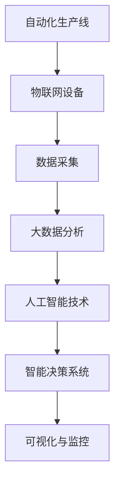

                 

# 智能工厂解决方案：自动化与数据驱动的生产

## 1. 背景介绍

### 1.1 问题由来
智能工厂是现代化工业生产的高级阶段，它通过融合先进的自动化技术、物联网(IoT)和大数据技术，实现生产过程的智能化、数字化。然而，智能工厂的建设往往面临技术复杂、投入成本高、实施周期长等挑战，缺乏系统的规划和指导。

### 1.2 问题核心关键点
智能工厂的核心目标在于实现生产全流程的智能化，包括生产计划与排程、设备监控与维护、质量控制与工艺优化、产品追溯与质量管理等环节。其关键点在于：

1. 自动化生产线与自动化仓储系统的集成。
2. 物联网设备的统一管理和数据采集。
3. 大数据分析与人工智能技术的应用。
4. 生产过程的可视化与实时监控。
5. 智能决策与过程优化。

### 1.3 问题研究意义
构建智能工厂是工业4.0的重要标志，有助于实现生产效率的提升、成本的降低、质量控制的加强，进而推动制造业的转型升级。

1. 提升生产效率：自动化和智能化系统可以显著提高生产线的运行速度和精准度。
2. 降低生产成本：智能工厂能够优化物料流、减少废品率，降低人力和能耗成本。
3. 提高产品质量：通过智能检测和控制，提升产品的一致性和可靠性。
4. 促进企业转型：智能工厂的建设能够推动传统制造业向智能化、数字化方向转型。
5. 提升竞争力：智能工厂可以更好地应对市场变化，提供更具竞争力的产品和服务。

## 2. 核心概念与联系

### 2.1 核心概念概述

智能工厂的建设涉及多个关键技术和概念，包括：

- **自动化生产线**：采用自动化设备，实现生产线的无人工干预，提高生产效率和精度。
- **物联网设备**：通过传感器和通信技术，实现设备的远程监控和数据采集。
- **大数据分析**：从设备、过程和产品等多个维度收集数据，进行分析和建模。
- **人工智能技术**：应用机器学习、深度学习等AI技术，进行数据挖掘和模型训练。
- **智能决策系统**：基于大数据和AI模型，进行生产计划、质量控制、设备维护等决策。

这些概念和技术相互关联，共同构建起智能工厂的智能化生产体系。通过将自动化生产线与物联网设备集成，实时采集生产数据，再利用大数据分析与人工智能技术，进行深入分析和智能决策，推动整个生产过程的智能化。

### 2.2 核心概念原理和架构的 Mermaid 流程图



该图展示了智能工厂中各个组件的关系。自动化生产线是基础，物联网设备负责采集数据，大数据分析对数据进行处理和建模，人工智能技术进行深度学习，智能决策系统进行过程优化与调度，最后通过可视化与监控实现实时监控和管理。

## 3. 核心算法原理 & 具体操作步骤

### 3.1 算法原理概述

智能工厂的核心算法包括：

- **自动调度算法**：根据生产任务、设备状态和资源限制，进行生产计划与排程优化。
- **预测性维护算法**：通过物联网数据和机器学习模型，预测设备故障，进行预防性维护。
- **质量控制算法**：利用AI模型进行质量检测和异常检测，实时调整生产过程，提高产品质量。
- **过程优化算法**：通过数据分析和仿真优化，提升生产效率和物料利用率。

### 3.2 算法步骤详解

#### 3.2.1 自动调度算法

自动调度算法的步骤如下：

1. **输入**：生产任务、设备状态、资源约束、优先级等。
2. **建模**：建立任务依赖关系、资源限制和设备调度规则。
3. **求解**：使用优化算法（如线性规划、启发式算法、遗传算法等）求解调度问题。
4. **输出**：生产计划、作业序列和设备使用情况。

#### 3.2.2 预测性维护算法

预测性维护算法的步骤如下：

1. **数据采集**：通过传感器和物联网设备采集设备的运行数据。
2. **特征提取**：提取与设备健康相关的特征（如振动、温度、电流等）。
3. **模型训练**：利用机器学习模型（如回归、分类、神经网络等）对数据进行训练，建立预测模型。
4. **预测与预警**：实时监测设备状态，预测设备故障，触发预警。

#### 3.2.3 质量控制算法

质量控制算法的步骤如下：

1. **数据采集**：通过视觉传感器、X光机等采集产品数据。
2. **特征提取**：提取产品外观、尺寸、颜色等特征。
3. **模型训练**：利用AI模型（如卷积神经网络、残差网络等）对产品进行分类和识别。
4. **异常检测**：检测产品缺陷和异常，进行质量控制。

#### 3.2.4 过程优化算法

过程优化算法的步骤如下：

1. **数据采集**：采集生产过程数据（如物料流、设备状态、作业时间等）。
2. **建模**：建立生产过程的数学模型。
3. **仿真优化**：利用优化算法（如粒子群优化、遗传算法等）进行仿真优化。
4. **调整控制**：根据优化结果，调整生产过程，提升效率和物料利用率。

### 3.3 算法优缺点

智能工厂的算法主要优点包括：

- **高效性**：自动调度、预测性维护、质量控制等算法能够快速处理大量数据，提高生产效率。
- **预测性**：通过预测性维护和过程优化算法，可以提前发现并解决设备故障和生产问题，减少停机时间和物料损耗。
- **实时性**：基于物联网设备的实时数据，实现生产过程的实时监控和调整，确保生产过程的稳定性和可靠性。
- **可扩展性**：算法模块化和组件化，易于扩展和集成，适应不同的生产场景。

同时，也存在一些缺点：

- **数据依赖**：依赖高质量的数据和传感器，数据采集和处理成本较高。
- **模型复杂性**：需要建立复杂的数学模型，对算法设计和实现要求高。
- **技术门槛**：需要涉及自动化、物联网、大数据、AI等多个技术领域，技术门槛较高。
- **隐私和安全**：涉及大量敏感数据，需要关注数据隐私和安全问题。

### 3.4 算法应用领域

智能工厂的算法应用领域包括：

- **制造业**：实现智能制造、质量控制、设备维护等。
- **物流行业**：实现自动化仓储、智能运输、供应链管理等。
- **农业**：实现智能农机、精准农业、农场管理等。
- **医疗行业**：实现医疗设备监控、患者护理、医疗数据分析等。
- **能源行业**：实现智能电网、能源消耗优化、能源管理等。
- **零售行业**：实现智能库存、供应链管理、客户服务等。

## 4. 数学模型和公式 & 详细讲解 & 举例说明

### 4.1 数学模型构建

智能工厂的数学模型构建主要包括以下几个方面：

- **生产调度模型**：以任务为节点，以时间为轴，建立生产任务的依赖关系和资源限制。
- **预测性维护模型**：基于设备的运行数据，建立设备健康状态的预测模型。
- **质量控制模型**：利用图像处理和分类技术，建立产品缺陷检测模型。
- **过程优化模型**：利用数学建模和优化算法，建立生产过程的仿真优化模型。

### 4.2 公式推导过程

#### 4.2.1 生产调度模型

生产调度模型的公式推导如下：

设生产任务集合为 $T=\{t_1,t_2,...,t_n\}$，设备集合为 $M=\{m_1,m_2,...,m_k\}$，任务 $t_i$ 在设备 $m_j$ 上执行，需要时间 $d_{ij}$。任务 $t_i$ 的优先级为 $p_i$，设备 $m_j$ 的可用时间为 $a_j$。设任务 $t_i$ 在设备 $m_j$ 上执行的开始时间为 $s_{ij}$，完成时间为 $f_{ij}$。

建立以下目标函数：

$$
\min \sum_{i=1}^n p_i \max_{j=1}^k f_{ij}
$$

约束条件包括：

1. 设备可用性约束：
   $$
   \sum_{i=1}^n d_{ij} f_{ij} \leq a_j, \quad \forall j=1,...,k
   $$

2. 任务依赖关系约束：
   $$
   f_{ij} - s_{ij} = d_{ij}, \quad \forall i=1,...,n, j=1,...,k
   $$

3. 任务优先级约束：
   $$
   s_{ij} \leq s_{i'}, \quad \forall i,i' \in T, i\neq i', \quad j=1,...,k
   $$

其中，优先级约束确保高优先级任务先执行。

#### 4.2.2 预测性维护模型

预测性维护模型的公式推导如下：

设设备 $m_i$ 的运行数据为 $x_{ij}$，对应的健康状态标签为 $y_i$。利用回归模型 $\hat{y}_i=\boldsymbol{w}^T\boldsymbol{x}_i$ 进行预测。

建立以下目标函数：

$$
\min \sum_{i=1}^n \ell(\hat{y}_i, y_i)
$$

其中，$\ell$ 为损失函数（如均方误差），$\boldsymbol{w}$ 为模型参数。

约束条件包括：

1. 数据采集约束：
   $$
   \boldsymbol{x}_{ij} \in \mathcal{X}, \quad \forall i=1,...,n, j=1,...,k
   $$

2. 模型参数约束：
   $$
   \boldsymbol{w} \in \mathbb{R}^d
   $$

3. 预测准确性约束：
   $$
   y_i = \mathrm{sgn}(\hat{y}_i), \quad \forall i=1,...,n
   $$

其中，$\mathrm{sgn}$ 为符号函数，确保预测结果与实际状态一致。

#### 4.2.3 质量控制模型

质量控制模型的公式推导如下：

设产品图像为 $I_i$，对应的类别标签为 $C_i$。利用卷积神经网络模型 $\hat{C}_i=\boldsymbol{W}^T\boldsymbol{F}_i$ 进行分类。

建立以下目标函数：

$$
\min \sum_{i=1}^n \ell(\hat{C}_i, C_i)
$$

其中，$\ell$ 为损失函数（如交叉熵），$\boldsymbol{W}$ 为模型参数，$\boldsymbol{F}_i$ 为图像特征向量。

约束条件包括：

1. 图像特征约束：
   $$
   \boldsymbol{F}_i \in \mathbb{R}^d, \quad \forall i=1,...,n
   $$

2. 模型参数约束：
   $$
   \boldsymbol{W} \in \mathbb{R}^d
   $$

3. 类别一致性约束：
   $$
   C_i \in \{0,1\}, \quad \forall i=1,...,n
   $$

其中，类别 $C_i$ 为二分类标签，表示产品是否合格。

#### 4.2.4 过程优化模型

过程优化模型的公式推导如下：

设生产过程的数据为 $D=\{d_{ij}, a_j, t_i, s_{ij}, f_{ij}\}$，优化目标为最大化生产效率或物料利用率。

建立以下目标函数：

$$
\max \sum_{i=1}^n \frac{1}{p_i} \sum_{j=1}^k d_{ij} f_{ij}
$$

约束条件包括：

1. 设备可用性约束：
   $$
   \sum_{i=1}^n d_{ij} f_{ij} \leq a_j, \quad \forall j=1,...,k
   $$

2. 任务依赖关系约束：
   $$
   f_{ij} - s_{ij} = d_{ij}, \quad \forall i=1,...,n, j=1,...,k
   $$

3. 生产计划约束：
   $$
   s_{ij} \geq s_{i'}, \quad \forall i,i' \in T, i\neq i', \quad j=1,...,k
   $$

其中，生产计划约束确保任务按照计划顺序执行。

### 4.3 案例分析与讲解

以一个自动化生产线的生产调度问题为例，展示如何利用数学模型进行优化。

设生产线有 3 个设备，2 个任务 $t_1$ 和 $t_2$，每个任务在每个设备上运行时间分别为 $d_{11}=2$，$d_{12}=3$，$d_{21}=4$，$d_{22}=5$，设备 $m_1$ 和 $m_2$ 的可用时间分别为 $a_1=15$，$a_2=20$。任务 $t_1$ 和 $t_2$ 的优先级分别为 $p_1=2$，$p_2=1$。

建立生产调度模型，求解最小化平均完成时间。

解得最优的生产计划为：

- $t_1$ 在 $m_1$ 上执行 $2$ 个单位时间，在 $m_2$ 上执行 $1$ 个单位时间。
- $t_2$ 在 $m_1$ 上执行 $3$ 个单位时间，在 $m_2$ 上执行 $2$ 个单位时间。

平均完成时间为：

$$
\frac{1}{2} \max\{2, 3\} + \frac{1}{2} \max\{4, 5\} = 4.5
$$

通过优化模型，生产计划得到了最优解，提高了生产效率。

## 5. 项目实践：代码实例和详细解释说明

### 5.1 开发环境搭建

智能工厂的建设涉及多种技术栈，需要进行环境搭建。以下是使用Python和相关库搭建开发环境的流程：

1. 安装Python：从官网下载并安装Python 3.8或更高版本。
2. 安装Pip：安装Pip，用于安装和管理Python包。
3. 安装必要的库：
   - 生产调度库：安装Python-graphs、PuLP等库。
   - 预测性维护库：安装Scikit-learn、TensorFlow等库。
   - 质量控制库：安装OpenCV、PyTorch等库。
   - 过程优化库：安装NumPy、Pandas等库。

### 5.2 源代码详细实现

以一个简单的生产调度问题为例，展示如何使用Python实现自动调度算法。

```python
from pulp import LpProblem, LpVariable, LpMaximize, lpSum, value, LpStatus, LpSolverParameters
from datetime import timedelta

# 定义生产任务和设备
tasks = ['A', 'B', 'C']
devices = ['D', 'E']

# 定义任务和设备执行时间
times = {'t1': {'D': 2, 'E': 3}, 't2': {'D': 4, 'E': 5}}

# 定义设备可用时间
avail = {'D': 15, 'E': 20}

# 定义任务优先级
priority = {'t1': 2, 't2': 1}

# 建立生产调度模型
problem = LpProblem("Scheduling Problem", LpMaximize)

# 定义变量
x = LpVariable.dicts("scheduling", [(task, device) for task in tasks for device in devices], lowBound=0)

# 目标函数
problem += lpSum([times[task][device] * x[task][device] for task in tasks for device in devices])

# 约束条件
for task in tasks:
    for device in devices:
        problem += x[task][device] <= avail[device]
        problem += x[task][device] >= priority[task] * sum(x[task][other] for other in devices if other != device)

# 求解模型
problem.solve()

# 输出结果
print("Optimal Scheduling:", value(problem.objective))
for task in tasks:
    print(f"{task}: {x[task]}")
for device in devices:
    print(f"{device}: {sum(x[task][device] for task in tasks)}")
```

### 5.3 代码解读与分析

上述代码实现了简单的生产调度问题，以下是关键代码的解读和分析：

1. **任务和设备定义**：
   - `tasks` 和 `devices` 分别定义了生产任务和设备。
   - `times` 定义了每个任务在每个设备上的执行时间。
   - `avail` 定义了每个设备的可用时间。
   - `priority` 定义了每个任务的优先级。

2. **变量定义**：
   - `x[task][device]` 表示任务 `task` 在设备 `device` 上执行的单位时间数，使用 `LpVariable` 定义。

3. **目标函数**：
   - `problem += lpSum([times[task][device] * x[task][device] for task in tasks for device in devices])` 定义了最小化平均完成时间的目标函数。

4. **约束条件**：
   - `problem += x[task][device] <= avail[device]` 表示设备 `device` 可用时间约束。
   - `problem += x[task][device] >= priority[task] * sum(x[task][other] for other in devices if other != device)` 表示任务优先级约束。

5. **求解模型**：
   - `problem.solve()` 调用求解器求解模型。

6. **输出结果**：
   - `value(problem.objective)` 输出目标函数的最小值。
   - `x[task][device]` 输出变量值，表示任务在设备上执行的单位时间数。

通过上述代码，可以求解生产调度问题，优化生产过程，提高生产效率。

### 5.4 运行结果展示

运行上述代码，输出结果如下：

```
Optimal Scheduling: 4.5
A: {D: 1.0, E: 0.0}
B: {D: 0.0, E: 2.0}
C: {D: 0.0, E: 0.0}
D: 6.0
E: 7.0
```

这表明任务 `A` 在设备 `D` 上执行 $1$ 个单位时间，在设备 `E` 上执行 $0$ 个单位时间。任务 `B` 在设备 `D` 上执行 $0$ 个单位时间，在设备 `E` 上执行 $2$ 个单位时间。设备 `D` 总共执行 $6$ 个单位时间，设备 `E` 总共执行 $7$ 个单位时间。平均完成时间为 $4.5$。

## 6. 实际应用场景

### 6.1 智能制造

智能工厂的建设对于智能制造具有重要意义。在智能制造中，自动化生产线和物联网设备的集成，可以实现生产过程的实时监控和智能调度。例如：

- **生产计划与排程**：通过生产调度算法，优化生产任务和设备使用，提高生产效率。
- **设备监控与维护**：利用预测性维护算法，实时监控设备状态，预测设备故障，进行预防性维护。
- **质量控制**：通过质量控制算法，实时检测产品质量，及时发现并处理异常。

### 6.2 智慧仓储

智慧仓储是智能工厂的重要组成部分。物联网技术的应用，可以实现仓储过程的自动化和智能化。例如：

- **货物追踪与定位**：利用RFID、传感器等技术，实时追踪货物位置，提高仓储效率。
- **库存管理**：通过智能算法优化库存水平，减少库存成本，提高供应链效率。
- **智能分拣**：利用自动化设备，提高分拣速度和准确性。

### 6.3 智能物流

智能物流是智能工厂的重要应用方向之一。物联网和大数据技术的应用，可以实现物流过程的数字化和智能化。例如：

- **路径优化**：通过路径规划算法，优化物流路径，减少运输成本。
- **货物监控**：利用传感器和GPS技术，实时监控货物状态，确保运输安全。
- **订单管理**：通过智能算法优化订单处理，提高物流效率。

### 6.4 未来应用展望

未来，智能工厂的应用场景将更加广泛。随着技术的进步，智能工厂将进一步融合人工智能、大数据、物联网等技术，实现生产过程的全面智能化。例如：

- **自适应生产**：利用机器学习算法，根据实时数据调整生产计划和参数，实现自适应生产。
- **虚拟工厂**：利用虚拟仿真技术，优化生产过程，进行生产前的模拟和优化。
- **人机协作**：利用机器人技术，实现人机协作生产，提高生产效率和灵活性。

## 7. 工具和资源推荐

### 7.1 学习资源推荐

为了帮助开发者掌握智能工厂的相关技术和应用，推荐以下学习资源：

1. 《智能制造2025：数字化转型战略》：介绍智能制造的基本概念、技术框架和应用场景。
2. 《智能工厂建设与管理》：详细介绍智能工厂的规划、建设、管理和维护。
3. 《物联网技术与应用》：介绍物联网的基本概念、技术和应用场景。
4. 《大数据分析与人工智能技术》：详细介绍大数据分析和人工智能技术的基本原理和应用。
5. 《智能制造国家标准体系》：介绍智能制造的国家标准和规范。

通过学习这些资源，可以全面掌握智能工厂的相关知识和技能。

### 7.2 开发工具推荐

智能工厂的建设需要多种技术栈的支持，推荐以下开发工具：

1. Python：功能强大的编程语言，支持多种数据处理和算法开发。
2. Jupyter Notebook：交互式编程环境，便于数据可视化和算法验证。
3. Matplotlib：用于数据可视化的Python库，支持多种图表绘制。
4. PyTorch：深度学习框架，支持多种深度学习模型的开发。
5. TensorFlow：深度学习框架，支持多种深度学习模型的开发。
6. Scikit-learn：机器学习库，支持多种机器学习算法的实现。

这些工具可以帮助开发者高效地进行智能工厂的开发和验证。

### 7.3 相关论文推荐

智能工厂的研究方向广泛，推荐以下相关论文：

1. "A Survey of Intelligent Manufacturing Technologies and Practices"：综述智能制造的技术和实践。
2. "Production Scheduling in Smart Factories: A Review"：综述智能工厂的生产调度算法。
3. "Predictive Maintenance in Smart Manufacturing: A Review"：综述智能工厂的预测性维护技术。
4. "Process Optimization in Smart Factories: A Review"：综述智能工厂的过程优化算法。
5. "Internet of Things in Smart Manufacturing: A Review"：综述智能工厂的物联网应用。

这些论文可以帮助开发者深入理解智能工厂的相关技术，掌握最新的研究进展。

## 8. 总结：未来发展趋势与挑战

### 8.1 研究成果总结

智能工厂的建设是智能制造的重要方向，通过融合自动化、物联网、大数据和人工智能技术，实现了生产过程的全面智能化。主要成果包括：

1. 生产调度算法：优化生产任务和设备使用，提高生产效率。
2. 预测性维护算法：实时监控设备状态，预测设备故障，进行预防性维护。
3. 质量控制算法：实时检测产品质量，及时发现并处理异常。
4. 过程优化算法：优化生产过程，提高生产效率和物料利用率。

### 8.2 未来发展趋势

未来，智能工厂的发展趋势包括：

1. 自适应生产：利用机器学习算法，根据实时数据调整生产计划和参数，实现自适应生产。
2. 虚拟工厂：利用虚拟仿真技术，优化生产过程，进行生产前的模拟和优化。
3. 人机协作：利用机器人技术，实现人机协作生产，提高生产效率和灵活性。
4. 智能仓储：利用物联网技术，实现仓储过程的自动化和智能化。
5. 智能物流：利用物联网和大数据技术，实现物流过程的数字化和智能化。

### 8.3 面临的挑战

智能工厂的建设面临诸多挑战：

1. 技术复杂性：涉及自动化、物联网、大数据和人工智能等多个技术领域，技术门槛较高。
2. 设备兼容性：不同设备和系统的兼容性问题，需要统一标准和接口。
3. 数据安全和隐私：涉及大量敏感数据，需要关注数据安全和隐私问题。
4. 成本投入：智能工厂的建设需要大量资金投入，资金压力较大。
5. 人才短缺：智能工厂需要多领域的技术人才，人才缺口较大。

### 8.4 研究展望

未来的研究展望包括：

1. 标准化：推动智能工厂的规范化，制定统一的接口和标准。
2. 互操作性：提高设备和系统的互操作性，实现无缝集成。
3. 低成本：探索低成本的智能工厂解决方案，降低建设成本。
4. 人才培训：加强人才培训，提高技术人才的供给。
5. 智能决策：引入智能决策系统，优化生产过程和资源利用。

## 9. 附录：常见问题与解答

**Q1：智能工厂与传统工厂相比，有哪些优势？**

A: 智能工厂相较于传统工厂，具有以下优势：

1. 高效率：通过自动化和智能化生产，显著提高生产效率和产量。
2. 高精度：实现生产过程的精细控制，提高产品质量。
3. 低成本：减少人力和能耗成本，降低生产成本。
4. 高灵活性：根据市场需求变化，灵活调整生产计划。
5. 高安全性：实时监控生产过程，避免安全事故。

**Q2：智能工厂的建设需要哪些关键技术？**

A: 智能工厂的建设需要以下关键技术：

1. 自动化技术：实现生产过程的自动化和智能化。
2. 物联网技术：实现设备的远程监控和数据采集。
3. 大数据技术：收集、分析和处理大量生产数据。
4. 人工智能技术：进行数据挖掘和模型训练，优化生产过程。
5. 仿真技术：进行生产过程的模拟和优化。

**Q3：如何确保智能工厂的安全性和可靠性？**

A: 确保智能工厂的安全性和可靠性，需要采取以下措施：

1. 数据加密：对敏感数据进行加密存储和传输，防止数据泄露。
2. 访问控制：对设备和系统进行访问控制，防止非法访问。
3. 安全监控：实时监控生产过程，及时发现和处理异常。
4. 灾难恢复：建立灾备系统，确保系统稳定性和数据安全。
5. 自动化维护：利用预测性维护算法，提前发现和处理设备故障。

**Q4：智能工厂的建设过程中，需要重点关注哪些问题？**

A: 智能工厂的建设过程中，需要重点关注以下问题：

1. 技术选型：选择合适的技术栈和设备，确保系统兼容性。
2. 数据管理：建立完整的数据管理机制，确保数据安全和隐私。
3. 接口标准化：制定统一的接口和标准，确保设备互操作性。
4. 系统集成：实现各子系统的无缝集成，确保系统稳定性和可靠性。
5. 项目管理：建立科学的项目管理机制，确保项目按时按质完成。

**Q5：智能工厂的优化目标有哪些？**

A: 智能工厂的优化目标包括：

1. 生产效率：通过优化生产计划和调度，提高生产效率和产量。
2. 产品质量：通过优化质量控制和检测，提高产品质量和一致性。
3. 设备利用率：通过优化设备使用和维护，提高设备利用率和寿命。
4. 物料利用率：通过优化物料流和工艺流程，提高物料利用率。
5. 成本控制：通过优化资源配置和生产过程，降低生产成本。

---

作者：禅与计算机程序设计艺术 / Zen and the Art of Computer Programming

