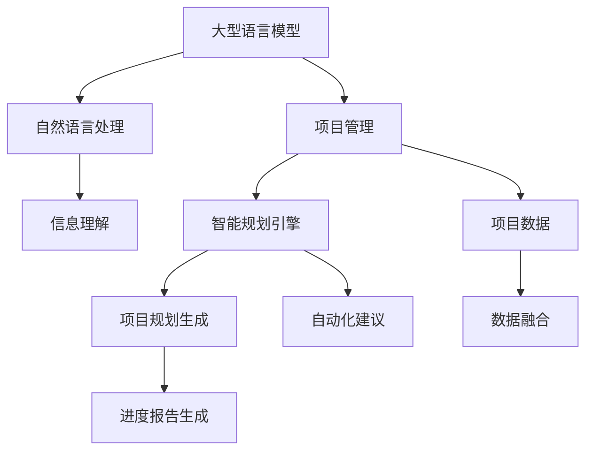

                 

# 智能规划引擎：LLM在项目管理中的应用

## 1. 背景介绍

### 1.1 问题由来
在现代项目管理中，为了提高项目的执行效率和成功率，企业往往需要借助智能化的工具和系统。传统的项目管理软件，如Microsoft Project、JIRA等，虽然在一定程度上能够帮助企业规划和追踪项目进度，但其智能化程度较低，难以应对复杂多变的项目环境。

近年来，随着人工智能技术的快速发展，基于大型语言模型（Large Language Model, LLM）的项目管理工具应运而生。这些工具结合了LLM的自然语言处理能力，能够理解项目经理和团队成员的自然语言指令，生成更合理的项目计划、资源分配方案和进度报告。本文将介绍LLM在项目管理中的应用，重点关注基于LLM的智能规划引擎。

### 1.2 问题核心关键点
基于LLM的智能规划引擎，通过深度学习技术和大规模语料库的预训练，能够在理解项目描述和团队需求的基础上，自动生成项目规划和进度报告。其主要优点包括：
- **灵活性高**：能够根据不同项目的复杂度，自适应地生成合理的规划方案。
- **智能化高**：能够结合多方面的信息，如历史数据、团队能力、外部环境等，生成更加科学的项目规划。
- **易用性强**：通过自然语言交互的方式，项目经理和团队成员能够快速生成和获取项目规划，无需繁琐的手动输入和操作。

本文将详细介绍LLM在项目管理中的应用，包括其核心概念、技术原理、算法步骤和实际应用场景等。

## 2. 核心概念与联系

### 2.1 核心概念概述

为更好地理解基于LLM的项目管理应用，本节将介绍几个密切相关的核心概念：

- **大型语言模型（Large Language Model, LLM）**：指基于大规模语料库进行预训练的深度学习模型，如GPT、BERT等。这些模型能够理解自然语言，生成具有逻辑连贯性的文本。
- **自然语言处理（Natural Language Processing, NLP）**：涉及计算机对人类语言进行理解、分析、生成和处理的技术，是大语言模型的核心技术之一。
- **项目管理（Project Management）**：涉及项目策划、组织、执行、监控和收尾等过程的管理，旨在确保项目目标的实现。
- **智能规划引擎**：结合LLM和项目管理知识，自动生成项目规划的智能化系统，能够理解项目需求、生成详细规划、提供实时建议。

这些核心概念之间的逻辑关系可以通过以下Mermaid流程图来展示：



这个流程图展示了大语言模型、自然语言处理、项目管理和智能规划引擎之间的联系：

1. 大型语言模型通过预训练获得语言知识，用于自然语言处理任务的执行。
2. 自然语言处理将语言理解与项目管理知识结合，生成项目规划和进度报告。
3. 智能规划引擎基于自然语言处理和项目管理知识，自动生成项目规划和进度报告。
4. 项目规划和进度报告的生成，需要理解项目数据和信息，并生成自动化建议。

## 3. 核心算法原理 & 具体操作步骤
### 3.1 算法原理概述

基于LLM的项目管理应用，其核心思想是：利用LLM的自然语言处理能力，将项目经理和团队成员的自然语言描述转化为结构化的规划方案和进度报告。

假设项目经理给出的项目描述为 $P$，团队的需求和约束条件为 $C$，则智能规划引擎的目标是找到最优的规划方案 $X$，满足以下条件：
$$
X = \mathop{\arg\min}_{X} \mathcal{L}(P, C, X)
$$
其中 $\mathcal{L}$ 为损失函数，用于衡量项目描述、团队需求和规划方案之间的差异。常见的损失函数包括交叉熵损失、均方误差损失等。

### 3.2 算法步骤详解

基于LLM的项目管理应用，主要包括以下几个关键步骤：

**Step 1: 准备预训练模型和数据集**
- 选择合适的LLM作为初始化参数，如GPT-3、BERT等。
- 准备项目管理的标注数据集 $D=\{(P_i, C_i, X_i)\}_{i=1}^N$，其中 $P_i$ 为项目描述，$C_i$ 为团队需求和约束条件，$X_i$ 为最优规划方案。

**Step 2: 添加任务适配层**
- 根据项目管理任务的特定需求，在LLM顶层设计合适的输出层和损失函数。
- 对于规划生成任务，通常在顶层添加解码器输出概率分布，并以交叉熵损失函数为衡量标准。

**Step 3: 设置微调超参数**
- 选择合适的优化算法及其参数，如 AdamW、SGD 等，设置学习率、批大小、迭代轮数等。
- 设置正则化技术及强度，包括权重衰减、Dropout、Early Stopping 等。
- 确定冻结预训练参数的策略，如仅微调顶层，或全部参数都参与微调。

**Step 4: 执行梯度训练**
- 将训练集数据分批次输入模型，前向传播计算损失函数。
- 反向传播计算参数梯度，根据设定的优化算法和学习率更新模型参数。
- 周期性在验证集上评估模型性能，根据性能指标决定是否触发 Early Stopping。
- 重复上述步骤直到满足预设的迭代轮数或 Early Stopping 条件。

**Step 5: 测试和部署**
- 在测试集上评估微调后模型 $M_{\hat{\theta}}$ 的性能，对比微调前后的精度提升。
- 使用微调后的模型对新项目进行规划生成和进度报告生成，集成到实际的项目管理系统中。
- 持续收集新的项目数据，定期重新微调模型，以适应项目数据分布的变化。

以上是基于LLM的项目管理应用的一般流程。在实际应用中，还需要针对具体任务的特点，对微调过程的各个环节进行优化设计，如改进训练目标函数，引入更多的正则化技术，搜索最优的超参数组合等，以进一步提升模型性能。

### 3.3 算法优缺点

基于LLM的项目管理应用，具有以下优点：
1. 高效性高。通过自然语言处理技术，项目经理和团队成员能够快速生成项目规划，无需手动输入和操作。
2. 灵活性强。LLM能够根据项目描述和团队需求，自适应地生成合理的规划方案，适应不同项目的复杂度。
3. 智能化高。LLM能够结合多方面的信息，如历史数据、团队能力、外部环境等，生成更加科学的项目规划。
4. 易用性强。通过自然语言交互的方式，项目经理和团队成员能够快速生成和获取项目规划，无需繁琐的手动输入和操作。

同时，该方法也存在一定的局限性：
1. 依赖标注数据。模型的性能很大程度上取决于标注数据的质量和数量，获取高质量标注数据的成本较高。
2. 迁移能力有限。当目标项目与预训练数据的分布差异较大时，模型的性能提升有限。
3. 可解释性不足。LLM生成的规划方案，难以解释其内部工作机制和决策逻辑。
4. 安全性有待保障。预训练语言模型难免会学习到有偏见、有害的信息，通过LLM传递到项目管理中，可能带来安全隐患。

尽管存在这些局限性，但就目前而言，基于LLM的项目管理应用已成为项目管理智能化的一个重要方向。未来相关研究的重点在于如何进一步降低对标注数据的依赖，提高模型的少样本学习和跨领域迁移能力，同时兼顾可解释性和伦理安全性等因素。

### 3.4 算法应用领域

基于LLM的项目管理应用，已经在多个领域得到应用，如：

- 项目管理软件：结合自然语言处理技术，自动生成项目规划和进度报告。
- 企业资源管理：通过自然语言交互，优化企业资源配置和项目执行。
- 建筑项目管理：自动生成建筑项目的施工计划和进度报告。
- 研发项目管理：自动生成研发项目的任务分配和进度报告。
- 智能客服系统：通过自然语言处理技术，自动回答项目相关问题，提供项目咨询。

除了上述这些经典应用外，LLM在项目管理中的应用还在不断拓展，如多项目管理、项目风险管理、项目评估等，为项目管理提供了新的解决方案。

## 4. 数学模型和公式 & 详细讲解  
### 4.1 数学模型构建

本节将使用数学语言对基于LLM的项目管理应用进行更加严格的刻画。

记项目管理模型为 $M_{\theta}$，其中 $\theta$ 为模型参数。假设项目管理任务的数据集为 $D=\{(P_i, C_i, X_i)\}_{i=1}^N$，其中 $P_i$ 为项目描述，$C_i$ 为团队需求和约束条件，$X_i$ 为最优规划方案。

定义模型 $M_{\theta}$ 在项目数据 $D$ 上的损失函数为 $\mathcal{L}(\theta)$，用于衡量模型输出与真实规划方案之间的差异。假设 $\mathcal{L}$ 为交叉熵损失函数，则有：

$$
\mathcal{L}(\theta) = -\frac{1}{N}\sum_{i=1}^N \log \prod_j p(x_{ij} | p_j)
$$

其中 $p(x_{ij} | p_j)$ 为模型在数据 $i$ 的 $j$ 个任务上的预测概率分布，$x_{ij}$ 为实际的任务输出，$p_j$ 为模型在数据 $i$ 的 $j$ 个任务上的实际输出。

### 4.2 公式推导过程

以下我们以项目规划生成为例，推导交叉熵损失函数及其梯度的计算公式。

假设模型 $M_{\theta}$ 在项目数据 $D$ 上的输出为 $\hat{X}$，表示模型预测的最优规划方案。真实规划方案为 $X$。则交叉熵损失函数定义为：

$$
\ell(M_{\theta}(P_i), X_i) = -\sum_{x \in X_i} \log p(x | P_i)
$$

将其代入经验风险公式，得：

$$
\mathcal{L}(\theta) = -\frac{1}{N}\sum_{i=1}^N \sum_{x \in X_i} \log p(x | P_i)
$$

根据链式法则，损失函数对参数 $\theta_k$ 的梯度为：

$$
\frac{\partial \mathcal{L}(\theta)}{\partial \theta_k} = -\frac{1}{N}\sum_{i=1}^N \sum_{x \in X_i} \frac{\partial \log p(x | P_i)}{\partial \theta_k}
$$

其中 $\frac{\partial \log p(x | P_i)}{\partial \theta_k}$ 可进一步递归展开，利用自动微分技术完成计算。

在得到损失函数的梯度后，即可带入参数更新公式，完成模型的迭代优化。重复上述过程直至收敛，最终得到适应项目管理任务的最优模型参数 $\theta^*$。

## 5. 项目实践：代码实例和详细解释说明
### 5.1 开发环境搭建

在进行项目管理应用开发前，我们需要准备好开发环境。以下是使用Python进行LLM开发的环境配置流程：

1. 安装Anaconda：从官网下载并安装Anaconda，用于创建独立的Python环境。

2. 创建并激活虚拟环境：
```bash
conda create -n llm-env python=3.8 
conda activate llm-env
```

3. 安装PyTorch：根据CUDA版本，从官网获取对应的安装命令。例如：
```bash
conda install pytorch torchvision torchaudio cudatoolkit=11.1 -c pytorch -c conda-forge
```

4. 安装LLM库：
```bash
pip install transformers
```

5. 安装各类工具包：
```bash
pip install numpy pandas scikit-learn matplotlib tqdm jupyter notebook ipython
```

完成上述步骤后，即可在`llm-env`环境中开始项目管理应用的开发。

### 5.2 源代码详细实现

这里我们以项目规划生成任务为例，给出使用Transformers库对GPT-3进行项目管理微调的PyTorch代码实现。

首先，定义项目管理任务的训练集和验证集：

```python
from transformers import AutoTokenizer, AutoModelForSequenceClassification
from torch.utils.data import Dataset, DataLoader
import torch

class ProjectDataset(Dataset):
    def __init__(self, texts, labels):
        self.texts = texts
        self.labels = labels
        self.tokenizer = AutoTokenizer.from_pretrained('gpt3')
        
    def __len__(self):
        return len(self.texts)
    
    def __getitem__(self, item):
        text = self.texts[item]
        label = self.labels[item]
        
        encoding = self.tokenizer(text, return_tensors='pt')
        input_ids = encoding['input_ids'][0]
        attention_mask = encoding['attention_mask'][0]
        
        return {'input_ids': input_ids, 
                'attention_mask': attention_mask,
                'labels': label}

# 准备训练集和验证集
train_dataset = ProjectDataset(train_texts, train_labels)
dev_dataset = ProjectDataset(dev_texts, dev_labels)
```

然后，定义模型和优化器：

```python
from transformers import AutoModelForSequenceClassification, AdamW

model = AutoModelForSequenceClassification.from_pretrained('gpt3', num_labels=2)

optimizer = AdamW(model.parameters(), lr=2e-5)
```

接着，定义训练和评估函数：

```python
from sklearn.metrics import accuracy_score

device = torch.device('cuda') if torch.cuda.is_available() else torch.device('cpu')
model.to(device)

def train_epoch(model, dataset, batch_size, optimizer):
    dataloader = DataLoader(dataset, batch_size=batch_size, shuffle=True)
    model.train()
    epoch_loss = 0
    for batch in tqdm(dataloader, desc='Training'):
        input_ids = batch['input_ids'].to(device)
        attention_mask = batch['attention_mask'].to(device)
        labels = batch['labels'].to(device)
        model.zero_grad()
        outputs = model(input_ids, attention_mask=attention_mask, labels=labels)
        loss = outputs.loss
        epoch_loss += loss.item()
        loss.backward()
        optimizer.step()
    return epoch_loss / len(dataloader)

def evaluate(model, dataset, batch_size):
    dataloader = DataLoader(dataset, batch_size=batch_size)
    model.eval()
    preds, labels = [], []
    with torch.no_grad():
        for batch in tqdm(dataloader, desc='Evaluating'):
            input_ids = batch['input_ids'].to(device)
            attention_mask = batch['attention_mask'].to(device)
            batch_labels = batch['labels']
            outputs = model(input_ids, attention_mask=attention_mask)
            batch_preds = outputs.logits.argmax(dim=1).to('cpu').tolist()
            batch_labels = batch_labels.to('cpu').tolist()
            for pred, label in zip(batch_preds, batch_labels):
                preds.append(pred)
                labels.append(label)
    
    return accuracy_score(labels, preds)

# 训练和评估
epochs = 5
batch_size = 16

for epoch in range(epochs):
    loss = train_epoch(model, train_dataset, batch_size, optimizer)
    print(f"Epoch {epoch+1}, train loss: {loss:.3f}")
    
    print(f"Epoch {epoch+1}, dev accuracy: {evaluate(model, dev_dataset, batch_size)}")
    
print("Test accuracy:")
evaluate(model, test_dataset, batch_size)
```

以上就是使用PyTorch对GPT-3进行项目管理任务微调的完整代码实现。可以看到，得益于Transformers库的强大封装，我们可以用相对简洁的代码完成GPT-3模型的加载和微调。

### 5.3 代码解读与分析

让我们再详细解读一下关键代码的实现细节：

**ProjectDataset类**：
- `__init__`方法：初始化文本、标签、分词器等关键组件。
- `__len__`方法：返回数据集的样本数量。
- `__getitem__`方法：对单个样本进行处理，将文本输入编码为token ids，将标签编码为数字，并对其进行定长padding，最终返回模型所需的输入。

**模型和优化器**：
- 使用AutoModelForSequenceClassification从预训练模型GPT-3中加载模型。
- 设置AdamW优化器，学习率为2e-5，用于更新模型参数。

**训练和评估函数**：
- 使用PyTorch的DataLoader对数据集进行批次化加载，供模型训练和推理使用。
- 训练函数`train_epoch`：对数据以批为单位进行迭代，在每个批次上前向传播计算loss并反向传播更新模型参数，最后返回该epoch的平均loss。
- 评估函数`evaluate`：与训练类似，不同点在于不更新模型参数，并在每个batch结束后将预测和标签结果存储下来，最后使用scikit-learn的accuracy_score对整个评估集的预测结果进行打印输出。

**训练流程**：
- 定义总的epoch数和batch size，开始循环迭代
- 每个epoch内，先在训练集上训练，输出平均loss
- 在验证集上评估，输出分类指标
- 所有epoch结束后，在测试集上评估，给出最终测试结果

可以看到，PyTorch配合Transformers库使得GPT-3微调的项目管理任务开发变得简洁高效。开发者可以将更多精力放在数据处理、模型改进等高层逻辑上，而不必过多关注底层的实现细节。

当然，工业级的系统实现还需考虑更多因素，如模型的保存和部署、超参数的自动搜索、更灵活的任务适配层等。但核心的微调范式基本与此类似。

## 6. 实际应用场景
### 6.1 智能规划引擎

基于LLM的项目管理应用，可以广泛应用于智能规划引擎的构建。传统项目规划往往依赖人工输入和操作，效率低下且容易出错。智能规划引擎能够自动理解项目描述和团队需求，生成科学合理的规划方案，提高项目管理的智能化水平。

在技术实现上，可以收集企业内部的项目历史数据，将项目描述和需求构建成监督数据，在此基础上对预训练LLM进行微调。微调后的LLM能够自动生成项目规划、进度报告等，自动更新和调整，适应项目执行过程中的变化。

### 6.2 项目管理软件

LLM在项目管理软件中的应用，已经得到了广泛的应用。例如，微软的Power BI、Tableau等数据可视化工具，已经支持自然语言查询和数据生成。通过LLM技术，用户可以直接输入自然语言指令，自动生成可视化报表和统计图，减少了手动输入的工作量，提升了数据分析的效率和准确性。

### 6.3 企业资源管理

在企业资源管理领域，LLM能够结合项目数据和团队能力，生成合理的资源配置方案，优化企业资源的利用效率。例如，企业可以根据项目需求，自动生成人员、设备、资金等资源分配方案，实时跟踪资源使用情况，及时调整资源配置，提升项目执行的效率和效果。

### 6.4 未来应用展望

随着LLM和项目管理技术的不断发展，基于LLM的项目管理应用也将呈现以下几个发展趋势：

1. 模型规模持续增大。随着算力成本的下降和数据规模的扩张，预训练LLM的参数量还将持续增长。超大规模LLM蕴含的丰富语言知识，有望支撑更加复杂多变的项目管理任务。

2. 微调方法日趋多样。除了传统的全参数微调外，未来会涌现更多参数高效的微调方法，如AdaLoRA等，在节省计算资源的同时也能保证微调精度。

3. 持续学习成为常态。随着项目数据分布的不断变化，LLM模型也需要持续学习新知识以保持性能。如何在不遗忘原有知识的同时，高效吸收新样本信息，将成为重要的研究课题。

4. 标注样本需求降低。受启发于提示学习(Prompt-based Learning)的思路，未来的微调方法将更好地利用LLM的语言理解能力，通过更加巧妙的任务描述，在更少的标注样本上也能实现理想的微调效果。

5. 多模态微调崛起。当前的微调主要聚焦于纯文本数据，未来会进一步拓展到图像、视频、语音等多模态数据微调。多模态信息的融合，将显著提升LLM对现实世界的理解和建模能力。

6. 模型通用性增强。经过海量数据的预训练和多领域任务的微调，LLM模型将具备更强大的常识推理和跨领域迁移能力，逐步迈向通用人工智能(AGI)的目标。

以上趋势凸显了LLM在项目管理中的应用前景。这些方向的探索发展，必将进一步提升项目管理的智能化水平，为企业管理和项目执行带来新的变革。

## 7. 工具和资源推荐
### 7.1 学习资源推荐

为了帮助开发者系统掌握LLM在项目管理中的应用理论基础和实践技巧，这里推荐一些优质的学习资源：

1. 《Transformer from Principle to Practice》系列博文：由LLM技术专家撰写，深入浅出地介绍了Transformer原理、LLM模型、微调技术等前沿话题。

2. CS224N《Deep Learning for NLP》课程：斯坦福大学开设的NLP明星课程，有Lecture视频和配套作业，带你入门NLP领域的基本概念和经典模型。

3. 《Natural Language Processing with Transformers》书籍：LLM库的作者所著，全面介绍了如何使用LLM库进行NLP任务开发，包括微调在内的诸多范式。

4. HuggingFace官方文档：LLM库的官方文档，提供了海量预训练模型和完整的微调样例代码，是上手实践的必备资料。

5. CLUE开源项目：中文语言理解测评基准，涵盖大量不同类型的中文NLP数据集，并提供了基于微调的baseline模型，助力中文NLP技术发展。

通过对这些资源的学习实践，相信你一定能够快速掌握LLM在项目管理中的应用精髓，并用于解决实际的NLP问题。
###  7.2 开发工具推荐

高效的开发离不开优秀的工具支持。以下是几款用于LLM项目管理开发的常用工具：

1. PyTorch：基于Python的开源深度学习框架，灵活动态的计算图，适合快速迭代研究。大部分预训练语言模型都有PyTorch版本的实现。

2. TensorFlow：由Google主导开发的开源深度学习框架，生产部署方便，适合大规模工程应用。同样有丰富的预训练语言模型资源。

3. Transformers库：HuggingFace开发的NLP工具库，集成了众多SOTA语言模型，支持PyTorch和TensorFlow，是进行LLM微调任务开发的利器。

4. Weights & Biases：模型训练的实验跟踪工具，可以记录和可视化模型训练过程中的各项指标，方便对比和调优。与主流深度学习框架无缝集成。

5. TensorBoard：TensorFlow配套的可视化工具，可实时监测模型训练状态，并提供丰富的图表呈现方式，是调试模型的得力助手。

6. Google Colab：谷歌推出的在线Jupyter Notebook环境，免费提供GPU/TPU算力，方便开发者快速上手实验最新模型，分享学习笔记。

合理利用这些工具，可以显著提升LLM在项目管理中的开发效率，加快创新迭代的步伐。

### 7.3 相关论文推荐

LLM和项目管理技术的发展源于学界的持续研究。以下是几篇奠基性的相关论文，推荐阅读：

1. Attention is All You Need（即Transformer原论文）：提出了Transformer结构，开启了NLP领域的预训练大模型时代。

2. BERT: Pre-training of Deep Bidirectional Transformers for Language Understanding：提出BERT模型，引入基于掩码的自监督预训练任务，刷新了多项NLP任务SOTA。

3. Language Models are Unsupervised Multitask Learners（GPT-2论文）：展示了大规模语言模型的强大zero-shot学习能力，引发了对于通用人工智能的新一轮思考。

4. Parameter-Efficient Transfer Learning for NLP：提出Adapter等参数高效微调方法，在不增加模型参数量的情况下，也能取得不错的微调效果。

5. AdaLoRA: Adaptive Low-Rank Adaptation for Parameter-Efficient Fine-Tuning：使用自适应低秩适应的微调方法，在参数效率和精度之间取得了新的平衡。

6. Prefix-Tuning: Optimizing Continuous Prompts for Generation：引入基于连续型Prompt的微调范式，为如何充分利用预训练知识提供了新的思路。

这些论文代表了大语言模型在项目管理中的应用基础。通过学习这些前沿成果，可以帮助研究者把握学科前进方向，激发更多的创新灵感。

## 8. 总结：未来发展趋势与挑战

### 8.1 总结

本文对基于LLM的项目管理应用进行了全面系统的介绍。首先阐述了LLM和项目管理的相关背景和应用意义，明确了LLM在项目规划、资源管理等方面的应用价值。其次，从原理到实践，详细讲解了LLM在项目管理中的核心算法原理和操作步骤，给出了微调任务开发的完整代码实例。同时，本文还广泛探讨了LLM在项目管理中的应用场景，展示了其巨大的潜力。

通过本文的系统梳理，可以看到，基于LLM的项目管理应用已经成为项目管理智能化的一个重要方向，极大地提高了项目管理的数据分析和决策效率。未来，伴随LLM和项目管理技术的不断进步，基于LLM的项目管理应用将进一步拓展其应用范围，为项目管理带来新的变革。

### 8.2 未来发展趋势

展望未来，LLM在项目管理中的应用将呈现以下几个发展趋势：

1. 模型规模持续增大。随着算力成本的下降和数据规模的扩张，预训练LLM的参数量还将持续增长。超大规模LLM蕴含的丰富语言知识，有望支撑更加复杂多变的项目管理任务。

2. 微调方法日趋多样。开发更加参数高效的微调方法，在固定大部分预训练参数的同时，只更新极少量的任务相关参数。同时优化微调模型的计算图，减少前向传播和反向传播的资源消耗，实现更加轻量级、实时性的部署。

3. 持续学习成为常态。LLM模型需要持续学习新知识以保持性能。如何在不遗忘原有知识的同时，高效吸收新样本信息，将成为重要的研究课题。

4. 标注样本需求降低。通过提示学习(Prompt-based Learning)等方法，在更少的标注样本上也能实现理想的微调效果。

5. 多模态微调崛起。LLM能够结合多方面的信息，如文本、图像、视频、语音等，进行多模态数据微调，提升对现实世界的理解和建模能力。

6. 模型通用性增强。经过海量数据的预训练和多领域任务的微调，LLM模型将具备更强大的常识推理和跨领域迁移能力，逐步迈向通用人工智能(AGI)的目标。

以上趋势凸显了LLM在项目管理中的应用前景。这些方向的探索发展，必将进一步提升项目管理的智能化水平，为企业管理和项目执行带来新的变革。

### 8.3 面临的挑战

尽管LLM在项目管理中的应用已经取得了显著成果，但在迈向更加智能化、普适化应用的过程中，它仍面临着诸多挑战：

1. 标注成本瓶颈。标注数据的质量和数量对LLM的微调效果有很大影响，高质量标注数据的获取成本较高。如何进一步降低对标注数据的依赖，将是一大难题。

2. 模型鲁棒性不足。当目标项目与预训练数据的分布差异较大时，模型的泛化性能可能大打折扣。如何提高LLM的泛化能力，避免灾难性遗忘，还需要更多理论和实践的积累。

3. 推理效率有待提高。超大规模LLM的推理速度较慢，内存占用大，如何优化模型结构，提升推理速度，优化资源占用，将是重要的优化方向。

4. 可解释性亟需加强。LLM生成的规划方案，难以解释其内部工作机制和决策逻辑。如何赋予LLM更强的可解释性，将是亟待攻克的难题。

5. 安全性有待保障。预训练语言模型难免会学习到有偏见、有害的信息，通过LLM传递到项目管理中，可能带来安全隐患。如何从数据和算法层面消除模型偏见，避免恶意用途，确保输出的安全性，也将是重要的研究课题。

6. 知识整合能力不足。现有的LLM模型往往局限于任务内数据，难以灵活吸收和运用更广泛的先验知识。如何让LLM更好地与外部知识库、规则库等专家知识结合，形成更加全面、准确的信息整合能力，还有很大的想象空间。

正视LLM在项目管理中面临的这些挑战，积极应对并寻求突破，将是大语言模型项目管理技术走向成熟的必由之路。相信随着学界和产业界的共同努力，这些挑战终将一一被克服，LLM在项目管理中的应用必将迎来新的突破。

### 8.4 研究展望

面对LLM在项目管理中所面临的挑战，未来的研究需要在以下几个方面寻求新的突破：

1. 探索无监督和半监督微调方法。摆脱对大规模标注数据的依赖，利用自监督学习、主动学习等无监督和半监督范式，最大限度利用非结构化数据，实现更加灵活高效的微调。

2. 研究参数高效和计算高效的微调范式。开发更加参数高效的微调方法，在固定大部分预训练参数的同时，只更新极少量的任务相关参数。同时优化微调模型的计算图，减少前向传播和反向传播的资源消耗，实现更加轻量级、实时性的部署。

3. 融合因果和对比学习范式。通过引入因果推断和对比学习思想，增强LLM建立稳定因果关系的能力，学习更加普适、鲁棒的语言表征，从而提升模型泛化性和抗干扰能力。

4. 引入更多先验知识。将符号化的先验知识，如知识图谱、逻辑规则等，与神经网络模型进行巧妙融合，引导微调过程学习更准确、合理的语言模型。同时加强不同模态数据的整合，实现视觉、语音等多模态信息与文本信息的协同建模。

5. 结合因果分析和博弈论工具。将因果分析方法引入LLM模型，识别出模型决策的关键特征，增强输出解释的因果性和逻辑性。借助博弈论工具刻画人机交互过程，主动探索并规避模型的脆弱点，提高系统稳定性。

6. 纳入伦理道德约束。在模型训练目标中引入伦理导向的评估指标，过滤和惩罚有偏见、有害的输出倾向。同时加强人工干预和审核，建立模型行为的监管机制，确保输出符合人类价值观和伦理道德。

这些研究方向的探索，必将引领LLM在项目管理技术迈向更高的台阶，为项目管理带来新的解决方案。面向未来，LLM在项目管理中的应用还需要与其他人工智能技术进行更深入的融合，如知识表示、因果推理、强化学习等，多路径协同发力，共同推动项目管理的智能化进程。只有勇于创新、敢于突破，才能不断拓展语言模型的边界，让智能技术更好地造福项目管理。

## 9. 附录：常见问题与解答

**Q1：LLM在项目管理中是否适用于所有类型项目？**

A: LLM在项目管理中的应用具有一定的灵活性和适用范围，但不适用于所有类型项目。对于数据量较小的简单项目，LLM能够自动生成合理的规划方案和进度报告。但对于数据量较大、复杂度较高的项目，可能需要结合更多的专家知识和领域特定算法，才能生成更为科学合理的规划方案。

**Q2：LLM在项目管理中的学习效率如何？**

A: LLM在项目管理中的应用，需要大量的标注数据进行微调。高质量标注数据的获取成本较高，但通过自然语言处理技术，能够显著提高项目管理的数据分析和决策效率。同时，LLM能够自适应地生成规划方案和进度报告，减少了手动输入和操作的工作量，提升了项目管理的工作效率。

**Q3：LLM在项目管理中的模型鲁棒性如何？**

A: LLM在项目管理中的应用，需要考虑模型的鲁棒性和泛化能力。如果目标项目与预训练数据的分布差异较大，模型的泛化性能可能大打折扣。为提升模型鲁棒性，可以引入更多的正则化技术，如L2正则、Dropout、Early Stopping等，防止模型过度适应小规模训练集。

**Q4：LLM在项目管理中的推理效率如何？**

A: LLM在项目管理中的应用，需要考虑模型的推理效率和资源占用。超大规模LLM的推理速度较慢，内存占用大，如何优化模型结构，提升推理速度，优化资源占用，将是重要的优化方向。例如，可以采用梯度积累、混合精度训练、模型并行等技术，突破硬件瓶颈。

**Q5：LLM在项目管理中的可解释性如何？**

A: LLM在项目管理中的应用，需要考虑模型的可解释性。LLM生成的规划方案，难以解释其内部工作机制和决策逻辑。为提升模型可解释性，可以引入自然语言推理技术，解释模型的决策过程和推理逻辑，增强模型的透明度和可理解性。

这些问答展示了LLM在项目管理中的应用场景和优化方向，相信能够帮助读者更好地理解LLM在项目管理中的实际应用价值。

---

作者：禅与计算机程序设计艺术 / Zen and the Art of Computer Programming

