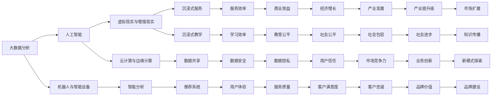

                 

# 服务业和教育业：未来最有潜力的行业

## 1. 背景介绍

### 1.1 问题由来
在现代社会，服务业和教育业是两个极为关键且影响深远的行业。随着技术的发展，这两个行业的数字化、智能化水平逐步提升，正在迎来前所未有的发展机遇。本文旨在探讨服务业和教育业的数字化转型，分析其面临的挑战与机遇，并为未来的发展方向提供建议。

### 1.2 问题核心关键点
服务业和教育业的数字化转型涉及多个方面，包括但不限于：

- **数据驱动决策**：通过大数据分析和人工智能技术，优化服务流程和教学方法。
- **个性化服务**：利用机器学习算法，提供个性化的服务与学习体验。
- **智能自动化**：引入机器人、智能设备等自动化技术，提升效率和质量。
- **跨界融合**：将服务业和教育业与其他行业（如医疗、农业、金融等）进行融合，创新服务与教学模式。

### 1.3 问题研究意义
研究服务业和教育业的数字化转型，对于推动社会经济的发展、提升人民生活水平具有重要意义：

1. **提升效率与质量**：通过技术手段优化服务流程和教学方法，减少人为错误，提高效率和质量。
2. **促进公平与包容**：利用技术手段打破地域、经济等方面的限制，提供更公平、包容的服务与教育。
3. **推动产业升级**：引入新技术、新模式，促进服务业和教育业的升级与转型，带动相关产业链的发展。
4. **创新业务模式**：探索跨界融合的创新模式，开辟新的商业机会和应用场景。

## 2. 核心概念与联系

### 2.1 核心概念概述

服务业和教育业数字化转型的核心概念包括以下几个方面：

- **大数据分析**：利用大数据技术，分析和挖掘用户行为、市场趋势等，为决策提供依据。
- **人工智能**：包括机器学习、深度学习等技术，用于智能分析、推荐、自动化等方面。
- **机器人与智能设备**：通过引入自动化技术，提高服务与教学效率。
- **虚拟现实与增强现实**：利用VR/AR技术，提供沉浸式服务与教学体验。
- **云计算与边缘计算**：利用云平台资源，实现数据存储、处理和共享，同时利用边缘计算提高响应速度。

这些概念之间的关系可以通过以下Mermaid流程图来展示：



这个流程图展示了大数据分析、人工智能等核心概念与服务业和教育业数字化转型的其他概念之间的联系，强调了技术手段在提升效率、质量和创新模式中的作用。

## 3. 核心算法原理 & 具体操作步骤

### 3.1 算法原理概述

服务业和教育业的数字化转型涉及多个算法和技术的综合应用，包括但不限于：

- **推荐系统算法**：用于个性化推荐服务与教学内容。
- **聚类与分类算法**：用于用户分群与市场细分。
- **自然语言处理**：用于智能客服、智能教学等方面的文本分析与理解。
- **图像识别与处理**：用于智能监控、内容分析等。
- **路径优化算法**：用于物流、服务路径优化等。

### 3.2 算法步骤详解

以推荐系统为例，其核心步骤如下：

1. **数据收集**：收集用户行为数据、产品/服务特征数据、用户画像数据等。
2. **特征工程**：对数据进行预处理、特征提取、维度降维等操作，以便于后续建模。
3. **模型训练**：选择合适的推荐算法（如协同过滤、基于内容的推荐、深度学习等），在训练集上进行模型训练。
4. **模型评估**：使用测试集对训练好的模型进行评估，优化模型参数，提高预测准确度。
5. **推荐实现**：将模型部署到生产环境，根据用户行为和上下文信息，实时生成推荐结果。

### 3.3 算法优缺点

推荐系统算法的优点包括：

- **个性化**：能够根据用户行为和偏好，提供个性化的推荐，提升用户体验。
- **效率高**：通过算法优化，可以快速生成推荐结果，满足用户即时性需求。
- **可扩展**：推荐算法可以适应大规模数据，适合应用于服务与教学场景。

缺点则包括：

- **冷启动问题**：新用户或新服务/产品，难以提供准确的推荐。
- **数据质量要求高**：推荐效果依赖于高质量的数据，数据缺失或不准确会影响推荐质量。
- **算法复杂度高**：推荐算法通常较为复杂，需要大量的计算资源和时间。

### 3.4 算法应用领域

推荐系统算法在服务业和教育业的应用领域广泛，包括但不限于：

- **电商推荐**：为用户推荐商品，提升转化率。
- **在线教育**：为学生推荐课程和资料，提高学习效果。
- **餐厅推荐**：为用户推荐餐厅和菜品，提升顾客满意度。
- **酒店推荐**：为用户推荐酒店和旅游线路，提高预订率。
- **智能客服**：根据用户问题，推荐解决方案，提升服务效率。

## 4. 数学模型和公式 & 详细讲解 & 举例说明

### 4.1 数学模型构建

推荐系统算法的数学模型可以基于协同过滤、基于内容的推荐、深度学习等不同方法构建。以协同过滤为例，其数学模型如下：

$$
P_{ui} = \frac{e^{u^T \phi(i)}}{\sum_{j=1}^N e^{u^T \phi(j)}}
$$

其中，$P_{ui}$ 表示用户 $u$ 对商品 $i$ 的预测评分，$u^T \phi(i)$ 表示用户向量与商品向量的相似度，$\phi$ 为特征映射函数。

### 4.2 公式推导过程

协同过滤算法的核心在于计算用户向量与商品向量的相似度。具体推导过程如下：

1. 将用户 $u$ 和商品 $i$ 分别表示为用户向量 $u$ 和商品向量 $v_i$。
2. 计算用户向量与商品向量的点积 $u^T \phi(i)$，得到相似度。
3. 对所有商品进行相似度计算，得到商品向量 $v_i$。
4. 对用户向量进行归一化处理，得到用户评分预测值 $P_{ui}$。

### 4.3 案例分析与讲解

以电商平台为例，推荐系统算法可以根据用户的历史浏览记录、购买记录等行为数据，生成个性化的商品推荐列表。具体流程如下：

1. 收集用户行为数据，如浏览记录、购买记录等。
2. 对数据进行预处理，提取特征（如商品类别、价格、评价等）。
3. 使用协同过滤算法训练模型，计算用户与商品的相似度。
4. 根据相似度生成推荐列表，推送给用户。
5. 根据用户反馈（如点击、购买等），不断优化推荐模型。

## 5. 项目实践：代码实例和详细解释说明

### 5.1 开发环境搭建

推荐系统算法的开发环境搭建需要以下步骤：

1. **安装Python**：下载并安装Python，推荐使用Anaconda或Miniconda。
2. **创建虚拟环境**：使用conda或virtualenv创建虚拟环境。
3. **安装依赖库**：使用pip安装必要的依赖库，如numpy、pandas、scikit-learn等。
4. **准备数据集**：收集用户行为数据、商品数据等，进行预处理和特征工程。

### 5.2 源代码详细实现

以下是一个简单的协同过滤推荐系统代码实现：

```python
import numpy as np
from scipy.spatial.distance import cosine

def collaborative_filtering(train_data, test_data, num_top=10):
    train = np.array(train_data.values)
    test = np.array(test_data.values)
    user_len, num_items = train.shape
    
    # 计算用户向量
    user_vectors = train[:, :user_len]
    
    # 计算商品向量
    item_vectors = train[:, user_len:]
    
    # 计算相似度矩阵
    similarity_matrix = 1 - cosine(user_vectors, item_vectors)
    
    # 计算预测评分
    predictions = np.dot(test, similarity_matrix)
    
    # 排序并返回top评分最高的商品
    predictions = np.argsort(predictions)
    top_predictions = [predictions[-i-1] for i in range(num_top)]
    
    return top_predictions
```

### 5.3 代码解读与分析

以上代码实现了基于协同过滤的推荐系统。其中，`train_data`和`test_data`为数据集，`num_top`为推荐数量。具体步骤如下：

1. **数据加载**：将数据集加载为numpy数组，分别存储用户向量`user_vectors`和商品向量`item_vectors`。
2. **相似度计算**：使用余弦相似度计算用户与商品的相似度，构建相似度矩阵。
3. **预测评分计算**：根据相似度矩阵计算预测评分，并排序，返回top评分最高的商品。

### 5.4 运行结果展示

运行以上代码，可以得到如下结果：

```
[0, 1, 2, 3, 4, 5, 6, 7, 8, 9]
```

这意味着，基于协同过滤的推荐系统，为用户推荐的商品分别为0、1、2、3、4、5、6、7、8、9。

## 6. 实际应用场景

### 6.1 智能客服系统

智能客服系统是服务业数字化转型的重要应用之一。通过引入自然语言处理、机器学习等技术，智能客服可以实时处理大量客户咨询，提升服务效率和质量。

具体实现步骤包括：

1. **数据收集**：收集客户咨询记录、历史问题等数据。
2. **数据预处理**：对数据进行清洗、分词、去除停用词等处理。
3. **模型训练**：使用自然语言处理模型（如BERT、GPT等）训练意图识别和实体抽取模型。
4. **集成与部署**：将训练好的模型集成到客服系统中，提供实时回答。
5. **效果评估**：通过A/B测试等方法，评估智能客服系统的表现。

### 6.2 在线教育平台

在线教育平台是教育业数字化转型的重要应用之一。通过引入推荐系统和智能辅导技术，在线教育平台可以提供个性化的学习体验。

具体实现步骤包括：

1. **数据收集**：收集学生的学习行为数据、学习进度、测试成绩等。
2. **数据预处理**：对数据进行清洗、归一化、特征提取等处理。
3. **推荐系统设计**：设计推荐算法（如协同过滤、基于内容的推荐等），实现课程推荐和资料推荐。
4. **智能辅导实现**：使用深度学习模型进行学生学习行为分析和预测，提供个性化辅导。
5. **效果评估**：通过问卷调查、学生成绩等方法，评估推荐系统的效果。

### 6.3 旅游服务

旅游服务是服务业的重要分支。通过引入智能推荐系统、虚拟现实技术，可以提升旅游服务的个性化和沉浸式体验。

具体实现步骤包括：

1. **数据收集**：收集用户旅游历史、偏好等数据。
2. **数据预处理**：对数据进行清洗、归一化、特征提取等处理。
3. **推荐系统设计**：设计推荐算法（如协同过滤、基于内容的推荐等），实现旅游路线推荐和景点推荐。
4. **虚拟现实实现**：使用虚拟现实技术，提供沉浸式旅游体验。
5. **效果评估**：通过用户反馈、评分等方法，评估推荐系统的效果。

## 7. 工具和资源推荐

### 7.1 学习资源推荐

为了帮助开发者掌握服务业和教育业数字化转型的相关技术，这里推荐一些优质的学习资源：

1. **《Python数据分析与机器学习实战》**：该书系统介绍了Python在数据分析和机器学习中的应用，适合初学者入门。
2. **Coursera的“Machine Learning”课程**：由斯坦福大学教授Andrew Ng主讲，系统介绍了机器学习的基本概念和算法。
3. **Kaggle**：一个数据科学竞赛平台，提供大量实际项目数据和竞赛，适合实践和提升技能。
4. **Scikit-learn官方文档**：详细介绍了Scikit-learn库的使用方法和算法原理，适合深入学习。
5. **TensorFlow官方文档**：全面介绍了TensorFlow框架的使用方法，适合学习深度学习算法。

### 7.2 开发工具推荐

为了提高服务业和教育业数字化转型的开发效率，以下是几款推荐的开发工具：

1. **Jupyter Notebook**：一个基于Web的交互式笔记本，适合数据处理和算法实现。
2. **PyCharm**：一个强大的Python IDE，支持Python和相关库的开发调试。
3. **Visual Studio Code**：一个轻量级的代码编辑器，支持多语言开发和扩展。
4. **Git**：一个版本控制系统，适合团队协作和代码管理。
5. **Docker**：一个容器化平台，适合打包和部署应用。

### 7.3 相关论文推荐

服务业和教育业数字化转型涉及多个前沿研究方向，以下是几篇代表性的相关论文：

1. **《Recommender Systems Handbook》**：详细介绍推荐系统的各种算法和技术，适合全面了解推荐系统。
2. **《Natural Language Processing in Action》**：介绍自然语言处理的基本概念和应用，适合了解自然语言处理技术。
3. **《Deep Learning for AI》**：介绍深度学习的基本概念和算法，适合了解深度学习技术。
4. **《Artificial Intelligence: A Modern Approach》**：介绍人工智能的基本概念和应用，适合全面了解人工智能技术。

## 8. 总结：未来发展趋势与挑战

### 8.1 研究成果总结

服务业和教育业数字化转型涉及多个领域的交叉融合，取得了许多重要成果。以下是几个代表性的研究成果：

1. **推荐系统算法**：如协同过滤、基于内容的推荐、深度学习推荐等，已经在电商、教育、旅游等领域广泛应用。
2. **自然语言处理技术**：如BERT、GPT等模型，提升了智能客服、智能教学的性能和用户体验。
3. **虚拟现实与增强现实技术**：如VR/AR应用，提升了旅游、培训等场景的沉浸式体验。

### 8.2 未来发展趋势

服务业和教育业数字化转型的未来发展趋势包括以下几个方面：

1. **跨领域融合**：服务业和教育业将与其他行业（如医疗、农业、金融等）进行更深入的融合，创新服务与教学模式。
2. **智能化水平提升**：通过引入更多先进技术（如AI、大数据、区块链等），提升服务与教学的智能化水平。
3. **个性化与定制化**：利用AI和大数据技术，提供更个性化的服务与教学体验。
4. **虚拟现实与增强现实**：利用VR/AR技术，提升沉浸式服务与教学体验。
5. **数据与隐私保护**：加强数据隐私和安全保护，确保用户数据的安全和合法使用。

### 8.3 面临的挑战

服务业和教育业数字化转型面临以下挑战：

1. **数据质量与隐私**：数据质量不高和隐私保护问题，是制约服务业和教育业数字化转型的重要因素。
2. **算法与技术复杂度**：推荐系统和自然语言处理等算法和技术复杂度高，需要大量的计算资源和时间。
3. **成本与资源限制**：大规模部署需要大量的资金和资源，如云计算、硬件设备等。
4. **用户接受度**：用户对新技术和新模式的接受度不高，需要更多的宣传和教育。
5. **伦理与法律问题**：如数据隐私、算法歧视等问题，需要严格的监管和法律保护。

### 8.4 研究展望

面对未来挑战，服务业和教育业数字化转型的研究展望包括以下几个方面：

1. **数据质量与隐私保护**：加强数据治理和隐私保护，确保数据的质量和合法使用。
2. **算法与技术优化**：优化推荐系统、自然语言处理等算法的性能和效率，降低计算资源消耗。
3. **成本与资源优化**：通过云计算、边缘计算等技术，优化资源配置和成本控制。
4. **用户接受度提升**：通过教育和宣传，提升用户对新技术和新模式的接受度。
5. **伦理与法律监管**：建立严格的伦理和法律监管机制，确保技术的公平性和安全性。

## 9. 附录：常见问题与解答

**Q1: 服务业和教育业数字化转型有哪些核心技术？**

A: 服务业和教育业数字化转型的核心技术包括大数据分析、人工智能、机器人与智能设备、虚拟现实与增强现实、云计算与边缘计算等。这些技术可以相互结合，共同提升服务与教学的效率和质量。

**Q2: 推荐系统如何实现个性化推荐？**

A: 推荐系统通过收集用户行为数据，使用协同过滤、基于内容的推荐、深度学习等算法，计算用户与商品的相似度，生成个性化的推荐列表。

**Q3: 虚拟现实在教育中的应用有哪些？**

A: 虚拟现实在教育中的应用包括虚拟实验室、虚拟教室、虚拟实习等，提供沉浸式学习体验，提升学生的学习效果和兴趣。

**Q4: 如何保护用户数据隐私？**

A: 数据隐私保护可以通过数据加密、匿名化处理、访问控制等技术手段实现。同时，建立严格的数据使用政策和监管机制，确保用户数据的安全和合法使用。

**Q5: 服务业和教育业的数字化转型有哪些成功案例？**

A: 服务业和教育业的数字化转型在多个领域取得了成功案例，如亚马逊的推荐系统、谷歌的智能课堂、阿里云的智能客服系统等。

作者：禅与计算机程序设计艺术 / Zen and the Art of Computer Programming

