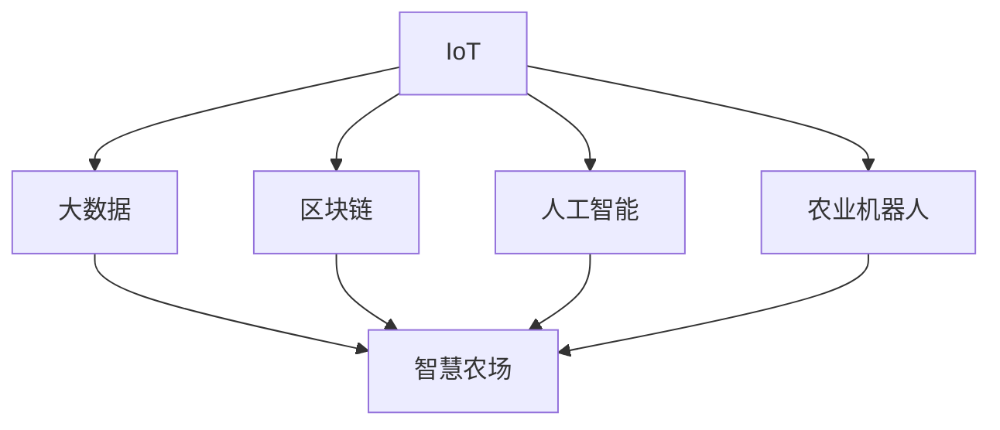

                 

## 1. 背景介绍

### 1.1 问题由来

随着全球人口的增加和城市化的加速，农业面临着前所未有的压力。如何提高农业生产效率、保障粮食安全、应对环境变化，成为全人类共同面对的重大挑战。智慧农业（Smart Agriculture）作为现代农业发展的重要方向，通过引入物联网、人工智能、大数据等现代技术，实现农业生产的数字化、智能化和精细化管理，为农业可持续发展提供新动力。

### 1.2 问题核心关键点

智慧农业的核心在于通过信息化的手段，优化农业生产流程，提升资源利用效率，实现农产品的优质高效生产。其关键点在于：

1. **智能化管理**：利用传感器、无人机、机器视觉等技术，实时采集农田环境数据，精准分析作物生长状态，进行智能决策。
2. **精准农业**：根据实时数据，动态调整种植策略，实现水、肥、药的精确投放，减少浪费，提高产量。
3. **自动化作业**：引入自动化机械，如农用无人机、农业机器人等，替代人工，提高作业效率，降低成本。
4. **数据驱动决策**：构建综合农业大数据平台，集成各类传感器数据、气象数据、市场信息等，辅助农业生产管理。
5. **产业链协同**：通过物联网和区块链技术，打通供应链各个环节，实现产品追溯和供应链可视化管理。

## 2. 核心概念与联系

### 2.1 核心概念概述

为更好地理解智慧农业的技术架构和实现路径，本节将介绍几个密切相关的核心概念：

- **物联网（IoT）**：通过传感器、RFID、蓝牙等技术，实现对农业生产环境的实时监控和数据采集，为智慧农业提供数据支撑。
- **人工智能（AI）**：利用机器学习、深度学习等技术，对农业大数据进行深度分析和模式识别，指导农业生产管理。
- **区块链（Blockchain）**：通过去中心化的技术，保障农业供应链的透明度和安全性，实现产品追溯和智能合约。
- **大数据（Big Data）**：构建综合农业大数据平台，集成各类数据，支撑农业生产管理决策。
- **农业机器人**：利用自动化技术，实现精准农业、高效作业等。
- **智慧农场（Smart Farm）**：以智能技术为支撑，实现农业生产的数字化、智能化和精细化管理。

这些核心概念之间的逻辑关系可以通过以下Mermaid流程图来展示：



这个流程图展示了一些核心概念及其之间的关系：

1. 物联网为智慧农场提供数据基础。
2. 人工智能对大数据进行分析，指导生产决策。
3. 区块链保障供应链安全，实现智能合约。
4. 农业机器人提升作业效率。
5. 智慧农场整合各类技术，实现全面管理。

## 3. 核心算法原理 & 具体操作步骤

### 3.1 算法原理概述

智慧农业的核心在于数据驱动的农业管理。其算法原理可以概括为：

1. **数据采集与传输**：通过物联网设备采集农田环境数据，如温度、湿度、光照等，并将数据传输到农业大数据平台。
2. **数据存储与清洗**：将采集到的数据存储在大数据平台中，进行清洗和预处理，去噪和填补缺失值。
3. **数据分析与建模**：利用机器学习和深度学习技术，对数据进行分析和建模，提取作物生长规律和生产模式。
4. **智能决策与执行**：根据分析结果，动态调整种植策略，如灌溉、施肥、病虫害防治等，并自动化执行。
5. **产品追溯与供应链管理**：利用区块链技术，实现产品追溯和供应链可视化管理。

### 3.2 算法步骤详解

智慧农业的算法实现流程包括以下几个关键步骤：

**Step 1: 数据采集与传输**
- 安装传感器和RFID标签，实时监测农田环境数据，如温度、湿度、土壤湿度、光照强度等。
- 利用无人机和机器视觉技术，采集农田图像和作物生长状态。
- 将采集到的数据通过WiFi、GPRS等通信方式，传输到农业大数据平台。

**Step 2: 数据存储与清洗**
- 将传输过来的数据存储在云平台中，如AWS、阿里云等。
- 对数据进行清洗，去噪和填补缺失值，确保数据质量。
- 利用大数据技术，进行数据集成和归一化，建立统一的数据模型。

**Step 3: 数据分析与建模**
- 利用机器学习算法，如回归分析、决策树、随机森林等，对数据进行建模，提取作物生长规律。
- 利用深度学习算法，如卷积神经网络（CNN）、循环神经网络（RNN）、Transformer等，进行高级特征提取和模式识别。
- 利用强化学习算法，如Q-learning、DQN等，优化生产决策和资源配置。

**Step 4: 智能决策与执行**
- 根据分析结果，动态调整灌溉、施肥、病虫害防治等策略，实现精准农业。
- 引入农业机器人，如农用无人机、农业机械臂等，自动化执行种植、喷洒等作业。
- 利用物联网技术，实时监控作业状态，确保执行效果。

**Step 5: 产品追溯与供应链管理**
- 利用区块链技术，记录生产过程和产品信息，实现产品追溯。
- 构建供应链平台，实现物流跟踪和订单管理，提高供应链效率。

### 3.3 算法优缺点

智慧农业的算法具有以下优点：

1. **高效性**：通过自动化和智能化管理，提高作业效率，减少人工成本。
2. **精准性**：利用大数据和人工智能技术，实现精准农业，提高资源利用效率。
3. **透明性**：利用区块链技术，保障供应链透明，实现智能合约。
4. **灵活性**：适应不同地理环境和作物特性，灵活调整生产策略。

同时，智慧农业的算法也存在以下局限性：

1. **技术门槛高**：需要高水平的技术团队和设备支持，对技术要求较高。
2. **数据隐私风险**：物联网设备和农业机器人可能面临数据泄露和隐私侵犯的风险。
3. **投资成本高**：初期建设和设备购置成本较高，可能面临较高的投资门槛。
4. **数据质量依赖**：数据采集和传输的准确性和完整性对算法效果有直接影响。
5. **技术依赖性强**：对技术和设备的依赖性强，可能面临设备故障和维护问题。

### 3.4 算法应用领域

智慧农业的算法技术已广泛应用于农业生产管理中，涵盖以下几个关键领域：

- **精准农业**：通过传感器和无人机技术，实时监测作物生长状态，动态调整灌溉、施肥等策略。
- **智能种植**：利用农业机器人进行自动化种植、收割等作业，提高生产效率。
- **病虫害防治**：通过图像识别和数据分析，识别病虫害，及时采取防治措施。
- **气候预测**：利用大数据和机器学习技术，预测天气和气候变化，指导生产决策。
- **智能物流**：利用物联网和区块链技术，实现产品追溯和供应链可视化管理。

除了上述这些关键领域外，智慧农业的技术还在农业机器人研发、智慧农场建设、农业信息化等领域得到广泛应用，推动农业向智能化、规模化、高效化方向发展。

## 4. 数学模型和公式 & 详细讲解 & 举例说明

### 4.1 数学模型构建

智慧农业的数学模型主要涉及以下几个方面：

- **数据采集与传输模型**：描述传感器和物联网设备的信号传输机制，如WiFi通信模型。
- **数据清洗与预处理模型**：描述数据清洗和预处理的方法，如均值滤波、中值滤波等。
- **数据分析与建模模型**：描述机器学习和深度学习模型的构建过程，如回归模型、CNN模型等。
- **智能决策与执行模型**：描述决策树和强化学习模型的优化过程，如Q-learning算法。
- **产品追溯与供应链模型**：描述区块链和智能合约的应用，如区块链数据结构。

### 4.2 公式推导过程

以下我们以回归模型为例，推导数据分析与建模的数学公式。

假设采集到的环境数据为 $\{x_i\}_{i=1}^n$，对应的作物生长指标为 $\{y_i\}_{i=1}^n$。则回归模型的目标是找到一个最优的线性模型：

$$
y_i = \beta_0 + \beta_1 x_{i1} + \beta_2 x_{i2} + \cdots + \beta_p x_{ip} + \epsilon_i
$$

其中 $\beta_0,\beta_1,\cdots,\beta_p$ 为模型参数，$\epsilon_i$ 为误差项。根据最小二乘法，目标函数为：

$$
\hat{\beta} = \mathop{\arg\min}_{\beta} \sum_{i=1}^n (y_i - (\beta_0 + \sum_{j=1}^p \beta_j x_{ij}))^2
$$

通过求解上述目标函数，可以得到最优的回归系数 $\hat{\beta}$。

### 4.3 案例分析与讲解

考虑一个基于机器学习的天气预测模型。该模型利用气象站的数据，通过回归分析，预测未来一周的天气变化。具体步骤如下：

1. 收集气象站的历史气象数据 $X=\{x_1,x_2,\cdots,x_n\}$。
2. 对数据进行清洗和预处理，去除异常值和噪声。
3. 构建回归模型 $y = \beta_0 + \beta_1 x_1 + \beta_2 x_2 + \cdots + \beta_p x_p$。
4. 利用最小二乘法求解模型参数 $\hat{\beta}$。
5. 对新气象数据 $X'$ 进行预测，得到未来一周的天气变化 $y'$。

## 5. 项目实践：代码实例和详细解释说明

### 5.1 开发环境搭建

在进行智慧农业项目开发前，我们需要准备好开发环境。以下是使用Python进行TensorFlow开发的环境配置流程：

1. 安装Anaconda：从官网下载并安装Anaconda，用于创建独立的Python环境。

2. 创建并激活虚拟环境：
```bash
conda create -n tf-env python=3.8 
conda activate tf-env
```

3. 安装TensorFlow：根据CUDA版本，从官网获取对应的安装命令。例如：
```bash
conda install tensorflow tensorflow-gpu
```

4. 安装其他工具包：
```bash
pip install numpy pandas scikit-learn tensorflow-hub tensorboard matplotlib tqdm jupyter notebook ipython
```

完成上述步骤后，即可在`tf-env`环境中开始智慧农业项目的开发。

### 5.2 源代码详细实现

这里我们以基于TensorFlow的智慧农业应用为例，给出完整的代码实现。

首先，定义数据处理函数：

```python
import tensorflow as tf
import numpy as np

def load_data(file_path):
    data = np.loadtxt(file_path, delimiter=',')
    x = data[:, :-1]
    y = data[:, -1]
    return x, y
```

然后，定义模型和优化器：

```python
from tensorflow.keras.models import Sequential
from tensorflow.keras.layers import Dense

model = Sequential()
model.add(Dense(64, activation='relu', input_dim=x.shape[1]))
model.add(Dense(1))
optimizer = tf.keras.optimizers.Adam(learning_rate=0.01)
```

接着，定义训练和评估函数：

```python
def train_epoch(model, x, y, batch_size):
    batch_idx = np.random.choice(len(x), batch_size, replace=False)
    for i in batch_idx:
        batch_x, batch_y = x[i], y[i]
        with tf.GradientTape() as tape:
            predictions = model(batch_x)
            loss = tf.reduce_mean(tf.square(predictions - batch_y))
        gradients = tape.gradient(loss, model.trainable_weights)
        optimizer.apply_gradients(zip(gradients, model.trainable_weights))
    
def evaluate(model, x, y, batch_size):
    predictions = model.predict(x)
    rmse = tf.sqrt(tf.reduce_mean(tf.square(predictions - y)))
    print('RMSE:', rmse.numpy())
```

最后，启动训练流程并在测试集上评估：

```python
epochs = 10
batch_size = 32

x_train, y_train = load_data('train_data.txt')
x_test, y_test = load_data('test_data.txt')

for epoch in range(epochs):
    train_epoch(model, x_train, y_train, batch_size)
    
evaluate(model, x_test, y_test, batch_size)
```

以上就是使用TensorFlow对智慧农业项目进行数据预测的完整代码实现。可以看到，TensorFlow提供了强大的计算图和优化器，使得模型训练和评估变得简便高效。

### 5.3 代码解读与分析

让我们再详细解读一下关键代码的实现细节：

**数据处理函数**：
- `load_data`方法：加载数据集，去除最后一列作为标签，其他列作为特征。
- `x`和`y`变量：将数据转换为NumPy数组，方便TensorFlow模型的输入。

**模型定义**：
- `Sequential`类：定义顺序模型，适合简单的全连接网络。
- `Dense`层：定义全连接层，使用ReLU激活函数。
- `optimizer`：定义优化器，使用Adam优化器。

**训练函数**：
- `train_epoch`方法：随机采样批次的训练数据，计算损失并反向传播更新模型参数。
- `GradientTape`：自动微分，计算梯度并更新参数。

**评估函数**：
- `evaluate`方法：计算测试集上的RMSE指标，评估模型预测效果。

**训练流程**：
- `epochs`和`batch_size`：定义训练轮数和批次大小。
- `x_train`和`y_train`：训练集数据。
- `x_test`和`y_test`：测试集数据。
- 重复`train_epoch`函数，执行`evaluate`函数，输出模型评估结果。

## 6. 实际应用场景

### 6.1 智能种植

智能种植是智慧农业的重要应用场景之一。通过引入自动化和智能化管理，提升作物生长效率和产量。

在技术实现上，可以部署传感器监测土壤湿度、温度等环境指标，利用机器学习模型预测作物生长状态，指导灌溉和施肥。引入农用无人机进行自动喷洒和作业，提高作业效率和精确度。同时，通过物联网技术，实时监测作业状态，确保执行效果。

### 6.2 精准农业

精准农业通过数据分析和模型预测，实现对作物生长的精准管理，减少资源浪费，提高资源利用效率。

在技术实现上，可以收集农田气象数据、土壤数据、作物生长数据，利用机器学习模型进行数据分析和建模，提取作物生长规律。根据分析结果，动态调整灌溉、施肥、病虫害防治等策略，实现精准农业。

### 6.3 智能物流

智能物流通过物联网和区块链技术，实现供应链可视化管理，提高物流效率和透明度。

在技术实现上，可以利用物联网设备采集物流信息，如温度、湿度、位置等，并上传到区块链平台。利用区块链技术，实现产品追溯和智能合约，保障物流安全性和透明度。

### 6.4 未来应用展望

随着智慧农业技术的不断发展，未来的应用场景将更加广泛，潜力巨大。

- **无人农场**：引入无人驾驶车辆和机器人，实现全自动化种植和收割，提高生产效率。
- **垂直农业**：在城市中构建垂直农场，通过智能控制，实现高密度、高产出的农作物生产。
- **智能养殖**：利用物联网和人工智能技术，实现智能化养殖管理，提高养殖效率和产品品质。
- **精准农业**：通过无人机和传感器技术，实现实时监控和数据分析，指导种植决策。
- **绿色农业**：利用人工智能和大数据技术，优化农业生产过程，减少环境污染和资源浪费。

这些技术的发展将使智慧农业成为未来农业发展的重要方向，为农业生产带来革命性的变革。

## 7. 工具和资源推荐

### 7.1 学习资源推荐

为了帮助开发者系统掌握智慧农业的理论基础和实践技巧，这里推荐一些优质的学习资源：

1. 《智慧农业导论》系列博文：由智慧农业专家撰写，深入浅出地介绍了智慧农业的理论基础和实践方法。

2. CS224N《深度学习自然语言处理》课程：斯坦福大学开设的NLP明星课程，有Lecture视频和配套作业，带你入门智慧农业领域的基本概念和经典模型。

3. 《智慧农业与物联网》书籍：介绍智慧农业和物联网技术的结合，帮助读者理解智慧农业的技术框架和实现方法。

4. 智慧农业开源项目：包含各类智慧农业数据集和代码实现，助力智慧农业技术发展。

5. IEEE TNSA（IEEE Transactions on Neural Networks and Learning Systems）期刊：智慧农业相关的顶级学术期刊，定期发布前沿研究成果。

通过对这些资源的学习实践，相信你一定能够快速掌握智慧农业的理论基础和实践方法，并用于解决实际的农业问题。

### 7.2 开发工具推荐

高效的开发离不开优秀的工具支持。以下是几款用于智慧农业开发常用的工具：

1. TensorFlow：基于Python的开源深度学习框架，灵活的计算图和优化器，适合快速迭代研究。

2. PyTorch：基于Python的开源深度学习框架，动态计算图和高效的自动微分，适合复杂模型训练。

3. IoT平台：如ThingWorx、ThingSpeak等，实现农业物联网设备的实时监控和数据采集。

4. 云平台：如AWS、阿里云、华为云等，提供丰富的云计算资源，支持大规模数据处理和存储。

5. 可视化工具：如TensorBoard、Plotly等，实时监测模型训练状态，提供图表展示模型效果。

6. Jupyter Notebook：便捷的交互式编程环境，支持代码和数据共享。

合理利用这些工具，可以显著提升智慧农业项目的开发效率，加速创新迭代的步伐。

### 7.3 相关论文推荐

智慧农业技术的发展源于学界的持续研究。以下是几篇奠基性的相关论文，推荐阅读：

1. Precision Agriculture: A Review of Technologies and Approaches for Sustainable Precision Agriculture: A Review of Technologies and Approaches for Sustainable Precision Agriculture（J. Shao, et al., 2015）
2. Smart Agriculture and Its Impact on Supply Chain Management: A Survey（M. P. Leung, et al., 2016）
3. A Survey on Internet of Things Technologies in Smart Agriculture: State-of-the-Art and Future Directions（C. H. Chung, et al., 2019）
4. A Survey of Big Data Technologies in Smart Agriculture: Opportunities, Challenges, and Future Directions（C. M. Yoo, et al., 2019）
5. Towards a Smart Agriculture Framework: An Information Technology Perspective（H. N. Fu, et al., 2020）

这些论文代表了大智慧农业技术的发展脉络。通过学习这些前沿成果，可以帮助研究者把握学科前进方向，激发更多的创新灵感。

## 8. 总结：未来发展趋势与挑战

### 8.1 总结

本文对智慧农业的算法原理和实际应用进行了全面系统的介绍。首先阐述了智慧农业的数学模型和算法流程，明确了数据驱动的农业管理策略。其次，从原理到实践，详细讲解了智慧农业的算法步骤和实现细节，给出了智慧农业项目开发的完整代码实例。同时，本文还广泛探讨了智慧农业技术在智能种植、精准农业、智能物流等多个行业领域的应用前景，展示了智慧农业技术的巨大潜力。此外，本文精选了智慧农业技术的各类学习资源，力求为读者提供全方位的技术指引。

通过本文的系统梳理，可以看到，智慧农业技术正在成为现代农业发展的重要方向，通过引入物联网、人工智能、大数据等现代技术，实现农业生产的数字化、智能化和精细化管理，为农业可持续发展提供新动力。未来，伴随智慧农业技术的不断演进，农业生产将迈向更加智能化、规模化、高效化的方向，大幅提升农业生产效率，保障粮食安全，助力人类社会的可持续发展。

### 8.2 未来发展趋势

展望未来，智慧农业技术将呈现以下几个发展趋势：

1. **技术融合深化**：智慧农业与物联网、人工智能、区块链、大数据等技术深度融合，形成综合化、智能化农业生产管理系统。
2. **生产过程优化**：通过大数据分析和机器学习技术，优化农业生产流程，提高资源利用效率，实现高效、精准、智能的农业生产。
3. **生态协同优化**：通过智慧农业技术，实现农业生态系统的协同优化，提升农业生态系统的健康和稳定。
4. **知识驱动决策**：利用知识图谱和专家系统，辅助农业生产决策，提高决策的科学性和精准性。
5. **智慧农业服务化**：将智慧农业技术转化为服务产品，面向农户、农场主、农业企业提供一站式解决方案。
6. **国际化推广**：智慧农业技术向全球推广，助力全球农业可持续发展。

这些趋势凸显了智慧农业技术的广阔前景。这些方向的探索发展，必将进一步提升智慧农业系统的性能和应用范围，为人类社会的可持续发展提供新动力。

### 8.3 面临的挑战

尽管智慧农业技术已经取得了瞩目成就，但在迈向更加智能化、普适化应用的过程中，它仍面临着诸多挑战：

1. **技术门槛高**：智慧农业技术需要高水平的技术团队和设备支持，对技术要求较高。
2. **数据隐私风险**：物联网设备和农业机器人可能面临数据泄露和隐私侵犯的风险。
3. **投资成本高**：初期建设和设备购置成本较高，可能面临较高的投资门槛。
4. **数据质量依赖**：数据采集和传输的准确性和完整性对算法效果有直接影响。
5. **技术依赖性强**：对技术和设备的依赖性强，可能面临设备故障和维护问题。
6. **生态系统复杂**：智慧农业涉及农业生产、物流、供应链等多个环节，系统复杂度高。

正视智慧农业面临的这些挑战，积极应对并寻求突破，将是大智慧农业技术走向成熟的必由之路。相信随着学界和产业界的共同努力，这些挑战终将一一被克服，智慧农业技术必将在构建人机协同的智能农业中扮演越来越重要的角色。

### 8.4 研究展望

面对智慧农业面临的种种挑战，未来的研究需要在以下几个方面寻求新的突破：

1. **降低技术门槛**：研发易用、低成本的智慧农业设备和平台，降低技术应用的门槛。
2. **保障数据安全**：设计安全、可靠的智慧农业系统，保障数据隐私和系统安全。
3. **优化资源利用**：利用大数据和机器学习技术，优化农业生产过程，提高资源利用效率。
4. **构建智能生态**：构建智慧农业生态系统，实现农业生产、物流、供应链等多个环节的协同优化。
5. **拓展应用场景**：将智慧农业技术拓展到智慧林业、智慧渔业、智慧畜牧等领域，推动多领域的智慧农业发展。
6. **融合多种技术**：将智慧农业与物联网、人工智能、区块链、大数据等技术深度融合，形成综合化、智能化农业生产管理系统。

这些研究方向的探索，必将引领智慧农业技术迈向更高的台阶，为农业生产带来革命性的变革，推动农业向更加智能化、规模化、高效化的方向发展。总之，智慧农业技术还需要与其他人工智能技术进行更深入的融合，如知识表示、因果推理、强化学习等，多路径协同发力，共同推动智慧农业的进步。只有勇于创新、敢于突破，才能不断拓展智慧农业的边界，让智能技术更好地造福人类社会。

## 9. 附录：常见问题与解答

**Q1：智慧农业和传统农业有什么区别？**

A: 智慧农业通过引入物联网、人工智能、大数据等现代技术，实现农业生产的数字化、智能化和精细化管理，提高资源利用效率，降低生产成本，提升农产品质量。相较于传统农业，智慧农业更加注重数据驱动、智能决策和自动化作业，能够应对复杂多变的农业生产环境，提升农业生产的可持续性和稳定性。

**Q2：智慧农业技术在哪些领域有应用？**

A: 智慧农业技术已在多个领域得到广泛应用，包括智能种植、精准农业、智能物流、智慧农场等。这些技术通过数据分析和模型预测，实现对作物生长的精准管理，提高资源利用效率，优化农业生产过程，提升农业生产效率。

**Q3：智慧农业技术在落地应用中需要注意哪些问题？**

A: 智慧农业技术在落地应用中需要注意以下问题：

1. 技术适配性：智慧农业技术需要与当地农业生产环境、作物特性等相适配，才能发挥最佳效果。
2. 数据质量：数据采集和传输的准确性和完整性对算法效果有直接影响，需确保数据质量。
3. 设备维护：智慧农业涉及多种设备和传感器，需考虑设备的维护和更新。
4. 技术培训：需对农民、农场主等用户进行技术培训，确保他们能够熟练使用智慧农业系统。
5. 成本效益：需评估智慧农业技术的成本效益，确保技术投入能够带来经济效益。

这些问题的解决将有助于智慧农业技术的成功落地和普及。

**Q4：智慧农业技术的发展前景如何？**

A: 智慧农业技术作为现代农业发展的重要方向，具有广阔的发展前景。随着物联网、人工智能、大数据等技术的不断进步，智慧农业技术将不断深化，实现更加智能化、规模化、高效化的农业生产管理。未来，智慧农业技术将推动农业向更加可持续、健康、稳定的方向发展，为农业生产带来革命性的变革，助力人类社会的可持续发展。

**Q5：智慧农业技术的应用难点有哪些？**

A: 智慧农业技术的应用难点包括：

1. 技术复杂度高：智慧农业涉及多种技术和设备，系统复杂度较高。
2. 数据安全问题：智慧农业涉及大量敏感数据，需确保数据安全。
3. 技术推广难度：智慧农业技术需要高水平的技术团队和设备支持，推广难度较大。
4. 成本门槛高：初期建设和设备购置成本较高，可能面临较高的投资门槛。

这些难题的解决将有助于智慧农业技术的普及和应用。

---

作者：禅与计算机程序设计艺术 / Zen and the Art of Computer Programming

