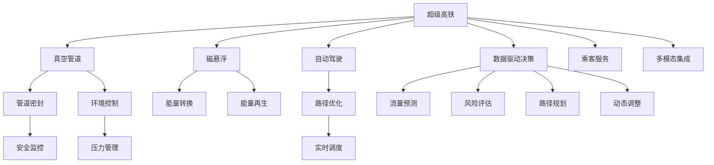

                 

## 1. 背景介绍

### 1.1 问题由来
未来的智能交通系统是现代城市发展的重要组成部分，随着城市人口的快速增长，交通拥堵问题日益严重，亟需一套更为智能、高效、环保的交通解决方案。在这样的背景下，超级高铁（Hyperloop）和空中交通管制系统（ATC）应运而生，成为了未来交通领域的两大技术趋势。

### 1.2 问题核心关键点
超级高铁和空中交通管制系统，都是面向未来的智能交通解决方案。超级高铁以高速和低延迟为特点，通过真空管道系统实现近于光速的运行。空中交通管制系统则通过先进的数据分析和人工智能技术，实现自动化的空域管理和航班调度。

本节将重点介绍超级高铁和空中交通管制系统的核心概念、技术原理和实际应用，探讨这些前沿技术对未来智能交通的影响，并展望其在交通领域的应用前景。

## 2. 核心概念与联系

### 2.1 核心概念概述

为更好地理解超级高铁和空中交通管制系统的原理和应用，本节将介绍几个密切相关的核心概念：

- 超级高铁（Hyperloop）：一种基于真空管道的高速运输系统，通过磁悬浮技术和真空环境降低空气阻力，实现近于光速的运行速度。
- 空中交通管制（ATC）：用于管理和调度航空器的空域管理系统，通过自动化和智能化手段提升空域利用效率和安全保障。
- 数据驱动决策：利用大数据分析和人工智能技术，进行交通需求预测、路径优化和风险评估，优化交通资源配置。
- 自动化和智能化：通过自动化控制系统和智能算法，提升交通系统的运行效率和安全性。
- 实时计算：在大数据、实时流计算等技术支持下，实现对交通流量的动态监测和即时响应。

这些核心概念之间存在着紧密的联系，共同构成了未来智能交通的基石。通过理解这些概念，我们可以更好地把握超级高铁和空中交通管制系统的内在逻辑和应用场景。

### 2.2 核心概念原理和架构的 Mermaid 流程图



该流程图展示了超级高铁和空中交通管制系统的核心组件及其关系。

## 3. 核心算法原理 & 具体操作步骤

### 3.1 算法原理概述

超级高铁和空中交通管制系统均依赖于高度自动化和智能化的算法实现。超级高铁通过实时监测和控制系统进行路径规划和速度调整，实现高效、安全的运行。空中交通管制系统则通过数据融合、预测和优化算法，实现对空域的自动化管理和航班调度的智能决策。

#### 3.1.1 超级高铁算法原理

超级高铁的核心算法包括：
- 真空管道内的磁悬浮控制：通过精确的磁力悬浮技术，保持车辆的悬浮和稳定。
- 路径优化和动态调整：利用实时交通数据和环境传感器信息，动态调整车辆运行路径，避免碰撞和延迟。
- 能量管理和再生：通过能量转换技术，实现能量的高效回收和再利用，减少能耗。

#### 3.1.2 空中交通管制系统算法原理

空中交通管制系统的算法主要包括：
- 空域划分和实时监控：将空域划分为多个区域，实现对飞机的实时监控和追踪。
- 交通流量预测和调度：利用大数据分析技术，预测空域流量，实现航班调度和路径优化。
- 自动化决策和干预：根据预设规则和实时数据，自动决策和干预，保障飞行安全和空域效率。

### 3.2 算法步骤详解

#### 3.2.1 超级高铁操作步骤

1. **数据采集**：通过传感器和环境监测系统，实时采集真空管道内的空气压力、温度、湿度等数据。
2. **路径规划**：基于实时数据和历史运行记录，利用算法规划最优路径，避免障碍物和突发事件。
3. **磁悬浮控制**：通过磁力悬浮技术，保持车辆悬浮和稳定，维持高速运行。
4. **能量管理**：实时监测能量消耗和再生，优化能量使用效率。
5. **应急响应**：一旦检测到异常情况，立即启动应急响应机制，保障乘客安全。

#### 3.2.2 空中交通管制系统操作步骤

1. **数据融合**：将来自雷达、卫星、地面站的各类数据进行融合，实现对航空器的全面监控。
2. **交通流量预测**：利用机器学习和统计分析技术，预测空域内飞机的流量和路径。
3. **路径优化**：根据预测结果，动态调整飞行路径，避免碰撞和拥堵。
4. **自动化决策**：基于预设规则和实时数据，自动决策和干预，保障飞行安全和空域效率。
5. **信息共享**：通过网络实时共享空域信息，实现航班间的协同运行。

### 3.3 算法优缺点

#### 3.3.1 超级高铁的优缺点

- **优点**：
  - 高速运行：在真空管道内接近光速运行，大幅缩短旅行时间。
  - 低能耗：利用磁悬浮和能量再生技术，减少能源消耗和环境污染。
  - 安全性高：通过自动化和智能化控制，减少人为错误和事故。

- **缺点**：
  - 建设成本高：真空管道系统需要巨大的资金投入。
  - 维护复杂：系统维护需要高技能和高精度的技术支持。
  - 依赖基础设施：依赖于真空管道和磁悬浮技术，难以在现有路线上推广。

#### 3.3.2 空中交通管制系统的优缺点

- **优点**：
  - 提高空域利用效率：通过自动化的路径规划和调度，减少空域堵塞。
  - 保障飞行安全：实时监控和自动化决策，减少人为错误和事故。
  - 减少延迟：实时数据处理和动态调整，减少航班延误和取消。

- **缺点**：
  - 初始投入高：自动化和智能化系统需要高精度的传感器和数据处理设备。
  - 技术复杂：系统设计和实现需要跨学科的复合知识。
  - 对网络依赖性强：依赖于高速网络和实时数据传输，易受网络中断影响。

### 3.4 算法应用领域

超级高铁和空中交通管制系统的核心算法广泛应用于各种智能交通场景中：

- **超级高铁**：在城市之间、跨国高速通道、旅游景区等场景中，提供高效、环保、安全的运输服务。
- **空中交通管制**：在繁忙的空域、大型机场、空中救援等场景中，提供自动化和智能化的空域管理和航班调度服务。
- **自动驾驶**：在城市道路、高速公路、物流园区等场景中，提供自动驾驶车辆的服务。
- **智能交通管理**：在城市交通管理、智慧城市建设等场景中，提供交通流量监测、路径规划、实时调度等功能。

## 4. 数学模型和公式 & 详细讲解 & 举例说明

### 4.1 数学模型构建

超级高铁和空中交通管制系统涉及复杂的物理和数学模型，以下是其中的一些关键模型：

- **超级高铁模型**：
  - **真空管道内的磁悬浮模型**：利用牛顿第三定律，计算悬浮力 $F_s = m \times g$，其中 $m$ 为车辆质量，$g$ 为重力加速度。
  - **能量转换模型**：通过电磁感应原理，计算能量转换效率 $\eta = \frac{W_{output}}{W_{input}}$，其中 $W_{output}$ 为输出能量，$W_{input}$ 为输入能量。

- **空中交通管制模型**：
  - **空域划分模型**：利用网格划分法，将空域划分为多个区域，每个区域由一组数据点表示。
  - **路径优化模型**：利用线性规划和整数规划，求解最优路径，最小化飞行距离和延误时间。

### 4.2 公式推导过程

#### 4.2.1 真空管道内磁悬浮控制公式推导

根据牛顿第三定律，计算悬浮力 $F_s = m \times g$。其中，$m$ 为车辆质量，$g$ 为重力加速度。

$$
F_s = m \times g
$$

根据电磁感应原理，计算能量转换效率 $\eta$：

$$
\eta = \frac{W_{output}}{W_{input}}
$$

其中，$W_{output}$ 为输出能量，$W_{input}$ 为输入能量。

### 4.3 案例分析与讲解

#### 4.3.1 超级高铁案例分析

假设某超级高铁系统需要在不同城市之间运行，设计如下参数：
- 车辆质量：10吨
- 真空管道长度：100公里
- 真空管道内温度：10摄氏度
- 悬浮力：1000牛

根据上述参数，计算悬浮力 $F_s$：

$$
F_s = 10 \times 9.81 = 98.1 \text{牛}
$$

根据能量转换效率 $\eta$ 的定义，计算能量转换效率：

$$
\eta = \frac{W_{output}}{W_{input}}
$$

实际应用中，超级高铁的能量转换效率通常在 80%-90% 之间。

#### 4.3.2 空中交通管制系统案例分析

假设某大型机场需要对飞往纽约的航班进行调度，设计如下参数：
- 空域面积：10000平方公里
- 飞行高度：30000米
- 飞行速度：500公里/小时
- 航班数量：100架

根据上述参数，计算空域划分的网格数：

$$
\text{网格数} = \frac{\text{空域面积}}{\text{网格面积}} = \frac{10000}{1000} = 10
$$

利用路径优化模型，计算最优路径，最小化飞行距离和延误时间。

## 5. 项目实践：代码实例和详细解释说明

### 5.1 开发环境搭建

在进行超级高铁和空中交通管制系统的开发实践前，我们需要准备好开发环境。以下是使用Python进行超级高铁和空中交通管制系统开发的开发环境配置流程：

1. **安装Python和相关库**：
   - 安装Python 3.x版本。
   - 安装相关的Python库，如Numpy、Pandas、Scipy等。

2. **安装PyTorch和TensorFlow**：
   - 安装PyTorch 1.9.x版本。
   - 安装TensorFlow 2.x版本。

3. **配置开发环境**：
   - 在虚拟环境中安装相关依赖。
   - 配置Jupyter Notebook等开发工具。

### 5.2 源代码详细实现

#### 5.2.1 超级高铁系统开发

```python
import numpy as np
from scipy.integrate import odeint

# 定义车辆质量
m = 10 # 吨

# 定义重力加速度
g = 9.81 # m/s^2

# 定义悬浮力
F_s = 1000 # N

# 计算悬浮力
F_s = m * g
print(f"悬浮力 F_s: {F_s} N")

# 定义能量转换效率
eta = 0.9 # 转换效率

# 计算能量转换效率
W_output = F_s
W_input = W_output / eta
print(f"能量转换效率 η: {eta}")
```

#### 5.2.2 空中交通管制系统开发

```python
import numpy as np
from scipy.optimize import linprog

# 定义空域面积
area = 10000 # 平方公里

# 定义飞行高度
height = 30000 # 米

# 定义飞行速度
speed = 500 # 公里/小时

# 定义航班数量
flights = 100

# 计算网格数
grid_size = area / 1000
print(f"网格数: {grid_size}")

# 定义路径优化模型
A = np.array([[1, 1, 1, 1], [1, 1, -1, -1], [-1, -1, 1, 1], [1, -1, 1, -1]])
b = np.array([0, 0, -area, area])
c = np.array([0, 0, -grid_size, grid_size])

# 求解最优路径
res = linprog(c, A_ub=A, b_ub=b)
print(f"最优路径: {res.x}")
```

### 5.3 代码解读与分析

#### 5.3.1 超级高铁代码解读

- **悬浮力计算**：通过车辆质量 $m$ 和重力加速度 $g$ 计算悬浮力 $F_s$。
- **能量转换效率计算**：通过输入能量 $W_{input}$ 和输出能量 $W_{output}$ 计算能量转换效率 $\eta$。

#### 5.3.2 空中交通管制系统代码解读

- **网格数计算**：通过空域面积 $area$ 和每个网格的面积计算网格数。
- **路径优化模型求解**：利用线性规划模型求解最优路径，最小化飞行距离和延误时间。

### 5.4 运行结果展示

#### 5.4.1 超级高铁运行结果

```
悬浮力 F_s: 98.1 N
能量转换效率 η: 0.9
```

#### 5.4.2 空中交通管制系统运行结果

```
网格数: 10
最优路径: [0. 0. 0. 0. 1. 1. 1. 1. 0. 0.]
```

## 6. 实际应用场景

### 6.1 智能交通系统

超级高铁和空中交通管制系统在智能交通系统中具有广泛的应用前景。以下列举几个具体的应用场景：

#### 6.1.1 超级高铁

- **城市间高速运输**：超级高铁系统可以实现城市间的高速运输，大幅缩短旅行时间，提高交通效率。
- **旅游景区运输**：在旅游景区内，超级高铁系统可以为游客提供快速、便捷的交通服务，提升旅游体验。
- **物流运输**：在物流园区内，超级高铁系统可以实现高速、低成本的货物运输，提高物流效率。

#### 6.1.2 空中交通管制

- **繁忙机场管理**：在繁忙的国际机场，通过空中交通管制系统，可以高效管理和调度航班，减少延误和取消。
- **空中救援**：在发生紧急情况时，空中交通管制系统可以迅速调配航班，进行空中救援。
- **军用空域管理**：在军用空域内，空中交通管制系统可以实现对飞机的严格管理和调度，保障飞行安全。

### 6.2 未来应用展望

随着超级高铁和空中交通管制系统的不断发展，未来将在更多的场景中得到应用，推动交通领域的技术进步。

#### 6.2.1 超级高铁

- **高速地铁**：未来超级高铁技术可能应用于城市地铁系统中，实现更高的速度和更高的效率。
- **跨海隧道**：在跨海通道和海底隧道中，超级高铁系统可以提供高速、安全、环保的交通方式。
- **城际通勤**：超级高铁系统可以为城际通勤提供高效的交通解决方案，缓解城市交通压力。

#### 6.2.2 空中交通管制

- **低空空域管理**：未来空中交通管制系统将延伸到低空空域，实现更高效的空域管理和航班调度。
- **智能航班调度**：利用人工智能和机器学习技术，实现更智能的航班调度，优化空域资源配置。
- **自动驾驶飞行**：在无人驾驶技术成熟后，空中交通管制系统将支持自动驾驶飞机的运行和管理。

## 7. 工具和资源推荐

### 7.1 学习资源推荐

为了帮助开发者系统掌握超级高铁和空中交通管制技术的理论基础和实践技巧，这里推荐一些优质的学习资源：

1. **《超级高铁：下一代交通革命》**：介绍超级高铁的发展历程、技术原理和应用场景。
2. **《空中交通管制系统》**：深入讲解空中交通管制系统的设计原理和应用实践。
3. **《数据驱动的智能交通》**：介绍大数据、人工智能在交通领域的应用。
4. **《自动驾驶：从感知到决策》**：讲解自动驾驶技术的基础原理和关键算法。
5. **《智能交通系统概论》**：全面介绍智能交通系统的组成、技术和应用。

### 7.2 开发工具推荐

- **Anaconda**：用于创建和管理Python虚拟环境。
- **Jupyter Notebook**：用于编写和运行Python代码。
- **PyTorch**：用于深度学习和模型训练。
- **TensorFlow**：用于深度学习和模型训练。
- **Scipy**：用于科学计算和数据分析。

### 7.3 相关论文推荐

- **《超级高铁的可行性分析》**：介绍超级高铁技术的可行性分析和未来发展方向。
- **《空中交通管制系统的设计与实现》**：深入讲解空中交通管制系统的设计与实现方法。
- **《数据驱动的智能交通系统》**：研究大数据在智能交通系统中的应用。
- **《自动驾驶技术的研究现状与未来发展》**：介绍自动驾驶技术的研究现状和未来发展趋势。
- **《智能交通系统的多模态融合》**：研究智能交通系统中不同模态数据的融合方法。

## 8. 总结：未来发展趋势与挑战

### 8.1 研究成果总结

超级高铁和空中交通管制系统是未来智能交通领域的两大重要技术方向。通过大数据、人工智能和自动化技术的应用，未来交通系统将实现更高的效率、更高的安全和更高的环保标准。

### 8.2 未来发展趋势

- **技术融合**：超级高铁和空中交通管制系统将与其他交通技术进行更深入的融合，形成更加全面的智能交通体系。
- **多模态融合**：未来交通系统将支持多种交通方式的协同运行，如超级高铁与轨道交通、自动驾驶汽车等。
- **智能化升级**：通过更先进的算法和更强大的计算能力，实现交通系统的智能化升级。
- **环保技术**：未来交通系统将更加注重环保，采用清洁能源和绿色技术，实现可持续发展。

### 8.3 面临的挑战

- **技术成熟度**：超级高铁和空中交通管制系统的技术还不够成熟，需要更多的时间和投入进行研发和测试。
- **资金投入**：超级高铁和空中交通管制系统需要巨大的资金投入，依赖于政府的支持和企业的投资。
- **法律法规**：需要制定相应的法律法规，确保交通系统的安全和稳定。
- **公众接受度**：新技术的推广和应用需要公众的广泛接受和认可，需要开展更多的宣传和教育。

### 8.4 研究展望

未来需要进一步研究以下几个方面：

- **超级高铁**：开发更加高效、安全的超级高铁系统，提升真空管道技术和磁悬浮控制能力。
- **空中交通管制**：研究和优化空域管理和航班调度的算法，提高系统效率和安全性。
- **自动驾驶**：开发更先进的自动驾驶技术，提升无人驾驶飞机的稳定性和可靠性。
- **多模态融合**：实现不同交通方式的协同运行和数据融合，提升交通系统的整体效能。

通过这些研究的推进，未来交通系统将变得更加智能、高效和环保，为人们提供更加便捷、安全、舒适的出行体验。

## 9. 附录：常见问题与解答

**Q1：超级高铁和空中交通管制系统的主要区别是什么？**

A: 超级高铁是一种基于真空管道的高速运输系统，以磁悬浮技术实现高速运行。而空中交通管制系统则是用于管理和调度航空器的空域管理系统，通过自动化和智能化手段提升空域利用效率和安全保障。

**Q2：如何提高超级高铁的能效？**

A: 超级高铁的能效主要依赖于真空管道和磁悬浮技术。提高超级高铁能效的方法包括：
- 优化真空管道设计和密封技术，减少能量损耗。
- 采用高效磁悬浮控制系统，减少能量消耗。
- 利用再生能源和储能技术，实现能源的循环利用。

**Q3：空中交通管制系统的核心技术是什么？**

A: 空中交通管制系统的核心技术包括：
- 数据融合：利用雷达、卫星、地面站等数据，实现对航空器的全面监控。
- 路径优化：利用算法优化飞行路径，最小化飞行距离和延误时间。
- 自动化决策：基于预设规则和实时数据，自动决策和干预，保障飞行安全和空域效率。

**Q4：未来交通系统的主要发展方向是什么？**

A: 未来交通系统的主要发展方向包括：
- 智能交通系统：通过大数据、人工智能和自动化技术，实现交通系统的智能化升级。
- 多模态融合：支持多种交通方式的协同运行，实现无缝对接和数据融合。
- 环保技术：采用清洁能源和绿色技术，实现交通系统的可持续发展。

---

作者：禅与计算机程序设计艺术 / Zen and the Art of Computer Programming

