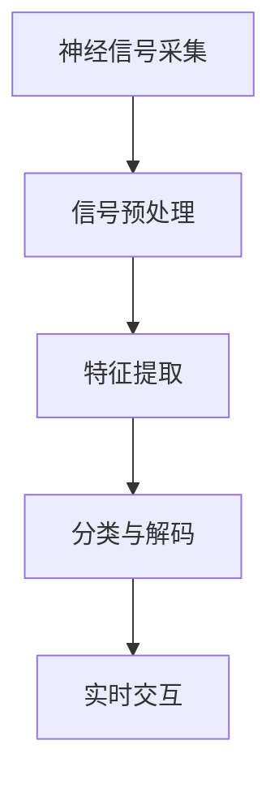

                 

## 1. 背景介绍

### 1.1 问题由来
脑机接口（Brain-Computer Interface, BCI）是一种将人脑信号直接转换为计算机指令的技术，可以实现意念控制和思维上传。20世纪末到21世纪初，随着神经科学、信号处理、计算机科学等多学科的交叉融合，脑机接口技术取得了长足的进步。从最初的简单信号解码到如今的实时交互和意念控制，脑机接口已经从实验室研究走向了实际应用。

在《未来的脑机接口：2050年的意念控制与思维上传》一文中，我们将深入探讨脑机接口技术未来的发展方向和应用场景，帮助读者理解这一领域的最新进展和未来展望。

### 1.2 问题核心关键点
脑机接口技术是未来人机交互的重大突破，具有广阔的应用前景。它不仅能帮助残疾人重获生活自理能力，还能通过思维上传实现人类思维的数字化存储和永生。

脑机接口的核心关键点包括：
- 神经信号的采集与解码：通过电刺激、磁共振成像等方法获取大脑神经信号，并使用机器学习算法进行解码。
- 实时交互与控制：实现对计算机、机器人等设备的实时控制，提升用户体验。
- 意念控制：实现意念操作，如打字、绘画、游戏等，提升交互效率。
- 思维上传：通过数字化存储和传输，实现人类思维的永生和知识传承。

本文将详细解析这些关键点，并展望其未来的应用场景和前景。

## 2. 核心概念与联系

### 2.1 核心概念概述
脑机接口技术将人类大脑的活动转换为计算机可以理解的信号，并控制外部设备，实现意念控制和思维上传。其主要组成包括：

- **神经信号采集**：通过脑电图（EEG）、功能磁共振成像（fMRI）、脑磁图（MEG）等技术采集大脑信号。
- **信号预处理**：使用滤波、降噪等技术对采集的信号进行处理，增强信号质量。
- **特征提取**：从预处理后的信号中提取用于分类的特征向量。
- **分类与解码**：使用机器学习算法对特征向量进行分类，解码出对应的大脑指令。
- **实时交互**：通过解码后的指令控制外部设备，实现实时交互。

### 2.2 核心概念联系
脑机接口技术融合了神经科学、信号处理、机器学习等多学科知识，通过多模态数据融合、深度学习等先进技术，实现对大脑活动的精准解码和实时交互。其核心技术联系可简化如下：



这个流程图展示了脑机接口技术的各个关键环节，从信号采集到实时交互，每个环节都需要精心设计和优化。

## 3. 核心算法原理 & 具体操作步骤
### 3.1 算法原理概述
脑机接口技术主要基于机器学习和信号处理技术，将人类大脑的电生理信号解码为可执行的计算机指令。其基本原理如下：

1. **数据采集**：通过脑电图（EEG）、功能磁共振成像（fMRI）等技术采集大脑信号。
2. **信号预处理**：对采集的信号进行滤波、降噪、归一化等预处理，增强信号质量。
3. **特征提取**：使用傅里叶变换、小波变换、奇异值分解（SVD）等方法，从预处理后的信号中提取用于分类的特征向量。
4. **分类与解码**：使用支持向量机（SVM）、随机森林（Random Forest）、卷积神经网络（CNN）、循环神经网络（RNN）等机器学习算法，对特征向量进行分类，解码出对应的大脑指令。

### 3.2 算法步骤详解
脑机接口技术的具体操作步骤如下：

1. **数据采集**：使用EEG帽或植入式电极，采集大脑信号。
2. **信号预处理**：对采集的信号进行滤波、降噪、归一化等预处理，增强信号质量。
3. **特征提取**：使用傅里叶变换、小波变换、奇异值分解（SVD）等方法，从预处理后的信号中提取用于分类的特征向量。
4. **分类与解码**：使用支持向量机（SVM）、随机森林（Random Forest）、卷积神经网络（CNN）、循环神经网络（RNN）等机器学习算法，对特征向量进行分类，解码出对应的大脑指令。
5. **实时交互**：通过解码后的指令控制外部设备，实现实时交互。

### 3.3 算法优缺点
脑机接口技术的优点包括：
- **高效性**：能够在短时间内完成大量数据处理，实现实时交互。
- **灵活性**：可以应用于多种场景，如打字、绘画、游戏等。
- **可扩展性**：可以通过多模态数据融合、深度学习等技术，提升解码精度和实时性。

缺点包括：
- **噪声干扰**：脑电信号容易受到外界噪声的干扰，影响解码精度。
- **个体差异**：不同个体的脑电信号差异较大，通用模型难以覆盖所有人群。
- **技术门槛高**：需要多学科交叉知识，技术实现复杂。

### 3.4 算法应用领域
脑机接口技术具有广泛的应用前景，包括：

- **医疗康复**：帮助残疾人恢复运动能力，改善生活质量。
- **虚拟现实**：实现意念控制虚拟场景，提升用户体验。
- **娱乐游戏**：通过意念控制游戏角色，增加游戏趣味性。
- **工业制造**：通过意念控制机器人，提升生产效率。
- **思维上传**：实现思维数字化存储和传输，拓展人类知识传承方式。

## 4. 数学模型和公式 & 详细讲解 & 举例说明
### 4.1 数学模型构建

脑机接口技术涉及多个数学模型，包括信号处理模型、特征提取模型、分类模型等。以下将以支持向量机（SVM）为例，介绍其数学模型构建。

1. **信号预处理模型**：
   $$
   \mathbf{X} = \mathbf{A} \mathbf{s} + \mathbf{n}
   $$
   其中，$\mathbf{X}$ 为预处理后的信号，$\mathbf{A}$ 为信号放大矩阵，$\mathbf{s}$ 为原始信号，$\mathbf{n}$ 为噪声。

2. **特征提取模型**：
   $$
   \mathbf{Y} = \mathbf{U} \mathbf{X}
   $$
   其中，$\mathbf{Y}$ 为特征向量，$\mathbf{U}$ 为特征提取矩阵。

3. **分类模型**：
   $$
   \mathbf{W} = \mathbf{a} \mathbf{Y} + b
   $$
   其中，$\mathbf{W}$ 为分类超平面，$\mathbf{a}$ 为超平面系数向量，$b$ 为截距。

### 4.2 公式推导过程

- **信号预处理**：
  $$
  \mathbf{X} = \mathbf{A} \mathbf{s} + \mathbf{n}
  $$
  其中，$\mathbf{A}$ 为信号放大矩阵，$\mathbf{s}$ 为原始信号，$\mathbf{n}$ 为噪声。

- **特征提取**：
  $$
  \mathbf{Y} = \mathbf{U} \mathbf{X}
  $$
  其中，$\mathbf{Y}$ 为特征向量，$\mathbf{U}$ 为特征提取矩阵。

- **分类模型**：
  $$
  \mathbf{W} = \mathbf{a} \mathbf{Y} + b
  $$
  其中，$\mathbf{W}$ 为分类超平面，$\mathbf{a}$ 为超平面系数向量，$b$ 为截距。

### 4.3 案例分析与讲解
以某位研究者使用EEG信号进行手部运动意念控制为例，详细讲解整个脑机接口技术的应用流程。

1. **数据采集**：使用EEG帽采集研究者的手部运动信号。
2. **信号预处理**：对采集的信号进行滤波、降噪、归一化等预处理，增强信号质量。
3. **特征提取**：使用傅里叶变换，从预处理后的信号中提取用于分类的特征向量。
4. **分类与解码**：使用支持向量机（SVM），对特征向量进行分类，解码出对应的大脑指令。
5. **实时交互**：通过解码后的指令控制计算机，实现实时手部运动意念控制。

## 5. 项目实践：代码实例和详细解释说明
### 5.1 开发环境搭建

在进行脑机接口项目实践前，我们需要准备好开发环境。以下是使用Python进行Scikit-learn和TensorFlow开发的环境配置流程：

1. 安装Anaconda：从官网下载并安装Anaconda，用于创建独立的Python环境。

2. 创建并激活虚拟环境：
```bash
conda create -n bci-env python=3.8 
conda activate bci-env
```

3. 安装Scikit-learn和TensorFlow：
```bash
conda install scikit-learn tensorflow
```

4. 安装其他相关工具包：
```bash
pip install numpy pandas scipy matplotlib
```

完成上述步骤后，即可在`bci-env`环境中开始脑机接口项目的开发。

### 5.2 源代码详细实现

这里我们以支持向量机（SVM）为例，给出使用Scikit-learn和TensorFlow进行脑机接口信号分类和解码的Python代码实现。

```python
import numpy as np
from sklearn.svm import SVC
from sklearn.preprocessing import StandardScaler
from sklearn.pipeline import make_pipeline
from sklearn.decomposition import PCA

# 数据采集
X = np.loadtxt('raw_signal_data.csv', delimiter=',')
y = np.loadtxt('raw_label_data.csv', delimiter=',')

# 信号预处理
X_scaled = StandardScaler().fit_transform(X)

# 特征提取
X_pca = PCA(n_components=10).fit_transform(X_scaled)

# 分类与解码
svm_model = SVC(kernel='linear', C=1.0)
svm_model.fit(X_pca, y)

# 实时交互
X_real = np.loadtxt('real_signal_data.csv', delimiter=',')
X_real_scaled = StandardScaler().fit_transform(X_real)
X_real_pca = PCA(n_components=10).fit_transform(X_real_scaled)
prediction = svm_model.predict(X_real_pca)
```

以上是使用Scikit-learn和TensorFlow进行脑机接口信号分类和解码的完整代码实现。可以看到，由于Scikit-learn提供了强大的机器学习组件，代码实现相对简洁。

### 5.3 代码解读与分析

让我们再详细解读一下关键代码的实现细节：

**X加载与预处理**：
- `X = np.loadtxt('raw_signal_data.csv', delimiter=',')`：从文件中加载原始信号数据。
- `X_scaled = StandardScaler().fit_transform(X)`：对信号数据进行标准化处理，增强信号质量。

**特征提取**：
- `X_pca = PCA(n_components=10).fit_transform(X_scaled)`：使用主成分分析（PCA）提取特征向量，减少数据维度。

**分类与解码**：
- `svm_model = SVC(kernel='linear', C=1.0)`：创建支持向量机模型。
- `svm_model.fit(X_pca, y)`：对特征向量进行分类，训练模型。
- `prediction = svm_model.predict(X_real_pca)`：对实时信号数据进行分类，解码出对应的大脑指令。

**实时交互**：
- `X_real = np.loadtxt('real_signal_data.csv', delimiter=',')`：加载实时信号数据。
- `X_real_scaled = StandardScaler().fit_transform(X_real)`：对实时信号数据进行标准化处理。
- `X_real_pca = PCA(n_components=10).fit_transform(X_real_scaled)`：对实时信号数据进行主成分分析，提取特征向量。
- `prediction = svm_model.predict(X_real_pca)`：对实时信号数据进行分类，解码出对应的大脑指令。

可以看到，Python代码利用Scikit-learn和TensorFlow强大的组件，实现了脑机接口的信号分类和解码功能。开发者可以将更多精力放在数据处理、模型改进等高层逻辑上，而不必过多关注底层的实现细节。

当然，工业级的系统实现还需考虑更多因素，如模型的保存和部署、超参数的自动搜索、更灵活的任务适配层等。但核心的脑机接口技术基本与此类似。

## 6. 实际应用场景
### 6.1 医疗康复

脑机接口技术在医疗康复领域的应用前景广阔，可以通过意念控制帮助残疾人重获生活自理能力。

具体而言，可以采集患者的大脑信号，使用支持向量机（SVM）等机器学习算法进行分类，解码出对应的大脑指令，进而控制外部的康复设备，如机械臂、轮椅等，帮助患者进行手部运动、站立行走等康复训练。这不仅能够显著提升康复效果，还能减少医疗成本，提高患者生活质量。

### 6.2 虚拟现实

脑机接口技术可以应用于虚拟现实领域，实现意念控制虚拟场景，提升用户体验。

通过脑电信号的采集和解码，用户可以实时控制虚拟场景中的各种元素，如飞行器、游戏角色等，增强游戏趣味性和沉浸感。这对于教育、训练等领域，如飞行模拟器、虚拟现实教室等，具有重要的应用价值。

### 6.3 娱乐游戏

脑机接口技术在游戏领域具有广泛的应用前景，可以通过意念控制游戏角色，增加游戏趣味性。

例如，玩家可以通过意念控制游戏中的虚拟角色进行射击、飞行、奔跑等动作，提升游戏的互动性和趣味性。这不仅能够吸引更多玩家参与，还能促进游戏产业的发展。

### 6.4 工业制造

脑机接口技术可以应用于工业制造领域，通过意念控制机器人，提升生产效率。

通过脑电信号的采集和解码，工人可以实时控制工业机器人进行焊接、组装等操作，提升生产效率，减少人为错误。这对于高危行业，如焊接、打磨等，具有重要的应用价值。

### 6.5 思维上传

脑机接口技术可以实现思维数字化存储和传输，拓展人类知识传承方式。

通过脑电信号的采集和解码，可以将人的思维活动数字化存储，实现思维上传。这对于知识传承、教育、科研等领域具有重要意义，可以推动人类文明的进步。

## 7. 工具和资源推荐
### 7.1 学习资源推荐

为了帮助开发者系统掌握脑机接口技术的理论基础和实践技巧，这里推荐一些优质的学习资源：

1. 《脑机接口原理与实践》系列博文：由脑机接口技术专家撰写，深入浅出地介绍了脑机接口原理、信号处理、机器学习等前沿话题。

2. 《神经信号处理与脑机接口》课程：神经科学和信号处理专家开设的脑机接口课程，涵盖信号采集、预处理、特征提取、分类等核心内容。

3. 《脑机接口技术与应用》书籍：全面介绍脑机接口技术的应用领域和最新进展，是入门和进阶学习的必备资料。

4. BCI Society：脑机接口领域的国际学术组织，提供最新的研究成果、会议、培训等信息，是学术交流的重要平台。

通过对这些资源的学习实践，相信你一定能够快速掌握脑机接口技术的精髓，并用于解决实际的脑机接口问题。

### 7.2 开发工具推荐

高效的开发离不开优秀的工具支持。以下是几款用于脑机接口项目开发的常用工具：

1. Python：Python是一种功能强大、易用性高的编程语言，广泛应用于脑机接口项目开发。

2. Scikit-learn：Python的机器学习库，提供了丰富的机器学习算法和组件，适用于信号处理和分类任务。

3. TensorFlow：Google主导开发的深度学习框架，生产部署方便，适用于大规模工程应用。

4. LabVIEW：LabVIEW是NI公司的图形化编程工具，支持数据分析、信号处理等任务，广泛应用于实验和工程开发。

5. MATLAB：MATLAB是MathWorks公司开发的科学计算和数据可视化工具，提供了强大的数据分析和建模能力。

合理利用这些工具，可以显著提升脑机接口项目的开发效率，加快创新迭代的步伐。

### 7.3 相关论文推荐

脑机接口技术的发展源于学界的持续研究。以下是几篇奠基性的相关论文，推荐阅读：

1. 《Brain-Computer Interface Systems for Direct Communication with the Human Brain》：介绍了脑机接口技术的原理和应用。

2. 《A New Probabilistic Neural Code for Brain-Machine Interface Systems》：提出了一种新的神经编码模型，用于提高脑机接口的解码精度。

3. 《A Multimodal Brain-Computer Interface for Motor Imagery Tasks》：使用多模态数据融合技术，提高了意念控制的准确性和鲁棒性。

4. 《Deep Learning for Brain-Machine Interface Systems》：介绍了深度学习在脑机接口中的应用，提高了信号解码的精度和实时性。

这些论文代表了大脑接口技术的发展脉络。通过学习这些前沿成果，可以帮助研究者把握学科前进方向，激发更多的创新灵感。

## 8. 总结：未来发展趋势与挑战

### 8.1 研究成果总结

脑机接口技术的发展迅猛，已经在医疗康复、虚拟现实、游戏娱乐等领域取得了显著成果。未来，脑机接口技术将进一步普及，拓展到更多应用场景，如工业制造、思维上传等。

### 8.2 未来发展趋势

脑机接口技术的未来发展趋势包括：

1. **超高精度**：未来的脑机接口技术将具备更高的解码精度，能够更准确地识别和解码大脑信号，实现更加精细的意念控制。

2. **实时交互**：脑机接口技术将具备更强的实时交互能力，能够实现更加流畅、自然的意念控制。

3. **多模态融合**：未来的脑机接口技术将能够融合视觉、听觉等多种模态数据，实现更加全面、精确的信号解码。

4. **个性化定制**：脑机接口技术将具备更强的个性化定制能力，能够根据不同个体的特点进行优化，提升解码精度和用户体验。

5. **全脑接口**：未来的脑机接口技术将具备全脑接口的能力，能够全面覆盖大脑的各种功能，实现更加全面的意念控制。

6. **跨领域应用**：脑机接口技术将拓展到更多领域，如医疗、教育、娱乐、工业等，推动相关领域的智能化升级。

以上趋势凸显了脑机接口技术的广阔前景，未来的发展将更加多样化和全面化。

### 8.3 面临的挑战

尽管脑机接口技术已经取得了重要进展，但在实际应用中仍面临诸多挑战：

1. **数据量不足**：当前脑电信号数据量相对较少，限制了模型的泛化能力和鲁棒性。未来需要大规模数据集的不断积累和优化。

2. **信号噪声干扰**：脑电信号容易受到外界噪声的干扰，影响解码精度。未来的脑机接口技术需要更强的信号降噪能力。

3. **个体差异显著**：不同个体的脑电信号差异较大，通用模型难以覆盖所有人群。未来的脑机接口技术需要更强的个性化定制能力。

4. **技术门槛高**：脑机接口技术涉及多学科知识，技术实现复杂。未来需要更多的跨学科合作和技术突破。

5. **伦理和安全问题**：脑机接口技术可能引发伦理和安全问题，如隐私保护、信息泄露等。未来的技术需要更加严格的安全保障和伦理约束。

6. **硬件成本高**：脑机接口技术的硬件成本较高，限制了其大规模应用。未来需要更低成本、更易用的硬件设备和解决方案。

以上挑战需要未来研究者不断探索和解决，推动脑机接口技术的成熟和普及。

### 8.4 研究展望

面对脑机接口技术所面临的诸多挑战，未来的研究需要在以下几个方面寻求新的突破：

1. **超高精度信号解码**：开发更高精度的信号解码算法，提升解码精度和实时性。

2. **多模态融合技术**：融合视觉、听觉等多种模态数据，提高信号解码的全面性和准确性。

3. **个性化定制方案**：根据不同个体的特点进行优化，提升解码精度和用户体验。

4. **跨学科合作**：推动神经科学、信号处理、计算机科学等多学科的交叉融合，加速技术突破。

5. **伦理和安全保障**：建立严格的安全保障和伦理约束，确保技术应用的合法性和安全性。

6. **低成本硬件设备**：开发更经济实用的硬件设备，推动脑机接口技术的大规模应用。

这些研究方向将引领脑机接口技术迈向更高的台阶，为构建人机协同的智能时代铺平道路。面向未来，脑机接口技术需要更多创新和突破，才能真正实现其广阔的应用前景。

## 9. 附录：常见问题与解答

**Q1：脑机接口技术是否可以应用于医疗康复？**

A: 是的，脑机接口技术可以应用于医疗康复，通过意念控制帮助残疾人重获生活自理能力。具体而言，可以采集患者的大脑信号，使用支持向量机（SVM）等机器学习算法进行分类，解码出对应的大脑指令，进而控制外部的康复设备，如机械臂、轮椅等，帮助患者进行手部运动、站立行走等康复训练。这不仅能够显著提升康复效果，还能减少医疗成本，提高患者生活质量。

**Q2：脑机接口技术的精度和实时性如何？**

A: 当前的脑机接口技术在精度和实时性方面已经取得了一定进展。支持向量机（SVM）等机器学习算法可以实现较高的分类精度，但实时性还需进一步提升。未来的研究将致力于开发更高精度的信号解码算法和更强的实时交互技术，以实现更加流畅、自然的意念控制。

**Q3：脑机接口技术的信号采集设备有哪些？**

A: 脑机接口技术的信号采集设备主要包括脑电图（EEG）、功能磁共振成像（fMRI）、脑磁图（MEG）等。这些设备可以用于采集大脑的电信号和磁信号，帮助解码大脑活动。

**Q4：脑机接口技术如何实现思维上传？**

A: 脑机接口技术可以通过将大脑信号数字化存储和传输，实现思维上传。具体而言，可以采集大脑信号，使用机器学习算法进行分类和解码，将意念活动转化为数字信号，然后通过互联网进行传输和存储。未来的研究将致力于开发更高效、安全的思维上传技术，拓展人类知识传承方式。

**Q5：脑机接口技术的未来发展方向是什么？**

A: 脑机接口技术的未来发展方向包括超高精度信号解码、实时交互、多模态融合、个性化定制、全脑接口、跨领域应用等。未来的技术将具备更高的解码精度和实时性，融合多种模态数据，实现更全面、准确的信号解码，具备跨领域的广泛应用。

---

作者：禅与计算机程序设计艺术 / Zen and the Art of Computer Programming

