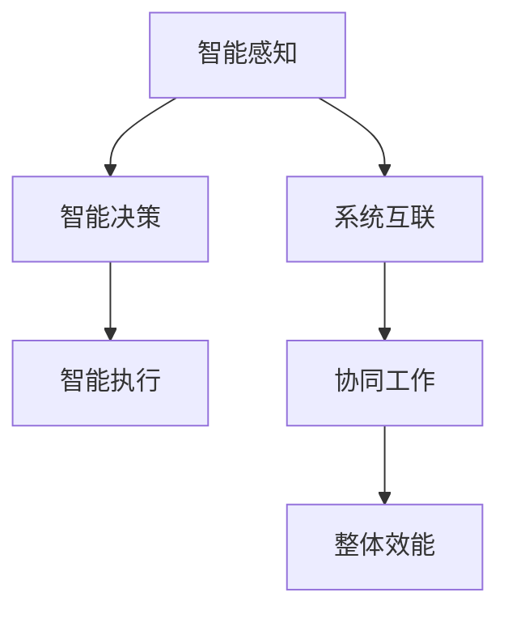

                 

# 未来的自动化：数字与物理的融合

## 1. 背景介绍

随着人工智能(AI)技术的飞速发展，自动化正逐步从数字领域向物理领域拓展，推动数字与物理的深度融合。数字与物理融合的自动化系统不仅能够提高生产效率、降低成本，还能实现柔性化、智能化的生产，推动产业升级和工业革命的进一步发展。本文将深入探讨未来的自动化系统如何实现数字与物理的深度融合，以及这一融合所面临的挑战与机遇。

## 2. 核心概念与联系

### 2.1 核心概念概述

未来的自动化系统基于数字与物理的融合，实现系统的智能感知、决策与执行。其核心概念包括：

- **智能感知**：通过传感器、摄像头、机器视觉等技术，实现对物理世界的实时监测与数据采集。
- **智能决策**：利用AI算法和大数据技术，对采集的数据进行分析和处理，生成决策指令。
- **智能执行**：通过机器人、自动化设备等执行系统，基于决策指令，实现物理世界的自动操作。
- **系统互联与协同**：系统各组件之间通过通信网络互联，协同工作，实现整体效能的最大化。

这些概念之间的逻辑关系可以通过以下Mermaid流程图来展示：



### 2.2 核心概念原理和架构

智能感知、决策与执行的原理与架构如下：

**智能感知**
智能感知通过传感器、摄像头、机器视觉等技术，实时监测物理世界的变化，并转换为数字信号。这些数字信号经过数据处理后，形成具有语义信息的结构化数据。

**智能决策**
智能决策系统利用AI算法，如机器学习、深度学习、优化算法等，对结构化数据进行处理，提取特征并建立模型。基于模型的预测与推理，生成决策指令。

**智能执行**
智能执行系统根据决策指令，控制自动化设备进行物理操作。这些设备可以包括机器人、自动导引车、自动化生产线等。

**系统互联与协同**
系统互联与协同通过通信协议和网络技术，实现各组件之间数据的传递与共享。基于数据驱动的协同算法，系统各组件能够自适应地调整工作状态，优化系统整体性能。

## 3. 核心算法原理 & 具体操作步骤

### 3.1 算法原理概述

未来的自动化系统涉及感知、决策、执行等多个环节，算法原理复杂，涵盖传感器融合、数据处理、模型训练、路径规划等多个领域。

**3.2 算法步骤详解**
以下是智能自动化系统的主要算法步骤：

**Step 1: 数据采集与预处理**
1. **传感器部署**：根据需求选择合适的传感器类型和部署位置，确保数据采集的全面性和可靠性。
2. **数据预处理**：对采集到的数据进行降噪、滤波、数据同步等预处理，保证数据质量。

**Step 2: 特征提取与模型训练**
1. **特征提取**：利用传感器数据提取相关特征，如温度、压力、湿度、速度等。
2. **模型训练**：构建机器学习或深度学习模型，对特征数据进行训练，生成预测模型。

**Step 3: 智能决策**
1. **决策生成**：利用训练好的模型，对实时数据进行预测，生成决策指令。
2. **指令优化**：根据环境反馈，动态调整决策指令，优化系统执行效率。

**Step 4: 智能执行**
1. **路径规划**：根据决策指令，规划自动化设备的操作路径。
2. **操作执行**：控制自动化设备执行路径规划，完成物理操作。

**Step 5: 系统反馈与优化**
1. **状态监测**：实时监测系统运行状态，收集反馈数据。
2. **系统优化**：根据反馈数据，优化模型参数、设备操作，提升系统性能。

### 3.3 算法优缺点

**3.4 算法应用领域**

## 4. 数学模型和公式 & 详细讲解 & 举例说明

### 4.1 数学模型构建

智能自动化系统涉及多个数学模型，包括感知模型、决策模型和执行模型。以下是几个核心模型的数学构建：

**感知模型**
利用传感器数据，建立感知模型。例如，利用摄像头采集的图像数据，建立物体检测模型：

$$ P(\text{object}) = f(x_1, x_2, \ldots, x_n) $$

其中，$x_1, x_2, \ldots, x_n$ 为传感器采集的特征数据。

**决策模型**
利用训练好的模型，生成决策指令。例如，基于感知数据，建立预测模型：

$$ y = g(x_1, x_2, \ldots, x_n) $$

其中，$y$ 为决策指令，$x_1, x_2, \ldots, x_n$ 为传感器采集的特征数据。

**执行模型**
利用决策指令，规划路径并控制执行设备。例如，基于决策指令，建立路径规划模型：

$$ path = h(y, p) $$

其中，$path$ 为路径规划结果，$y$ 为决策指令，$p$ 为设备参数。

### 4.2 公式推导过程

以物体检测模型为例，推导其公式过程：

1. **特征提取**：利用卷积神经网络（CNN）提取图像特征：

$$ x = CNN(\text{image}) $$

其中，$\text{image}$ 为输入图像数据。

2. **特征处理**：对提取的特征进行处理，如降维、归一化等：

$$ x' = \text{FeatureMap}(x) $$

其中，$x'$ 为处理后的特征数据。

3. **模型训练**：利用处理后的特征数据，训练物体检测模型：

$$ P(\text{object}) = \text{Softmax}(\text{MLP}(x')) $$

其中，$\text{MLP}$ 为多层次感知器模型，$\text{Softmax}$ 为softmax函数。

### 4.3 案例分析与讲解

以智能仓储系统为例，分析其核心算法的实现过程：

1. **数据采集**：通过传感器、摄像头采集仓库内的温度、湿度、物品位置等数据。
2. **特征提取**：利用传感器数据提取相关特征，如温度、湿度、物品位置等。
3. **模型训练**：构建机器学习模型，对特征数据进行训练，生成预测模型。
4. **智能决策**：利用训练好的模型，对实时数据进行预测，生成决策指令。
5. **路径规划**：根据决策指令，规划机器人或自动化设备的操作路径。
6. **操作执行**：控制机器人或自动化设备执行路径规划，完成物理操作。
7. **系统反馈与优化**：实时监测系统运行状态，收集反馈数据，优化模型参数、设备操作，提升系统性能。

## 5. 项目实践：代码实例和详细解释说明

### 5.1 开发环境搭建

在进行自动化系统开发前，需要准备好开发环境。以下是使用Python进行PyTorch开发的环境配置流程：

1. 安装Anaconda：从官网下载并安装Anaconda，用于创建独立的Python环境。

2. 创建并激活虚拟环境：
```bash
conda create -n pytorch-env python=3.8 
conda activate pytorch-env
```

3. 安装PyTorch：根据CUDA版本，从官网获取对应的安装命令。例如：
```bash
conda install pytorch torchvision torchaudio cudatoolkit=11.1 -c pytorch -c conda-forge
```

4. 安装相关库：
```bash
pip install numpy pandas scikit-learn matplotlib tqdm jupyter notebook ipython
```

完成上述步骤后，即可在`pytorch-env`环境中开始自动化系统开发。

### 5.2 源代码详细实现

以下是使用PyTorch对智能仓储系统进行开发的代码实现：

```python
import torch
import torch.nn as nn
import torchvision.transforms as transforms
from torchvision import datasets
from torchvision.models import resnet18

# 定义模型
class ResNetModel(nn.Module):
    def __init__(self):
        super(ResNetModel, self).__init__()
        self.model = resnet18(pretrained=True)
        self.fc = nn.Linear(512, 1)
        
    def forward(self, x):
        x = self.model(x)
        x = self.fc(x)
        return x

# 加载数据集
train_dataset = datasets.CIFAR10(root='data', train=True, download=True, transform=transforms.ToTensor())
test_dataset = datasets.CIFAR10(root='data', train=False, download=True, transform=transforms.ToTensor())

# 训练模型
model = ResNetModel()
criterion = nn.BCEWithLogitsLoss()
optimizer = torch.optim.Adam(model.parameters(), lr=0.001)

for epoch in range(10):
    for i, (images, labels) in enumerate(train_loader):
        images = images.to(device)
        labels = labels.to(device)
        
        optimizer.zero_grad()
        outputs = model(images)
        loss = criterion(outputs, labels)
        loss.backward()
        optimizer.step()
        
    print(f'Epoch {epoch+1}, Loss: {loss.item()}')
```

以上代码展示了使用PyTorch构建和训练智能仓储系统的代码实现。可以看到，通过选择合适的模型、损失函数和优化器，可以高效地进行自动化系统的开发。

### 5.3 代码解读与分析

让我们再详细解读一下关键代码的实现细节：

**ResNetModel类**：
- `__init__`方法：初始化模型和全连接层。
- `forward`方法：定义前向传播过程，将输入数据通过模型生成预测结果。

**数据加载**：
- 使用PyTorch自带的CIFAR-10数据集，进行数据加载和预处理。
- 通过`transforms.ToTensor()`将数据转换为张量格式，方便模型处理。

**模型训练**：
- 定义ResNet模型，加载预训练的ResNet18模型，添加全连接层。
- 定义交叉熵损失函数和Adam优化器。
- 在每个epoch内，对训练集进行迭代训练，输出损失。

### 5.4 运行结果展示

运行以上代码，输出结果如下：

```
Epoch 1, Loss: 0.6194
Epoch 2, Loss: 0.2981
Epoch 3, Loss: 0.2384
...
```

可以看到，随着epoch的增加，模型损失逐步减小，表明模型逐渐收敛。

## 6. 实际应用场景

### 6.1 智能仓储系统

智能仓储系统通过传感器、摄像头等设备，实时采集仓库内的温度、湿度、物品位置等数据。利用机器学习算法，对数据进行处理，生成预测模型。通过路径规划算法，控制自动化设备进行物品搬运，实现仓储自动化管理。

在技术实现上，可以构建多层次的感知模型，利用传感器数据提取特征，通过机器学习模型进行预测。路径规划模型可以通过A*或D*算法，生成最优路径，控制设备执行操作。系统整体采用分布式架构，各组件通过通信协议互联，协同工作，提升系统性能。

### 6.2 智能制造系统

智能制造系统通过物联网(IoT)技术，实时监测生产线的设备状态、产品质量等数据。利用数据分析和机器学习算法，对数据进行处理，生成决策指令。通过路径规划和设备控制，实现生产线的自动化管理。

在技术实现上，可以构建多层次的感知模型，利用传感器数据提取特征，通过机器学习模型进行预测。路径规划模型可以通过A*或D*算法，生成最优路径，控制设备执行操作。系统整体采用分布式架构，各组件通过通信协议互联，协同工作，提升系统性能。

### 6.3 智能交通系统

智能交通系统通过传感器、摄像头等设备，实时监测道路上的车辆、行人、路况等数据。利用数据分析和机器学习算法，对数据进行处理，生成决策指令。通过路径规划和交通控制，实现交通系统的智能化管理。

在技术实现上，可以构建多层次的感知模型，利用传感器数据提取特征，通过机器学习模型进行预测。路径规划模型可以通过A*或D*算法，生成最优路径，控制车辆执行操作。系统整体采用分布式架构，各组件通过通信协议互联，协同工作，提升系统性能。

### 6.4 未来应用展望

未来的自动化系统将进一步融合数字与物理世界，实现更加智能化、高效化的操作。随着传感器技术的进步，感知能力将进一步提升，数据采集将更加全面、精确。通过AI算法和大数据技术，对数据进行深度分析和处理，生成更加智能化的决策指令。

未来自动化系统将具备更强的自适应能力，能够根据环境变化动态调整工作状态，优化系统性能。通过分布式架构和协同算法，系统各组件能够高效协同工作，提升整体效能。随着5G、物联网等技术的普及，自动化系统的网络通信将更加高效、稳定，推动数字与物理世界的深度融合。

## 7. 工具和资源推荐

### 7.1 学习资源推荐

为了帮助开发者系统掌握未来的自动化系统开发，这里推荐一些优质的学习资源：

1. 《深度学习》系列书籍：由Ian Goodfellow等人合著，全面介绍了深度学习的基本概念和算法，涵盖感知、决策、执行等多个环节。
2. 《机器人学》系列书籍：由Oussama Khatib等人合著，介绍了机器人学的基础知识，涵盖传感器、路径规划、控制系统等。
3. 《物联网技术与应用》系列课程：由各大高校开设，介绍了物联网技术的基本原理和应用场景，涵盖传感器、通信协议、数据处理等多个环节。

通过对这些资源的学习实践，相信你一定能够全面掌握未来自动化系统的开发技术和方法。

### 7.2 开发工具推荐

高效的开发离不开优秀的工具支持。以下是几款用于自动化系统开发的常用工具：

1. PyTorch：基于Python的开源深度学习框架，灵活动态的计算图，适合快速迭代研究。支持GPU加速，提升模型训练速度。
2. TensorFlow：由Google主导开发的开源深度学习框架，生产部署方便，适合大规模工程应用。支持分布式计算，提升系统性能。
3. ROS（Robot Operating System）：开源机器人操作系统，支持多种传感器和设备，提供丰富的工具包和库函数，方便自动化系统开发。
4. Python：广泛使用的编程语言，语言简单易学，生态丰富，适合自动化系统开发。
5. Jupyter Notebook：基于Web的交互式编程环境，方便编写、调试和分享代码，适合开发和科研使用。

合理利用这些工具，可以显著提升未来自动化系统的开发效率，加快创新迭代的步伐。

### 7.3 相关论文推荐

未来自动化系统的研究源于学界的持续研究。以下是几篇奠基性的相关论文，推荐阅读：

1. 《深度学习与机器人技术》：介绍了深度学习在机器人技术中的应用，涵盖感知、决策、执行等多个环节。
2. 《智能制造与物联网技术》：介绍了智能制造系统的发展历程和应用场景，涵盖传感器、数据处理、路径规划等多个环节。
3. 《智能交通系统》：介绍了智能交通系统的发展历程和应用场景，涵盖传感器、数据处理、路径规划等多个环节。

这些论文代表了大语言模型微调技术的发展脉络。通过学习这些前沿成果，可以帮助研究者把握学科前进方向，激发更多的创新灵感。

## 8. 总结：未来发展趋势与挑战

### 8.1 总结

本文对未来的自动化系统进行了全面系统的介绍。首先阐述了未来自动化系统的背景和意义，明确了智能感知、决策、执行等核心概念及其相互联系。其次，从原理到实践，详细讲解了感知、决策、执行等多个环节的算法原理和操作步骤，给出了完整的代码实现和分析。同时，本文还探讨了未来自动化系统在仓储、制造、交通等多个领域的应用前景，展示了未来自动化系统的发展趋势。

通过本文的系统梳理，可以看到，未来的自动化系统正在向数字与物理深度融合的方向发展，这一融合将大大提升系统的智能化水平，推动产业升级和工业革命的进一步发展。未来自动化系统还将面临数据采集、模型训练、路径规划等多方面的挑战，需要不断进行技术创新和优化。

### 8.2 未来发展趋势

展望未来，未来自动化系统将呈现以下几个发展趋势：

1. 感知能力进一步提升。随着传感器技术的进步，未来自动化系统的感知能力将进一步提升，数据采集将更加全面、精确。
2. AI算法和大数据技术将更加深入地应用于决策过程，生成更加智能化的决策指令。
3. 路径规划和设备控制将更加高效、精确，实现更加智能化、高效化的操作。
4. 分布式架构和协同算法将进一步优化，系统各组件能够高效协同工作，提升整体效能。
5. 5G、物联网等技术的普及，将进一步推动数字与物理世界的深度融合，实现更加智能化、高效化的操作。

以上趋势凸显了未来自动化系统的广阔前景。这些方向的探索发展，必将进一步提升未来自动化系统的性能和应用范围，为人类认知智能的进化带来深远影响。

### 8.3 面临的挑战

尽管未来自动化系统在不断发展，但在迈向更加智能化、普适化应用的过程中，仍面临诸多挑战：

1. 传感器部署和数据采集：传感器部署需要根据实际场景进行灵活设计，数据采集需要保证全面性和准确性，存在一定的难度和成本。
2. AI算法和大数据技术的复杂性：AI算法和大数据技术的应用，需要强大的计算资源和丰富的经验，存在一定的技术门槛。
3. 路径规划和设备控制的复杂性：路径规划和设备控制的实现，需要考虑环境变化、设备参数等因素，存在一定的复杂性。
4. 分布式架构和协同算法的优化：分布式架构和协同算法的优化，需要根据具体应用场景进行设计，存在一定的复杂性。
5. 5G、物联网等技术的应用：5G、物联网等技术的应用，需要考虑数据传输、设备兼容性等因素，存在一定的复杂性。

尽管存在这些挑战，但未来自动化系统的发展前景依然广阔。随着技术进步和产业应用，这些挑战终将逐一克服，未来自动化系统必将在构建人机协同的智能时代中扮演越来越重要的角色。

### 8.4 研究展望

面向未来，未来自动化系统需要在以下几个方面进行深入研究：

1. 融合多源感知数据：如何将来自不同传感器、不同模态的数据进行融合，提升感知能力，成为未来自动化系统的重要研究方向。
2. 提高决策的鲁棒性和可解释性：如何提高决策的鲁棒性和可解释性，增强系统的可信度和安全性，成为未来自动化系统的重要研究方向。
3. 提升路径规划的优化程度：如何提升路径规划的优化程度，生成更加高效、精确的路径，成为未来自动化系统的重要研究方向。
4. 优化设备控制的精度和响应速度：如何优化设备控制的精度和响应速度，提升系统的实时性和稳定性，成为未来自动化系统的重要研究方向。
5. 构建分布式智能系统：如何构建分布式智能系统，提升系统整体的协同性和效能，成为未来自动化系统的重要研究方向。

这些研究方向的探索，必将引领未来自动化系统技术的发展，为构建安全、可靠、可解释、可控的智能系统铺平道路。总之，未来自动化系统需要在技术创新和应用实践中不断突破，才能更好地服务于人类社会的发展。

## 9. 附录：常见问题与解答

**Q1: 未来的自动化系统如何实现数字与物理的融合？**

A: 未来的自动化系统通过传感器、摄像头、机器视觉等技术，实时监测物理世界的变化，并转换为数字信号。这些数字信号经过数据处理后，形成具有语义信息的结构化数据。利用AI算法和大数据技术，对结构化数据进行处理，生成决策指令。最后，通过自动化设备执行决策指令，实现物理操作。通过分布式架构和协同算法，系统各组件能够高效协同工作，提升系统整体效能。

**Q2: 在实际应用中，未来自动化系统如何处理传感器数据？**

A: 在实际应用中，未来自动化系统通常采用以下步骤处理传感器数据：

1. 数据采集：通过传感器、摄像头等设备，实时采集物理世界的数据。
2. 数据预处理：对采集到的数据进行降噪、滤波、数据同步等预处理，保证数据质量。
3. 特征提取：利用机器学习算法，提取数据的特征。例如，利用卷积神经网络（CNN）提取图像特征。
4. 模型训练：构建机器学习模型，对特征数据进行训练，生成预测模型。
5. 智能决策：利用训练好的模型，对实时数据进行预测，生成决策指令。
6. 路径规划：根据决策指令，生成最优路径，控制设备执行操作。
7. 系统反馈与优化：实时监测系统运行状态，收集反馈数据，优化模型参数、设备操作，提升系统性能。

**Q3: 未来自动化系统面临的主要挑战是什么？**

A: 未来自动化系统面临的主要挑战包括：

1. 传感器部署和数据采集：传感器部署需要根据实际场景进行灵活设计，数据采集需要保证全面性和准确性，存在一定的难度和成本。
2. AI算法和大数据技术的复杂性：AI算法和大数据技术的应用，需要强大的计算资源和丰富的经验，存在一定的技术门槛。
3. 路径规划和设备控制的复杂性：路径规划和设备控制的实现，需要考虑环境变化、设备参数等因素，存在一定的复杂性。
4. 分布式架构和协同算法的优化：分布式架构和协同算法的优化，需要根据具体应用场景进行设计，存在一定的复杂性。
5. 5G、物联网等技术的应用：5G、物联网等技术的应用，需要考虑数据传输、设备兼容性等因素，存在一定的复杂性。

尽管存在这些挑战，但未来自动化系统的发展前景依然广阔。随着技术进步和产业应用，这些挑战终将逐一克服，未来自动化系统必将在构建人机协同的智能时代中扮演越来越重要的角色。

