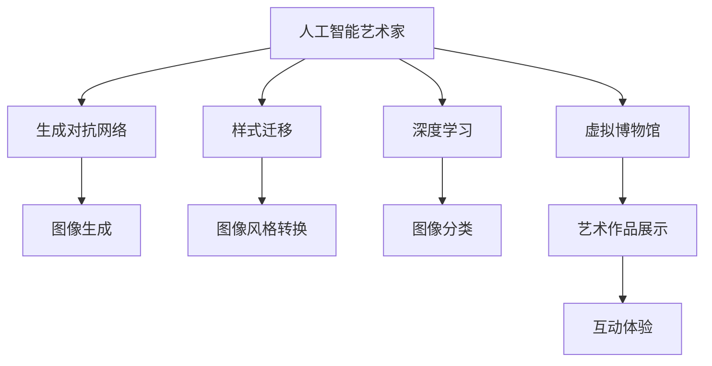

                 

# 未来的艺术创作：2050年的人工智能艺术家与虚拟博物馆

> 关键词：人工智能艺术家,虚拟博物馆,创作,算法,应用

## 1. 背景介绍

### 1.1 问题由来

随着人工智能技术的不断进步，特别是深度学习、自然语言处理和计算机视觉的迅猛发展，艺术家开始借助这些技术探索新的创作形式和表达方式。AI艺术家通过深度学习模型训练出独特的风格，自动生成艺术作品，改变了传统艺术创作和展示的格局。与此同时，虚拟博物馆的兴起，使得艺术作品可以在线上永久保存、展示和传播，极大地拓宽了艺术展览的空间和受众。

在2050年，我们预计将见证人工智能艺术家的创作全面数字化、虚拟化，并且通过虚拟博物馆在全球范围内广泛传播和互动。这种变革将给艺术创作、展示和体验带来革命性的变化，为公众提供更加个性化、动态化和互动化的艺术体验。

### 1.2 问题核心关键点

- **人工智能艺术家**：通过深度学习模型和计算机视觉技术训练出的艺术家，能够自动生成风格多样、内容丰富的艺术作品。
- **虚拟博物馆**：利用虚拟现实(VR)和增强现实(AR)技术，提供沉浸式艺术展示和互动体验，打破了时间和空间的限制。
- **创作和展示**：AI艺术家的创作内容可以在虚拟博物馆中永久展示和互动，实现艺术作品的动态更新和个性化体验。
- **未来展望**：随着技术的进步，AI艺术家将能够创作出更加复杂、多样、互动的艺术作品，虚拟博物馆也将成为艺术展示和传播的重要平台。

## 2. 核心概念与联系

### 2.1 核心概念概述

为更好地理解AI艺术家与虚拟博物馆的概念及其联系，本节将介绍几个关键概念：

- **人工智能艺术家(AI Artist)**：利用深度学习等AI技术创作艺术作品的艺术家。
- **生成对抗网络(GAN)**：一种无监督学习方法，通过两个网络对抗生成逼真的艺术作品。
- **样式迁移(Style Transfer)**：通过迁移网络将一种风格应用到另一种图像上，实现艺术风格的转化。
- **深度学习(DL)**：一种通过神经网络进行训练和推理的方法，可以自动学习特征和模式。
- **虚拟博物馆(Virtual Museum)**：利用虚拟现实(VR)和增强现实(AR)技术，创建互动式艺术展览空间。

这些核心概念之间的逻辑关系可以通过以下Mermaid流程图来展示：



这个流程图展示了大语言模型的核心概念及其之间的关系：

1. AI艺术家通过深度学习技术，自动生成艺术作品。
2. 生成对抗网络被用于生成逼真的艺术图像。
3. 样式迁移可以实现图像风格的自动转换。
4. 深度学习技术用于图像分类和特征提取。
5. 虚拟博物馆利用VR和AR技术，创建沉浸式的艺术展示空间。
6. AI艺术家的创作内容在虚拟博物馆中展示和互动。

这些概念共同构成了2050年人工智能艺术家与虚拟博物馆的发展框架，使其能够借助最新的技术手段，实现更加多样、复杂和互动的艺术创作与展示。

## 3. 核心算法原理 & 具体操作步骤

### 3.1 算法原理概述

基于深度学习的AI艺术家创作艺术作品，其核心原理是通过训练神经网络模型，学习艺术特征和风格，生成具有独特风格的作品。虚拟博物馆则通过虚拟现实和增强现实技术，为艺术作品提供沉浸式的展示和互动体验。

### 3.2 算法步骤详解

1. **数据收集与预处理**：
   - 收集大量艺术作品的高分辨率图像数据，包括不同风格、流派、时期的艺术作品。
   - 对图像进行预处理，如调整大小、裁剪、标准化等，以便于后续训练。

2. **模型训练与生成**：
   - 使用生成对抗网络(GAN)或变分自编码器(VAE)等深度学习模型，训练生成逼真的艺术图像。
   - 通过样式迁移网络，将一种艺术风格迁移到另一种图像上，实现风格的自动转换。

3. **虚拟博物馆搭建**：
   - 利用虚拟现实(VR)和增强现实(AR)技术，创建虚拟展览空间，包括展厅布局、互动元素和艺术作品展示。
   - 实现用户与虚拟展品的互动，如近距离查看、旋转、放大等。

4. **内容发布与更新**：
   - 将生成的艺术作品上传至虚拟博物馆，进行永久展示和更新。
   - 用户可以通过VR头盔或AR眼镜，在任何时间和地点访问和体验这些艺术作品。

### 3.3 算法优缺点

AI艺术家和虚拟博物馆的优点包括：
- **自动化创作**：AI艺术家能够自动生成大量艺术作品，提高创作效率和多样性。
- **互动展示**：虚拟博物馆提供沉浸式的互动体验，增强观众的参与感和沉浸感。
- **全球传播**：不受时间和空间限制，艺术作品可以通过互联网全球传播。

然而，这些技术也存在一些局限：
- **缺乏原创性**：AI艺术家的创作可能缺乏独特的艺术见解和创意。
- **技术依赖性**：高度依赖于深度学习算法和硬件设备，对技术的依赖性强。
- **伦理问题**：AI艺术作品可能引发版权和艺术性争议，需要建立明确的规范和标准。
- **用户体验**：虚拟博物馆的互动体验仍需进一步优化，提升用户的使用便利性和舒适度。

### 3.4 算法应用领域

AI艺术家和虚拟博物馆的应用领域非常广泛，包括但不限于：
- **艺术创作**：利用深度学习生成艺术作品，提供新的艺术创作形式。
- **艺术教育**：通过虚拟博物馆展示和讲解艺术作品，提供交互式的艺术教育体验。
- **文化传承**：保存和展示不同历史时期的艺术作品，促进文化遗产的传播和研究。
- **展览策划**：利用AI生成的艺术作品，策划丰富多彩的艺术展览，吸引更多观众。
- **旅游体验**：结合虚拟博物馆和现实旅游，提供更加丰富和多样的旅游体验。

## 4. 数学模型和公式 & 详细讲解 & 举例说明

### 4.1 数学模型构建

以下是AI艺术家创作艺术作品的数学模型构建过程：

- **输入数据**：艺术作品的高分辨率图像数据 $X$。
- **生成模型**：$G$，生成逼真的艺术图像。
- **判别模型**：$D$，判断图像是否真实。
- **损失函数**：$L$，包括生成器的损失 $L_G$ 和判别器的损失 $L_D$。
- **训练目标**：通过最小化损失函数，优化生成器和判别器的参数。

生成对抗网络的训练目标函数可以表示为：

$$
\min_G \max_D \mathcal{L}(G, D) = \mathbb{E}_{x\sim p(x)}[\log D(x)] + \mathbb{E}_{z\sim p(z)}[\log(1-D(G(z)))]
$$

其中 $p(x)$ 是真实图像分布，$p(z)$ 是噪声分布，$z$ 是噪声向量。

### 4.2 公式推导过程

通过上述目标函数，生成器和判别器通过对抗训练，逐步优化参数，生成逼真的艺术图像。具体推导过程如下：

- **生成器的损失**：
$$
L_G = -\mathbb{E}_{z\sim p(z)}[\log(1-D(G(z)))]
$$

- **判别器的损失**：
$$
L_D = -\mathbb{E}_{x\sim p(x)}[\log D(x)] - \mathbb{E}_{z\sim p(z)}[\log(1-D(G(z))))
$$

- **生成对抗网络的损失**：
$$
\mathcal{L}(G, D) = \mathcal{L}_G + \mathcal{L}_D = -\mathbb{E}_{z\sim p(z)}[\log(1-D(G(z)))] - \mathbb{E}_{x\sim p(x)}[\log D(x)]
$$

通过求解上述目标函数，生成器和判别器可以不断调整参数，提高生成逼真艺术图像的能力。

### 4.3 案例分析与讲解

以下是一个样式迁移的具体案例分析：

- **输入图像**：一张古典主义风格的油画画作。
- **目标样式**：一张现代风格的抽象画作。
- **转换过程**：
  1. 使用预训练的样式迁移网络 $H$，将古典主义风格的画作输入，得到转换前的特征表示 $f_1$。
  2. 使用预训练的目标样式网络 $G'$，将现代风格的画作输入，得到转换后的特征表示 $f_2$。
  3. 将 $f_1$ 和 $f_2$ 的特征进行融合，生成新的图像特征表示 $f$。
  4. 通过解码器 $D'$，将 $f$ 转换为新的图像，即现代风格的抽象画作。

这一过程可以用以下公式表示：

$$
f = \phi(H(x_1)) + \lambda \phi(G'(x_2))
$$

其中 $x_1$ 是古典主义风格的画作，$x_2$ 是现代风格的画作，$\phi$ 表示特征映射函数，$\lambda$ 是融合系数。

## 5. 项目实践：代码实例和详细解释说明

### 5.1 开发环境搭建

在进行AI艺术家和虚拟博物馆的开发前，我们需要准备好开发环境。以下是使用Python进行PyTorch开发的环境配置流程：

1. 安装Anaconda：从官网下载并安装Anaconda，用于创建独立的Python环境。

2. 创建并激活虚拟环境：
```bash
conda create -n ai-art-env python=3.8 
conda activate ai-art-env
```

3. 安装PyTorch：根据CUDA版本，从官网获取对应的安装命令。例如：
```bash
conda install pytorch torchvision torchaudio cudatoolkit=11.1 -c pytorch -c conda-forge
```

4. 安装TensorFlow：
```bash
conda install tensorflow
```

5. 安装Pillow库：
```bash
pip install pillow
```

完成上述步骤后，即可在`ai-art-env`环境中开始项目实践。

### 5.2 源代码详细实现

这里我们以生成对抗网络(GAN)生成艺术作品为例，给出使用PyTorch的代码实现。

```python
import torch
import torch.nn as nn
import torch.optim as optim
from torchvision.datasets import CelebA
from torchvision.utils import save_image
from torchvision.transforms import ToTensor

class Generator(nn.Module):
    def __init__(self):
        super(Generator, self).__init__()
        self.fc1 = nn.Linear(100, 256)
        self.fc2 = nn.Linear(256, 512)
        self.fc3 = nn.Linear(512, 1024)
        self.fc4 = nn.Linear(1024, 3*3*256)
        self.deconv1 = nn.ConvTranspose2d(256, 128, kernel_size=4, stride=2, padding=1)
        self.deconv2 = nn.ConvTranspose2d(128, 64, kernel_size=4, stride=2, padding=1)
        self.deconv3 = nn.ConvTranspose2d(64, 3, kernel_size=4, stride=2, padding=1, output_padding=1)

    def forward(self, x):
        x = x.view(-1, 100)
        x = nn.Tanh(self.fc1(x))
        x = nn.Tanh(self.fc2(x))
        x = nn.Tanh(self.fc3(x))
        x = x.view(-1, 1024, 1, 1)
        x = self.deconv1(x)
        x = nn.Tanh(self.deconv2(x))
        x = self.deconv3(x)
        return x

class Discriminator(nn.Module):
    def __init__(self):
        super(Discriminator, self).__init__()
        self.conv1 = nn.Conv2d(3, 64, kernel_size=4, stride=2, padding=1)
        self.conv2 = nn.Conv2d(64, 128, kernel_size=4, stride=2, padding=1)
        self.conv3 = nn.Conv2d(128, 256, kernel_size=4, stride=2, padding=1)
        self.fc = nn.Linear(256*4*4, 1)

    def forward(self, x):
        x = self.conv1(x)
        x = nn.Tanh(x)
        x = self.conv2(x)
        x = nn.Tanh(x)
        x = self.conv3(x)
        x = nn.Tanh(x)
        x = x.view(-1, 256*4*4)
        x = self.fc(x)
        return x

def train(G, D, G_optimizer, D_optimizer, dataset, epochs, batch_size, save_interval):
    for epoch in range(epochs):
        for i, (images, _) in enumerate(dataset):
            images = images.to(device)
            real_labels = torch.ones(batch_size, 1).to(device)
            fake_labels = torch.zeros(batch_size, 1).to(device)
            
            # 训练判别器
            D_optimizer.zero_grad()
            real_outputs = D(images)
            fake_images = G(torch.randn(batch_size, 100).to(device))
            fake_outputs = D(fake_images)
            D_loss = 0.5 * (torch.mean(real_outputs) + torch.mean(fake_outputs))
            D_loss.backward()
            D_optimizer.step()
            
            # 训练生成器
            G_optimizer.zero_grad()
            fake_images = G(torch.randn(batch_size, 100).to(device))
            fake_outputs = D(fake_images)
            G_loss = 0.5 * torch.mean(fake_outputs)
            G_loss.backward()
            G_optimizer.step()
            
            if i % save_interval == 0:
                print(f'Epoch [{epoch+1}/{epochs}][{i+1}/{len(dataset)}] - D loss: {D_loss.item():.4f} - G loss: {G_loss.item():.4f}')
                save_image(fake_images[:16].cpu(), f'images/{epoch}/{i}.png')
```

### 5.3 代码解读与分析

让我们再详细解读一下关键代码的实现细节：

- **Generator类**：定义了生成器的结构，包括全连接层和反卷积层。在`forward`方法中，通过多层全连接和反卷积操作，将噪声向量转换为高分辨率的艺术图像。
- **Discriminator类**：定义了判别器的结构，包括卷积层和全连接层。在`forward`方法中，通过多层卷积和全连接操作，判断输入图像是否真实。
- **train函数**：实现生成对抗网络(GAN)的训练过程，通过交替训练生成器和判别器，逐步优化参数。在每个epoch中，计算损失函数，更新模型参数，并保存生成的艺术图像。

## 6. 实际应用场景

### 6.1 智能艺术创作

AI艺术家在艺术创作中的应用，将彻底改变传统艺术创作的过程。通过深度学习模型，AI艺术家可以自动生成风格多样、内容丰富的艺术作品，大幅提高创作效率和多样性。例如，利用生成对抗网络(GAN)生成逼真的艺术图像，利用样式迁移网络实现艺术风格的自动转换。

### 6.2 虚拟艺术展览

虚拟博物馆的兴起，使得艺术作品可以在线上永久保存、展示和传播，极大地拓宽了艺术展览的空间和受众。通过VR和AR技术，用户可以在虚拟博物馆中进行沉浸式的艺术探索，观看艺术作品的高清细节，甚至与虚拟展品进行互动。这种全新的展览方式，将极大地提升艺术体验的丰富度和互动性。

### 6.3 艺术教育和传播

虚拟博物馆不仅提供艺术作品的展示，还可以通过交互式的方式，进行艺术教育和传播。例如，虚拟博物馆可以提供虚拟导览，通过动画和互动方式，向观众讲解艺术作品的历史背景和创作过程，激发观众对艺术的兴趣和理解。同时，虚拟博物馆还可以与学校和教育机构合作，提供远程艺术教育课程，打破时间和空间的限制，让更多人享受艺术教育的机会。

### 6.4 未来应用展望

随着深度学习、虚拟现实和增强现实技术的进一步发展，AI艺术家和虚拟博物馆将在艺术创作和展示上实现更多的突破。例如：
- **更加多样和复杂的创作**：AI艺术家能够创作出更加多样、复杂和动态的艺术作品，如多维空间、交互式艺术作品等。
- **实时生成和更新**：利用实时生成技术，观众可以在虚拟博物馆中进行即时的艺术创作和互动，体验更加个性化和动态的艺术作品。
- **跨领域融合**：虚拟博物馆可以与其他领域的展览、活动进行融合，提供更加丰富和多元的参观体验，如艺术与科技、艺术与文化等。

## 7. 工具和资源推荐

### 7.1 学习资源推荐

为了帮助开发者系统掌握AI艺术家和虚拟博物馆的技术基础和实践技巧，这里推荐一些优质的学习资源：

1. **《深度学习》系列书籍**：由深度学习领域的权威专家撰写，系统介绍深度学习的基本原理和应用场景。
2. **Coursera《深度学习专项课程》**：斯坦福大学开设的深度学习课程，涵盖深度学习的核心概念和前沿技术。
3. **ArXiv预印本**：关注最新的AI艺术家和虚拟博物馆的论文和技术进展，了解最新的研究成果。
4. **GitHub开源项目**：搜索和利用开源的AI艺术家和虚拟博物馆项目，学习实践经验。
5. **AI艺术家和虚拟博物馆社区**：加入相关的技术社区，与同行交流和学习。

通过对这些资源的学习实践，相信你一定能够快速掌握AI艺术家和虚拟博物馆的核心技术和实践技巧，并用于解决实际的NLP问题。

### 7.2 开发工具推荐

高效的开发离不开优秀的工具支持。以下是几款用于AI艺术家和虚拟博物馆开发的常用工具：

1. **PyTorch**：基于Python的开源深度学习框架，灵活动态的计算图，适合快速迭代研究。
2. **TensorFlow**：由Google主导开发的开源深度学习框架，生产部署方便，适合大规模工程应用。
3. **OpenAI DALL-E**：基于生成对抗网络(GAN)的艺术生成模型，生成高质量的艺术图像。
4. **Google Arts & Culture**：Google提供的虚拟博物馆平台，提供世界各地的艺术作品和展览。
5. **V-Room**：Unity开发的虚拟现实平台，提供丰富的VR展示和互动功能。

合理利用这些工具，可以显著提升AI艺术家和虚拟博物馆的开发效率，加快创新迭代的步伐。

### 7.3 相关论文推荐

AI艺术家和虚拟博物馆的发展源于学界的持续研究。以下是几篇奠基性的相关论文，推荐阅读：

1. **Image-to-Image Translation with Conditional Adversarial Networks**：提出条件生成对抗网络，实现图像的样式迁移和风格转换。
2. **Progressive Growing of GANs for Improved Quality, Stability, and Variation**：提出渐进式生成对抗网络，提高生成图像的质量和稳定性。
3. **Adversarial Attacks on Neural Image Captioning Models**：提出对抗样本攻击，提升神经网络图像生成的鲁棒性。
4. **Cultural Heritage Applications of 3D Modelling and Imaging**：介绍虚拟博物馆在文化遗产保护和传播中的应用。
5. **Augmenting Virtual Galleries with Digital Artworks**：提出增强虚拟博物馆的方案，提升观众的沉浸式体验。

这些论文代表了大语言模型微调技术的发展脉络。通过学习这些前沿成果，可以帮助研究者把握学科前进方向，激发更多的创新灵感。

## 8. 总结：未来发展趋势与挑战

### 8.1 总结

本文对AI艺术家和虚拟博物馆的发展背景和技术原理进行了全面系统的介绍。首先阐述了AI艺术家和虚拟博物馆的背景，明确了它们在艺术创作和展示中的独特价值。其次，从原理到实践，详细讲解了AI艺术家创作艺术作品的数学模型和训练过程，以及虚拟博物馆的构建和展示方法。同时，本文还广泛探讨了AI艺术家和虚拟博物馆在艺术创作、展示和传播中的应用前景，展示了它们带来的变革性影响。此外，本文精选了相关技术的各类学习资源，力求为读者提供全方位的技术指引。

通过本文的系统梳理，可以看到，AI艺术家和虚拟博物馆正在成为艺术创作和展示的新范式，极大地拓展了艺术创作和展示的边界，带来了全新的艺术体验。未来，随着技术的进步和应用的拓展，AI艺术家和虚拟博物馆必将在艺术领域大放异彩，为人类带来更多的想象和惊喜。

### 8.2 未来发展趋势

展望未来，AI艺术家和虚拟博物馆将呈现以下几个发展趋势：

1. **深度学习技术的进步**：深度学习模型的能力和效率将不断提升，AI艺术家能够创作出更加多样、复杂、高质量的艺术作品。
2. **虚拟现实和增强现实技术的发展**：VR和AR技术将提供更加沉浸式的艺术展示和互动体验，打破时间和空间的限制。
3. **跨领域融合**：艺术与科技、艺术与文化等领域的融合将进一步深化，提供更加丰富和多样的艺术体验。
4. **个性化和动态创作**：利用实时生成技术，观众可以在虚拟博物馆中进行即时的艺术创作和互动，体验更加个性化和动态的艺术作品。
5. **跨平台协同**：虚拟博物馆可以通过多种平台进行展示和传播，如VR头盔、AR眼镜、智能手机等，提供更加灵活和便捷的访问方式。

### 8.3 面临的挑战

尽管AI艺术家和虚拟博物馆取得了显著进展，但在迈向更加智能化、普适化应用的过程中，仍面临诸多挑战：

1. **数据和模型的多样性**：不同风格、流派和时期的艺术作品需要多样化的数据和模型来处理，开发成本较高。
2. **技术融合的复杂性**：虚拟现实、增强现实和深度学习技术的融合需要跨学科的知识和经验，技术实现较为复杂。
3. **用户体验的优化**：虚拟博物馆的沉浸式体验仍需进一步优化，提升用户的使用便利性和舒适度。
4. **版权和伦理问题**：AI艺术家和虚拟博物馆中的版权和伦理问题需要明确规范和标准，以保护创作者的权益。
5. **计算资源的需求**：高分辨率的艺术图像和复杂的生成模型需要大量的计算资源，对硬件设备的要求较高。

### 8.4 研究展望

面对AI艺术家和虚拟博物馆面临的挑战，未来的研究需要在以下几个方面寻求新的突破：

1. **多模态数据处理**：结合视觉、听觉和文本等多模态数据，提供更加丰富和多样的艺术创作和展示形式。
2. **跨学科合作**：与艺术、科技和文化等领域进行深度合作，共同开发新的艺术创作和展示方式。
3. **个性化和动态创作**：利用实时生成技术和用户交互数据，提供更加个性化和动态的艺术创作和展示体验。
4. **计算资源优化**：开发高效的计算模型和算法，优化计算资源的利用，降低开发和部署成本。
5. **伦理和法律规范**：建立明确的伦理和法律规范，确保AI艺术家和虚拟博物馆的健康发展。

这些研究方向将引领AI艺术家和虚拟博物馆技术迈向更高的台阶，为构建更加智能化、普适化、多样化的艺术创作和展示平台奠定基础。

## 9. 附录：常见问题与解答

**Q1：AI艺术家是否能够创作出具有独特艺术见解的作品？**

A: AI艺术家通过深度学习模型自动生成艺术作品，虽然可以学习到丰富的艺术特征和风格，但可能缺乏独特的艺术见解和创意。创作者可以通过干预模型的训练数据和超参数，引导AI艺术家创作出具有独特艺术见解的作品。

**Q2：虚拟博物馆的沉浸式体验如何提升观众的参与感和沉浸感？**

A: 虚拟博物馆通过虚拟现实和增强现实技术，提供沉浸式的艺术展示和互动体验。观众可以在虚拟空间中进行自由探索，观看艺术作品的高清细节，甚至与虚拟展品进行互动。这种全新的展览方式，能够提升观众的参与感和沉浸感，使艺术体验更加丰富和动态。

**Q3：AI艺术家和虚拟博物馆如何应对数据和模型的多样性？**

A: 不同风格、流派和时期的艺术作品需要多样化的数据和模型来处理，开发成本较高。可以通过构建更灵活的框架，支持多种数据格式和模型架构，降低开发难度和成本。同时，可以引入迁移学习和多任务学习技术，提高模型的泛化能力和适用性。

**Q4：AI艺术家和虚拟博物馆如何应对计算资源的需求？**

A: AI艺术家和虚拟博物馆需要大量的计算资源来生成高质量的艺术图像和实时展示互动效果。可以通过优化模型结构和算法，提高计算效率。同时，可以采用分布式计算和云计算技术，提供更加灵活和高效的计算资源支持。

**Q5：AI艺术家和虚拟博物馆如何应对版权和伦理问题？**

A: AI艺术家和虚拟博物馆中的版权和伦理问题需要明确规范和标准，以保护创作者的权益。可以建立艺术家作品的数据版权认证机制，确保作品的合法性和透明性。同时，可以通过伦理审查和技术手段，避免生成有害、歧视性的艺术作品，保障系统的安全性。

通过以上回答，可以看到，AI艺术家和虚拟博物馆在艺术创作和展示上具有广阔的前景，但也需要面对技术和伦理等多方面的挑战。只有在不断的探索和优化中，才能实现更加智能化、普适化、多样化的艺术体验，为人类带来更多的想象和惊喜。

---

作者：禅与计算机程序设计艺术 / Zen and the Art of Computer Programming

