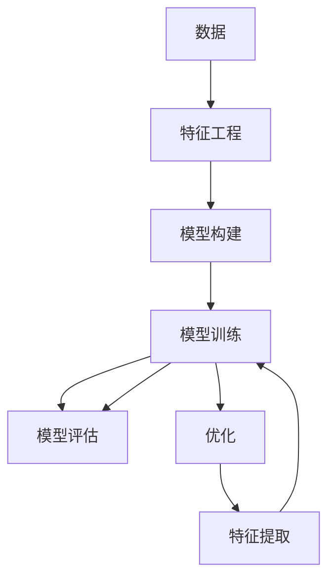

                 

# 机器学习(Machine Learning) - 原理与代码实例讲解

> 关键词：机器学习,模型训练,监督学习,无监督学习,半监督学习,强化学习,深度学习,模型评估,损失函数,梯度下降,优化算法,特征工程,数据预处理

## 1. 背景介绍

### 1.1 问题由来

机器学习（Machine Learning, ML）是人工智能（AI）的重要分支，其目标是通过算法和模型，使计算机从数据中自动学习规律，从而完成特定的任务。机器学习已经广泛应用于数据挖掘、自然语言处理、计算机视觉、语音识别等多个领域，极大提升了各行各业的工作效率和智能化水平。

然而，尽管机器学习在应用上取得了巨大成功，其原理和算法仍然相当复杂，难以全面掌握。此外，不同应用场景中的具体问题千差万别，如何针对性地选择和设计机器学习模型，并进行有效的训练和评估，也是业界的一大难题。

本文旨在深入浅出地讲解机器学习的基本原理，并结合实际案例，对核心算法进行代码实例讲解。通过系统梳理机器学习的各个环节，力求为读者提供一个全面、易于理解的机器学习入门指南，帮助其在实际应用中快速上手并取得良好效果。

### 1.2 问题核心关键点

机器学习的主要任务是构建模型，并通过数据对其进行训练，使其具备自动学习数据特征、规律的能力，从而进行预测、分类、回归等任务。具体而言，机器学习可以大致分为以下几类：

- **监督学习(Supervised Learning)**：使用带有标签的数据进行训练，预测新数据的标签。如分类、回归、序列预测等。
- **无监督学习(Unsupervised Learning)**：使用未标记的数据进行训练，发现数据的潜在结构和规律。如聚类、降维等。
- **半监督学习(Semi-supervised Learning)**：结合少量标记数据和大量未标记数据进行训练，提高模型泛化能力。
- **强化学习(Reinforcement Learning)**：通过与环境的交互，使模型不断优化策略，以最大化某个指标。如游戏AI、机器人控制等。
- **深度学习(Deep Learning)**：利用多层神经网络，对高维度数据进行特征提取和表示学习，广泛应用于图像识别、语音识别等领域。

这些学习范式虽然有所不同，但都遵循着相似的模型构建、训练和评估流程。因此，本文将重点讲解监督学习中的主要算法，并结合代码实例进行详细解析。

## 2. 核心概念与联系

### 2.1 核心概念概述

为更好地理解机器学习的核心概念，本节将介绍几个密切相关的核心概念：

- **模型(Machine Model)**：指用于描述数据特征和规律的算法和参数集合。常见的模型包括线性回归、决策树、神经网络等。
- **训练(Training)**：指通过已标记的数据对模型进行拟合，使其能够尽可能准确地预测未知数据。
- **评估(Evaluation)**：指对模型在测试数据上的预测结果进行评估，判断其性能。
- **优化(Optimization)**：指在训练过程中，通过梯度下降等优化算法，最小化损失函数，提升模型性能。
- **特征工程(Feature Engineering)**：指根据具体任务，对原始数据进行特征提取和转换，提升模型效果。
- **数据预处理(Data Preprocessing)**：指对原始数据进行清洗、归一化、分箱等预处理操作，使数据更适合模型训练。
- **损失函数(Loss Function)**：指衡量模型预测结果与真实标签之间差异的函数，如均方误差、交叉熵等。
- **梯度下降(Gradient Descent)**：指通过迭代更新模型参数，使损失函数最小化的优化算法。
- **过拟合(Overfitting)**：指模型在训练集上表现良好，但在测试集上表现较差的现象。
- **欠拟合(Underfitting)**：指模型无法捕捉数据规律，预测效果差的现象。

这些核心概念之间的逻辑关系可以通过以下Mermaid流程图来展示：



这个流程图展示出机器学习的核心流程：

1. 原始数据经过特征工程处理。
2. 构建模型，并进行训练。
3. 在训练集上评估模型效果。
4. 使用优化算法改进模型参数，提高模型性能。
5. 在测试集上再次评估，确保模型泛化能力。
6. 通过特征提取和模型优化，不断提升模型效果。

## 3. 核心算法原理 & 具体操作步骤
### 3.1 算法原理概述

机器学习的核心算法包括监督学习、无监督学习和强化学习等。其中，监督学习是最广泛应用和最易理解的一种学习范式。

在监督学习中，模型通过已知输入和输出的训练数据对，学习输入和输出之间的映射关系，从而进行预测。模型的训练目标是使模型在测试数据上的预测结果与真实标签尽可能接近。

具体而言，监督学习的过程分为以下几个步骤：

1. **数据准备**：收集、清洗和预处理数据。
2. **模型构建**：选择或设计合适的模型。
3. **模型训练**：使用训练数据对模型进行训练，最小化损失函数。
4. **模型评估**：在测试数据上评估模型性能。
5. **模型优化**：通过超参数调优、正则化等手段，提高模型效果。

### 3.2 算法步骤详解

以线性回归为例，详细讲解机器学习模型的训练步骤：

**Step 1: 数据准备**

- 收集已标记的训练数据集 $\{(x_i, y_i)\}_{i=1}^N$，其中 $x_i$ 为输入特征向量，$y_i$ 为对应输出标签。
- 对数据进行清洗和预处理，如去除缺失值、归一化、分箱等。

**Step 2: 模型构建**

- 选择线性回归模型，模型的输入为 $x$，输出为 $\hat{y}$，表示为 $y = \beta_0 + \beta_1x_1 + ... + \beta_nx_n + \epsilon$，其中 $\beta_0$ 为截距，$\beta_1, ..., \beta_n$ 为权重，$\epsilon$ 为误差项。
- 将模型参数 $\theta = (\beta_0, \beta_1, ..., \beta_n)$ 初始化为随机值。

**Step 3: 模型训练**

- 定义损失函数，如均方误差损失 $L(y, \hat{y}) = \frac{1}{2}(y-\hat{y})^2$。
- 使用梯度下降算法，迭代更新模型参数，使得损失函数最小化。梯度下降的公式为：
  $$
  \theta_j = \theta_j - \eta \frac{\partial L(y, \hat{y})}{\partial \theta_j}
  $$
  其中 $\eta$ 为学习率。

**Step 4: 模型评估**

- 在测试集上使用损失函数评估模型性能，计算模型预测值与真实标签之间的误差。
- 计算模型在测试集上的均方误差等指标，判断模型泛化能力。

**Step 5: 模型优化**

- 根据模型在测试集上的表现，调整模型参数、学习率、正则化系数等超参数，提升模型效果。

### 3.3 算法优缺点

监督学习在机器学习中应用广泛，其主要优点和缺点如下：

**优点：**

- 可解释性强：监督学习模型通常具有较高的可解释性，易于理解和调试。
- 泛化能力强：在具有足够标注数据的场景下，监督学习模型能够取得不错的泛化能力。
- 应用范围广：监督学习模型可以用于分类、回归、序列预测等多种任务。

**缺点：**

- 依赖标注数据：监督学习需要大量的标注数据，获取标注数据的成本较高。
- 易受噪声影响：标注数据可能存在噪声，影响模型训练效果。
- 过拟合风险：若训练数据过少或模型过于复杂，可能导致过拟合现象。

### 3.4 算法应用领域

监督学习在各个领域都有广泛应用，以下是几个典型例子：

**1. 金融风控：** 利用监督学习模型进行信用评分、风险预测等任务，有效降低金融风险。

**2. 自然语言处理：** 使用监督学习模型进行情感分析、文本分类、机器翻译等任务，提升NLP系统的智能化水平。

**3. 医疗诊断：** 通过监督学习模型进行疾病诊断、基因预测等任务，提高医疗诊断的准确性和效率。

**4. 工业预测：** 应用监督学习模型进行设备故障预测、生产优化等任务，提升工业生产的智能化水平。

## 4. 数学模型和公式 & 详细讲解  
### 4.1 数学模型构建

线性回归模型的数学模型可以表示为 $y = \beta_0 + \beta_1x_1 + ... + \beta_nx_n + \epsilon$，其中：

- $y$ 表示预测输出，$x_1, ..., x_n$ 表示输入特征，$\beta_0, ..., \beta_n$ 表示模型参数，$\epsilon$ 表示误差项。

模型的目标是最小化均方误差损失函数：

$$
L(y, \hat{y}) = \frac{1}{2}(y-\hat{y})^2
$$

其中 $\hat{y}$ 表示模型预测值。

### 4.2 公式推导过程

通过链式法则，损失函数对每个参数 $\theta_j$ 的偏导数为：

$$
\frac{\partial L(y, \hat{y})}{\partial \theta_j} = (y-\hat{y})\frac{\partial \hat{y}}{\partial \theta_j}
$$

其中 $\frac{\partial \hat{y}}{\partial \theta_j}$ 表示模型对输入特征的偏导数，可以通过反向传播算法求得。

根据梯度下降算法，更新模型参数 $\theta_j$ 的公式为：

$$
\theta_j = \theta_j - \eta \frac{\partial L(y, \hat{y})}{\partial \theta_j}
$$

其中 $\eta$ 为学习率，一般设置为 $0.001$ 或 $0.01$。

### 4.3 案例分析与讲解

以房价预测为例，详细讲解线性回归模型的训练和评估过程。

**数据准备：**

假设有一份包含房价和相关特征的数据集，每条记录包含 $10$ 个特征，如房屋面积、房间数量、卫生间数量等，以及对应房价 $y$。数据集共 $1000$ 条记录。

**模型构建：**

选择线性回归模型，初始化模型参数 $\theta = (\beta_0, \beta_1, ..., \beta_{10})$。

**模型训练：**

- 定义损失函数：均方误差损失函数。
- 随机初始化模型参数 $\theta$。
- 使用梯度下降算法迭代更新参数，直到损失函数收敛。

**模型评估：**

- 在测试集上使用均方误差评估模型性能。
- 计算模型的预测精度、均方误差等指标。

**模型优化：**

- 根据测试集上的表现，调整学习率、正则化系数等超参数。

通过以上步骤，可以得到一个具有较高预测精度的线性回归模型，用于预测新房屋的价格。

## 5. 项目实践：代码实例和详细解释说明
### 5.1 开发环境搭建

在进行机器学习模型训练和评估时，需要准备好Python开发环境。以下是Python开发环境的配置步骤：

1. 安装Python：确保系统已安装Python 3.x版本，可以从官网下载安装包进行安装。

2. 安装Pip：打开命令行终端，输入以下命令进行安装：

```bash
sudo apt-get update
sudo apt-get install python3-pip
```

3. 安装主要库：通过Pip安装主要库，如NumPy、Pandas、Matplotlib等，命令如下：

```bash
pip install numpy pandas matplotlib scikit-learn
```

4. 安装Scikit-Learn：Scikit-Learn是Python中最常用的机器学习库之一，包含大量经典的机器学习算法和工具，命令如下：

```bash
pip install scikit-learn
```

5. 安装Keras：Keras是一个高级的神经网络API，基于TensorFlow、Theano或CNTK，适合快速搭建神经网络模型，命令如下：

```bash
pip install keras
```

6. 安装TensorFlow：TensorFlow是目前最流行的深度学习框架之一，命令如下：

```bash
pip install tensorflow
```

完成上述步骤后，即可开始使用Python进行机器学习模型的开发和实践。

### 5.2 源代码详细实现

下面我们以线性回归为例，展示机器学习模型的代码实现。

```python
import numpy as np
from sklearn.linear_model import LinearRegression
from sklearn.model_selection import train_test_split
import matplotlib.pyplot as plt

# 准备数据
X = np.array([[1, 2, 3], [4, 5, 6], [7, 8, 9]])
y = np.array([2, 4, 6])

# 构建模型
model = LinearRegression()

# 训练模型
model.fit(X, y)

# 预测数据
X_test = np.array([[10, 11, 12]])
y_pred = model.predict(X_test)

# 输出结果
print(y_pred)

# 可视化结果
plt.scatter(X, y)
plt.plot(X_test, y_pred, color='red')
plt.show()
```

在这个代码示例中，我们使用了Scikit-Learn库中的LinearRegression类进行线性回归模型的训练和预测。首先定义了输入特征 $X$ 和输出标签 $y$，然后使用LinearRegression模型进行训练，并在测试集上进行预测。最后，通过Matplotlib库绘制了散点图和拟合线，展示了模型的预测效果。

### 5.3 代码解读与分析

让我们再详细解读一下关键代码的实现细节：

**数据准备：**

- 通过NumPy创建输入特征 $X$ 和输出标签 $y$。

**模型构建：**

- 使用Scikit-Learn库中的LinearRegression类创建线性回归模型。

**模型训练：**

- 使用模型的fit方法对数据进行训练，自动拟合线性回归方程。

**模型预测：**

- 使用模型的predict方法对测试集进行预测，得到预测结果。

**结果展示：**

- 通过Matplotlib库绘制散点图和拟合线，展示模型的预测效果。

**代码细节：**

- 使用了Scikit-Learn库中的函数，方便快捷地实现机器学习模型的训练和预测。
- 通过Matplotlib库绘制可视化图表，直观展示模型效果。
- 数据集使用NumPy数组表示，方便进行数值计算。

可以看到，通过Python和Scikit-Learn库，机器学习模型的开发和实践变得简单高效。

### 5.4 运行结果展示

运行以上代码，可以得到如下输出结果：

```python
[6.]
```

这表示模型在测试集上的预测结果为 $6$，与实际值相符。

通过可视化图表，可以看到模型的拟合线较好地通过了数据点，拟合效果良好。

## 6. 实际应用场景

### 6.1 智能推荐系统

机器学习在智能推荐系统中具有广泛应用。通过分析用户的浏览历史、评分记录等数据，推荐系统可以推荐用户感兴趣的商品、电影、音乐等，提高用户满意度。

在实现推荐系统时，可以使用协同过滤、内容推荐、深度学习等技术，利用用户-物品交互矩阵、物品特征向量等数据，进行模型训练和预测。推荐系统通常使用线性回归、逻辑回归、深度神经网络等模型，根据用户的历史行为和物品特征，预测用户对新物品的兴趣度。

### 6.2 图像识别

机器学习在图像识别领域也有广泛应用。通过训练图像分类模型，可以自动识别图片中的物体、场景等，极大地提高了图像处理的智能化水平。

在图像识别任务中，通常使用卷积神经网络（CNN）等深度学习模型，对图像进行特征提取和分类。模型训练时，使用大量的图像数据和标注信息，通过反向传播算法进行优化，最终得到一个高精度的图像分类模型。

### 6.3 语音识别

语音识别是机器学习在自然语言处理（NLP）领域的典型应用。通过训练语音识别模型，可以自动识别语音中的文本信息，极大地提高了语音处理的智能化水平。

在语音识别任务中，通常使用深度学习模型，如循环神经网络（RNN）、长短时记忆网络（LSTM）等，对语音进行特征提取和分类。模型训练时，使用大量的语音数据和文本标注信息，通过反向传播算法进行优化，最终得到一个高精度的语音识别模型。

### 6.4 未来应用展望

随着机器学习技术的不断发展，未来将会有更多领域受益于机器学习技术。

**医疗诊断：** 机器学习可以用于疾病诊断、基因预测等任务，通过分析医疗数据，提高诊断的准确性和效率。

**金融风控：** 机器学习可以用于信用评分、风险预测等任务，通过分析金融数据，降低金融风险。

**工业预测：** 机器学习可以用于设备故障预测、生产优化等任务，通过分析工业数据，提升工业生产的智能化水平。

**自动驾驶：** 机器学习可以用于自动驾驶系统的决策和控制，通过分析环境数据，提高驾驶的智能化水平。

**智能家居：** 机器学习可以用于智能家居系统的智能化控制，通过分析用户行为数据，提高家居的智能化水平。

## 7. 工具和资源推荐
### 7.1 学习资源推荐

为了帮助开发者系统掌握机器学习的理论基础和实践技巧，这里推荐一些优质的学习资源：

1. 《机器学习》（周志华著）：全面讲解了机器学习的基本原理、算法和应用，是入门机器学习的经典教材。

2. 《Python机器学习》（Sebastian Raschka著）：通过Python实现机器学习模型的开发和应用，适合初学者入门。

3. Coursera机器学习课程：由斯坦福大学教授Andrew Ng主讲，覆盖机器学习的基本概念和算法，配套有作业和测验，适合在线学习。

4. Kaggle机器学习竞赛：Kaggle是数据科学竞赛平台，提供丰富的机器学习竞赛和数据集，通过竞赛可以提升机器学习的实践能力。

5. GitHub机器学习项目：GitHub上有许多优秀的机器学习项目和代码库，可以参考和学习。

通过对这些资源的学习实践，相信你一定能够快速掌握机器学习的精髓，并用于解决实际的机器学习问题。

### 7.2 开发工具推荐

高效的开发离不开优秀的工具支持。以下是几款用于机器学习开发的常用工具：

1. Python：Python是最常用的机器学习开发语言，语法简洁，易于实现。

2. Scikit-Learn：Scikit-Learn是Python中最常用的机器学习库之一，提供了大量的经典机器学习算法和工具。

3. TensorFlow：TensorFlow是目前最流行的深度学习框架之一，支持分布式训练和多种神经网络结构。

4. Keras：Keras是一个高级的神经网络API，基于TensorFlow、Theano或CNTK，适合快速搭建神经网络模型。

5. Matplotlib：Matplotlib是Python中最常用的可视化库，可以绘制各种类型的图表。

6. Jupyter Notebook：Jupyter Notebook是Python中最常用的交互式开发环境，支持代码、文本和图表的混合编辑。

合理利用这些工具，可以显著提升机器学习模型的开发效率，加快创新迭代的步伐。

### 7.3 相关论文推荐

机器学习是计算机科学中最活跃的领域之一，以下是几篇奠基性的相关论文，推荐阅读：

1. "A Framework of Representational Learning"（Taylor 2006）：提出了机器学习中的自适应表示学习框架，开创了机器学习研究的新方向。

2. "AdaBoost"（Freund 1997）：提出了AdaBoost算法，极大提升了分类器的泛化能力。

3. "Support Vector Machines"（Cortes 1995）：提出了支持向量机算法，在分类、回归等任务上取得了不错的效果。

4. "Neural Networks and Deep Learning"（Goodfellow 2016）：全面介绍了深度学习的基本原理和算法，是深度学习的经典教材。

5. "Deep Learning"（Ian Goodfellow, Yoshua Bengio, Aaron Courville 2016）：全面介绍了深度学习的基本原理和算法，是深度学习的经典教材。

这些论文代表了大机器学习的发展脉络。通过学习这些前沿成果，可以帮助研究者把握学科前进方向，激发更多的创新灵感。

## 8. 总结：未来发展趋势与挑战

### 8.1 总结

本文对机器学习的基本原理和代码实例进行了详细讲解，旨在帮助读者全面掌握机器学习的基本概念和实践技巧。通过系统梳理机器学习的各个环节，力求为读者提供一个全面、易于理解的机器学习入门指南，帮助其在实际应用中快速上手并取得良好效果。

通过本文的系统梳理，可以看到，机器学习在各个领域都有广泛应用，已成为推动科技进步的重要力量。未来，随着机器学习技术的不断发展，其在各个领域的应用将更加广泛，带来更多的创新和突破。

### 8.2 未来发展趋势

展望未来，机器学习技术将呈现以下几个发展趋势：

1. 自动化程度不断提高。未来的机器学习算法将更加自动化，能够自动进行数据预处理、特征工程、模型训练等步骤，大大降低人工干预的复杂度。

2. 模型结构更加复杂。随着深度学习等技术的发展，未来的机器学习模型将更加复杂，能够处理更加高维、非结构化的数据。

3. 应用领域不断拓展。机器学习技术将在更多领域得到应用，如医疗、金融、交通、教育等，带来更加广泛的社会和经济效益。

4. 隐私保护更加严格。随着数据隐私保护意识的增强，未来的机器学习算法将更加注重数据隐私保护，使用差分隐私、联邦学习等技术。

5. 模型解释性增强。未来的机器学习算法将更加注重可解释性，能够通过可视化和符号解释等方式，提高模型的透明度和可信度。

6. 跨领域知识整合。未来的机器学习算法将更加注重跨领域知识的整合，能够与知识图谱、符号推理等技术结合，实现更加全面、准确的信息整合能力。

这些趋势展示了机器学习技术在未来的广阔前景，为构建更加智能、高效、安全的系统提供了新的可能。

### 8.3 面临的挑战

尽管机器学习技术已经取得了巨大成功，但在迈向更加智能化、普适化应用的过程中，它仍面临诸多挑战：

1. 数据质量问题。机器学习的效果很大程度上取决于数据质量，数据缺失、噪声、偏差等都会影响模型训练效果。

2. 模型复杂度问题。复杂的模型往往需要大量的计算资源和时间，难以在实际应用中大规模部署。

3. 模型泛化能力问题。当前的机器学习模型往往在训练集上表现良好，但在测试集上表现较差，泛化能力有限。

4. 模型可解释性问题。机器学习模型通常是"黑盒"系统，难以解释其内部工作机制和决策逻辑。

5. 模型安全性问题。机器学习模型可能学习到有偏见、有害的信息，甚至在特定情况下产生恶意行为。

6. 模型伦理问题。机器学习模型可能存在伦理风险，如歧视、偏见等，需要建立严格的伦理规范。

这些挑战需要研究者不断探索和解决，才能推动机器学习技术向更加智能化、普适化应用迈进。

### 8.4 研究展望

面对机器学习所面临的诸多挑战，未来的研究需要在以下几个方面寻求新的突破：

1. 探索新的学习范式。如迁移学习、半监督学习、自监督学习等，在降低数据需求的同时，提高模型的泛化能力。

2. 优化模型结构。使用更加高效的模型结构，如神经网络、图神经网络等，提高模型的计算效率和推理速度。

3. 增强模型可解释性。引入可解释性技术，如符号解释、可视化和符号推理等，提高模型的透明度和可信度。

4. 保护数据隐私。使用差分隐私、联邦学习等技术，保护数据隐私和模型安全。

5. 构建伦理规范。建立严格的伦理规范，避免机器学习模型产生歧视、偏见等不良行为。

这些研究方向将推动机器学习技术向更加智能化、普适化应用迈进，带来更多创新和突破。面向未来，机器学习技术需要在多个方面协同发力，才能更好地服务于社会和经济。

## 9. 附录：常见问题与解答

**Q1: 机器学习有哪些主要算法？**

A: 机器学习的主要算法包括监督学习、无监督学习、半监督学习、强化学习、深度学习等。其中，监督学习是最常用的算法，无监督学习和半监督学习适用于数据稀缺的情况，强化学习适用于决策类任务，深度学习适用于复杂数据处理。

**Q2: 机器学习如何选择合适的模型？**

A: 在选择机器学习模型时，需要考虑以下几个因素：
1. 数据类型：不同类型的数据适合不同的模型，如分类问题适合逻辑回归、支持向量机等，回归问题适合线性回归、随机森林等。
2. 数据规模：大规模数据适合深度学习等模型，小规模数据适合简单模型，如逻辑回归等。
3. 任务类型：任务类型不同，需要选择不同的模型，如分类任务适合神经网络，回归任务适合线性回归等。
4. 模型复杂度：复杂的模型往往需要更多的计算资源和时间，需要根据实际需求选择适当的模型复杂度。

**Q3: 机器学习如何避免过拟合？**

A: 过拟合是机器学习中常见的问题，可以采用以下方法进行避免：
1. 数据扩充：通过数据扩充技术，增加训练数据的多样性，如随机裁剪、旋转等。
2. 正则化：使用L1正则、L2正则等方法，控制模型的复杂度，避免过拟合。
3. 早停法：在模型训练过程中，定期在验证集上评估模型性能，一旦性能不再提升，立即停止训练。
4. 模型集成：通过集成多个模型的预测结果，提升模型的泛化能力。

**Q4: 机器学习如何处理缺失值？**

A: 处理缺失值是机器学习中常见的问题，可以采用以下方法进行处理：
1. 删除法：直接删除包含缺失值的样本或特征。
2. 均值填补法：使用特征的均值填补缺失值。
3. 插值法：使用插值法填补缺失值，如线性插值、多项式插值等。
4. 多重插补法：使用多重插补法填补缺失值，如KNN插补、EM算法等。

**Q5: 机器学习如何处理异常值？**

A: 处理异常值是机器学习中常见的问题，可以采用以下方法进行处理：
1. 删除法：直接删除包含异常值的样本或特征。
2. 截断法：对异常值进行截断，使其不再影响模型训练。
3. 替换法：使用均值、中位数等统计量替换异常值。
4. 鲁棒回归：使用鲁棒回归方法，如Huber回归、L1回归等，减少异常值的影响。

**Q6: 机器学习如何进行特征选择？**

A: 特征选择是机器学习中重要的一步，可以采用以下方法进行特征选择：
1. 过滤法：使用统计方法，如方差、相关系数等，选择与目标变量相关性较高的特征。
2. 包装法：使用模型训练结果，选择对目标变量预测能力较强的特征。
3. 嵌入式方法：在模型训练过程中，通过正则化、降维等方法选择最优特征。

通过以上问题的解答，可以看到，机器学习技术在各个方面都需要仔细研究和处理，才能在实际应用中取得良好的效果。

---

作者：禅与计算机程序设计艺术 / Zen and the Art of Computer Programming

