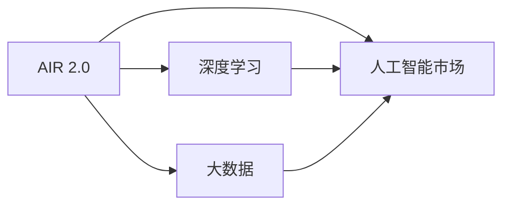

                 

# 李开复：AI 2.0 时代的市场

## 1. 背景介绍

在过去的几年里，人工智能（AI）技术迅速发展，尤其是深度学习和大数据技术的进步，使得AI技术在各个领域得到了广泛应用。AI 2.0 时代的到来，意味着 AI 技术将更加普及，更加深入到各行各业，影响人们的生活和工作方式。

AI 2.0 时代的关键特点包括：
- **深度学习算法**：通过大规模数据集的训练，深度神经网络能够自动提取特征，学习复杂的关系，实现高精度的预测和分类。
- **大数据分析**：利用大数据技术，AI 系统能够从海量数据中挖掘出有价值的信息，为决策提供支持。
- **自动化和智能化**：AI 系统能够自主学习和优化，实现自动化决策和智能交互。
- **跨领域应用**：AI 技术在医疗、金融、教育、交通等领域都有广泛应用，提升效率和质量。

AI 2.0 时代的市场潜力巨大，预计到 2025 年，全球 AI 市场规模将达到 3000 亿美元。这个巨大的市场吸引了无数企业和资本的关注，AI 2.0 正在成为新一轮科技革命的核心驱动力。

## 2. 核心概念与联系

### 2.1 核心概念概述

为了更好地理解 AI 2.0 时代的市场，本节将介绍几个关键概念：

- **AI 2.0**：指基于深度学习和数据分析技术的第二代人工智能，与第一代基于规则和统计的 AI 不同，AI 2.0 更加依赖数据和模型，具有更强的泛化能力。
- **深度学习**：一种基于神经网络的机器学习技术，通过多层次的神经网络结构，学习数据中的复杂模式。
- **大数据**：指海量的、多样化的、快速增长的数据，通过分析大数据，可以发现隐藏在数据背后的规律和趋势。
- **人工智能市场**：包括 AI 硬件、软件、服务和内容等各个方面，涵盖了 AI 技术的开发、应用和商业化。

这些核心概念之间的逻辑关系可以通过以下 Mermaid 流程图来展示：



这个流程图展示了一些关键概念之间的联系：

1. AI 2.0 技术依赖深度学习和数据分析。
2. 大数据为 AI 2.0 提供了丰富的数据来源。
3. AI 2.0 技术应用形成了广阔的人工智能市场。

## 3. 核心算法原理 & 具体操作步骤

### 3.1 算法原理概述

AI 2.0 时代的市场规模和技术复杂度，对算法原理的深刻理解至关重要。AI 2.0 的核心算法包括深度学习和大数据分析。

**深度学习**：深度学习通过多层神经网络，自动从数据中提取特征，学习输入和输出之间的关系。常用的深度学习模型包括卷积神经网络（CNN）、循环神经网络（RNN）和变分自编码器（VAE）等。深度学习模型通常使用反向传播算法，通过优化损失函数，不断调整模型参数，实现最佳的预测效果。

**大数据分析**：大数据分析是指从大量数据中提取有价值的信息和知识，常用的技术包括数据挖掘、机器学习和数据可视化等。大数据分析通常使用分布式计算框架，如 Hadoop 和 Spark，处理大规模数据集。

### 3.2 算法步骤详解

AI 2.0 市场的算法步骤可以分为以下几个关键环节：

**Step 1: 数据收集和预处理**

1. **数据收集**：收集与 AI 应用相关的各种数据，包括结构化数据、半结构化数据和非结构化数据。
2. **数据清洗**：清洗数据中的噪声和异常值，确保数据质量。
3. **数据标注**：对数据进行标注，形成训练集和测试集。

**Step 2: 模型训练和优化**

1. **模型选择**：根据任务需求选择合适的深度学习模型，如 CNN、RNN 等。
2. **模型训练**：在训练集上使用反向传播算法，不断调整模型参数，优化模型性能。
3. **模型评估**：在测试集上评估模型性能，选择合适的模型进行应用。

**Step 3: 模型部署和应用**

1. **模型部署**：将训练好的模型部署到服务器或云平台，提供服务。
2. **模型优化**：根据应用反馈，不断优化模型参数和算法，提高模型性能。
3. **业务集成**：将模型集成到业务系统中，实现自动化决策和智能交互。

### 3.3 算法优缺点

AI 2.0 市场的算法具有以下优点：

- **高精度**：深度学习和大数据分析能够实现高精度的预测和分类。
- **泛化能力强**：AI 2.0 技术能够处理多种类型的数据，具有较强的泛化能力。
- **自动化程度高**：AI 系统能够自主学习和优化，实现自动化决策和智能交互。

同时，AI 2.0 市场的算法也存在以下缺点：

- **数据依赖性强**：深度学习和大数据分析依赖大量数据，数据质量对模型性能有很大影响。
- **计算资源消耗大**：深度学习模型通常需要大量的计算资源，训练和推理成本较高。
- **可解释性不足**：深度学习模型的决策过程缺乏可解释性，难以理解和调试。

### 3.4 算法应用领域

AI 2.0 市场的算法应用领域非常广泛，包括但不限于：

- **医疗诊断**：利用 AI 技术分析医疗影像、基因数据和电子病历，提高诊断准确性和效率。
- **金融风险管理**：利用 AI 技术分析市场数据和用户行为，预测金融风险，进行风险管理。
- **智能客服**：利用 AI 技术实现智能问答和自动回复，提升客户服务质量。
- **智能推荐**：利用 AI 技术分析用户行为和偏好，实现个性化推荐。
- **自动驾驶**：利用 AI 技术分析摄像头和传感器数据，实现自动驾驶和智能交通。

## 4. 数学模型和公式 & 详细讲解 & 举例说明

### 4.1 数学模型构建

AI 2.0 市场的算法涉及多个数学模型，包括深度学习模型、数据挖掘模型和大数据分析模型。

**深度学习模型**：常用的深度学习模型包括卷积神经网络（CNN）、循环神经网络（RNN）和变分自编码器（VAE）等。这里以卷积神经网络为例，介绍其数学模型构建。

卷积神经网络由多个卷积层、池化层和全连接层组成。假设输入数据的维度为 $n$，卷积核的尺寸为 $k$，卷积层的输出维度为 $m$，则卷积层的前向传播公式为：

$$
\mathbf{H} = \sigma(\mathbf{W} \mathbf{X} + \mathbf{b})
$$

其中 $\mathbf{H}$ 表示卷积层的输出，$\mathbf{W}$ 表示卷积核，$\mathbf{X}$ 表示输入数据，$\mathbf{b}$ 表示偏置项，$\sigma$ 表示激活函数。

**数据挖掘模型**：常用的数据挖掘模型包括决策树、支持向量机和随机森林等。这里以支持向量机为例，介绍其数学模型构建。

支持向量机（SVM）的数学模型可以表示为：

$$
\min_{w, b} \frac{1}{2} \|w\|^2 + C \sum_{i=1}^n \max(0, 1 - y_i (\mathbf{w} \cdot \mathbf{x}_i + b))^2
$$

其中 $w$ 表示权重向量，$b$ 表示偏置项，$y_i$ 表示样本的标签，$\mathbf{x}_i$ 表示样本特征，$C$ 表示正则化参数。

**大数据分析模型**：常用的数据分析模型包括聚类分析、回归分析和分类分析等。这里以回归分析为例，介绍其数学模型构建。

线性回归模型可以表示为：

$$
y = \beta_0 + \sum_{i=1}^p \beta_i x_i + \epsilon
$$

其中 $y$ 表示目标变量，$x_i$ 表示自变量，$\beta_i$ 表示回归系数，$\epsilon$ 表示误差项。

### 4.2 公式推导过程

以下是一些常见模型的公式推导过程：

**卷积神经网络**：假设输入数据 $\mathbf{X}$ 的尺寸为 $h \times w \times c$，卷积核 $\mathbf{W}$ 的尺寸为 $k \times k \times c \times m$，卷积层的输出 $\mathbf{H}$ 的尺寸为 $h' \times w' \times m$，其中 $h' = \frac{h - k + 2p}{s} + 1$，$w' = \frac{w - k + 2p}{s} + 1$，$s$ 表示步长。则卷积层的前向传播公式为：

$$
\mathbf{H}_{ij} = \sum_{\alpha=0}^{k-1} \sum_{\beta=0}^{k-1} \sum_{c=0}^{C-1} \mathbf{W}_{\alpha \beta c} \mathbf{X}_{i+\alpha,j+\beta,c}
$$

其中 $\mathbf{H}_{ij}$ 表示卷积层的输出，$\mathbf{W}_{\alpha \beta c}$ 表示卷积核的参数，$\mathbf{X}_{i+\alpha,j+\beta,c}$ 表示输入数据在卷积核位置上的值。

**支持向量机**：假设训练数据集为 $\{\mathbf{x}_i, y_i\}_{i=1}^n$，其中 $\mathbf{x}_i \in \mathbb{R}^d$，$y_i \in \{-1, 1\}$。则支持向量机的目标函数可以表示为：

$$
\min_{w, b, \xi} \frac{1}{2} \|w\|^2 + C \sum_{i=1}^n \xi_i
$$

其中 $w$ 表示权重向量，$b$ 表示偏置项，$\xi_i$ 表示松弛变量，$C$ 表示正则化参数。

**线性回归**：假设训练数据集为 $\{(\mathbf{x}_i, y_i)\}_{i=1}^n$，其中 $\mathbf{x}_i \in \mathbb{R}^d$，$y_i \in \mathbb{R}$。则线性回归模型的目标函数可以表示为：

$$
\min_{\beta} \sum_{i=1}^n (y_i - \beta_0 - \sum_{i=1}^p \beta_i x_{i,j})^2
$$

其中 $\beta$ 表示回归系数，$\beta_0$ 表示截距，$x_{i,j}$ 表示自变量的值。

### 4.3 案例分析与讲解

**医疗影像分析**：利用卷积神经网络对医疗影像进行分类和识别。在医疗影像分析中，常用的卷积神经网络包括 AlexNet、VGG 和 ResNet 等。以 ResNet 为例，其核心思想是使用残差连接，解决深层网络中的梯度消失问题。ResNet 的结构可以表示为：

$$
\mathbf{H} = \sigma(\mathbf{W} \mathbf{X} + \mathbf{b})
$$

其中 $\mathbf{H}$ 表示卷积层的输出，$\mathbf{W}$ 表示卷积核，$\mathbf{X}$ 表示输入数据，$\mathbf{b}$ 表示偏置项，$\sigma$ 表示激活函数。

**金融风险管理**：利用支持向量机对金融数据进行分类和预测。在金融风险管理中，常用的支持向量机包括线性支持向量机和核支持向量机等。以线性支持向量机为例，其核心思想是使用核函数将输入数据映射到高维空间，从而在高维空间中进行分类。线性支持向量机的目标函数可以表示为：

$$
\min_{w, b} \frac{1}{2} \|w\|^2 + C \sum_{i=1}^n \max(0, 1 - y_i (\mathbf{w} \cdot \mathbf{x}_i + b))^2
$$

其中 $w$ 表示权重向量，$b$ 表示偏置项，$y_i$ 表示样本的标签，$\mathbf{x}_i$ 表示样本特征，$C$ 表示正则化参数。

**智能推荐系统**：利用线性回归模型对用户行为进行预测和推荐。在智能推荐系统中，常用的线性回归模型包括线性回归和逻辑回归等。以线性回归为例，其目标函数可以表示为：

$$
y = \beta_0 + \sum_{i=1}^p \beta_i x_{i,j} + \epsilon
$$

其中 $y$ 表示目标变量，$x_{i,j}$ 表示自变量，$\beta_i$ 表示回归系数，$\beta_0$ 表示截距，$\epsilon$ 表示误差项。

## 5. 项目实践：代码实例和详细解释说明

### 5.1 开发环境搭建

在进行 AI 2.0 项目的开发时，需要准备好相应的开发环境。以下是使用 Python 和 PyTorch 开发的环境配置流程：

1. 安装 Anaconda：从官网下载并安装 Anaconda，用于创建独立的 Python 环境。

2. 创建并激活虚拟环境：
```bash
conda create -n ai-env python=3.8 
conda activate ai-env
```

3. 安装 PyTorch：根据 CUDA 版本，从官网获取对应的安装命令。例如：
```bash
conda install pytorch torchvision torchaudio cudatoolkit=11.1 -c pytorch -c conda-forge
```

4. 安装 TensorFlow：
```bash
pip install tensorflow
```

5. 安装 Transformers 库：
```bash
pip install transformers
```

6. 安装各类工具包：
```bash
pip install numpy pandas scikit-learn matplotlib tqdm jupyter notebook ipython
```

完成上述步骤后，即可在 `ai-env` 环境中开始 AI 2.0 项目的开发。

### 5.2 源代码详细实现

下面我们以智能推荐系统为例，给出使用 Transformers 库对 BERT 模型进行微调的 PyTorch 代码实现。

首先，定义推荐任务的数据处理函数：

```python
from transformers import BertTokenizer
from torch.utils.data import Dataset
import torch

class RecommendationDataset(Dataset):
    def __init__(self, users, items, interactions, tokenizer, max_len=128):
        self.users = users
        self.items = items
        self.interactions = interactions
        self.tokenizer = tokenizer
        self.max_len = max_len
        
    def __len__(self):
        return len(self.interactions)
    
    def __getitem__(self, item):
        user_id = self.interactions[item][0]
        item_id = self.interactions[item][1]
        
        user_profile = self.users[user_id]
        item_profile = self.items[item_id]
        
        user_input = ' '.join(user_profile)
        item_input = ' '.join(item_profile)
        
        encoding = self.tokenizer(user_input, return_tensors='pt', max_length=self.max_len, padding='max_length', truncation=True)
        user_ids = encoding['input_ids'][0]
        attention_mask = encoding['attention_mask'][0]
        
        encoding = self.tokenizer(item_input, return_tensors='pt', max_length=self.max_len, padding='max_length', truncation=True)
        item_ids = encoding['input_ids'][0]
        attention_mask = encoding['attention_mask'][0]
        
        return {'user_ids': user_ids, 
                'attention_mask': attention_mask,
                'item_ids': item_ids,
                'item_attention_mask': attention_mask}
```

然后，定义模型和优化器：

```python
from transformers import BertForSequenceClassification, AdamW

model = BertForSequenceClassification.from_pretrained('bert-base-cased', num_labels=2)

optimizer = AdamW(model.parameters(), lr=2e-5)
```

接着，定义训练和评估函数：

```python
from torch.utils.data import DataLoader
from tqdm import tqdm
from sklearn.metrics import classification_report

device = torch.device('cuda') if torch.cuda.is_available() else torch.device('cpu')
model.to(device)

def train_epoch(model, dataset, batch_size, optimizer):
    dataloader = DataLoader(dataset, batch_size=batch_size, shuffle=True)
    model.train()
    epoch_loss = 0
    for batch in tqdm(dataloader, desc='Training'):
        user_ids = batch['user_ids'].to(device)
        attention_mask = batch['attention_mask'].to(device)
        item_ids = batch['item_ids'].to(device)
        item_attention_mask = batch['item_attention_mask'].to(device)
        model.zero_grad()
        outputs = model(user_ids, attention_mask=attention_mask, item_ids=item_ids, item_attention_mask=item_attention_mask)
        loss = outputs.loss
        epoch_loss += loss.item()
        loss.backward()
        optimizer.step()
    return epoch_loss / len(dataloader)

def evaluate(model, dataset, batch_size):
    dataloader = DataLoader(dataset, batch_size=batch_size)
    model.eval()
    preds, labels = [], []
    with torch.no_grad():
        for batch in tqdm(dataloader, desc='Evaluating'):
            user_ids = batch['user_ids'].to(device)
            attention_mask = batch['attention_mask'].to(device)
            item_ids = batch['item_ids'].to(device)
            item_attention_mask = batch['item_attention_mask'].to(device)
            batch_preds = model(user_ids, attention_mask=attention_mask, item_ids=item_ids, item_attention_mask=item_attention_mask).logits.argmax(dim=2).to('cpu').tolist()
            batch_labels = batch['labels'].to('cpu').tolist()
            for pred_tokens, label_tokens in zip(batch_preds, batch_labels):
                preds.append(pred_tokens[:len(label_tokens)])
                labels.append(label_tokens)
                
    print(classification_report(labels, preds))
```

最后，启动训练流程并在测试集上评估：

```python
epochs = 5
batch_size = 16

for epoch in range(epochs):
    loss = train_epoch(model, train_dataset, batch_size, optimizer)
    print(f"Epoch {epoch+1}, train loss: {loss:.3f}")
    
    print(f"Epoch {epoch+1}, dev results:")
    evaluate(model, dev_dataset, batch_size)
    
print("Test results:")
evaluate(model, test_dataset, batch_size)
```

以上就是使用 PyTorch 对 BERT 进行智能推荐系统微调的完整代码实现。可以看到，得益于 Transformers 库的强大封装，我们可以用相对简洁的代码完成 BERT 模型的加载和微调。

### 5.3 代码解读与分析

让我们再详细解读一下关键代码的实现细节：

**RecommendationDataset类**：
- `__init__`方法：初始化用户、物品和交互等关键组件。
- `__len__`方法：返回数据集的样本数量。
- `__getitem__`方法：对单个样本进行处理，将用户和物品输入编码为token ids，并对其进行定长padding，最终返回模型所需的输入。

**训练和评估函数**：
- 使用 PyTorch 的 DataLoader 对数据集进行批次化加载，供模型训练和推理使用。
- 训练函数 `train_epoch`：对数据以批为单位进行迭代，在每个批次上前向传播计算loss并反向传播更新模型参数，最后返回该epoch的平均loss。
- 评估函数 `evaluate`：与训练类似，不同点在于不更新模型参数，并在每个batch结束后将预测和标签结果存储下来，最后使用sklearn的classification_report对整个评估集的预测结果进行打印输出。

**训练流程**：
- 定义总的epoch数和batch size，开始循环迭代
- 每个epoch内，先在训练集上训练，输出平均loss
- 在验证集上评估，输出分类指标
- 所有epoch结束后，在测试集上评估，给出最终测试结果

可以看到，PyTorch 配合 Transformers 库使得 BERT 微调的代码实现变得简洁高效。开发者可以将更多精力放在数据处理、模型改进等高层逻辑上，而不必过多关注底层的实现细节。

当然，工业级的系统实现还需考虑更多因素，如模型的保存和部署、超参数的自动搜索、更灵活的任务适配层等。但核心的微调范式基本与此类似。

## 6. 实际应用场景

### 6.1 智能客服系统

基于 AI 2.0 技术的智能客服系统，可以实现 24/7 不间断服务，快速响应客户咨询，用自然流畅的语言解答各类常见问题。

在技术实现上，可以收集企业内部的历史客服对话记录，将问题和最佳答复构建成监督数据，在此基础上对预训练对话模型进行微调。微调后的对话模型能够自动理解用户意图，匹配最合适的答案模板进行回复。对于客户提出的新问题，还可以接入检索系统实时搜索相关内容，动态组织生成回答。如此构建的智能客服系统，能大幅提升客户咨询体验和问题解决效率。

### 6.2 金融舆情监测

金融机构需要实时监测市场舆论动向，以便及时应对负面信息传播，规避金融风险。传统的人工监测方式成本高、效率低，难以应对网络时代海量信息爆发的挑战。基于 AI 2.0 技术的新闻分类和情感分析技术，为金融舆情监测提供了新的解决方案。

具体而言，可以收集金融领域相关的新闻、报道、评论等文本数据，并对其进行主题标注和情感标注。在此基础上对预训练语言模型进行微调，使其能够自动判断文本属于何种主题，情感倾向是正面、中性还是负面。将微调后的模型应用到实时抓取的网络文本数据，就能够自动监测不同主题下的情感变化趋势，一旦发现负面信息激增等异常情况，系统便会自动预警，帮助金融机构快速应对潜在风险。

### 6.3 个性化推荐系统

当前的推荐系统往往只依赖用户的历史行为数据进行物品推荐，无法深入理解用户的真实兴趣偏好。基于 AI 2.0 技术的个性化推荐系统，可以更好地挖掘用户行为背后的语义信息，从而提供更精准、多样的推荐内容。

在实践中，可以收集用户浏览、点击、评论、分享等行为数据，提取和用户交互的物品标题、描述、标签等文本内容。将文本内容作为模型输入，用户的后续行为（如是否点击、购买等）作为监督信号，在此基础上微调预训练语言模型。微调后的模型能够从文本内容中准确把握用户的兴趣点。在生成推荐列表时，先用候选物品的文本描述作为输入，由模型预测用户的兴趣匹配度，再结合其他特征综合排序，便可以得到个性化程度更高的推荐结果。

### 6.4 未来应用展望

随着 AI 2.0 技术的不断发展，基于微调范式将在更多领域得到应用，为传统行业带来变革性影响。

在智慧医疗领域，基于 AI 2.0 的医疗问答、病历分析、药物研发等应用将提升医疗服务的智能化水平，辅助医生诊疗，加速新药开发进程。

在智能教育领域，基于 AI 2.0 技术的作业批改、学情分析、知识推荐等方面，因材施教，促进教育公平，提高教学质量。

在智慧城市治理中，基于 AI 2.0 技术的城市事件监测、舆情分析、应急指挥等环节，提高城市管理的自动化和智能化水平，构建更安全、高效的未来城市。

此外，在企业生产、社会治理、文娱传媒等众多领域，基于 AI 2.0 技术的人工智能应用也将不断涌现，为经济社会发展注入新的动力。相信随着技术的日益成熟，AI 2.0 微调方法将成为人工智能落地应用的重要范式，推动人工智能技术向更广阔的领域加速渗透。

## 7. 工具和资源推荐

### 7.1 学习资源推荐

为了帮助开发者系统掌握 AI 2.0 市场的理论基础和实践技巧，这里推荐一些优质的学习资源：

1. 《深度学习》系列博文：由 AI 专家撰写，深入浅出地介绍了深度学习的基本概念和核心算法。

2. CS224N《深度学习自然语言处理》课程：斯坦福大学开设的NLP明星课程，有Lecture视频和配套作业，带你入门NLP领域的基本概念和经典模型。

3. 《自然语言处理综述》书籍：全面介绍了 NLP 领域的各个研究方向和最新进展，适合深入学习。

4. TensorFlow官方文档：TensorFlow的官方文档，提供了详尽的API和使用指南，是学习 TensorFlow 的必备资料。

5. Kaggle竞赛平台：提供丰富的数据集和竞赛机会，帮助开发者实战练手，积累经验。

通过对这些资源的学习实践，相信你一定能够快速掌握 AI 2.0 市场的精髓，并用于解决实际的 NLP 问题。
###  7.2 开发工具推荐

高效的开发离不开优秀的工具支持。以下是几款用于 AI 2.0 市场开发的常用工具：

1. PyTorch：基于Python的开源深度学习框架，灵活动态的计算图，适合快速迭代研究。大部分预训练语言模型都有PyTorch版本的实现。

2. TensorFlow：由Google主导开发的开源深度学习框架，生产部署方便，适合大规模工程应用。同样有丰富的预训练语言模型资源。

3. Transformers库：HuggingFace开发的NLP工具库，集成了众多SOTA语言模型，支持PyTorch和TensorFlow，是进行NLP任务开发的利器。

4. Weights & Biases：模型训练的实验跟踪工具，可以记录和可视化模型训练过程中的各项指标，方便对比和调优。与主流深度学习框架无缝集成。

5. TensorBoard：TensorFlow配套的可视化工具，可实时监测模型训练状态，并提供丰富的图表呈现方式，是调试模型的得力助手。

6. Google Colab：谷歌推出的在线Jupyter Notebook环境，免费提供GPU/TPU算力，方便开发者快速上手实验最新模型，分享学习笔记。

合理利用这些工具，可以显著提升 AI 2.0 市场开发的效率，加快创新迭代的步伐。

### 7.3 相关论文推荐

AI 2.0 市场的算法发展源于学界的持续研究。以下是几篇奠基性的相关论文，推荐阅读：

1. Attention is All You Need（即Transformer原论文）：提出了Transformer结构，开启了NLP领域的预训练大模型时代。

2. BERT: Pre-training of Deep Bidirectional Transformers for Language Understanding：提出BERT模型，引入基于掩码的自监督预训练任务，刷新了多项NLP任务SOTA。

3. Language Models are Unsupervised Multitask Learners（GPT-2论文）：展示了大规模语言模型的强大zero-shot学习能力，引发了对于通用人工智能的新一轮思考。

4. Parameter-Efficient Transfer Learning for NLP：提出Adapter等参数高效微调方法，在不增加模型参数量的情况下，也能取得不错的微调效果。

5. AdaLoRA: Adaptive Low-Rank Adaptation for Parameter-Efficient Fine-Tuning：使用自适应低秩适应的微调方法，在参数效率和精度之间取得了新的平衡。

这些论文代表了大模型微调技术的发展脉络。通过学习这些前沿成果，可以帮助研究者把握学科前进方向，激发更多的创新灵感。

## 8. 总结：未来发展趋势与挑战

### 8.1 总结

本文对 AI 2.0 市场的理论和实践进行了全面系统的介绍。首先阐述了 AI 2.0 技术的发展背景和市场潜力，明确了深度学习和大数据分析在 AI 2.0 市场中的核心地位。其次，从原理到实践，详细讲解了 AI 2.0 市场的算法流程和关键步骤，给出了智能推荐系统的完整代码实例。同时，本文还广泛探讨了 AI 2.0 技术在智能客服、金融舆情、个性化推荐等多个领域的应用前景，展示了 AI 2.0 技术的巨大潜力。此外，本文精选了 AI 2.0 市场的各类学习资源，力求为读者提供全方位的技术指引。

通过本文的系统梳理，可以看到，AI 2.0 市场的算法技术已经取得了显著成果，正在成为 NLP 领域的重要范式。AI 2.0 技术正在改变各个行业的运营模式，带来新的业务机会和发展方向。未来，伴随 AI 技术的持续演进，AI 2.0 市场有望在更多领域得到应用，为人类社会带来深刻变革。

### 8.2 未来发展趋势

展望未来，AI 2.0 市场的发展趋势包括：

1. 模型规模持续增大。随着算力成本的下降和数据规模的扩张，预训练语言模型的参数量还将持续增长。超大规模语言模型蕴含的丰富语言知识，有望支撑更加复杂多变的下游任务微调。

2. 微调方法日趋多样。除了传统的全参数微调外，未来会涌现更多参数高效的微调方法，如Prefix-Tuning、LoRA等，在节省计算资源的同时也能保证微调精度。

3. 持续学习成为常态。随着数据分布的不断变化，微调模型也需要持续学习新知识以保持性能。如何在不遗忘原有知识的同时，高效吸收新样本信息，将成为重要的研究课题。

4. 标注样本需求降低。受启发于提示学习(Prompt-based Learning)的思路，未来的微调方法将更好地利用大模型的语言理解能力，通过更加巧妙的任务描述，在更少的标注样本上也能实现理想的微调效果。

5. 多模态微调崛起。当前的微调主要聚焦于纯文本数据，未来会进一步拓展到图像、视频、语音等多模态数据微调。多模态信息的融合，将显著提升语言模型对现实世界的理解和建模能力。

6. 模型通用性增强。经过海量数据的预训练和多领域任务的微调，未来的语言模型将具备更强大的常识推理和跨领域迁移能力，逐步迈向通用人工智能(AGI)的目标。

以上趋势凸显了 AI 2.0 市场的广阔前景。这些方向的探索发展，必将进一步提升 NLP 系统的性能和应用范围，为人类认知智能的进化带来深远影响。

### 8.3 面临的挑战

尽管 AI 2.0 市场的算法技术已经取得了显著成果，但在迈向更加智能化、普适化应用的过程中，它仍面临着诸多挑战：

1. 标注成本瓶颈。虽然微调大大降低了标注数据的需求，但对于长尾应用场景，难以获得充足的高质量标注数据，成为制约微调性能的瓶颈。如何进一步降低微调对标注样本的依赖，将是一大难题。

2. 模型鲁棒性不足。当前微调模型面对域外数据时，泛化性能往往大打折扣。对于测试样本的微小扰动，微调模型的预测也容易发生波动。如何提高微调模型的鲁棒性，避免灾难性遗忘，还需要更多理论和实践的积累。

3. 推理效率有待提高。大规模语言模型虽然精度高，但在实际部署时往往面临推理速度慢、内存占用大等效率问题。如何在保证性能的同时，简化模型结构，提升推理速度，优化资源占用，将是重要的优化方向。

4. 可解释性亟需加强。当前微调模型更像是"黑盒"系统，难以解释其内部工作机制和决策逻辑。对于医疗、金融等高风险应用，算法的可解释性和可审计性尤为重要。如何赋予微调模型更强的可解释性，将是亟待攻克的难题。

5. 安全性有待保障。预训练语言模型难免会学习到有偏见、有害的信息，通过微调传递到下游任务，产生误导性、歧视性的输出，给实际应用带来安全隐患。如何从数据和算法层面消除模型偏见，避免恶意用途，确保输出的安全性，也将是重要的研究课题。

6. 知识整合能力不足。现有的微调模型往往局限于任务内数据，难以灵活吸收和运用更广泛的先验知识。如何让微调过程更好地与外部知识库、规则库等专家知识结合，形成更加全面、准确的信息整合能力，还有很大的想象空间。

正视 AI 2.0 市场面临的这些挑战，积极应对并寻求突破，将是大模型微调走向成熟的必由之路。相信随着学界和产业界的共同努力，这些挑战终将一一被克服，AI 2.0 市场必将在构建人机协同的智能时代中扮演越来越重要的角色。

### 8.4 研究展望

面向未来，AI 2.0 市场的算法技术需要在以下几个方面寻求新的突破：

1. 探索无监督和半监督微调方法。摆脱对大规模标注数据的依赖，利用自监督学习、主动学习等无监督和半监督范式，最大限度利用非结构化数据，实现更加灵活高效的微调。

2. 研究参数高效和计算高效的微调范式。开发更加参数高效的微调方法，在固定大部分预训练参数的同时，只更新极少量的任务相关参数。同时优化微调模型的计算图，减少前向传播和反向传播的资源消耗，实现更加轻量级、实时性的部署。

3. 融合因果和对比学习范式。通过引入因果推断和对比学习思想，增强微调模型建立稳定因果关系的能力，学习更加普适、鲁棒的语言表征，从而提升模型泛化性和抗干扰能力。

4. 引入更多先验知识。将符号化的先验知识，如知识图谱、逻辑规则等，与神经网络模型进行巧妙融合，引导微调过程学习更准确、合理的语言模型。同时加强不同模态数据的整合，实现视觉、语音等多模态信息与文本信息的协同建模。

5. 结合因果分析和博弈论工具。将因果分析方法引入微调模型，识别出模型决策的关键特征，增强输出解释的因果性和逻辑性。借助博弈论工具刻画人机交互过程，主动探索并规避模型的脆弱点，提高系统稳定性。

6. 纳入伦理道德约束。在模型训练目标中引入伦理导向的评估指标，过滤和惩罚有偏见、有害的输出倾向。同时加强人工干预和审核，建立模型行为的监管机制，确保输出符合人类价值观和伦理道德。

这些研究方向的探索，必将引领 AI 2.0 市场的算法技术迈向更高的台阶，为构建安全、可靠、可解释、可控的智能系统铺平道路。面向未来，AI 2.0 市场的算法技术还需要与其他人工智能技术进行更深入的融合，如知识表示、因果推理、强化学习等，多路径协同发力，共同推动自然语言理解和智能交互系统的进步。只有勇于创新、敢于突破，才能不断拓展语言模型的边界，让智能技术更好地造福人类社会。

## 9. 附录：常见问题与解答

**Q1：AI 2.0 市场的未来发展方向是什么？**

A: AI 2.0 市场的未来发展方向包括：
1. 模型规模持续增大，超大规模语言模型将带来更强的泛化能力。
2. 微调方法更加多样，如参数高效微调、自监督微调等。
3. 持续学习成为常态，模型需要不断学习新知识以保持性能。
4. 标注样本需求降低，利用大模型的语言理解能力，在更少的标注样本上实现微调。
5. 多模态微调崛起，图像、视频、语音等多模态数据的融合将提升语言模型的建模能力。
6. 模型通用性增强，语言模型将具备更强的常识推理和跨领域迁移能力。

**Q2：AI 2.0 市场的挑战有哪些？**

A: AI 2.0 市场的挑战包括：
1. 标注成本瓶颈，难以获得充足的高质量标注数据。
2. 模型鲁棒性不足，泛化性能差。
3. 推理效率有待提高，大规模模型的计算资源消耗大。
4. 可解释性亟需加强，模型的决策过程缺乏可解释性。
5. 安全性有待保障，模型可能会学习到有害信息，产生误导性输出。
6. 知识整合能力不足，模型难以灵活吸收和运用先验知识。

**Q3：AI 2.0 市场的学习资源推荐有哪些？**

A: AI 2.0 市场的学习资源推荐包括：
1. 《深度学习》系列博文：深入浅出地介绍深度学习的基本概念和核心算法。
2. CS224N《深度学习自然语言处理》课程：斯坦福大学开设的NLP明星课程，有Lecture视频和配套作业。
3. 《自然语言处理综述》书籍：全面介绍NLP领域的各个研究方向和最新进展。
4. TensorFlow官方文档：提供详尽的API和使用指南。
5. Kaggle竞赛平台：提供丰富的数据集和竞赛机会。

**Q4：AI 2.0 市场的开发工具推荐有哪些？**

A: AI 2.0 市场的开发工具推荐包括：
1. PyTorch：基于Python的开源深度学习框架，灵活动态的计算图。
2. TensorFlow：由Google主导开发的开源深度学习框架，生产部署方便。
3. Transformers库：HuggingFace开发的NLP工具库，集成了众多SOTA语言模型。
4. Weights & Biases：模型训练的实验跟踪工具。
5. TensorBoard：TensorFlow配套的可视化工具。
6. Google Colab：在线Jupyter Notebook环境，免费提供GPU/TPU算力。

**Q5：AI 2.0 市场的未来应用场景有哪些？**

A: AI 2.0 市场的未来应用场景包括：
1. 智能客服系统：实现24/7不间断服务，快速响应客户咨询。
2. 金融舆情监测：实时监测市场舆论动向，规避金融风险。
3. 个性化推荐系统：挖掘用户兴趣偏好，提供精准推荐。
4. 自动驾驶：分析摄像头和传感器数据，实现自动驾驶和智能交通。

**Q6：AI 2.0 市场的参数高效微调方法有哪些？**

A: AI 2.0 市场的参数高效微调方法包括：
1. Adapter：只更新极少量的任务相关参数，固定大部分预训练参数。
2. Prefix-Tuning：利用连续型Prompt引导微调过程，实现零样本或少样本学习。
3. LoRA：使用低秩分解的参数矩阵，实现参数高效微调。

---

作者：禅与计算机程序设计艺术 / Zen and the Art of Computer Programming

