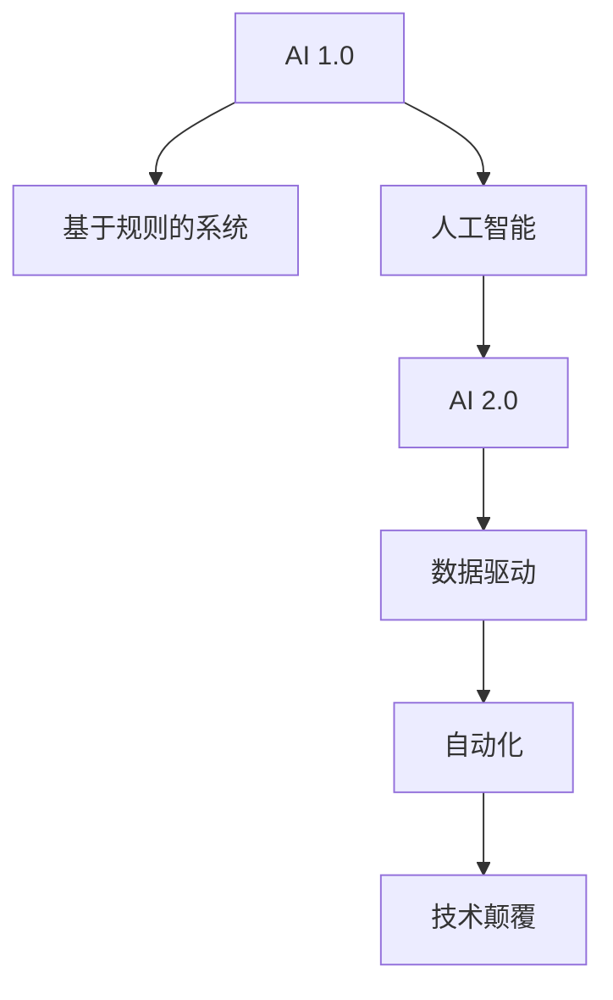

                 

# 李开复：AI 2.0 时代的机遇

> 关键词：人工智能, AI 2.0, 自动化, 创新, 技术颠覆, 数据驱动

## 1. 背景介绍

### 1.1 问题由来
近年来，人工智能(AI)技术发展迅猛，已经在各行各业得到了广泛应用。从智能语音助手到自动驾驶汽车，从精准医疗到智能制造，AI技术正逐步改变着我们的生活方式和工作方式。然而，随着技术的快速迭代，AI领域也面临着新的挑战和机遇。

首先，AI技术的进步使得自动化成为可能。自动化不仅可以提高效率，还能降低成本，提高质量。例如，智能机器人可以在危险的环境中执行任务，智能算法可以自动分析大量数据，生成深度洞察。

其次，AI技术的创新使得跨界融合成为可能。AI技术可以与多种技术相结合，如物联网(IoT)、大数据、云计算等，推动行业数字化转型，创造新的商业机会。

最后，AI技术的数据驱动特性使得数据成为最宝贵的资产。通过收集、分析和利用大数据，AI系统可以不断学习、改进，提升性能和效果。

面对这些机遇和挑战，AI 2.0时代的到来，正为我们提供了一个全新的视角和技术范式，我们需要把握机遇，迎接挑战，推动AI技术的进一步发展。

## 2. 核心概念与联系

### 2.1 核心概念概述

为了更好地理解AI 2.0时代的机遇，我们先介绍几个核心概念：

- **AI 1.0**：传统的基于规则的AI系统，依赖于明确的指令和逻辑，适用于规则明确的任务，如专家系统和办公自动化。
- **AI 2.0**：基于数据的AI系统，通过深度学习、机器学习等技术，从大量数据中学习规律和模式，适用于复杂、非结构化数据。
- **自动化**：通过算法和模型自动化地完成特定任务，减少人为干预，提高效率和准确性。
- **数据驱动**：利用数据进行决策和预测，强调数据的重要性，强调算法的选择和优化。
- **技术颠覆**：AI技术对传统行业的颠覆性影响，推动产业升级和变革。

这些概念之间的关系可以通过以下Mermaid流程图来展示：



这个流程图展示了AI技术从早期的规则系统，到今天的基于数据和算法的新范式。AI 2.0的到来，带来了数据驱动、自动化、技术颠覆等新的概念和技术。

## 3. 核心算法原理 & 具体操作步骤
### 3.1 算法原理概述

AI 2.0的核心算法原理主要是深度学习和强化学习。深度学习通过神经网络模型，从大量数据中学习特征和规律，实现复杂任务的预测和分类。强化学习通过奖励机制，引导模型不断优化决策策略，实现最优控制和优化。

### 3.2 算法步骤详解

以下是AI 2.0的核心算法步骤：

1. **数据收集和预处理**：收集和清洗数据，处理缺失值、异常值等，保证数据的质量和可用性。
2. **特征工程**：选择合适的特征，提取和构造有意义的特征表示，增强模型的性能。
3. **模型训练**：选择合适的模型架构和参数，利用大量标注数据进行训练，优化模型性能。
4. **模型评估**：在验证集或测试集上评估模型性能，调整参数和架构，提升模型效果。
5. **模型部署**：将模型集成到实际应用中，进行大规模部署，优化性能和稳定性。

### 3.3 算法优缺点

AI 2.0算法具有以下优点：

- **高效性**：通过自动化和优化，AI 2.0可以高效处理大量数据和任务。
- **鲁棒性**：深度学习和强化学习模型具有较强的鲁棒性，可以应对各种复杂场景和噪声干扰。
- **可扩展性**：AI 2.0算法可以轻松扩展到大规模系统和高性能硬件中，满足不同应用需求。

然而，AI 2.0算法也存在一些缺点：

- **依赖大量数据**：深度学习需要大量的标注数据进行训练，数据不足或质量不高，会影响模型的性能。
- **计算资源消耗大**：训练深度模型需要高性能计算资源，对硬件要求高。
- **模型复杂性高**：深度模型结构复杂，难以解释和调试，容易产生"黑箱"问题。

### 3.4 算法应用领域

AI 2.0算法广泛应用于以下几个领域：

- **医疗健康**：AI 2.0可以用于精准医疗、疾病预测、图像诊断等，提升医疗服务质量。
- **金融服务**：AI 2.0可以用于风险评估、欺诈检测、客户服务自动化等，提升金融服务效率。
- **制造业**：AI 2.0可以用于智能制造、质量控制、供应链优化等，提升生产效率和质量。
- **智能交通**：AI 2.0可以用于自动驾驶、交通流量优化、智能监控等，提升交通安全性。
- **教育培训**：AI 2.0可以用于个性化学习、智能评估、内容推荐等，提升教育培训效果。

## 4. 数学模型和公式 & 详细讲解 & 举例说明

### 4.1 数学模型构建

AI 2.0算法通常基于深度神经网络模型进行构建。以卷积神经网络(CNN)为例，其基本模型结构如下：

$$
f(x) = W_2 \cdot \phi(W_1 \cdot x + b_1) + b_2
$$

其中，$x$为输入数据，$W_1$和$W_2$为网络权重，$b_1$和$b_2$为偏置项，$\phi$为激活函数。

### 4.2 公式推导过程

以二分类问题为例，假设输入数据为$x$，输出标签为$y$，模型预测结果为$f(x)$。则交叉熵损失函数为：

$$
L = -\frac{1}{N} \sum_{i=1}^N [y_i \cdot \log(f(x_i)) + (1-y_i) \cdot \log(1-f(x_i))]
$$

其中，$N$为样本数量。利用梯度下降等优化算法，对模型参数进行优化，使得损失函数最小化。

### 4.3 案例分析与讲解

以图像识别为例，假设模型需要识别手写数字图片。首先需要收集和清洗数据集，进行预处理。然后利用CNN模型进行特征提取，选择合适的激活函数和损失函数。在训练过程中，不断调整模型参数，优化模型性能。最终在测试集上评估模型效果，不断改进模型结构。

## 5. 项目实践：代码实例和详细解释说明

### 5.1 开发环境搭建

在进行AI 2.0项目实践前，我们需要准备好开发环境。以下是使用Python进行TensorFlow开发的环境配置流程：

1. 安装Anaconda：从官网下载并安装Anaconda，用于创建独立的Python环境。
2. 创建并激活虚拟环境：
```bash
conda create -n tf-env python=3.8 
conda activate tf-env
```
3. 安装TensorFlow：根据CUDA版本，从官网获取对应的安装命令。例如：
```bash
conda install tensorflow -c tf -c conda-forge
```
4. 安装各类工具包：
```bash
pip install numpy pandas scikit-learn matplotlib tqdm jupyter notebook ipython
```

完成上述步骤后，即可在`tf-env`环境中开始AI 2.0项目实践。

### 5.2 源代码详细实现

这里我们以图像分类任务为例，给出使用TensorFlow进行CNN模型开发的PyTorch代码实现。

首先，定义模型和损失函数：

```python
import tensorflow as tf
from tensorflow.keras import layers

model = tf.keras.Sequential([
    layers.Conv2D(32, (3, 3), activation='relu', input_shape=(28, 28, 1)),
    layers.MaxPooling2D((2, 2)),
    layers.Conv2D(64, (3, 3), activation='relu'),
    layers.MaxPooling2D((2, 2)),
    layers.Conv2D(64, (3, 3), activation='relu'),
    layers.Flatten(),
    layers.Dense(64, activation='relu'),
    layers.Dense(10, activation='softmax')
])

loss_fn = tf.keras.losses.SparseCategoricalCrossentropy(from_logits=True)
optimizer = tf.keras.optimizers.Adam(learning_rate=0.001)
```

然后，定义训练和评估函数：

```python
@tf.function
def train_step(x, y):
    with tf.GradientTape() as tape:
        logits = model(x)
        loss_value = loss_fn(y, logits)
    gradients = tape.gradient(loss_value, model.trainable_variables)
    optimizer.apply_gradients(zip(gradients, model.trainable_variables))
    return loss_value

@tf.function
def evaluate_step(x, y):
    logits = model(x)
    predictions = tf.argmax(logits, axis=-1)
    accuracy = tf.reduce_mean(tf.cast(tf.equal(y, predictions), tf.float32))
    return accuracy
```

最后，启动训练流程并在测试集上评估：

```python
epochs = 10
batch_size = 64

for epoch in range(epochs):
    total_loss = 0.0
    for x, y in train_dataset:
        loss = train_step(x, y)
        total_loss += loss
    train_loss = total_loss / len(train_dataset)
    
    total_accuracy = 0.0
    for x, y in test_dataset:
        accuracy = evaluate_step(x, y)
        total_accuracy += accuracy
    test_accuracy = total_accuracy / len(test_dataset)
    
    print(f"Epoch {epoch+1}, train loss: {train_loss:.3f}, test accuracy: {test_accuracy:.3f}")
```

以上就是使用TensorFlow进行CNN模型开发的完整代码实现。可以看到，TensorFlow的自动求导和优化器等高级特性，使得模型训练过程变得简单高效。

### 5.3 代码解读与分析

让我们再详细解读一下关键代码的实现细节：

**模型定义**：
- 使用`tf.keras.Sequential`构建CNN模型，包括卷积层、池化层、全连接层等。
- 使用`tf.keras.layers`中的类和方法，定义每一层的功能。

**损失函数和优化器**：
- 使用`tf.keras.losses.SparseCategoricalCrossentropy`定义交叉熵损失函数，使用`tf.keras.optimizers.Adam`定义优化器。

**训练和评估函数**：
- 使用`@tf.function`装饰器，将训练和评估过程定义为函数，利用TensorFlow的自动求导和优化器，高效计算梯度和更新模型参数。
- 在训练过程中，不断迭代优化模型参数，更新损失函数和准确率。

**训练流程**：
- 定义总的epoch数和batch size，开始循环迭代
- 每个epoch内，先在训练集上训练，输出平均损失和准确率
- 在测试集上评估，输出测试准确率

可以看到，TensorFlow框架为AI 2.0项目提供了强大的开发工具，使开发者能够快速迭代和优化模型。

## 6. 实际应用场景

### 6.1 智能客服系统

AI 2.0技术可以广泛应用于智能客服系统，提升客户服务质量和效率。传统客服往往需要大量人力，高峰期响应速度慢，且服务质量难以保证。通过AI 2.0技术，可以实现智能客服的自动化和智能化，提高服务质量和用户体验。

在技术实现上，可以收集企业内部的历史客服对话记录，训练基于AI 2.0的对话模型，实现自然语言理解和生成。当用户提出问题时，系统可以自动理解意图，生成合适的回复。对于复杂问题，还可以接入知识库和专家系统，实现更深入的推理和解答。

### 6.2 金融服务

AI 2.0技术在金融服务领域也得到了广泛应用。例如，AI 2.0可以用于客户行为分析、信用评分、欺诈检测等，提升金融服务效率和安全性。

在客户行为分析中，AI 2.0可以收集和分析用户的交易数据、行为数据，识别出有潜在风险的用户。通过预测模型，可以提前采取措施，降低损失风险。在信用评分中，AI 2.0可以结合历史数据和用户行为，动态计算信用评分，提升审批效率和准确性。在欺诈检测中，AI 2.0可以分析交易记录和用户行为，识别出异常交易行为，及时预警和阻止欺诈行为。

### 6.3 智能制造

AI 2.0技术可以用于智能制造，提升生产效率和质量。传统制造行业往往依赖人工操作和手动控制，效率低、成本高。通过AI 2.0技术，可以实现自动化和智能化，提高生产效率和产品质量。

在生产监控中，AI 2.0可以实时监控生产设备和生产过程，识别出异常情况，及时预警和处理。在质量控制中，AI 2.0可以分析生产数据和质量检测结果，优化生产工艺和质量控制流程，提升产品质量。在供应链优化中，AI 2.0可以优化供应链管理，降低库存成本，提高供应链效率。

### 6.4 未来应用展望

随着AI 2.0技术的不断进步，未来将有更多的应用场景涌现。以下列举几个潜在的应用方向：

1. **智能交通**：AI 2.0可以用于自动驾驶、交通流量优化、智能监控等，提升交通安全性。
2. **智能医疗**：AI 2.0可以用于疾病预测、图像诊断、个性化治疗等，提升医疗服务质量。
3. **智能制造**：AI 2.0可以用于智能制造、质量控制、供应链优化等，提升生产效率和质量。
4. **智能教育**：AI 2.0可以用于个性化学习、智能评估、内容推荐等，提升教育培训效果。

## 7. 工具和资源推荐

### 7.1 学习资源推荐

为了帮助开发者系统掌握AI 2.0的理论基础和实践技巧，这里推荐一些优质的学习资源：

1. **《深度学习》课程**：由斯坦福大学开设的深度学习课程，系统讲解深度学习的基本概念和前沿技术。
2. **TensorFlow官方文档**：TensorFlow的官方文档，提供了详细的API文档和样例代码，是学习TensorFlow的必备资料。
3. **PyTorch官方文档**：PyTorch的官方文档，提供了全面的API文档和样例代码，是学习PyTorch的重要参考。
4. **Coursera AI专项课程**：Coursera提供的AI专项课程，涵盖了深度学习、机器学习、强化学习等各个方面。
5. **Kaggle竞赛平台**：Kaggle的机器学习和数据科学竞赛平台，提供了大量的公开数据集和竞赛项目，是实战练习的好去处。

通过对这些资源的学习实践，相信你一定能够快速掌握AI 2.0的精髓，并用于解决实际的AI问题。

### 7.2 开发工具推荐

高效的开发离不开优秀的工具支持。以下是几款用于AI 2.0开发常用的工具：

1. **TensorFlow**：由Google主导开发的深度学习框架，生产部署方便，适合大规模工程应用。
2. **PyTorch**：基于Python的开源深度学习框架，灵活动态的计算图，适合快速迭代研究。
3. **Jupyter Notebook**：用于编写和运行Python代码的交互式笔记本，适合进行数据处理、模型训练等任务。
4. **Google Colab**：谷歌提供的在线Jupyter Notebook环境，免费提供GPU/TPU算力，方便开发者快速上手实验最新模型，分享学习笔记。
5. **Weights & Biases**：模型训练的实验跟踪工具，可以记录和可视化模型训练过程中的各项指标，方便对比和调优。

合理利用这些工具，可以显著提升AI 2.0项目开发效率，加快创新迭代的步伐。

### 7.3 相关论文推荐

AI 2.0技术的发展源于学界的持续研究。以下是几篇奠基性的相关论文，推荐阅读：

1. **《深度学习》**：Ian Goodfellow等人的深度学习著作，全面介绍了深度学习的理论基础和应用方法。
2. **《TensorFlow》**：TensorFlow的官方论文，介绍了TensorFlow的架构和优化技术。
3. **《PyTorch》**：PyTorch的官方论文，介绍了PyTorch的架构和优化技术。
4. **《强化学习》**：Reinforcement Learning的论文，介绍了强化学习的基本概念和算法。
5. **《深度强化学习》**：Deep Reinforcement Learning的论文，介绍了深度强化学习的算法和应用。

这些论文代表了大数据时代的最新研究成果，是理解AI 2.0技术的必读书目。

## 8. 总结：未来发展趋势与挑战

### 8.1 总结

本文对AI 2.0技术进行了全面系统的介绍。首先阐述了AI 2.0技术的背景和意义，明确了AI 2.0技术在自动化、数据驱动等方面的优势。其次，从原理到实践，详细讲解了AI 2.0技术的核心算法和操作步骤，给出了AI 2.0项目开发的完整代码实例。同时，本文还广泛探讨了AI 2.0技术在智能客服、金融服务、智能制造等各个领域的应用前景，展示了AI 2.0技术的广阔前景。

通过本文的系统梳理，可以看到，AI 2.0技术正在逐步改变各个行业的运行方式，推动产业升级和变革。未来，伴随AI 2.0技术的不断进步，AI技术将进一步普及和应用，推动智能化社会的到来。

### 8.2 未来发展趋势

展望未来，AI 2.0技术将呈现以下几个发展趋势：

1. **自动化和智能化**：AI 2.0技术将逐步实现各个行业的自动化和智能化，提高效率和质量。
2. **数据驱动**：数据驱动将成为AI 2.0技术的核心，大数据、云计算等技术将为AI 2.0提供更丰富的数据资源和计算资源。
3. **技术融合**：AI 2.0技术将与其他技术进行深度融合，推动各行业的数字化转型。
4. **伦理和安全**：AI 2.0技术将更加注重伦理和安全问题，保护用户隐私和数据安全。

这些趋势展示了AI 2.0技术的广阔前景，预示着AI 2.0将不断拓展应用边界，推动各行各业的数字化和智能化。

### 8.3 面临的挑战

尽管AI 2.0技术发展迅速，但在迈向更加智能化、普适化应用的过程中，它仍面临着诸多挑战：

1. **数据质量问题**：AI 2.0技术依赖大量高质量数据进行训练，数据质量差将影响模型性能。
2. **计算资源消耗**：训练深度模型需要高性能计算资源，对硬件要求高。
3. **模型复杂性**：深度模型结构复杂，难以解释和调试，容易产生"黑箱"问题。
4. **伦理和安全**：AI 2.0技术可能存在偏见、有害的输出，需要从数据和算法层面进行改进。

这些挑战需要我们在技术、工程、伦理等方面进行深入研究，逐步克服。只有不断优化AI 2.0技术，才能实现其广泛应用和普及。

### 8.4 研究展望

未来，AI 2.0技术的研究将聚焦于以下几个方面：

1. **数据增强**：如何从少量数据中提取更多信息，提升模型性能。
2. **模型压缩**：如何优化模型结构，提高推理效率和资源利用率。
3. **模型解释**：如何提高模型的可解释性，让用户理解模型决策过程。
4. **伦理和公平**：如何确保AI 2.0技术的公平性和伦理性，保护用户隐私和数据安全。

这些研究方向将推动AI 2.0技术不断进步，推动其更广泛的应用和普及。

## 9. 附录：常见问题与解答

**Q1：AI 2.0技术是否适用于所有行业？**

A: AI 2.0技术可以应用于各行各业，包括金融、医疗、制造业、智能交通等。但具体应用需要根据行业特性进行优化和调整，才能取得理想的效果。

**Q2：AI 2.0技术的计算资源消耗是否过大？**

A: 训练深度模型需要高性能计算资源，但随着硬件技术的不断进步，计算资源成本正在下降。此外，通过优化模型结构和压缩技术，可以进一步降低计算资源消耗。

**Q3：AI 2.0技术是否存在"黑箱"问题？**

A: 深度模型结构复杂，难以解释和调试，容易产生"黑箱"问题。但可以通过优化模型结构、引入可视化工具等方式，提高模型的可解释性。

**Q4：AI 2.0技术是否存在伦理和安全问题？**

A: AI 2.0技术可能存在偏见、有害的输出，需要从数据和算法层面进行改进。此外，AI 2.0技术的应用还需要注重伦理和安全问题，保护用户隐私和数据安全。

**Q5：AI 2.0技术的未来发展方向是什么？**

A: AI 2.0技术将逐步实现各个行业的自动化和智能化，提高效率和质量。未来，AI 2.0技术将继续深化与其他技术（如云计算、大数据）的融合，推动各行业的数字化转型。

---

作者：禅与计算机程序设计艺术 / Zen and the Art of Computer Programming

