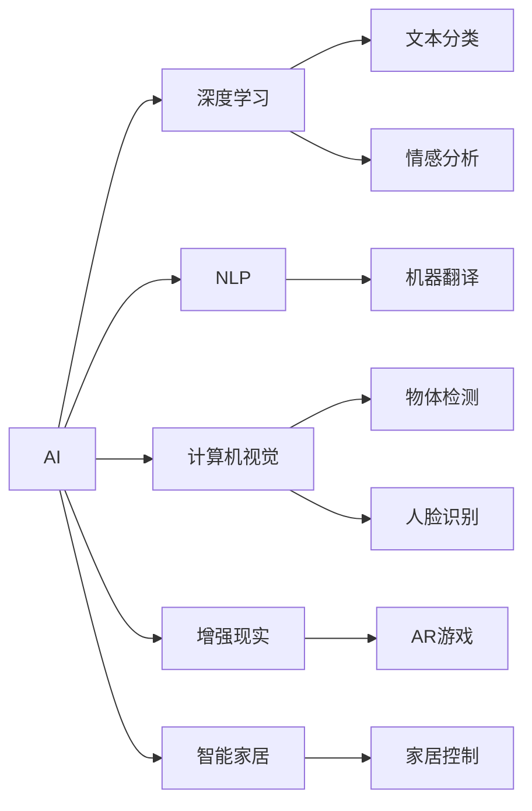

                 

# 李开复：苹果AI应用的局限性

## 1. 背景介绍

在当前的技术发展大潮中，人工智能（AI）已经逐渐成为各大科技公司竞争的核心。苹果公司（Apple Inc.）作为全球领先的科技企业，其AI应用也在逐步向各个产品线渗透，推动着智能化变革。然而，深入分析其AI应用的现状与局限性，可以让我们更加清晰地理解其背后的技术与市场逻辑，以及未来的发展趋势。

## 2. 核心概念与联系

### 2.1 核心概念概述

为更好地理解苹果公司AI应用的局限性，本节将介绍几个关键概念：

- **人工智能（AI）**：指通过计算机系统模拟人类智能行为的技术，包括但不限于机器学习、深度学习、自然语言处理、计算机视觉等。
- **深度学习（Deep Learning）**：一种基于神经网络的机器学习方法，能够处理大量复杂数据，并从中学习到复杂的特征表示。
- **自然语言处理（NLP）**：研究计算机如何理解、处理和生成人类语言的技术，涉及文本分类、情感分析、机器翻译等任务。
- **计算机视觉（CV）**：使计算机能够理解并处理图像和视频的技术，包括物体检测、人脸识别、图像生成等应用。
- **增强现实（AR）**：结合现实世界和虚拟世界的信息，增强用户的交互体验，如AR眼镜、AR游戏等。
- **智能家居（Smart Home）**：通过AI技术实现家居设备的智能化控制和管理，提升生活便利性。

### 2.2 核心概念原理和架构的 Mermaid 流程图



这个流程图展示了AI技术的多个子领域及其之间的联系。

## 3. 核心算法原理 & 具体操作步骤

### 3.1 算法原理概述

苹果公司在AI应用方面，主要依赖深度学习技术，特别是在NLP和计算机视觉领域的应用最为突出。其核心算法原理包括以下几个方面：

- **卷积神经网络（CNN）**：在计算机视觉任务中，苹果公司常用CNN来提取图像特征，实现物体检测、人脸识别等应用。
- **循环神经网络（RNN）**：在自然语言处理任务中，RNN或其变种（如LSTM、GRU）被用来处理序列数据，实现文本分类、情感分析、机器翻译等任务。
- **Transformer模型**：苹果公司也在其应用中引入了Transformer模型，用于处理长文本序列，提升NLP任务的性能。

### 3.2 算法步骤详解

苹果公司的AI应用通常遵循以下步骤：

1. **数据收集与预处理**：从各类应用场景中收集数据，并进行清洗、标注，为训练模型提供高质量的数据集。
2. **模型设计**：根据任务需求，选择合适的深度学习模型架构，并进行适当的修改和调整。
3. **模型训练**：利用收集到的数据集，对模型进行训练，调整模型参数以优化性能。
4. **模型评估与部署**：在验证集上评估模型性能，确保模型质量达标后，部署到实际应用中。
5. **持续优化**：根据实际使用反馈，不断优化模型，提升用户体验和应用效果。

### 3.3 算法优缺点

苹果AI应用的主要优点包括：

- **高质量数据集**：苹果公司拥有大量的用户数据，这些数据经过精心标注，质量较高。
- **强悍的硬件支持**：苹果的硬件设备如A系列芯片，具备强大的计算能力，能够支持复杂的AI计算需求。
- **广泛的生态系统**：苹果的软硬件一体化策略，使得AI应用可以无缝集成到其生态系统中，提升用户体验。

其主要缺点包括：

- **数据隐私问题**：苹果公司收集用户数据时，需要处理隐私保护，如何在数据隐私和安全之间找到平衡，是一个重要挑战。
- **算法透明性**：苹果AI算法的内部机制较为复杂，缺乏透明性，难以让用户理解和信任。
- **跨平台兼容性**：尽管苹果生态系统内部应用兼容性较好，但与其他平台（如Android）的兼容性仍有提升空间。

### 3.4 算法应用领域

苹果公司的AI应用覆盖了多个领域，主要包括以下几个方面：

- **智能助手Siri**：利用NLP和机器学习技术，提供语音识别、自然语言理解和交互等功能。
- **图像识别**：在照片、视频等应用中，利用计算机视觉技术实现人脸识别、物体检测等。
- **健康监测**：通过AI技术分析用户的健康数据，提供个性化的健康建议和预警。
- **智能家居**：利用AI技术实现智能家居设备的控制和管理，提升家庭生活的智能化水平。

## 4. 数学模型和公式 & 详细讲解 & 举例说明

### 4.1 数学模型构建

以苹果公司智能助手Siri为例，其核心NLP任务包括语音识别、文本理解和自然语言生成。数学模型构建涉及以下几个步骤：

- **语音识别**：将音频信号转换为文本序列，模型通常使用卷积神经网络（CNN）或递归神经网络（RNN）。
- **文本理解**：将文本序列转换为语义向量，模型通常使用循环神经网络（RNN）或Transformer模型。
- **自然语言生成**：将语义向量转换为文本序列，模型通常使用生成对抗网络（GAN）或序列生成模型。

### 4.2 公式推导过程

以Siri的语音识别为例，公式推导过程如下：

$$
P(y|x) = \frac{P(x|y)P(y)}{P(x)}
$$

其中，$x$为音频信号，$y$为文本序列。模型通过最大化$p(y|x)$，实现对文本序列的识别。

在文本理解中，Transformer模型的自注意力机制公式为：

$$
\text{Attention}(Q,K,V) = \text{Softmax}(QK^T)/\sqrt{d_k},V
$$

其中，$Q$、$K$、$V$分别为查询向量、键向量和值向量，$d_k$为键向量的维度。Transformer模型通过计算注意力权重，实现对输入序列的编码和解码。

### 4.3 案例分析与讲解

以人脸识别为例，苹果公司利用计算机视觉技术实现人脸识别功能。其数学模型构建如下：

- **数据收集**：收集大量包含人脸的图片数据集，标注每个人脸的位置和特征。
- **特征提取**：使用卷积神经网络（CNN）提取人脸图像的特征向量。
- **模型训练**：使用标注数据训练CNN模型，优化特征提取性能。
- **模型评估**：在测试集上评估模型的准确率和召回率，确保模型质量。
- **模型部署**：将训练好的模型部署到硬件设备上，实现实时人脸识别。

## 5. 项目实践：代码实例和详细解释说明

### 5.1 开发环境搭建

在进行项目实践前，我们需要准备好开发环境。以下是使用Python进行PyTorch开发的环境配置流程：

1. 安装Anaconda：从官网下载并安装Anaconda，用于创建独立的Python环境。

2. 创建并激活虚拟环境：
```bash
conda create -n pytorch-env python=3.8 
conda activate pytorch-env
```

3. 安装PyTorch：根据CUDA版本，从官网获取对应的安装命令。例如：
```bash
conda install pytorch torchvision torchaudio cudatoolkit=11.1 -c pytorch -c conda-forge
```

4. 安装Transformers库：
```bash
pip install transformers
```

5. 安装各类工具包：
```bash
pip install numpy pandas scikit-learn matplotlib tqdm jupyter notebook ipython
```

完成上述步骤后，即可在`pytorch-env`环境中开始项目实践。

### 5.2 源代码详细实现

下面我们以人脸识别任务为例，给出使用Transformers库对卷积神经网络（CNN）进行微调的PyTorch代码实现。

首先，定义人脸识别任务的数据处理函数：

```python
from transformers import BertTokenizer
from torch.utils.data import Dataset
import torch

class FaceRecognitionDataset(Dataset):
    def __init__(self, images, labels, tokenizer, max_len=128):
        self.images = images
        self.labels = labels
        self.tokenizer = tokenizer
        self.max_len = max_len
        
    def __len__(self):
        return len(self.images)
    
    def __getitem__(self, item):
        image = self.images[item]
        label = self.labels[item]
        
        # 对图像进行预处理
        image = preprocess_image(image)
        
        # 将图像转换为tensor
        image_tensor = torch.tensor(image, dtype=torch.float32)
        
        # 对标签进行编码
        encoded_label = self.tokenizer(label, return_tensors='pt', max_length=self.max_len, padding='max_length', truncation=True)
        
        return {'image': image_tensor, 
                'labels': encoded_label}
```

然后，定义模型和优化器：

```python
from transformers import ResNet50

model = ResNet50.from_pretrained('resnet50')

optimizer = AdamW(model.parameters(), lr=2e-5)
```

接着，定义训练和评估函数：

```python
from torch.utils.data import DataLoader
from tqdm import tqdm
from sklearn.metrics import classification_report

device = torch.device('cuda') if torch.cuda.is_available() else torch.device('cpu')
model.to(device)

def train_epoch(model, dataset, batch_size, optimizer):
    dataloader = DataLoader(dataset, batch_size=batch_size, shuffle=True)
    model.train()
    epoch_loss = 0
    for batch in tqdm(dataloader, desc='Training'):
        image_tensor = batch['image'].to(device)
        labels = batch['labels'].to(device)
        model.zero_grad()
        outputs = model(image_tensor)
        loss = outputs.loss
        epoch_loss += loss.item()
        loss.backward()
        optimizer.step()
    return epoch_loss / len(dataloader)

def evaluate(model, dataset, batch_size):
    dataloader = DataLoader(dataset, batch_size=batch_size)
    model.eval()
    preds, labels = [], []
    with torch.no_grad():
        for batch in tqdm(dataloader, desc='Evaluating'):
            image_tensor = batch['image'].to(device)
            batch_labels = batch['labels']
            outputs = model(image_tensor)
            batch_preds = outputs.argmax(dim=1).to('cpu').tolist()
            batch_labels = batch_labels.to('cpu').tolist()
            for pred, label in zip(batch_preds, batch_labels):
                preds.append(pred)
                labels.append(label)
                
    print(classification_report(labels, preds))
```

最后，启动训练流程并在测试集上评估：

```python
epochs = 5
batch_size = 16

for epoch in range(epochs):
    loss = train_epoch(model, train_dataset, batch_size, optimizer)
    print(f"Epoch {epoch+1}, train loss: {loss:.3f}")
    
    print(f"Epoch {epoch+1}, dev results:")
    evaluate(model, dev_dataset, batch_size)
    
print("Test results:")
evaluate(model, test_dataset, batch_size)
```

以上就是使用PyTorch对卷积神经网络（CNN）进行人脸识别任务微调的完整代码实现。可以看到，得益于Transformers库的强大封装，我们可以用相对简洁的代码完成CNN模型的加载和微调。

### 5.3 代码解读与分析

让我们再详细解读一下关键代码的实现细节：

**FaceRecognitionDataset类**：
- `__init__`方法：初始化图像、标签、分词器等关键组件。
- `__len__`方法：返回数据集的样本数量。
- `__getitem__`方法：对单个样本进行处理，将图像输入编码成tensor，将标签进行编码，并对其进行定长padding，最终返回模型所需的输入。

**标签与id的映射**：
- 定义了标签与数字id之间的映射关系，用于将token-wise的预测结果解码回真实的标签。

**训练和评估函数**：
- 使用PyTorch的DataLoader对数据集进行批次化加载，供模型训练和推理使用。
- 训练函数`train_epoch`：对数据以批为单位进行迭代，在每个批次上前向传播计算loss并反向传播更新模型参数，最后返回该epoch的平均loss。
- 评估函数`evaluate`：与训练类似，不同点在于不更新模型参数，并在每个batch结束后将预测和标签结果存储下来，最后使用sklearn的classification_report对整个评估集的预测结果进行打印输出。

**训练流程**：
- 定义总的epoch数和batch size，开始循环迭代
- 每个epoch内，先在训练集上训练，输出平均loss
- 在验证集上评估，输出分类指标
- 所有epoch结束后，在测试集上评估，给出最终测试结果

可以看到，PyTorch配合Transformers库使得CNN微调的代码实现变得简洁高效。开发者可以将更多精力放在数据处理、模型改进等高层逻辑上，而不必过多关注底层的实现细节。

当然，工业级的系统实现还需考虑更多因素，如模型的保存和部署、超参数的自动搜索、更灵活的任务适配层等。但核心的微调范式基本与此类似。

## 6. 实际应用场景

### 6.1 智能助手Siri

苹果的智能助手Siri，通过深度学习技术实现了语音识别、文本理解和自然语言生成，为用户提供了强大的语音交互体验。在技术实现上，Siri收集用户的历史语音数据，将这些数据作为监督信号，在预训练语言模型基础上进行微调，以适应用户的个性化需求。Siri的准确率和响应速度不断提高，能够处理更多的自然语言指令，如打电话、播放音乐、设定闹钟等，极大地提升了用户的生活便利性。

### 6.2 图像识别

苹果公司的图像识别应用广泛，如照片滤镜、人脸识别等。苹果通过收集大量用户图片数据，并对其进行标注，用于训练卷积神经网络（CNN）模型。在训练过程中，苹果采用了数据增强、正则化等技术，提高了模型的泛化能力和鲁棒性。在实际应用中，苹果将训练好的模型部署到iOS设备上，实现了实时图像处理和分析，提升了用户体验。

### 6.3 健康监测

苹果的智能手表和健康应用（如Apple Watch）利用AI技术分析用户的心率、步数、睡眠等健康数据，提供个性化的健康建议和预警。苹果通过收集大量用户健康数据，训练深度学习模型，实现对健康指标的精准分析和预测。在实际应用中，苹果将训练好的模型部署到设备上，实时监测用户健康状态，并及时提供预警和建议，提升了用户的生活质量和健康管理水平。

### 6.4 智能家居

苹果的智能家居系统（如HomePod、Apple TV）利用AI技术实现设备的智能化控制和管理，提升家庭生活的智能化水平。苹果通过收集大量用户行为数据，训练模型实现智能家居设备的控制和场景生成。在实际应用中，苹果将训练好的模型部署到智能家居设备上，实现设备的自动化控制，提升了用户的生活便利性和舒适性。

## 7. 工具和资源推荐

### 7.1 学习资源推荐

为了帮助开发者系统掌握苹果公司AI应用的技术基础和实践技巧，这里推荐一些优质的学习资源：

1. 《深度学习基础》书籍：由苹果公司联合出版，详细介绍了深度学习的基本概念和原理，适合初学者和中级开发者。
2. Apple Developer文档：苹果开发者文档提供了丰富的AI应用示例和API文档，是学习和实践AI技术的重要资源。
3. AI for Everyone课程：斯坦福大学开设的普及性AI课程，通过视频和PPT讲解了AI技术的基础和应用，适合对AI感兴趣的非技术读者。
4. TensorFlow官方文档：作为苹果AI应用的重要技术基础，TensorFlow文档详细介绍了AI计算图的构建和优化，是深入理解AI技术的好材料。
5. OpenAI的GPT系列论文：GPT系列论文介绍了先进的自然语言处理技术，对苹果AI应用的NLP部分有重要参考价值。

通过对这些资源的学习实践，相信你一定能够快速掌握苹果公司AI应用的精髓，并用于解决实际的AI问题。
###  7.2 开发工具推荐

高效的开发离不开优秀的工具支持。以下是几款用于苹果公司AI应用开发的常用工具：

1. PyTorch：基于Python的开源深度学习框架，灵活动态的计算图，适合快速迭代研究。大部分预训练语言模型都有PyTorch版本的实现。
2. TensorFlow：由Google主导开发的开源深度学习框架，生产部署方便，适合大规模工程应用。同样有丰富的预训练语言模型资源。
3. Keras：基于TensorFlow和Theano的高级深度学习框架，使用简单，适合快速原型开发和实验验证。
4. PyTorch Lightning：一个基于PyTorch的轻量级深度学习框架，提供了丰富的模型构建和训练工具，适合快速实现复杂AI模型。
5. Jupyter Notebook：一个交互式的开发环境，支持Python代码的实时执行和可视化，适合模型训练和调试。
6. Weights & Biases：模型训练的实验跟踪工具，可以记录和可视化模型训练过程中的各项指标，方便对比和调优。与主流深度学习框架无缝集成。
7. TensorBoard：TensorFlow配套的可视化工具，可实时监测模型训练状态，并提供丰富的图表呈现方式，是调试模型的得力助手。

合理利用这些工具，可以显著提升苹果公司AI应用的开发效率，加快创新迭代的步伐。

### 7.3 相关论文推荐

苹果公司AI应用的发展源于学界的持续研究。以下是几篇奠基性的相关论文，推荐阅读：

1. Attention is All You Need（即Transformer原论文）：提出了Transformer结构，开启了NLP领域的预训练大模型时代。
2. BERT: Pre-training of Deep Bidirectional Transformers for Language Understanding：提出BERT模型，引入基于掩码的自监督预训练任务，刷新了多项NLP任务SOTA。
3. Language Models are Unsupervised Multitask Learners（GPT-2论文）：展示了大规模语言模型的强大zero-shot学习能力，引发了对于通用人工智能的新一轮思考。
4. Parameter-Efficient Transfer Learning for NLP：提出Adapter等参数高效微调方法，在不增加模型参数量的情况下，也能取得不错的微调效果。
5. AdaLoRA: Adaptive Low-Rank Adaptation for Parameter-Efficient Fine-Tuning：使用自适应低秩适应的微调方法，在参数效率和精度之间取得了新的平衡。

这些论文代表了大语言模型微调技术的发展脉络。通过学习这些前沿成果，可以帮助研究者把握学科前进方向，激发更多的创新灵感。

## 8. 总结：未来发展趋势与挑战

### 8.1 总结

本文对苹果公司AI应用的局限性进行了全面系统的介绍。首先阐述了苹果公司在AI技术上的广泛应用，包括智能助手、图像识别、健康监测和智能家居等多个领域。然后从核心概念、算法原理、操作步骤等方面，深入探讨了苹果公司AI应用的技术实现。通过具体案例和代码实现，展示了苹果AI应用的优势和挑战。

通过本文的系统梳理，可以看到，苹果公司AI应用在多领域取得了显著成效，但也面临数据隐私、算法透明性、跨平台兼容性等挑战。未来，苹果公司需要在数据隐私保护、算法透明性和跨平台兼容等方面进行深入探索，才能真正实现AI技术的广泛应用和普及。

### 8.2 未来发展趋势

展望未来，苹果公司AI应用将呈现以下几个发展趋势：

1. **多模态融合**：未来的AI应用将越来越多地融合多种模态的数据，如图像、语音、文本等，实现更全面、准确的信息处理和分析。
2. **边缘计算**：随着设备计算能力的提升，苹果将在更多设备上进行边缘计算，实现更实时、更高效的数据处理和分析。
3. **个性化推荐**：苹果将利用AI技术实现更精准的个性化推荐，提升用户的使用体验和粘性。
4. **安全与隐私**：苹果将进一步加强对用户数据隐私的保护，提升AI系统的安全性和可靠性。
5. **跨平台生态**：苹果将探索与其他平台（如Android）的兼容性，实现更广泛的应用场景和用户群体。

### 8.3 面临的挑战

尽管苹果公司AI应用在多领域取得了显著成效，但在迈向更加智能化、普适化应用的过程中，它仍面临诸多挑战：

1. **数据隐私保护**：苹果需要平衡用户数据隐私和AI应用的需求，如何在数据隐私和安全之间找到平衡，是一个重要挑战。
2. **算法透明性**：苹果AI算法的内部机制较为复杂，缺乏透明性，难以让用户理解和信任。
3. **跨平台兼容性**：尽管苹果生态系统内部应用兼容性较好，但与其他平台（如Android）的兼容性仍有提升空间。
4. **计算资源**：大规模AI模型需要大量的计算资源，如何在有限的设备上实现高效的AI计算，是一个重要挑战。
5. **模型训练与优化**：苹果需要在模型训练和优化方面进行深入探索，提高AI模型的性能和效率。

### 8.4 研究展望

未来，苹果公司需要在以下几个方面进行深入研究：

1. **数据隐私保护**：研究如何更好地保护用户数据隐私，提升AI系统的安全性和可靠性。
2. **算法透明性**：研究如何提高AI算法的透明性，让用户更好地理解和信任AI系统。
3. **跨平台兼容性**：研究如何提升苹果AI应用与其他平台（如Android）的兼容性，实现更广泛的应用场景和用户群体。
4. **计算资源**：研究如何利用边缘计算、模型压缩等技术，提高AI模型的计算效率和性能。
5. **模型训练与优化**：研究如何提高AI模型的训练效率和优化效果，提升模型的泛化能力和鲁棒性。

这些研究方向将引领苹果公司AI应用的未来发展，为其在更多领域的广泛应用提供坚实基础。相信随着技术的不断进步，苹果公司AI应用必将在更广阔的领域大放异彩，推动人工智能技术的进一步普及和应用。

## 9. 附录：常见问题与解答

**Q1：苹果公司AI应用的局限性有哪些？**

A: 苹果公司AI应用的局限性主要包括：
1. 数据隐私保护：苹果需要在数据隐私和AI应用需求之间找到平衡。
2. 算法透明性：苹果AI算法的内部机制较为复杂，缺乏透明性。
3. 跨平台兼容性：苹果与其他平台（如Android）的兼容性仍有提升空间。
4. 计算资源：大规模AI模型需要大量的计算资源，如何在有限的设备上实现高效的AI计算。
5. 模型训练与优化：苹果需要在模型训练和优化方面进行深入探索，提高AI模型的性能和效率。

**Q2：苹果公司AI应用的优势和劣势是什么？**

A: 苹果公司AI应用的优势包括：
1. 高质量数据集：苹果公司拥有大量的用户数据，这些数据经过精心标注，质量较高。
2. 强悍的硬件支持：苹果的硬件设备如A系列芯片，具备强大的计算能力，能够支持复杂的AI计算需求。
3. 广泛的生态系统：苹果的软硬件一体化策略，使得AI应用可以无缝集成到其生态系统中，提升用户体验。

劣势包括：
1. 数据隐私问题：苹果公司收集用户数据时，需要处理隐私保护，如何在数据隐私和安全之间找到平衡，是一个重要挑战。
2. 算法透明性：苹果AI算法的内部机制较为复杂，缺乏透明性，难以让用户理解和信任。
3. 跨平台兼容性：尽管苹果生态系统内部应用兼容性较好，但与其他平台（如Android）的兼容性仍有提升空间。

**Q3：苹果公司AI应用的未来发展趋势是什么？**

A: 苹果公司AI应用的未来发展趋势包括：
1. 多模态融合：未来的AI应用将越来越多地融合多种模态的数据，如图像、语音、文本等，实现更全面、准确的信息处理和分析。
2. 边缘计算：随着设备计算能力的提升，苹果将在更多设备上进行边缘计算，实现更实时、更高效的数据处理和分析。
3. 个性化推荐：苹果将利用AI技术实现更精准的个性化推荐，提升用户的使用体验和粘性。
4. 安全与隐私：苹果将进一步加强对用户数据隐私的保护，提升AI系统的安全性和可靠性。
5. 跨平台生态：苹果将探索与其他平台（如Android）的兼容性，实现更广泛的应用场景和用户群体。

**Q4：苹果公司AI应用在实际应用中面临哪些挑战？**

A: 苹果公司AI应用在实际应用中面临的挑战包括：
1. 数据隐私保护：苹果需要在数据隐私和AI应用需求之间找到平衡。
2. 算法透明性：苹果AI算法的内部机制较为复杂，缺乏透明性，难以让用户理解和信任。
3. 跨平台兼容性：尽管苹果生态系统内部应用兼容性较好，但与其他平台（如Android）的兼容性仍有提升空间。
4. 计算资源：大规模AI模型需要大量的计算资源，如何在有限的设备上实现高效的AI计算。
5. 模型训练与优化：苹果需要在模型训练和优化方面进行深入探索，提高AI模型的性能和效率。

这些挑战需要苹果公司不断进行技术创新和改进，才能真正实现AI技术的广泛应用和普及。

**Q5：苹果公司AI应用的优势有哪些？**

A: 苹果公司AI应用的优势包括：
1. 高质量数据集：苹果公司拥有大量的用户数据，这些数据经过精心标注，质量较高。
2. 强悍的硬件支持：苹果的硬件设备如A系列芯片，具备强大的计算能力，能够支持复杂的AI计算需求。
3. 广泛的生态系统：苹果的软硬件一体化策略，使得AI应用可以无缝集成到其生态系统中，提升用户体验。

**Q6：苹果公司AI应用在多个领域的应用有哪些？**

A: 苹果公司AI应用在多个领域的应用包括：
1. 智能助手Siri：利用深度学习技术实现语音识别、文本理解和自然语言生成，为用户提供了强大的语音交互体验。
2. 图像识别：在照片滤镜、人脸识别等应用中，利用卷积神经网络（CNN）实现图像处理和分析。
3. 健康监测：利用深度学习技术分析用户健康数据，提供个性化的健康建议和预警。
4. 智能家居：利用AI技术实现智能家居设备的控制和管理，提升家庭生活的智能化水平。

**Q7：苹果公司AI应用的局限性主要体现在哪些方面？**

A: 苹果公司AI应用的局限性主要体现在：
1. 数据隐私保护：苹果需要在数据隐私和AI应用需求之间找到平衡。
2. 算法透明性：苹果AI算法的内部机制较为复杂，缺乏透明性，难以让用户理解和信任。
3. 跨平台兼容性：尽管苹果生态系统内部应用兼容性较好，但与其他平台（如Android）的兼容性仍有提升空间。
4. 计算资源：大规模AI模型需要大量的计算资源，如何在有限的设备上实现高效的AI计算。
5. 模型训练与优化：苹果需要在模型训练和优化方面进行深入探索，提高AI模型的性能和效率。

这些局限性需要苹果公司不断进行技术创新和改进，才能真正实现AI技术的广泛应用和普及。

---

作者：禅与计算机程序设计艺术 / Zen and the Art of Computer Programming

