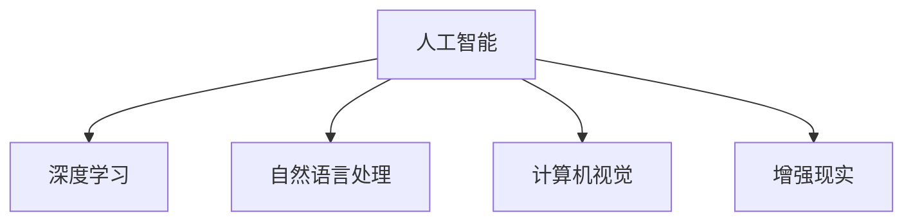

                 

# 李开复：苹果发布AI应用的开发者

## 1. 背景介绍

### 1.1 问题由来
在人工智能（AI）领域，开发高质量AI应用已经成为企业获取竞争优势的重要手段。苹果公司作为全球知名的科技公司，在AI应用的开发上也投入了巨大的资源和精力。苹果不仅在硬件设备中内置了AI功能，如人脸识别、自然语言处理等，还推出了众多独立的AI应用，如Siri、Face ID、HealthKit等。这些应用极大地提升了用户体验和设备智能化水平，展示了苹果在AI领域的前沿地位。

李开复，作为人工智能领域的知名专家，对苹果的AI应用开发和发布有着深入的理解和独到的见解。本文将从开发者的角度，深入探讨李开复对苹果AI应用开发的理解和思考。

### 1.2 问题核心关键点
本文将从以下几个关键点入手，探讨李开复对苹果AI应用的开发理解和思考：

1. 苹果AI应用的开发流程和策略
2. 开发者在AI应用开发中的角色和挑战
3. 苹果AI应用的性能优化和用户体验提升
4. 苹果AI应用的未来发展趋势和前景

## 2. 核心概念与联系

### 2.1 核心概念概述

为更好地理解李开复对苹果AI应用开发的理解和思考，本节将介绍几个密切相关的核心概念：

- **人工智能（AI）**：一种能够模拟人类智能行为的计算机科学，涵盖机器学习、深度学习、自然语言处理、计算机视觉等多个方向。
- **深度学习（Deep Learning）**：一种基于神经网络的机器学习方法，通过多层非线性变换，可以从大量数据中学习复杂的模式和规律。
- **自然语言处理（NLP）**：研究如何让计算机理解和生成自然语言的技术，包括文本分类、情感分析、机器翻译等。
- **计算机视觉（CV）**：研究如何让计算机通过图像识别、图像分割等技术理解和处理视觉信息。
- **增强现实（AR）**：一种将虚拟信息与现实世界融合的技术，常应用于游戏、导航、教育等领域。

这些核心概念之间的逻辑关系可以通过以下Mermaid流程图来展示：



这个流程图展示了这个大框架中各概念之间的联系。人工智能是核心，涵盖深度学习、自然语言处理、计算机视觉和增强现实等多个子领域。

## 3. 核心算法原理 & 具体操作步骤
### 3.1 算法原理概述

苹果的AI应用开发遵循深度学习的原理，通过构建复杂的神经网络模型，从大量标注数据中学习模式，实现对自然语言、图像、声音等数据的理解和处理。以下是苹果AI应用开发的算法原理概述：

- **数据准备**：收集和预处理训练数据，确保数据的多样性和质量。
- **模型构建**：选择合适的深度学习模型架构，如卷积神经网络（CNN）、循环神经网络（RNN）、Transformer等，进行模型训练。
- **模型优化**：通过梯度下降等优化算法，调整模型参数，最小化损失函数，提升模型性能。
- **性能评估**：在测试数据集上评估模型性能，调整模型参数和训练策略，以达到最优效果。

### 3.2 算法步骤详解

苹果的AI应用开发流程包括以下几个关键步骤：

1. **数据收集和预处理**：
    - 收集与AI应用相关的各类数据，包括语音、文本、图像等。
    - 对数据进行清洗、标注、分词、截断等预处理，确保数据的质量和格式一致性。

2. **模型选择和设计**：
    - 根据应用需求，选择合适的深度学习模型架构，如卷积神经网络（CNN）、循环神经网络（RNN）、Transformer等。
    - 设计模型的输入输出接口，确定模型的参数结构和超参数，如学习率、批次大小、迭代轮数等。

3. **模型训练和调优**：
    - 使用大规模训练数据集，对模型进行前向传播和反向传播，更新模型参数。
    - 监控模型的损失函数和验证集性能，调整超参数和模型结构，避免过拟合。

4. **性能评估和部署**：
    - 在测试数据集上评估模型性能，计算准确率、召回率、F1分数等指标。
    - 将模型部署到苹果设备中，进行实时的用户交互和数据处理。

### 3.3 算法优缺点

苹果AI应用的开发遵循深度学习原理，具有以下优点：

- **准确性高**：深度学习模型能够从大量数据中学习复杂的模式和规律，具有较高的预测准确性。
- **泛化能力强**：深度学习模型能够在不同的数据集和场景中保持较好的性能表现。
- **可扩展性好**：深度学习模型可以通过添加更多层和参数，提升模型的表达能力和性能。

但同时，深度学习也存在一些局限性：

- **数据需求大**：深度学习模型需要大量标注数据进行训练，数据获取和标注成本较高。
- **计算资源消耗高**：深度学习模型的训练和推理需要大量的计算资源，如GPU、TPU等。
- **模型复杂度高**：深度学习模型结构复杂，难以理解和调试。

### 3.4 算法应用领域

苹果的AI应用开发主要应用于以下几个领域：

- **自然语言处理**：如Siri、翻译应用等，通过深度学习模型实现自然语言的理解和生成。
- **计算机视觉**：如Face ID、增强现实应用等，通过深度学习模型实现图像和视频的处理和理解。
- **语音识别**：如语音助手、自动字幕等，通过深度学习模型实现语音的识别和生成。
- **推荐系统**：如App Store推荐、广告推荐等，通过深度学习模型实现个性化推荐。
- **健康监测**：如HealthKit等，通过深度学习模型实现健康数据的分析和预测。

## 4. 数学模型和公式 & 详细讲解 & 举例说明

### 4.1 数学模型构建

苹果的AI应用开发涉及多种数学模型，以下以自然语言处理（NLP）为例，介绍数学模型的构建。

- **文本预处理**：将原始文本转化为模型可以处理的格式，包括分词、去除停用词、词干提取等。
- **嵌入向量表示**：将文本转化为向量形式，通常使用词嵌入（Word Embedding）技术，如Word2Vec、GloVe等。
- **序列建模**：将文本序列转化为模型可以处理的序列形式，通常使用循环神经网络（RNN）或Transformer模型。
- **分类和回归**：根据任务需求，选择适合的分类器或回归器，如softmax分类器、线性回归等。

### 4.2 公式推导过程

以Transformer模型为例，以下是基本的数学推导过程：

- **输入表示**：将文本序列转化为嵌入向量形式，记为 $X \in \mathbb{R}^{n \times d}$。
- **编码器自注意力机制**：计算编码器中每个位置的自注意力权重，记为 $Q_k \in \mathbb{R}^{n \times d_k}$、$K_k \in \mathbb{R}^{n \times d_k}$、$V_k \in \mathbb{R}^{n \times d_k}$。
- **多头注意力**：通过多个注意力头并行计算，得到每个位置的注意力权重，记为 $A_i \in \mathbb{R}^{n \times d_v}$。
- **前向传播**：通过多层Transformer编码器，对输入序列进行编码，得到编码器输出 $H \in \mathbb{R}^{n \times d}$。
- **解码器自注意力机制**：计算解码器中每个位置的自注意力权重，记为 $Q_k' \in \mathbb{R}^{m \times d_k'}$、$K_k' \in \mathbb{R}^{m \times d_k'}$、$V_k' \in \mathbb{R}^{m \times d_k'}$。
- **多头注意力**：通过多个注意力头并行计算，得到每个位置的注意力权重，记为 $A_i' \in \mathbb{R}^{m \times d_v'}$。
- **前向传播**：通过多层Transformer解码器，对输入序列进行解码，得到解码器输出 $G \in \mathbb{R}^{m \times d}$。
- **输出表示**：将解码器输出 $G$ 通过线性投影，得到模型最终的预测结果 $Y \in \mathbb{R}^{m \times d_y}$。

### 4.3 案例分析与讲解

以Siri应用为例，以下是具体的案例分析：

- **数据收集**：收集大量的语音命令和应答数据，分为训练集和测试集。
- **语音识别**：使用深度学习模型对语音信号进行特征提取和处理，转化为文本形式。
- **语言理解**：使用Transformer模型对文本进行编码和解码，理解用户的意图和需求。
- **自然语言生成**：根据用户的意图和需求，生成相应的应答文本，并使用TTS（文本转语音）技术转化为语音形式，输出给用户。

## 5. 项目实践：代码实例和详细解释说明

### 5.1 开发环境搭建

在苹果的AI应用开发中，开发环境搭建是重要的一环。以下是搭建开发环境的详细步骤：

1. **安装Xcode**：从官网下载并安装Xcode，这是苹果开发平台的主要开发工具。
2. **安装Python**：在Xcode中安装Python解释器，支持使用Python进行AI开发。
3. **安装相关库**：安装OpenCV、TensorFlow、PyTorch等常用的AI开发库，方便模型训练和部署。
4. **环境配置**：配置开发环境中的路径和依赖，确保各个库和工具能够正常运行。

### 5.2 源代码详细实现

以下是一个简单的自然语言处理（NLP）应用开发代码实例，具体实现如下：

```python
import tensorflow as tf
from tensorflow.keras import layers

# 定义Transformer模型
class Transformer(tf.keras.Model):
    def __init__(self, d_model, num_heads, dff, input_vocab_size, target_vocab_size, pe_input, pe_target):
        super(Transformer, self).__init__()
        self.d_model = d_model
        self.num_heads = num_heads
        self.dff = dff

        self.enc_embedding = layers.Embedding(input_vocab_size, d_model)
        self.dec_embedding = layers.Embedding(target_vocab_size, d_model)

        self.enc_self_attn = MultiHeadAttention(d_model, num_heads)
        self.dec_self_attn = MultiHeadAttention(d_model, num_heads)
        self.enc_feedforward = PositionwiseFeedForward(d_model, dff)
        self.dec_feedforward = PositionwiseFeedForward(d_model, dff)

        self layernorm1 = LayerNormalization(epsilon=1e-6)
        self layernorm2 = LayerNormalization(epsilon=1e-6)
        self.layernorm3 = LayerNormalization(epsilon=1e-6)

        self.dropout1 = Dropout(rate=0.1)
        self.dropout2 = Dropout(rate=0.1)

        self.final_layer = Dense(target_vocab_size)

    def call(self, x, y, training=False):
        mask = tf.math.not_equal(y, 0)

        # 编码器前向传播
        enc_self_attn_output = self.enc_self_attn(
            self.enc_embedding(x), self.enc_self_attn,
            self.d_model, self.num_heads, mask, training
        )
        enc_output = self.layernorm1(self.enc_embedding(x) + enc_self_attn_output)
        enc_output = self.dropout1(enc_output, training=training)
        enc_output = self.enc_feedforward(enc_output)

        # 解码器前向传播
        dec_self_attn_output = self.dec_self_attn(
            self.dec_embedding(y), self.dec_self_attn,
            self.d_model, self.num_heads, mask, training
        )
        dec_output = self.layernorm2(self.dec_embedding(y) + dec_self_attn_output)
        dec_output = self.dropout2(dec_output, training=training)
        dec_output = self.dec_feedforward(dec_output)

        # 输出层
        output = self.final_layer(dec_output)
        return output
```

### 5.3 代码解读与分析

上述代码实现了Transformer模型的前向传播过程，其中包含编码器、解码器、多头注意力、位置前馈网络、正则化、dropout等关键组件。通过这些组件的组合，实现了复杂的自然语言处理功能。

- **Transformer模型定义**：定义了Transformer模型的输入输出接口、编码器、解码器等组件。
- **前向传播过程**：实现了Transformer模型的前向传播过程，包含编码器和解码器的多层次处理。
- **组件组合**：通过多头注意力、位置前馈网络、正则化、dropout等组件的组合，实现了复杂的模型结构和功能。

## 6. 实际应用场景

### 6.1 智能客服系统

苹果的智能客服系统（Siri）是一个非常成功的应用案例。以下是Siri的实际应用场景分析：

- **语音识别**：Siri首先通过语音识别技术，将用户口述的自然语言转化为文本形式。
- **自然语言理解**：Siri使用深度学习模型对文本进行编码和解码，理解用户的意图和需求。
- **自然语言生成**：根据用户的意图和需求，生成相应的应答文本，并使用TTS技术转化为语音形式，输出给用户。
- **数据记录和分析**：Siri会记录用户的交互历史，进行数据分析，提升智能客服系统的性能和用户体验。

### 6.2 增强现实应用

苹果的增强现实应用（ARKit）是一个成功的前沿应用，以下是ARKit的实际应用场景分析：

- **图像处理**：ARKit使用深度学习模型对摄像头拍摄的图像进行预处理，提取关键特征。
- **空间定位**：ARKit通过手机传感器和GPS等数据，确定用户的位置和方向。
- **三维建模**：ARKit使用深度学习模型对三维空间进行建模，生成虚拟物体和环境。
- **交互设计**：ARKit通过自然语言处理和计算机视觉技术，实现用户与虚拟物体和环境的交互。

### 6.3 健康监测应用

苹果的健康监测应用（HealthKit）是一个成功的应用案例，以下是HealthKit的实际应用场景分析：

- **数据收集**：HealthKit收集用户的多项健康数据，如步数、心率、睡眠质量等。
- **数据预处理**：HealthKit对收集到的数据进行清洗、标注、分词等预处理，确保数据的质量和格式一致性。
- **数据分析**：HealthKit使用深度学习模型对健康数据进行分析，生成健康报告和建议。
- **用户反馈**：HealthKit提供用户反馈机制，收集用户的意见和建议，不断优化健康监测应用。

## 7. 工具和资源推荐

### 7.1 学习资源推荐

为了帮助开发者系统掌握苹果AI应用的开发理论和实践技巧，这里推荐一些优质的学习资源：

1. **《深入理解人工智能》**：李开复的著作，全面介绍了人工智能的基础理论和前沿技术。
2. **《TensorFlow实战》**：由Google开发的深度学习框架，提供了丰富的API和教程，适合初学者和中级开发者。
3. **《深度学习与Python编程》**：介绍深度学习原理和实践的书籍，结合Python编程，适合有一定编程基础的开发者。
4. **Coursera深度学习课程**：由斯坦福大学等顶尖高校提供的深度学习课程，涵盖了深度学习的基础理论和实践技巧。
5. **Apple官方文档**：Apple提供的官方开发文档，详细介绍了苹果AI应用开发的API、SDK和工具。

通过对这些学习资源的系统学习，相信开发者能够快速掌握苹果AI应用开发的理论基础和实践技巧。

### 7.2 开发工具推荐

高效的开发离不开优秀的工具支持。以下是几款用于苹果AI应用开发的常用工具：

1. **Xcode**：苹果官方的集成开发环境，支持多种语言和平台，适合苹果设备的开发。
2. **PyTorch**：由Facebook开发的深度学习框架，支持GPU加速和分布式训练，适合复杂的AI模型开发。
3. **TensorFlow**：由Google开发的深度学习框架，支持多种硬件平台和模型，适合大规模AI应用的开发。
4. **Keras**：基于TensorFlow的高级API，提供了简单易用的模型构建和训练接口，适合快速原型开发。
5. **CoreML**：苹果提供的模型优化工具，支持将TensorFlow和PyTorch模型转换为苹果支持的格式，方便在苹果设备上部署。

合理利用这些工具，可以显著提升苹果AI应用开发的效率和性能。

### 7.3 相关论文推荐

苹果AI应用开发的理论基础来源于大量的学术研究和实践探索。以下是几篇奠基性的相关论文，推荐阅读：

1. **《大规模深度学习模型在计算机视觉中的应用》**：介绍大规模深度学习模型在图像识别和分类中的应用。
2. **《深度学习在自然语言处理中的应用》**：介绍深度学习模型在文本分类、情感分析、机器翻译等NLP任务中的应用。
3. **《深度学习在增强现实中的应用》**：介绍深度学习模型在增强现实应用中的关键技术和应用场景。
4. **《深度学习在健康监测中的应用》**：介绍深度学习模型在健康监测数据分析和预测中的应用。
5. **《深度学习在自动驾驶中的应用》**：介绍深度学习模型在自动驾驶中的关键技术和应用场景。

这些论文代表了大规模深度学习模型在苹果AI应用开发中的应用方向和研究进展。通过学习这些前沿成果，可以帮助研究者把握学科前进方向，激发更多的创新灵感。

## 8. 总结：未来发展趋势与挑战

### 8.1 研究成果总结

苹果AI应用的开发在深度学习、自然语言处理、计算机视觉等多个领域取得了显著的成果。通过深度学习模型的训练和优化，苹果的AI应用在智能客服、增强现实、健康监测等场景中表现出色，得到了广泛的应用和认可。

### 8.2 未来发展趋势

展望未来，苹果AI应用的开发将呈现以下几个发展趋势：

1. **跨平台互通**：苹果将逐步实现不同平台间的互通，让用户在多个设备间无缝切换。
2. **个性化定制**：苹果将进一步提升用户个性化定制的灵活性，满足用户的个性化需求。
3. **增强现实融合**：苹果将进一步融合增强现实技术，提升用户的沉浸感和互动体验。
4. **健康监测升级**：苹果将进一步提升健康监测应用的准确性和全面性，提供更全面的健康管理方案。
5. **安全隐私保护**：苹果将进一步提升用户数据的安全和隐私保护，确保用户数据的安全性和隐私性。

### 8.3 面临的挑战

尽管苹果AI应用的开发取得了显著的成果，但在迈向更加智能化、普适化应用的过程中，它仍面临以下几个挑战：

1. **数据获取困难**：苹果需要获取大量的用户数据进行模型训练，但用户数据获取和标注成本较高，难以满足大规模数据需求。
2. **计算资源消耗高**：苹果AI应用的训练和推理需要大量的计算资源，如GPU、TPU等，硬件成本较高。
3. **模型复杂度高**：苹果AI应用的模型结构复杂，难以理解和调试，需要不断优化模型结构和算法。
4. **用户体验提升难度大**：苹果需要不断提升用户体验，但用户需求和偏好不断变化，提升难度较大。

### 8.4 研究展望

未来，苹果AI应用的开发需要在以下几个方面进行深入研究：

1. **数据获取和标注**：开发新的数据获取和标注技术，提升数据质量和获取效率。
2. **模型优化和压缩**：研究新的模型优化和压缩技术，降低计算资源消耗，提升模型性能。
3. **跨平台互通技术**：研究跨平台互通技术，实现不同设备间的数据共享和协同。
4. **个性化定制方法**：研究个性化定制方法，提升用户个性化定制的灵活性和体验。
5. **安全隐私保护技术**：研究安全隐私保护技术，确保用户数据的安全性和隐私性。

## 9. 附录：常见问题与解答

**Q1：苹果AI应用的开发流程是什么？**

A: 苹果AI应用的开发流程包括以下几个关键步骤：

1. **数据收集和预处理**：收集与AI应用相关的各类数据，进行清洗、标注、分词等预处理。
2. **模型选择和设计**：选择合适的深度学习模型架构，设计模型的输入输出接口，确定模型的参数结构和超参数。
3. **模型训练和调优**：使用大规模训练数据集，对模型进行前向传播和反向传播，更新模型参数。监控模型的损失函数和验证集性能，调整超参数和模型结构。
4. **性能评估和部署**：在测试数据集上评估模型性能，将模型部署到苹果设备中，进行实时的用户交互和数据处理。

**Q2：苹果AI应用的主要应用场景有哪些？**

A: 苹果AI应用主要应用于以下几个场景：

1. **自然语言处理**：如Siri、翻译应用等，通过深度学习模型实现自然语言的理解和生成。
2. **计算机视觉**：如Face ID、增强现实应用等，通过深度学习模型实现图像和视频的处理和理解。
3. **语音识别**：如语音助手、自动字幕等，通过深度学习模型实现语音的识别和生成。
4. **推荐系统**：如App Store推荐、广告推荐等，通过深度学习模型实现个性化推荐。
5. **健康监测**：如HealthKit等，通过深度学习模型实现健康数据的分析和预测。

**Q3：苹果AI应用开发过程中需要注意哪些问题？**

A: 苹果AI应用开发过程中需要注意以下问题：

1. **数据获取和标注**：获取和标注大量高质量数据，确保数据的质量和多样性。
2. **模型优化和压缩**：优化模型结构和算法，降低计算资源消耗，提升模型性能。
3. **用户体验提升**：不断提升用户体验，满足用户需求和偏好。
4. **安全隐私保护**：确保用户数据的安全和隐私保护。

**Q4：苹果AI应用未来有哪些发展趋势？**

A: 苹果AI应用未来将呈现以下几个发展趋势：

1. **跨平台互通**：实现不同平台间的互通，提升用户体验。
2. **个性化定制**：提升用户个性化定制的灵活性，满足用户的个性化需求。
3. **增强现实融合**：融合增强现实技术，提升用户的沉浸感和互动体验。
4. **健康监测升级**：提升健康监测应用的准确性和全面性，提供更全面的健康管理方案。
5. **安全隐私保护**：提升用户数据的安全和隐私保护。

**Q5：苹果AI应用开发过程中如何优化模型性能？**

A: 苹果AI应用开发过程中可以通过以下方式优化模型性能：

1. **数据增强**：通过回译、近义替换等方式扩充训练集，提升数据多样性。
2. **正则化**：使用L2正则、Dropout、Early Stopping等技术，避免过拟合。
3. **参数高效微调**：只调整少量参数，固定大部分预训练权重不变，提升微调效率。
4. **对抗训练**：引入对抗样本，提高模型鲁棒性。

通过以上措施，可以有效提升苹果AI应用的模型性能和用户体验。

---

作者：禅与计算机程序设计艺术 / Zen and the Art of Computer Programming

