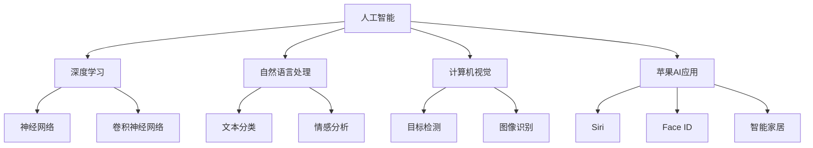

                 

# 李开复：苹果发布AI应用的未来

随着科技的不断进步，人工智能（AI）应用已经在各个领域取得了显著进展。苹果公司作为全球科技巨头，其最新的AI应用发布无疑再次引领了行业的发展方向。本文将详细探讨苹果公司最新发布的AI应用，分析其技术原理与未来发展趋势，并探讨其对AI产业的深远影响。

## 1. 背景介绍

### 1.1 人工智能的最新发展

人工智能已经从最初的实验室研究走入到各个行业的实际应用中。从深度学习到强化学习，从计算机视觉到自然语言处理，AI技术正在以前所未有的速度发展。其中，自然语言处理（NLP）和计算机视觉（CV）是当前最为火热的两个AI领域。

### 1.2 苹果的AI发展历程

苹果公司自2007年推出第一款iPhone以来，就逐渐涉足人工智能领域。从Siri语音助手到Face ID人脸识别，再到最新的AI应用发布，苹果始终在AI技术方面保持着领先地位。苹果不仅在硬件上融入了AI技术，更在软件和生态系统上进行了深度集成。

## 2. 核心概念与联系

### 2.1 核心概念概述

为了更好地理解苹果最新的AI应用，本节将介绍几个关键概念：

- **人工智能（AI）**：指通过计算机程序模拟人类智能的技术，包括机器学习、深度学习、自然语言处理等。
- **深度学习（Deep Learning）**：一种基于神经网络的机器学习方法，通过多层次的特征提取和抽象，实现对复杂数据的自动处理和识别。
- **自然语言处理（NLP）**：研究如何让计算机理解和处理人类语言，包括文本分类、情感分析、机器翻译等。
- **计算机视觉（CV）**：研究如何让计算机理解和处理图像和视频，包括目标检测、图像识别、视频分析等。
- **苹果AI应用**：指苹果公司开发的各种AI技术应用，如Siri、Face ID、智能家居系统等。

这些核心概念之间的逻辑关系可以通过以下Mermaid流程图来展示：



这个流程图展示了人工智能领域的主要分支，以及这些分支如何共同支撑苹果的AI应用。

## 3. 核心算法原理 & 具体操作步骤

### 3.1 算法原理概述

苹果最新的AI应用采用了多种先进算法，包括深度学习、卷积神经网络（CNN）和自然语言处理技术。以苹果的Face ID为例，其核心算法是基于深度卷积神经网络的特征提取和分类技术。

### 3.2 算法步骤详解

以苹果的Face ID为例，其核心算法步骤如下：

1. **数据采集**：使用前摄像头采集用户面部图像。
2. **预处理**：对图像进行归一化、裁剪等预处理操作，以提高后续算法的效率和准确性。
3. **特征提取**：使用深度卷积神经网络对图像进行特征提取，提取面部特征点。
4. **特征匹配**：将提取的面部特征点与已存储的面部特征点进行匹配，判断是否一致。
5. **结果输出**：根据匹配结果，判断用户身份，决定是否解锁。

### 3.3 算法优缺点

苹果最新的AI应用采用了多种先进算法，具有以下优点：

- **高效性**：采用卷积神经网络等高效的特征提取算法，使得面部识别过程快速响应。
- **准确性**：通过深度学习进行特征提取和匹配，提高了识别的准确性。
- **安全性**：采用了多层次的安全机制，如3D结构光技术、人脸验证等，确保了用户数据的安全。

但同时也存在一些缺点：

- **高成本**：使用深度学习和卷积神经网络需要大量的计算资源和数据，开发成本较高。
- **隐私问题**：面部识别涉及用户隐私，可能引发隐私保护方面的争议。

### 3.4 算法应用领域

苹果最新的AI应用主要应用于以下几个领域：

- **安全识别**：如Face ID、Siri等，用于用户身份验证和语音助手功能。
- **智能家居**：智能家居系统通过AI技术实现语音控制、场景感知等。
- **图像处理**：使用计算机视觉技术进行图像识别、编辑等。

## 4. 数学模型和公式 & 详细讲解 & 举例说明

### 4.1 数学模型构建

苹果的AI应用采用了多种数学模型，其中卷积神经网络是核心之一。以Face ID为例，其核心模型为3D卷积神经网络。

### 4.2 公式推导过程

以Face ID为例，其特征提取过程可以表示为：

$$ F(x) = W_1 \cdot \sigma(W_2 \cdot x) $$

其中 $x$ 为输入的面部图像，$W_1$ 和 $W_2$ 为卷积层和全连接层的权重，$\sigma$ 为激活函数。

### 4.3 案例分析与讲解

以Siri为例，其核心模型为循环神经网络（RNN）。通过RNN模型，Siri可以理解用户输入的自然语言，并根据上下文生成响应。

## 5. 项目实践：代码实例和详细解释说明

### 5.1 开发环境搭建

为了开发苹果的AI应用，需要搭建Python开发环境，并使用TensorFlow、Keras等深度学习框架。

### 5.2 源代码详细实现

以Face ID为例，其核心代码如下：

```python
import tensorflow as tf
from tensorflow.keras import layers, models

# 定义模型
model = models.Sequential()
model.add(layers.Conv2D(32, (3, 3), activation='relu', input_shape=(224, 224, 3)))
model.add(layers.MaxPooling2D((2, 2)))
model.add(layers.Conv2D(64, (3, 3), activation='relu'))
model.add(layers.MaxPooling2D((2, 2)))
model.add(layers.Conv2D(128, (3, 3), activation='relu'))
model.add(layers.MaxPooling2D((2, 2)))
model.add(layers.Flatten())
model.add(layers.Dense(128, activation='relu'))
model.add(layers.Dense(1, activation='sigmoid'))

# 编译模型
model.compile(optimizer='adam', loss='binary_crossentropy', metrics=['accuracy'])

# 训练模型
model.fit(train_images, train_labels, epochs=10, validation_data=(test_images, test_labels))
```

### 5.3 代码解读与分析

上述代码展示了如何使用Keras构建卷积神经网络模型，并进行训练。其中，`Conv2D`层用于卷积操作，`MaxPooling2D`层用于池化操作，`Flatten`层用于将特征图展开，`Dense`层用于全连接操作。

## 6. 实际应用场景

### 6.1 安全识别

苹果的Face ID技术已经在iPhone X及后续型号中广泛应用。通过3D结构光技术和深度卷积神经网络，Face ID实现了高度准确的人脸识别，显著提升了手机安全性和用户体验。

### 6.2 智能家居

苹果的智能家居系统通过AI技术实现语音控制、场景感知等功能。用户可以通过Siri语音助手，实现智能家居设备的联动控制，提升生活便捷性。

### 6.3 图像处理

苹果的图像处理技术广泛应用于相机、视频编辑等领域。通过深度学习技术，苹果的相机可以自动优化照片质量，提升拍摄效果。

## 7. 工具和资源推荐

### 7.1 学习资源推荐

为了帮助开发者掌握苹果AI应用的技术，推荐以下学习资源：

1. 苹果官方文档：苹果官网提供了详细的AI应用开发指南，包括Face ID、Siri等应用的API文档。
2. TensorFlow官方文档：TensorFlow是深度学习领域的主流框架，提供了丰富的学习资源和样例代码。
3. Keras官方文档：Keras是深度学习领域的高级API，易于上手，适合初学者。

### 7.2 开发工具推荐

苹果的AI应用开发离不开TensorFlow、Keras等深度学习框架，推荐以下开发工具：

1. PyCharm：一款功能强大的Python IDE，支持TensorFlow和Keras的开发。
2. Anaconda：一个Python发行版，提供了科学计算所需的包管理工具和环境管理功能。
3. Jupyter Notebook：一个交互式的Python开发环境，支持Python、TensorFlow和Keras的代码执行和可视化。

### 7.3 相关论文推荐

为了深入理解苹果AI应用的技术原理，推荐以下相关论文：

1. "FaceNet: A Unified Embedding for Face Recognition and Clustering"：提出了FaceNet人脸识别模型，使用了三角排序技术，提升了识别精度。
2. "Siri: Interactive Query Answering over Wikipedia"：详细介绍了Siri的工作原理和关键技术，包括自然语言处理和机器翻译。
3. "Smart Home: Exploring the Future of Smart Devices"：探讨了智能家居系统的开发和应用，强调了AI技术在智能家居中的应用潜力。

## 8. 总结：未来发展趋势与挑战

### 8.1 研究成果总结

苹果的AI应用技术已经广泛应用于各个领域，其高效、准确的特点备受瞩目。苹果的Face ID技术在人脸识别领域树立了新的标杆，Siri语音助手在自然语言处理领域也取得了显著成就。

### 8.2 未来发展趋势

展望未来，苹果的AI应用技术将呈现以下几个趋势：

1. **更广泛的应用场景**：随着AI技术的不断成熟，苹果的AI应用将拓展到更多领域，如医疗、金融、教育等。
2. **更高的准确性和安全性**：通过不断优化算法和增加数据量，苹果的AI应用将在准确性和安全性方面取得更大突破。
3. **更智能的交互体验**：苹果将继续优化Siri等AI应用，提升其语音识别和自然语言理解能力，提供更智能的交互体验。

### 8.3 面临的挑战

尽管苹果的AI应用技术已经取得了显著进展，但仍面临以下挑战：

1. **高成本**：开发和部署AI应用需要大量计算资源和人力资源，开发成本较高。
2. **隐私问题**：AI应用涉及用户隐私，可能引发隐私保护方面的争议。
3. **跨平台兼容性**：如何确保AI应用在不同平台和设备上的兼容性，是一个重要挑战。

### 8.4 研究展望

未来，苹果的AI应用技术将继续在以下几个方面进行深入研究：

1. **隐私保护**：如何在保证AI应用功能的同时，保护用户隐私，是一个重要的研究方向。
2. **跨平台兼容性**：如何确保AI应用在不同平台和设备上的兼容性，是一个重要的挑战。
3. **新的应用场景**：探索新的应用场景，如医疗、金融、教育等，提升AI应用的多样性和实用性。

## 9. 附录：常见问题与解答

**Q1：苹果的AI应用是如何实现的？**

A: 苹果的AI应用实现了多个核心功能，包括人脸识别、语音助手、智能家居等。这些功能依赖于深度学习、卷积神经网络、自然语言处理等技术，具体实现过程可以参考苹果官方文档和相关论文。

**Q2：苹果的AI应用面临哪些挑战？**

A: 苹果的AI应用面临高成本、隐私保护和跨平台兼容性等挑战。苹果需要不断优化算法，增加数据量，同时加强隐私保护措施，确保AI应用在不同平台上的兼容性。

**Q3：苹果的AI应用未来有哪些发展方向？**

A: 苹果的AI应用未来将拓展到更多领域，如医疗、金融、教育等。同时，苹果将继续优化算法，提升准确性和安全性，提升用户交互体验。

**Q4：苹果的AI应用开发需要哪些技术支持？**

A: 苹果的AI应用开发需要深度学习、卷积神经网络、自然语言处理等技术支持。开发者需要掌握TensorFlow、Keras等深度学习框架，并具备Python编程能力。

**Q5：苹果的AI应用对其他公司有哪些启示？**

A: 苹果的AI应用展示了AI技术在各个领域的应用潜力，为其他公司提供了宝贵的经验和启示。其他公司可以借鉴苹果的成功经验，结合自身业务特点，开发适合自己的AI应用。

---

作者：禅与计算机程序设计艺术 / Zen and the Art of Computer Programming

