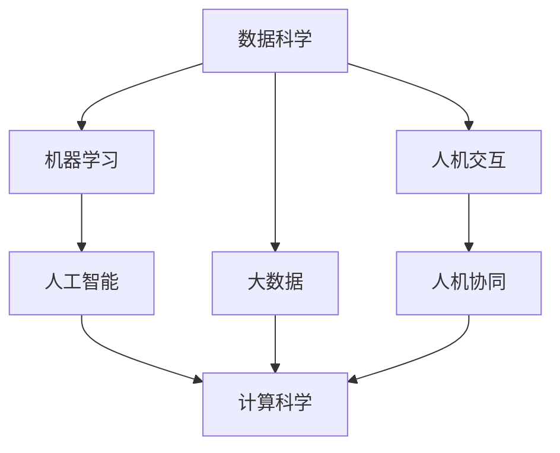

                 

# 构建更智能的世界：人类计算的应用场景

> 关键词：人类计算,智能应用,计算科学,前沿技术,未来趋势

## 1. 背景介绍

### 1.1 问题由来
随着计算科学和人工智能技术的飞速发展，人类计算已经从传统的机械式、自动化模式，转变为更高级别的智能自动化。这种转变不仅极大提升了工作效率，也带来了新的应用场景和挑战。人类计算的核心在于通过机器学习、大数据分析等手段，实现对海量数据的深度处理和智能决策。本文将详细探讨人类计算的应用场景及其面临的挑战，为构建更智能的世界提供指导。

### 1.2 问题核心关键点
人类计算的关键在于如何将人类的智慧与计算机的强大计算能力结合，实现高效、精确、智能化的决策和处理。其核心在于以下几个方面：

- **数据处理能力**：收集和处理大规模数据，从中提取出有价值的信息和模式。
- **智能决策能力**：利用机器学习算法和知识图谱等，实现基于数据的智能决策。
- **跨领域应用**：将人类计算技术应用于医疗、金融、教育、城市治理等多个领域，提升各行业的工作效率和决策质量。
- **人机协同**：将机器智能与人类经验相结合，实现高效、可靠、人性化的智能系统。

## 2. 核心概念与联系

### 2.1 核心概念概述

为更好地理解人类计算的应用场景，本节将介绍几个关键概念及其联系：

- **数据科学与大数据**：通过收集、存储、处理大规模数据，从中挖掘出潜在的知识与规律。
- **机器学习与人工智能**：利用算法和模型，从数据中学习知识，实现预测、分类、聚类等智能决策。
- **计算科学**：研究计算的理论和实践，旨在高效利用计算资源，实现复杂问题的解决。
- **人机交互**：研究如何设计人类与机器之间交互的界面和机制，提升用户体验和系统可用性。
- **人机协同**：结合机器智能和人类经验，实现更加智能、可靠的系统。

这些概念之间的逻辑关系可以通过以下Mermaid流程图来展示：



这个流程图展示了几大概念之间的联系：

1. 数据科学和大数据是机器学习和人工智能的基础。
2. 机器学习和人工智能构成了人工智能的核心技术。
3. 计算科学提供算法和架构，支撑复杂问题的解决。
4. 人机交互和协同技术，提升系统的用户体验和可用性。

## 3. 核心算法原理 & 具体操作步骤
### 3.1 算法原理概述

人类计算的核心算法原理在于利用机器学习模型，从数据中学习知识，并结合人类经验进行决策。其基本流程包括数据预处理、特征提取、模型训练、模型评估和应用部署。

### 3.2 算法步骤详解

#### 3.2.1 数据预处理
数据预处理是所有算法的第一步，主要包括数据清洗、标准化、归一化等步骤。目的是提高数据的质量和一致性，为后续特征提取和模型训练打下良好基础。

#### 3.2.2 特征提取
特征提取是从原始数据中提取出关键信息，形成可供模型学习的特征向量。常见的特征提取方法包括统计特征、时间序列特征、文本特征等。

#### 3.2.3 模型训练
模型训练是将特征向量输入到机器学习模型中，通过优化算法（如梯度下降）调整模型参数，使其能够对数据进行有效的预测和分类。

#### 3.2.4 模型评估
模型评估是通过验证集或测试集对模型进行性能测试，常用的评估指标包括准确率、召回率、F1值等。评估结果可以用来优化模型参数，提高模型的预测能力。

#### 3.2.5 应用部署
应用部署是将训练好的模型部署到实际应用环境中，进行大规模的在线预测或分类。在实际应用中，还需考虑模型的性能监控、异常处理等问题。

### 3.3 算法优缺点

#### 3.3.1 优点
1. **高效处理大数据**：人类计算能够高效地处理海量数据，从中挖掘出有价值的信息和模式。
2. **智能决策能力**：利用机器学习算法，实现基于数据的智能决策，提升决策的准确性和效率。
3. **跨领域应用**：人类计算技术可以应用于多个领域，推动各行业的发展和创新。
4. **人机协同**：结合机器智能和人类经验，实现更加智能、可靠的系统。

#### 3.3.2 缺点
1. **依赖数据质量**：数据质量对算法的性能和结果影响巨大，数据清洗和预处理的工作量较大。
2. **模型复杂度高**：复杂的机器学习模型需要大量计算资源和存储空间，部署和维护成本较高。
3. **结果可解释性不足**：许多机器学习模型是"黑盒"系统，难以解释其内部工作机制和决策逻辑。
4. **数据隐私和安全**：在处理敏感数据时，需要严格保护数据隐私和安全，防止数据泄露和滥用。

### 3.4 算法应用领域

#### 3.4.1 医疗健康
人类计算在医疗健康领域具有广泛的应用，例如：

- **疾病预测**：利用大数据和机器学习算法，预测患者的疾病风险，提前进行预防和治疗。
- **药物研发**：通过分析大量的生物数据和临床试验数据，加速新药的研发过程。
- **影像诊断**：利用深度学习算法，自动分析医学影像，提高诊断的准确性和效率。

#### 3.4.2 金融服务
金融服务领域对数据处理和智能决策的需求极高，人类计算的应用包括：

- **风险评估**：通过分析用户的信用记录、交易数据等，评估贷款和信用卡的风险。
- **市场预测**：利用时间序列分析和机器学习算法，预测股票、汇率等金融市场的走势。
- **欺诈检测**：通过异常检测和行为分析，识别和防范金融欺诈行为。

#### 3.4.3 智能制造
智能制造是制造业的未来方向，人类计算的应用涵盖：

- **供应链管理**：利用大数据和机器学习算法，优化供应链的各个环节，提高效率和准确性。
- **生产优化**：通过实时监控和数据分析，自动调整生产参数，提升生产效率和产品质量。
- **故障预测**：利用传感器数据和机器学习算法，预测设备故障，提前进行维护。

#### 3.4.4 智能城市
智能城市是智慧城市的重要组成部分，人类计算的应用场景包括：

- **交通管理**：利用大数据和机器学习算法，优化交通流量，减少拥堵和事故。
- **环境监测**：通过传感器和机器学习算法，实时监测城市环境，提供实时预警和建议。
- **能源管理**：利用大数据和机器学习算法，优化能源使用，提高能源利用效率。

## 4. 数学模型和公式 & 详细讲解 & 举例说明

### 4.1 数学模型构建

在人类计算中，常见的数学模型包括线性回归、逻辑回归、支持向量机、神经网络等。这里以神经网络为例，展示其基本构建过程。

神经网络由多个神经元（节点）组成，每个神经元接收输入，经过计算后输出。神经元之间的连接权值可以通过反向传播算法进行优化。

神经网络的数学模型可以表示为：

$$
y = W^T x + b
$$

其中，$W$ 是权重矩阵，$x$ 是输入向量，$b$ 是偏置项，$y$ 是输出。

### 4.2 公式推导过程

以线性回归为例，其数学模型可以表示为：

$$
y = \beta_0 + \beta_1 x_1 + \beta_2 x_2 + \cdots + \beta_n x_n
$$

其中，$y$ 是输出，$\beta_0$ 是截距，$\beta_1, \beta_2, \cdots, \beta_n$ 是各个特征的权重。

利用最小二乘法，可以通过训练数据求得权重 $\beta_0, \beta_1, \beta_2, \cdots, \beta_n$，使得模型能够对数据进行预测和分类。

### 4.3 案例分析与讲解

#### 4.3.1 房价预测
房价预测是线性回归的经典案例，通过分析影响房价的因素（如房屋面积、地理位置等），预测未来房价。

假设数据集包含 $n$ 个样本，每个样本包含 $m$ 个特征 $x_1, x_2, \cdots, x_m$ 和一个房价标签 $y$。利用最小二乘法求解权重 $\beta_0, \beta_1, \cdots, \beta_m$，使得预测结果与真实房价尽可能接近。

假设得到权重 $\beta_0 = 2, \beta_1 = 0.3, \beta_2 = 0.2$，则房价预测模型为：

$$
y = 2 + 0.3x_1 + 0.2x_2
$$

通过不断优化权重，可以逐步提高模型的预测精度。

## 5. 项目实践：代码实例和详细解释说明

### 5.1 开发环境搭建

在进行人类计算的实践时，需要搭建相应的开发环境。以下是使用Python进行TensorFlow开发的配置流程：

1. 安装Anaconda：从官网下载并安装Anaconda，用于创建独立的Python环境。

2. 创建并激活虚拟环境：
```bash
conda create -n tf-env python=3.8 
conda activate tf-env
```

3. 安装TensorFlow：根据CUDA版本，从官网获取对应的安装命令。例如：
```bash
conda install tensorflow tensorflow-gpu -c conda-forge
```

4. 安装NumPy、Pandas、Scikit-Learn等依赖包：
```bash
pip install numpy pandas scikit-learn
```

5. 安装TensorBoard：TensorFlow配套的可视化工具，可实时监测模型训练状态，并提供丰富的图表呈现方式。
```bash
pip install tensorboard
```

完成上述步骤后，即可在`tf-env`环境中开始人类计算的实践。

### 5.2 源代码详细实现

这里以房价预测为例，展示TensorFlow代码的实现过程。

```python
import tensorflow as tf
import numpy as np
import pandas as pd

# 加载数据集
data = pd.read_csv('house_prices.csv')

# 数据预处理
data['price'] = np.log(data['price'])
data['area'] = data['area'].astype('float')

# 特征提取
X = data[['area', 'bedrooms', 'bathrooms']]
y = data['price']

# 构建模型
model = tf.keras.Sequential([
    tf.keras.layers.Dense(10, activation='relu', input_shape=(X.shape[1],)),
    tf.keras.layers.Dense(1)
])

# 定义损失函数和优化器
loss_fn = tf.keras.losses.MeanSquaredError()
optimizer = tf.keras.optimizers.Adam()

# 模型训练
model.compile(optimizer=optimizer, loss=loss_fn)
model.fit(X, y, epochs=10, batch_size=32, validation_split=0.2)

# 模型评估
test_data = pd.read_csv('test_house_prices.csv')
test_X = test_data[['area', 'bedrooms', 'bathrooms']]
test_y = test_data['price']
test_y_pred = np.exp(model.predict(test_X))
print(classification_report(test_y, test_y_pred))
```

### 5.3 代码解读与分析

在上述代码中，我们首先加载了房价预测数据集，并对数据进行了预处理。然后，通过特征提取，选择了影响房价的主要特征，并构建了神经网络模型。通过优化算法和损失函数，不断调整模型参数，最终得到房价预测模型。最后，对模型进行了评估和测试。

代码中的关键点包括：

- 数据预处理：对数据进行标准化、归一化，避免数据不平衡带来的影响。
- 特征提取：选择对房价有显著影响的特征，作为模型的输入。
- 模型构建：通过Sequential API，构建多层神经网络模型。
- 损失函数和优化器：选择合适的损失函数和优化器，指导模型参数的更新。
- 模型评估：通过测试集对模型进行评估，生成预测结果。

## 6. 实际应用场景

### 6.1 智能医疗
智能医疗是人类计算的重要应用场景之一，通过大数据和机器学习算法，可以实现疾病的预测和诊断。

#### 6.1.1 疾病预测
利用患者的基因数据、生理数据、行为数据等，通过机器学习算法预测疾病风险。例如，通过分析患者的基因数据，预测其患某疾病的概率，提前进行预防和治疗。

#### 6.1.2 影像诊断
利用深度学习算法，自动分析医学影像，识别和定位病灶。例如，通过卷积神经网络(CNN)算法，自动检测肺部CT影像中的结节，辅助医生进行诊断。

#### 6.1.3 个性化治疗
根据患者的基因数据和病历数据，利用机器学习算法生成个性化治疗方案。例如，通过分析患者的基因数据，推荐最适合的治疗药物和剂量。

### 6.2 智能金融
智能金融是金融服务的重要方向，通过大数据和机器学习算法，可以实现风险评估和市场预测。

#### 6.2.1 风险评估
利用用户的信用记录、交易数据等，通过机器学习算法评估贷款和信用卡的风险。例如，通过分析用户的交易数据，预测其违约概率，辅助贷款审批。

#### 6.2.2 市场预测
利用时间序列分析和机器学习算法，预测股票、汇率等金融市场的走势。例如，通过分析历史数据，预测股票的价格变化趋势。

#### 6.2.3 欺诈检测
通过异常检测和行为分析，识别和防范金融欺诈行为。例如，利用深度学习算法，检测信用卡交易中的异常行为，及时发现和防范欺诈行为。

### 6.3 智能制造
智能制造是制造业的未来方向，通过大数据和机器学习算法，可以实现生产优化和故障预测。

#### 6.3.1 供应链管理
利用大数据和机器学习算法，优化供应链的各个环节，提高效率和准确性。例如，通过分析供应商的交货数据，预测供应商的交货时间，优化库存管理。

#### 6.3.2 生产优化
通过实时监控和数据分析，自动调整生产参数，提升生产效率和产品质量。例如，利用传感器数据和机器学习算法，自动调整生产线的生产参数。

#### 6.3.3 故障预测
利用传感器数据和机器学习算法，预测设备故障，提前进行维护。例如，通过分析设备的传感器数据，预测设备的故障时间，提前进行维护。

### 6.4 未来应用展望

随着人类计算技术的不断进步，未来将有更多的应用场景得到开发和利用。以下是几个值得关注的方向：

#### 6.4.1 智能城市
智能城市是智慧城市的重要组成部分，通过大数据和机器学习算法，可以实现交通管理、环境监测、能源管理等。例如，利用大数据和机器学习算法，优化交通流量，减少拥堵和事故。

#### 6.4.2 智能教育
智能教育是教育领域的重要方向，通过大数据和机器学习算法，可以实现个性化教学和智能评估。例如，通过分析学生的学习数据，生成个性化的学习计划，提高学习效率和效果。

#### 6.4.3 智能安全
智能安全是社会治理的重要方向，通过大数据和机器学习算法，可以实现犯罪预测和公共安全管理。例如，利用大数据和机器学习算法，预测犯罪行为，提前进行防范和打击。

## 7. 工具和资源推荐

### 7.1 学习资源推荐

为了帮助开发者系统掌握人类计算的理论基础和实践技巧，这里推荐一些优质的学习资源：

1. 《深度学习》书籍：由Ian Goodfellow等人撰写，全面介绍了深度学习的基本原理和应用。
2. 《TensorFlow实战》书籍：由TensorFlow官方编写，详细介绍了TensorFlow框架的使用方法和案例。
3. CS231n《卷积神经网络》课程：斯坦福大学开设的深度学习课程，涵盖卷积神经网络、循环神经网络等核心算法。
4. Coursera《机器学习》课程：由Andrew Ng教授开设的机器学习入门课程，讲解机器学习的基本概念和算法。
5. Kaggle竞赛平台：利用Kaggle平台参与数据科学竞赛，通过实战提升技能，积累经验。

通过对这些资源的学习实践，相信你一定能够快速掌握人类计算的精髓，并用于解决实际的业务问题。

### 7.2 开发工具推荐

高效的开发离不开优秀的工具支持。以下是几款用于人类计算开发的常用工具：

1. TensorFlow：由Google主导开发的深度学习框架，支持多种编程语言和平台，是机器学习开发的首选。
2. PyTorch：由Facebook主导开发的深度学习框架，灵活、高效、易于使用，适用于科研和生产环境。
3. Jupyter Notebook：用于数据科学和机器学习的交互式编程环境，支持Python、R等多种语言，方便调试和展示。
4. Keras：高级神经网络API，提供了简单易用的接口，可以快速构建和训练深度学习模型。
5. Scikit-Learn：基于Python的机器学习库，提供了丰富的算法和工具，适用于数据分析和建模。

合理利用这些工具，可以显著提升人类计算任务的开发效率，加快创新迭代的步伐。

### 7.3 相关论文推荐

人类计算技术的发展离不开学界的持续研究。以下是几篇奠基性的相关论文，推荐阅读：

1. 《神经网络的反向传播算法》：反向传播算法是深度学习的基础，介绍了反向传播的数学原理和实现方法。
2. 《深度学习在计算机视觉中的应用》：介绍了卷积神经网络在图像分类、目标检测等任务上的应用，展示了深度学习的强大能力。
3. 《梯度下降算法》：梯度下降算法是机器学习中最基本的优化算法，介绍了梯度下降的原理和优化策略。
4. 《机器学习在医疗健康中的应用》：介绍了机器学习在疾病预测、影像诊断、个性化治疗等医疗任务上的应用，展示了机器学习在医疗领域的前景。
5. 《机器学习在金融服务中的应用》：介绍了机器学习在风险评估、市场预测、欺诈检测等金融任务上的应用，展示了机器学习在金融领域的前景。

这些论文代表了大数据和机器学习技术的发展脉络，通过学习这些前沿成果，可以帮助研究者把握学科前进方向，激发更多的创新灵感。

## 8. 总结：未来发展趋势与挑战

### 8.1 总结

本文对人类计算的应用场景进行了全面系统的介绍。首先阐述了人类计算的研究背景和意义，明确了大数据和机器学习技术在各行各业的应用潜力。其次，从原理到实践，详细讲解了人类计算的基本流程和关键步骤，给出了人类计算任务开发的完整代码实例。同时，本文还广泛探讨了人类计算技术在医疗、金融、制造等多个领域的应用前景，展示了人类计算技术的广阔前景。

通过本文的系统梳理，可以看到，人类计算技术正在成为各行业的重要工具，极大地提升工作效率和决策质量。未来，伴随大数据和机器学习技术的持续演进，人类计算必将在更广阔的应用领域大放异彩，深刻影响人类的生产生活方式。

### 8.2 未来发展趋势

展望未来，人类计算技术将呈现以下几个发展趋势：

1. **数据处理能力增强**：随着数据量的不断增长，大数据处理技术将不断进步，实现更快、更高效的数据处理。
2. **智能决策能力提升**：利用机器学习算法和知识图谱等，实现更加智能、精确的决策。
3. **跨领域应用拓展**：将人类计算技术应用于更多领域，推动各行业的发展和创新。
4. **人机协同深入**：结合机器智能和人类经验，实现更加智能、可靠的系统。
5. **模型优化和压缩**：开发更加高效、轻量级的模型，实现快速部署和高效推理。
6. **隐私和安全保护**：在数据处理和模型训练中，保护用户隐私和数据安全。

这些趋势凸显了人类计算技术的广阔前景。这些方向的探索发展，必将进一步提升计算技术的应用范围，为构建更智能的世界提供强有力的技术支撑。

### 8.3 面临的挑战

尽管人类计算技术已经取得了瞩目成就，但在迈向更加智能化、普适化应用的过程中，它仍面临着诸多挑战：

1. **数据质量问题**：数据质量对算法的性能和结果影响巨大，数据清洗和预处理的工作量较大。
2. **模型复杂度高**：复杂的机器学习模型需要大量计算资源和存储空间，部署和维护成本较高。
3. **结果可解释性不足**：许多机器学习模型是"黑盒"系统，难以解释其内部工作机制和决策逻辑。
4. **数据隐私和安全**：在处理敏感数据时，需要严格保护数据隐私和安全，防止数据泄露和滥用。
5. **计算资源瓶颈**：大规模数据处理和模型训练需要大量计算资源，硬件设备的高成本和能耗问题需要解决。

### 8.4 研究展望

面对人类计算所面临的挑战，未来的研究需要在以下几个方面寻求新的突破：

1. **数据增强和清洗**：开发更加高效的数据增强和清洗技术，提高数据质量。
2. **模型优化和压缩**：开发更加高效、轻量级的模型，实现快速部署和高效推理。
3. **可解释性和透明性**：开发可解释性强的模型和算法，提高模型的透明性和可用性。
4. **隐私和安全保护**：开发隐私保护技术，确保数据处理和模型训练过程中的隐私和安全。
5. **跨领域应用融合**：将人类计算技术与其他技术进行深度融合，推动跨领域的应用创新。

这些研究方向将引领人类计算技术的不断进步，为构建更智能、更普适的计算系统提供强有力的技术支撑。面向未来，人类计算技术需要不断突破技术瓶颈，提升应用性能，才能真正实现其广泛的应用价值。

## 9. 附录：常见问题与解答

**Q1：人类计算是否只适用于数据科学和机器学习领域？**

A: 人类计算的应用范围非常广泛，不仅仅是数据科学和机器学习领域。它包括但不限于医疗、金融、制造、智能城市等多个领域。通过大数据和机器学习算法，可以提升各行业的工作效率和决策质量。

**Q2：人类计算是否需要强大的硬件支持？**

A: 是的，人类计算需要大量的计算资源和存储空间。因此，高性能的硬件设备是必要的。同时，还需要优化算法和模型结构，降低计算成本。

**Q3：人类计算是否需要大量的标注数据？**

A: 人类计算需要一定的标注数据，但与传统机器学习不同，它可以利用无监督学习、半监督学习等方法，从非标注数据中学习知识。这种方法可以显著降低数据标注的难度和成本。

**Q4：人类计算是否具有可解释性？**

A: 许多人类计算模型，尤其是基于深度学习的模型，是"黑盒"系统，难以解释其内部工作机制和决策逻辑。因此，可解释性是人类计算面临的一个挑战。开发可解释性强的模型和算法，提高模型的透明性和可用性，是未来的重要研究方向。

**Q5：人类计算是否面临数据隐私和安全问题？**

A: 是的，人类计算处理大量的敏感数据，数据隐私和安全问题是其面临的重要挑战。开发隐私保护技术和加密算法，确保数据处理和模型训练过程中的隐私和安全，是未来的重要研究方向。

---

作者：禅与计算机程序设计艺术 / Zen and the Art of Computer Programming

