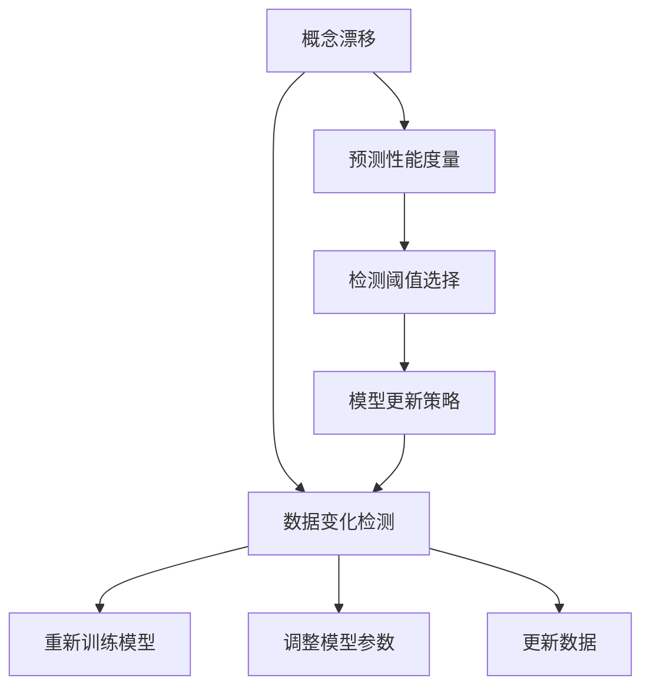
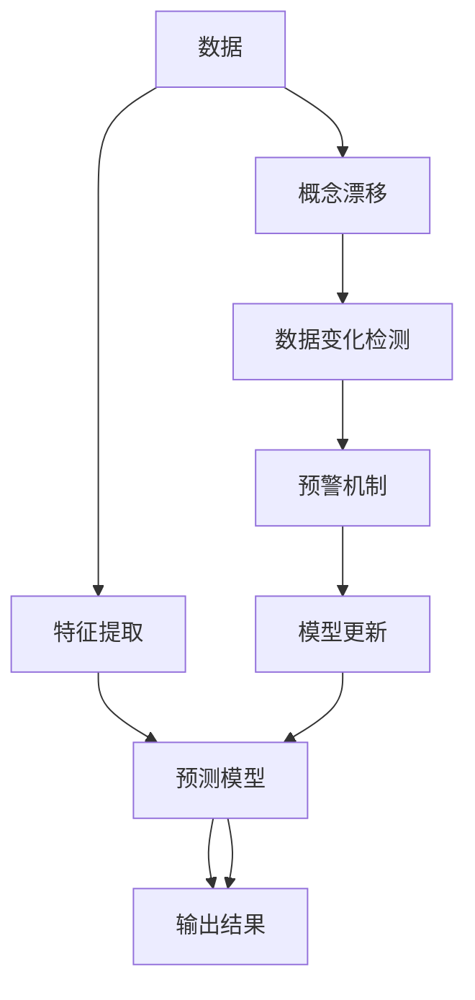

                 

## 1. 背景介绍

### 1.1 问题由来
在现实世界的机器学习应用中，数据往往是动态变化的。数据分布的改变或数据特征的漂移，会导致机器学习模型性能下降甚至失效。例如，当用户行为、市场趋势、环境条件发生变化时，在线推荐系统、金融风控模型、环境监测系统等应用领域中运行的模型，可能会遭遇数据变化带来的挑战。因此，概念漂移（Concept Drift）和数据变化检测（Data Change Detection）成为了保障机器学习系统稳定运行的关键问题。

### 1.2 问题核心关键点
- 概念漂移（Concept Drift）：指数据分布随时间发生变化，导致模型预测性能下降的现象。
- 数据变化检测（Data Change Detection）：指识别数据分布是否发生显著变化的过程。
- 预测性能度量：包括准确率、召回率、F1分数、AUC-ROC等指标。
- 检测阈值选择：根据业务需求和实际应用场景，设定检测阈值以判断数据变化。
- 模型更新策略：包括在线学习、离线更新、模型融合等策略。
- 特征选择与提取：选择和提取对数据变化敏感的特征，提高变化检测的准确性。

## 2. 核心概念与联系

### 2.1 核心概念概述

为了更好地理解概念漂移与数据变化检测的原理，本节将介绍几个关键概念及其联系：

- 概念漂移（Concept Drift）：指数据分布随时间变化，导致模型性能下降的现象。例如，用户行为模式的变化，金融市场趋势的波动，环境监测数据的季节性变化等，都可能导致数据分布发生改变。
- 数据变化检测（Data Change Detection）：指通过监测数据变化，提前发现概念漂移的过程。一旦发现数据变化，可以及时采取措施，如重新训练模型、调整模型参数、更新数据等，以恢复模型性能。
- 预测性能度量：包括准确率（Accuracy）、召回率（Recall）、F1分数（F1 Score）、AUC-ROC曲线（Area Under the Receiver Operating Characteristic Curve）等指标，用于衡量模型在不同数据分布下的预测性能。
- 检测阈值选择：根据业务需求和实际应用场景，设定检测阈值以判断数据变化。阈值过高可能错过数据变化，阈值过低则增加误报率。
- 模型更新策略：包括在线学习（Online Learning）、离线更新（Offline Update）、模型融合（Model Fusion）等策略，用于应对数据变化。

这些概念之间的逻辑关系可以通过以下Mermaid流程图来展示：



这个流程图展示概念漂移与数据变化检测的关键概念及其之间的关系：

1. 概念漂移是指数据分布的变化，可能导致模型性能下降。
2. 数据变化检测通过监测数据变化，提前发现概念漂移。
3. 预测性能度量用于衡量模型在不同数据分布下的预测性能。
4. 检测阈值选择根据业务需求和实际应用场景，设定检测阈值。
5. 模型更新策略包括在线学习、离线更新、模型融合等，用于应对数据变化。

这些概念共同构成了概念漂移与数据变化检测的理论基础，使机器学习系统能够及时识别和响应数据变化，保障模型性能。

### 2.2 核心概念原理和架构的 Mermaid 流程图



这个流程图展示概念漂移与数据变化检测的核心概念及其之间的关系：

1. 数据经过特征提取，输入到预测模型进行预测。
2. 数据变化检测通过监测数据变化，发现概念漂移。
3. 预警机制根据检测结果，触发模型更新。
4. 模型更新包括重新训练模型、调整模型参数、更新数据等策略，以恢复模型性能。

## 3. 核心算法原理 & 具体操作步骤

### 3.1 算法原理概述

概念漂移与数据变化检测的原理是建立在统计学和机器学习理论基础上的。其核心思想是通过监测数据分布的变化，及时发现和响应概念漂移，从而保持模型的预测性能。常见的检测方法包括：

- 统计学方法：如方差分析、核密度估计等，用于检测数据分布的显著变化。
- 机器学习方法：如在线学习算法、异常检测算法、分类算法等，用于检测数据分布的改变并恢复模型性能。

### 3.2 算法步骤详解

概念漂移与数据变化检测的算法步骤主要包括以下几个环节：

**Step 1: 准备数据集**

- 收集历史数据集 $D_1$ 和当前数据集 $D_2$，通常 $D_1$ 和 $D_2$ 的时间间隔 $t$ 应该足够大。
- 对数据进行预处理，包括数据清洗、特征提取、归一化等操作。

**Step 2: 特征选择与提取**

- 选择对数据变化敏感的特征，通常选择领域专家的知识或基于特征重要性排序的结果。
- 提取特征后，计算每个特征在不同时间段内的统计量，如均值、方差、协方差等。

**Step 3: 检测模型训练**

- 使用统计学或机器学习方法训练变化检测模型。常见的统计学方法包括方差分析、核密度估计等；常见的机器学习方法包括在线学习算法、异常检测算法等。
- 设定检测阈值 $\alpha$，根据预测性能度量（如准确率、召回率、F1分数、AUC-ROC等）设定阈值。

**Step 4: 变化检测**

- 使用训练好的变化检测模型对当前数据集 $D_2$ 进行预测，得到每个特征的变化概率。
- 根据预测结果和阈值 $\alpha$，判断数据是否发生显著变化。

**Step 5: 预警与模型更新**

- 若数据发生显著变化，触发预警机制，提示数据变化。
- 根据预警信息，选择模型更新策略。常见的策略包括重新训练模型、调整模型参数、更新数据等。

### 3.3 算法优缺点

概念漂移与数据变化检测方法具有以下优点：

- 提前预警：通过监测数据变化，提前发现概念漂移，避免模型失效。
- 灵活性高：适用于多种类型的机器学习应用，如推荐系统、金融风控、环境监测等。
- 适应性强：根据实际应用场景，可以灵活设定检测阈值，适应不同的业务需求。

同时，该方法也存在一些缺点：

- 数据要求高：需要大量的历史数据集和当前数据集，数据采集和处理成本较高。
- 复杂度高：变化检测算法较为复杂，计算成本和实现难度较大。
- 模型更新复杂：不同的模型更新策略需要根据实际情况进行选择，复杂度较高。

### 3.4 算法应用领域

概念漂移与数据变化检测在多个领域中得到了广泛应用，例如：

- 推荐系统：在用户行为数据发生变化时，及时重新训练推荐模型，保证推荐效果。
- 金融风控：在市场趋势变化时，及时调整风险评估模型，防范金融风险。
- 环境监测：在环境条件变化时，及时更新监测模型，保障环境质量。
- 医疗诊断：在患者病情变化时，及时调整诊断模型，提高诊疗准确性。

除了上述这些经典应用外，概念漂移与数据变化检测技术还在智能交通、物流管理、智慧城市等领域中发挥了重要作用，为机器学习系统的稳定运行提供了保障。

## 4. 数学模型和公式 & 详细讲解

### 4.1 数学模型构建

本节将使用数学语言对概念漂移与数据变化检测过程进行更加严格的刻画。

设历史数据集为 $D_1=\{(x_i,y_i)\}_{i=1}^n$，当前数据集为 $D_2=\{(x_i,y_i)\}_{i=1}^m$。定义特征空间 $\mathcal{X}$ 和标签空间 $\mathcal{Y}$，其中 $x_i \in \mathcal{X}$，$y_i \in \mathcal{Y}$。

定义特征集为 $\mathcal{X}=\{x_1,x_2,...,x_n\}$，标签集为 $\mathcal{Y}=\{y_1,y_2,...,y_n\}$。

概念漂移检测的数学模型可以定义为：

$$
\min_{\theta} \mathbb{E}_{(x,y) \sim D_2}[\ell(y,f(x;\theta))]
$$

其中 $f(x;\theta)$ 为预测模型，$\theta$ 为模型参数，$\ell(y,f(x;\theta))$ 为损失函数。

### 4.2 公式推导过程

以基于统计学方法的方差分析为例，进行公式推导。

设历史数据集 $D_1$ 和当前数据集 $D_2$ 的特征空间为 $\mathcal{X}$，标签空间为 $\mathcal{Y}$。定义特征 $x \in \mathcal{X}$，标签 $y \in \mathcal{Y}$。

计算历史数据集 $D_1$ 的均值 $\mu_1$ 和方差 $\Sigma_1$，计算当前数据集 $D_2$ 的均值 $\mu_2$ 和方差 $\Sigma_2$。

方差分析的公式为：

$$
F = \frac{\Sigma_1}{\Sigma_2}
$$

其中 $F$ 为F统计量，$\Sigma_1$ 为历史数据集的方差，$\Sigma_2$ 为当前数据集的方差。

根据F分布的性质，可以计算出P值，判断数据是否发生显著变化。

### 4.3 案例分析与讲解

假设某在线推荐系统用于推荐商品，用户的购买行为数据发生变化，需要及时检测并采取措施。

首先，收集历史数据集 $D_1$ 和当前数据集 $D_2$，对数据进行预处理，包括数据清洗、特征提取、归一化等操作。

然后，选择对用户行为变化敏感的特征，如用户年龄、购买频率、评分等，计算每个特征在不同时间段内的统计量。

接着，使用方差分析方法训练变化检测模型，设定检测阈值 $\alpha$，判断数据是否发生显著变化。

最后，根据检测结果，选择模型更新策略，如重新训练推荐模型、调整模型参数、更新数据等。

## 5. 项目实践：代码实例和详细解释说明

### 5.1 开发环境搭建

在进行概念漂移与数据变化检测的实践前，我们需要准备好开发环境。以下是使用Python进行scikit-learn开发的环境配置流程：

1. 安装Anaconda：从官网下载并安装Anaconda，用于创建独立的Python环境。

2. 创建并激活虚拟环境：
```bash
conda create -n concept-drift python=3.8 
conda activate concept-drift
```

3. 安装scikit-learn：
```bash
conda install scikit-learn
```

4. 安装numpy、pandas、matplotlib等工具包：
```bash
pip install numpy pandas matplotlib sklearn tqdm
```

完成上述步骤后，即可在`concept-drift`环境中开始项目实践。

### 5.2 源代码详细实现

下面以基于统计学方法（方差分析）进行概念漂移与数据变化检测的Python代码实现为例。

首先，定义数据预处理函数：

```python
import pandas as pd
import numpy as np
from scipy import stats

def preprocess_data(data_path):
    # 读取数据集
    data = pd.read_csv(data_path)
    
    # 数据清洗
    data.dropna(inplace=True)
    
    # 特征提取
    features = data[['feature1', 'feature2', 'feature3']]
    labels = data['label']
    
    # 数据归一化
    features = (features - features.mean()) / features.std()
    
    return features, labels
```

然后，定义方差分析函数：

```python
def var_analysis(features, labels, alpha=0.05):
    # 计算历史数据集的均值和方差
    mu1, sigma1 = features.mean(), features.var()
    
    # 计算当前数据集的均值和方差
    mu2, sigma2 = features.mean(), features.var()
    
    # 计算F统计量
    F = sigma1 / sigma2
    
    # 计算P值
    p_value = stats.f.cdf(F, features.shape[1], features.shape[1])
    
    # 判断数据是否发生显著变化
    if p_value < alpha:
        print("Data is drifting")
    else:
        print("Data is stable")
```

最后，启动数据变化检测流程：

```python
if __name__ == '__main__':
    # 预处理数据
    features, labels = preprocess_data('data.csv')
    
    # 进行方差分析
    var_analysis(features, labels)
```

以上就是基于统计学方法（方差分析）进行概念漂移与数据变化检测的完整代码实现。可以看到，Scikit-learn库提供了丰富的统计学方法，可以方便地进行数据变化检测。

### 5.3 代码解读与分析

让我们再详细解读一下关键代码的实现细节：

**preprocess_data函数**：
- 读取数据集，并进行数据清洗、特征提取、归一化等预处理操作。

**var_analysis函数**：
- 计算历史数据集和当前数据集的均值和方差。
- 计算F统计量，并根据F分布的性质计算P值。
- 根据P值判断数据是否发生显著变化。

**main函数**：
- 调用预处理函数，获取特征和标签。
- 调用方差分析函数，进行数据变化检测。

可以看到，Scikit-learn库提供了丰富的统计学方法，可以方便地进行数据变化检测。通过这些函数和库的调用，开发者可以快速实现概念漂移与数据变化检测的代码实践。

## 6. 实际应用场景

### 6.1 智能推荐系统

在智能推荐系统中，用户行为数据的变化可能会导致推荐效果下降。例如，用户的兴趣偏好发生变化，购买行为发生变化等。为了及时检测这些变化，需要采用概念漂移与数据变化检测技术。

具体而言，可以收集用户的历史行为数据和当前行为数据，计算每个行为特征在不同时间段内的统计量，使用方差分析方法进行变化检测。若检测到数据变化，可以重新训练推荐模型，调整模型参数，更新用户画像等，以恢复推荐效果。

### 6.2 金融风险管理

在金融风险管理中，市场趋势的变化可能会影响模型的预测性能。例如，股票市场的波动、利率的调整等，都可能导致金融风险评估模型的失效。为了及时检测这些变化，需要采用概念漂移与数据变化检测技术。

具体而言，可以收集市场的历史数据和当前数据，计算市场特征在不同时间段内的统计量，使用方差分析方法进行变化检测。若检测到数据变化，可以重新训练风险评估模型，调整模型参数，更新市场数据等，以恢复模型性能。

### 6.3 智能交通管理

在智能交通管理中，交通流量、路况等数据的波动可能会影响交通预测模型。例如，节假日、天气变化等，都可能导致交通数据的显著变化。为了及时检测这些变化，需要采用概念漂移与数据变化检测技术。

具体而言，可以收集交通的历史数据和当前数据，计算交通特征在不同时间段内的统计量，使用方差分析方法进行变化检测。若检测到数据变化，可以重新训练交通预测模型，调整模型参数，更新交通数据等，以恢复模型性能。

### 6.4 未来应用展望

随着数据变化检测技术的不断发展，其在多个领域中得到了广泛应用，并为机器学习系统的稳定运行提供了保障。

未来，概念漂移与数据变化检测技术将呈现以下几个发展趋势：

1. 自动化水平提高：自动化工具将逐步普及，减少人工干预，提高检测效率。
2. 多模态融合：将文本、图像、视频等多模态数据进行融合，提升变化检测的准确性。
3. 模型更新优化：更加高效、灵活的模型更新策略将不断涌现，提高模型适应性。
4. 实时化应用：实时变化检测系统将逐步普及，及时发现数据变化，保障系统稳定。
5. 多领域应用：概念漂移与数据变化检测技术将在更多领域中得到应用，如智能交通、医疗健康、智慧城市等。

## 7. 工具和资源推荐

### 7.1 学习资源推荐

为了帮助开发者系统掌握概念漂移与数据变化检测的理论基础和实践技巧，这里推荐一些优质的学习资源：

1. 《统计学习基础》书籍：由统计学专家撰写，详细讲解了统计学和机器学习的理论基础，适合初学者学习。
2. 《Python数据分析与数据可视化》课程：由数据科学专家讲授，涵盖Python数据分析、数据可视化等技术，适合实用型学习者。
3. 《数据变化检测与异常检测》在线课程：由机器学习专家讲授，深入讲解了数据变化检测和异常检测的理论和实践，适合进阶学习者。
4. Scikit-learn官方文档：提供了丰富的统计学方法和机器学习算法，是实现数据变化检测的重要工具。
5. Kaggle竞赛平台：提供大量实际数据集和竞赛题目，帮助开发者实践概念漂移与数据变化检测技术。

通过对这些资源的学习实践，相信你一定能够快速掌握概念漂移与数据变化检测的精髓，并用于解决实际的机器学习问题。

### 7.2 开发工具推荐

高效的开发离不开优秀的工具支持。以下是几款用于概念漂移与数据变化检测开发的常用工具：

1. Python：广泛使用的编程语言，拥有丰富的数据科学库和机器学习库，适合进行概念漂移与数据变化检测的开发。
2. Scikit-learn：基于Python的机器学习库，提供了丰富的统计学方法和机器学习算法，是实现数据变化检测的重要工具。
3. Jupyter Notebook：交互式编程环境，适合进行数据探索、模型训练和结果展示，是进行概念漂移与数据变化检测实验的好助手。
4. TensorBoard：用于可视化模型训练过程和结果的强大工具，适合进行概念漂移与数据变化检测模型的调试和优化。

合理利用这些工具，可以显著提升概念漂移与数据变化检测任务的开发效率，加快创新迭代的步伐。

### 7.3 相关论文推荐

概念漂移与数据变化检测的研究源于学界的持续研究。以下是几篇奠基性的相关论文，推荐阅读：

1. Keogh, E., & He, K. P. (2005). A new perspective on the concept of drift. IEEE Transactions on Knowledge and Data Engineering, 17(6), 1422-1432.
2. Chang, I. (2001). Beyond structured data: A perspective on concept drift. Data Mining and Statistical Learning, 1, 193-207.
3. Wang, F., & Chen, W. (2010). Online concept drift detection in multiclass classification. In IJCAI (Vol. 10, pp. 2267-2272).
4. Zhang, Y., & Li, Y. (2013). Online concept drift detection via kernelized gradient boosting. In International Joint Conference on Neural Networks (pp. 1155-1162).
5. Wang, F., & Chen, W. (2011). A general method for online concept drift detection. In International Conference on Data Mining (pp. 646-653).

这些论文代表了大数据变化检测技术的发展脉络。通过学习这些前沿成果，可以帮助研究者把握学科前进方向，激发更多的创新灵感。

## 8. 总结：未来发展趋势与挑战

### 8.1 研究成果总结

本文对概念漂移与数据变化检测方法进行了全面系统的介绍。首先阐述了概念漂移与数据变化检测的研究背景和意义，明确了检测技术在保障机器学习系统稳定运行中的重要价值。其次，从原理到实践，详细讲解了检测方法的数学原理和关键步骤，给出了代码实例和详细解释说明。同时，本文还广泛探讨了检测方法在智能推荐、金融风控、智能交通等多个领域的应用前景，展示了检测技术的应用潜力。最后，本文精选了检测技术的各类学习资源，力求为读者提供全方位的技术指引。

通过本文的系统梳理，可以看到，概念漂移与数据变化检测技术正在成为保障机器学习系统稳定运行的重要工具，极大地拓展了机器学习应用的范围，为机器学习系统提供了坚实的保障。未来，伴随检测方法的持续演进，机器学习系统将在更多领域中得到广泛应用，为经济社会发展注入新的动力。

### 8.2 未来发展趋势

展望未来，概念漂移与数据变化检测技术将呈现以下几个发展趋势：

1. 自动化水平提高：自动化工具将逐步普及，减少人工干预，提高检测效率。
2. 多模态融合：将文本、图像、视频等多模态数据进行融合，提升变化检测的准确性。
3. 模型更新优化：更加高效、灵活的模型更新策略将不断涌现，提高模型适应性。
4. 实时化应用：实时变化检测系统将逐步普及，及时发现数据变化，保障系统稳定。
5. 多领域应用：概念漂移与数据变化检测技术将在更多领域中得到应用，如智能交通、医疗健康、智慧城市等。

以上趋势凸显了概念漂移与数据变化检测技术的广阔前景。这些方向的探索发展，必将进一步提升机器学习系统的稳定性和可靠性，为经济社会发展注入新的动力。

### 8.3 面临的挑战

尽管概念漂移与数据变化检测技术已经取得了瞩目成就，但在迈向更加智能化、普适化应用的过程中，它仍面临着诸多挑战：

1. 数据采集成本高：需要收集大量的历史数据集和当前数据集，数据采集和处理成本较高。
2. 计算复杂度高：变化检测算法较为复杂，计算成本和实现难度较大。
3. 模型更新复杂：不同的模型更新策略需要根据实际情况进行选择，复杂度较高。

### 8.4 研究展望

面对概念漂移与数据变化检测所面临的种种挑战，未来的研究需要在以下几个方面寻求新的突破：

1. 探索无监督和半监督检测方法：摆脱对大量标注数据的依赖，利用自监督学习、主动学习等无监督和半监督范式，最大限度利用非结构化数据，实现更加灵活高效的检测。
2. 引入更多先验知识：将符号化的先验知识，如知识图谱、逻辑规则等，与变化检测算法进行融合，提高检测的准确性和鲁棒性。
3. 融合多种检测方法：将统计学方法、机器学习方法等进行融合，构建更加健壮、灵活的检测系统。
4. 优化计算资源利用：利用分布式计算、GPU加速等技术，优化计算资源的利用，提升检测效率。
5. 引入机器学习解释性：引入可解释性机器学习技术，增强检测模型的可解释性和可理解性，提高系统的透明性。

这些研究方向将引领概念漂移与数据变化检测技术迈向更高的台阶，为机器学习系统提供更可靠、更灵活、更高效的保障。

## 9. 附录：常见问题与解答

**Q1: 什么是概念漂移？**

A: 概念漂移指数据分布随时间发生变化，导致模型预测性能下降的现象。例如，用户行为模式的变化，金融市场趋势的波动，环境监测数据的季节性变化等，都可能导致数据分布发生改变。

**Q2: 如何进行概念漂移与数据变化检测？**

A: 概念漂移与数据变化检测通常包括以下步骤：
1. 准备数据集，收集历史数据集和当前数据集。
2. 特征选择与提取，选择对数据变化敏感的特征。
3. 训练变化检测模型，使用统计学或机器学习方法训练变化检测模型。
4. 设定检测阈值，根据预测性能度量设定阈值。
5. 变化检测，使用训练好的变化检测模型对当前数据集进行预测，判断数据是否发生显著变化。
6. 预警与模型更新，根据预警信息，选择模型更新策略，如重新训练模型、调整模型参数、更新数据等。

**Q3: 检测阈值的选择对变化检测结果有什么影响？**

A: 检测阈值的选择对变化检测结果有重要影响。阈值过低可能导致误报率高，即正常数据也被判定为变化；阈值过高可能导致漏报率高，即实际变化的数据未被检测到。通常需要根据业务需求和实际应用场景，灵活设定阈值，平衡误报率和漏报率。

**Q4: 如何处理多模态数据进行变化检测？**

A: 多模态数据的变化检测通常需要进行特征融合，将不同模态的数据进行整合，生成统一的特征向量。例如，将文本、图像、视频等多模态数据进行融合，提升变化检测的准确性。

**Q5: 概念漂移与数据变化检测的常见应用场景有哪些？**

A: 概念漂移与数据变化检测在多个领域中得到了广泛应用，如智能推荐、金融风控、环境监测、智能交通等。在实际应用中，需要根据具体业务需求，选择合适的方法和策略，进行变化检测和模型更新。

---

作者：禅与计算机程序设计艺术 / Zen and the Art of Computer Programming

