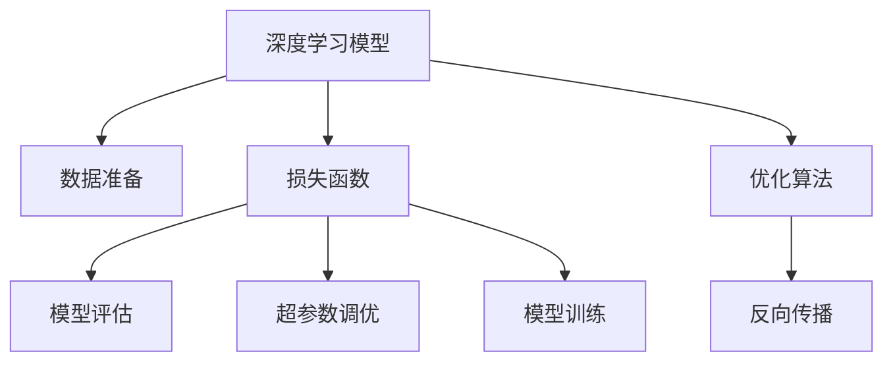

                 

# 模型训练与优化技术原理与代码实战案例讲解

> 关键词：深度学习,模型训练,优化算法,神经网络,损失函数,梯度下降,反向传播,代码实践

## 1. 背景介绍

### 1.1 问题由来
随着人工智能技术的发展，深度学习在计算机视觉、自然语言处理、语音识别等领域取得了显著进展。其中，模型训练与优化技术是深度学习成功的关键。但模型训练的复杂度逐年增加，训练成本高、速度慢、效果不理想等问题日益突出。本文通过系统介绍模型训练与优化技术的原理与实现，并结合代码实战案例，希望能为深度学习初学者和实战工程师提供有益的指导。

### 1.2 问题核心关键点
本章节将介绍模型训练与优化技术在深度学习中的重要性，以及其实现的核心要素。这些要素包括：深度学习模型的构建、数据准备、损失函数的设计、优化算法的选择与实现、模型评估与调参等。我们将通过理论和代码实践相结合的方式，详细介绍这些关键技术点，以实现模型的高效训练与优化。

## 2. 核心概念与联系

### 2.1 核心概念概述

为了更好地理解模型训练与优化技术，本章节将介绍一些关键概念：

- 深度学习：一种基于神经网络的机器学习方法，能够自动学习特征表示，适用于复杂的模式识别和预测任务。
- 模型训练：通过大量样本数据，不断调整神经网络参数，使模型在测试集上达到最优性能。
- 优化算法：用于最小化模型损失函数，优化模型参数的算法，包括梯度下降、随机梯度下降、Adam等。
- 损失函数：用于衡量模型预测值与真实值之间差异的函数，是模型优化的关键指标。
- 反向传播：一种计算损失函数对模型参数偏导数的方法，是优化算法的核心步骤。
- 超参数调优：调整模型训练过程中需要手动设置的参数，如学习率、批量大小、迭代次数等，以提升模型性能。

这些概念之间存在密切联系，共同构成了深度学习模型训练与优化的完整框架。理解这些概念的内在联系，将有助于我们掌握深度学习的核心技术。

### 2.2 核心概念原理和架构的 Mermaid 流程图



这个流程图展示了深度学习模型训练与优化的核心流程：

1. 首先构建深度学习模型。
2. 准备训练数据集。
3. 设计损失函数，衡量模型预测与真实值的差异。
4. 选择合适的优化算法，如梯度下降。
5. 通过反向传播计算损失函数对参数的偏导数。
6. 根据损失函数和优化算法，调整模型参数。
7. 在验证集上评估模型性能。
8. 根据评估结果调整超参数，进行模型训练。

## 3. 核心算法原理 & 具体操作步骤

### 3.1 算法原理概述
深度学习模型的训练与优化主要依赖于损失函数和优化算法。在模型训练过程中，损失函数衡量模型预测值与真实值之间的差异，优化算法则用于最小化损失函数，调整模型参数以提升模型性能。

损失函数（Loss Function）是一个将模型预测值与真实值映射到非负实数的函数。常见的损失函数包括均方误差（MSE）、交叉熵（Cross Entropy）等。优化算法则是通过梯度下降等方法，计算损失函数对模型参数的偏导数，并不断调整参数，使损失函数最小化。

### 3.2 算法步骤详解
深度学习模型的训练过程可以分为以下几个步骤：

1. **模型构建与数据准备**：
   - 构建深度学习模型，定义模型的层数、每层神经元个数、激活函数等。
   - 准备训练数据集，包括数据清洗、归一化、分批次等处理。

2. **损失函数设计**：
   - 根据任务类型选择合适的损失函数。例如，回归任务使用均方误差（MSE），分类任务使用交叉熵（Cross Entropy）。
   - 定义损失函数的具体计算方式，如代码实现。

3. **选择与实现优化算法**：
   - 根据模型和任务特点，选择适合的优化算法，如梯度下降、Adam等。
   - 实现优化算法，如计算梯度、更新参数等。

4. **反向传播**：
   - 使用反向传播算法，计算损失函数对模型参数的偏导数。
   - 根据偏导数，更新模型参数。

5. **模型评估与调参**：
   - 在验证集上评估模型性能，如准确率、召回率、F1 Score等指标。
   - 根据评估结果，调整超参数，如学习率、批量大小、迭代次数等，重新训练模型。

6. **模型测试**：
   - 在测试集上测试模型性能，确保模型泛化能力。

### 3.3 算法优缺点
深度学习模型的训练与优化技术有以下优点：

- **高效性**：深度学习模型能够自动学习特征表示，减少了手动特征工程的复杂度。
- **灵活性**：深度学习模型适用于多种任务，如图像识别、自然语言处理、语音识别等。
- **鲁棒性**：深度学习模型在面对大量噪声数据和复杂模式时，表现出色。

但该技术也存在一些局限性：

- **计算资源需求高**：深度学习模型通常需要大量的计算资源，如GPU、TPU等。
- **训练时间长**：深度学习模型训练时间较长，需要耐心和计算资源。
- **模型复杂度高**：深度学习模型通常较为复杂，调试和优化难度大。

### 3.4 算法应用领域
深度学习模型训练与优化技术在各个领域都有广泛应用，包括但不限于：

- 计算机视觉：如图像识别、目标检测、图像分割等。
- 自然语言处理：如文本分类、语言模型、机器翻译等。
- 语音识别：如语音转文本、说话人识别、语音合成等。
- 推荐系统：如用户行为分析、物品推荐等。
- 游戏AI：如决策树、强化学习等。

## 4. 数学模型和公式 & 详细讲解

### 4.1 数学模型构建
深度学习模型通常基于神经网络构建，包含输入层、若干隐藏层和输出层。以一个简单的全连接神经网络为例，数学模型构建如下：

假设输入数据为 $x \in \mathbb{R}^d$，输出数据为 $y \in \mathbb{R}^k$，模型参数为 $\theta$，则神经网络模型的前向传播过程为：

$$
h_1 = W_1x + b_1
$$

$$
h_2 = \sigma(h_1)
$$

$$
h_3 = W_2h_2 + b_2
$$

$$
y = W_3h_3 + b_3
$$

其中，$W_1, W_2, W_3$ 为权重矩阵，$b_1, b_2, b_3$ 为偏置向量，$\sigma$ 为激活函数，如ReLU、Sigmoid等。

### 4.2 公式推导过程
以回归任务为例，假设模型输出 $y$ 与真实值 $y^*$ 的误差为 $\epsilon$，则损失函数可以定义为：

$$
L = \frac{1}{2} \sum_{i=1}^n (y_i - y_i^*)^2
$$

其中 $n$ 为样本数量。

使用梯度下降算法优化模型参数，其更新公式为：

$$
\theta_j = \theta_j - \eta \frac{\partial L}{\partial \theta_j}
$$

其中 $\eta$ 为学习率，$\partial L / \partial \theta_j$ 为损失函数对参数 $\theta_j$ 的偏导数。

通过反向传播算法，可以计算损失函数对模型参数的偏导数。以一个单层神经网络为例，其偏导数计算如下：

$$
\frac{\partial L}{\partial \theta_3} = \frac{\partial L}{\partial y} \frac{\partial y}{\partial h_3} \frac{\partial h_3}{\partial h_2} \frac{\partial h_2}{\partial h_1} \frac{\partial h_1}{\partial \theta_1}
$$

### 4.3 案例分析与讲解
以一个简单的手写数字识别任务为例，说明模型训练与优化的具体过程。假设我们使用MNIST数据集进行训练，并构建一个包含两个隐藏层、ReLU激活函数的全连接神经网络。

首先，我们需要构建模型并定义损失函数和优化算法：

```python
import torch
import torch.nn as nn
import torch.optim as optim

# 定义模型
class Net(nn.Module):
    def __init__(self):
        super(Net, self).__init__()
        self.fc1 = nn.Linear(784, 256)
        self.fc2 = nn.Linear(256, 10)
    
    def forward(self, x):
        x = torch.relu(self.fc1(x.view(-1, 784)))
        x = self.fc2(x)
        return x
    
# 定义损失函数和优化器
net = Net()
criterion = nn.CrossEntropyLoss()
optimizer = optim.Adam(net.parameters(), lr=0.001)

# 训练模型
for epoch in range(10):
    for i, (images, labels) in enumerate(train_loader):
        # 前向传播
        outputs = net(images.view(-1, 784))
        loss = criterion(outputs, labels)
        
        # 反向传播
        optimizer.zero_grad()
        loss.backward()
        optimizer.step()
        
        if (i+1) % 100 == 0:
            print('Epoch [{}/{}], Step [{}/{}], Loss: {:.4f}'
                  .format(epoch+1, epochs, i+1, total_step, loss.item()))
```

在上述代码中，我们首先定义了模型、损失函数和优化器。在每个epoch中，通过前向传播计算损失函数，然后使用反向传播更新模型参数。同时，我们还通过打印损失函数值，实时监控模型训练的进度。

## 5. 项目实践：代码实例和详细解释说明

### 5.1 开发环境搭建

在进行模型训练与优化实践前，我们需要准备好开发环境。以下是使用Python进行TensorFlow开发的环境配置流程：

1. 安装Anaconda：从官网下载并安装Anaconda，用于创建独立的Python环境。

2. 创建并激活虚拟环境：
```bash
conda create -n tf-env python=3.8 
conda activate tf-env
```

3. 安装TensorFlow：根据CUDA版本，从官网获取对应的安装命令。例如：
```bash
conda install tensorflow -c conda-forge
```

4. 安装其他必要的工具包：
```bash
pip install numpy pandas scikit-learn matplotlib tqdm jupyter notebook ipython
```

完成上述步骤后，即可在`tf-env`环境中开始模型训练与优化实践。

### 5.2 源代码详细实现

下面以一个简单的图像分类任务为例，展示如何使用TensorFlow进行模型训练与优化。

首先，我们定义模型并加载数据集：

```python
import tensorflow as tf
from tensorflow.keras import layers, models

# 定义模型
model = models.Sequential([
    layers.Conv2D(32, (3, 3), activation='relu', input_shape=(28, 28, 1)),
    layers.MaxPooling2D((2, 2)),
    layers.Conv2D(64, (3, 3), activation='relu'),
    layers.MaxPooling2D((2, 2)),
    layers.Conv2D(64, (3, 3), activation='relu'),
    layers.Flatten(),
    layers.Dense(64, activation='relu'),
    layers.Dense(10)
])

# 加载数据集
(train_images, train_labels), (test_images, test_labels) = tf.keras.datasets.mnist.load_data()

# 数据预处理
train_images = train_images / 255.0
test_images = test_images / 255.0
train_images = train_images.reshape((60000, 28, 28, 1))
test_images = test_images.reshape((10000, 28, 28, 1))
```

然后，我们定义损失函数和优化器：

```python
# 定义损失函数和优化器
loss_fn = tf.keras.losses.SparseCategoricalCrossentropy()
optimizer = tf.keras.optimizers.Adam(learning_rate=0.001)
```

接下来，我们定义训练函数：

```python
def train_step(images, labels):
    with tf.GradientTape() as tape:
        predictions = model(images, training=True)
        loss = loss_fn(labels, predictions)
    gradients = tape.gradient(loss, model.trainable_variables)
    optimizer.apply_gradients(zip(gradients, model.trainable_variables))
    return loss
```

最后，我们启动训练流程：

```python
batch_size = 32
epochs = 10

for epoch in range(epochs):
    for i in range(0, len(train_images), batch_size):
        images = train_images[i:i+batch_size]
        labels = train_labels[i:i+batch_size]
        loss = train_step(images, labels)
        print(f'Epoch: {epoch+1}/{epochs}, Loss: {loss.numpy():.4f}')
```

以上代码展示了如何使用TensorFlow进行模型训练与优化。可以看到，通过定义模型、损失函数和优化器，并编写训练函数，我们可以方便地实现模型训练。

### 5.3 代码解读与分析

让我们再详细解读一下关键代码的实现细节：

**模型定义**：
- 使用`Sequential`模型，添加卷积层、池化层、全连接层等，构建神经网络模型。
- 注意设置适当的激活函数，如ReLU等。

**数据预处理**：
- 对图像数据进行归一化处理，将像素值缩放到0到1之间。
- 将图像数据重塑为模型的输入格式。

**损失函数和优化器**：
- 使用`SparseCategoricalCrossentropy`作为损失函数，用于分类任务。
- 使用`Adam`优化器，设置学习率为0.001。

**训练函数**：
- 使用`GradientTape`记录计算图，计算损失函数和梯度。
- 使用`apply_gradients`方法更新模型参数。
- 在每个batch结束时，输出损失值。

可以看到，TensorFlow提供了丰富的工具和库，可以方便地实现深度学习模型的训练与优化。开发者可以将更多精力放在模型构建和调优上，而不必过多关注底层实现细节。

## 6. 实际应用场景

### 6.1 智能推荐系统
智能推荐系统通过深度学习模型，分析用户历史行为和兴趣，推荐相关商品或内容。模型训练与优化是推荐系统成功的关键。通过大量用户行为数据，深度学习模型能够学习用户偏好和物品特征，并不断优化模型，提升推荐效果。

### 6.2 语音识别
语音识别系统通过深度学习模型，将语音信号转换为文本。模型训练与优化是语音识别的核心，通过大量语音数据和标注数据，深度学习模型能够学习语音特征和文本映射关系，并不断优化模型，提升识别准确率。

### 6.3 医学影像诊断
医学影像诊断系统通过深度学习模型，分析医疗影像数据，辅助医生进行疾病诊断。模型训练与优化是医学影像诊断的关键，通过大量医疗影像数据和标注数据，深度学习模型能够学习疾病特征和影像特征，并不断优化模型，提升诊断准确率。

### 6.4 未来应用展望
深度学习模型训练与优化技术在未来将有更广泛的应用，包括但不限于：

- 自动驾驶：通过深度学习模型，分析道路信息和车辆状态，进行自主驾驶决策。
- 机器人控制：通过深度学习模型，分析环境和任务，进行机器人动作规划。
- 自然语言生成：通过深度学习模型，生成自然流畅的文本内容，如聊天机器人、内容生成等。

深度学习模型训练与优化技术的应用场景将不断扩展，成为人工智能技术的重要支柱。

## 7. 工具和资源推荐

### 7.1 学习资源推荐

为了帮助开发者系统掌握深度学习模型训练与优化技术的原理与实践，这里推荐一些优质的学习资源：

1. 《深度学习》（Ian Goodfellow, Yoshua Bengio, Aaron Courville 著）：深度学习领域的经典教材，涵盖模型构建、训练与优化等核心内容。
2. CS231n《卷积神经网络》课程：斯坦福大学开设的计算机视觉课程，涵盖卷积神经网络的构建与优化。
3. CS224n《自然语言处理》课程：斯坦福大学开设的自然语言处理课程，涵盖深度学习在NLP中的应用。
4. DeepLearning.AI深度学习课程：由Andrew Ng教授主讲，涵盖深度学习的基础理论和实践技巧。
5. TensorFlow官方文档：TensorFlow的官方文档，提供丰富的模型和算法实现，是学习深度学习的重要参考资料。

通过对这些资源的学习实践，相信你一定能够快速掌握深度学习模型训练与优化的精髓，并用于解决实际的深度学习问题。

### 7.2 开发工具推荐

高效的开发离不开优秀的工具支持。以下是几款用于深度学习模型训练与优化开发的常用工具：

1. TensorFlow：由Google主导开发的深度学习框架，功能强大，适用于大规模工程应用。
2. PyTorch：由Facebook主导开发的深度学习框架，灵活易用，适合快速迭代研究。
3. Keras：高层次的深度学习框架，易于上手，适用于快速原型开发。
4. MXNet：由亚马逊主导开发的深度学习框架，支持多种编程语言和硬件平台，适用于大规模分布式训练。
5. Caffe：由Berkeley大学开发的深度学习框架，适用于计算机视觉任务。

合理利用这些工具，可以显著提升深度学习模型训练与优化的开发效率，加快创新迭代的步伐。

### 7.3 相关论文推荐

深度学习模型训练与优化技术的发展源于学界的持续研究。以下是几篇奠基性的相关论文，推荐阅读：

1. Deep Learning（Ian Goodfellow, Yoshua Bengio, Aaron Courville 著）：深度学习领域的经典教材，涵盖模型构建、训练与优化等核心内容。
2. ImageNet Classification with Deep Convolutional Neural Networks（Alex Krizhevsky, Ilya Sutskever, Geoffrey Hinton 著）：提出卷积神经网络，刷新了图像分类任务的性能指标。
3. Efficient Backprop（D. E. Rumelhart, G. E. Hinton, R. J. Williams 著）：提出反向传播算法，使深度学习模型训练成为可能。
4. Weight Initialization in Neural Networks（Xavier Glorot, Yoshua Bengio 著）：提出Xavier初始化方法，解决深度学习模型训练中的梯度消失问题。
5. Dropout: A Simple Way to Prevent Neural Networks from Overfitting（Geoffrey Hinton, et al. 著）：提出Dropout方法，解决深度学习模型过拟合问题。

这些论文代表了大模型训练与优化技术的发展脉络。通过学习这些前沿成果，可以帮助研究者把握学科前进方向，激发更多的创新灵感。

## 8. 总结：未来发展趋势与挑战

### 8.1 总结

本文对深度学习模型训练与优化技术的原理与实践进行了系统介绍。首先阐述了模型训练与优化技术在深度学习中的重要性，以及其实现的核心要素。其次，通过理论和代码实践相结合的方式，详细介绍了我深度学习模型训练与优化的关键技术点，如模型构建、损失函数设计、优化算法选择与实现、反向传播等。最后，本文还广泛探讨了模型训练与优化技术在各个领域的应用前景，展示了其广阔的应用范围。

通过本文的系统梳理，可以看到，深度学习模型训练与优化技术正在成为深度学习应用的重要范式，极大地拓展了深度学习模型的应用边界，催生了更多的落地场景。受益于深度学习模型的强大性能，训练与优化技术的不断演进，深度学习将在更多领域大放异彩。

### 8.2 未来发展趋势

展望未来，深度学习模型训练与优化技术将呈现以下几个发展趋势：

1. **自动化**：自动化训练与优化技术将进一步发展，如自动化超参数调优、自动化模型选择等，使模型训练与优化更加高效。
2. **分布式**：分布式训练与优化技术将更加成熟，支持大规模模型和数据的分布式训练，提高训练速度和效率。
3. **多任务学习**：多任务学习技术将不断发展，模型能够同时学习多个相关任务的特征表示，提升模型泛化能力和应用范围。
4. **迁移学习**：迁移学习技术将更加普及，模型能够从已有任务中学习知识，快速适应新任务。
5. **自监督学习**：自监督学习技术将进一步发展，模型能够利用大量未标注数据进行预训练，提升模型性能。

以上趋势凸显了深度学习模型训练与优化技术的广阔前景。这些方向的探索发展，必将进一步提升深度学习模型的性能和应用范围，为人工智能技术的发展注入新的动力。

### 8.3 面临的挑战

尽管深度学习模型训练与优化技术已经取得了显著进展，但在迈向更加智能化、普适化应用的过程中，仍面临诸多挑战：

1. **计算资源需求高**：深度学习模型通常需要大量的计算资源，如GPU、TPU等。如何降低计算成本，提高计算效率，是一个重要问题。
2. **训练时间长**：深度学习模型训练时间较长，需要耐心和计算资源。如何加速训练过程，提高训练效率，是一个重要研究方向。
3. **模型复杂度高**：深度学习模型通常较为复杂，调试和优化难度大。如何降低模型复杂度，提高模型可解释性，是一个重要问题。
4. **数据依赖性强**：深度学习模型训练与优化依赖于大量标注数据，如何降低数据需求，利用无监督和半监督学习，是一个重要研究方向。
5. **鲁棒性不足**：深度学习模型面对域外数据时，泛化性能往往大打折扣。如何提高模型鲁棒性，避免灾难性遗忘，还需要更多理论和实践的积累。

### 8.4 研究展望

面对深度学习模型训练与优化技术所面临的挑战，未来的研究需要在以下几个方面寻求新的突破：

1. **自监督学习**：探索利用大量未标注数据进行模型预训练，提升模型性能和泛化能力。
2. **迁移学习**：研究模型在不同任务之间的迁移能力，提高模型适应新任务的能力。
3. **自动化**：开发更加智能化的自动化训练与优化技术，降低模型训练与优化的复杂度。
4. **分布式**：研究大规模分布式训练技术，提高模型训练与优化的效率和效果。
5. **多任务学习**：研究多任务学习技术，提升模型泛化能力和应用范围。

这些研究方向将引领深度学习模型训练与优化技术迈向更高的台阶，为人工智能技术的发展提供新的动力。相信随着技术的不断进步，深度学习模型训练与优化技术将在更多领域大放异彩，成为人工智能技术的重要支柱。

## 9. 附录：常见问题与解答

**Q1：深度学习模型训练与优化是否适用于所有深度学习任务？**

A: 深度学习模型训练与优化技术适用于大多数深度学习任务，如图像识别、自然语言处理、语音识别等。但对于一些特殊任务，如医学、法律等，由于数据稀缺和任务复杂，训练与优化过程可能会更加困难。

**Q2：如何选择深度学习模型和优化算法？**

A: 深度学习模型和优化算法的选择需要根据任务特点和数据情况来决定。对于分类任务，可以使用卷积神经网络、深度残差网络等；对于回归任务，可以使用全连接神经网络、循环神经网络等。优化算法一般包括梯度下降、Adam、Adagrad等，需要根据任务特点和数据情况进行选择。

**Q3：如何提高深度学习模型训练与优化的效率？**

A: 提高深度学习模型训练与优化效率的方法包括：
1. 使用分布式训练技术，提高训练速度。
2. 使用GPU或TPU等硬件加速，提高计算效率。
3. 使用模型压缩和剪枝技术，降低模型复杂度。
4. 使用数据增强技术，提高模型泛化能力。

**Q4：如何避免深度学习模型过拟合？**

A: 避免深度学习模型过拟合的方法包括：
1. 使用正则化技术，如L2正则、Dropout等。
2. 使用数据增强技术，如图像旋转、平移等。
3. 使用早停技术，及时停止训练，避免过拟合。
4. 使用模型集成技术，提高模型鲁棒性。

**Q5：如何解释深度学习模型的决策过程？**

A: 解释深度学习模型决策过程的方法包括：
1. 使用可视化工具，如TensorBoard，查看模型的梯度流和激活图。
2. 使用模型解释技术，如LIME、SHAP等，解释模型的输出结果。
3. 使用知识图谱等外部知识，结合模型输出，解释模型的决策过程。

这些常见问题的解答，将帮助开发者更好地理解和应用深度学习模型训练与优化技术，实现高效、稳定的深度学习应用。

---

作者：禅与计算机程序设计艺术 / Zen and the Art of Computer Programming

