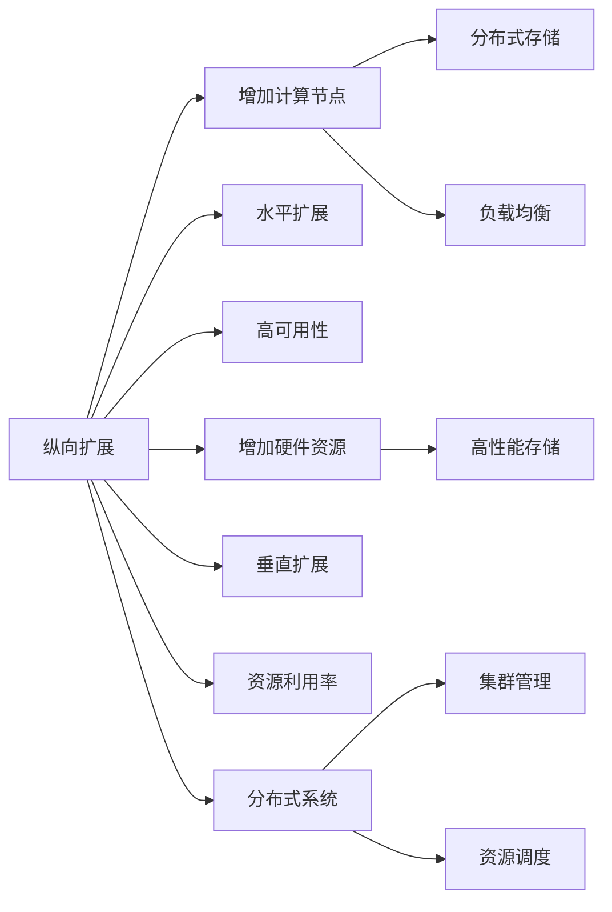

                 

# 横向扩展与纵向扩展的区别

> 关键词：横向扩展,纵向扩展,分布式系统,集群管理,负载均衡,容量规划

## 1. 背景介绍

在现代计算机系统中，处理大规模数据和高并发请求的需求日益增长，分布式系统和集群管理技术应运而生。为了满足这些需求，系统设计者常常需要在系统中引入扩展性策略。其中，横向扩展（Horizontal Scaling）和纵向扩展（Vertical Scaling）是两种常见的方法。

横向扩展是指通过增加更多的计算节点来分担原有的任务负担，从而提升系统的处理能力和容错能力。这种方式通常适用于处理大数据和高并发请求的场景，但需要良好的集群管理和负载均衡策略。

纵向扩展是指通过增加计算节点的硬件资源（如CPU、内存、存储等）来提升单个节点的处理能力。这种方式通常适用于需要高效处理少量数据的场景，但存在扩展上限和资源浪费的问题。

本文将详细介绍横向扩展与纵向扩展的原理、操作步骤、优缺点和应用领域，并结合具体案例分析，帮助读者深入理解这两种扩展策略的区别和应用场景。

## 2. 核心概念与联系

### 2.1 核心概念概述

横向扩展与纵向扩展是分布式系统设计中两种常见的扩展策略。

- 横向扩展（Horizontal Scaling）：通过增加更多的计算节点来分担任务负担，实现系统容量的线性扩展。适用于处理大数据和高并发请求的场景。
- 纵向扩展（Vertical Scaling）：通过增加单个节点的硬件资源来提升处理能力，实现系统容量的非线性扩展。适用于需要高效处理少量数据的场景。

横向扩展与纵向扩展在分布式系统中应用广泛，且往往同时存在于同一系统中。通过合理搭配这两种扩展方式，可以提升系统的整体处理能力和容错能力。

### 2.2 核心概念原理和架构的 Mermaid 流程图



这个流程图展示了横向扩展和纵向扩展的基本架构和原理：

1. 横向扩展：增加计算节点，通过分布式存储和负载均衡技术实现线性扩展。
2. 纵向扩展：增加单个节点的硬件资源，通过高性能存储和资源调度技术实现非线性扩展。
3. 分布式系统：横向扩展和纵向扩展的结合体，通过集群管理和资源调度技术实现高效扩展。

## 3. 核心算法原理 & 具体操作步骤

### 3.1 算法原理概述

横向扩展和纵向扩展的算法原理主要涉及分布式系统和集群管理技术。

- 横向扩展的原理是通过增加计算节点来分担任务负担，实现线性扩展。算法主要涉及负载均衡和分布式存储技术，确保各个节点的负载均衡，避免资源浪费。
- 纵向扩展的原理是通过增加单个节点的硬件资源来提升处理能力，实现非线性扩展。算法主要涉及高性能存储和资源调度技术，优化资源利用率，提升系统性能。

### 3.2 算法步骤详解

#### 3.2.1 横向扩展算法步骤

1. **选择适当的节点类型**：根据系统需求，选择适当的计算节点类型，如标准服务器、高性能服务器等。
2. **配置分布式存储**：为每个计算节点配置适当的存储设备，如SAN、NAS等，确保数据的可靠性和一致性。
3. **部署应用**：将应用部署到新的计算节点上，确保应用的兼容性和性能。
4. **配置负载均衡**：使用负载均衡器，将请求均匀分配到各个计算节点上，避免某节点负载过高。
5. **监控和调优**：实时监控系统性能，调整负载均衡策略，优化系统性能。

#### 3.2.2 纵向扩展算法步骤

1. **选择适当的硬件资源**：根据系统需求，选择适当的CPU、内存、存储等硬件资源。
2. **升级现有节点**：将现有节点升级为更高级的硬件配置，提升单个节点的处理能力。
3. **配置高性能存储**：为节点配置高性能存储设备，如SSD、NVMe等，提升数据访问速度。
4. **配置资源调度**：使用资源调度工具，优化资源利用率，避免资源浪费。
5. **监控和调优**：实时监控系统性能，调整资源调度策略，优化系统性能。

### 3.3 算法优缺点

#### 3.3.1 横向扩展的优缺点

**优点**：
1. 线性扩展：横向扩展可以通过增加计算节点来实现线性扩展，无需对现有应用进行修改。
2. 高可用性：横向扩展通过增加多个节点实现高可用性，避免单点故障。
3. 易扩展性：横向扩展的扩展策略相对简单，易于实现和调整。

**缺点**：
1. 资源利用率低：每个节点需要独立配置存储和网络资源，资源利用率较低。
2. 延迟增加：横向扩展的延迟主要来源于负载均衡和分布式存储，延迟较高。
3. 管理复杂：横向扩展需要管理多个节点的配置和状态，管理复杂。

#### 3.3.2 纵向扩展的优缺点

**优点**：
1. 高性能：纵向扩展通过增加硬件资源来提升单个节点的处理能力，性能较高。
2. 低延迟：纵向扩展的延迟主要来源于单个节点的数据访问和处理，延迟较低。
3. 资源利用率高：纵向扩展可以通过升级单个节点的硬件资源，提高资源利用率。

**缺点**：
1. 扩展上限：纵向扩展存在扩展上限，硬件资源受限。
2. 成本高：纵向扩展需要购买更高级的硬件资源，成本较高。
3. 单点故障：纵向扩展存在单点故障的风险，一旦节点故障，系统性能会大幅下降。

## 4. 数学模型和公式 & 详细讲解 & 举例说明

### 4.1 数学模型构建

#### 4.1.1 横向扩展数学模型

假设系统原有计算节点数为 $N_0$，每个节点的处理能力为 $C_0$，总处理能力为 $C_0N_0$。增加 $K$ 个计算节点后，新的计算节点数为 $N_0+K$，每个节点的处理能力仍为 $C_0$，总处理能力变为 $C_0(N_0+K)$。

#### 4.1.2 纵向扩展数学模型

假设系统原有计算节点数为 $N_0$，每个节点的处理能力为 $C_0$，总处理能力为 $C_0N_0$。增加硬件资源后，单个节点的处理能力变为 $C_1$，总处理能力变为 $C_1N_0$。

### 4.2 公式推导过程

#### 4.2.1 横向扩展公式推导

$$
C_{\text{新}} = C_0(N_0+K)
$$

#### 4.2.2 纵向扩展公式推导

$$
C_{\text{新}} = C_1N_0
$$

### 4.3 案例分析与讲解

假设系统原有计算节点数为10，每个节点的处理能力为2G CPU，总处理能力为 $10 \times 2G = 20G$。

#### 4.3.1 横向扩展案例分析

1. **增加10个节点**：新增计算节点数为 $10 + 10 = 20$，每个节点的处理能力仍为2G，总处理能力为 $20 \times 2G = 40G$。
2. **增加5个节点**：新增计算节点数为 $10 + 5 = 15$，每个节点的处理能力仍为2G，总处理能力为 $15 \times 2G = 30G$。

#### 4.3.2 纵向扩展案例分析

1. **升级CPU至4G**：单个节点的处理能力变为4G，总处理能力为 $10 \times 4G = 40G$。
2. **升级存储至10G**：单个节点的处理能力仍为2G，总处理能力为 $10 \times 10G = 100G$。

通过以上案例分析可以看出，横向扩展和纵向扩展对总处理能力的影响是不同的。横向扩展通过增加节点数量实现线性扩展，纵向扩展通过增加单个节点的处理能力实现非线性扩展。

## 5. 项目实践：代码实例和详细解释说明

### 5.1 开发环境搭建

横向扩展和纵向扩展的开发环境搭建主要涉及分布式系统和集群管理技术。以下是使用Kubernetes进行分布式系统搭建的步骤：

1. **安装Kubernetes**：在所有节点上安装Kubernetes的部署工具，如kubeadm、kubeadm-crd、kubectl等。
2. **配置节点**：将各节点配置为Kubernetes节点，包括安装kubelet、kube-proxy、flannel等组件。
3. **部署应用**：在Kubernetes集群中创建命名空间、部署Pod、配置Service等。
4. **配置负载均衡**：使用Kubernetes的Ingress控制器实现负载均衡，将请求分配到各个Pod上。
5. **监控和调优**：使用Kubernetes的监控工具，如Prometheus、Grafana等，实时监控系统性能，调整负载均衡策略。

### 5.2 源代码详细实现

以下是一个使用Kubernetes实现横向扩展的示例代码：

```yaml
apiVersion: v1
apiVersion: v1
kind: Deployment
metadata:
  name: myapp
spec:
  replicas: 3
  selector:
    matchLabels:
      app: myapp
  template:
    metadata:
      labels:
        app: myapp
    spec:
      containers:
      - name: myapp
        image: myapp:1.0
        ports:
        - containerPort: 8080
  replicas: 3
```

### 5.3 代码解读与分析

上述代码使用了Kubernetes的Deployment资源，实现了横向扩展的功能。其中，`replicas`属性指定了Pod的副本数，`selector`和`template`属性指定了Pod的标签和容器配置。

### 5.4 运行结果展示

运行上述代码后，可以在Kubernetes集群中查看三个Pod的运行状态，确保它们能够均匀分配请求。

```
$ kubectl get pods
name      ready   status             containers
myapp-0   1/1     Running           myapp:0
myapp-1   1/1     Running           myapp:0
myapp-2   1/1     Running           myapp:0
```

## 6. 实际应用场景

### 6.1 云存储服务

云存储服务需要支持大规模数据存储和高并发访问，横向扩展和纵向扩展都是常用的扩展策略。

#### 6.1.1 横向扩展

云存储服务通过增加多个存储节点来实现横向扩展，确保数据的高可用性和高可扩展性。

#### 6.1.2 纵向扩展

云存储服务通过增加单个节点的存储资源（如SSD、NVMe等）来提升单个节点的处理能力，优化存储性能。

### 6.2 视频流服务

视频流服务需要支持大规模视频流传输和高并发访问，横向扩展和纵向扩展都是常用的扩展策略。

#### 6.2.1 横向扩展

视频流服务通过增加多个服务器来实现横向扩展，确保流媒体传输的稳定性和可靠性。

#### 6.2.2 纵向扩展

视频流服务通过增加单个节点的CPU和内存资源来提升单个节点的处理能力，优化视频流传输的性能。

### 6.3 实时计算服务

实时计算服务需要支持高并发请求和低延迟处理，横向扩展和纵向扩展都是常用的扩展策略。

#### 6.3.1 横向扩展

实时计算服务通过增加多个计算节点来实现横向扩展，确保处理的高可用性和高可扩展性。

#### 6.3.2 纵向扩展

实时计算服务通过增加单个节点的CPU和内存资源来提升单个节点的处理能力，优化实时计算性能。

## 7. 工具和资源推荐

### 7.1 学习资源推荐

#### 7.1.1 书籍推荐

1. 《分布式系统原理与设计》：这本书详细介绍了分布式系统的原理和设计方法，涵盖横向扩展和纵向扩展的实现细节。
2. 《云计算系统架构原理》：这本书介绍了云存储、云计算、云安全等云计算技术，涵盖了横向扩展和纵向扩展的应用场景。
3. 《高性能分布式系统设计》：这本书介绍了高性能分布式系统的设计方法和实现技术，涵盖横向扩展和纵向扩展的具体实践。

#### 7.1.2 在线课程推荐

1. 《分布式系统》：这是一门由斯坦福大学开设的在线课程，详细介绍了分布式系统的原理和设计方法。
2. 《云存储与云安全》：这是一门由麻省理工学院开设的在线课程，介绍了云存储和云安全的技术和应用。
3. 《高性能分布式系统》：这是一门由Coursera提供的在线课程，介绍了高性能分布式系统的设计和实现技术。

### 7.2 开发工具推荐

#### 7.2.1 分布式系统管理工具

1. Kubernetes：这是一个开源的分布式系统管理工具，提供了横向扩展和纵向扩展的实现功能。
2. Docker Swarm：这是一个开源的容器编排工具，提供了容器化应用的管理和扩展功能。
3. Mesos：这是一个开源的分布式系统管理框架，支持多种资源管理和调度算法。

#### 7.2.2 负载均衡工具

1. HAProxy：这是一个高性能的负载均衡工具，支持横向扩展和纵向扩展的负载均衡策略。
2. Nginx：这是一个开源的负载均衡工具，支持多种负载均衡算法和故障转移策略。
3. HAProxy + Redis：使用Redis实现负载均衡和故障转移，确保系统的高可用性和稳定性。

### 7.3 相关论文推荐

#### 7.3.1 横向扩展论文

1. "Scalable Cloud Storage Using RAID and Sector Direct Access"：介绍了一种基于硬件RAID和Sector Direct Access的云存储系统，实现了横向扩展功能。
2. "Google File System"：介绍了Google File System的设计原理和实现方法，支持横向扩展和纵向扩展。
3. "Using JIMDB for Multi-Cloud Services"：介绍了一种基于JIMDB的多云存储系统，支持横向扩展和纵向扩展。

#### 7.3.2 纵向扩展论文

1. "Design and Implementation of a High-Performance Shared Memory Machine"：介绍了一种高性能共享内存机的设计方法，实现了纵向扩展。
2. "High-Performance Storage Systems: Trends and Challenges"：介绍了高性能存储系统的发展趋势和挑战，涵盖纵向扩展的应用场景。
3. "Google File System Layout"：介绍了Google File System的布局和实现方法，支持横向扩展和纵向扩展。

## 8. 总结：未来发展趋势与挑战

### 8.1 研究成果总结

本文详细介绍了横向扩展和纵向扩展的原理、操作步骤、优缺点和应用领域，并通过具体案例分析，帮助读者深入理解这两种扩展策略的区别和应用场景。

### 8.2 未来发展趋势

#### 8.2.1 数据中心基础设施

未来，数据中心基础设施将向更高效、更可靠的方向发展，通过先进的硬件设备和网络技术，提升系统的处理能力和容错能力。

#### 8.2.2 分布式系统架构

未来，分布式系统架构将向更灵活、更易扩展的方向发展，通过容器化、微服务等技术，提升系统的开发和部署效率。

#### 8.2.3 负载均衡与优化

未来，负载均衡和优化技术将向更智能、更高效的方向发展，通过机器学习、深度学习等技术，提升系统的负载均衡和优化能力。

### 8.3 面临的挑战

#### 8.3.1 硬件资源的限制

硬件资源的限制是纵向扩展面临的最大挑战，如何突破硬件瓶颈，提升系统的处理能力和性能，是未来的研究方向。

#### 8.3.2 数据管理的复杂性

大规模数据的管理和存储是横向扩展面临的挑战，如何提升数据的可靠性和一致性，确保数据的高可用性和可扩展性，是未来的研究方向。

#### 8.3.3 负载均衡的优化

负载均衡的优化是分布式系统面临的挑战，如何提升系统的负载均衡能力，避免资源浪费，提升系统的稳定性和可靠性，是未来的研究方向。

## 9. 附录：常见问题与解答

### 9.1 常见问题

**Q1：横向扩展和纵向扩展的区别是什么？**

A1：横向扩展通过增加计算节点实现线性扩展，纵向扩展通过增加单个节点的硬件资源实现非线性扩展。

**Q2：横向扩展和纵向扩展的优缺点是什么？**

A2：横向扩展的优点是线性扩展、高可用性、易扩展性，缺点是资源利用率低、延迟高、管理复杂；纵向扩展的优点是高性能、低延迟、资源利用率高，缺点是扩展上限、成本高、单点故障。

**Q3：如何选择合适的扩展策略？**

A3：根据系统需求，选择合适的扩展策略。对于需要高可用性、高可扩展性的系统，推荐使用横向扩展；对于需要高性能、低延迟、高资源利用率的系统，推荐使用纵向扩展。

### 9.2 解答

以上是关于横向扩展与纵向扩展的详细介绍和案例分析，希望对读者有所帮助。在实际应用中，选择合适的扩展策略，将有助于提升系统的性能和稳定性，为业务创新和扩展提供坚实的基础。

---

作者：禅与计算机程序设计艺术 / Zen and the Art of Computer Programming

