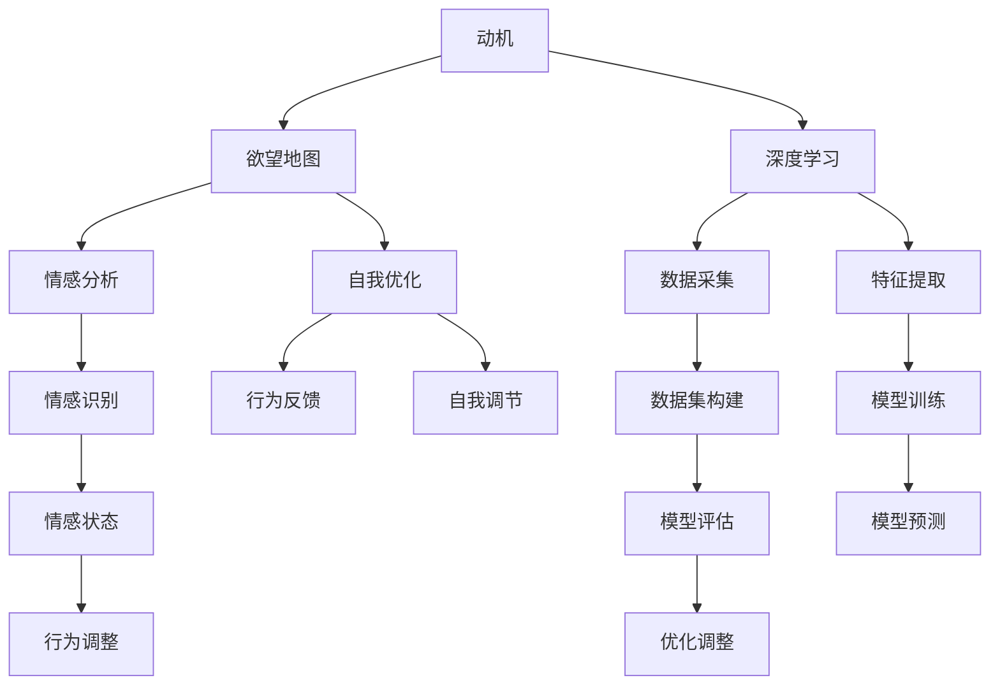

                 

# 欲望地图：AI绘制的人类动机蓝图

> 关键词：欲望地图, 人类动机, AI, 深度学习, 心理预测, 自我优化, 情感分析, 伦理与隐私

## 1. 背景介绍

在人类历史的长河中，动机一直是驱使人们行动的内在力量。从远古时代的生存本能，到现代社会追求幸福与满足的各种目标，动机贯穿了每个人的生命旅程。然而，尽管动机在个体和群体中具有如此重要的作用，对其深入理解和精确描绘，却一直是一个巨大的挑战。

近年来，随着人工智能(AI)技术的飞速发展，特别是在深度学习和数据挖掘领域，科学家和工程师们开始探索如何利用AI来绘制一张描绘人类动机的“欲望地图”。这张地图不仅能够帮助我们更好地理解人类行为，还能够为心理健康、行为干预、决策支持等领域提供有力的支持。本文旨在深入探讨AI如何帮助绘制欲望地图，以及这一技术的未来应用前景和面临的挑战。

## 2. 核心概念与联系

### 2.1 核心概念概述

- **动机**：驱动人类行为的内在心理力量，包括生存需求、情感需求、认知需求等。
- **欲望地图**：使用AI技术绘制的描述人类各种动机及其交互关系的图形，能够揭示人类行为的根本驱动力。
- **深度学习**：通过多层神经网络自动学习和提取数据中的复杂模式，是实现欲望地图绘制的关键技术。
- **情感分析**：利用自然语言处理(NLP)技术，识别和分析文本中的情感信息，了解个体情感状态和动机需求。
- **自我优化**：个体通过反馈循环调整行为以满足自身需求，是欲望地图中的一个关键组成部分。
- **隐私与伦理**：在欲望地图的绘制和应用中，保护个人隐私和确保技术应用的伦理边界是必须考虑的重要问题。

这些概念相互关联，共同构成了AI绘制欲望地图的理论框架。通过理解这些概念及其关系，我们可以更全面地把握AI在动机领域的研究和应用。

### 2.2 核心概念原理和架构的 Mermaid 流程图



这张流程图展示了动机与欲望地图之间的关系，以及深度学习在其中的作用。数据通过数据采集和特征提取进入模型训练，最终得到能够预测个体动机的模型。情感分析用于识别和描述个体的情感状态，而自我优化和反馈循环则解释了行为调整和动机满足的过程。

## 3. 核心算法原理 & 具体操作步骤

### 3.1 算法原理概述

AI绘制欲望地图的过程大致可以分为以下几个步骤：

1. **数据采集与预处理**：收集大量与动机相关的行为数据、生理数据、情感数据等。
2. **特征提取**：使用机器学习算法从原始数据中提取有意义的特征。
3. **模型训练**：使用深度学习模型训练特征与动机状态之间的关系。
4. **模型预测与评估**：利用训练好的模型对新数据进行预测，并评估模型性能。
5. **自我优化与反馈循环**：根据模型预测结果和个体反馈，调整行为以满足动机需求。

### 3.2 算法步骤详解

以下是欲望地图绘制的详细步骤：

#### 步骤1: 数据采集与预处理

**数据采集**：收集多种来源的数据，包括行为记录、生理传感器数据、心理问卷调查、社交媒体互动记录等。

**数据预处理**：对采集到的数据进行清洗和标准化，去除噪声和异常值，确保数据的质量和一致性。

#### 步骤2: 特征提取

**特征选择**：使用领域专家的知识，或者通过机器学习算法，选择与动机相关的特征。例如，可以提取社交网络互动频率、生理唤醒水平、情感强度等特征。

**特征工程**：对选择出的特征进行编码和转换，以便于深度学习模型的训练。例如，将文本数据转换为词向量，将时间序列数据进行滑动窗口处理。

#### 步骤3: 模型训练

**模型选择**：根据数据特征和任务需求，选择合适的深度学习模型。常见的模型包括卷积神经网络(CNN)、循环神经网络(RNN)、长短期记忆网络(LSTM)、变分自编码器(VAE)等。

**模型训练**：使用标记好的数据集对模型进行训练。通过反向传播算法，优化模型参数，使其能够预测动机状态。

#### 步骤4: 模型预测与评估

**模型预测**：使用训练好的模型对新的数据进行预测，判断个体动机状态。

**模型评估**：使用交叉验证等方法评估模型预测的准确性和泛化能力。

#### 步骤5: 自我优化与反馈循环

**自我优化**：根据模型的预测结果和个体反馈，调整行为以满足动机需求。例如，如果模型预测个体需要更多的社交互动，个体可以通过增加社交活动来满足这一需求。

**反馈循环**：将个体的行为调整和动机满足情况反馈到模型中，进一步优化模型的预测能力。

### 3.3 算法优缺点

**优点**：

- **数据驱动**：利用大量数据训练模型，能够揭示人类动机的复杂关系。
- **自适应性**：模型能够根据新数据和新需求进行自我调整和优化。
- **普适性**：模型适用于不同文化和背景下的个体，具有广泛的应用前景。

**缺点**：

- **数据隐私**：在数据采集和处理过程中，可能涉及隐私问题，需要严格保护。
- **解释性不足**：深度学习模型往往被视为“黑盒”，难以解释其内部工作机制。
- **伦理考量**：在应用欲望地图时，需要考虑伦理和道德问题，确保技术应用的公平性和透明性。

### 3.4 算法应用领域

欲望地图绘制技术已经在多个领域得到了应用，以下是一些典型的例子：

- **心理健康**：通过分析个体的情感状态和行为模式，预测心理健康风险，提供早期干预措施。
- **行为干预**：在健康管理、习惯养成等领域，利用欲望地图指导个体行为调整，提高生活质量。
- **市场营销**：了解消费者动机和需求，优化产品设计和营销策略，提升用户满意度和忠诚度。
- **决策支持**：在组织管理和决策过程中，通过分析团队成员的动机状态，优化资源分配和团队协作。

## 4. 数学模型和公式 & 详细讲解

### 4.1 数学模型构建

欲望地图的数学模型通常基于以下假设：

- 个体行为由多个动机驱动，且这些动机相互影响。
- 动机状态可以通过一系列特征进行描述和预测。

记动机状态为 $y$，特征向量为 $x$，目标为绘制 $y$ 与 $x$ 之间的映射关系。数学模型可以表示为：

$$ y = f(x; \theta) $$

其中 $f(\cdot)$ 为模型函数，$\theta$ 为模型参数。

### 4.2 公式推导过程

以线性回归模型为例，推导动机预测的公式。假设模型为线性形式：

$$ y = \beta_0 + \sum_{i=1}^n \beta_i x_i + \epsilon $$

其中 $\beta_0, \beta_1, ..., \beta_n$ 为模型参数，$\epsilon$ 为误差项。

给定样本数据集 $\{(x_i, y_i)\}_{i=1}^N$，最小化平方误差损失函数：

$$ \mathcal{L}(\theta) = \frac{1}{2N} \sum_{i=1}^N (y_i - f(x_i; \theta))^2 $$

通过求导并令导数等于零，解得：

$$ \hat{\beta} = (X^T X)^{-1} X^T Y $$

其中 $X = [1, x_1, x_2, ..., x_n]^T$，$Y = [y_1, y_2, ..., y_N]^T$。

### 4.3 案例分析与讲解

以情感分析为例，探讨如何使用深度学习模型进行动机预测。

**数据集**：使用包含情感标签的文本数据集，如Imdb评论数据集。

**模型选择**：使用长短时记忆网络(LSTM)或注意力机制(Attention)模型。

**模型训练**：将文本数据转换为词向量，输入模型进行训练。

**模型评估**：在测试集上评估模型的情感分类准确率。

**动机预测**：使用训练好的模型对新的文本数据进行情感预测，进而推断其动机状态。

## 5. 项目实践：代码实例和详细解释说明

### 5.1 开发环境搭建

在搭建开发环境时，需要考虑以下几个方面：

1. **硬件配置**：确保有足够的CPU和GPU资源进行模型训练和推理。
2. **软件安装**：安装必要的编程语言和库，如Python、TensorFlow、Keras等。
3. **数据准备**：准备训练和测试数据集，并进行预处理。
4. **环境配置**：配置深度学习框架和工具，确保代码的可复现性。

### 5.2 源代码详细实现

以下是一个简单的情感分析模型实现示例：

```python
import tensorflow as tf
from tensorflow.keras.preprocessing.text import Tokenizer
from tensorflow.keras.preprocessing.sequence import pad_sequences

# 加载数据集
texts = []
labels = []

# 构建特征矩阵
tokenizer = Tokenizer()
tokenizer.fit_on_texts(texts)
sequences = tokenizer.texts_to_sequences(texts)
padded_sequences = pad_sequences(sequences, maxlen=200)

# 构建模型
model = tf.keras.Sequential([
    tf.keras.layers.Embedding(input_dim=tokenizer.num_words, output_dim=128, input_length=200),
    tf.keras.layers.Bidirectional(tf.keras.layers.LSTM(64)),
    tf.keras.layers.Dense(32, activation='relu'),
    tf.keras.layers.Dense(1, activation='sigmoid')
])

# 编译模型
model.compile(loss='binary_crossentropy', optimizer='adam', metrics=['accuracy'])

# 训练模型
model.fit(padded_sequences, labels, epochs=10, batch_size=64)

# 评估模型
test_loss, test_acc = model.evaluate(test_sequences, test_labels)
print(f'Test loss: {test_loss}, Test accuracy: {test_acc}')
```

**代码解读与分析**：

1. **数据加载与预处理**：使用TensorFlow的Tokenizer对文本数据进行编码，将文本转换为序列，并进行填充。
2. **模型构建**：使用Embedding层将文本转换为密集向量，Bidirectional LSTM层进行双向上下文分析，最后使用Dense层进行分类预测。
3. **模型训练**：通过编译和训练模型，调整模型参数以提高预测准确率。
4. **模型评估**：在测试集上评估模型性能，输出测试损失和准确率。

### 5.3 运行结果展示

运行上述代码后，可以观察到模型在测试集上的性能指标，例如准确率和损失值。这些结果可以帮助评估模型的优劣，并指导后续的优化和改进。

## 6. 实际应用场景

### 6.1 心理健康

在心理健康领域，欲望地图技术可以帮助识别个体潜在的心理健康风险，提供个性化的干预措施。例如，通过分析个体的社交媒体互动和生理数据，预测其是否可能出现抑郁症状，并及时提供心理咨询和支持。

### 6.2 行为干预

在行为干预方面，欲望地图技术可以应用于健康管理、习惯养成等领域。例如，通过分析用户的饮食、运动、睡眠等行为数据，预测其健康需求，并推荐个性化的健康计划。

### 6.3 市场营销

在市场营销中，欲望地图技术可以帮助企业了解消费者的动机和需求，优化产品设计和营销策略。例如，通过分析消费者对产品的情感反馈，调整产品特性和广告内容，提升用户体验和满意度。

### 6.4 未来应用展望

未来，欲望地图技术有望在更多领域得到应用，例如：

- **教育**：通过分析学生的行为和情感数据，提供个性化的学习建议和支持。
- **金融**：通过分析客户的消费行为和情感状态，优化金融产品设计和客户服务。
- **城市规划**：通过分析市民的出行偏好和行为模式，优化城市规划和公共服务。

## 7. 工具和资源推荐

### 7.1 学习资源推荐

1. **Coursera的《深度学习专项课程》**：由深度学习领域的权威学者讲授，涵盖深度学习的基本原理和应用。
2. **DeepLearning.AI的《深度学习特别ization》**：提供深度学习的高级课程，包括模型构建、优化等技术。
3. **Kaggle竞赛平台**：参与实际项目，获取实践经验，提高解决问题的能力。
4. **arXiv预印本服务器**：获取最新的研究成果和论文，保持对前沿技术的了解。

### 7.2 开发工具推荐

1. **TensorFlow**：广泛使用的深度学习框架，支持丰富的模型和算法。
2. **PyTorch**：灵活易用的深度学习框架，具有良好的学术支持。
3. **Jupyter Notebook**：交互式编程环境，方便开发和实验。
4. **Google Colab**：免费的云端开发环境，支持GPU计算，方便实验部署。

### 7.3 相关论文推荐

1. **《Neural Companion: Deep Learning with Data, Models, and Users》**：探讨深度学习在用户行为分析中的应用。
2. **《A Survey on Emotion Analysis Using Deep Learning》**：综述情感分析技术及其应用，包括动机分析。
3. **《Machine Learning for Behavioral Science》**：介绍机器学习在行为科学中的应用，包括动机预测。

## 8. 总结：未来发展趋势与挑战

### 8.1 研究成果总结

本文系统介绍了AI绘制欲望地图的原理和实践，探讨了深度学习在动机分析中的应用。欲望地图技术通过数据驱动的方法，揭示了人类行为的根本驱动力，具有广泛的应用前景。然而，在数据采集、模型训练、应用部署等方面，仍存在诸多挑战需要克服。

### 8.2 未来发展趋势

未来，欲望地图技术将呈现以下发展趋势：

1. **数据融合与协同**：将多模态数据进行融合，提升动机分析的全面性和准确性。
2. **跨领域应用**：在更多领域（如教育、金融、城市规划等）探索欲望地图的应用。
3. **实时分析**：实现对个体动机的实时监测和反馈，提供即时干预措施。
4. **隐私保护**：在数据采集和处理过程中，加强隐私保护和伦理约束。

### 8.3 面临的挑战

尽管欲望地图技术具有广阔的应用前景，但在实际应用中仍面临诸多挑战：

1. **数据获取难度**：大规模、高质量的动机数据获取成本高、难度大。
2. **模型复杂性**：动机分析涉及多层次、多维度的复杂关系，需要设计更复杂的模型。
3. **隐私保护**：在数据采集和处理过程中，需要严格保护个体隐私，避免数据泄露和滥用。
4. **伦理问题**：在技术应用中，需要考虑伦理和道德问题，确保技术的公平性和透明性。

### 8.4 研究展望

未来研究需要重点关注以下几个方面：

1. **多模态融合**：将文本、图像、音频等多模态数据进行融合，提升动机分析的全面性和准确性。
2. **跨领域应用**：探索欲望地图在不同领域的应用，扩展其应用边界。
3. **实时分析**：实现对个体动机的实时监测和反馈，提供即时干预措施。
4. **隐私保护**：在数据采集和处理过程中，加强隐私保护和伦理约束。

## 9. 附录：常见问题与解答

**Q1: 如何保护数据隐私？**

**A1:** 在数据采集和处理过程中，需要采用数据匿名化、加密等技术，确保数据隐私不被泄露。同时，需要对数据进行严格的访问控制，限制只有授权人员才能访问和使用数据。

**Q2: 如何提高模型的解释性？**

**A2:** 可以通过可视化技术（如梯度图、热力图等），帮助理解模型内部工作机制。同时，可以引入可解释性强的模型（如决策树、线性回归等），提升模型的可解释性。

**Q3: 如何应对伦理挑战？**

**A3:** 在技术应用中，需要考虑伦理和道德问题，确保技术的公平性和透明性。例如，在使用欲望地图进行决策支持时，需要确保决策过程透明、可解释，避免偏见和歧视。

**Q4: 如何提高模型的泛化能力？**

**A4:** 可以通过增加训练数据量、使用正则化技术、调整模型结构等方式，提高模型的泛化能力。同时，需要进行模型评估和验证，确保模型在不同场景下的稳定性和可靠性。

**Q5: 如何降低数据获取成本？**

**A5:** 可以通过众包、在线调查等方式，降低数据获取成本。同时，可以利用已有数据集（如公开数据集、社交媒体数据等）进行模型训练和验证，减少对大规模数据的需求。

**Q6: 如何提高模型的实时性？**

**A6:** 可以通过优化模型结构和算法，提升模型的推理速度。同时，可以采用分布式计算和云计算技术，提升模型的实时性和扩展性。

---

作者：禅与计算机程序设计艺术 / Zen and the Art of Computer Programming

