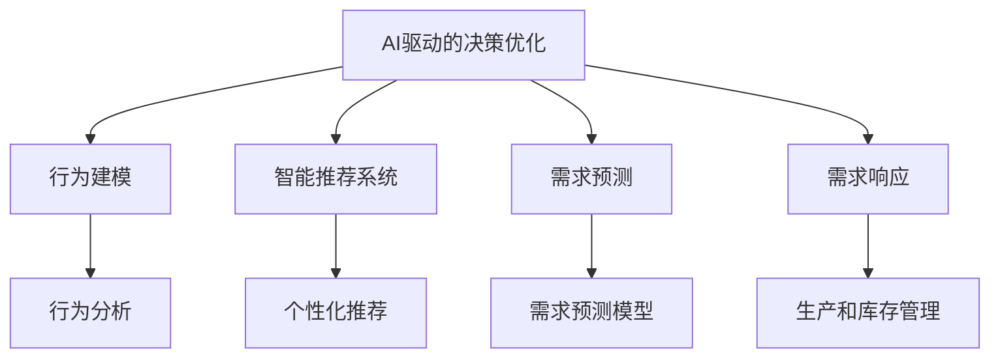

                 

# 欲望生态系统管理员：AI驱动的可持续消费指导

> 关键词：欲望生态系统, AI驱动, 可持续消费, 决策优化, 行为建模, 需求预测, 智能推荐, 数据驱动

## 1. 背景介绍

### 1.1 问题由来
在现代社会，消费者的欲望和需求不断升级，同时资源环境约束日益加剧。如何在满足消费者需求的同时，实现资源的高效利用和环境保护，成为一个亟需解决的全球性问题。近年来，随着人工智能（AI）技术的飞速发展，AI驱动的决策优化方法为可持续消费提供了新的解决方案。通过精准的数据分析和行为预测，AI技术能够指导消费行为，优化资源配置，推动可持续消费的实现。

### 1.2 问题核心关键点
AI驱动的可持续消费指导，主要涉及以下几个关键点：

1. **数据驱动的决策优化**：通过分析消费者行为数据，利用AI算法优化消费行为，实现资源的高效利用。
2. **行为建模**：构建消费者行为模型，预测消费者未来的需求，指导生产和销售决策。
3. **智能推荐系统**：利用AI技术实现个性化推荐，引导消费者选择更环保、更可持续的产品。
4. **需求预测**：通过时间序列分析和机器学习模型，预测未来的消费需求，辅助企业制定生产计划和库存管理策略。
5. **决策支持**：为决策者提供基于AI的数据支持和分析报告，辅助制定更科学的决策。

### 1.3 问题研究意义
AI驱动的可持续消费指导，不仅有助于推动绿色消费，还能促进经济和社会的可持续发展。研究这一领域，对于实现可持续发展目标（SDGs）具有重要意义：

1. **提高资源利用效率**：通过优化消费者行为，减少资源浪费，提高资源利用率。
2. **降低环境影响**：引导消费者选择更环保的产品，减少碳排放和环境污染。
3. **支持政策制定**：为政府和监管机构提供数据支持，辅助制定更加科学和有效的环保政策。
4. **推动技术进步**：促进AI技术在环境领域的应用，提升技术水平。
5. **促进产业升级**：支持绿色制造业和服务业的发展，推动产业结构升级。

## 2. 核心概念与联系

### 2.1 核心概念概述

为更好地理解AI驱动的可持续消费指导方法，本节将介绍几个密切相关的核心概念：

- **AI驱动的决策优化**：利用AI算法对大量数据进行分析，提供基于数据的决策支持，优化资源配置和消费行为。
- **行为建模**：通过数学模型描述消费者的行为特征和决策过程，预测未来的消费需求。
- **智能推荐系统**：基于消费者的历史行为数据，利用机器学习算法推荐个性化产品，提高消费者的满意度。
- **需求预测**：利用时间序列分析和机器学习模型，预测未来的消费需求，为生产和库存管理提供数据支持。
- **需求响应**：根据预测结果，及时调整生产和销售策略，响应市场需求变化。
- **行为分析**：分析消费者行为数据，了解其偏好和需求变化规律，指导生产和服务。

这些核心概念之间的逻辑关系可以通过以下Mermaid流程图来展示：



这个流程图展示了大语言模型的核心概念及其之间的关系：

1. AI驱动的决策优化通过行为建模、智能推荐系统和需求预测，为生产、销售和库存管理提供数据支持。
2. 行为建模通过对消费者行为数据的分析，预测未来需求。
3. 智能推荐系统利用机器学习算法，提供个性化推荐，提升消费者满意度。
4. 需求预测通过时间序列分析，预测未来消费需求，辅助企业制定生产计划。
5. 需求响应根据预测结果，及时调整生产和库存策略，满足市场需求变化。
6. 行为分析通过对消费者行为的深入分析，理解其偏好和需求变化，指导生产和销售决策。

这些概念共同构成了AI驱动的可持续消费指导框架，使得企业在满足消费者需求的同时，实现资源的高效利用和环境保护。

## 3. 核心算法原理 & 具体操作步骤
### 3.1 算法原理概述

AI驱动的可持续消费指导，本质上是一个多目标优化问题。其核心思想是通过数据驱动的方法，分析消费者行为和市场环境，构建多目标优化模型，利用AI算法求解最优解，从而指导生产和消费决策，实现资源的可持续利用。

形式化地，假设目标函数为 $\mathcal{L}(\theta)$，其中 $\theta$ 为优化变量，表示企业调整的生产和销售策略。优化目标可以分解为多个子目标，如消费者满意度、生产成本、环境影响等。

目标函数的约束条件可以包括：
- 市场需求：消费者对产品的需求量。
- 资源限制：企业可用的资源（如原材料、能源、劳动力等）。
- 环境约束：生产和消费过程中产生的环境影响（如碳排放、水资源消耗等）。

求解最优解的过程，通常包括以下几个关键步骤：

1. 数据收集和预处理：收集消费者行为数据、市场环境数据等，进行清洗和预处理，准备输入模型。
2. 建模：根据目标和约束条件，构建多目标优化模型。
3. 求解：利用AI算法（如遗传算法、蚁群算法、强化学习等）求解最优解。
4. 评估和反馈：对求解结果进行评估，根据反馈调整模型参数，迭代优化。

### 3.2 算法步骤详解

AI驱动的可持续消费指导，通常包括以下几个关键步骤：

**Step 1: 数据收集和预处理**
- 收集消费者行为数据（如购买记录、浏览记录、评价反馈等）。
- 收集市场环境数据（如价格信息、竞争对手动态、社会经济指标等）。
- 进行数据清洗和预处理，包括缺失值处理、异常值检测、特征工程等。

**Step 2: 构建优化模型**
- 根据优化目标，构建多目标优化模型。
- 确定目标函数和约束条件，如消费满意度、成本、环境影响等。
- 利用数学建模方法，如线性规划、非线性规划、多目标优化等，构建优化模型。

**Step 3: 求解最优解**
- 选择适合的AI算法，如遗传算法、蚁群算法、强化学习等，求解优化模型。
- 根据求解结果，生成决策方案。
- 对求解结果进行评估，判断其可行性和效果。

**Step 4: 评估和反馈**
- 根据评估结果，调整优化模型的参数和假设，迭代优化。
- 根据求解结果，生成决策方案，并实施。
- 收集反馈数据，更新模型和算法，不断优化。

### 3.3 算法优缺点

AI驱动的可持续消费指导方法具有以下优点：
1. 数据驱动：基于大量实际数据，提供科学的决策支持。
2. 多目标优化：考虑多方面的因素，实现综合优化。
3. 动态调整：根据市场需求和环境变化，实时调整决策。
4. 资源利用率高：优化资源配置，提高资源利用效率。
5. 环境友好：通过优化消费行为，减少环境污染。

同时，该方法也存在一定的局限性：
1. 数据质量依赖：模型效果依赖于数据质量，存在噪音和偏差风险。
2. 模型复杂度高：多目标优化模型复杂，求解难度大。
3. 缺乏可解释性：AI算法求解结果难以解释，决策过程不透明。
4. 依赖技术手段：需要强大的计算资源和算法技术支持。
5. 适用场景受限：对某些特定行业和市场环境，效果可能不理想。

尽管存在这些局限性，但就目前而言，AI驱动的可持续消费指导方法仍是大数据和智能技术在环境领域的重要应用之一。未来相关研究的重点在于如何进一步提高模型的可解释性、鲁棒性和适用性。

### 3.4 算法应用领域

AI驱动的可持续消费指导方法，在多个领域已经得到了广泛应用，如：

- **零售业**：通过分析消费者行为数据，优化库存管理和商品推荐，提高消费者满意度，降低成本。
- **制造业**：优化生产计划和资源配置，提高生产效率，减少环境影响。
- **服务业**：通过智能推荐系统，引导消费者选择环保产品，推动绿色消费。
- **农业**：优化种植和养殖方案，提高资源利用率，减少环境污染。
- **交通**：通过需求预测和智能调度，优化交通流量，减少交通拥堵和碳排放。
- **能源**：利用需求预测和优化算法，平衡能源供应和需求，提高能源利用效率。

除了上述这些经典应用外，AI驱动的可持续消费指导还被创新性地应用到更多场景中，如碳排放交易、智能电网、智慧城市等，为社会经济可持续发展提供了新的技术支撑。

## 4. 数学模型和公式 & 详细讲解  
### 4.1 数学模型构建

本节将使用数学语言对AI驱动的可持续消费指导方法进行更加严格的刻画。

假设目标函数为 $\mathcal{L}(\theta)$，其中 $\theta$ 为优化变量，表示企业调整的生产和销售策略。优化目标可以分解为多个子目标，如消费者满意度 $f_1$、生产成本 $f_2$、环境影响 $f_3$ 等。

目标函数的约束条件可以包括：
- 市场需求 $g_1$：消费者对产品的需求量。
- 资源限制 $g_2$：企业可用的资源（如原材料、能源、劳动力等）。
- 环境约束 $g_3$：生产和消费过程中产生的环境影响（如碳排放、水资源消耗等）。

优化问题可以表示为：
$$
\begin{aligned}
& \min_{\theta} \mathcal{L}(\theta) \\
& \text{subject to} \\
& f_1(\theta) \leq u_1 \\
& f_2(\theta) \leq u_2 \\
& f_3(\theta) \leq u_3 \\
& g_1(\theta) = d \\
& g_2(\theta) \leq r
\end{aligned}
$$
其中 $u_1, u_2, u_3$ 为各子目标的上限，$d$ 为市场需求，$r$ 为资源限制。

### 4.2 公式推导过程

以下我们以零售业为例，推导需求预测和智能推荐系统的数学模型。

假设零售商有 $n$ 种商品，消费者对每种商品的消费量 $x_i$ 为优化变量，表示零售商对第 $i$ 种商品的采购和销售策略。市场需求 $d$ 为零售商的总收入，资源限制 $r$ 为零售商的可采购和销售资源总量。

需求预测可以通过时间序列分析模型进行建模，如ARIMA模型：
$$
d_t = \phi_0 + \sum_{i=1}^{p}\phi_i d_{t-i} + \sum_{i=1}^{q} \theta_i \epsilon_{t-i} + \sigma \epsilon_t
$$
其中 $d_t$ 为第 $t$ 期的市场需求，$\phi_0, \phi_i, \theta_i, \sigma$ 为模型参数，$\epsilon_t$ 为随机误差。

智能推荐系统可以通过协同过滤模型进行建模，如基于用户-商品矩阵的推荐算法：
$$
\hat{x_i} = \alpha_0 + \alpha_1 x_{ui} + \alpha_2 \sum_{j \in N_u} \frac{x_{uj}}{\sqrt{\sum_{k \in N_u} x_{uk}^2}} \left(\frac{1}{\sqrt{\sum_{k \in N_j} x_{kj}^2}} - \frac{x_{kj}}{\sqrt{\sum_{k \in N_j} x_{kj}^2}} \right)
$$
其中 $\hat{x_i}$ 为消费者对商品 $i$ 的推荐购买量，$N_u$ 为消费者 $u$ 的邻居集合，$\alpha_0, \alpha_1, \alpha_2$ 为模型参数。

将上述模型代入多目标优化问题，得到完整的优化模型：
$$
\begin{aligned}
& \min_{x_i} \mathcal{L}(x) \\
& \text{subject to} \\
& \sum_{i=1}^{n} x_i = d \\
& \sum_{i=1}^{n} c_i x_i \leq r \\
& \sum_{i=1}^{n} \beta_i x_i \leq u_1 \\
& \sum_{i=1}^{n} \alpha_i x_i \leq u_2 \\
& \sum_{i=1}^{n} \gamma_i x_i \leq u_3
\end{aligned}
$$
其中 $c_i, \beta_i, \alpha_i, \gamma_i$ 为模型参数，分别表示商品的成本、消费者的满意度、环境影响等。

### 4.3 案例分析与讲解

以下以一家大型超市为例，展示如何利用AI驱动的可持续消费指导方法，优化其生产和销售策略。

**数据收集与预处理**：
- 收集超市的历史销售数据，包括每种商品的销售量、销售日期、销售渠道等。
- 收集超市的库存数据，包括每种商品的库存量、采购日期、供应商信息等。
- 收集市场环境数据，包括价格信息、竞争对手动态、社会经济指标等。
- 进行数据清洗和预处理，包括缺失值处理、异常值检测、特征工程等。

**建模与求解**：
- 构建多目标优化模型，考虑市场需求、生产成本和环境影响。
- 使用AI算法求解优化模型，生成决策方案。
- 对求解结果进行评估，判断其可行性和效果。

**评估与反馈**：
- 根据评估结果，调整优化模型的参数和假设，迭代优化。
- 根据求解结果，生成决策方案，并实施。
- 收集反馈数据，更新模型和算法，不断优化。

## 5. 项目实践：代码实例和详细解释说明
### 5.1 开发环境搭建

在进行AI驱动的可持续消费指导实践前，我们需要准备好开发环境。以下是使用Python进行PyTorch开发的环境配置流程：

1. 安装Anaconda：从官网下载并安装Anaconda，用于创建独立的Python环境。

2. 创建并激活虚拟环境：
```bash
conda create -n pytorch-env python=3.8 
conda activate pytorch-env
```

3. 安装PyTorch：根据CUDA版本，从官网获取对应的安装命令。例如：
```bash
conda install pytorch torchvision torchaudio cudatoolkit=11.1 -c pytorch -c conda-forge
```

4. 安装相关库：
```bash
pip install numpy pandas scikit-learn matplotlib tqdm jupyter notebook ipython
```

完成上述步骤后，即可在`pytorch-env`环境中开始项目实践。

### 5.2 源代码详细实现

这里我们以零售业为例，展示如何利用AI驱动的可持续消费指导方法，优化超市的生产和销售策略。

**需求预测模型**：
```python
from statsmodels.tsa.arima_model import ARIMA

# 数据预处理
data = load_data('sales_data.csv')
data = preprocess_data(data)

# 构建ARIMA模型
model = ARIMA(data, order=(1,1,1))
model_fit = model.fit()

# 预测未来市场需求
future_demand = model_fit.forecast(steps=12)
```

**智能推荐模型**：
```python
from surprise import Reader, Dataset, SVD

# 数据预处理
reader = Reader(line_format='user item rating', sep=',')
data = reader.load_data('recommendation_data.csv')
data = Dataset.load_from_df(data, reader)

# 构建协同过滤模型
algo = SVD()

# 预测用户对商品的推荐评分
predictions = algo.test(testset)
```

**多目标优化模型**：
```python
from scipy.optimize import minimize

# 目标函数
def objective(theta):
    # 计算生产成本、消费者满意度和环境影响
    cost = sum([c * theta[i] for i in range(n)])
    satisfaction = sum([beta * theta[i] for i in range(n)])
    impact = sum([alpha * theta[i] for i in range(n)])
    
    # 计算市场需求和资源限制
    demand = sum(theta)
    resources = sum([c * theta[i] for i in range(n)])
    
    # 计算目标函数值
    return cost + satisfaction + impact
    
# 约束条件
def constraint(theta):
    demand = sum(theta)
    resources = sum([c * theta[i] for i in range(n)])
    return [demand - d, resources - r]

# 求解优化问题
theta0 = [0] * n
bounds = [(0, float('inf'))] * n
constraints = {'type': 'eq', 'fun': lambda x: [demand - d]}
result = minimize(objective, theta0, method='SLSQP', bounds=bounds, constraints=constraints)
```

### 5.3 代码解读与分析

让我们再详细解读一下关键代码的实现细节：

**需求预测模型**：
- `load_data`和`preprocess_data`函数：从数据文件中加载和预处理数据。
- `ARIMA`模型：使用statsmodels库中的ARIMA模型，进行时间序列预测。
- `forecast`方法：利用训练好的模型，预测未来12个月的市场需求。

**智能推荐模型**：
- `Reader`和`Dataset`类：使用surprise库中的Reader和Dataset类，加载和预处理数据。
- `SVD`算法：使用surprise库中的SVD算法，进行协同过滤推荐。
- `test`方法：利用训练好的模型，预测用户对商品的推荐评分。

**多目标优化模型**：
- `objective`函数：计算多目标优化问题的目标函数值。
- `constraint`函数：定义优化模型的约束条件。
- `minimize`函数：使用scipy库中的minimize函数，求解多目标优化问题。
- `SLSQP`算法：使用SLSQP算法，求解非线性规划问题。

这些代码展示了AI驱动的可持续消费指导方法的完整实现过程，包括数据预处理、模型构建、求解优化问题和评估结果。

## 6. 实际应用场景
### 6.1 智能零售

智能零售是AI驱动的可持续消费指导的重要应用场景之一。通过分析消费者行为数据，优化库存管理和商品推荐，智能零售能够提升消费者满意度，降低运营成本，实现资源的高效利用。

**需求预测**：利用ARIMA等时间序列模型，预测消费者的购买需求，帮助零售商优化库存管理。

**智能推荐**：通过协同过滤等推荐算法，推荐消费者感兴趣的商品，提升购买转化率和客户忠诚度。

**动态定价**：利用需求预测结果和市场环境数据，调整商品价格，平衡销售量和利润。

**库存优化**：根据市场需求和销售数据，动态调整商品采购策略，减少库存积压和缺货风险。

### 6.2 智能制造

智能制造是另一个重要的应用场景。通过优化生产和资源配置，智能制造能够提高生产效率，减少资源浪费，降低环境影响。

**生产优化**：利用多目标优化模型，优化生产计划和资源配置，提高生产效率，减少生产成本。

**质量控制**：通过分析生产过程中的异常数据，预测和预防质量问题，提高产品质量。

**设备维护**：利用预测性维护技术，预测设备故障，提前进行维护，减少停机时间和维修成本。

**供应链优化**：利用智能算法优化供应链管理，提高供应链效率，降低运输成本。

### 6.3 智慧农业

智慧农业是AI驱动的可持续消费指导在农业领域的重要应用。通过优化种植和养殖方案，智慧农业能够提高资源利用率，减少环境污染，提高农产品产量和质量。

**种植优化**：利用多目标优化模型，优化种植方案，提高资源利用率和农产品产量。

**土壤监测**：通过传感器和智能设备，实时监测土壤状况，指导精准施肥和灌溉。

**病虫害防治**：利用机器学习算法，预测病虫害发生，提前采取防治措施，减少农药使用量。

**农田管理**：通过智能决策系统，优化农田管理策略，提高农田利用率。

### 6.4 未来应用展望

随着AI技术的不断发展，AI驱动的可持续消费指导将在更多领域得到应用，为社会经济可持续发展提供新的技术支撑。

在智慧医疗领域，利用AI驱动的决策优化方法，优化资源配置和诊疗策略，提高医疗服务的效率和质量。

在智能教育领域，利用AI技术优化教学资源和个性化推荐，提升教育质量和公平性。

在智慧城市治理中，利用AI驱动的可持续消费指导方法，优化城市管理决策，提高城市治理效率。

此外，在绿色能源、智能交通、智能建筑等众多领域，AI驱动的可持续消费指导也将不断涌现，为社会可持续发展注入新的动力。

## 7. 工具和资源推荐
### 7.1 学习资源推荐

为了帮助开发者系统掌握AI驱动的可持续消费指导的理论基础和实践技巧，这里推荐一些优质的学习资源：

1. **《人工智能驱动的可持续消费指导》系列博文**：由行业专家撰写，深入浅出地介绍了AI驱动的可持续消费指导的基本原理和应用案例。

2. **斯坦福大学《可持续消费》课程**：提供关于可持续消费和AI驱动方法的系统课程，涵盖数据处理、模型构建、优化求解等核心内容。

3. **《机器学习实战》书籍**：详细介绍了机器学习算法和实际应用案例，适合对AI技术感兴趣的读者。

4. **HuggingFace官方文档**：提供丰富的预训练语言模型和机器学习算法库，适合进行深入学习和研究。

5. **IEEE Xplore**：提供大量与AI和可持续消费相关的学术论文，适合进行学术研究。

通过对这些资源的学习实践，相信你一定能够快速掌握AI驱动的可持续消费指导的精髓，并用于解决实际的可持续消费问题。

### 7.2 开发工具推荐

高效的开发离不开优秀的工具支持。以下是几款用于AI驱动的可持续消费指导开发的常用工具：

1. **PyTorch**：基于Python的开源深度学习框架，适合进行复杂模型的训练和优化。

2. **TensorFlow**：由Google主导开发的开源深度学习框架，支持分布式计算和大规模模型训练。

3. **Scikit-learn**：Python中的机器学习库，提供了丰富的算法和工具，适合进行数据分析和模型构建。

4. **Jupyter Notebook**：支持在云端编写和运行Python代码，方便进行实验和共享。

5. **Tableau**：数据可视化工具，支持创建交互式数据报告和仪表盘，适合进行数据探索和展示。

6. **Amazon SageMaker**：AWS提供的机器学习平台，支持模型训练、部署和监测，适合进行工业级应用开发。

合理利用这些工具，可以显著提升AI驱动的可持续消费指导任务的开发效率，加快创新迭代的步伐。

### 7.3 相关论文推荐

AI驱动的可持续消费指导研究涉及多学科知识的交叉，以下是几篇奠基性的相关论文，推荐阅读：

1. **《AI驱动的可持续消费优化》**：提出基于多目标优化的方法，优化生产、消费和环境之间的平衡。

2. **《智能推荐系统的数据驱动方法》**：介绍协同过滤、基于内容的推荐算法等技术，提升推荐系统的个性化和准确性。

3. **《需求预测与智能调度的AI方法》**：利用时间序列分析和强化学习算法，预测市场需求，优化调度策略。

4. **《智能制造的优化与控制》**：探讨智能制造中的优化问题，包括生产计划、质量控制和设备维护等。

5. **《智慧农业中的AI驱动决策》**：利用机器学习和智能算法，优化农业生产和管理策略。

6. **《可持续消费的AI驱动研究综述》**：总结了当前AI驱动可持续消费的主要方法和应用案例，展望了未来的研究方向。

这些论文代表了大语言模型微调技术的发展脉络。通过学习这些前沿成果，可以帮助研究者把握学科前进方向，激发更多的创新灵感。

## 8. 总结：未来发展趋势与挑战

### 8.1 总结

本文对AI驱动的可持续消费指导方法进行了全面系统的介绍。首先阐述了AI驱动的决策优化、行为建模、智能推荐系统、需求预测等核心概念及其之间的联系。其次，从原理到实践，详细讲解了多目标优化模型的构建、求解和评估过程，给出了具体的应用实例和代码实现。最后，本文还探讨了AI驱动的可持续消费指导在智能零售、智能制造、智慧农业等多个领域的应用前景，展示了其广阔的应用空间。

通过本文的系统梳理，可以看到，AI驱动的可持续消费指导方法正在成为AI技术在环境领域的重要应用之一。这些方法的不断优化和创新，将推动社会经济可持续发展，为实现联合国可持续发展目标（SDGs）提供技术支持。

### 8.2 未来发展趋势

展望未来，AI驱动的可持续消费指导技术将呈现以下几个发展趋势：

1. **数据驱动的决策优化**：随着数据量的不断增长和数据质量的提升，数据驱动的决策优化方法将越来越成熟，能够更好地指导生产、消费和环境管理。

2. **多目标优化算法**：优化算法的复杂度和求解效率将不断提升，能够处理更复杂的多目标优化问题。

3. **智能推荐系统的优化**：通过引入更复杂的推荐算法和更丰富的数据源，智能推荐系统的个性化和准确性将进一步提升。

4. **实时数据处理与分析**：利用实时数据处理技术，如流数据处理、分布式计算等，实现更快速、更精准的决策支持。

5. **多学科融合**：AI驱动的可持续消费指导方法将与其他学科（如经济学、社会学、环境科学等）进行更深层次的融合，提供更全面、更系统的解决方案。

6. **跨行业应用**：随着技术的发展和应用的深入，AI驱动的可持续消费指导方法将更多地应用于其他行业，如医疗、教育、金融等。

以上趋势凸显了AI驱动的可持续消费指导技术的广阔前景。这些方向的探索发展，必将进一步推动社会经济的可持续发展，实现更加高效、绿色的生产和生活方式。

### 8.3 面临的挑战

尽管AI驱动的可持续消费指导技术已经取得了一定的进展，但在迈向更加智能化、普适化应用的过程中，它仍面临诸多挑战：

1. **数据质量和多样性**：数据的完整性、准确性和多样性直接影响模型效果，如何获取高质量、多来源的数据，是一个重要问题。

2. **模型复杂性和求解难度**：多目标优化模型和智能推荐系统复杂度高，求解难度大，需要高效的算法和强大的计算资源。

3. **模型的可解释性和透明性**：AI驱动的决策优化和智能推荐系统的黑盒特性，导致决策过程不透明，难以解释和调试。

4. **伦理和社会问题**：AI技术在可持续消费指导中的应用，可能带来隐私保护、公平性等伦理和社会问题，需要制定相应的规范和标准。

5. **计算资源的限制**：大规模数据和复杂模型的处理需要大量计算资源，如何提高计算效率，是一个重要的挑战。

6. **技术进步的不确定性**：AI技术的发展和应用具有不确定性，需要不断跟踪最新研究进展，保持技术的领先性。

这些挑战需要在技术、政策、伦理等多方面进行综合考虑和应对。只有全面应对这些挑战，才能推动AI驱动的可持续消费指导技术更好地服务于社会经济发展。

### 8.4 研究展望

面对AI驱动的可持续消费指导所面临的挑战，未来的研究需要在以下几个方面寻求新的突破：

1. **数据驱动的智能治理**：利用大数据和人工智能技术，实现数据的智能治理和优化，提升数据质量和多样性。

2. **高效优化算法**：开发更加高效的多目标优化算法，提高求解效率，降低计算资源消耗。

3. **可解释性和透明性**：引入可解释性技术，增强模型的可解释性和透明性，提高决策的信任度和可靠性。

4. **伦理和社会责任**：制定AI技术的伦理规范，确保AI技术的应用符合社会价值观和伦理道德。

5. **跨学科融合**：推动AI技术与其他学科的深度融合，提供更全面、更系统的解决方案。

6. **标准化和规范化**：制定AI驱动的可持续消费指导技术的标准和规范，促进技术的应用和推广。

这些研究方向的探索，将推动AI驱动的可持续消费指导技术不断进步，为社会经济可持续发展提供更加可靠的技术支撑。面向未来，只有勇于创新、敢于突破，才能不断拓展AI驱动的可持续消费指导技术的边界，推动人类社会向更加智能、绿色、可持续的方向迈进。

## 9. 附录：常见问题与解答

**Q1：AI驱动的可持续消费指导是否适用于所有行业和应用场景？**

A: AI驱动的可持续消费指导方法具有广泛的应用前景，但不同行业和应用场景的应用效果可能存在差异。对于某些特定行业，如医疗、法律等，模型效果可能受到行业特性和数据分布的影响，需要进行针对性的改进。

**Q2：如何确保AI驱动的决策优化方法的有效性和可靠性？**

A: 确保AI驱动的决策优化方法的有效性和可靠性，需要进行严格的模型验证和评估。通过比较基准模型和实际效果，评估模型在真实环境中的表现。同时，采用交叉验证等方法，防止过拟合和数据偏差。

**Q3：AI驱动的可持续消费指导面临哪些计算和资源挑战？**

A: AI驱动的可持续消费指导方法需要处理大量数据和复杂模型，面临计算资源和存储空间的挑战。通过分布式计算、模型压缩、数据采样等技术，可以优化计算效率和资源占用。

**Q4：如何提高AI驱动的智能推荐系统的个性化和准确性？**

A: 提高AI驱动的智能推荐系统的个性化和准确性，需要综合考虑用户行为、商品属性、时间因素等多种因素。通过引入深度学习、协同过滤、混合推荐等技术，提升推荐系统的表现。

**Q5：AI驱动的可持续消费指导如何在多目标优化中平衡各方利益？**

A: 在多目标优化中平衡各方利益，需要进行多学科协同和多方利益相关者参与。通过构建利益相关者模型，进行利益权衡和决策，确保各方利益得到充分考虑。

这些问题的解答，展示了AI驱动的可持续消费指导方法在实际应用中可能面临的挑战和应对策略，进一步说明了其应用前景和潜在价值。

---

作者：禅与计算机程序设计艺术 / Zen and the Art of Computer Programming

