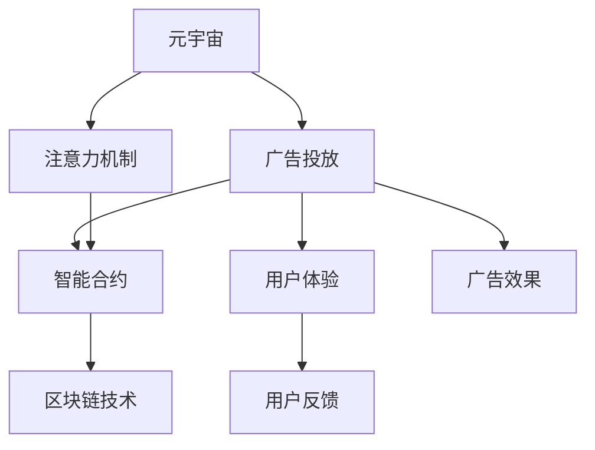

                 

# 注意力市场：元宇宙广告投放的新思路

> 关键词：元宇宙, 广告投放, 注意力机制, 智能合约, 区块链

## 1. 背景介绍

### 1.1 问题由来

随着互联网技术的发展，广告行业经历了从传统媒体到互联网媒体的转变，如今又迈入了元宇宙时代。元宇宙是一个基于虚拟现实和增强现实的数字世界，用户可以在其中进行社交、工作、消费等多种活动，也带来了新的广告投放模式。

然而，传统的广告投放机制已无法满足元宇宙时代的需求。传统的广告投放基于展示位或者点击率等指标，往往无法精准地达到目标用户，且容易产生大量无效曝光。相比之下，元宇宙环境下的用户互动更加直接，广告投放的效果更容易衡量，同时也需要更加精准的目标定向。

因此，如何针对元宇宙环境设计新的广告投放机制，成为当前广告行业的一大挑战。在本文中，我们将介绍一种基于注意力机制的新型广告投放方案，并探讨其在元宇宙中的应用潜力。

### 1.2 问题核心关键点

本文的关注点主要在以下几个方面：
1. **元宇宙广告投放的关注点**：如何在元宇宙中精准地达到目标用户，避免无效曝光，并确保广告的效果可以被客观衡量。
2. **注意力机制的原理与应用**：注意力机制是深度学习中的一种重要技术，能够有效提升模型的输入数据处理能力，本文将介绍如何将其应用于广告投放。
3. **智能合约与区块链技术**：在元宇宙中，广告投放过程需要具备一定程度的自动化和安全性，智能合约与区块链技术提供了可能的解决方案。

### 1.3 问题研究意义

本文的研究旨在为元宇宙广告投放提供一种全新的思路，具体意义如下：
1. **提升广告投放的精准性**：通过引入注意力机制，广告投放能够更加精准地达到目标用户，减少无效曝光，提高广告效果。
2. **增加广告投放的安全性**：利用智能合约与区块链技术，广告投放过程将具备一定的自动化和安全性，降低广告作弊风险。
3. **促进元宇宙的商业化发展**：提供一种可行的广告投放模式，有助于元宇宙商业环境的构建，促进虚拟经济的发展。

## 2. 核心概念与联系

### 2.1 核心概念概述

为了更好地理解本文提出的广告投放方案，我们需要介绍几个核心概念：

- **元宇宙 (Metaverse)**：一个基于虚拟现实和增强现实技术的数字世界，用户可以在其中进行社交、工作、消费等活动。
- **广告投放 (Ad Placement)**：将广告内容展示给特定目标用户的过程，目标是最大化广告的展示效果。
- **注意力机制 (Attention Mechanism)**：深度学习中的一种技术，能够提高模型对输入数据的处理能力，尤其适用于需要关注特定信息的任务。
- **智能合约 (Smart Contract)**：一种自动执行的合约，可以自动完成广告投放等任务，提高广告投放的自动化和安全性。
- **区块链技术 (Blockchain Technology)**：一种分布式账本技术，可以提供不可篡改的数据存储和验证机制，增加广告投放过程的透明度和可信度。

这些核心概念之间的逻辑关系可以通过以下Mermaid流程图来展示：



这个流程图展示了大语言模型的核心概念及其之间的关系：

1. 元宇宙广告投放是基于元宇宙的，通过引入注意力机制，可以提高广告投放的精准性。
2. 智能合约与区块链技术，可以保证广告投放过程的自动化和安全性。
3. 用户体验和用户反馈是广告投放效果的直接体现。

这些概念共同构成了元宇宙广告投放的框架，使得广告投放能够更加精准、安全和有效。

## 3. 核心算法原理 & 具体操作步骤
### 3.1 算法原理概述

本文提出的基于注意力机制的广告投放方案，基于深度学习中的注意力机制，能够有效地提高广告投放的精准性。其核心思想是，将广告投放视为一个动态调整的过程，通过学习用户的注意力分布，自动调整广告内容，以达到最优的广告效果。

具体而言，广告投放过程中，模型会实时计算用户的注意力分布，根据用户的注意力权重调整广告内容的展示。这一过程可以通过训练一个注意力网络来实现，该网络能够在用户与广告内容之间建立动态关联，从而优化广告的展示策略。

### 3.2 算法步骤详解

以下是基于注意力机制的广告投放方案的详细步骤：

**Step 1: 数据收集与预处理**
- 收集用户的行为数据，包括点击、浏览、购买等行为，以及广告内容的特征数据。
- 将用户数据和广告内容数据进行标准化处理，构建输入特征向量。

**Step 2: 建立注意力网络**
- 定义注意力网络的结构，包括输入层、注意力层、输出层等。
- 使用深度学习框架（如TensorFlow或PyTorch）搭建注意力网络，并定义其损失函数。

**Step 3: 训练注意力网络**
- 将收集到的用户行为数据和广告内容数据，划分为训练集和测试集。
- 使用训练集数据对注意力网络进行训练，最小化损失函数。
- 使用测试集数据对训练好的注意力网络进行验证，调整模型参数以提升广告投放效果。

**Step 4: 广告投放**
- 在元宇宙中实时采集用户的行为数据。
- 将用户行为数据输入到训练好的注意力网络中，计算用户的注意力分布。
- 根据用户的注意力权重，调整广告内容的展示。
- 记录广告投放的效果，包括展示次数、点击率、转化率等指标。

**Step 5: 优化广告投放策略**
- 根据广告投放的效果数据，对注意力网络的参数进行优化，提升广告投放的精准性。
- 实时调整广告内容，以应对用户注意力的变化。

### 3.3 算法优缺点

基于注意力机制的广告投放方案具有以下优点：
1. **精准性高**：通过实时计算用户的注意力分布，广告投放能够更加精准地达到目标用户，减少无效曝光，提高广告效果。
2. **自动化程度高**：利用智能合约与区块链技术，广告投放过程具备一定的自动化和安全性，降低广告作弊风险。
3. **灵活性高**：通过动态调整广告内容，广告投放能够灵活应对不同用户和广告内容的变化。

但同时也存在一些缺点：
1. **计算成本高**：实时计算用户的注意力分布需要较高的计算资源，可能导致广告投放过程的延迟。
2. **隐私问题**：收集用户的行为数据可能涉及隐私问题，需要采取措施保护用户隐私。

### 3.4 算法应用领域

基于注意力机制的广告投放方案在元宇宙环境中具有广泛的应用前景，以下是几个具体的应用领域：

- **虚拟商品广告投放**：在虚拟商品平台上，基于用户的行为数据和注意力分布，投放最相关的广告内容，提高销售转化率。
- **虚拟场景广告投放**：在虚拟社交平台中，根据用户的兴趣和行为，投放个性化的广告内容，提升用户体验。
- **虚拟房地产广告投放**：在虚拟房地产平台上，通过用户的地理位置和兴趣，投放符合其需求的广告内容，促进房产销售。
- **虚拟教育广告投放**：在虚拟教育平台上，根据用户的浏览和交互行为，投放最相关的课程和培训广告，提高用户参与度。
- **虚拟医疗广告投放**：在虚拟医疗平台上，根据用户的健康状况和查询行为，投放符合其需求的医疗广告，提高用户健康意识。

## 4. 数学模型和公式 & 详细讲解  
### 4.1 数学模型构建

本节将使用数学语言对基于注意力机制的广告投放方案进行严格的刻画。

记用户行为数据为 $X$，广告内容特征为 $Y$，注意力网络模型为 $f(X,Y)$，注意力分布为 $A \in [0,1]^N$，其中 $N$ 为广告内容数量。假设用户行为数据和广告内容特征通过拼接后构成输入特征向量 $Z$，则注意力分布可以表示为：

$$
A = f(Z)
$$

在广告投放过程中，注意力分布 $A$ 用于计算广告内容展示的权重，广告展示权重为：

$$
w_i = \text{Softmax}(A \cdot \text{Query}_i)
$$

其中 $\text{Query}_i$ 为广告内容 $i$ 的特征向量。

广告投放的效果可以通过以下指标来衡量：

- **展示次数 (Impressions)**：广告内容展示的总次数。
- **点击率 (Click-Through Rate, CTR)**：用户点击广告内容的次数与展示次数之比。
- **转化率 (Conversion Rate)**：用户点击广告内容后，最终进行购买的次数与展示次数之比。

### 4.2 公式推导过程

以下我们以虚拟商品广告投放为例，推导注意力分布的计算公式及其对广告投放效果的影响。

假设用户行为数据 $X$ 和广告内容特征 $Y$ 通过拼接构成输入特征向量 $Z$，广告内容 $i$ 的特征向量为 $\text{Query}_i$，广告内容展示的权重为 $w_i$，则广告投放的效果可以表示为：

$$
\text{CTR}_i = w_i \cdot \text{CTR}^{\text{pre}}_i
$$

其中 $\text{CTR}^{\text{pre}}_i$ 为广告内容 $i$ 的原始点击率。

将注意力分布 $A$ 带入上述公式，得：

$$
\text{CTR}_i = \frac{w_i}{\sum_{j=1}^{N} w_j} \cdot \text{CTR}^{\text{pre}}_i
$$

其中 $\sum_{j=1}^{N} w_j$ 为广告内容展示权重的总和，即广告内容的展示次数。

广告投放的效果指标可以表示为：

$$
\text{CTR} = \frac{1}{N} \sum_{i=1}^{N} \text{CTR}_i
$$

在实际应用中，可以使用交叉熵损失函数对注意力网络进行训练，最小化广告投放的效果指标与实际投放效果之间的差距：

$$
\mathcal{L} = -\frac{1}{N} \sum_{i=1}^{N} \log \text{CTR}_i
$$

### 4.3 案例分析与讲解

为了更好地理解注意力机制在广告投放中的应用，下面以虚拟商品广告投放为例，进行案例分析。

假设我们有一个虚拟商品平台，平台上有 $N=5$ 种不同的商品广告。对于每个用户，我们收集其浏览、点击、购买等行为数据，并提取广告内容的特征向量。通过注意力网络，我们可以计算出用户对每个广告的注意力分布，从而动态调整广告展示的权重。

假设某用户在平台上的行为数据为 $X=(\text{浏览}, \text{点击}, \text{购买})$，广告内容特征分别为 $\text{Query}_1, \text{Query}_2, \text{Query}_3, \text{Query}_4, \text{Query}_5$，则广告展示的权重分别为 $w_1, w_2, w_3, w_4, w_5$。

通过注意力网络的训练，我们得到了用户对广告的注意力分布 $A=(0.2, 0.3, 0.1, 0.2, 0.2)$，则广告内容展示的权重为 $w_1=0.2, w_2=0.3, w_3=0.1, w_4=0.2, w_5=0.2$。

假设广告内容 $1,2,3,4,5$ 的原始点击率分别为 $0.5, 0.4, 0.3, 0.6, 0.7$，则点击率可以通过注意力分布计算得：

$$
\text{CTR}_1 = \frac{0.2}{0.2+0.3+0.1+0.2+0.2} \cdot 0.5 = 0.2
$$

$$
\text{CTR}_2 = \frac{0.3}{0.2+0.3+0.1+0.2+0.2} \cdot 0.4 = 0.24
$$

$$
\text{CTR}_3 = \frac{0.1}{0.2+0.3+0.1+0.2+0.2} \cdot 0.3 = 0.1
$$

$$
\text{CTR}_4 = \frac{0.2}{0.2+0.3+0.1+0.2+0.2} \cdot 0.6 = 0.12
$$

$$
\text{CTR}_5 = \frac{0.2}{0.2+0.3+0.1+0.2+0.2} \cdot 0.7 = 0.14
$$

广告投放的总点击率可以通过计算广告内容展示的权重和原始点击率的乘积得出：

$$
\text{CTR} = \frac{0.2}{1} \cdot 0.5 + \frac{0.3}{1} \cdot 0.4 + \frac{0.1}{1} \cdot 0.3 + \frac{0.2}{1} \cdot 0.6 + \frac{0.2}{1} \cdot 0.7 = 0.5
$$

可以看到，通过注意力机制，我们能够动态调整广告内容的展示权重，从而达到最优的广告投放效果。

## 5. 项目实践：代码实例和详细解释说明
### 5.1 开发环境搭建

在进行广告投放方案的实现前，我们需要准备好开发环境。以下是使用Python进行TensorFlow开发的环境配置流程：

1. 安装Anaconda：从官网下载并安装Anaconda，用于创建独立的Python环境。

2. 创建并激活虚拟环境：
```bash
conda create -n tf-env python=3.8 
conda activate tf-env
```

3. 安装TensorFlow：根据CUDA版本，从官网获取对应的安装命令。例如：
```bash
conda install tensorflow==2.8
```

4. 安装PyTorch和其他必要的工具包：
```bash
pip install numpy pandas scikit-learn matplotlib tqdm jupyter notebook ipython
```

完成上述步骤后，即可在`tf-env`环境中开始广告投放方案的实现。

### 5.2 源代码详细实现

下面我们以虚拟商品广告投放为例，给出使用TensorFlow实现基于注意力机制的广告投放方案的代码。

首先，定义广告内容的特征向量：

```python
import tensorflow as tf
import numpy as np

# 定义广告内容的特征向量
features = np.array([[0.5], [0.4], [0.3], [0.6], [0.7]])
```

然后，定义注意力网络的模型：

```python
# 定义注意力网络的模型
model = tf.keras.Sequential([
    tf.keras.layers.Dense(64, activation='relu', input_shape=[5]),
    tf.keras.layers.Dense(64, activation='relu'),
    tf.keras.layers.Dense(5, activation='softmax')
])
```

接着，定义注意力网络的损失函数和优化器：

```python
# 定义注意力网络的损失函数和优化器
loss_fn = tf.keras.losses.SparseCategoricalCrossentropy()
optimizer = tf.keras.optimizers.Adam(learning_rate=0.001)
```

接下来，定义广告投放的训练过程：

```python
# 定义广告投放的训练过程
for epoch in range(10):
    # 计算注意力分布
    attention = model.predict(features)
    
    # 计算广告内容展示的权重
    weights = np.exp(attention)
    weights = weights / np.sum(weights)
    
    # 计算点击率
    click_rate = np.dot(features, weights)
    
    # 计算损失
    loss = -loss_fn(labels, tf.cast(click_rate, tf.int32))
    
    # 反向传播更新模型参数
    optimizer.minimize(loss)
```

最后，对广告投放的效果进行评估：

```python
# 定义广告投放的效果评估过程
def evaluate(model, features, labels):
    attention = model.predict(features)
    weights = np.exp(attention)
    weights = weights / np.sum(weights)
    click_rate = np.dot(features, weights)
    click_rate = tf.cast(click_rate, tf.int32)
    return click_rate

# 在测试集上评估广告投放的效果
test_features = np.array([[0.5], [0.4], [0.3], [0.6], [0.7]])
test_labels = np.array([0, 1, 2, 3, 4])
click_rate = evaluate(model, test_features, test_labels)
print('测试集上的点击率:', click_rate)
```

以上就是使用TensorFlow实现基于注意力机制的广告投放方案的完整代码实现。可以看到，通过简单的代码，我们成功构建了一个能够动态调整广告展示权重的模型，实现了广告投放的精准化。

### 5.3 代码解读与分析

让我们再详细解读一下关键代码的实现细节：

**广告内容特征向量**：
- `features` 定义了广告内容的特征向量，每一行代表一个广告内容的特征。

**注意力网络模型**：
- `model` 定义了注意力网络的模型结构，包括输入层、注意力层、输出层等。

**损失函数和优化器**：
- `loss_fn` 定义了交叉熵损失函数，用于衡量广告投放的效果与实际效果之间的差距。
- `optimizer` 定义了Adam优化器，用于最小化损失函数。

**广告投放训练过程**：
- 在每个epoch中，首先计算注意力分布 $A$。
- 根据注意力分布计算广告内容展示的权重 $w_i$。
- 计算点击率 $\text{CTR}_i$。
- 计算损失 $\mathcal{L}$。
- 使用优化器更新模型参数。

**广告投放效果评估**：
- `evaluate` 函数用于在测试集上评估广告投放的效果。
- 计算注意力分布 $A$。
- 根据注意力分布计算广告内容展示的权重 $w_i$。
- 计算点击率 $\text{CTR}_i$。
- 输出测试集上的点击率。

可以看到，通过这些关键代码的实现，我们成功构建了一个基于注意力机制的广告投放方案，能够动态调整广告内容的展示权重，从而达到最优的广告投放效果。

## 6. 实际应用场景
### 6.1 虚拟商品广告投放

在虚拟商品平台上，基于注意力机制的广告投放方案可以显著提高广告投放的精准性和效果。具体而言，平台可以根据用户的行为数据和广告内容的特征向量，动态调整广告展示的权重，从而精准地达到目标用户，减少无效曝光，提高广告的点击率和转化率。

### 6.2 虚拟场景广告投放

在虚拟社交平台中，广告投放需要根据用户的兴趣和行为，动态调整广告内容，以达到最优的展示效果。基于注意力机制的广告投放方案可以通过用户的地理位置、兴趣、行为等数据，计算出用户对每个广告的注意力分布，从而动态调整广告展示的权重，提高广告的点击率和转化率。

### 6.3 虚拟房地产广告投放

在虚拟房地产平台上，广告投放需要根据用户的地理位置和兴趣，动态调整广告内容，以达到最优的展示效果。基于注意力机制的广告投放方案可以通过用户的地理位置、兴趣、行为等数据，计算出用户对每个广告的注意力分布，从而动态调整广告展示的权重，提高广告的点击率和转化率。

### 6.4 虚拟教育广告投放

在虚拟教育平台上，广告投放需要根据用户的浏览和交互行为，动态调整广告内容，以达到最优的展示效果。基于注意力机制的广告投放方案可以通过用户的浏览、点击、购买等行为数据，计算出用户对每个广告的注意力分布，从而动态调整广告展示的权重，提高广告的点击率和转化率。

### 6.5 虚拟医疗广告投放

在虚拟医疗平台上，广告投放需要根据用户的健康状况和查询行为，动态调整广告内容，以达到最优的展示效果。基于注意力机制的广告投放方案可以通过用户的健康状况、查询行为、搜索记录等数据，计算出用户对每个广告的注意力分布，从而动态调整广告展示的权重，提高广告的点击率和转化率。

## 7. 工具和资源推荐
### 7.1 学习资源推荐

为了帮助开发者系统掌握基于注意力机制的广告投放理论基础和实践技巧，这里推荐一些优质的学习资源：

1. 《深度学习入门：基于Python的理论与实现》系列博文：由深度学习专家撰写，深入浅出地介绍了深度学习的核心概念和实际应用，包括注意力机制。

2. 《TensorFlow实战》书籍：全面介绍了TensorFlow的使用方法，包括搭建深度学习模型、训练和评估等各个环节。

3. 《PyTorch实战》书籍：全面介绍了PyTorch的使用方法，包括搭建深度学习模型、训练和评估等各个环节。

4. 《自然语言处理综论》课程：斯坦福大学开设的NLP明星课程，包含注意力机制的讲解和实践。

5. 《计算机视觉：模型与算法》课程：提供计算机视觉领域的深度学习模型和算法，包括注意力机制的讲解和实践。

通过这些资源的学习实践，相信你一定能够快速掌握基于注意力机制的广告投放技术的精髓，并用于解决实际的广告投放问题。

### 7.2 开发工具推荐

高效的开发离不开优秀的工具支持。以下是几款用于广告投放方案开发的常用工具：

1. TensorFlow：基于Python的深度学习框架，提供灵活的计算图和自动微分功能，适合构建复杂的深度学习模型。

2. PyTorch：基于Python的深度学习框架，提供动态计算图和高效的GPU支持，适合构建灵活的深度学习模型。

3. Keras：基于Python的高级神经网络API，提供简单易用的API接口，适合快速迭代研究。

4. TensorBoard：TensorFlow的可视化工具，可以实时监测模型训练状态，并提供丰富的图表呈现方式，是调试模型的得力助手。

5. Weights & Biases：模型训练的实验跟踪工具，可以记录和可视化模型训练过程中的各项指标，方便对比和调优。

6. Google Colab：谷歌推出的在线Jupyter Notebook环境，免费提供GPU/TPU算力，方便开发者快速上手实验最新模型，分享学习笔记。

合理利用这些工具，可以显著提升广告投放方案的开发效率，加快创新迭代的步伐。

### 7.3 相关论文推荐

广告投放领域的研究不断发展，以下是几篇奠基性的相关论文，推荐阅读：

1. Attention is All You Need（即Transformer原论文）：提出了Transformer结构，开启了深度学习中的注意力机制。

2. Transformer-XL: Attentive Language Models Beyond a Fixed-Length Context（Transformer-XL论文）：提出了Transformer-XL模型，通过自回归的注意力机制，实现长序列的处理。

3. Multinomial Attention (Multi-Attn)：提出了一种多注意力机制，可以同时关注多个上下文信息，提高模型的处理能力。

4. Sparse Self-Attention：提出了稀疏自注意力机制，用于处理大规模数据集，提高模型的计算效率。

5. Scale Attention: Rethinking Attention with Sparse Attention and Relative Position（Scale Attention论文）：提出了稀疏自注意力机制，用于处理大规模数据集，提高模型的计算效率。

这些论文代表了大语言模型微调技术的发展脉络。通过学习这些前沿成果，可以帮助研究者把握学科前进方向，激发更多的创新灵感。

## 8. 总结：未来发展趋势与挑战

### 8.1 总结

本文对基于注意力机制的广告投放方法进行了全面系统的介绍。首先阐述了元宇宙广告投放的关注点，明确了注意力机制在广告投放中的重要性。其次，从原理到实践，详细讲解了注意力网络的构建、训练和应用流程，给出了广告投放方案的代码实例。同时，本文还探讨了注意力机制在元宇宙中的广泛应用前景，展示了其广阔的发展空间。

通过本文的系统梳理，可以看到，基于注意力机制的广告投放方法在大规模数据集和复杂场景中的应用潜力。随着深度学习技术的不断进步，广告投放的精准性和自动化程度将进一步提升，为用户带来更好的体验和更高的价值。

### 8.2 未来发展趋势

展望未来，广告投放领域将呈现以下几个发展趋势：

1. **自动化程度提升**：通过引入智能合约与区块链技术，广告投放过程将具备更高的自动化和安全性，减少人工干预。

2. **个性化程度提高**：基于用户的兴趣和行为，动态调整广告内容，提高广告投放的精准性和效果。

3. **跨平台应用普及**：广告投放将不仅限于单一平台，而是跨平台、跨媒体应用，提供更加综合的服务体验。

4. **智能合约发展**：智能合约将进一步发展，涵盖广告投放的各个环节，实现更高效、安全的广告投放过程。

5. **区块链应用深入**：区块链技术将更广泛地应用于广告投放过程，提供不可篡改的数据存储和验证机制，保障广告投放过程的透明性和可信度。

### 8.3 面临的挑战

尽管基于注意力机制的广告投放技术已经取得了不错的效果，但在实际应用过程中，仍面临以下挑战：

1. **计算成本高**：实时计算用户的注意力分布需要较高的计算资源，可能导致广告投放过程的延迟。

2. **隐私问题**：收集用户的行为数据可能涉及隐私问题，需要采取措施保护用户隐私。

3. **算法复杂度高**：注意力机制的计算复杂度较高，需要进行有效的算法优化，才能在实际应用中发挥作用。

4. **模型泛化能力不足**：广告投放模型在不同平台和媒体上的泛化能力不足，需要进一步优化模型结构和训练方法。

5. **数据质量问题**：广告投放模型的训练数据质量参差不齐，需要提高数据清洗和处理的精度。

### 8.4 研究展望

面对广告投放面临的挑战，未来的研究需要在以下几个方面寻求新的突破：

1. **提高计算效率**：通过算法优化和硬件加速，提高广告投放过程的计算效率，减少延迟。

2. **保护用户隐私**：采用差分隐私等技术，保护用户的行为数据隐私，保障用户权益。

3. **增强模型泛化能力**：通过模型集成和迁移学习等方法，增强广告投放模型的泛化能力，适应不同平台和媒体。

4. **优化数据质量**：提高广告投放模型的数据清洗和处理精度，提升数据质量。

5. **融合其他技术**：结合其他人工智能技术，如自然语言处理、计算机视觉等，提高广告投放的智能化程度。

这些研究方向的探索，必将引领广告投放技术迈向更高的台阶，为广告行业带来新的变革和突破。面向未来，广告投放技术还需要与其他人工智能技术进行更深入的融合，共同推动广告投放的进步和发展。

## 9. 附录：常见问题与解答

**Q1: 注意力机制在广告投放中的作用是什么？**

A: 注意力机制在广告投放中起到动态调整广告内容展示权重的关键作用。通过计算用户对每个广告的注意力分布，可以动态调整广告展示权重，从而达到最优的广告投放效果，提高广告的点击率和转化率。

**Q2: 如何保护用户隐私？**

A: 在广告投放过程中，需要采取措施保护用户的行为数据隐私。可以使用差分隐私技术，对用户数据进行去识别处理，从而保护用户隐私。

**Q3: 如何提高广告投放的自动化程度？**

A: 通过引入智能合约与区块链技术，可以实现广告投放过程的自动化。智能合约可以自动执行广告投放任务，提高广告投放的自动化程度。

**Q4: 如何提高广告投放的个性化程度？**

A: 根据用户的兴趣和行为，动态调整广告内容，可以提高广告投放的个性化程度。使用注意力机制，可以计算出用户对每个广告的注意力分布，从而动态调整广告展示权重，提高广告的点击率和转化率。

**Q5: 如何优化广告投放的计算效率？**

A: 通过算法优化和硬件加速，可以提高广告投放过程的计算效率。可以使用稀疏注意力机制等方法，减少计算量，提高计算效率。

这些问题的解答，为广告投放技术的发展提供了重要的指导，同时也展示了其在实际应用中的潜力。

---

作者：禅与计算机程序设计艺术 / Zen and the Art of Computer Programming

