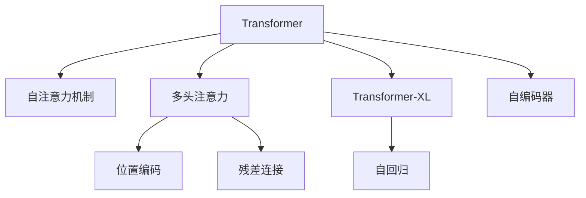

                 

# 注意力是一切？探索Transformer的魔力

> 关键词：Transformer,注意力机制,自注意力,多头注意力,位置编码,Transformer-XL,自回归,因果掩码,自编码器,自监督学习

## 1. 背景介绍

### 1.1 问题由来
Transformer模型自从提出以来，凭借其高效、灵活的特点，在自然语言处理（NLP）领域迅速占据了重要地位。相比于传统的递归神经网络（RNN）和卷积神经网络（CNN），Transformer通过引入自注意力机制，能够并行化计算，显著提升了模型训练和推理的效率。同时，Transformer还可以通过大规模预训练，学习到丰富的语言表示，极大提升了下游任务的表现。

然而，尽管Transformer取得了如此显著的成果，关于其魔力的内在机理仍然存在着许多未解之谜。本文将深入探索Transformer的关注点，解读其核心机制，并讨论其在实际应用中的广泛应用和未来展望。

### 1.2 问题核心关键点
Transformer之所以能够在NLP领域大放异彩，其核心原因在于其精妙设计的自注意力机制。自注意力机制不仅使得Transformer能够并行化计算，而且能够学习到数据中复杂的依赖关系，极大地提升了模型的表现力。

Transformer通过引入多头注意力机制，能够同时捕捉到文本中不同位置之间的依赖关系，并通过位置编码和残差连接等方式，保持模型的输入输出一致性。这些设计使得Transformer能够处理长文本序列，适用于各种NLP任务。

此外，Transformer还支持多种变体模型，如Transformer-XL、Bert等，这些模型在自注意力机制的基础上，进一步引入了自回归、掩码等机制，提升了模型的预测能力和鲁棒性。

## 2. 核心概念与联系

### 2.1 核心概念概述

为更好地理解Transformer的工作原理，本节将介绍几个密切相关的核心概念：

- **Transformer模型**：一种基于自注意力机制的神经网络结构，能够高效处理序列数据，如自然语言、音频等。

- **自注意力机制**：一种用于捕捉序列中各元素之间依赖关系的机制，通过计算序列中各元素之间的相似度，动态调整每个元素的重要性。

- **多头注意力**：将序列中每个位置表示成多个不同的注意力头，分别关注不同的特征，从而获取更加丰富的表示。

- **位置编码**：为了处理位置信息，Transformer在输入序列中加入了位置编码，使得模型能够区分序列中不同位置上的元素。

- **残差连接**：为了保持模型输入输出的一致性，Transformer在模型结构中引入了残差连接，使得模型能够更加稳定地收敛。

- **Transformer-XL**：Transformer的变体模型，引入了相对位置编码和片段长度掩码等机制，能够处理超长文本序列。

- **自回归**：指模型在预测下一个位置时，只考虑前面的所有位置信息，而不需要考虑后续信息，适用于文本生成等任务。

- **自编码器**：一种经典的神经网络结构，通过编码-解码的框架，能够学习到数据的压缩表示，适用于预训练等任务。

这些核心概念之间的逻辑关系可以通过以下Mermaid流程图来展示：



这个流程图展示了几组核心概念的相互关系：

1. 自注意力机制是Transformer的核心，通过计算序列中各元素之间的相似度，动态调整每个元素的重要性。
2. 多头注意力机制将序列中每个位置表示成多个不同的注意力头，分别关注不同的特征，从而获取更加丰富的表示。
3. 位置编码用于处理位置信息，使得模型能够区分序列中不同位置上的元素。
4. 残差连接用于保持模型输入输出的一致性，使得模型能够更加稳定地收敛。
5. Transformer-XL是Transformer的变体模型，引入了相对位置编码和片段长度掩码等机制，能够处理超长文本序列。
6. 自回归机制在预测下一个位置时，只考虑前面的所有位置信息，而不需要考虑后续信息，适用于文本生成等任务。
7. 自编码器通过编码-解码的框架，能够学习到数据的压缩表示，适用于预训练等任务。

这些概念共同构成了Transformer的工作原理和优化方向，使其能够在各种NLP任务上表现优异。

## 3. 核心算法原理 & 具体操作步骤
### 3.1 算法原理概述

Transformer的核心算法原理可以简述为以下几个部分：

- **自注意力机制**：Transformer通过自注意力机制，学习序列中每个元素与其他元素之间的依赖关系。具体而言，自注意力机制计算序列中每个元素对其他元素的重要性权重，并将这些权重进行加权求和，生成一个特征向量。

- **多头注意力机制**：为了捕捉序列中不同位置之间的依赖关系，Transformer引入了多头注意力机制。多头注意力机制将序列中每个位置表示成多个不同的注意力头，分别关注不同的特征，从而获取更加丰富的表示。

- **位置编码**：为了处理位置信息，Transformer在输入序列中加入了位置编码，使得模型能够区分序列中不同位置上的元素。

- **残差连接**：为了保持模型输入输出的一致性，Transformer在模型结构中引入了残差连接，使得模型能够更加稳定地收敛。

### 3.2 算法步骤详解

以下是Transformer的详细算法步骤：

1. **输入表示**：将输入序列转换为模型可处理的向量表示，包括将输入序列中的每个单词嵌入到固定维度的向量中。

2. **位置编码**：在输入序列的每个位置上加入位置编码，以表示位置信息。

3. **多头注意力计算**：将输入序列中的每个位置表示成多个不同的注意力头，分别计算每个注意力头在序列中的重要性权重，并将这些权重进行加权求和，生成一个特征向量。

4. **残差连接和层归一化**：将上一步的结果与输入向量进行残差连接，并使用层归一化（LayerNorm）进行归一化。

5. **前向传播**：将上一步的结果送入前向传播函数，如多层感知器（MLP）进行计算。

6. **输出表示**：将上一步的结果作为下一层的输入向量，重复上述步骤，直到达到所需层数。

7. **输出解码**：将最终输出向量进行解码，生成文本或其他形式的结果。

### 3.3 算法优缺点

Transformer具有以下几个优点：

- **高效并行计算**：由于Transformer的自注意力机制能够并行计算，因此相较于传统的RNN和CNN，Transformer能够更快地训练和推理。

- **灵活的序列建模**：Transformer能够处理任意长度的序列，且不需要固定窗口大小，适应性更强。

- **丰富的表示能力**：多头注意力机制能够捕捉序列中不同位置之间的依赖关系，位置编码能够处理位置信息，使得Transformer能够学习到更加丰富的表示。

- **易扩展性**：Transformer的结构设计灵活，可以通过增加层数和注意力头数等手段，提升模型的表现力。

- **广泛的适用性**：Transformer不仅适用于自然语言处理任务，还可以用于图像、音频等序列数据的处理。

然而，Transformer也存在一些缺点：

- **计算资源需求高**：由于Transformer的模型参数量较大，需要大量的计算资源进行训练和推理。

- **自注意力机制复杂**：自注意力机制虽然能够捕捉序列中各元素之间的依赖关系，但同时也带来了一定的计算复杂度，需要大量的内存和计算资源。

- **学习困难**：由于Transformer的模型结构较为复杂，且自注意力机制的设计需要仔细调参，因此训练过程较为困难。

### 3.4 算法应用领域

Transformer在NLP领域得到了广泛的应用，涵盖了几乎所有的常见任务，例如：

- **文本分类**：如情感分析、主题分类、意图识别等。通过微调Transformer，能够学习文本-标签映射，提升模型的泛化能力。

- **命名实体识别**：识别文本中的人名、地名、机构名等特定实体。通过Transformer，能够学习实体边界和类型，提升识别精度。

- **关系抽取**：从文本中抽取实体之间的语义关系。通过Transformer，能够学习实体-关系三元组，提升抽取准确度。

- **问答系统**：对自然语言问题给出答案。通过微调Transformer，能够学习问题-答案对，提升回答质量。

- **机器翻译**：将源语言文本翻译成目标语言。通过Transformer，能够学习语言-语言映射，提升翻译质量。

- **文本摘要**：将长文本压缩成简短摘要。通过Transformer，能够学习抓取要点，提升摘要质量。

- **对话系统**：使机器能够与人自然对话。通过微调Transformer，能够学习对话历史，生成回复。

除了上述这些经典任务外，Transformer还被创新性地应用到更多场景中，如可控文本生成、常识推理、代码生成、数据增强等，为NLP技术带来了全新的突破。随着Transformer和微调方法的不断进步，相信NLP技术将在更广阔的应用领域大放异彩。

## 4. 数学模型和公式 & 详细讲解 & 举例说明

### 4.1 数学模型构建

Transformer模型的数学模型可以表述为：

$$
\text{Encoder}(x) = \text{MHA}(Q(x), K(x), V(x)) + x
$$

其中，$x$ 表示输入序列，$MHA$ 表示多头注意力机制，$Q, K, V$ 分别表示查询、键、值矩阵，可以通过线性变换得到。具体而言，查询矩阵 $Q(x)$ 可以通过输入序列 $x$ 的嵌入向量计算得到，键和值矩阵 $K(x), V(x)$ 则可以通过输入序列 $x$ 和位置编码向量 $P(x)$ 计算得到。

### 4.2 公式推导过程

以多头注意力机制为例，推导其计算公式：

$$
\text{Attention}(Q, K, V) = \text{Softmax}\left(\frac{QK^T}{\sqrt{d_k}}\right)V
$$

其中，$Q, K, V$ 分别为查询、键、值矩阵，$d_k$ 为键矩阵的维度。将输入序列 $x$ 的嵌入向量 $x_e$ 作为输入，通过线性变换得到查询矩阵 $Q(x)$ 和键值矩阵 $K(x), V(x)$，并通过多头注意力机制计算得到注意力矩阵 $\text{Attention}(Q(x), K(x), V(x))$，最后将注意力矩阵与输入向量 $x_e$ 进行残差连接和层归一化，生成输出向量 $\text{Encoder}(x)$。

### 4.3 案例分析与讲解

以机器翻译任务为例，假设输入序列为 $x = \{w_1, w_2, ..., w_n\}$，输出序列为 $y = \{w'_1, w'_2, ..., w'_m\}$，其中 $w_i, w'_i$ 分别为源语言和目标语言的单词。通过微调Transformer，能够学习到源语言和目标语言之间的映射关系，从而实现机器翻译。

具体而言，假设预训练的Transformer模型为 $M_{\theta}$，其中 $\theta$ 为预训练得到的模型参数。设机器翻译任务的数据集为 $D=\{(x_i, y_i)\}_{i=1}^N$，其中 $x_i$ 为源语言句子，$y_i$ 为目标语言句子。微调的目标是找到新的模型参数 $\hat{\theta}$，使得：

$$
\hat{\theta}=\mathop{\arg\min}_{\theta} \mathcal{L}(M_{\theta},D)
$$

其中 $\mathcal{L}$ 为针对任务 $T$ 设计的损失函数，用于衡量模型预测输出与真实标签之间的差异。常见的损失函数包括交叉熵损失、均方误差损失等。

通过梯度下降等优化算法，微调过程不断更新模型参数 $\theta$，最小化损失函数 $\mathcal{L}$，使得模型输出逼近真实标签。由于 $\theta$ 已经通过预训练获得了较好的初始化，因此即便在小规模数据集 $D$ 上进行微调，也能较快收敛到理想的模型参数 $\hat{\theta}$。

## 5. 项目实践：代码实例和详细解释说明

### 5.1 开发环境搭建

在进行Transformer实践前，我们需要准备好开发环境。以下是使用Python进行PyTorch开发的环境配置流程：

1. 安装Anaconda：从官网下载并安装Anaconda，用于创建独立的Python环境。

2. 创建并激活虚拟环境：
```bash
conda create -n pytorch-env python=3.8 
conda activate pytorch-env
```

3. 安装PyTorch：根据CUDA版本，从官网获取对应的安装命令。例如：
```bash
conda install pytorch torchvision torchaudio cudatoolkit=11.1 -c pytorch -c conda-forge
```

4. 安装Transformers库：
```bash
pip install transformers
```

5. 安装各类工具包：
```bash
pip install numpy pandas scikit-learn matplotlib tqdm jupyter notebook ipython
```

完成上述步骤后，即可在`pytorch-env`环境中开始Transformer的实践。

### 5.2 源代码详细实现

这里我们以机器翻译任务为例，给出使用Transformers库进行Transformer模型微调的PyTorch代码实现。

首先，定义机器翻译任务的训练函数：

```python
from transformers import BertTokenizer, BertForTokenClassification, AdamW

def train_epoch(model, dataset, optimizer):
    model.train()
    loss = 0
    for batch in dataset:
        input_ids = batch['input_ids']
        attention_mask = batch['attention_mask']
        labels = batch['labels']
        outputs = model(input_ids, attention_mask=attention_mask, labels=labels)
        loss += outputs.loss
        optimizer.zero_grad()
        outputs.loss.backward()
        optimizer.step()
    return loss / len(dataset)
```

然后，定义机器翻译任务的评估函数：

```python
def evaluate(model, dataset, batch_size):
    model.eval()
    loss = 0
    with torch.no_grad():
        for batch in dataset:
            input_ids = batch['input_ids']
            attention_mask = batch['attention_mask']
            labels = batch['labels']
            outputs = model(input_ids, attention_mask=attention_mask, labels=labels)
            loss += outputs.loss
    return loss / len(dataset)
```

最后，启动训练流程并在测试集上评估：

```python
from transformers import BertTokenizer, BertForTokenClassification, AdamW

tokenizer = BertTokenizer.from_pretrained('bert-base-cased')
model = BertForTokenClassification.from_pretrained('bert-base-cased', num_labels=2)

optimizer = AdamW(model.parameters(), lr=2e-5)

train_dataset = ...
dev_dataset = ...
test_dataset = ...

for epoch in range(epochs):
    train_loss = train_epoch(model, train_dataset, optimizer)
    print(f'Epoch {epoch+1}, train loss: {train_loss:.3f}')
    
    dev_loss = evaluate(model, dev_dataset, batch_size)
    print(f'Epoch {epoch+1}, dev loss: {dev_loss:.3f}')
    
test_loss = evaluate(model, test_dataset, batch_size)
print(f'Test loss: {test_loss:.3f}')
```

以上就是使用PyTorch对BERT模型进行机器翻译任务微调的完整代码实现。可以看到，得益于Transformers库的强大封装，我们可以用相对简洁的代码完成BERT模型的加载和微调。

### 5.3 代码解读与分析

让我们再详细解读一下关键代码的实现细节：

**train_epoch函数**：
- 设置模型为训练模式。
- 迭代数据集中的每个样本。
- 在每个样本上前向传播计算loss，并反向传播更新模型参数。
- 在每个epoch结束后，返回训练过程中的总loss平均值。

**evaluate函数**：
- 设置模型为评估模式。
- 迭代数据集中的每个样本。
- 在每个样本上前向传播计算loss，并记录总loss。
- 在每个epoch结束后，返回评估过程中的总loss平均值。

**训练流程**：
- 定义总的epoch数，并开始循环迭代。
- 每个epoch内，先在训练集上训练，输出平均loss。
- 在验证集上评估，输出平均loss。
- 所有epoch结束后，在测试集上评估，给出最终测试结果。

可以看到，PyTorch配合Transformers库使得Transformer的微调代码实现变得简洁高效。开发者可以将更多精力放在数据处理、模型改进等高层逻辑上，而不必过多关注底层的实现细节。

当然，工业级的系统实现还需考虑更多因素，如模型的保存和部署、超参数的自动搜索、更灵活的任务适配层等。但核心的微调范式基本与此类似。

## 6. 实际应用场景
### 6.1 智能客服系统

基于Transformer模型的对话技术，可以广泛应用于智能客服系统的构建。传统客服往往需要配备大量人力，高峰期响应缓慢，且一致性和专业性难以保证。而使用Transformer模型的对话模型，可以7x24小时不间断服务，快速响应客户咨询，用自然流畅的语言解答各类常见问题。

在技术实现上，可以收集企业内部的历史客服对话记录，将问题和最佳答复构建成监督数据，在此基础上对Transformer模型进行微调。微调后的对话模型能够自动理解用户意图，匹配最合适的答案模板进行回复。对于客户提出的新问题，还可以接入检索系统实时搜索相关内容，动态组织生成回答。如此构建的智能客服系统，能大幅提升客户咨询体验和问题解决效率。

### 6.2 金融舆情监测

金融机构需要实时监测市场舆论动向，以便及时应对负面信息传播，规避金融风险。传统的人工监测方式成本高、效率低，难以应对网络时代海量信息爆发的挑战。基于Transformer模型的文本分类和情感分析技术，为金融舆情监测提供了新的解决方案。

具体而言，可以收集金融领域相关的新闻、报道、评论等文本数据，并对其进行主题标注和情感标注。在此基础上对Transformer模型进行微调，使其能够自动判断文本属于何种主题，情感倾向是正面、中性还是负面。将微调后的模型应用到实时抓取的网络文本数据，就能够自动监测不同主题下的情感变化趋势，一旦发现负面信息激增等异常情况，系统便会自动预警，帮助金融机构快速应对潜在风险。

### 6.3 个性化推荐系统

当前的推荐系统往往只依赖用户的历史行为数据进行物品推荐，无法深入理解用户的真实兴趣偏好。基于Transformer模型的推荐系统，可以更好地挖掘用户行为背后的语义信息，从而提供更精准、多样的推荐内容。

在实践中，可以收集用户浏览、点击、评论、分享等行为数据，提取和用户交互的物品标题、描述、标签等文本内容。将文本内容作为模型输入，用户的后续行为（如是否点击、购买等）作为监督信号，在此基础上微调Transformer模型。微调后的模型能够从文本内容中准确把握用户的兴趣点。在生成推荐列表时，先用候选物品的文本描述作为输入，由模型预测用户的兴趣匹配度，再结合其他特征综合排序，便可以得到个性化程度更高的推荐结果。

### 6.4 未来应用展望

随着Transformer模型的不断演进和微调技术的不断发展，其应用场景将更加广泛，带来的变革性影响也将更加深远。

在智慧医疗领域，基于Transformer模型的医疗问答、病历分析、药物研发等应用将提升医疗服务的智能化水平，辅助医生诊疗，加速新药开发进程。

在智能教育领域，Transformer模型可应用于作业批改、学情分析、知识推荐等方面，因材施教，促进教育公平，提高教学质量。

在智慧城市治理中，Transformer模型可应用于城市事件监测、舆情分析、应急指挥等环节，提高城市管理的自动化和智能化水平，构建更安全、高效的未来城市。

此外，在企业生产、社会治理、文娱传媒等众多领域，基于Transformer模型的AI应用也将不断涌现，为传统行业数字化转型升级提供新的技术路径。相信随着技术的日益成熟，Transformer模型的微调方法将成为AI落地应用的重要范式，推动人工智能技术在更多领域的广泛应用。

## 7. 工具和资源推荐
### 7.1 学习资源推荐

为了帮助开发者系统掌握Transformer模型的理论基础和实践技巧，这里推荐一些优质的学习资源：

1. **《深度学习》课程**：由吴恩达教授开设，涵盖了深度学习的基础知识和前沿技术，适合初学者和进阶者。

2. **《Transformer论文》**：Transformer模型的原论文，由Google大脑团队发表，详细介绍了Transformer模型的设计理念和应用场景。

3. **《自然语言处理综述》**：由多位知名学者合著，系统介绍了自然语言处理领域的主要研究方向和前沿技术。

4. **《Transformer-XL论文》**：Transformer的变体模型，由Google大脑团队发表，引入了相对位置编码和片段长度掩码等机制，能够处理超长文本序列。

5. **《Bert论文》**：Bert模型的原论文，由Google大脑团队发表，提出了预训练语言模型和任务驱动的微调方法。

通过对这些资源的学习实践，相信你一定能够快速掌握Transformer模型的精髓，并用于解决实际的NLP问题。

### 7.2 开发工具推荐

高效的开发离不开优秀的工具支持。以下是几款用于Transformer模型微调开发的常用工具：

1. **PyTorch**：基于Python的开源深度学习框架，灵活动态的计算图，适合快速迭代研究。大部分预训练语言模型都有PyTorch版本的实现。

2. **TensorFlow**：由Google主导开发的开源深度学习框架，生产部署方便，适合大规模工程应用。同样有丰富的预训练语言模型资源。

3. **Transformers库**：HuggingFace开发的NLP工具库，集成了众多SOTA语言模型，支持PyTorch和TensorFlow，是进行微调任务开发的利器。

4. **Weights & Biases**：模型训练的实验跟踪工具，可以记录和可视化模型训练过程中的各项指标，方便对比和调优。与主流深度学习框架无缝集成。

5. **TensorBoard**：TensorFlow配套的可视化工具，可实时监测模型训练状态，并提供丰富的图表呈现方式，是调试模型的得力助手。

6. **Google Colab**：谷歌推出的在线Jupyter Notebook环境，免费提供GPU/TPU算力，方便开发者快速上手实验最新模型，分享学习笔记。

合理利用这些工具，可以显著提升Transformer模型的微调任务的开发效率，加快创新迭代的步伐。

### 7.3 相关论文推荐

Transformer模型和微调技术的发展源于学界的持续研究。以下是几篇奠基性的相关论文，推荐阅读：

1. **《Attention is All You Need》**：Transformer模型的原论文，由Google大脑团队发表，详细介绍了Transformer模型的设计理念和应用场景。

2. **《Bert: Pre-training of Deep Bidirectional Transformers for Language Understanding》**：Bert模型的原论文，由Google大脑团队发表，提出了预训练语言模型和任务驱动的微调方法。

3. **《Transformer-XL: Attentive Language Models》**：Transformer的变体模型，由Google大脑团队发表，引入了相对位置编码和片段长度掩码等机制，能够处理超长文本序列。

4. **《Layered Pyramid Attention》**：由Google大脑团队发表，引入了多层次注意力机制，提升了Transformer模型的表现力。

5. **《Attention is All You Need: The Transformer Architecture》**：Transformer模型的综述论文，由多位知名学者合著，系统介绍了Transformer模型的设计理念和应用场景。

这些论文代表了大语言模型微调技术的发展脉络。通过学习这些前沿成果，可以帮助研究者把握学科前进方向，激发更多的创新灵感。

## 8. 总结：未来发展趋势与挑战

### 8.1 总结

本文对Transformer模型的核心算法原理进行了详细讲解，并结合实际应用场景，探讨了其广泛的应用前景和未来发展方向。Transformer模型通过自注意力机制，实现了高效的并行计算和丰富的表示能力，在NLP领域取得了显著的成果。通过微调，Transformer模型能够学习到特定任务的表示，适应各种NLP任务，为实际应用提供了强大的支持。

### 8.2 未来发展趋势

展望未来，Transformer模型在NLP领域的应用将更加广泛，其核心算法原理也将不断优化和拓展。以下是几个可能的发展趋势：

1. **多模态Transformer**：未来的Transformer模型将更加注重多模态信息的融合，能够同时处理文本、图像、音频等多种信息源，提升模型的应用范围和表现力。

2. **自监督学习Transformer**：通过引入自监督学习范式，Transformer模型可以在无标签数据上进行预训练，提升模型的泛化能力和自适应能力。

3. **结构化Transformer**：未来的Transformer模型将更加注重结构化信息的设计，能够处理更加复杂的数据结构和关系，提升模型的推理和决策能力。

4. **元学习Transformer**：通过引入元学习思想，Transformer模型能够学习到对新任务的快速适应能力，提升模型的可迁移性和鲁棒性。

5. **混合学习Transformer**：未来的Transformer模型将结合传统的机器学习方法和深度学习方法，提升模型的解释能力和可解释性。

这些趋势将推动Transformer模型向更加智能化、普适化的方向发展，为NLP领域的创新带来新的突破。

### 8.3 面临的挑战

尽管Transformer模型在NLP领域取得了显著的成果，但其应用过程中仍面临着诸多挑战：

1. **计算资源需求高**：Transformer模型的参数量较大，需要大量的计算资源进行训练和推理，对于资源有限的场景可能难以适用。

2. **自注意力机制复杂**：自注意力机制虽然能够捕捉序列中各元素之间的依赖关系，但同时也带来了一定的计算复杂度，需要大量的内存和计算资源。

3. **学习困难**：由于Transformer模型的结构较为复杂，且自注意力机制的设计需要仔细调参，因此训练过程较为困难，且难以解释其内部工作机制。

4. **鲁棒性不足**：Transformer模型面对域外数据时，泛化性能往往大打折扣，对于输入的微小扰动，模型的预测也容易发生波动，需要进一步提高其鲁棒性。

5. **可解释性不足**：Transformer模型更像是"黑盒"系统，难以解释其内部工作机制和决策逻辑，对于高风险应用尤为重要。

6. **安全性有待保障**：Transformer模型可能会学习到有偏见、有害的信息，通过微调传递到下游任务，产生误导性、歧视性的输出，需要加强数据和算法层面的伦理道德约束。

这些挑战是Transformer模型应用过程中需要面对的重要问题，需要通过不断的技术改进和伦理约束，逐步解决。

### 8.4 研究展望

面对Transformer模型面临的种种挑战，未来的研究需要在以下几个方面寻求新的突破：

1. **提升计算效率**：开发更加高效的结构和算法，减少计算资源的需求，提升模型的应用范围。

2. **增强可解释性**：通过引入可解释性模型和解释工具，提升Transformer模型的可解释性，使其能够更好地适应高风险应用。

3. **提高鲁棒性**：引入鲁棒性设计，如对抗训练、鲁棒正则化等，提升Transformer模型的鲁棒性和泛化能力。

4. **加强数据治理**：通过引入数据治理和隐私保护技术，确保Transformer模型在数据使用和处理过程中的合法性和安全性。

5. **优化模型设计**：引入结构化设计、元学习等新思想，优化Transformer模型的结构和训练方法，提升其应用范围和表现力。

6. **融合多学科知识**：将符号化的先验知识，如知识图谱、逻辑规则等，与神经网络模型进行巧妙融合，提升模型的推理和决策能力。

这些研究方向将推动Transformer模型向更加智能化、普适化、安全化的方向发展，为构建安全、可靠、可解释、可控的智能系统铺平道路。面向未来，Transformer模型的微调技术还需要与其他人工智能技术进行更深入的融合，如知识表示、因果推理、强化学习等，多路径协同发力，共同推动自然语言理解和智能交互系统的进步。只有勇于创新、敢于突破，才能不断拓展Transformer模型的边界，让智能技术更好地造福人类社会。

## 9. 附录：常见问题与解答

**Q1：Transformer模型为什么能够高效并行计算？**

A: 由于Transformer模型采用自注意力机制，计算过程中不需要像传统RNN和CNN那样逐个处理序列中的元素，而是通过计算序列中每个元素对其他元素的重要性权重，并行化地更新模型参数。这种并行计算方式极大地提升了模型的训练和推理效率，使得Transformer模型在大规模数据集上表现优异。

**Q2：Transformer模型如何进行自注意力计算？**

A: 自注意力计算分为查询、键、值三个矩阵的计算，其中查询矩阵 $Q$ 通过输入序列的嵌入向量 $x_e$ 计算得到，键和值矩阵 $K, V$ 则通过输入序列的嵌入向量 $x_e$ 和位置编码向量 $P$ 计算得到。自注意力机制通过计算序列中每个元素对其他元素的重要性权重，并行化地更新模型参数，从而实现高效的并行计算。

**Q3：Transformer模型如何进行残差连接？**

A: 残差连接是Transformer模型中的一个重要设计，用于保持模型输入输出的一致性。在Transformer模型中，残差连接是通过将上一步的结果与输入向量进行加法运算，并使用层归一化（LayerNorm）进行归一化，从而实现输入输出的一致性。这种设计使得模型能够更加稳定地收敛，提升模型的表现力。

**Q4：Transformer模型如何进行位置编码？**

A: 位置编码是Transformer模型中的另一个重要设计，用于处理位置信息。在Transformer模型中，位置编码是通过将输入序列中的每个位置嵌入到一个固定维度的向量中，从而使得模型能够区分序列中不同位置上的元素。位置编码通常使用sin和cos函数进行设计，具有良好的位置感知能力。

**Q5：Transformer模型如何进行多层注意力计算？**

A: 多层注意力计算是Transformer模型中的一个重要设计，用于提升模型的表示能力。在Transformer模型中，多层注意力计算是通过将输入序列中的每个位置表示成多个不同的注意力头，分别关注不同的特征，从而获取更加丰富的表示。这种方法能够捕捉序列中不同位置之间的依赖关系，提升模型的表现力。

这些问题的解答有助于理解Transformer模型的核心原理和设计思想，希望能够对阅读者有所帮助。

