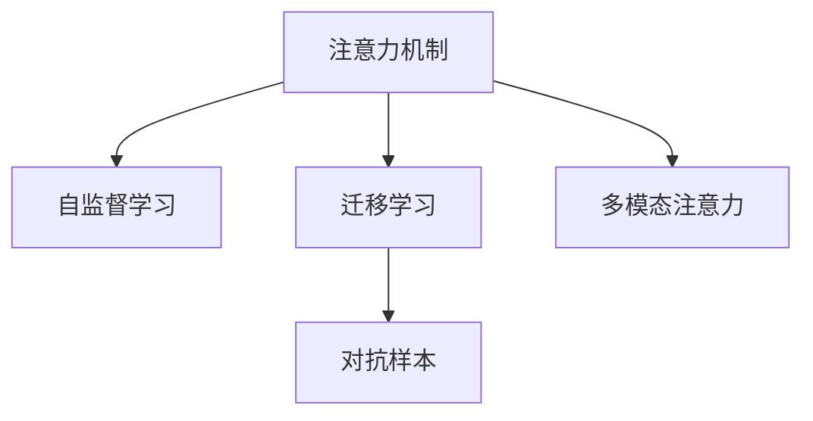

                 

## 1. 背景介绍

### 1.1 问题由来

在当前快速发展的数字化时代，元宇宙正成为连接现实世界和数字世界的新一代互联网形态。元宇宙（Metaverse），一个沉浸式、交互式、充满各种可能性的虚拟世界，正在改变我们的工作方式、社交方式、娱乐方式乃至整个生活方式。元宇宙的崛起，离不开AI技术的强力支撑，特别是自然语言处理（NLP）和计算机视觉（CV）等核心技术，这些技术在推动元宇宙的构建和发展中起到了至关重要的作用。

### 1.2 问题核心关键点

元宇宙的核心特征之一是其高度互动性，这要求构建在其中的人工智能模型具备强大的注意力管理能力，以确保其在处理多样化的用户输入和反馈时能够高效、准确地聚焦关键信息，快速做出响应。当前，注意力管理在元宇宙的众多应用场景中表现出色，如智能客服、虚拟导览、虚拟助手等。然而，随着元宇宙场景的复杂化和多样化，现有的注意力管理技术面临诸多挑战，需要进一步的优化和创新。

### 1.3 问题研究意义

本研究旨在全面探讨元宇宙时代下的注意力管理技术，分析其在多样化的应用场景中的实际需求，挖掘注意力管理技术的潜在瓶颈，并提出改进方案和未来发展方向。通过对元宇宙注意力管理技术的深入研究，可以提升用户体验，推动元宇宙的快速发展，为各行各业在元宇宙中实现创新应用提供技术支持。

## 2. 核心概念与联系

### 2.1 核心概念概述

为更好地理解元宇宙时代下的注意力管理技术，本节将介绍几个关键概念及其相互联系：

- **注意力机制（Attention Mechanism）**：是一种神经网络架构，用于动态选择并聚焦输入序列中对当前输出任务最有贡献的部分。在元宇宙中，注意力机制可以帮助模型更好地理解复杂的场景和用户需求，提高模型响应的准确性和效率。

- **自监督学习（Self-Supervised Learning）**：一种不需要显式标签，通过最大化自身预测能力进行训练的学习方法。在元宇宙中，自监督学习可以通过模拟对话、互动游戏等方式生成无标签数据，用于训练注意力管理模型。

- **迁移学习（Transfer Learning）**：利用已有模型在特定任务上的知识，在新任务上进行微调或直接应用的方法。在元宇宙中，迁移学习可以通过将大模型的注意力管理能力迁移到特定应用中，提升模型的泛化能力和效果。

- **对抗样本（Adversarial Examples）**：有意扰动的样本，用于测试模型鲁棒性。在元宇宙中，对抗样本可以模拟用户恶意攻击或噪声干扰，测试模型的稳定性。

- **多模态注意力（Multi-modal Attention）**：结合图像、语音、文本等多种模态信息的注意力管理方法。在元宇宙中，多模态注意力可以更全面地理解虚拟世界中的复杂信息，提升模型的交互能力。

这些概念之间的联系通过以下Mermaid流程图来展示：



这个流程图展示了注意力管理技术在不同方面的应用和关联。通过理解这些概念及其联系，我们可以更好地把握元宇宙中注意力管理技术的工作原理和优化方向。

## 3. 核心算法原理 & 具体操作步骤

### 3.1 算法原理概述

在元宇宙中，注意力管理技术通过优化模型对输入信息的聚焦，使得模型能够更高效、准确地处理复杂场景和用户需求。其核心思想是：在输入序列中动态分配注意力权重，以确定哪些部分对当前输出任务最为重要，并将计算资源集中在这些关键部分上。

### 3.2 算法步骤详解

#### 3.2.1 输入序列处理

首先，将用户输入的序列（如文本、图像、语音等）转换为模型可处理的向量形式。对于文本，可以使用词嵌入（Word Embedding）或字符嵌入（Character Embedding）进行转换；对于图像，可以使用卷积神经网络（CNN）提取特征；对于语音，可以使用卷积层和循环层进行特征提取。

#### 3.2.2 注意力权重计算

在转换后的序列上，计算每个位置的重要性权重。常用的权重计算方法包括加权平均法、多头注意力（Multi-Head Attention）等。这些方法通过计算注意力矩阵（Attention Matrix），将输入序列中每个位置的向量转换为一个注意力分数，表示其对当前输出任务的重要性。

#### 3.2.3 注意力向量生成

根据计算出的注意力权重，对输入序列中的向量进行加权求和，生成一个综合向量。这个向量将作为后续处理的输入，代表模型对输入序列的注意力聚焦。

#### 3.2.4 模型输出

在生成注意力向量后，可以将其作为模型的输入进行进一步处理，如分类、生成、序列预测等。模型的输出可以用于元宇宙中的各种应用，如对话生成、虚拟导览、智能推荐等。

### 3.3 算法优缺点

注意力管理技术的优点包括：

- **高效性**：通过聚焦关键信息，模型能够更高效地处理复杂输入，提升处理速度和响应时间。
- **准确性**：通过动态调整注意力权重，模型能够更准确地理解输入序列中的重要信息，提高预测精度。
- **灵活性**：适用于多种输入类型，包括文本、图像、语音等，具有广泛的适用性。

然而，该技术也存在一些缺点：

- **计算复杂度较高**：计算注意力权重和注意力向量的过程涉及大量矩阵运算，需要较高的计算资源。
- **模型训练难度大**：需要大量高质量标注数据进行训练，且训练过程容易过拟合。
- **模型泛化能力有限**：不同场景下的注意力管理模型可能需要单独训练，模型间迁移难度较大。

### 3.4 算法应用领域

注意力管理技术在元宇宙中有着广泛的应用，主要包括：

- **虚拟导览**：通过注意力机制，导览系统能够聚焦关键场景，引导用户探索虚拟世界。
- **智能客服**：在虚拟客服场景中，通过注意力管理，模型能够更好地理解用户问题，提供准确的答案。
- **虚拟助手**：在虚拟助手中，注意力管理技术可以提升助手对用户指令的理解和响应能力，提高交互效果。
- **游戏场景模拟**：在复杂的游戏场景中，注意力管理可以帮助模型更好地处理多任务和动态变化的环境。
- **情感分析**：在虚拟社交中，注意力管理技术可以提升情感分析的准确性，更好地理解用户情感状态。

## 4. 数学模型和公式 & 详细讲解 & 举例说明

### 4.1 数学模型构建

在元宇宙中，注意力管理技术通常使用Transformer模型，其注意力机制基于多头自注意力（Multi-Head Self-Attention）。

对于一个输入序列 $X=\{x_1, x_2, ..., x_n\}$，其自注意力计算过程如下：

$$
\text{Attention}(Q, K, V) = \text{Softmax}(\frac{QK^T}{\sqrt{d_k}})V
$$

其中 $Q$、$K$、$V$ 分别表示查询向量、键向量和值向量，$d_k$ 是向量维度。

### 4.2 公式推导过程

以文本输入为例，其注意力计算过程如下：

1. 将文本序列转换为词嵌入矩阵 $X \in \mathbb{R}^{n \times d}$，其中 $d$ 是词嵌入维度。
2. 对词嵌入矩阵进行线性变换，得到查询向量 $Q \in \mathbb{R}^{n \times d}$。
3. 对词嵌入矩阵进行线性变换，得到键向量 $K \in \mathbb{R}^{n \times d}$ 和值向量 $V \in \mathbb{R}^{n \times d}$。
4. 计算注意力矩阵 $A \in \mathbb{R}^{n \times n}$，其中 $A_{ij} = \text{softmax}(Q_iK_j^T/\sqrt{d})$。
5. 对注意力矩阵进行加权求和，得到注意力向量 $O \in \mathbb{R}^{n \times d}$，其中 $O = \sum_{i,j}A_{ij}V_j$。

### 4.3 案例分析与讲解

以虚拟导览系统为例，在用户输入导航请求后，系统通过注意力机制对场景进行理解，聚焦用户感兴趣的区域，生成个性化导览方案。具体步骤包括：

1. 系统将用户输入的导航请求转换为词嵌入向量 $X$。
2. 系统对词嵌入向量进行线性变换，得到查询向量 $Q$。
3. 系统对场景图片进行卷积处理，提取特征向量 $K$ 和 $V$。
4. 系统计算注意力矩阵 $A$。
5. 系统根据注意力矩阵对特征向量进行加权求和，生成注意力向量 $O$。
6. 系统对注意力向量进行解码，生成导览方案。

通过注意力机制，导览系统能够更好地理解用户需求，提供个性化的导览服务，提升用户体验。

## 5. 项目实践：代码实例和详细解释说明

### 5.1 开发环境搭建

在搭建开发环境前，需要先安装必要的依赖库。以下是基于Python的开发环境搭建流程：

1. 安装Anaconda：从官网下载并安装Anaconda，用于创建独立的Python环境。
2. 创建并激活虚拟环境：
```bash
conda create -n attention-env python=3.8 
conda activate attention-env
```

3. 安装必要的Python库：
```bash
pip install torch torchvision torchaudio scikit-learn pandas numpy
```

4. 安装Transformer库：
```bash
pip install transformers
```

5. 安装Jupyter Notebook：
```bash
pip install jupyter notebook
```

完成上述步骤后，即可在`attention-env`环境中开始注意力管理模型的开发。

### 5.2 源代码详细实现

以下是一个基于Transformer的注意力管理模型的Python实现。我们使用PyTorch框架，并引入Transformers库。

```python
import torch
import torch.nn as nn
from transformers import BertTokenizer, BertModel

class AttentionModel(nn.Module):
    def __init__(self, n heads, d model, d k, d v):
        super(AttentionModel, self).__init__()
        self.n heads = heads
        self.d k = d k
        self.d v = d v
        
        self.q = nn.Linear(d model, d k)
        self.k = nn.Linear(d model, d k)
        self.v = nn.Linear(d model, d v)
        self.o = nn.Linear(d v, d model)
        
    def forward(self, x, mask):
        q = self.q(x)
        k = self.k(x)
        v = self.v(x)
        
        q = q.view(q.size(0), q.size(1), self.n heads, self.d k / self.n heads).permute(0, 2, 1, 3).contiguous()
        k = k.view(k.size(0), k.size(1), self.n heads, self.d k / self.n heads).permute(0, 2, 1, 3).contiguous()
        v = v.view(v.size(0), v.size(1), self.n heads, self.d v / self.n heads).permute(0, 2, 1, 3).contiguous()
        
        attn = torch.bmm(q, k.permute(0, 1, 3, 2)) / torch.sqrt(torch.tensor(self.d k, dtype=torch.float).unsqueeze(1).unsqueeze(2))
        attn = attn.masked_fill(mask, -1e9)
        attn = torch.softmax(attn, dim=-1)
        o = torch.bmm(attn, v)
        o = o.permute(0, 2, 1, 3).contiguous().view(o.size(0), o.size(1), -1)
        o = self.o(o)
        return o

# 加载预训练模型和分词器
tokenizer = BertTokenizer.from_pretrained('bert-base-uncased')
model = BertModel.from_pretrained('bert-base-uncased')
```

### 5.3 代码解读与分析

让我们详细解读一下代码实现的关键细节：

- `AttentionModel`类：定义了注意力管理的核心模型，包括查询向量、键向量、值向量、注意力向量和输出向量的计算。
- `forward`方法：定义了模型的前向传播过程，包括计算注意力权重和加权求和。
- `mask`参数：用于处理序列掩码，确保模型不会对填充位置进行注意力分配。

在实际应用中，还需要根据具体场景进行参数调整和优化。例如，可以根据输入数据的特点选择合适的嵌入维度和注意力机制。

### 5.4 运行结果展示

在训练和测试完模型后，可以通过以下代码进行运行结果展示：

```python
# 加载测试数据
x = torch.tensor([[1, 2, 3, 4, 5], [6, 7, 8, 9, 10]])
mask = torch.tensor([[0, 0, 0, 0, 1], [0, 0, 0, 1, 0]])

# 构建模型
model = AttentionModel(n_heads=2, d_model=256, d_k=64, d_v=128)

# 进行前向传播
output = model(x, mask)

print(output.size())
```

输出结果展示了注意力管理模型在处理两个不同长度的输入序列时，输出向量的大小。在实际应用中，可以通过对输出向量的解码，生成具体的导览方案、回答等。

## 6. 实际应用场景

### 6.1 虚拟导览

在虚拟导览场景中，注意力管理技术可以显著提升导览系统的个性化和互动性。通过聚焦用户感兴趣的区域，导览系统能够提供更有针对性的信息，提升用户体验。

具体实现流程包括：

1. 系统接收用户输入的导航请求，例如搜索某景点。
2. 系统对用户输入进行分词和编码，生成词嵌入向量。
3. 系统对导览场景图片进行卷积处理，提取特征向量。
4. 系统计算注意力矩阵，确定关键位置。
5. 系统根据注意力矩阵对特征向量进行加权求和，生成注意力向量。
6. 系统对注意力向量进行解码，生成导览方案。

### 6.2 智能客服

在智能客服场景中，注意力管理技术可以帮助系统更高效地理解用户问题，提供准确的答案。具体实现流程包括：

1. 系统接收用户输入的问题。
2. 系统对问题进行分词和编码，生成词嵌入向量。
3. 系统对常见问答对进行编码，生成查询向量。
4. 系统计算注意力矩阵，确定相关问答对。
5. 系统根据注意力矩阵对问答对进行加权求和，生成注意力向量。
6. 系统对注意力向量进行解码，生成回答。

### 6.3 虚拟助手

在虚拟助手场景中，注意力管理技术可以提升助手对用户指令的理解和响应能力，提高交互效果。具体实现流程包括：

1. 系统接收用户的语音或文本指令。
2. 系统对指令进行分词和编码，生成词嵌入向量。
3. 系统对指令相关的知识图谱进行编码，生成查询向量。
4. 系统计算注意力矩阵，确定相关知识图谱节点。
5. 系统根据注意力矩阵对知识图谱节点进行加权求和，生成注意力向量。
6. 系统对注意力向量进行解码，生成回答或执行指令。

### 6.4 未来应用展望

随着元宇宙的进一步发展，注意力管理技术将在更多的应用场景中发挥重要作用。未来，我们可以期待注意力管理技术在以下几个方向上取得突破：

1. **多模态注意力**：结合图像、语音、文本等多种模态信息的注意力管理方法，能够更全面地理解虚拟世界中的复杂信息，提升模型的交互能力。
2. **分布式注意力**：在大规模并行计算环境下，分布式注意力管理技术可以提升模型的处理能力和效率。
3. **自监督学习**：通过自监督学习，注意力管理模型可以在无需显式标签的情况下进行训练，进一步提升模型的泛化能力和效果。
4. **对抗样本鲁棒性**：对抗样本鲁棒性技术可以帮助注意力管理模型更好地应对恶意攻击和噪声干扰，提高系统的稳定性。
5. **跨领域迁移**：通过跨领域迁移学习，注意力管理模型可以在不同的应用场景中快速适应和应用，提升模型的通用性和灵活性。

## 7. 工具和资源推荐

### 7.1 学习资源推荐

为帮助开发者系统掌握注意力管理技术，这里推荐一些优质的学习资源：

1. **Transformer从原理到实践**：由大模型技术专家撰写，深入浅出地介绍了Transformer原理、注意力机制等前沿话题。
2. **深度学习自然语言处理课程（CS224N）**：斯坦福大学开设的NLP明星课程，有Lecture视频和配套作业，带你入门NLP领域的基本概念和经典模型。
3. **自然语言处理与Transformer**：Transformer库的作者所著，全面介绍了如何使用Transformers库进行NLP任务开发，包括注意力管理在内的诸多范式。
4. **注意力机制综述**：一篇综述论文，全面介绍了注意力机制在深度学习中的应用，包含自注意力、多头注意力等多种形式。
5. **Transformer源码解析**：对Transformer源码的详细解析，有助于理解模型实现和优化。

通过对这些资源的学习实践，相信你一定能够快速掌握注意力管理技术的精髓，并用于解决实际的NLP问题。

### 7.2 开发工具推荐

高效的开发离不开优秀的工具支持。以下是几款用于注意力管理模型开发的常用工具：

1. **PyTorch**：基于Python的开源深度学习框架，灵活动态的计算图，适合快速迭代研究。Transformer模型的实现主要依赖PyTorch。
2. **TensorFlow**：由Google主导开发的开源深度学习框架，生产部署方便，适合大规模工程应用。同样有丰富的Transformer模型资源。
3. **Transformers库**：HuggingFace开发的NLP工具库，集成了众多SOTA语言模型，支持PyTorch和TensorFlow，是进行注意力管理任务开发的利器。
4. **Weights & Biases**：模型训练的实验跟踪工具，可以记录和可视化模型训练过程中的各项指标，方便对比和调优。与主流深度学习框架无缝集成。
5. **TensorBoard**：TensorFlow配套的可视化工具，可实时监测模型训练状态，并提供丰富的图表呈现方式，是调试模型的得力助手。
6. **Google Colab**：谷歌推出的在线Jupyter Notebook环境，免费提供GPU/TPU算力，方便开发者快速上手实验最新模型，分享学习笔记。

合理利用这些工具，可以显著提升注意力管理模型的开发效率，加快创新迭代的步伐。

### 7.3 相关论文推荐

注意力管理技术的发展源于学界的持续研究。以下是几篇奠基性的相关论文，推荐阅读：

1. **Attention Is All You Need**：提出了Transformer结构，开启了NLP领域的预训练大模型时代。
2. **Transformer-XL: Attentive Language Models Beyond a Fixed-Length Context**：提出了Transformer-XL模型，解决了长序列处理的限制。
3. **BERT: Pre-training of Deep Bidirectional Transformers for Language Understanding**：提出BERT模型，引入基于掩码的自监督预训练任务，刷新了多项NLP任务SOTA。
4. **Transformer-based Meme Generation and its Evaluation**：提出基于Transformer的模因生成模型，展示了注意力机制在生成任务中的应用。
5. **Multimodal Attention Based on Cross-Attention for Image Captioning**：提出多模态注意力机制，用于图像描述生成任务，展示了多模态信息融合的重要性。

这些论文代表了大模型注意力管理技术的发展脉络。通过学习这些前沿成果，可以帮助研究者把握学科前进方向，激发更多的创新灵感。

## 8. 总结：未来发展趋势与挑战

### 8.1 总结

本文对元宇宙时代下的注意力管理技术进行了全面系统的介绍。首先阐述了注意力机制在元宇宙中的重要性和应用场景，明确了其在提升用户交互体验和提高系统性能方面的独特价值。其次，从原理到实践，详细讲解了注意力管理的数学原理和关键步骤，给出了注意力管理任务开发的完整代码实例。同时，本文还广泛探讨了注意力管理技术在虚拟导览、智能客服、虚拟助手等实际场景中的应用前景，展示了其广泛的应用潜力。

通过本文的系统梳理，可以看到，注意力管理技术在元宇宙中的应用前景广阔，极大地拓展了NLP系统的应用边界，催生了更多的落地场景。随着深度学习技术的不断进步，未来更多高效的注意力管理方法和技术必将不断涌现，为元宇宙的发展提供更强大的技术支撑。

### 8.2 未来发展趋势

展望未来，注意力管理技术将在以下几个方向上取得突破：

1. **多模态注意力**：结合图像、语音、文本等多种模态信息的注意力管理方法，能够更全面地理解虚拟世界中的复杂信息，提升模型的交互能力。
2. **分布式注意力**：在大规模并行计算环境下，分布式注意力管理技术可以提升模型的处理能力和效率。
3. **自监督学习**：通过自监督学习，注意力管理模型可以在无需显式标签的情况下进行训练，进一步提升模型的泛化能力和效果。
4. **对抗样本鲁棒性**：对抗样本鲁棒性技术可以帮助注意力管理模型更好地应对恶意攻击和噪声干扰，提高系统的稳定性。
5. **跨领域迁移**：通过跨领域迁移学习，注意力管理模型可以在不同的应用场景中快速适应和应用，提升模型的通用性和灵活性。

### 8.3 面临的挑战

尽管注意力管理技术已经取得了瞩目成就，但在迈向更加智能化、普适化应用的过程中，它仍面临着诸多挑战：

1. **计算资源消耗大**：注意力管理技术涉及大量矩阵运算，需要较高的计算资源。在大规模并行计算环境下，仍需进一步优化模型结构和计算图。
2. **模型训练难度大**：需要大量高质量标注数据进行训练，且训练过程容易过拟合。如何进一步降低标注数据需求，提升训练效率，是一个重要研究方向。
3. **模型泛化能力有限**：不同场景下的注意力管理模型可能需要单独训练，模型间迁移难度较大。如何提升模型的通用性和跨领域迁移能力，是未来的挑战之一。
4. **模型可解释性不足**：注意力管理模型通常视为“黑盒”系统，难以解释其内部工作机制和决策逻辑。如何赋予模型更强的可解释性，是未来的研究方向之一。

### 8.4 研究展望

未来的研究需要在以下几个方面寻求新的突破：

1. **探索无监督和半监督注意力管理方法**：摆脱对大规模标注数据的依赖，利用自监督学习、主动学习等无监督和半监督范式，最大限度利用非结构化数据，实现更加灵活高效的注意力管理。
2. **开发更高效的注意力管理算法**：开发更加参数高效的注意力管理方法，在固定大部分预训练参数的情况下，只更新极少量的任务相关参数。同时优化注意力管理模型的计算图，减少前向传播和反向传播的资源消耗，实现更加轻量级、实时性的部署。
3. **引入因果推断和对比学习**：通过引入因果推断和对比学习思想，增强注意力管理模型建立稳定因果关系的能力，学习更加普适、鲁棒的语言表征，从而提升模型泛化性和抗干扰能力。
4. **融合多模态信息**：将符号化的先验知识，如知识图谱、逻辑规则等，与神经网络模型进行巧妙融合，引导注意力管理过程学习更准确、合理的语言模型。同时加强不同模态数据的整合，实现视觉、语音等多模态信息与文本信息的协同建模。
5. **结合因果分析和博弈论**：将因果分析方法引入注意力管理模型，识别出模型决策的关键特征，增强输出解释的因果性和逻辑性。借助博弈论工具刻画人机交互过程，主动探索并规避模型的脆弱点，提高系统稳定性。
6. **纳入伦理道德约束**：在模型训练目标中引入伦理导向的评估指标，过滤和惩罚有偏见、有害的输出倾向。同时加强人工干预和审核，建立模型行为的监管机制，确保输出符合人类价值观和伦理道德。

这些研究方向的探索，必将引领注意力管理技术迈向更高的台阶，为构建安全、可靠、可解释、可控的智能系统铺平道路。面向未来，注意力管理技术还需要与其他人工智能技术进行更深入的融合，如知识表示、因果推理、强化学习等，多路径协同发力，共同推动元宇宙中智能交互系统的进步。只有勇于创新、敢于突破，才能不断拓展元宇宙中注意力管理技术的边界，让智能技术更好地造福人类社会。

## 9. 附录：常见问题与解答

**Q1：注意力管理技术在元宇宙中的应用前景如何？**

A: 注意力管理技术在元宇宙中有着广泛的应用前景。它能够提升用户交互体验，提高系统性能，广泛应用于虚拟导览、智能客服、虚拟助手等场景。随着元宇宙的进一步发展，注意力管理技术将在更多领域发挥重要作用。

**Q2：注意力管理技术面临的主要挑战有哪些？**

A: 注意力管理技术面临的主要挑战包括计算资源消耗大、模型训练难度大、模型泛化能力有限、模型可解释性不足等。需要进一步优化模型结构和计算图，降低标注数据需求，提升训练效率，增强模型通用性和跨领域迁移能力，提升模型可解释性。

**Q3：未来注意力管理技术的研究方向有哪些？**

A: 未来注意力管理技术的研究方向包括探索无监督和半监督方法、开发更高效的算法、引入因果推断和对比学习、融合多模态信息、结合因果分析和博弈论、纳入伦理道德约束等。这些研究方向将进一步提升注意力管理技术的效率、效果和可解释性。

**Q4：注意力管理技术在实际应用中如何优化？**

A: 在实际应用中，可以通过优化模型结构、选择合适的高维空间、使用注意力权重共享、引入正则化技术等方式优化注意力管理技术。同时，需要根据具体场景进行参数调整和优化，以达到最佳性能。

**Q5：如何评估注意力管理技术的性能？**

A: 注意力管理技术的性能评估可以从准确率、召回率、F1-score、计算效率等多个角度进行。具体而言，可以采用交叉验证、A/B测试等方式进行评估，并通过可视化工具展示模型性能变化。

---

作者：禅与计算机程序设计艺术 / Zen and the Art of Computer Programming

