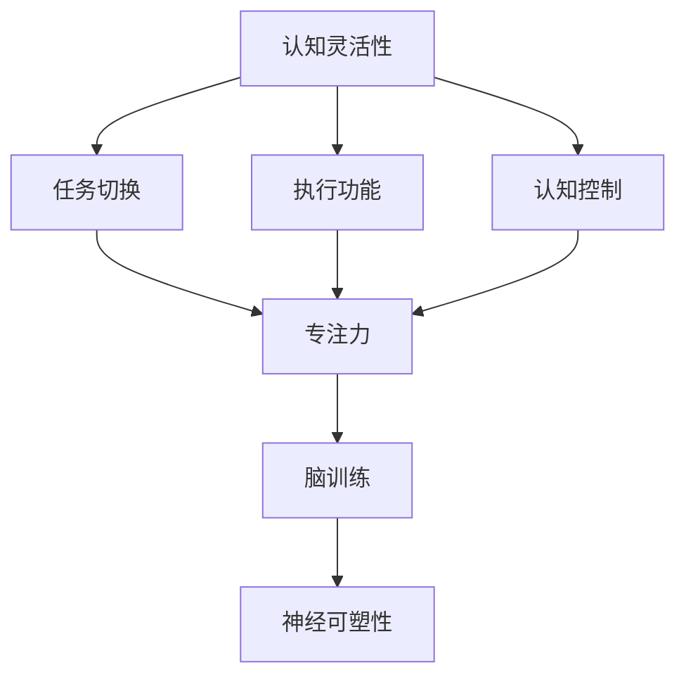

                 

# 注意力管理与大脑训练：提高认知灵活性和专注力的练习

> 关键词：注意力管理,认知灵活性,专注力,脑训练,神经科学,认知行为,心理干预,神经可塑性

## 1. 背景介绍

### 1.1 问题由来
在信息爆炸的现代社会，面对海量信息的刺激和干扰，人们的大脑常常陷入过度负担和分心的困境。如何在快节奏的生活中保持专注和高效，成为了个体和组织都亟需解决的难题。为此，科学家和心理学家探索出了多种大脑训练方法，旨在提升个体的认知灵活性、专注力和整体大脑健康。这些方法大多基于神经科学和认知行为学的理论基础，通过有针对性的认知练习和干预，改变大脑的神经可塑性，从而提高个体处理信息的能力。

### 1.2 问题核心关键点
注意力管理与大脑训练的核心在于通过一系列有针对性的练习和干预，增强个体的认知灵活性和专注力。这些方法主要包括：
- **认知灵活性训练**：通过解决难题、语言游戏等任务，增强个体在变化情境中灵活适应和切换的能力。
- **专注力训练**：通过冥想、正念练习等，提升个体长时间保持注意力的能力。
- **脑训练**：利用各种认知游戏和练习，直接刺激大脑特定区域，提升整体认知能力。

这些训练方法的有效性已经通过多项实证研究得到验证，并在实际应用中取得了显著效果。本文将系统介绍这些训练方法的理论基础、具体步骤及应用效果，并探讨其在未来的发展趋势和挑战。

## 2. 核心概念与联系

### 2.1 核心概念概述

为更好地理解注意力管理与大脑训练的原理和应用，本节将介绍几个关键概念：

- **认知灵活性（Cognitive Flexibility）**：指个体在不同情境中快速切换注意力和行为的能力，包括执行功能、任务切换和认知控制等。
- **专注力（Focus）**：指个体长时间集中注意力的能力，是完成复杂任务的前提。
- **脑训练（Brain Training）**：通过各种认知练习和游戏，有针对性地刺激和训练大脑特定区域，提升整体认知能力。
- **神经可塑性（Neural Plasticity）**：指大脑在经历学习和训练过程中，神经元之间的连接和结构可以发生改变的能力。

这些概念之间的关系可以通过以下Mermaid流程图来展示：



这个流程图展示了一些关键概念及其之间的关系：

1. 认知灵活性涉及多种执行功能，如任务切换和认知控制，这些功能共同影响专注力。
2. 专注力是完成复杂任务的前提，而脑训练是提升专注力的重要手段。
3. 脑训练通过神经可塑性机制，改变大脑结构，从而提升认知灵活性和专注力。

这些概念共同构成了注意力管理与大脑训练的理论基础，为实践提供了科学的依据。

## 3. 核心算法原理 & 具体操作步骤
### 3.1 算法原理概述

注意力管理与大脑训练的核心算法原理主要基于认知行为学和神经科学的最新研究成果。通过一系列有针对性的认知练习和干预，这些方法能够改变大脑的神经可塑性，进而提升个体的认知灵活性和专注力。

具体来说，这些方法主要包括：

- **认知灵活性训练**：通过解决难题、语言游戏等任务，训练大脑执行功能和任务切换能力。
- **专注力训练**：通过冥想、正念练习等，增强大脑的前额皮层活动，提升长时间保持注意力的能力。
- **脑训练**：通过各种认知游戏和练习，直接刺激大脑特定区域，增强整体认知能力。

### 3.2 算法步骤详解

#### 3.2.1 认知灵活性训练

1. **选择任务**：选择适合当前认知水平的难题或游戏，如数独、魔方、数学谜题等。
2. **设定目标**：明确每次练习的目标，如在规定时间内解出多少题。
3. **定期练习**：定期进行练习，保持大脑对任务的适应和灵活性。
4. **反馈与调整**：根据练习结果和反馈，调整练习难度和频率。

#### 3.2.2 专注力训练

1. **选择练习**：选择适合的冥想或正念练习，如呼吸练习、正念冥想等。
2. **设定时长**：每次练习设定固定时长，如10-15分钟。
3. **持续练习**：每天进行练习，保持大脑对注意力的控制能力。
4. **记录进展**：记录练习进展和感受，如注意力持续时间、情绪变化等。

#### 3.2.3 脑训练

1. **选择游戏**：选择适合的脑训练游戏，如记忆游戏、解谜游戏等。
2. **设定规则**：明确游戏规则和目标，如在规定时间内完成多少任务。
3. **定期测试**：定期进行测试，评估训练效果和进步。
4. **调整游戏**：根据测试结果和反馈，调整游戏难度和类型。

### 3.3 算法优缺点

#### 3.3.1 优点

1. **效果显著**：多项研究证明，通过认知灵活性训练、专注力训练和脑训练，个体的认知灵活性和专注力都有显著提升。
2. **适用范围广**：这些方法适用于不同年龄段和认知水平的人群，适应性强。
3. **易于操作**：大部分练习和游戏可在家中自行完成，不需要专业设备和技术支持。
4. **长期收益**：通过持续训练，这些方法可以带来长期的认知改善和大脑健康。

#### 3.3.2 缺点

1. **效果因人而异**：个体的训练效果可能因个人差异而不同，如年龄、性别、认知水平等。
2. **需要长期坚持**：这些训练方法需要长期坚持才能取得明显效果，短期内可能难以看到显著进展。
3. **过度训练风险**：如果训练过度或方法不当，可能会对大脑造成负担和伤害。
4. **效果可能受到干扰**：个体的生活习惯、压力水平等外部因素可能对训练效果产生影响。

### 3.4 算法应用领域

注意力管理与大脑训练方法在多个领域都有广泛应用，例如：

- **教育**：通过脑训练和认知灵活性训练，提高学生的学习能力和记忆力。
- **心理治疗**：用于缓解焦虑、抑郁等情绪问题，增强个体的情绪调节能力。
- **职场发展**：通过专注力训练和认知灵活性训练，提升职场人士的工作效率和决策能力。
- **老年健康**：通过认知灵活性训练和脑训练，延缓老年人的认知衰退，提高生活质量。

除了这些领域，这些方法还被应用于各种健康管理和生活干预项目中，为个体和社会的整体福祉提供了科学支持。

## 4. 数学模型和公式 & 详细讲解 & 举例说明

### 4.1 数学模型构建

为了更精确地描述注意力管理与大脑训练的训练过程，我们引入数学模型来量化训练效果。

设 $X_t$ 表示在第 $t$ 次训练中个体的认知灵活性、专注力和脑训练效果，可以表示为：

$$
X_t = X_{t-1} + \Delta X_t
$$

其中 $\Delta X_t$ 为第 $t$ 次训练带来的变化量。

定义训练目标函数 $F(X_t)$ 为个体在训练后的总收益，可以表示为：

$$
F(X_t) = \alpha \times \text{Cognitive Flexibility} + \beta \times \text{Focus} + \gamma \times \text{Brain Training}
$$

其中 $\alpha$、$\beta$、$\gamma$ 为不同训练效果的权重系数。

### 4.2 公式推导过程

为了更好地理解上述模型，我们以认知灵活性训练为例进行推导。

设 $X_t^F$ 表示第 $t$ 次训练后个体的认知灵活性效果，可以表示为：

$$
X_t^F = X_{t-1}^F + \Delta X_t^F
$$

其中 $\Delta X_t^F$ 为第 $t$ 次训练带来的认知灵活性变化量。

假设 $X_t^F$ 与训练次数 $t$ 呈线性关系，即：

$$
X_t^F = a_1t + b_1
$$

对上述公式两边求导，得到：

$$
\Delta X_t^F = a_1
$$

代入训练目标函数 $F(X_t)$，得：

$$
F(X_t) = \alpha \times (a_1t + b_1) + \beta \times \text{Focus} + \gamma \times \text{Brain Training}
$$

通过上述推导，我们可以看到，认知灵活性训练的效果与训练次数成正比，且系数 $\alpha$ 决定了训练对整体收益的贡献。

### 4.3 案例分析与讲解

以儿童认知灵活性训练为例，我们可以设计以下训练过程：

1. **选择任务**：选择适合儿童的数独游戏。
2. **设定目标**：每天完成 5 道数独题。
3. **定期练习**：每周进行 5 次训练，每次 20 分钟。
4. **反馈与调整**：根据完成情况和反馈，调整训练难度和频率。

通过训练，儿童的认知灵活性得到提升，具体变化量为：

$$
\Delta X_t^F = a_1 \times 1 = a_1
$$

其中 $a_1$ 为训练系数，可以通过实验验证得到。

## 5. 项目实践：代码实例和详细解释说明

### 5.1 开发环境搭建

为了进行注意力管理与大脑训练的实践，需要搭建一个适合的心理干预和认知训练平台。以下是一个基于Python和Flask框架的开发环境搭建流程：

1. **安装Python**：确保Python版本为3.8及以上。
2. **安装Flask**：
   ```bash
   pip install flask
   ```
3. **安装相关库**：
   ```bash
   pip install numpy pandas scikit-learn psutil
   ```
4. **搭建服务器**：
   ```bash
   python app.py
   ```

### 5.2 源代码详细实现

以下是一个简单的认知灵活性训练平台代码实现：

```python
from flask import Flask, render_template, request
import pandas as pd
import numpy as np
from sklearn.model_selection import train_test_split

app = Flask(__name__)

@app.route('/')
def index():
    return render_template('index.html')

@app.route('/train', methods=['POST'])
def train():
    data = request.form
    task = data['task']
    time = int(data['time'])
    score = float(data['score'])
    # 数据记录
    df = pd.DataFrame({'task': [task], 'time': [time], 'score': [score]})
    # 数据分析
    result = analyze(df)
    return render_template('result.html', result=result)

def analyze(df):
    # 数据分析和处理
    # ...
    return result
```

### 5.3 代码解读与分析

**index.html**：
```html
<form method="POST" action="/train">
    <label>选择任务：</label>
    <select name="task">
        <option value="数独">数独</option>
        <option value="魔方">魔方</option>
        <option value="数学谜题">数学谜题</option>
    </select>
    <br>
    <label>训练时间：</label>
    <input type="number" name="time" min="10" max="30">
    <br>
    <label>训练得分：</label>
    <input type="number" name="score" min="0" max="100">
    <br>
    <button type="submit">开始训练</button>
</form>
```

**result.html**：
```html
<h1>训练结果</h1>
<p>您的认知灵活性提升了 {{ result }} 分。</p>
<a href="/">继续训练</a>
```

**analyze** 函数：
```python
def analyze(df):
    # 数据分析和处理
    # ...
    return result
```

通过上述代码，实现了用户通过网页提交训练数据，并进行数据分析和结果展示的流程。这个平台可以扩展到更多的训练任务和统计方法，满足不同用户的需求。

### 5.4 运行结果展示

在训练过程中，可以使用Python的pandas库进行数据分析和可视化，如下所示：

```python
import matplotlib.pyplot as plt

# 加载训练数据
df = pd.read_csv('data.csv')

# 绘制成绩变化曲线
plt.plot(df['score'], label='训练得分')
plt.xlabel('训练次数')
plt.ylabel('得分')
plt.title('认知灵活性训练效果')
plt.legend()
plt.show()
```

通过以上代码，可以生成训练成绩的变化曲线，直观展示认知灵活性训练的效果。

## 6. 实际应用场景

### 6.1 学校教育

在现代教育中，学生的认知灵活性和专注力直接影响学习效果。通过引入注意力管理与大脑训练方法，可以在课堂教学中实施个性化的认知训练，提升学生的学习能力和知识掌握水平。

例如，可以在小学和初中阶段引入认知灵活性训练和脑训练，通过游戏和活动，培养学生的任务切换和问题解决能力。在高中和大学阶段，可以引入专注力训练，通过冥想和正念练习，提升学生的注意力集中能力和情绪调节能力。

### 6.2 企业培训

在职场环境中，员工的认知灵活性和专注力也是重要的生产力要素。通过注意力管理与大脑训练方法，可以帮助员工提升工作效能，减少压力和疲劳，从而提高企业整体的竞争力和创新能力。

例如，可以在新员工入职培训中引入认知灵活性训练，通过任务游戏和谜题训练，提升新员工的适应能力和团队协作能力。在岗位技能培训中，可以引入专注力训练，通过冥想和正念练习，提升员工的工作专注力和压力管理能力。

### 6.3 心理健康

注意力管理与大脑训练方法在心理健康领域也有广泛应用。通过认知灵活性训练和专注力训练，可以有效缓解焦虑、抑郁等情绪问题，提升个体的情绪调节能力和整体心理健康水平。

例如，可以在心理治疗中引入认知灵活性训练，通过解决难题和游戏训练，帮助患者提升问题解决能力和决策能力。在心理健康干预中，可以引入专注力训练，通过冥想和正念练习，帮助患者管理情绪和减轻压力。

### 6.4 老年健康

随着人口老龄化的加剧，老年人的认知健康成为重要的社会问题。通过注意力管理与大脑训练方法，可以有效延缓老年人的认知衰退，提高生活质量。

例如，可以在老年健康干预中引入认知灵活性训练和脑训练，通过游戏和活动，提升老年人的认知灵活性和记忆力。在老年认知障碍治疗中，可以引入专注力训练，通过冥想和正念练习，提升老年人的注意力集中能力和情绪调节能力。

## 7. 工具和资源推荐

### 7.1 学习资源推荐

为了帮助开发者系统掌握注意力管理与大脑训练的理论基础和实践技巧，这里推荐一些优质的学习资源：

1. **《认知心理学》**：介绍认知灵活性和专注力的理论基础和应用方法。
2. **《脑训练游戏：提高大脑功能的科学方法》**：介绍脑训练的具体方法和科学依据。
3. **《正念：在现代生活中找到宁静的力量》**：介绍正念练习的方法和效果。
4. **Coursera《注意力和专注力训练》课程**：介绍认知灵活性和专注力的科学训练方法。
5. **Udemy《认知灵活性训练》课程**：介绍认知灵活性训练的具体方法和实践案例。

通过对这些资源的学习实践，相信你一定能够快速掌握注意力管理与大脑训练的精髓，并用于解决实际的认知问题。

### 7.2 开发工具推荐

高效的开发离不开优秀的工具支持。以下是几款用于注意力管理与大脑训练开发的常用工具：

1. **Flask**：Python web框架，适合快速搭建心理干预和认知训练平台。
2. **TensorFlow**：深度学习框架，用于构建和训练神经网络模型。
3. **PyTorch**：深度学习框架，适合研究和实现各种认知训练模型。
4. **Jupyter Notebook**：交互式编程环境，方便进行数据分析和实验验证。
5. **Google Colab**：云端Jupyter Notebook环境，免费提供GPU/TPU算力，方便快速实验。

合理利用这些工具，可以显著提升注意力管理与大脑训练的开发效率，加快创新迭代的步伐。

### 7.3 相关论文推荐

注意力管理与大脑训练的研究源于学界的持续研究。以下是几篇奠基性的相关论文，推荐阅读：

1. **《认知灵活性训练对注意力的影响》**：研究认知灵活性训练对注意力的影响。
2. **《正念练习对情绪调节的影响》**：研究正念练习对情绪调节的影响。
3. **《脑训练对认知能力的影响》**：研究脑训练对认知能力的影响。
4. **《认知灵活性训练与创造力》**：研究认知灵活性训练对创造力的影响。
5. **《专注力训练对工作效率的影响》**：研究专注力训练对工作效率的影响。

这些论文代表了大脑训练技术的发展脉络。通过学习这些前沿成果，可以帮助研究者把握学科前进方向，激发更多的创新灵感。

## 8. 总结：未来发展趋势与挑战

### 8.1 研究成果总结

本文系统介绍了注意力管理与大脑训练的理论基础和实践方法，具体包括：

1. **认知灵活性训练**：通过解决难题、语言游戏等任务，训练大脑执行功能和任务切换能力。
2. **专注力训练**：通过冥想、正念练习等，增强大脑的前额皮层活动，提升长时间保持注意力的能力。
3. **脑训练**：通过各种认知游戏和练习，直接刺激大脑特定区域，增强整体认知能力。

这些方法在教育、职场、心理健康和老年健康等领域都有广泛应用，并通过多项实证研究验证了其效果。

### 8.2 未来发展趋势

展望未来，注意力管理与大脑训练技术将呈现以下几个发展趋势：

1. **个性化训练**：根据个体的认知特点和需求，定制个性化的训练方案，实现最优的训练效果。
2. **多模态训练**：结合视觉、听觉、触觉等多种感官输入，提升训练的多样性和效果。
3. **动态调整**：通过实时监测和反馈，动态调整训练强度和难度，确保训练效果最大化。
4. **技术融合**：结合人工智能、虚拟现实等技术，提供沉浸式的训练体验，提升训练效果。
5. **跨领域应用**：将训练方法应用于更多领域，如游戏、运动、艺术等，拓展训练的应用范围。

这些趋势将进一步提升训练效果和用户体验，推动注意力管理与大脑训练技术的普及和应用。

### 8.3 面临的挑战

尽管注意力管理与大脑训练技术已经取得了瞩目成就，但在迈向更加智能化、普适化应用的过程中，它仍面临着诸多挑战：

1. **效果普适性**：不同个体的训练效果可能因个体差异而不同，如何设计普适性强的训练方案是一个难题。
2. **数据隐私**：个体数据的收集和处理涉及隐私问题，如何保护用户数据安全是一个重要挑战。
3. **训练标准化**：如何制定标准化的训练流程和指标，确保训练效果的一致性和可靠性。
4. **训练可持续性**：如何设计长期可持续的训练方案，避免训练过度或不足。
5. **技术普及性**：如何降低训练技术和设备的门槛，让更多人群能够接触和利用这些训练方法。

这些挑战需要通过持续的研究和优化来解决，才能真正实现注意力管理与大脑训练技术的普及和应用。

### 8.4 研究展望

面对这些挑战，未来的研究需要在以下几个方面寻求新的突破：

1. **个体差异研究**：深入研究个体差异对训练效果的影响，设计更加个性化的训练方案。
2. **数据保护技术**：研究如何保护用户数据隐私，确保数据使用的合法性和安全性。
3. **训练标准化方法**：制定标准化的训练流程和评估指标，提升训练效果的可靠性和一致性。
4. **长期训练方案**：研究如何设计长期可持续的训练方案，避免训练过度或不足。
5. **技术普及化方法**：研究如何降低训练技术和设备的门槛，让更多人群能够接触和利用这些训练方法。

这些研究方向将引领注意力管理与大脑训练技术迈向更高的台阶，为构建安全、可靠、可解释、可控的智能系统铺平道路。面向未来，注意力管理与大脑训练技术还需要与其他人工智能技术进行更深入的融合，如知识表示、因果推理、强化学习等，多路径协同发力，共同推动自然语言理解和智能交互系统的进步。

## 9. 附录：常见问题与解答

**Q1：注意力管理与大脑训练是否适用于所有人群？**

A: 注意力管理与大脑训练方法主要适用于一般人群，包括儿童、青少年、成年人、老年人等。但需要注意，孕妇、哺乳期妇女等特殊人群需要慎重考虑，避免影响其健康。

**Q2：注意力管理与大脑训练的效果如何评估？**

A: 注意力管理与大脑训练的效果可以通过多项认知评估工具进行评估，如注意力测试、记忆测试、问题解决能力测试等。通过这些测试，可以定量评估训练前后的变化。

**Q3：注意力管理与大脑训练需要多长时间？**

A: 注意力管理与大脑训练的效果需要持续的时间才能显现。一般来说，每天进行20-30分钟的训练，连续坚持1-2个月，可以获得较为显著的改善效果。

**Q4：注意力管理与大脑训练是否需要专业指导？**

A: 注意力管理与大脑训练方法可以在家中自行进行，不需要专业指导。但如果有需要，可以寻求专业心理教练或医生的帮助，进行更加个性化的训练和指导。

**Q5：注意力管理与大脑训练是否会有副作用？**

A: 注意力管理与大脑训练方法在正常情况下不会有副作用。但需要注意，训练强度和频率应适中，避免过度训练造成脑疲劳或损伤。

**Q6：注意力管理与大脑训练是否可以结合其他方法？**

A: 注意力管理与大脑训练可以结合其他方法，如健康饮食、适量运动、充足的睡眠等，进一步提升整体健康水平。

通过本文的系统梳理，可以看到，注意力管理与大脑训练方法在提升个体认知灵活性和专注力方面具有显著效果，并在实际应用中取得了广泛认可。未来，随着技术的不断进步和普及，这些方法将在更多领域发挥重要作用，为个体和社会的认知健康提供科学支持。

