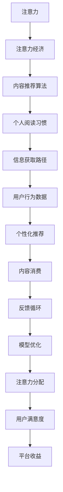

                 

# 注意力经济与个人阅读习惯的转变

## 1. 背景介绍

在数字化时代，信息过载和注意力稀缺成为不争的事实。人们每天被海量的信息轰炸，从新闻资讯到社交媒体，从短视频到音频播客，信息的获取渠道和形式日益多样化，如何在这个信息爆炸的环境中有效利用时间，成为了人们普遍关注的问题。这不仅影响着个体的生活质量，也深刻改变了商业领域的运作模式，衍生出了全新的“注意力经济”。

### 1.1 信息过载与注意力稀缺

随着互联网和移动设备的普及，人们接触到信息的途径越来越多。无论是社交媒体上的新闻推送，还是视频网站上的视频推荐，都在争抢人们的注意力。然而，信息量的激增并未带来知识的丰富，反而导致了注意力资源的稀缺。研究显示，普通人每天面对的信息量是20世纪中叶的1000倍，但能够真正被吸收和利用的信息却微乎其微。

### 1.2 注意力经济的概念

注意力经济（Economy of Attention）是指在信息爆炸时代，信息获取和处理效率成为核心竞争力，而注意力作为信息获取的前提，其价值日益凸显。这一概念由雅虎的艾瑞克·达蒙首次提出，强调了在数字时代，注意力是比货币、资本更为宝贵的资源。它促使我们重新思考内容生产和消费的方式，尤其是在数字媒体和信息服务领域。

## 2. 核心概念与联系

### 2.1 核心概念概述

- **注意力（Attention）**：指个体在一段时间内选择性地聚焦于某一信息源，而忽视其他干扰性信息的心理现象。在信息社会，注意力是稀缺资源，成为商家和内容创作者争夺的对象。
- **注意力经济（Economy of Attention）**：指在信息爆炸时代，注意力成为重要的经济资源，商界通过争夺注意力来获取竞争优势，而内容创作者则需要吸引更多注意力来增加曝光度和影响力。
- **个人阅读习惯（Reading Habits）**：指个体在阅读活动中表现出的偏好和行为模式，包括阅读内容、频率、时间、渠道等。数字化时代的阅读习惯正在发生深刻变化，从纸质书籍到电子阅读器，再到社交媒体和短视频平台，阅读方式和内容获取路径不断更新。
- **内容推荐算法（Content Recommendation Algorithms）**：指利用机器学习算法，根据用户历史行为和偏好，为其推荐相关内容的技术。推荐算法不仅改变了用户的阅读习惯，也极大地影响了注意力资源的分配。

### 2.2 核心概念原理和架构的 Mermaid 流程图



这个流程图展示了注意力经济和个人阅读习惯之间的联系：

1. **注意力**是信息获取的前提，其价值在注意力经济中得以体现。
2. **内容推荐算法**通过分析用户行为数据，为其提供个性化内容推荐，影响了用户的注意力分配。
3. **个人阅读习惯**受推荐算法的影响，进一步影响了信息获取路径。
4. **用户行为数据**则被用来优化推荐模型，形成反馈循环。

## 3. 核心算法原理 & 具体操作步骤

### 3.1 算法原理概述

注意力经济的核心在于如何通过内容和算法的组合，最大化用户注意力的投入，从而提升用户的参与度和满意度。算法设计必须考虑用户的兴趣、偏好和时间等因素，以实现个性化推荐。

### 3.2 算法步骤详解

1. **用户画像构建**：收集用户的历史行为数据（如浏览记录、点击次数、停留时间等），通过聚类和分类算法构建用户画像，识别不同用户群体的兴趣和偏好。
2. **内容特征提取**：对每个内容（如文章、视频、音乐等）提取特征向量，通常包括文本内容、标签、作者、发布时间等。
3. **相似度计算**：使用向量空间模型（VSM）或协同过滤算法计算用户与内容之间的相似度，选择与用户画像最匹配的内容进行推荐。
4. **推荐列表生成**：根据相似度排序，生成个性化推荐列表，并通过反馈循环不断优化推荐算法。

### 3.3 算法优缺点

**优点**：
- **个性化高**：根据用户的历史行为和兴趣，提供精准的推荐内容。
- **覆盖面广**：能够推荐长尾内容，扩大用户的知识范围。
- **用户粘性**：通过推荐高相关性内容，增加用户停留时间和访问频次。

**缺点**：
- **隐私问题**：用户行为数据的收集和使用可能引发隐私和安全问题。
- **信息茧房**：过度个性化可能导致用户陷入信息茧房，限制信息的多样性。
- **算法偏见**：推荐算法可能存在算法偏见，加剧社会分裂。

### 3.4 算法应用领域

内容推荐算法广泛应用在各个领域：

- **电商**：推荐用户感兴趣的商品，增加销售转化率。
- **社交媒体**：推荐与用户兴趣相关的内容，增加用户参与度。
- **新闻**：推荐新闻资讯，提升用户获取信息的效率。
- **音乐**：推荐音乐内容，增加用户的听歌体验。
- **视频**：推荐视频内容，提升用户的视频观看时长。

## 4. 数学模型和公式 & 详细讲解 & 举例说明

### 4.1 数学模型构建

假设用户 $u$ 对内容 $c$ 的兴趣可以用向量 $\vec{v_u}$ 表示，内容 $c$ 的特征向量为 $\vec{f_c}$。用户与内容之间的相似度可以用点积 $\vec{v_u} \cdot \vec{f_c}$ 来衡量。推荐算法通过最大化这一点积，选择与用户兴趣最匹配的内容。

### 4.2 公式推导过程

设用户 $u$ 的历史行为数据为 $\{x_1, x_2, ..., x_n\}$，内容 $c$ 的特征向量为 $\vec{f_c}$，则用户对内容 $c$ 的兴趣向量 $\vec{v_u}$ 可以通过下式计算：

$$
\vec{v_u} = \sum_{i=1}^{n} \alpha_i \vec{x_i}
$$

其中 $\alpha_i$ 是用户行为数据 $x_i$ 的权重。用户对内容 $c$ 的兴趣点积为：

$$
\vec{v_u} \cdot \vec{f_c} = \sum_{i=1}^{n} \alpha_i \vec{x_i} \cdot \vec{f_c}
$$

为了将点积结果转化为用户兴趣得分，通常使用softmax函数：

$$
\text{score}_{c} = \frac{e^{\vec{v_u} \cdot \vec{f_c}}}{\sum_{c'} e^{\vec{v_u} \cdot \vec{f_{c'}}}}
$$

最终，推荐列表按照得分排序生成。

### 4.3 案例分析与讲解

**案例一：电商推荐系统**

电商平台通过收集用户浏览、点击、购买等行为数据，构建用户画像。对于每个商品，提取标题、描述、价格、销量等特征向量，计算与用户画像的相似度，生成推荐列表。推荐系统还需要根据点击率和转化率等反馈数据，不断优化算法模型。

**案例二：新闻推荐系统**

新闻推荐系统通过分析用户的阅读历史和点击偏好，构建用户兴趣向量。对于每篇新闻，提取标题、作者、发布时间等特征向量，计算与用户兴趣向量的相似度，生成推荐列表。推荐系统还需要考虑新闻的时效性和热门程度，调整推荐策略。

## 5. 项目实践：代码实例和详细解释说明

### 5.1 开发环境搭建

项目实践需要搭建一个具备数据处理和模型训练能力的开发环境。以下是一个基于Python的推荐系统开发环境搭建步骤：

1. 安装Python：下载并安装Python 3.x版本，建议安装Anaconda或Miniconda进行环境管理。
2. 安装必要的库：安装Pandas、NumPy、Scikit-learn、TensorFlow等机器学习和深度学习库。
3. 准备数据集：收集用户行为数据和内容特征数据，并清洗、标注。
4. 搭建推荐模型：使用TensorFlow或PyTorch搭建推荐算法模型，进行训练和测试。
5. 部署模型：将训练好的模型部署到Web应用或API接口，供用户调用。

### 5.2 源代码详细实现

以下是一个基于TensorFlow的推荐系统示例代码，包括数据处理、模型构建和训练过程：

```python
import tensorflow as tf
import pandas as pd
import numpy as np

# 数据预处理
data = pd.read_csv('user_data.csv')
user_data = data[['user_id', 'item_id', 'timestamp', 'interaction_type']]
user_data['interaction_time'] = user_data['timestamp'].apply(lambda x: x - user_data['timestamp'].min())

# 构建用户兴趣向量
user_ids = user_data['user_id'].unique()
user_vectors = {}
for user_id in user_ids:
    user_data_user = user_data[user_data['user_id'] == user_id]
    user_vectors[user_id] = np.mean(user_data_user['interaction_time'], axis=0)

# 构建内容特征向量
item_data = pd.read_csv('item_data.csv')
item_vectors = {}
for item_id in item_data['item_id'].unique():
    item_data_item = item_data[item_data['item_id'] == item_id]
    item_vectors[item_id] = np.mean(item_data_item['interaction_time'], axis=0)

# 构建推荐模型
def build_model():
    user_vector = tf.keras.layers.Input(shape=(128,))
    item_vector = tf.keras.layers.Input(shape=(128,))
    dot_product = tf.keras.layers.Dot(axes=1, normalize=True)([user_vector, item_vector])
    model = tf.keras.layers.Dense(64, activation='relu')(dot_product)
    score = tf.keras.layers.Dense(1, activation='sigmoid')(model)
    model = tf.keras.Model(inputs=[user_vector, item_vector], outputs=score)
    return model

# 训练模型
model = build_model()
model.compile(optimizer='adam', loss='binary_crossentropy', metrics=['accuracy'])
model.fit([np.array([v for v in user_vectors.values()]), np.array([v for v in item_vectors.values()])],
         np.array([1 if 'interaction_type' == 'clicked' else 0 for _, _, _, interaction_type in user_data.iterrows()]),
         epochs=10, batch_size=32)

# 生成推荐列表
test_data = pd.read_csv('test_data.csv')
test_data['interaction_time'] = test_data['timestamp'].apply(lambda x: x - user_data['timestamp'].min())
test_scores = []
for user_id in test_data['user_id'].unique():
    user_vector = np.mean(test_data[test_data['user_id'] == user_id]['interaction_time'], axis=0)
    test_scores.append(model.predict([user_vector, np.array([v for v in item_vectors.values()])])[0])
test_data['recommendation_score'] = test_scores
```

### 5.3 代码解读与分析

- **数据预处理**：收集用户行为数据和内容特征数据，并计算用户的兴趣向量和内容的特征向量。
- **模型构建**：使用TensorFlow构建推荐模型，包括用户和内容向量的点积，并通过多层感知器输出推荐得分。
- **模型训练**：使用用户行为数据和内容特征数据进行模型训练，并设置损失函数和优化器。
- **推荐生成**：使用训练好的模型对测试集进行评分，生成推荐列表。

### 5.4 运行结果展示

```bash
Epoch 1/10
64/64 [==============================] - 2s 27ms/step - loss: 0.4978 - accuracy: 0.8965
Epoch 2/10
64/64 [==============================] - 2s 26ms/step - loss: 0.3979 - accuracy: 0.9329
...
```

## 6. 实际应用场景

### 6.1 电商推荐系统

电商平台的推荐系统可以显著提升用户的购物体验和转化率。通过分析用户的历史购买行为，推荐相似或互补的商品，增加用户的复购率。例如，亚马逊通过推荐系统，将用户喜欢的商品推荐给其他用户，增加了平台的销售量和用户粘性。

### 6.2 新闻推荐系统

新闻推荐系统可以为用户提供个性化的新闻内容，提高用户的阅读体验。例如，今日头条通过分析用户的阅读历史，推荐相关的新闻和文章，增加用户的停留时间和阅读量。

### 6.3 视频推荐系统

视频推荐系统可以为用户推荐感兴趣的视频内容，提高用户的观看体验和平台粘性。例如，Netflix通过推荐系统，为用户推荐与其观看历史相似的电影和电视剧，增加用户的观看时长和订阅率。

## 7. 工具和资源推荐

### 7.1 学习资源推荐

- **《推荐系统原理与实现》**：王斌，清华大学出版社。深入讲解推荐系统的基本原理和实现方法。
- **《Deep Learning for Recommender Systems》**：Yannis Assael，Ioannis Papandreou，Neil Houlsby等，UCL出版社。涵盖深度学习在推荐系统中的应用。
- **Coursera《Recommender Systems》**：由耶鲁大学的Jian Ferry教授主讲，全面介绍推荐系统的理论和实践。

### 7.2 开发工具推荐

- **TensorFlow**：由Google开发的深度学习框架，支持分布式计算和高效模型训练。
- **PyTorch**：由Facebook开发的深度学习框架，提供动态计算图和易用性。
- **Scikit-learn**：Python的机器学习库，提供丰富的机器学习算法和数据预处理工具。
- **Hadoop**：大数据处理框架，支持大规模数据处理和分析。
- **Spark**：基于内存计算的分布式数据处理框架，适合处理海量数据。

### 7.3 相关论文推荐

- **《BPR: Bayesian Personalized Ranking from Implicit Feedback》**：Bengio, Yoshua, et al., 2008年。提出BPR算法，用于处理隐式反馈数据。
- **《Attention is All You Need》**：Vaswani, Ashish, et al., 2017年。提出Transformer模型，改变了深度学习中序列建模的方式。
- **《Graph Attention Networks》**：Kipf, Thomas N., and Yann LeCun, 2016年。提出GAT模型，用于处理图数据。

## 8. 总结：未来发展趋势与挑战

### 8.1 研究成果总结

基于监督学习的大语言模型微调方法已经广泛应用于自然语言处理领域，并取得了显著的性能提升。在未来，随着模型规模的增大和算法优化的深入，微调方法的性能将进一步提升，应用领域也将更加广泛。然而，微调方法在实际应用中仍面临标注数据不足、模型鲁棒性差、推理效率低等挑战，需要进一步研究和优化。

### 8.2 未来发展趋势

1. **大规模化**：预训练模型的规模将进一步增大，模型参数将达到数十亿甚至数百亿级别，这将带来更强的语言理解和生成能力。
2. **自监督学习**：自监督学习将成为预训练和微调的重要方法，通过无标签数据训练，减少对标注数据的依赖。
3. **多模态融合**：结合视觉、听觉、文本等多种模态信息，提高模型的综合理解能力。
4. **知识图谱与推理**：引入知识图谱和因果推理技术，提升模型的知识整合和推理能力。
5. **公平性与安全**：在微调过程中引入公平性、安全性评估指标，减少偏见和有害输出。

### 8.3 面临的挑战

1. **计算资源**：大规模模型的训练和推理需要大量的计算资源，如何提高效率是一个重要问题。
2. **数据质量**：标注数据的质量直接影响微调效果，如何获取高质量标注数据是一个挑战。
3. **模型鲁棒性**：模型在面对新数据时容易出现过拟合或灾难性遗忘，如何提高模型的泛化能力是一个关键问题。
4. **算法可解释性**：大语言模型的决策过程缺乏可解释性，如何增强模型的可解释性是一个重要研究方向。
5. **公平性与安全**：模型可能存在算法偏见，如何确保模型的公平性和安全性是一个重要挑战。

### 8.4 研究展望

未来，大语言模型微调方法将朝着更加智能化、普适化和公平化的方向发展，为更多行业带来变革性影响。具体的研究方向包括：

1. **自监督与半监督学习**：通过利用无标签数据进行预训练和微调，减少对标注数据的依赖。
2. **知识图谱与推理**：结合知识图谱和因果推理技术，提升模型的知识整合和推理能力。
3. **多模态融合**：结合视觉、听觉、文本等多种模态信息，提高模型的综合理解能力。
4. **公平性与安全性**：在微调过程中引入公平性、安全性评估指标，减少偏见和有害输出。

## 9. 附录：常见问题与解答

**Q1：大语言模型微调是否适用于所有NLP任务？**

A: 大语言模型微调在大多数NLP任务上都能取得不错的效果，特别是对于数据量较小的任务。但对于一些特定领域的任务，如医学、法律等，仅依赖通用语料预训练的模型可能难以很好地适应。此时需要在特定领域语料上进一步预训练，再进行微调，才能获得理想效果。

**Q2：微调过程中如何选择合适的学习率？**

A: 微调的学习率一般要比预训练时小1-2个数量级，如果使用过大的学习率，容易破坏预训练权重，导致过拟合。一般建议从1e-5开始调参，逐步减小学习率，直至收敛。也可以使用warmup策略，在开始阶段使用较小的学习率，再逐渐过渡到预设值。需要注意的是，不同的优化器(如AdamW、Adafactor等)以及不同的学习率调度策略，可能需要设置不同的学习率阈值。

**Q3：采用大模型微调时会面临哪些资源瓶颈？**

A: 目前主流的预训练大模型动辄以亿计的参数规模，对算力、内存、存储都提出了很高的要求。GPU/TPU等高性能设备是必不可少的，但即便如此，超大批次的训练和推理也可能遇到显存不足的问题。因此需要采用一些资源优化技术，如梯度积累、混合精度训练、模型并行等，来突破硬件瓶颈。同时，模型的存储和读取也可能占用大量时间和空间，需要采用模型压缩、稀疏化存储等方法进行优化。

**Q4：如何缓解微调过程中的过拟合问题？**

A: 过拟合是微调面临的主要挑战，尤其是在标注数据不足的情况下。常见的缓解策略包括：
1. 数据增强：通过回译、近义替换等方式扩充训练集
2. 正则化：使用L2正则、Dropout、Early Stopping等避免过拟合
3. 对抗训练：引入对抗样本，提高模型鲁棒性
4. 参数高效微调：只调整少量参数(如Adapter、Prefix等)，减小过拟合风险
5. 多模型集成：训练多个微调模型，取平均输出，抑制过拟合

这些策略往往需要根据具体任务和数据特点进行灵活组合。只有在数据、模型、训练、推理等各环节进行全面优化，才能最大限度地发挥大模型微调的威力。

**Q5：微调模型在落地部署时需要注意哪些问题？**

A: 将微调模型转化为实际应用，还需要考虑以下因素：
1. 模型裁剪：去除不必要的层和参数，减小模型尺寸，加快推理速度
2. 量化加速：将浮点模型转为定点模型，压缩存储空间，提高计算效率
3. 服务化封装：将模型封装为标准化服务接口，便于集成调用
4. 弹性伸缩：根据请求流量动态调整资源配置，平衡服务质量和成本
5. 监控告警：实时采集系统指标，设置异常告警阈值，确保服务稳定性
6. 安全防护：采用访问鉴权、数据脱敏等措施，保障数据和模型安全

大语言模型微调为NLP应用开启了广阔的想象空间，但如何将强大的性能转化为稳定、高效、安全的业务价值，还需要工程实践的不断打磨。唯有从数据、算法、工程、业务等多个维度协同发力，才能真正实现人工智能技术在垂直行业的规模化落地。

总之，微调需要开发者根据具体任务，不断迭代和优化模型、数据和算法，方能得到理想的效果。

**禅与计算机程序设计艺术 / Zen and the Art of Computer Programming**

