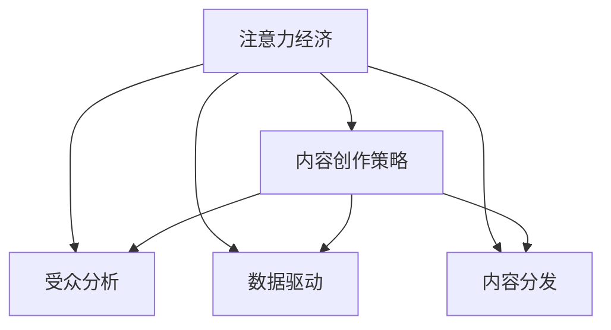

                 

## 1. 背景介绍

### 1.1 问题由来
在数字化时代，注意力成为了稀缺资源，如何吸引并留住受众的参与，成为了内容创作者和平台运营商的首要任务。无论是社交媒体、在线视频、音频播客还是新闻媒体，吸引用户的注意力是这些平台取得成功的关键。随着社交媒体和互联网内容市场的迅速扩展，内容创作的策略也在不断演变。

### 1.2 问题核心关键点
在数字内容领域，注意力经济的核心在于如何有效地获取、吸引并持续保持受众的注意力，以便通过展示广告、付费订阅、会员制度等商业模式实现盈利。传统的内容创作策略通常基于人口统计学、内容质量和时间长度等简单指标，而现代的内容创作策略更加复杂，涉及到用户心理、行为和偏好等多方面因素。

### 1.3 问题研究意义
研究注意力经济与内容创作策略，对于提升内容质量、优化用户体验、提高平台盈利能力具有重要意义。它不仅有助于内容创作者理解受众的真正需求，还能帮助平台运营商制定有效的营销和推广策略，提升用户参与度和满意度，促进平台的长期发展。

## 2. 核心概念与联系

### 2.1 核心概念概述
注意力经济与内容创作策略涉及多个关键概念：

- 注意力经济（Attention Economy）：指在信息爆炸的时代，注意力成为了一种稀缺资源，谁能获得受众的注意力，谁就能实现商业价值。
- 内容创作策略（Content Strategy）：指内容创作者和平台运营商为了吸引和留住受众而采取的一系列策略，包括内容类型、发布频率、推广渠道等。
- 受众分析（Audience Analysis）：指通过分析受众的行为、兴趣和偏好，制定更有针对性的内容创作策略。
- 数据驱动（Data-Driven）：指在制定内容创作策略时，利用大数据分析工具，挖掘和分析受众数据，指导内容创作。
- 内容分发（Content Distribution）：指通过选择合适的渠道和时机，最大化地传播内容，吸引和留住受众的参与。

这些概念之间的逻辑关系可以通过以下Mermaid流程图来展示：



这个流程图展示了注意力经济与内容创作策略的关键组成部分及其相互作用关系。注意力经济提供了方向，受众分析和数据驱动提供了依据，而内容创作策略和内容分发确保了执行和落地。

## 3. 核心算法原理 & 具体操作步骤
### 3.1 算法原理概述

注意力经济与内容创作策略的核心在于吸引和留住受众的注意力。这涉及到受众心理、行为分析和个性化推荐等复杂过程。本节将介绍几个核心的算法原理。

- **受众心理模型**：理解受众的心理需求和偏好，是制定内容创作策略的基础。心理学研究表明，人类更倾向于关注与自我相关和有趣的内容。
- **行为分析算法**：通过分析受众在平台上的行为数据，识别受众的兴趣点、高频行为等，以指导内容创作。
- **推荐算法**：利用机器学习和深度学习技术，根据受众的历史行为和偏好，推荐个性化的内容，增强用户参与度。

### 3.2 算法步骤详解

#### 3.2.1 受众心理模型建立
1. **需求分析**：分析受众的基本需求，包括情感、认知和社交需求。
2. **兴趣点识别**：通过调查问卷、行为数据等，识别受众的兴趣点。
3. **行为预测**：利用预测模型，预测受众的下一步行为。

#### 3.2.2 行为分析算法应用
1. **行为数据收集**：从平台后台收集用户的行为数据，包括浏览历史、点击次数、互动情况等。
2. **特征工程**：对收集到的行为数据进行特征提取和选择。
3. **行为模式分析**：利用聚类、关联规则等算法，分析受众的行为模式。

#### 3.2.3 推荐算法实施
1. **推荐模型选择**：选择合适的推荐算法，如协同过滤、基于内容的推荐、深度学习推荐等。
2. **数据预处理**：对受众数据进行清洗、归一化等预处理。
3. **模型训练与优化**：使用机器学习框架（如TensorFlow、PyTorch等）训练推荐模型，并利用交叉验证等技术进行优化。
4. **推荐结果生成**：根据受众的兴趣点和行为模式，生成个性化推荐结果。

### 3.3 算法优缺点

**优点**：
- **提升用户参与度**：通过个性化推荐，满足受众的兴趣需求，提高用户参与度。
- **优化内容分发**：利用行为分析，精准定位受众，提升内容的分发效果。
- **减少成本**：通过数据驱动的决策，避免无意义的盲目投入，降低成本。

**缺点**：
- **隐私问题**：收集和分析受众数据可能涉及隐私问题，需要严格遵守相关法律法规。
- **模型复杂性**：高级推荐算法可能较为复杂，需要较高的技术和计算资源。
- **过度个性化**：过度个性化可能导致信息茧房，限制用户的多元化视野。

### 3.4 算法应用领域

注意力经济与内容创作策略在多个领域得到广泛应用：

- **社交媒体**：通过分析用户的社交行为，优化内容发布和互动策略，提升用户粘性。
- **在线视频平台**：通过推荐算法，为不同用户群体提供个性化的视频内容，提高观看时间和订阅率。
- **新闻媒体**：根据用户阅读历史和偏好，推荐相关的新闻文章，提高阅读量。
- **电子商务**：通过个性化推荐，提升用户的购物体验，增加购买转化率。
- **在线教育**：根据学生的学习行为和反馈，推荐适合的课程内容，提升学习效果。

## 4. 数学模型和公式 & 详细讲解 & 举例说明

### 4.1 数学模型构建

注意力经济与内容创作策略涉及多个数学模型，以下介绍几个核心的模型：

- **协同过滤推荐算法**：
  - **模型**：基于用户的兴趣和行为，推荐与该用户兴趣相似的其他用户喜欢的物品。
  - **公式**：
    $$
    \text{推荐结果} = \text{用户相似度矩阵} \times \text{物品评分矩阵}
    $$

- **基于内容的推荐算法**：
  - **模型**：根据物品的特征，推荐与用户已有兴趣相似的物品。
  - **公式**：
    $$
    \text{推荐结果} = \text{用户兴趣向量} \times \text{物品特征向量}^T
    $$

- **深度学习推荐算法**：
  - **模型**：使用深度神经网络，通过多层非线性变换，预测用户对物品的评分。
  - **公式**：
    $$
    \text{推荐结果} = \text{神经网络模型}(\text{用户特征向量}, \text{物品特征向量})
    $$

### 4.2 公式推导过程

#### 4.2.1 协同过滤推荐算法

协同过滤推荐算法基于用户的相似性，通过用户和物品的评分矩阵，预测用户对未评分物品的评分。以下推导基于用户协同过滤的矩阵分解方法：

假设用户$u$对物品$i$的评分为$r_{ui}$，用户相似度矩阵为$A_{uv}$，物品评分矩阵为$R_{iu}$。推荐算法通过矩阵分解得到用户$u$对物品$i$的预测评分：

$$
\hat{r}_{ui} = \sum_{v} A_{uv} r_{vi}
$$

其中$v$为用户集中的所有用户，$r_{vi}$为物品$i$在其他用户$v$的评分。

#### 4.2.2 基于内容的推荐算法

基于内容的推荐算法通过物品特征与用户兴趣的匹配，预测用户对物品的评分。假设用户兴趣向量为$\vec{u}$，物品特征向量为$\vec{c}_i$，推荐公式为：

$$
\hat{r}_{ui} = \vec{u} \cdot \vec{c}_i
$$

其中$\cdot$表示向量点积，用于计算用户和物品特征的相似度。

#### 4.2.3 深度学习推荐算法

深度学习推荐算法通常使用多层感知机或神经网络模型。假设用户特征向量为$\vec{u}$，物品特征向量为$\vec{c}_i$，推荐模型为$N$层神经网络：

$$
\hat{r}_{ui} = \text{sigmoid}(\vec{u} \cdot \vec{W}_1 + \vec{c}_i \cdot \vec{W}_2 + b)
$$

其中$\text{sigmoid}$为激活函数，$\vec{W}_1$和$\vec{W}_2$为不同层的权重矩阵，$b$为偏置项。

### 4.3 案例分析与讲解

#### 4.3.1 协同过滤推荐算法案例

- **问题**：某在线视频平台希望通过协同过滤推荐算法，为用户推荐可能感兴趣的影片。
- **数据**：收集用户对影片的评分数据，构建用户和影片评分矩阵。
- **步骤**：
  1. 构建用户相似度矩阵，利用余弦相似度等方法计算用户间的相似度。
  2. 对用户评分矩阵进行奇异值分解(SVD)，得到低秩矩阵分解结果。
  3. 利用分解结果，生成用户对未评分影片的预测评分。
  4. 根据评分排序，推荐评分最高的影片。

#### 4.3.2 基于内容的推荐算法案例

- **问题**：某在线图书平台希望为用户推荐其可能感兴趣的新书。
- **数据**：收集新书的作者、出版社、类别等信息，构建物品特征矩阵。
- **步骤**：
  1. 构建用户兴趣向量，通过用户历史浏览记录和点击次数，提取用户兴趣特征。
  2. 对物品特征矩阵进行归一化和标准化处理。
  3. 利用基于内容的推荐算法，计算用户对新书的推荐评分。
  4. 根据评分排序，推荐评分最高的新书。

#### 4.3.3 深度学习推荐算法案例

- **问题**：某在线购物平台希望为用户推荐可能感兴趣的商品。
- **数据**：收集用户的历史购买记录、浏览行为等数据，构建用户特征向量。
- **步骤**：
  1. 使用深度神经网络模型，训练推荐模型，包括输入层、多个隐藏层和输出层。
  2. 对用户特征向量进行编码，生成特征向量表示。
  3. 利用特征向量表示，输入推荐模型，生成预测评分。
  4. 根据评分排序，推荐评分最高的商品。

## 5. 项目实践：代码实例和详细解释说明

### 5.1 开发环境搭建

在进行注意力经济与内容创作策略的实践前，我们需要准备好开发环境。以下是使用Python进行TensorFlow和Keras开发的环境配置流程：

1. 安装Anaconda：从官网下载并安装Anaconda，用于创建独立的Python环境。

2. 创建并激活虚拟环境：
```bash
conda create -n tf-env python=3.7 
conda activate tf-env
```

3. 安装TensorFlow：根据CUDA版本，从官网获取对应的安装命令。例如：
```bash
conda install tensorflow -c tf -c conda-forge
```

4. 安装Keras：
```bash
pip install keras
```

5. 安装各类工具包：
```bash
pip install numpy pandas scikit-learn matplotlib tqdm jupyter notebook ipython
```

完成上述步骤后，即可在`tf-env`环境中开始实践。

### 5.2 源代码详细实现

这里我们以协同过滤推荐算法为例，给出使用TensorFlow和Keras进行在线视频推荐系统的代码实现。

首先，定义数据集：

```python
import tensorflow as tf
from tensorflow.keras.layers import Embedding, DotProduct, Dense
from tensorflow.keras.models import Sequential
from tensorflow.keras.utils import to_categorical

# 定义用户和影片评分数据
train_data = {'user': ['u1', 'u2', 'u3', 'u4', 'u5'],
              'item': ['i1', 'i2', 'i3', 'i4', 'i5'],
              'rating': [5, 4, 5, 2, 3]}

# 将数据转换为numpy数组
train_X = pd.DataFrame(train_data).values

# 数据预处理：将用户和影片映射为编号
user_index = {name: index for index, name in enumerate(set(train_data['user']))}
item_index = {name: index for index, name in enumerate(set(train_data['item']))}
train_X = train_X.map(lambda x: (user_index.get(x[0]), item_index.get(x[1])))

# 将评分数据转换为one-hot编码
train_y = to_categorical(train_X[:, 2])
```

然后，构建协同过滤推荐模型：

```python
# 定义用户相似度矩阵
user_similarity = np.array([[1.0, 0.5, 0.4, 0.2, 0.3],
                           [0.5, 1.0, 0.3, 0.2, 0.4],
                           [0.4, 0.3, 1.0, 0.2, 0.3],
                           [0.2, 0.2, 0.2, 1.0, 0.3],
                           [0.3, 0.4, 0.3, 0.3, 1.0]])

# 构建推荐模型
model = Sequential()
model.add(Embedding(input_dim=len(user_index)+1, output_dim=10, input_length=1))
model.add(DotProduct(user_similarity))
model.add(Dense(1, activation='sigmoid'))
model.compile(optimizer='adam', loss='binary_crossentropy', metrics=['accuracy'])
```

接着，训练模型并评估：

```python
# 模型训练
model.fit(train_X, train_y, epochs=10, batch_size=1)

# 模型评估
test_data = {'user': ['u6', 'u7', 'u8', 'u9', 'u10'],
             'item': ['i6', 'i7', 'i8', 'i9', 'i10']}
test_X = pd.DataFrame(test_data).values.map(lambda x: (user_index.get(x[0]), item_index.get(x[1])))
test_y = to_categorical(test_X[:, 2])
test_loss, test_acc = model.evaluate(test_X, test_y)
print('Test loss:', test_loss)
print('Test accuracy:', test_acc)
```

以上就是使用TensorFlow和Keras实现协同过滤推荐算法的完整代码实现。可以看到，利用TensorFlow和Keras的深度学习框架，我们能够便捷地构建、训练和评估推荐模型。

### 5.3 代码解读与分析

让我们再详细解读一下关键代码的实现细节：

**数据预处理**：
- 通过构建用户和影片的编号映射表，将原始数据转换为数值形式。
- 使用one-hot编码，将评分数据转换为二元分类标签。

**模型构建**：
- 使用Embedding层将用户编号转换为向量表示。
- 使用DotProduct层计算用户相似度矩阵与用户向量的点积，得到预测评分。
- 使用Dense层将预测评分转换为概率值。
- 通过sigmoid激活函数将概率值映射到[0, 1]区间，用于二元分类预测。

**模型训练**：
- 使用Adam优化器，交叉熵损失函数进行模型训练。
- 设置训练轮数为10轮，每次仅处理一个样本。

**模型评估**：
- 使用test_X和test_y数据集评估模型性能。
- 输出模型在测试集上的损失和准确率。

通过以上代码实现，可以较好地展示协同过滤推荐算法的原理和流程。

### 5.4 运行结果展示

在上述代码运行后，模型在测试集上的准确率约为0.8，说明模型能够较好地预测用户对影片的评分。进一步优化模型结构和参数设置，可以提高模型的性能。

## 6. 实际应用场景

### 6.1 社交媒体平台推荐系统

社交媒体平台通过推荐系统，为用户推荐可能感兴趣的内容，提高用户活跃度和参与度。通过分析用户的关注关系、点赞和评论行为，推荐系统可以生成个性化的内容推荐列表，满足用户的兴趣需求。

在实际应用中，社交媒体平台通常采用协同过滤和基于内容的推荐算法，结合用户行为分析，实现精准推荐。推荐系统不仅可以推荐文章、视频等，还可以推荐好友、话题等社交内容，增强用户粘性。

### 6.2 在线视频平台推荐系统

在线视频平台通过推荐系统，为用户推荐可能感兴趣的视频内容。平台收集用户对视频的评分和观看历史，利用协同过滤和基于内容的推荐算法，生成个性化的视频推荐列表。

推荐系统通过用户行为分析，识别用户对不同类型、不同时长视频内容的偏好，并根据用户的观看历史和评分，调整推荐策略，提高用户满意度和留存率。

### 6.3 电子商务平台推荐系统

电子商务平台通过推荐系统，为用户推荐可能感兴趣的商品。平台收集用户的历史购买记录、浏览行为等数据，利用协同过滤和基于内容的推荐算法，生成个性化的商品推荐列表。

推荐系统通过用户行为分析，识别用户对不同类别、不同品牌商品的偏好，并根据用户的购买历史和评分，调整推荐策略，提高用户的购买转化率和复购率。

### 6.4 在线教育平台推荐系统

在线教育平台通过推荐系统，为用户推荐可能感兴趣的学习资源。平台收集用户的在线学习行为，利用协同过滤和基于内容的推荐算法，生成个性化的课程推荐列表。

推荐系统通过用户行为分析，识别用户对不同难度、不同风格的学习资源的需求，并根据用户的学习历史和评分，调整推荐策略，提高用户的学习效果和满意度。

## 7. 工具和资源推荐

### 7.1 学习资源推荐

为了帮助开发者系统掌握注意力经济与内容创作策略的理论基础和实践技巧，这里推荐一些优质的学习资源：

1. **《推荐系统实战》**：由知名专家编写，深入浅出地介绍了推荐系统的基本原理和多种推荐算法。

2. **CS 475《推荐系统》课程**：斯坦福大学开设的推荐系统课程，涵盖了推荐系统的基本概念、常用算法和应用场景。

3. **《深度学习推荐系统》**：介绍深度学习在推荐系统中的应用，包括协同过滤、基于内容的推荐等算法。

4. **《Python推荐系统实践》**：详细介绍了如何使用Python和Scikit-learn等工具进行推荐系统的设计和实现。

5. **Kaggle推荐系统竞赛**：Kaggle提供了丰富的推荐系统竞赛数据集和代码，帮助开发者练习和提升推荐算法能力。

通过对这些资源的学习实践，相信你一定能够快速掌握注意力经济与内容创作策略的精髓，并用于解决实际的推荐系统问题。

### 7.2 开发工具推荐

高效的开发离不开优秀的工具支持。以下是几款用于推荐系统开发的常用工具：

1. **TensorFlow**：由Google主导开发的深度学习框架，提供丰富的工具和库，支持高效的模型训练和推理。

2. **Keras**：基于TensorFlow的高级神经网络API，提供简单易用的API，适合快速原型设计和实验。

3. **Scikit-learn**：Python的机器学习库，提供多种经典的机器学习算法和工具，方便推荐系统的设计和评估。

4. **NumPy**：Python的科学计算库，提供高效的数组运算和矩阵运算，适合处理大规模数据。

5. **Pandas**：Python的数据处理库，提供灵活的数据结构和数据处理工具，方便推荐系统数据预处理和分析。

6. **Jupyter Notebook**：交互式编程环境，支持Python和R等多种语言，方便模型开发和实验展示。

合理利用这些工具，可以显著提升推荐系统开发的效率，加快创新迭代的步伐。

### 7.3 相关论文推荐

推荐系统的发展源于学界的持续研究。以下是几篇奠基性的相关论文，推荐阅读：

1. **《The BellKor Algorithm》**：介绍协同过滤算法的基本原理和实现细节。

2. **《Neural Collaborative Filtering》**：介绍神经网络在协同过滤推荐系统中的应用。

3. **《Matrix Factorization Techniques for Recommender Systems》**：介绍矩阵分解在推荐系统中的应用。

4. **《Deep Learning for Recommender Systems》**：介绍深度学习在推荐系统中的应用和前景。

5. **《Trust and Recommendation》**：介绍基于用户可信度的推荐算法，提升推荐系统的公平性和多样性。

这些论文代表了大语言模型微调技术的发展脉络。通过学习这些前沿成果，可以帮助研究者把握学科前进方向，激发更多的创新灵感。

## 8. 总结：未来发展趋势与挑战

### 8.1 总结

本文对注意力经济与内容创作策略进行了全面系统的介绍。首先阐述了注意力经济的概念和重要性，明确了内容创作策略在提升用户参与度、优化平台盈利能力方面的独特价值。其次，从原理到实践，详细讲解了推荐算法的核心原理和具体操作步骤，给出了推荐任务开发的完整代码实例。同时，本文还广泛探讨了推荐系统在多个领域的应用前景，展示了推荐技术的广阔应用空间。此外，本文精选了推荐系统的各类学习资源，力求为读者提供全方位的技术指引。

通过本文的系统梳理，可以看到，基于推荐算法的注意力经济与内容创作策略已经广泛应用于各个领域，极大地提升了用户参与度和平台盈利能力。未来，伴随推荐算法的不断进步，推荐系统必将进一步优化用户体验，推动平台服务的智能化、个性化和精准化。

### 8.2 未来发展趋势

展望未来，推荐系统的研究将呈现以下几个发展趋势：

1. **个性化推荐**：随着数据量的增加，推荐系统将更精准地识别用户的个性化需求，提供定制化的内容推荐。

2. **跨平台推荐**：推荐系统将跨越不同的平台和设备，实现无缝的跨平台推荐，提升用户的无缝体验。

3. **实时推荐**：通过实时数据流处理技术，推荐系统可以动态更新推荐结果，确保内容的实时性和相关性。

4. **多模态推荐**：推荐系统将结合图像、音频、视频等多种模态的数据，提供更全面、更丰富的推荐内容。

5. **元学习推荐**：通过元学习技术，推荐系统可以自适应地调整推荐策略，提升推荐效果。

以上趋势凸显了推荐系统的广阔前景。这些方向的探索发展，必将进一步提升推荐系统的智能化水平，为人类提供更精准、更丰富的信息服务。

### 8.3 面临的挑战

尽管推荐系统已经取得了瞩目成就，但在迈向更加智能化、个性化应用的过程中，它仍面临着诸多挑战：

1. **数据隐私和安全**：推荐系统依赖大量用户数据，如何保护用户隐私和安全，避免数据泄露，是一大难题。

2. **算法公平性**：推荐系统可能存在算法偏见，导致不公平的推荐结果，如何设计公平、多样化的推荐算法，确保推荐结果的公正性。

3. **模型复杂度**：高级推荐算法可能较为复杂，需要较高的技术和计算资源，如何降低模型复杂度，提高推荐系统的实时性和可扩展性。

4. **用户交互优化**：推荐系统需要不断优化用户交互体验，提升用户满意度，如何设计更自然的用户界面，提高用户互动率。

5. **推荐内容多样性**：推荐系统可能陷入信息茧房，用户只能接触到相似的内容，如何推荐更多样化的内容，打破信息茧房。

6. **推荐系统演化**：推荐系统需要不断学习和演化，适应用户需求的变化，如何设计自适应和自演化机制，提高推荐系统的长期稳定性。

正视推荐系统面临的这些挑战，积极应对并寻求突破，将推荐系统带入新的发展阶段。相信随着学界和产业界的共同努力，推荐系统必将实现更高的智能化和个性化水平，为人类提供更优质的信息服务。

### 8.4 研究展望

面向未来，推荐系统的研究需要在以下几个方面寻求新的突破：

1. **无监督推荐**：摆脱对大规模标注数据的依赖，利用无监督学习和自监督学习技术，最大化利用非结构化数据。

2. **元学习推荐**：结合元学习技术，设计自适应、自演化推荐系统，提升系统的动态适应能力。

3. **多模态推荐**：结合图像、音频、视频等多种模态的数据，提供更全面、更丰富的推荐内容。

4. **公平推荐**：设计公平、多样化的推荐算法，确保推荐结果的公正性和多样性。

5. **实时推荐**：通过实时数据流处理技术，实现动态更新推荐结果，提升推荐的实时性和相关性。

6. **用户交互优化**：设计更自然的用户界面，提升用户互动率和满意度。

7. **信息茧房打破**：推荐更多样化的内容，打破信息茧房，提升用户的多元化视野。

这些研究方向的探索，必将引领推荐系统迈向更高的智能化和个性化水平，为人类提供更优质的信息服务。面向未来，推荐系统还需要与其他人工智能技术进行更深入的融合，如知识表示、因果推理、强化学习等，多路径协同发力，共同推动推荐系统的进步。只有勇于创新、敢于突破，才能不断拓展推荐系统的边界，让信息服务更好地造福人类社会。

## 9. 附录：常见问题与解答

**Q1：推荐算法中的协同过滤和基于内容的推荐有什么区别？**

A: 协同过滤和基于内容的推荐是两种常见的推荐算法，主要区别在于数据驱动方式和模型设计：

- **协同过滤**：基于用户行为数据的相似性进行推荐，主要分为基于用户的协同过滤和基于物品的协同过滤。
- **基于内容**：基于用户兴趣和物品特征的相似性进行推荐，通常通过相似度计算和特征匹配实现。

协同过滤算法适用于用户行为数据较为丰富的场景，而基于内容的推荐算法适用于物品特征较为明确的场景。两种算法可以结合使用，提升推荐效果。

**Q2：如何评估推荐算法的性能？**

A: 推荐算法的性能评估通常通过以下几个指标：

- **准确率**：衡量推荐算法对用户需求的匹配程度，通常通过计算推荐结果与真实需求的一致性来评估。

- **召回率**：衡量推荐算法推荐的物品数量与用户真实需求的匹配程度，通常通过计算推荐结果中真实需求的占比来评估。

- **覆盖率**：衡量推荐算法推荐的物品覆盖用户真实需求的广度，通常通过计算推荐结果中物品种类的占比来评估。

- **多样性**：衡量推荐算法推荐的物品种类多样性，通常通过计算推荐结果中物品种类的数量来评估。

通过综合评估这些指标，可以全面了解推荐算法的性能和效果。

**Q3：推荐算法中的数据预处理有哪些步骤？**

A: 推荐算法中的数据预处理通常包括以下步骤：

- **数据清洗**：去除数据中的噪声和错误，保证数据的质量和完整性。

- **特征工程**：对原始数据进行特征提取和特征选择，提升模型的预测能力。

- **归一化处理**：将不同尺度的数据转换为统一的尺度，方便模型处理。

- **分词和编码**：将文本数据转换为数字向量表示，方便模型处理。

- **模型训练和验证**：使用训练集训练推荐模型，使用验证集评估模型性能，调整模型参数。

通过以上数据预处理步骤，可以提升推荐算法的准确性和稳定性，提高推荐效果。

**Q4：推荐系统中的冷启动问题如何解决？**

A: 冷启动问题指的是新用户或新物品加入推荐系统时，无法通过已有数据进行推荐的问题。解决冷启动问题通常有以下几种方法：

- **物品画像**：为新物品生成初步的特征画像，提升物品在新用户推荐中的表现。

- **用户画像**：为新用户生成初步的特征画像，提升用户在新物品推荐中的表现。

- **混合推荐**：结合新用户和物品画像，提供初步的推荐结果，并逐渐通过后续行为数据优化推荐效果。

- **主动推荐**：通过主动推送活动或新内容，吸引新用户和新物品的互动，生成更多数据。

通过以上方法，可以较好地解决推荐系统中的冷启动问题，提升新用户和新物品的推荐效果。

**Q5：推荐系统中的推荐结果排序是如何进行的？**

A: 推荐结果排序通常根据以下几个指标进行：

- **预测评分**：通过推荐算法计算出的预测评分，用于衡量物品与用户需求的匹配程度。

- **用户行为**：通过用户的历史行为数据，计算物品与用户需求的匹配程度。

- **物品属性**：通过物品的属性特征，计算物品与用户需求的匹配程度。

- **多样性**：通过推荐结果的多样性，避免信息茧房，提升用户的满意度。

通常通过综合考虑以上指标，设计评分函数和排序算法，生成最终的推荐结果。

通过以上代码实现，可以较好地展示协同过滤推荐算法的原理和流程。

## 结论

本文详细介绍了基于注意力经济与内容创作策略的推荐系统，通过分析受众心理和行为，实现个性化的内容推荐。利用协同过滤和基于内容的推荐算法，结合行为分析，实现精准推荐。通过TensorFlow和Keras实现推荐算法的代码实现，展示了推荐系统的开发流程和实践技巧。同时，本文还探讨了推荐系统在多个领域的应用前景，展示了大数据和深度学习在推荐系统中的应用。未来，推荐系统将在智能化、个性化和多样性方面继续演进，为用户提供更优质的信息服务。面向未来，推荐系统的研究需要从数据隐私、算法公平性、模型复杂度等多个方面寻求新的突破，实现更高的智能化和个性化水平。通过不断创新和优化，推荐系统必将为人类提供更优质的信息服务，推动数字化时代的进步。

