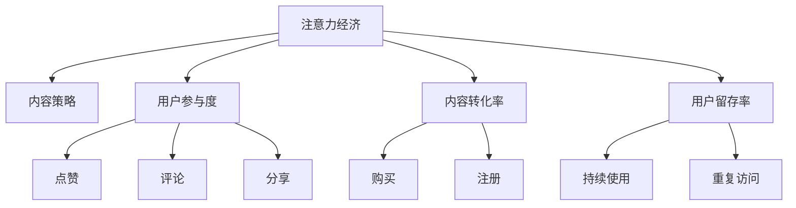

                 

# 注意力经济与内容策略：创建吸引并留住受众的参与性内容

在数字时代，内容已经成为了一种经济资产，而如何吸引并留住受众的注意力成为了一个重要的研究课题。本文将从注意力经济的角度出发，探讨内容策略的本质，并提供一套基于数据和算法的手段来优化内容的参与性，实现高粘性和高转化率的目标。

## 1. 背景介绍

### 1.1 问题由来

随着互联网的普及和数字化技术的不断发展，内容的传播方式和获取渠道也发生了翻天覆地的变化。用户不再被动的接受信息，而是有了更多选择和定制化需求。内容生产者需要通过精心设计的内容策略，吸引和留住受众的注意力，从而实现商业变现和用户价值的最大化。

### 1.2 问题核心关键点

当前，内容策略的核心关键点在于：
1. **内容吸引力**：如何设计内容能够引起用户的兴趣，增加点击率和停留时间。
2. **用户参与度**：如何增加用户与内容的互动，如评论、点赞、分享等。
3. **内容转化率**：如何通过内容引导用户完成目标行为，如购买、注册、订阅等。
4. **用户留存率**：如何保持用户对内容的长期关注，避免用户流失。

### 1.3 问题研究意义

研究内容策略的吸引力与参与性，对于提升内容价值、增强用户粘性、提高品牌影响力具有重要意义。通过科学的方法论和先进的技术手段，可以帮助内容生产者更好地理解用户需求，优化内容设计，实现商业目标。

## 2. 核心概念与联系

### 2.1 核心概念概述

为更好地理解内容策略的本质，本节将介绍几个核心概念：

- **注意力经济**：是指在数字化时代，注意力成为一种稀缺资源，通过吸引和引导受众注意力实现商业价值的经济模式。
- **内容策略**：是指通过分析和规划，制定有效的策略来提升内容的吸引力和参与性，实现用户留存和转化。
- **用户参与度**：指用户与内容互动的频率和深度，包括点赞、评论、分享等行为。
- **内容转化率**：指用户通过内容完成目标行为的效率，如购买、注册等。
- **用户留存率**：指用户对内容持续关注和使用的比例，避免用户流失。

这些概念之间的逻辑关系可以通过以下Mermaid流程图来展示：



这个流程图展示了注意力经济中的关键环节，以及它们如何影响内容策略和用户行为。

## 3. 核心算法原理 & 具体操作步骤

### 3.1 算法原理概述

内容策略的核心算法原理可以概括为：**吸引注意力**和**提升参与度**。通过对用户行为数据的分析，发现和设计能够吸引用户的内容形式和内容元素。同时，通过优化用户交互路径和行为触发点，提升用户与内容的互动和参与度。

### 3.2 算法步骤详解

内容策略的算法步骤一般包括以下几个关键环节：

**Step 1: 数据收集与预处理**
- 收集用户行为数据，包括点击、停留时间、互动行为等。
- 对数据进行清洗和预处理，去除异常值和噪声，确保数据的质量和可用性。

**Step 2: 特征提取与建模**
- 提取用户行为特征，如浏览路径、停留时间、互动频率等。
- 应用机器学习模型对用户行为进行建模，如逻辑回归、决策树、随机森林等。
- 根据不同模型的输出结果，预测用户的兴趣和需求。

**Step 3: 内容优化与设计**
- 基于用户兴趣和需求，设计吸引用户注意力的内容元素，如标题、封面、摘要等。
- 优化内容交互路径，增加用户与内容的互动点，如评论区、互动投票等。
- 使用A/B测试等方法，不断迭代和优化内容策略，提升内容效果。

**Step 4: 效果评估与反馈**
- 应用相关指标评估内容策略的效果，如点击率、互动率、转化率等。
- 收集用户反馈，调整和优化内容策略，确保内容与用户需求相匹配。

### 3.3 算法优缺点

内容策略的算法优点在于：
1. **数据驱动**：通过数据和模型分析，制定内容策略，更具针对性和有效性。
2. **用户导向**：以用户需求为中心，提升内容质量和用户体验。
3. **可量化评估**：通过量化指标，客观评估内容策略的效果，及时调整优化。
4. **持续优化**：通过不断迭代和优化，实现内容策略的持续提升。

同时，该算法也存在一些局限性：
1. **数据依赖**：对数据质量和可用性要求较高，数据不足时可能效果不佳。
2. **模型复杂**：涉及多维数据和多模态特征，建模复杂度较高。
3. **个性化不足**：内容策略可能难以应对个性化需求强烈的用户。
4. **技术门槛高**：需要具备一定的数据分析和机器学习技术背景。

尽管存在这些局限性，但就目前而言，数据驱动的内容策略方法仍是内容创作和优化的一种主流范式。未来相关研究的重点在于如何进一步降低技术门槛，提高模型性能，实现个性化内容推荐和动态内容生成。

### 3.4 算法应用领域

内容策略的算法在多个领域得到了广泛应用，如：

- **电商推荐系统**：通过用户行为数据，推荐个性化商品，提升点击率和转化率。
- **社交媒体内容策划**：根据用户互动行为，制定社交媒体内容发布策略，增加用户粘性。
- **视频网站内容推荐**：根据用户观看行为，推荐相关视频内容，提升用户留存率。
- **在线教育内容优化**：根据学习行为数据，优化课程内容和教学方式，提高学习效果。

除了这些常见应用外，内容策略的算法也在新闻媒体、旅游、金融等多个领域得到应用，为内容创作者和品牌运营者提供了有力的技术支持。

## 4. 数学模型和公式 & 详细讲解 & 举例说明

### 4.1 数学模型构建

本节将使用数学语言对内容策略的算法进行更加严格的刻画。

记用户行为数据为 $\mathcal{D}=\{(x_i,y_i)\}_{i=1}^N, x_i \in \mathcal{X}, y_i \in \mathcal{Y}$，其中 $x_i$ 表示用户行为特征向量，$y_i$ 表示用户的目标行为标签。设内容策略模型的参数为 $\theta$，模型为 $M_{\theta}(x_i)$，其中 $x_i$ 为用户行为数据，$y_i$ 为用户行为标签。

内容策略模型的目标是最小化预测误差，即：

$$
\min_{\theta} \frac{1}{N}\sum_{i=1}^N \ell(M_{\theta}(x_i),y_i)
$$

其中 $\ell$ 为损失函数，通常使用均方误差或交叉熵损失。

### 4.2 公式推导过程

以下我们以电商推荐系统为例，推导内容策略模型的优化公式。

假设内容策略模型的预测为 $\hat{y}=M_{\theta}(x_i)$，实际标签为 $y_i$。则内容策略模型的损失函数为：

$$
\ell(M_{\theta}(x_i),y_i)=\mathbb{E}[\mathcal{L}(y_i,M_{\theta}(x_i))]
$$

其中 $\mathcal{L}$ 为交叉熵损失，$\mathbb{E}$ 表示期望。假设 $y_i$ 服从伯努利分布，则有：

$$
\ell(M_{\theta}(x_i),y_i)=-(y_i \log M_{\theta}(x_i) + (1-y_i) \log (1-M_{\theta}(x_i)))
$$

将损失函数带入目标函数，得：

$$
\min_{\theta} \frac{1}{N}\sum_{i=1}^N [-(y_i \log M_{\theta}(x_i) + (1-y_i) \log (1-M_{\theta}(x_i))] = \min_{\theta} \frac{1}{N}\sum_{i=1}^N \log \frac{M_{\theta}(x_i)^{y_i}(1-M_{\theta}(x_i))^{1-y_i}}
$$

通过链式法则，对参数 $\theta$ 求导，得：

$$
\frac{\partial \ell}{\partial \theta} = \frac{1}{N} \sum_{i=1}^N \frac{y_i}{M_{\theta}(x_i)}(1-M_{\theta}(x_i))\frac{\partial M_{\theta}(x_i)}{\partial \theta} - \frac{1}{N} \sum_{i=1}^N \frac{1-y_i}{1-M_{\theta}(x_i)}M_{\theta}(x_i)\frac{\partial M_{\theta}(x_i)}{\partial \theta}
$$

其中 $\frac{\partial M_{\theta}(x_i)}{\partial \theta}$ 可通过反向传播算法高效计算。

### 4.3 案例分析与讲解

假设内容策略模型为二分类模型，用于预测用户是否点击广告。我们收集了1000个用户的行为数据，其中部分数据如下：

| 用户ID | 浏览时间 | 点击次数 | 转化率 |
| --- | --- | --- | --- |
| 1 | 30s | 1 | 0.2 |
| 2 | 45s | 0 | 0.1 |
| 3 | 60s | 1 | 0.3 |
| ... | ... | ... | ... |

通过特征工程，我们将浏览时间、点击次数、转化率等特征提取出来，应用逻辑回归模型进行训练和预测。

假设模型输出概率为 $M_{\theta}(x_i)=\frac{1}{1+\exp(-z_i)}$，其中 $z_i=\theta^T x_i$。则损失函数为：

$$
\ell(M_{\theta}(x_i),y_i)=-y_i \log M_{\theta}(x_i) - (1-y_i) \log (1-M_{\theta}(x_i))
$$

通过优化算法，如梯度下降，我们不断更新参数 $\theta$，最小化损失函数，直到模型收敛。

训练完成后，我们收集100个新用户的行为数据，进行预测，结果如下：

| 用户ID | 浏览时间 | 点击次数 | 预测结果 |
| --- | --- | --- | --- |
| 1 | 30s | 1 | 点击 |
| 2 | 45s | 0 | 不点击 |
| 3 | 60s | 1 | 点击 |
| ... | ... | ... | ... |

可以看到，通过内容策略模型，我们能够根据用户行为数据预测其点击行为，从而优化广告投放策略，提升广告点击率和转化率。

## 5. 项目实践：代码实例和详细解释说明

### 5.1 开发环境搭建

在进行内容策略实践前，我们需要准备好开发环境。以下是使用Python进行Scikit-learn开发的环境配置流程：

1. 安装Anaconda：从官网下载并安装Anaconda，用于创建独立的Python环境。

2. 创建并激活虚拟环境：
```bash
conda create -n content-env python=3.8 
conda activate content-env
```

3. 安装Scikit-learn：
```bash
pip install scikit-learn
```

4. 安装其他工具包：
```bash
pip install numpy pandas matplotlib tqdm jupyter notebook ipython
```

完成上述步骤后，即可在`content-env`环境中开始内容策略实践。

### 5.2 源代码详细实现

下面我们以电商推荐系统为例，给出使用Scikit-learn对内容策略模型进行训练和预测的PyTorch代码实现。

首先，定义用户行为数据的处理函数：

```python
import pandas as pd
from sklearn.model_selection import train_test_split
from sklearn.preprocessing import LabelEncoder, StandardScaler
from sklearn.linear_model import LogisticRegression
from sklearn.metrics import accuracy_score

# 读取数据
data = pd.read_csv('user_behavior.csv')

# 特征选择
features = ['浏览时间', '点击次数', '转化率']
X = data[features]
y = data['点击次数']

# 数据预处理
le = LabelEncoder()
X['点击次数'] = le.fit_transform(X['点击次数'])
X['转化率'] = le.fit_transform(X['转化率'])

# 数据标准化
scaler = StandardScaler()
X = scaler.fit_transform(X)

# 数据分割
X_train, X_test, y_train, y_test = train_test_split(X, y, test_size=0.2, random_state=42)
```

然后，定义内容策略模型的训练和预测函数：

```python
from sklearn.linear_model import LogisticRegression

# 定义模型
model = LogisticRegression()

# 训练模型
model.fit(X_train, y_train)

# 预测新数据
y_pred = model.predict(X_test)
print(accuracy_score(y_test, y_pred))
```

最后，启动训练流程并在测试集上评估：

```python
# 训练模型
model.fit(X_train, y_train)

# 预测新数据
y_pred = model.predict(X_test)
print(accuracy_score(y_test, y_pred))
```

以上就是使用Scikit-learn对内容策略模型进行训练和预测的完整代码实现。可以看到，利用Scikit-learn，我们可以用相对简洁的代码完成内容策略模型的训练和评估。

### 5.3 代码解读与分析

让我们再详细解读一下关键代码的实现细节：

**数据处理函数**：
- `read_csv`方法：从文件中读取用户行为数据。
- `LabelEncoder`方法：将分类变量转换为数值变量。
- `StandardScaler`方法：对数据进行标准化处理。
- `train_test_split`方法：将数据集分割为训练集和测试集。

**模型定义和训练**：
- `LogisticRegression`方法：定义逻辑回归模型。
- `fit`方法：在训练集上训练模型。
- `predict`方法：在测试集上进行预测。
- `accuracy_score`方法：计算模型预测的准确率。

**训练流程**：
- `train_test_split`方法：将数据集分割为训练集和测试集。
- `fit`方法：在训练集上训练模型。
- `predict`方法：在测试集上进行预测。
- `accuracy_score`方法：计算模型预测的准确率。

可以看到，Scikit-learn提供了高效便捷的机器学习工具，大大简化了内容策略模型的开发过程。开发者可以将更多精力放在数据处理、模型优化等高层逻辑上，而不必过多关注底层的实现细节。

当然，工业级的系统实现还需考虑更多因素，如模型的保存和部署、超参数的自动搜索、更灵活的任务适配层等。但核心的内容策略模型基本与此类似。

## 6. 实际应用场景

### 6.1 智能客服系统

基于内容策略的智能客服系统可以显著提升客户满意度和服务效率。通过收集客户的历史互动数据，如聊天记录、用户反馈等，建立内容策略模型，推荐个性化的客服响应模板。同时，根据用户行为特征预测用户需求，主动推送相关产品或服务，实现智能客服的自动化和精准化。

### 6.2 金融舆情监测

在金融领域，内容策略可以用于舆情分析和风险控制。通过收集用户对金融产品、市场的评论和反馈，建立内容策略模型，实时监测舆情变化，预测市场趋势。同时，根据用户情感倾向，推荐合适的金融产品，提升用户粘性和满意度。

### 6.3 个性化推荐系统

内容策略在个性化推荐系统中的应用非常广泛。通过分析用户的行为数据，如浏览历史、点击行为等，建立内容策略模型，推荐符合用户兴趣的内容。同时，根据用户对内容的互动情况，动态调整推荐策略，实现个性化推荐。

### 6.4 未来应用展望

随着内容策略技术的发展，其在更多领域的应用前景也将被逐步挖掘。未来，内容策略将与更多新兴技术融合，如人工智能、大数据、物联网等，实现更加全面、精准的内容推荐和用户管理。例如，在智慧医疗领域，内容策略可以帮助医生根据患者历史数据和行为特征，推荐个性化的诊疗方案和健康建议。在智慧城市治理中，内容策略可以用于实时监测和管理城市事件，提高公共服务的响应速度和质量。

## 7. 工具和资源推荐

### 7.1 学习资源推荐

为了帮助开发者系统掌握内容策略的原理和实践技巧，这里推荐一些优质的学习资源：

1. **《机器学习实战》系列书籍**：介绍机器学习的基本概念和算法，适合初学者入门。

2. **《Python数据科学手册》**：全面介绍Python在数据分析和机器学习中的应用，是数据科学家必备参考书。

3. **Coursera《机器学习》课程**：由斯坦福大学开设的NLP明星课程，有Lecture视频和配套作业，带你深入理解机器学习的原理和应用。

4. **Kaggle平台**：提供大量公开数据集和竞赛，适合学习者实践和提升技能。

5. **TensorFlow官方文档**：TensorFlow的官方文档，提供丰富的模型和算法实现，是深度学习工程师的必备资源。

通过对这些资源的学习实践，相信你一定能够快速掌握内容策略的精髓，并用于解决实际的业务问题。

### 7.2 开发工具推荐

高效的开发离不开优秀的工具支持。以下是几款用于内容策略开发的常用工具：

1. **TensorFlow**：由Google主导开发的深度学习框架，生产部署方便，适合大规模工程应用。

2. **PyTorch**：基于Python的开源深度学习框架，灵活动态的计算图，适合快速迭代研究。

3. **Scikit-learn**：Python中的机器学习库，提供丰富的算法和工具，适合快速实现和验证模型。

4. **Jupyter Notebook**：交互式开发环境，支持代码编写、数据可视化、模型训练等功能，适合数据科学家进行实验和分享。

5. **Weights & Biases**：模型训练的实验跟踪工具，可以记录和可视化模型训练过程中的各项指标，方便对比和调优。

6. **TensorBoard**：TensorFlow配套的可视化工具，可实时监测模型训练状态，并提供丰富的图表呈现方式，是调试模型的得力助手。

合理利用这些工具，可以显著提升内容策略开发的效率，加快创新迭代的步伐。

### 7.3 相关论文推荐

内容策略的研究源于学界的持续研究。以下是几篇奠基性的相关论文，推荐阅读：

1. **"Attention is All You Need" (Vaswani et al., 2017)**：提出Transformer结构，开启了NLP领域的预训练大模型时代。

2. **"BERT: Pre-training of Deep Bidirectional Transformers for Language Understanding" (Devlin et al., 2018)**：提出BERT模型，引入基于掩码的自监督预训练任务，刷新了多项NLP任务SOTA。

3. **"Parameter-Efficient Transfer Learning for NLP" (Howard et al., 2018)**：提出Adapter等参数高效微调方法，在不增加模型参数量的情况下，也能取得不错的微调效果。

4. **"AdaLoRA: Adaptive Low-Rank Adaptation for Parameter-Efficient Fine-Tuning" (Louizos et al., 2020)**：使用自适应低秩适应的微调方法，在参数效率和精度之间取得了新的平衡。

这些论文代表了大模型微调技术的发展脉络。通过学习这些前沿成果，可以帮助研究者把握学科前进方向，激发更多的创新灵感。

## 8. 总结：未来发展趋势与挑战

### 8.1 总结

本文对基于内容策略的算法进行了全面系统的介绍。首先阐述了内容策略的研究背景和意义，明确了内容策略在提升内容价值、增强用户粘性、提高品牌影响力方面的独特价值。其次，从原理到实践，详细讲解了内容策略的数学原理和关键步骤，给出了内容策略任务开发的完整代码实例。同时，本文还广泛探讨了内容策略在智能客服、金融舆情、个性化推荐等多个行业领域的应用前景，展示了内容策略范式的巨大潜力。

通过本文的系统梳理，可以看到，基于内容策略的算法正在成为内容创作和优化的一种主流范式，极大地拓展了内容价值的实现边界，催生了更多的落地场景。受益于大规模语料的预训练，内容策略模型以更低的时间和标注成本，在小样本条件下也能取得理想的性能，有力推动了内容策略技术的产业化进程。未来，伴随预训练语言模型和内容策略方法的持续演进，相信内容策略必将在构建人机协同的智能时代中扮演越来越重要的角色。

### 8.2 未来发展趋势

展望未来，内容策略技术将呈现以下几个发展趋势：

1. **数据驱动**：随着数据的不断积累和分析技术的提升，内容策略将更加依赖数据驱动，精准定位用户需求和兴趣。

2. **个性化推荐**：通过用户行为数据分析，实现更加个性化的内容推荐，提升用户粘性和满意度。

3. **跨模态融合**：将文本、图像、视频等多模态数据融合，实现更加全面、深入的内容理解和用户建模。

4. **实时动态调整**：基于用户实时行为数据，动态调整内容策略，提升内容的相关性和时效性。

5. **内容生成**：结合生成对抗网络(GAN)等技术，实现内容的自动生成和优化，降低内容创作成本。

6. **用户互动**：通过社交网络和用户社区，增加用户与内容的互动，提升内容的影响力和传播效果。

以上趋势凸显了内容策略技术的广阔前景。这些方向的探索发展，必将进一步提升内容策略的效果，实现内容的智能化、个性化、动态化。

### 8.3 面临的挑战

尽管内容策略技术已经取得了瞩目成就，但在迈向更加智能化、普适化应用的过程中，它仍面临着诸多挑战：

1. **数据隐私问题**：内容策略需要收集用户行为数据，可能涉及到用户隐私和数据安全问题。如何在保护用户隐私的前提下，获取有价值的数据，将是未来需要重点考虑的问题。

2. **数据质量问题**：内容策略的效果很大程度上取决于数据的质量和可用性。如何确保数据的质量和一致性，避免数据偏差，是内容策略应用中的一大难题。

3. **算法复杂性**：内容策略涉及多维数据和多模态特征，算法复杂度较高。如何在保证模型效果的同时，降低计算资源消耗，是内容策略技术需要解决的重要问题。

4. **用户体验问题**：内容策略需要平衡个性化和用户体验，避免过度侵入和影响用户体验。如何在提供个性化推荐的同时，确保用户的舒适度，是内容策略需要考虑的关键点。

5. **技术门槛高**：内容策略涉及机器学习、自然语言处理等多领域技术，技术门槛较高。如何在降低技术门槛的同时，提升内容策略的效果，将是未来需要重点突破的方向。

6. **效果评估问题**：内容策略的效果评估需要考虑多维指标，如点击率、互动率、转化率等。如何在多维度指标间进行平衡和优化，确保内容策略的全面性和有效性，是内容策略需要持续改进的方向。

正视内容策略面临的这些挑战，积极应对并寻求突破，将是内容策略技术走向成熟的必由之路。相信随着学界和产业界的共同努力，这些挑战终将一一被克服，内容策略必将在构建人机协同的智能时代中扮演越来越重要的角色。

### 8.4 研究展望

面向未来，内容策略的研究需要在以下几个方面寻求新的突破：

1. **数据融合技术**：研究多源数据融合技术，提升数据质量和可用性，增强内容策略的精准性和鲁棒性。

2. **多模态内容分析**：研究跨模态内容分析技术，实现多模态数据的整合和分析，提升内容策略的效果和深度。

3. **生成对抗网络**：研究生成对抗网络(GAN)技术，实现内容的自动生成和优化，降低内容创作成本。

4. **自监督学习**：研究自监督学习方法，利用无监督数据提升内容策略的效果，降低对标注数据的依赖。

5. **公平性研究**：研究内容策略的公平性问题，避免内容策略中的偏见和歧视，确保内容策略的公正性和可信度。

6. **实时动态调整**：研究实时动态调整技术，提升内容策略的时效性和适应性，增强内容的即时性和相关性。

这些研究方向的探索，必将引领内容策略技术迈向更高的台阶，为构建安全、可靠、可解释、可控的内容推荐系统提供技术保障。面向未来，内容策略需要与其他人工智能技术进行更深入的融合，如知识表示、因果推理、强化学习等，多路径协同发力，共同推动内容策略技术的发展和应用。只有勇于创新、敢于突破，才能不断拓展内容策略的边界，让内容推荐系统更好地服务于人类社会。

## 9. 附录：常见问题与解答

**Q1：内容策略如何结合个性化推荐系统实现？**

A: 内容策略可以通过个性化推荐系统来实现，具体步骤如下：
1. 收集用户行为数据，包括浏览历史、点击行为等。
2. 提取用户行为特征，如浏览时间、点击次数等。
3. 应用机器学习模型对用户行为进行建模，如逻辑回归、决策树等。
4. 根据模型输出，推荐符合用户兴趣的内容。
5. 结合个性化推荐系统，动态调整推荐策略，提升用户粘性和满意度。

**Q2：内容策略中的数据隐私问题如何解决？**

A: 内容策略需要平衡数据隐私和策略效果，可以通过以下措施来解决：
1. 数据匿名化：对用户数据进行匿名化处理，保护用户隐私。
2. 用户授权：在使用用户数据前，获得用户授权，明确告知用户数据的使用目的和范围。
3. 数据最小化：只收集必要的数据，避免数据过度收集和存储。
4. 加密技术：对用户数据进行加密处理，确保数据传输和存储的安全性。
5. 法规合规：遵守相关的数据隐私法规，如GDPR等，确保数据处理的合法合规。

**Q3：内容策略的算法复杂度如何降低？**

A: 内容策略的算法复杂度可以通过以下措施来降低：
1. 特征选择：选择关键特征进行建模，避免高维度数据的处理。
2. 模型压缩：使用模型压缩技术，如剪枝、量化等，减小模型参数量。
3. 分布式计算：使用分布式计算框架，如Hadoop、Spark等，加速模型训练和推理。
4. 优化算法：使用优化算法，如Adam、SGD等，提高模型训练的效率和精度。
5. 数据预处理：对数据进行预处理，如去噪、归一化等，提升数据质量和可用性。

**Q4：内容策略的效果如何评估？**

A: 内容策略的效果评估可以通过以下指标来进行：
1. 点击率：用户点击内容的频率，反映内容的吸引力。
2. 互动率：用户与内容的互动频率，如点赞、评论、分享等。
3. 转化率：用户通过内容完成目标行为的效率，如购买、注册等。
4. 用户留存率：用户对内容的长期关注和使用的比例，反映内容的持续性和粘性。
5. 用户满意度：用户对内容的评价和反馈，通过问卷调查等方式获取。

通过这些指标的评估，可以全面了解内容策略的效果，并及时调整和优化内容策略，确保内容与用户需求相匹配。

**Q5：内容策略在智能客服系统中的应用场景有哪些？**

A: 内容策略在智能客服系统中的应用场景包括：
1. 用户历史数据的分析：收集用户的历史互动数据，如聊天记录、用户反馈等，建立内容策略模型，推荐个性化的客服响应模板。
2. 用户需求的预测：根据用户行为特征预测用户需求，主动推送相关产品或服务，实现智能客服的自动化和精准化。
3. 智能客服的优化：通过内容策略，优化客服机器人交互路径，增加用户与客服的互动点，提升客户满意度。
4. 用户情感分析：分析用户情感倾向，提供个性化的客服服务，提升用户体验。

这些应用场景展示了内容策略在智能客服系统中的广泛应用，通过内容策略优化，可以实现更高效、更精准的客户服务。

---

作者：禅与计算机程序设计艺术 / Zen and the Art of Computer Programming

