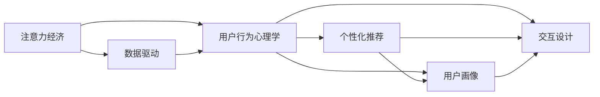

                 

# 注意力经济与用户行为心理学：了解受众的内心世界

## 1. 背景介绍

### 1.1 问题由来

随着数字技术的飞速发展，互联网已成为全球最大的信息生态系统。越来越多的内容被数字化、在线化，注意力经济（Attention Economy）随之成为时代的新特征。用户注意力资源的稀缺性、数字化平台内容的丰富性、个性化需求的多样性，使得如何理解、把握用户行为，成为商业和科研领域共同关注的问题。

在商业实践中，通过对用户行为的精准分析，企业能够更好地进行产品设计、市场推广、用户体验优化，提升用户留存率和转化率，进而获得更高的商业价值。例如，电商平台利用个性化推荐、社交媒体应用进行兴趣匹配，都能显著提高用户粘性和满意度。

在学术研究中，用户行为心理学（User Behavior Psychology）已成为一个热门领域。其研究重点在于分析、预测用户在不同情境下对产品、内容、服务的反应和决策，为设计符合用户需求的产品和服务提供理论支撑。

本文聚焦于注意力经济与用户行为心理学的结合，通过介绍注意力经济原理、用户行为心理学的基本概念，以及两者相互影响的过程和机制，探讨了理解用户行为的策略与方法。

### 1.2 问题核心关键点

本文的核心关注点在于：

- 注意力经济是如何通过数字化手段重塑用户行为模式的？
- 用户行为心理学有哪些理论基础和应用方法？
- 如何基于用户行为数据进行商业决策和产品优化？
- 注意力经济和用户行为心理学的交互作用机制有哪些？

## 2. 核心概念与联系

### 2.1 核心概念概述

为了更好地理解注意力经济与用户行为心理学的结合，本节将介绍几个关键概念：

- 注意力经济（Attention Economy）：指在数字化时代，通过获取、分配和利用用户注意力来创造商业价值的经济活动。注意力成为重要的稀缺资源，能够吸引用户注意力并引发互动的产品和服务往往能获得更高的市场价值。

- 用户行为心理学（User Behavior Psychology）：研究用户对产品、服务、内容的心理反应和决策过程，旨在设计符合用户需求和心理预期的产品和服务，提升用户体验和满意度。

- 数据驱动（Data-Driven）：指通过大规模数据分析和挖掘，发现用户行为模式和趋势，从而指导决策和优化的过程。

- 个性化推荐（Personalized Recommendation）：利用用户行为数据进行模型训练，预测用户兴趣和需求，提供定制化的产品和服务，提升用户体验和满意度。

- 用户画像（User Persona）：基于用户行为数据，构建不同特征的用户群体，以指导产品和服务的设计和优化。

- 交互设计（Interactive Design）：通过交互设计提升用户体验，包括界面设计、交互流程设计、反馈设计等。

这些概念之间存在着密切的联系和交互。例如，数据驱动的个性化推荐需要通过用户行为心理学原理来分析用户需求，而交互设计则需要基于用户画像来进行优化设计。

### 2.2 核心概念原理和架构的 Mermaid 流程图



这个流程图展示了注意力经济与用户行为心理学的基本关系：

1. 注意力经济的核心在于获取和利用用户注意力，数据驱动是其基本手段。
2. 用户行为心理学的研究基于用户心理反应，为个性化推荐和交互设计提供理论支撑。
3. 个性化推荐和交互设计则是实现注意力经济价值的关键技术手段。

## 3. 核心算法原理 & 具体操作步骤

### 3.1 算法原理概述

注意力经济与用户行为心理学的结合，本质上是一种以用户为中心的、数据驱动的商业决策和优化方法。其核心算法流程如下：

1. **数据采集**：通过各种数字化手段（如点击流数据、用户反馈数据等）获取用户行为数据。
2. **数据分析**：利用机器学习、数据挖掘等技术，分析用户行为数据，挖掘用户兴趣和需求模式。
3. **模型训练**：基于用户行为数据，训练个性化推荐模型、用户画像模型等，预测用户行为和需求。
4. **交互设计**：根据用户画像和预测结果，设计用户友好的交互界面和流程。
5. **用户体验优化**：根据用户反馈数据，不断优化产品和服务，提升用户满意度。
6. **商业决策**：根据用户行为数据和推荐结果，指导商业策略制定和资源分配。

### 3.2 算法步骤详解

以电商平台为例，具体步骤如下：

**Step 1: 数据采集**

- 电商平台的点击流数据：记录用户浏览、点击、购买等行为。
- 用户反馈数据：记录用户评价、评分、投诉等反馈信息。

**Step 2: 数据分析**

- 用户兴趣分析：通过聚类算法分析用户点击行为，挖掘用户兴趣主题。
- 用户行为预测：利用时序预测算法预测用户未来的购买行为。

**Step 3: 模型训练**

- 个性化推荐模型：基于用户行为数据，训练协同过滤、基于内容的推荐算法。
- 用户画像模型：基于用户行为数据，构建用户基本信息、兴趣特征、行为特征等画像。

**Step 4: 交互设计**

- 推荐界面设计：根据用户画像和推荐结果，设计展示和交互界面。
- 交互流程设计：优化推荐流程，减少用户点击次数，提高用户转化率。

**Step 5: 用户体验优化**

- A/B测试：对比不同交互设计和推荐结果，寻找最优方案。
- 用户反馈收集：通过问卷、评论区等方式收集用户反馈，进行迭代优化。

**Step 6: 商业决策**

- 用户细分：基于用户画像，对用户进行细分，制定个性化营销策略。
- 库存管理：根据用户预测结果，优化库存管理，减少缺货和积压。

### 3.3 算法优缺点

注意力经济与用户行为心理学的结合方法具有以下优点：

1. 精确性高：基于大规模用户行为数据的分析，能够准确挖掘用户需求和兴趣。
2. 效果显著：个性化推荐和交互设计能够显著提升用户满意度和转化率。
3. 数据驱动：通过数据驱动决策，提升商业策略的科学性和可行性。

同时，该方法也存在一定的局限性：

1. 数据隐私问题：用户行为数据涉及个人隐私，数据采集和处理需要符合法律法规和伦理规范。
2. 数据质量要求高：数据采集、存储和处理需要保证数据完整性和准确性，否则可能影响决策结果。
3. 模型复杂性：需要构建复杂的模型和算法，对技术要求较高。
4. 用户习惯变化快：用户行为和兴趣容易发生变化，模型需要不断更新以适应新变化。

尽管存在这些局限性，但就目前而言，基于注意力经济与用户行为心理学的结合方法仍是一种主流的商业和科研手段。未来相关研究的重点在于如何进一步降低数据隐私风险，提高数据质量，开发更高效、更灵活的模型和算法。

### 3.4 算法应用领域

该方法在电商、社交媒体、内容分发平台、在线教育等领域都有广泛应用：

- **电商平台**：通过个性化推荐和交互设计，提升用户购物体验和满意度，提高转化率和复购率。
- **社交媒体**：利用用户行为数据进行内容推荐，提高用户粘性和互动率。
- **内容分发平台**：根据用户兴趣推荐内容，提高用户停留时间和内容消费量。
- **在线教育**：基于用户学习行为数据，进行个性化推荐和交互设计，提升学习效果和满意度。

## 4. 数学模型和公式 & 详细讲解

### 4.1 数学模型构建

本节将使用数学语言对注意力经济与用户行为心理学的结合过程进行更加严格的刻画。

记用户行为数据为 $D=\{(x_i,y_i)\}_{i=1}^N$，其中 $x_i$ 为行为特征向量，$y_i$ 为行为标签（如购买、点击、评分等）。定义模型 $M_{\theta}$ 为推荐模型，其中 $\theta$ 为模型参数。

定义模型 $M_{\theta}$ 在行为数据 $D$ 上的损失函数为 $\mathcal{L}(\theta)$，用于衡量模型预测结果与实际标签之间的差异。常见的损失函数包括均方误差、交叉熵等。

微调的优化目标是最小化损失函数，即找到最优参数：

$$
\theta^* = \mathop{\arg\min}_{\theta} \mathcal{L}(\theta)
$$

在实践中，我们通常使用基于梯度的优化算法（如SGD、Adam等）来近似求解上述最优化问题。设 $\eta$ 为学习率，$\lambda$ 为正则化系数，则参数的更新公式为：

$$
\theta \leftarrow \theta - \eta \nabla_{\theta}\mathcal{L}(\theta) - \eta\lambda\theta
$$

其中 $\nabla_{\theta}\mathcal{L}(\theta)$ 为损失函数对参数 $\theta$ 的梯度，可通过反向传播算法高效计算。

### 4.2 公式推导过程

以下我们以协同过滤推荐算法为例，推导其数学公式和优化目标。

假设用户 $u$ 对物品 $i$ 的评分 $r_{ui}$ 为 $x_{ui}$，物品 $j$ 的评分 $r_{uj}$ 为 $x_{uj}$，则协同过滤算法推荐物品 $j$ 给用户 $u$ 的概率为：

$$
\hat{y}_{uj} = \frac{e^{\sum_{i=1}^N w_i r_{ui} r_{uj}}}{\sum_{k=1}^N e^{\sum_{i=1}^N w_i r_{uk} r_{uj}}
$$

其中 $w_i$ 为特征权重。则平均损失函数为：

$$
\mathcal{L}(\theta) = -\frac{1}{N} \sum_{i=1}^N \sum_{j=1}^N r_{uj} \log \hat{y}_{uj} + (1-r_{uj}) \log (1-\hat{y}_{uj})
$$

根据链式法则，损失函数对参数 $\theta$ 的梯度为：

$$
\frac{\partial \mathcal{L}(\theta)}{\partial \theta} = -\frac{1}{N} \sum_{i=1}^N \sum_{j=1}^N (\frac{r_{uj}}{\hat{y}_{uj}}-\frac{1-r_{uj}}{1-\hat{y}_{uj}}) \frac{\partial \hat{y}_{uj}}{\partial \theta}
$$

其中 $\frac{\partial \hat{y}_{uj}}{\partial \theta}$ 可进一步递归展开，利用自动微分技术完成计算。

在得到损失函数的梯度后，即可带入参数更新公式，完成模型的迭代优化。重复上述过程直至收敛，最终得到适应目标用户的行为预测模型 $\theta^*$。

## 5. 项目实践：代码实例和详细解释说明

### 5.1 开发环境搭建

在进行推荐系统开发前，我们需要准备好开发环境。以下是使用Python进行PyTorch开发的环境配置流程：

1. 安装Anaconda：从官网下载并安装Anaconda，用于创建独立的Python环境。

2. 创建并激活虚拟环境：
```bash
conda create -n pytorch-env python=3.8 
conda activate pytorch-env
```

3. 安装PyTorch：根据CUDA版本，从官网获取对应的安装命令。例如：
```bash
conda install pytorch torchvision torchaudio cudatoolkit=11.1 -c pytorch -c conda-forge
```

4. 安装TensorFlow：
```bash
conda install tensorflow=2.7
```

5. 安装各类工具包：
```bash
pip install numpy pandas scikit-learn matplotlib tqdm jupyter notebook ipython
```

完成上述步骤后，即可在`pytorch-env`环境中开始推荐系统开发。

### 5.2 源代码详细实现

下面我以基于协同过滤的电商推荐系统为例，给出使用PyTorch实现的代码。

首先，定义协同过滤推荐算法的基本函数：

```python
import torch
from torch.nn import Parameter, init
import numpy as np

def sigmoid(x):
    return torch.sigmoid(x)

def initialize_parameters(parameters):
    for parameter in parameters:
        if parameter.dim() > 1:
            init.xavier_uniform_(parameter.data)
```

然后，定义协同过滤模型的类：

```python
class CollaborativeFilteringModel(torch.nn.Module):
    def __init__(self, N, D, learning_rate, num_factors):
        super(CollaborativeFilteringModel, self).__init__()
        self.W_u = Parameter(torch.randn(num_factors, N))
        self.W_i = Parameter(torch.randn(N, num_factors))
        self.num_factors = num_factors
        self.learning_rate = learning_rate
        self.initialize_parameters(self.parameters())
        
    def forward(self, user, item):
        u_w = sigmoid(torch.mm(self.W_u, user))
        i_w = sigmoid(torch.mm(self.W_i, item))
        prediction = torch.mm(u_w, i_w.t())
        return prediction
```

接下来，定义优化器和损失函数：

```python
from torch.optim import Adam

optimizer = Adam(model.parameters(), lr=model.learning_rate)
loss_fn = torch.nn.MSELoss()

def train_epoch(model, data_loader):
    for user, item, label in data_loader:
        optimizer.zero_grad()
        prediction = model(user, item)
        loss = loss_fn(prediction, label)
        loss.backward()
        optimizer.step()
        
    return loss.item() / len(data_loader)
```

最后，启动训练流程：

```python
epochs = 10
batch_size = 32
num_factors = 20
N = 100

model = CollaborativeFilteringModel(N, D, learning_rate=0.01, num_factors=num_factors)

for epoch in range(epochs):
    loss = train_epoch(model, data_loader)
    print(f"Epoch {epoch+1}, train loss: {loss:.3f}")
```

以上就是使用PyTorch实现协同过滤推荐系统的完整代码。可以看到，利用PyTorch的强大封装功能，我们可以快速实现推荐算法，并对模型进行优化训练。

### 5.3 代码解读与分析

让我们再详细解读一下关键代码的实现细节：

**CollaborativeFilteringModel类**：
- `__init__`方法：初始化协同过滤模型，定义用户特征、物品特征和因子数量。
- `forward`方法：前向传播计算预测结果。

**initialize_parameters函数**：
- 初始化模型参数，保证参数分布具有合适的初始值。

**train_epoch函数**：
- 训练一个epoch，在每个batch上前向传播计算损失函数，反向传播更新模型参数。

**train_model函数**：
- 训练模型，记录每个epoch的损失值。

**模型训练流程**：
- 定义模型和优化器
- 在每个epoch中，对数据集进行迭代训练，记录训练损失
- 最后输出训练结果

## 6. 实际应用场景

### 6.1 智能推荐系统

智能推荐系统通过分析用户行为数据，为不同用户推荐个性化商品和服务，显著提升用户满意度和转化率。

在电商、视频、音乐等平台中，智能推荐已经成为了不可或缺的功能。例如，亚马逊利用协同过滤算法推荐用户感兴趣的商品，提高点击率和购买率。Netflix通过协同过滤和基于内容的推荐算法，为用户推荐个性化电影和剧集，提升用户粘性和满意度。

### 6.2 在线教育

在线教育平台通过分析学生学习行为数据，推荐适合学生学习的内容和方法，提升学习效果和满意度。

例如，Coursera根据学生的学习行为数据，推荐适合的课程和视频，帮助学生更好地掌握知识。Khan Academy通过分析学生的答题数据，推荐练习题和视频，提升学习效果。

### 6.3 社交媒体

社交媒体平台通过分析用户行为数据，推荐符合用户兴趣的内容，提高用户粘性和互动率。

例如，Facebook利用协同过滤算法推荐用户感兴趣的新闻和内容，提升用户粘性和互动率。Instagram通过分析用户点赞和互动数据，推荐符合用户兴趣的照片和视频，提升用户粘性和互动率。

### 6.4 未来应用展望

随着数字化技术的不断进步，注意力经济与用户行为心理学的结合将进一步深化。未来，基于用户行为数据，用户画像和个性化推荐将变得更加精准，从而带来更丰富的应用场景：

- **智慧医疗**：通过分析患者的医疗行为数据，推荐适合的医生和治疗方法，提升诊疗效果和满意度。
- **智能交通**：通过分析用户的出行行为数据，推荐最优的出行方式和路径，提升用户体验和交通效率。
- **智慧城市**：通过分析居民的行为数据，优化城市服务设施的布局和功能，提升城市管理水平和居民生活质量。

## 7. 工具和资源推荐

### 7.1 学习资源推荐

为了帮助开发者系统掌握注意力经济与用户行为心理学的相关理论和技术，这里推荐一些优质的学习资源：

1. 《用户行为心理学》系列书籍：介绍用户心理反应和决策机制，为产品设计和优化提供理论支撑。
2. 《数据驱动的商业决策》课程：由世界知名商学院提供，讲解数据驱动决策的方法和案例。
3. 《机器学习实战》书籍：涵盖机器学习算法和实现，适合入门和进阶学习。
4. 《推荐系统实践》书籍：介绍推荐系统的原理和实现方法，适合工程实践。
5. 《NLP实战》课程：介绍自然语言处理技术，包括数据采集、数据预处理、模型训练等环节。
6. 《数据科学之美》视频课程：由斯坦福大学提供，讲解数据科学的基本概念和应用。

通过对这些资源的学习实践，相信你一定能够快速掌握注意力经济与用户行为心理学的相关技术，并将其应用于实际项目中。

### 7.2 开发工具推荐

高效的开发离不开优秀的工具支持。以下是几款用于注意力经济与用户行为心理学结合开发的常用工具：

1. PyTorch：基于Python的开源深度学习框架，灵活高效的计算图，适合快速迭代研究。
2. TensorFlow：由Google主导开发的开源深度学习框架，生产部署方便，适合大规模工程应用。
3. Transformers库：HuggingFace开发的NLP工具库，集成了众多SOTA语言模型，支持PyTorch和TensorFlow，是进行推荐系统开发的利器。
4. Weights & Biases：模型训练的实验跟踪工具，可以记录和可视化模型训练过程中的各项指标，方便对比和调优。
5. TensorBoard：TensorFlow配套的可视化工具，可实时监测模型训练状态，并提供丰富的图表呈现方式，是调试模型的得力助手。

合理利用这些工具，可以显著提升注意力经济与用户行为心理学结合开发的效率，加快创新迭代的步伐。

### 7.3 相关论文推荐

注意力经济与用户行为心理学的结合领域已经涌现了大量研究成果，以下是几篇奠基性的相关论文，推荐阅读：

1. "Collaborative Filtering for Recommender Systems"：介绍了协同过滤算法的基本原理和实现方法。
2. "The Elements of Cognitive Science"：讲解了用户心理反应和决策机制的理论基础。
3. "Data-Driven Decision Making in Business"：讨论了数据驱动决策的方法和案例。
4. "Reinforcement Learning for Recommender Systems"：介绍了强化学习在推荐系统中的应用。
5. "Social Media Recommendation Systems"：介绍了社交媒体推荐系统的原理和实现方法。
6. "Personalized Learning in Online Education"：讨论了在线教育中个性化推荐的方法和案例。

这些论文代表了大规模推荐系统和用户行为心理学研究的最新进展，通过学习这些前沿成果，可以帮助研究者把握学科前进方向，激发更多的创新灵感。

## 8. 总结：未来发展趋势与挑战

### 8.1 研究成果总结

本文对注意力经济与用户行为心理学的结合进行了系统介绍，涵盖了基本概念、原理和应用方法，并通过代码实例进行了实践演示。主要研究成果总结如下：

1. 注意力经济通过数字化手段重塑了用户行为模式，使得数据驱动的商业决策和优化成为可能。
2. 用户行为心理学研究用户心理反应和决策机制，为个性化推荐和交互设计提供理论支撑。
3. 注意力经济与用户行为心理学的结合，通过数据驱动和算法优化，显著提升了用户满意度和转化率。
4. 推荐系统和用户行为心理学的结合，已经在电商、社交媒体、在线教育等多个领域得到广泛应用，取得了显著的效果。

### 8.2 未来发展趋势

展望未来，注意力经济与用户行为心理学的结合将呈现以下几个发展趋势：

1. 数据质量提升：随着数字化技术的发展，用户行为数据将更加丰富、多样，数据质量也将得到显著提升。
2. 算法复杂度提高：未来的推荐系统将更加复杂，涉及更多因素和变量，需要开发更加高级的算法模型。
3. 跨模态推荐：未来的推荐系统将能够整合不同模态的数据，如文本、图像、语音等，提供更加全面和精准的推荐结果。
4. 用户个性化增强：基于用户画像和行为数据，推荐系统将能够提供更加个性化的服务，满足用户多元化需求。
5. 实时性增强：未来的推荐系统将实现实时推荐，及时响应用户需求，提升用户体验和满意度。

### 8.3 面临的挑战

尽管注意力经济与用户行为心理学的结合已经取得了显著成果，但在迈向更加智能化、普适化应用的过程中，仍面临诸多挑战：

1. 数据隐私问题：用户行为数据涉及个人隐私，数据采集和处理需要符合法律法规和伦理规范。
2. 数据质量要求高：数据采集、存储和处理需要保证数据完整性和准确性，否则可能影响决策结果。
3. 用户行为变化快：用户行为和兴趣容易发生变化，模型需要不断更新以适应新变化。
4. 模型复杂度提高：未来推荐系统的复杂度将显著提高，算法模型的优化和实现变得更加困难。

### 8.4 研究展望

未来的研究需要在以下几个方面寻求新的突破：

1. 数据隐私保护：开发更加高效、安全的数据隐私保护技术，确保用户数据的安全和匿名性。
2. 数据质量提升：提升数据采集、存储和处理的效率和质量，确保数据完整性和准确性。
3. 模型优化：开发更加高效、灵活的算法模型，提高推荐系统的实时性和准确性。
4. 跨模态融合：整合不同模态的数据，提升推荐系统的全面性和精准性。
5. 个性化增强：基于用户画像和行为数据，提供更加个性化、定制化的服务。

这些研究方向将推动注意力经济与用户行为心理学的结合迈向更高的台阶，为构建智能推荐系统和优化用户体验提供更强大的技术支撑。相信随着相关研究的不断深入，未来基于用户行为数据的产品和服务将变得更加智能、高效、精准，进一步提升人类生活质量。

## 9. 附录：常见问题与解答

**Q1：如何有效地利用用户行为数据进行商业决策？**

A: 利用用户行为数据进行商业决策的关键在于数据采集、分析和应用三个环节。具体步骤如下：

1. 数据采集：通过各种数字化手段（如点击流数据、用户反馈数据等）获取用户行为数据。
2. 数据分析：利用机器学习、数据挖掘等技术，分析用户行为数据，挖掘用户兴趣和需求模式。
3. 应用分析：根据数据分析结果，制定商业策略和优化方案，指导产品设计和市场推广。

例如，电商平台可以分析用户浏览、点击、购买等行为数据，挖掘用户的兴趣和需求，从而制定个性化推荐和广告策略。社交媒体平台可以分析用户点赞、评论、分享等行为数据，挖掘用户的兴趣和偏好，从而进行内容推荐和用户互动。

**Q2：如何在推荐系统中避免过拟合问题？**

A: 推荐系统面临的过拟合问题主要来源于两个方面：数据样本量和模型复杂度。为避免过拟合，可以采取以下措施：

1. 数据扩充：通过数据增强、生成对抗网络（GAN）等方式，扩充数据样本量。
2. 模型简化：使用更简单的模型结构，减少特征数量和模型参数。
3. 正则化：采用L2正则、Dropout等技术，防止模型过度拟合训练集。
4. 交叉验证：通过交叉验证技术，评估模型在不同数据集上的泛化能力。
5. 在线学习：使用在线学习算法，及时更新模型参数，避免模型过时。

这些措施可以根据具体应用场景进行灵活组合，确保推荐系统的泛化能力和稳定性。

**Q3：如何在推荐系统中实现实时推荐？**

A: 实现实时推荐的关键在于数据流处理和模型在线学习。具体步骤如下：

1. 数据流处理：将用户行为数据实时流化，进行在线处理和分析。
2. 在线学习：使用在线学习算法，实时更新模型参数，保证推荐结果的实时性和准确性。
3. 缓存机制：通过缓存机制，提高推荐系统响应速度。
4. 异步更新：使用异步更新机制，降低对实时数据处理的影响。

例如，电商平台可以通过实时数据流处理，对用户行为数据进行在线分析，使用在线学习算法实时更新推荐模型，从而实现实时推荐。

**Q4：如何在推荐系统中提高推荐效果？**

A: 提高推荐效果的关键在于算法模型和优化策略的优化。具体步骤如下：

1. 算法优化：选择适合的算法模型，如协同过滤、基于内容的推荐、深度学习等，优化模型参数。
2. 数据预处理：对用户行为数据进行清洗、归一化等预处理，提高数据质量。
3. 特征工程：设计合适的特征工程，提取有意义的特征，提升模型的表现力。
4. 模型调参：通过A/B测试、超参数优化等方法，调整模型参数，提升推荐效果。
5. 用户反馈：收集用户反馈，进行迭代优化，提升推荐质量。

例如，电商平台可以使用深度学习算法优化协同过滤推荐模型，通过特征工程提取有意义的特征，通过超参数优化调整模型参数，从而提升推荐效果。

**Q5：如何在推荐系统中提高用户满意度？**

A: 提高用户满意度的关键在于个性化推荐和用户体验优化。具体步骤如下：

1. 个性化推荐：根据用户行为数据，进行个性化推荐，提供符合用户兴趣和需求的内容和服务。
2. 用户体验优化：优化推荐界面和交互流程，减少用户点击次数，提高用户转化率。
3. 用户反馈收集：通过问卷、评论区等方式收集用户反馈，进行迭代优化。
4. 用户画像分析：通过用户画像分析，制定个性化营销策略，提升用户粘性和满意度。

例如，电商平台可以分析用户浏览、点击、购买等行为数据，进行个性化推荐，通过交互设计优化推荐界面和流程，通过用户反馈收集进行迭代优化，从而提升用户满意度和忠诚度。

---

作者：禅与计算机程序设计艺术 / Zen and the Art of Computer Programming

