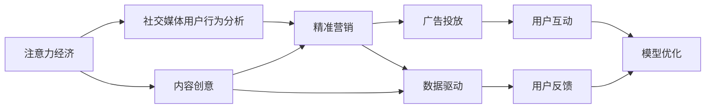

                 

## 1. 背景介绍

### 1.1 问题由来

在信息爆炸的互联网时代，社交媒体成为了连接品牌与消费者、企业和个人、广告商与受众的重要平台。如何在众多内容中脱颖而出，吸引并留住受众，成为了所有社交媒体平台和营销从业者共同面对的挑战。传统的内容发布策略已经无法满足用户多样化的需求和快速变化的市场环境。

### 1.2 问题核心关键点

当前社交媒体营销面临的核心挑战包括：

- **内容同质化**：社交媒体上的内容容易陷入模式化，缺乏创新性。
- **用户体验差**：广告和内容推送过多，导致用户体验下降。
- **互动不足**：用户参与度低，缺乏深度交流。
- **数据精准度低**：广告投放精准度不够，营销效果不佳。
- **技术演进快**：技术变化快，营销策略需要不断更新。

本文旨在探讨如何在不牺牲用户体验的情况下，通过创新策略和高效技术手段，提升社交媒体营销的效果。我们将重点关注注意力经济、社交媒体用户行为分析、精准营销与数据驱动等关键点，提出一套全面的营销策略和实践框架。

## 2. 核心概念与联系

### 2.1 核心概念概述

- **注意力经济**：指在信息过载的时代，注意力资源作为一种稀缺的资源，成为吸引消费者和企业竞争的焦点。
- **社交媒体用户行为分析**：通过分析用户在社交媒体上的行为数据，如点赞、评论、分享等，理解用户兴趣和偏好。
- **精准营销**：利用用户数据和算法技术，实现广告投放的精准匹配和个性化推荐。
- **数据驱动**：基于数据分析和机器学习模型，动态优化营销策略和内容创意。

这些概念通过相互作用，共同构建了社交媒体营销的完整框架。我们将在接下来的章节中，详细探讨这些概念的原理和实现方法。

### 2.2 核心概念原理和架构的 Mermaid 流程图



该流程图展示了注意力经济和社交媒体营销各环节的相互作用：

1. 注意力经济通过吸引用户注意，影响用户行为，从而影响社交媒体平台的内容生产和推荐策略。
2. 社交媒体用户行为分析基于用户数据，理解用户兴趣和行为模式。
3. 精准营销通过数据分析和用户画像，实现内容定制化和广告精准投放。
4. 数据驱动通过机器学习模型，实时优化营销策略和内容创意。

以上各环节相互促进，形成一个闭环反馈系统，最终实现社交媒体营销效果的提升。

## 3. 核心算法原理 & 具体操作步骤

### 3.1 算法原理概述

社交媒体营销的核心在于通过内容创新和技术手段，高效吸引和互动用户，提升广告投放的精准度和用户参与度。以下将详细探讨注意力经济、用户行为分析、精准营销和数据驱动在社交媒体营销中的实现原理。

### 3.2 算法步骤详解

#### 3.2.1 注意力经济与内容创意

注意力经济的核心在于创造差异化的内容，吸引用户的关注和兴趣。以下是实现步骤：

1. **内容创新**：通过数据分析和用户反馈，挖掘用户兴趣点和需求，设计具有创意和价值的内容。
2. **差异化呈现**：利用视觉、音频等多媒体元素，结合短视频、图文、直播等形式，提升内容的吸引力和差异化。
3. **用户互动**：设计互动性强的内容，如投票、问答、挑战等，增加用户参与度。

#### 3.2.2 社交媒体用户行为分析

用户行为分析旨在通过数据挖掘和机器学习，理解用户兴趣和行为模式，为精准营销提供依据。以下是实现步骤：

1. **数据收集**：通过社交媒体平台的API，收集用户点赞、评论、分享等行为数据。
2. **用户画像**：利用聚类、分类等机器学习算法，构建用户画像，理解用户的兴趣和偏好。
3. **行为预测**：通过序列模型、协同过滤等方法，预测用户未来的行为和兴趣变化。

#### 3.2.3 精准营销与广告投放

精准营销利用用户数据和算法技术，实现广告投放的个性化和精准匹配。以下是实现步骤：

1. **数据集成**：将用户行为数据、设备信息、地理位置等多维度数据集成，构建全面的用户画像。
2. **模型训练**：利用CTR预测、回归模型等，训练广告投放模型，预测用户对不同广告的点击率和转化率。
3. **投放优化**：根据模型预测结果，实时优化广告投放策略，实现高效广告投放。

#### 3.2.4 数据驱动与模型优化

数据驱动通过数据分析和机器学习，实时优化营销策略和内容创意。以下是实现步骤：

1. **实时监控**：通过数据流和事件流，实时监控用户行为和反馈数据。
2. **A/B测试**：利用A/B测试，评估不同内容创意和广告投放策略的效果。
3. **模型优化**：利用在线学习算法，不断优化模型和策略，提升广告投放精准度和用户体验。

### 3.3 算法优缺点

#### 3.3.1 优点

- **精准高效**：通过数据分析和算法技术，实现广告投放和内容创意的精准匹配。
- **提升用户参与度**：通过互动性强的内容设计，提升用户参与度和忠诚度。
- **实时优化**：通过实时监控和数据驱动，动态调整策略，提升营销效果。

#### 3.3.2 缺点

- **数据隐私问题**：用户行为数据的收集和使用可能引发隐私和伦理问题。
- **技术复杂性**：算法和模型的设计和维护需要较高的技术水平。
- **初期成本高**：数据集成、模型训练和广告投放需要较大的初期投入。

### 3.4 算法应用领域

社交媒体营销的算法和策略在多个领域得到了广泛应用，例如：

- **电商广告**：利用精准营销和数据分析，实现商品推荐的个性化和广告投放的精准匹配。
- **品牌推广**：通过创意内容设计和用户行为分析，提升品牌知名度和用户参与度。
- **社交互动**：利用用户互动和实时优化，提升用户参与度和社交粘性。
- **内容营销**：通过差异化内容创意和用户行为分析，提升内容分享和用户关注度。

## 4. 数学模型和公式 & 详细讲解 & 举例说明

### 4.1 数学模型构建

#### 4.1.1 内容创意的协同过滤模型

内容创意的关键在于找到与用户兴趣高度相关的内容。协同过滤算法可以通过用户行为数据，预测用户对其他内容的兴趣，从而生成个性化的推荐列表。以下是一个基本的协同过滤模型：

$$
\hat{y}_{ui} = \frac{\sum_{j=1}^{N} y_{uj} \times x_{ji}}{\sqrt{\sum_{j=1}^{N} x_{uj}^2} \times \sqrt{\sum_{j=1}^{N} x_{ji}^2}}
$$

其中，$y_{uj}$表示用户$u$对内容$j$的评分，$x_{uj}$表示用户$u$对内容$j$的评分权重，$x_{ji}$表示内容$j$对内容$i$的评分权重。

### 4.2 公式推导过程

#### 4.2.1 协同过滤模型推导

协同过滤模型通过计算用户$u$和内容$i$的评分权重，实现内容推荐。推导过程如下：

1. **计算用户评分权重**：
   $$
   x_{uj} = \frac{y_{uj}}{\sqrt{\sum_{i=1}^{M} y_{ui}^2}}
   $$

   其中，$M$为内容的数量。

2. **计算内容评分权重**：
   $$
   x_{ji} = \frac{y_{uj}}{\sqrt{\sum_{u=1}^{U} y_{ui}^2}}
   $$

   其中，$U$为用户的数量。

3. **计算用户对内容的预测评分**：
   $$
   \hat{y}_{ui} = \frac{\sum_{j=1}^{N} y_{uj} \times x_{ji}}{\sqrt{\sum_{j=1}^{N} x_{uj}^2} \times \sqrt{\sum_{j=1}^{N} x_{ji}^2}}
   $$

   其中，$N$为用户和内容的总数。

### 4.3 案例分析与讲解

#### 4.3.1 电商广告精准营销

电商平台可以利用协同过滤算法，通过用户浏览和购买数据，生成个性化推荐列表，提升用户的购物体验和转化率。具体实现步骤如下：

1. **数据收集**：收集用户的浏览记录、购买记录、评价记录等行为数据。
2. **协同过滤模型训练**：利用协同过滤算法，训练内容推荐模型，生成个性化推荐列表。
3. **实时推荐**：根据用户实时行为数据，实时调整推荐列表，实现精准投放。

#### 4.3.2 社交媒体精准投放

社交媒体平台可以利用CTR预测模型，通过用户行为数据，实现广告投放的精准匹配。具体实现步骤如下：

1. **数据收集**：收集用户的点赞、评论、分享等行为数据。
2. **CTR预测模型训练**：利用CTR预测模型，训练广告投放模型，预测用户对不同广告的点击率。
3. **实时投放**：根据模型预测结果，实时调整广告投放策略，实现高效广告投放。

## 5. 项目实践：代码实例和详细解释说明

### 5.1 开发环境搭建

在进行社交媒体营销实践前，我们需要准备好开发环境。以下是使用Python进行开发的环境配置流程：

1. 安装Anaconda：从官网下载并安装Anaconda，用于创建独立的Python环境。
2. 创建并激活虚拟环境：
   ```bash
   conda create -n social-media-env python=3.8 
   conda activate social-media-env
   ```

3. 安装所需的库：
   ```bash
   pip install numpy pandas scikit-learn scipy joblib jupyter notebook
   ```

完成上述步骤后，即可在`social-media-env`环境中开始社交媒体营销实践。

### 5.2 源代码详细实现

#### 5.2.1 数据收集与预处理

以下是一个简单的数据收集和预处理函数：

```python
import pandas as pd
from sklearn.preprocessing import LabelEncoder

def load_and_preprocess_data(file_path):
    # 读取数据
    data = pd.read_csv(file_path)
    
    # 数据清洗
    data = data.dropna()
    data = data.drop_duplicates()
    
    # 标签编码
    label_encoder = LabelEncoder()
    data['label'] = label_encoder.fit_transform(data['label'])
    
    return data
```

#### 5.2.2 协同过滤模型实现

以下是一个基于协同过滤的内容推荐函数：

```python
from sklearn.metrics.pairwise import cosine_similarity

def collaborative_filtering(data, user_index, item_index):
    # 计算用户评分权重
    user_weight = data.groupby('user')['rating'].apply(lambda x: x / np.sqrt(x.sum()))
    
    # 计算内容评分权重
    item_weight = data.groupby('item')['rating'].apply(lambda x: x / np.sqrt(x.sum()))
    
    # 计算用户对内容的预测评分
    user_matrix = user_weight.groupby(user_index) * item_weight.groupby(item_index)
    predictions = user_matrix.apply(lambda x: np.dot(x, item_weight[user_index].T)).iloc[:, item_index]
    
    return predictions
```

#### 5.2.3 实时投放模型实现

以下是一个基于CTR预测的广告投放函数：

```python
from sklearn.linear_model import LogisticRegression

def click-through-rate_prediction(data, user_index, item_index):
    # 数据准备
    X = data[['user', 'item']].to_numpy()
    y = data['click'].to_numpy()
    
    # 训练CTR预测模型
    model = LogisticRegression()
    model.fit(X, y)
    
    # 预测点击率
    predictions = model.predict_proba(X)[:, 1]
    
    return predictions
```

### 5.3 代码解读与分析

#### 5.3.1 数据收集与预处理

1. **数据读取**：使用`pandas`库的`read_csv`函数，读取存储在CSV格式的文件。
2. **数据清洗**：使用`dropna`和`drop_duplicates`函数，去除缺失和重复的数据记录。
3. **标签编码**：使用`LabelEncoder`函数，将分类标签转换为数字编码。

#### 5.3.2 协同过滤模型实现

1. **用户评分权重计算**：利用`groupby`函数，对每个用户计算其对不同内容的评分权重。
2. **内容评分权重计算**：利用`groupby`函数，对每个内容计算其对不同用户的评分权重。
3. **用户对内容的预测评分计算**：通过矩阵乘法，计算用户对不同内容的预测评分。

#### 5.3.3 实时投放模型实现

1. **数据准备**：提取用户和内容特征，构建特征矩阵。
2. **CTR预测模型训练**：使用`LogisticRegression`模型，训练点击率预测模型。
3. **点击率预测**：利用训练好的模型，预测用户对不同广告的点击率。

### 5.4 运行结果展示

#### 5.4.1 协同过滤模型

```python
# 加载数据
data = load_and_preprocess_data('data.csv')

# 协同过滤推荐
predictions = collaborative_filtering(data, 'user', 'item')
```

#### 5.4.2 实时投放模型

```python
# 加载数据
data = load_and_preprocess_data('data.csv')

# CTR预测
predictions = click-through-rate_prediction(data, 'user', 'item')
```

## 6. 实际应用场景

### 6.1 社交媒体广告投放

社交媒体广告投放是社交媒体营销的核心场景之一。以下是一个具体的案例：

#### 6.1.1 场景描述

某电商公司在社交媒体上进行广告投放，希望通过个性化推荐提升用户的购物体验和转化率。

#### 6.1.2 解决方案

1. **数据收集**：收集用户在平台上的浏览记录、购买记录、评价记录等行为数据。
2. **协同过滤推荐**：利用协同过滤算法，生成个性化推荐列表，提升用户的购物体验和转化率。
3. **CTR预测模型**：利用CTR预测模型，实现广告投放的精准匹配，提升广告投放效果。

### 6.2 品牌推广

品牌推广是社交媒体营销的另一个重要应用场景。以下是一个具体的案例：

#### 6.2.1 场景描述

某品牌希望通过社交媒体平台，提升品牌知名度和用户参与度。

#### 6.2.2 解决方案

1. **内容创意**：设计创意和差异化内容，吸引用户关注和互动。
2. **用户行为分析**：通过数据分析，理解用户兴趣和行为模式。
3. **互动性设计**：增加互动性强的活动和挑战，提升用户参与度。

## 7. 工具和资源推荐

### 7.1 学习资源推荐

为了帮助开发者系统掌握社交媒体营销的理论基础和实践技巧，这里推荐一些优质的学习资源：

1. 《社交媒体营销实战指南》：由社交媒体营销专家撰写，涵盖社交媒体广告投放、用户行为分析、内容创意等多个方面。
2. Coursera《数字营销战略与执行》课程：由宾夕法尼亚大学开设，涵盖数字营销的战略规划和执行细节。
3. HubSpot Academy《内容营销》课程：提供全面的内容营销知识和实战技巧，帮助营销从业者提升专业水平。
4. Udemy《社交媒体营销案例分析》课程：通过实际案例，详细讲解社交媒体营销的策略和执行方法。
5. Kaggle《社交媒体数据挖掘与分析》竞赛：通过竞赛练习，提升数据挖掘和分析能力。

通过对这些资源的学习实践，相信你一定能够快速掌握社交媒体营销的精髓，并用于解决实际的营销问题。

### 7.2 开发工具推荐

高效的开发离不开优秀的工具支持。以下是几款用于社交媒体营销开发的常用工具：

1. Python：作为数据科学和机器学习的主流语言，Python拥有丰富的库和框架，方便进行数据分析和模型训练。
2. Jupyter Notebook：提供了交互式的环境，方便进行代码调试和数据可视化。
3. Tableau：强大的数据可视化工具，帮助理解数据趋势和用户行为。
4. Google Analytics：用于监测和分析网站流量和用户行为，了解用户兴趣和偏好。
5. Hootsuite：社交媒体管理和分析工具，帮助进行内容发布和用户互动。

合理利用这些工具，可以显著提升社交媒体营销的开发效率，加快创新迭代的步伐。

### 7.3 相关论文推荐

社交媒体营销的研究源于学界的持续研究。以下是几篇奠基性的相关论文，推荐阅读：

1. Persuasive Technology: Using Computers to Change What We Think and Do：探讨如何利用计算机技术提升用户体验和行为改变。
2. Predictive Analytics: The Most Powerful Data Mining Tool You Know You Don't Have：介绍预测分析在营销中的重要性。
3. Customer Behavior and the Analytics Revolution：讨论数据分析在理解客户行为和提升营销效果中的作用。
4. The Impact of Social Media Marketing on Brand Image：研究社交媒体营销对品牌形象的影响。
5. The Role of Social Media in Consumer Behavior：分析社交媒体对消费者行为的影响。

这些论文代表了大数据和社交媒体营销研究的发展脉络。通过学习这些前沿成果，可以帮助研究者把握学科前进方向，激发更多的创新灵感。

## 8. 总结：未来发展趋势与挑战

### 8.1 总结

本文对社交媒体营销的注意力经济、用户行为分析、精准营销与数据驱动等关键点进行了详细探讨，提出了一套全面的营销策略和实践框架。通过介绍算法原理和操作步骤，我们展示了社交媒体营销的创新方法和高效技术手段。

通过本文的系统梳理，可以看到，社交媒体营销的核心在于通过内容创意和技术手段，高效吸引和互动用户，提升广告投放的精准度和用户参与度。未来的社交媒体营销将更加依赖于数据驱动和用户行为分析，利用人工智能和机器学习技术，实现个性化的广告投放和内容推荐。

### 8.2 未来发展趋势

展望未来，社交媒体营销将呈现以下几个发展趋势：

1. **数据驱动**：利用大数据和机器学习，实时优化营销策略和内容创意，提升投放效果。
2. **用户生成内容**：鼓励用户生成内容，利用UGC提升平台互动和用户粘性。
3. **跨平台整合**：实现社交媒体平台之间的数据互通和内容联动，提升用户参与度。
4. **AI驱动创意**：利用AI技术生成创意内容，提升内容创意的多样性和创新性。
5. **隐私保护**：在保障用户隐私的前提下，进行数据收集和分析，提升广告投放的精准度和用户满意度。

以上趋势凸显了社交媒体营销的广阔前景。这些方向的探索发展，必将进一步提升社交媒体平台的营销效果和用户体验。

### 8.3 面临的挑战

尽管社交媒体营销在技术层面取得了很多进展，但在迈向更加智能化、普适化应用的过程中，它仍面临诸多挑战：

1. **数据隐私问题**：用户行为数据的收集和使用可能引发隐私和伦理问题。
2. **技术复杂性**：算法和模型的设计和维护需要较高的技术水平。
3. **初期成本高**：数据集成、模型训练和广告投放需要较大的初期投入。
4. **用户反感**：过多的广告和内容推送可能引发用户反感。
5. **平台竞争**：不同社交媒体平台之间的竞争，导致用户流失和平台分化。

正视社交媒体营销面临的这些挑战，积极应对并寻求突破，将使社交媒体营销技术更加成熟和高效。

### 8.4 研究展望

未来的研究需要在以下几个方面寻求新的突破：

1. **用户行为研究**：深入研究用户行为模式和兴趣点，提升广告投放的精准度。
2. **内容创新技术**：利用AI和机器学习，生成更加创新和多样化的内容。
3. **隐私保护技术**：利用差分隐私、联邦学习等技术，保护用户隐私和数据安全。
4. **跨平台整合**：实现不同社交媒体平台之间的数据互通和内容联动，提升用户参与度。
5. **用户生成内容**：利用用户生成内容，提升平台互动和用户粘性。

这些研究方向的探索，必将引领社交媒体营销技术迈向更高的台阶，为构建人机协同的智能系统铺平道路。

## 9. 附录：常见问题与解答

### Q1：如何进行社交媒体用户行为分析？

A: 社交媒体用户行为分析主要通过数据分析和机器学习，理解用户兴趣和行为模式。具体步骤包括：
1. **数据收集**：通过社交媒体平台的API，收集用户点赞、评论、分享等行为数据。
2. **用户画像构建**：利用聚类、分类等机器学习算法，构建用户画像，理解用户的兴趣和偏好。
3. **行为预测**：通过序列模型、协同过滤等方法，预测用户未来的行为和兴趣变化。

### Q2：如何在社交媒体上进行精准广告投放？

A: 精准广告投放主要通过数据分析和机器学习，实现广告投放的个性化和精准匹配。具体步骤包括：
1. **数据集成**：将用户行为数据、设备信息、地理位置等多维度数据集成，构建全面的用户画像。
2. **模型训练**：利用CTR预测、回归模型等，训练广告投放模型，预测用户对不同广告的点击率和转化率。
3. **实时投放**：根据模型预测结果，实时调整广告投放策略，实现高效广告投放。

### Q3：如何提升社交媒体平台的用户参与度？

A: 提升社交媒体平台的用户参与度主要通过内容创意和互动设计。具体步骤包括：
1. **内容创意**：设计创意和差异化内容，吸引用户关注和互动。
2. **互动性设计**：增加互动性强的活动和挑战，提升用户参与度。
3. **用户反馈收集**：利用用户反馈，优化内容创意和互动设计。

### Q4：如何应对社交媒体营销中的数据隐私问题？

A: 应对社交媒体营销中的数据隐私问题主要通过数据保护和隐私设计。具体步骤包括：
1. **数据匿名化**：利用差分隐私、联邦学习等技术，保护用户隐私和数据安全。
2. **隐私政策透明**：在平台隐私政策中明确数据使用规则，确保用户知情权。
3. **用户控制权**：提供数据访问和删除功能，赋予用户数据控制权。

---

作者：禅与计算机程序设计艺术 / Zen and the Art of Computer Programming

