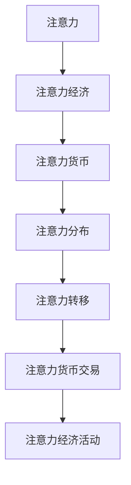

                 

# 注意力经济学:元宇宙中的价值重构

在元宇宙的世界里，一切皆为虚拟。从游戏到社交，从工作到娱乐，人们所经历的每一个瞬间，都是通过精心设计的虚拟场景进行交互与体验。元宇宙不仅是一个技术环境，更是一个价值生态，其中“注意力”成为一种稀缺的资源，也是重构虚拟经济价值的关键。本文将探讨注意力经济学的原理，以及如何在元宇宙中重构其价值链，释放新一轮的经济增长潜力。

## 1. 背景介绍

### 1.1 问题由来
随着数字技术的发展，虚拟世界中的用户参与度、消费习惯、决策逻辑都在不断变化。传统的商业模式、内容分发、营销策略已经难以适应新形势下的市场需求。而注意力经济学，作为新兴的经济学领域，开始成为理解这些变化的关键工具。

### 1.2 问题核心关键点
注意力经济学是研究在信息过载的时代，如何吸引和保持用户注意力的学科。其核心在于理解注意力资源在虚拟世界中的稀缺性和重要性，如何通过技术手段和商业策略实现价值最大化。

元宇宙的出现为注意力经济学提供了新的实验场。在元宇宙中，“数字货币、虚拟资产、用户体验、内容生产、社交互动、游戏玩法等皆可转化为价值，这些价值的交换与分配，依托于用户的注意力资源。

## 2. 核心概念与联系

### 2.1 核心概念概述

在元宇宙中，注意力资源成为一种稀缺的货币，吸引并保持用户的注意力成为各方的共同目标。以下是几个关键概念：

- **注意力(Attention)**：用户在虚拟世界中的停留时间、互动频率、信息摄入量等行为。
- **注意力经济(Attention Economy)**：通过吸引并保持用户注意力，实现商业价值的经济模式。
- **注意力货币(Attention Currency)**：如NFT（非同质化代币）、虚拟货币、游戏内币等，用于衡量和交换注意力资源。
- **注意力分布(Attention Distribution)**：用户注意力在不同平台、应用、内容间的分布规律。
- **注意力转移(Attention Shift)**：用户注意力的动态变化，如从游戏到社交，从工作到娱乐。

这些概念共同构成元宇宙中的注意力经济学体系，是理解和优化虚拟经济的关键。

### 2.2 核心概念原理和架构的 Mermaid 流程图



这个流程图展示了元宇宙中注意力经济学的核心概念和其间的逻辑联系。注意力的吸引和保持最终转化为经济活动，并由注意力货币来衡量和交换。

## 3. 核心算法原理 & 具体操作步骤

### 3.1 算法原理概述

在元宇宙中，注意力经济学的核心算法在于如何设计和优化用户界面(UI)、用户体验(UX)以及内容分发策略，以最大化用户停留时间和互动频率。基于心理学、行为经济学和数据科学，通过计算用户的行为数据，预测和调整其注意力分布。

### 3.2 算法步骤详解

1. **数据采集**：
   - 采集用户在虚拟世界中的行为数据，如浏览时长、互动频率、点击率等。
   - 使用行为分析工具，如Google Analytics、Mixpanel等，收集用户的关键行为指标。

2. **数据分析与建模**：
   - 对采集的数据进行清洗和处理，得到有效数据集。
   - 使用机器学习算法（如线性回归、逻辑回归、决策树等）建立预测模型，预测用户行为和注意力转移。
   - 引入强化学习，优化内容推荐和用户互动策略，提升用户满意度。

3. **优化策略**：
   - 通过A/B测试，比较不同界面和功能设计的效果，选择最优方案。
   - 使用多臂老虎机算法，动态调整内容推荐策略，提高用户留存率。
   - 引入用户反馈机制，通过问卷调查和实时互动数据，持续优化体验。

4. **效果评估**：
   - 定期分析用户行为数据，评估策略的效果。
   - 使用指标如DAU（日活跃用户数）、ARPU（每用户平均收入）、用户满意度等评估注意力经济学策略的效果。

### 3.3 算法优缺点

**优点**：
- **数据驱动**：通过大数据分析，能够精准预测和优化用户行为，提高注意力资源利用效率。
- **策略灵活**：强化学习和多臂老虎机算法使得策略能够动态调整，适应不断变化的市场需求。
- **实时反馈**：用户反馈机制实时更新数据，优化策略，提升用户体验。

**缺点**：
- **隐私问题**：大量数据采集和分析可能涉及用户隐私问题，需要严格遵守数据保护法规。
- **算法复杂**：机器学习和强化学习算法相对复杂，实现和维护成本较高。
- **数据依赖**：对数据质量要求高，采集不准确或偏差大的数据可能导致模型效果不佳。

### 3.4 算法应用领域

注意力经济学的方法和理论在元宇宙中的应用非常广泛，包括但不限于：

- **游戏行业**：通过优化游戏界面、提升游戏体验、调整内容推荐，最大化用户在线时间和消费。
- **虚拟商业**：分析用户购物行为，个性化推荐商品，提升用户购买率和复购率。
- **虚拟社交**：分析用户互动模式，优化社交平台功能，增强用户粘性。
- **虚拟教育**：通过注意力分析，优化教学内容，提高学习效率和用户体验。
- **虚拟展览**：分析用户参观行为，优化展览布局和内容，提升用户参与度。

## 4. 数学模型和公式 & 详细讲解

### 4.1 数学模型构建

注意力经济学的数学模型主要基于以下假设：
- 用户行为可预测，基于历史数据建立概率模型。
- 用户注意力资源有限，在多个任务间分配。
- 用户行为受多种因素影响，包括但不限于心理需求、社交需求、信息需求等。

一个简单的注意力经济学模型可以表示为：

$$
Attention_{i,j}(t) = f(u_i, v_j, c_j, d_t)
$$

其中：
- $Attention_{i,j}(t)$ 表示用户在时间 $t$ 对虚拟内容 $j$ 的注意力分配，$i$ 为第 $i$ 个用户。
- $u_i$ 表示用户 $i$ 的基本特征，如年龄、性别、兴趣等。
- $v_j$ 表示虚拟内容 $j$ 的基本特征，如类型、风格、主题等。
- $c_j$ 表示虚拟内容的当前流行度或热度。
- $d_t$ 表示时间 $t$ 的影响，如当天的特殊活动或节假日。
- $f$ 为预测模型，可以是多种算法组合。

### 4.2 公式推导过程

假设用户 $i$ 在时间 $t$ 对虚拟内容 $j$ 的注意力 $A_{i,j}(t)$ 为：

$$
A_{i,j}(t) = u_i^\top V_j \cdot c_j(t) \cdot \frac{e^{-\beta d_t}}{1 + \sum_{k=1}^K e^{u_i^\top V_k \cdot c_k(t)}}
$$

其中 $V_j$ 为虚拟内容 $j$ 的特征向量，$u_i$ 为用户 $i$ 的特征向量，$\beta$ 为时间 $t$ 的影响系数，$K$ 为所有虚拟内容的数量。

假设用户 $i$ 的注意力总和为 $C_i$，则注意力分配比例为：

$$
\pi_{i,j}(t) = \frac{A_{i,j}(t)}{C_i}
$$

对 $\pi_{i,j}(t)$ 进行最大化，得到：

$$
\max_{\pi} \sum_{i,j} \pi_{i,j}(t) \log \pi_{i,j}(t)
$$

通过拉格朗日乘子法求解，可得到注意力最优分配公式：

$$
\pi_{i,j}(t) = \frac{A_{i,j}(t)}{\sum_k A_{i,k}(t)}
$$

最终，虚拟内容的吸引力为：

$$
Attraction_j(t) = \sum_i \pi_{i,j}(t) \cdot c_j(t)
$$

### 4.3 案例分析与讲解

假设一个虚拟游戏平台有三种内容 $A$、$B$、$C$，用户 $i$ 对内容 $A$、$B$、$C$ 的注意力分别为 $A_i$、$B_i$、$C_i$。

1. **数据采集**：
   - 通过分析用户行为数据，得到内容 $A$、$B$、$C$ 在不同时间段的平均停留时间和点击率。
   - 使用 Google Analytics 收集用户基本信息和互动数据。

2. **模型训练**：
   - 使用线性回归建立用户基本信息和互动行为之间的关系模型，预测用户对各内容的注意力。
   - 引入多臂老虎机算法，根据用户行为调整内容推荐策略，提升用户留存率。

3. **策略优化**：
   - 通过A/B测试，比较不同界面设计的效果，选择最优方案。
   - 实时调整推荐算法，提高内容推荐精度和用户满意度。

4. **效果评估**：
   - 使用DAU、ARPU等指标评估用户行为变化，衡量注意力经济学策略的效果。
   - 通过问卷调查和用户反馈，持续优化用户体验和内容策略。

## 5. 项目实践：代码实例和详细解释说明

### 5.1 开发环境搭建

在进行注意力经济学实践时，我们需要使用Python和相关数据分析工具搭建开发环境。以下是搭建环境的步骤：

1. **安装Python和必要的库**：
   - 安装Python 3.8 或更高版本，推荐使用Anaconda或Miniconda。
   - 使用conda命令安装必要的库，如numpy、pandas、scikit-learn、matplotlib等。

2. **数据预处理**：
   - 使用pandas和numpy对数据进行清洗和预处理，如数据去重、缺失值填充、特征编码等。

3. **模型训练与评估**：
   - 使用scikit-learn和TensorFlow构建和训练预测模型，评估模型效果。
   - 使用TensorBoard对模型训练过程进行可视化，实时监测训练指标。

### 5.2 源代码详细实现

以下是一个基于TensorFlow的注意力经济学预测模型的代码实现：

```python
import tensorflow as tf
from sklearn.preprocessing import LabelEncoder, OneHotEncoder
from sklearn.model_selection import train_test_split
from sklearn.metrics import mean_squared_error, mean_absolute_error

# 定义数据预处理函数
def preprocess_data(X, y):
    le = LabelEncoder()
    y = le.fit_transform(y)
    onehot_encoder = OneHotEncoder(sparse=False, drop='first')
    y = onehot_encoder.fit_transform(y)
    X = pd.get_dummies(X, columns=['age', 'gender'])
    return X, y

# 定义模型训练函数
def train_model(X_train, y_train, X_test, y_test):
    X_train = tf.feature_column.input_layer(X_train)
    y_train = tf.feature_column.input_layer(y_train)
    model = tf.keras.Sequential([
        tf.keras.layers.Dense(64, activation='relu'),
        tf.keras.layers.Dense(32, activation='relu'),
        tf.keras.layers.Dense(3, activation='softmax')
    ])
    model.compile(optimizer='adam', loss='categorical_crossentropy', metrics=['accuracy'])
    model.fit(X_train, y_train, epochs=10, validation_data=(X_test, y_test))
    return model

# 加载数据集，并进行预处理
data = pd.read_csv('user_data.csv')
X = data[['age', 'gender']]
y = data['content'] # 假设内容的类型用0,1,2表示
X_train, X_test, y_train, y_test = train_test_split(X, y, test_size=0.2)

# 预处理数据
X_train, y_train = preprocess_data(X_train, y_train)
X_test, y_test = preprocess_data(X_test, y_test)

# 训练模型
model = train_model(X_train, y_train, X_test, y_test)

# 评估模型
y_pred = model.predict(X_test)
mse = mean_squared_error(y_test, y_pred)
mae = mean_absolute_error(y_test, y_pred)
print('Mean Squared Error: ', mse)
print('Mean Absolute Error: ', mae)
```

### 5.3 代码解读与分析

上述代码实现了一个简单的注意力经济学预测模型。其核心步骤包括：

- **数据预处理**：使用LabelEncoder和OneHotEncoder对标签进行编码，使用pd.get_dummies将文本数据转换为one-hot编码形式。
- **模型训练**：定义了一个包含两个隐藏层的神经网络，使用adam优化器和交叉熵损失函数进行训练。
- **模型评估**：使用均方误差和平均绝对误差评估模型预测效果。

## 6. 实际应用场景

### 6.1 智能游戏推荐

在游戏推荐中，通过分析用户的游戏行为，推荐合适的内容和任务，提升用户的游戏体验和留存率。基于用户历史数据和实时数据，构建多臂老虎机模型，优化游戏推荐算法。

### 6.2 虚拟商业互动

在虚拟商业中，通过分析用户购物行为和互动数据，个性化推荐商品，提升用户购买率和复购率。使用注意力经济学模型预测用户对商品的关注度，优化商品展示策略。

### 6.3 虚拟社交平台

在虚拟社交平台中，分析用户互动模式，优化社交平台功能，增强用户粘性。通过用户注意力数据的分析，优化内容分发策略，提升用户活跃度和满意度。

## 7. 工具和资源推荐

### 7.1 学习资源推荐

为了帮助开发者系统掌握注意力经济学的原理和实践技巧，这里推荐一些优质的学习资源：

1. **《注意力经济学:元宇宙中的价值重构》系列博文**：由作者撰写，深入浅出地介绍了注意力经济学的核心概念和前沿技术。
2. **斯坦福大学《人工智能导论》课程**：涵盖AI的基本原理和应用，有助于理解注意力经济学的基础理论。
3. **《机器学习实战》书籍**：介绍了常见的机器学习算法和实际应用案例，有助于实现注意力经济学中的预测模型。

### 7.2 开发工具推荐

在实现注意力经济学时，需要利用强大的数据处理和机器学习工具。以下是推荐的开发工具：

1. **Python**：Python是数据科学和机器学习的主流语言，拥有丰富的库和工具支持。
2. **Jupyter Notebook**：强大的交互式开发环境，支持实时调试和可视化。
3. **TensorFlow**：谷歌开发的深度学习框架，提供强大的模型构建和训练能力。
4. **scikit-learn**：Python的数据科学库，提供多种机器学习算法和评估工具。

### 7.3 相关论文推荐

注意力经济学是新兴的学科，相关研究仍在不断探索中。以下是几篇有代表性的相关论文，推荐阅读：

1. **《注意力经济学的理论与实践》**：系统介绍了注意力经济学的基本理论和应用。
2. **《元宇宙中的注意力经济学》**：分析了元宇宙中的注意力资源分配和经济模式。
3. **《多臂老虎机算法在推荐系统中的应用》**：探讨了多臂老虎机算法在个性化推荐中的应用。

## 8. 总结：未来发展趋势与挑战

### 8.1 研究成果总结

本文对注意力经济学在元宇宙中的应用进行了系统的介绍，包括其基本原理、操作流程和应用实例。通过案例分析，展示了如何利用注意力经济学模型优化虚拟经济中的用户体验和资源分配。

### 8.2 未来发展趋势

展望未来，注意力经济学将呈现以下几个发展趋势：

1. **多模态融合**：元宇宙中的用户注意力不仅来自视觉和听觉，还包括触觉、嗅觉等多模态信息。多模态融合将提升注意力经济学的准确性和丰富度。
2. **动态优化**：随着数据和算法的不断优化，注意力经济学模型将具备实时动态优化的能力，根据用户行为实时调整策略。
3. **深度学习应用**：深度学习算法在注意力经济学中的应用将越来越广泛，提升模型的预测精度和用户体验。
4. **跨平台协作**：不同平台之间的用户注意力资源将通过协作机制实现共享和优化，提升整体的经济效益。

### 8.3 面临的挑战

尽管注意力经济学在元宇宙中具有广阔的应用前景，但仍面临诸多挑战：

1. **数据隐私**：大规模数据采集和分析涉及用户隐私问题，需要严格遵守数据保护法规。
2. **算法复杂度**：多臂老虎机等算法的实现和优化复杂，需要高性能的计算资源。
3. **实时性要求高**：实时动态优化和用户反馈需要高效的计算和存储系统支持。

### 8.4 研究展望

未来，需要不断优化和改进注意力经济学模型，提升其预测准确性和实时性。同时，研究跨平台协作机制，实现用户注意力的共享和优化，提升整体经济效率。探索多模态融合和深度学习技术，提升模型应用范围和效果。

## 9. 附录：常见问题与解答

**Q1：注意力经济学在元宇宙中的应用前景如何？**

A: 注意力经济学在元宇宙中的应用前景广阔，通过吸引和保持用户注意力，可以显著提升虚拟经济的价值。具体应用包括游戏推荐、虚拟商业互动、社交平台优化等。

**Q2：注意力经济学模型的构建和优化需要哪些步骤？**

A: 注意力经济学模型的构建和优化一般包括以下步骤：数据采集、数据预处理、模型训练、策略优化和效果评估。每一步都需要根据具体应用场景和数据特点进行调整和优化。

**Q3：多臂老虎机算法在注意力经济学中的应用优势是什么？**

A: 多臂老虎机算法能够根据用户行为动态调整策略，提升用户留存率和满意度。其优势在于能够实时优化注意力分配，最大化经济收益。

**Q4：在元宇宙中如何保护用户隐私？**

A: 在元宇宙中，保护用户隐私至关重要。可以通过匿名化处理、数据脱敏等手段保护用户数据隐私。同时，遵循GDPR、CCPA等国际数据保护法规，确保数据使用的合法合规。

**Q5：注意力经济学模型如何适应元宇宙中的多模态数据？**

A: 在元宇宙中，用户注意力不仅来自视觉和听觉，还包括触觉、嗅觉等多模态信息。可以通过多模态融合技术，提升模型对多模态数据的处理能力，提升预测精度和用户体验。

---
作者：禅与计算机程序设计艺术 / Zen and the Art of Computer Programming

