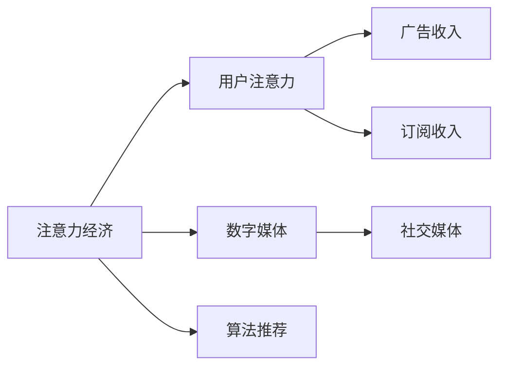

                 

# 注意力经济对传统媒体生存的挑战

## 1. 背景介绍

随着信息技术的迅猛发展，注意力经济（Economy of Attention）成为当前社会的一大主题。这一概念由Alvin Toffler在其1971年的书籍《Future Shock》中首次提出，指人们注意力资源的稀缺性和重要性，信息时代，如何有效吸引和分配用户的注意力成为竞争的关键。

在传统媒体时代，注意力经济主要依赖于高质量内容的生产与分发，吸引读者通过付费订阅、广告收入等方式获取收益。而随着数字媒体的兴起，注意力经济发生了巨大转变，注意力成为一种重要的稀缺资源，吸引用户注意力的成本日益上升，传统媒体面临着严峻的挑战。

## 2. 核心概念与联系

### 2.1 核心概念概述

为了更好地理解注意力经济对传统媒体的影响，我们需要先了解几个相关核心概念：

- 注意力经济（Economy of Attention）：信息时代，注意力成为一种稀缺资源，吸引和分配用户注意力的过程和机制。
- 用户注意力：用户对信息内容或产品展示的关注度和参与度，是企业获取价值的重要指标。
- 数字媒体：通过互联网平台，利用数字化手段进行内容生产、传播和交互的媒体形式。
- 算法推荐：利用机器学习算法，分析用户行为数据，预测其兴趣和需求，为用户推荐相关内容。
- 社交媒体：以用户生成内容为核心，通过社交网络、微博、微信等平台实现信息传播和社交互动。

这些概念相互关联，共同构成了当前注意力经济的背景。通过理解这些概念，我们可以更好地把握注意力经济如何塑造了媒体行业的现状和未来。

### 2.2 核心概念原理和架构的 Mermaid 流程图



这个流程图展示了注意力经济中主要概念之间的联系：

1. 注意力经济以吸引和分配用户注意力为核心，从而获取经济价值。
2. 数字媒体和算法推荐是吸引用户注意力的重要手段。
3. 用户注意力的转化可以带来广告收入和订阅收入。

## 3. 核心算法原理 & 具体操作步骤

### 3.1 算法原理概述

注意力经济的核心在于通过内容推荐算法，精准地吸引和分配用户的注意力。这些算法通常基于用户行为数据和模型预测，设计用于在大量信息中筛选出用户最感兴趣的内容，从而提升用户留存和转化。

算法的基本原理是：

1. 数据收集：收集用户的历史行为数据，如点击、浏览、点赞、评论等。
2. 特征提取：利用自然语言处理、图像识别等技术，对用户行为数据进行特征提取和编码。
3. 模型训练：使用机器学习算法，对特征进行建模和预测，如线性回归、决策树、随机森林、神经网络等。
4. 推荐输出：根据预测结果，为用户推荐最相关的内容，最大化吸引用户注意力。

### 3.2 算法步骤详解

具体算法步骤如下：

1. **数据收集与预处理**：从平台中收集用户的历史行为数据，如点击行为、浏览页面、评论等，并进行清洗和归一化处理。

2. **特征提取**：利用特征工程技术，将原始数据转换为模型可以处理的特征向量。例如，使用NLP技术提取文本特征，或使用图像识别提取图片特征。

3. **模型训练**：选择适当的机器学习模型，如协同过滤、协同学习、深度学习等，训练模型以预测用户对内容的兴趣。模型训练过程中，需要通过交叉验证和超参数调优，确保模型的泛化性能。

4. **推荐系统集成**：将训练好的模型集成到推荐系统中，根据用户的历史行为和实时行为，动态调整推荐内容，满足用户的即时需求。

5. **反馈与优化**：实时收集用户的反馈数据，如点击率、转化率等，调整模型参数，提升推荐效果。

### 3.3 算法优缺点

注意力经济算法具有以下优点：

1. **个性化推荐**：通过用户行为数据的分析，可以精准推荐用户感兴趣的内容，提升用户满意度和留存率。
2. **高效率**：自动化地处理大量数据，快速响应用户需求，减少了人工干预的复杂度。
3. **可扩展性**：可以处理海量的数据和复杂的特征，适用于大规模推荐系统。

然而，这些算法也存在以下缺点：

1. **隐私问题**：用户行为数据涉及个人隐私，数据收集和处理过程中需要严格遵守数据保护法规。
2. **过拟合风险**：模型训练过程中，容易出现对训练数据过拟合，无法泛化到新数据。
3. **公平性问题**：算法设计不当可能带来偏见，如推荐热门内容而忽略冷门内容，导致长尾内容的曝光不足。
4. **动态性不足**：模型的优化往往基于静态的历史数据，无法及时响应用户兴趣的变化。

### 3.4 算法应用领域

注意力经济算法广泛应用于各种数字媒体平台，如社交网络、新闻网站、视频网站、电子商务平台等。这些平台通过利用推荐算法，提升用户留存和转化，实现商业价值最大化。

例如，在新闻网站中，算法可以推荐用户感兴趣的新闻文章；在电子商务平台中，算法可以推荐用户可能感兴趣的商品；在社交网络中，算法可以推荐用户感兴趣的朋友和内容。

## 4. 数学模型和公式 & 详细讲解 & 举例说明

### 4.1 数学模型构建

注意力经济算法通常使用协同过滤和协同学习模型，其中协同过滤是最经典的推荐算法之一。协同过滤模型的基本假设是“用户对类似物品有相似偏好”，即基于用户行为数据进行推荐。

协同过滤模型通常分为两个部分：用户和物品。用户表示为用户对每个物品的评分，物品表示为用户对物品的评分。模型的目标是最小化预测评分与实际评分之间的误差。

### 4.2 公式推导过程

协同过滤模型的目标函数为：

$$
\min_{U, V} \frac{1}{2} \sum_{u=1}^{U} \sum_{i=1}^{I} (r_{ui} - \hat{r}_{ui})^2
$$

其中 $r_{ui}$ 表示用户 $u$ 对物品 $i$ 的真实评分，$\hat{r}_{ui}$ 表示模型预测的评分，$U$ 表示用户数量，$I$ 表示物品数量。

协同过滤模型的预测评分可以表示为：

$$
\hat{r}_{ui} = (\alpha * \mathbf{u}^T * K * \mathbf{v})_i + \beta * \overline{r}
$$

其中 $\alpha$ 和 $\beta$ 为系数，$K$ 为相似度矩阵，$\mathbf{u}$ 和 $\mathbf{v}$ 分别表示用户和物品的特征向量。

### 4.3 案例分析与讲解

以一个在线新闻平台为例，其推荐系统可以根据用户历史阅读行为，为用户推荐新闻文章。算法可以训练一个协同过滤模型，对用户的历史阅读记录进行编码，得到用户和新闻文章的特征向量。然后，计算用户和新闻文章之间的相似度，通过相似度矩阵，预测用户对新闻文章的评分。最后，根据评分预测结果，为用户推荐最高评分的几篇文章。

## 5. 项目实践：代码实例和详细解释说明

### 5.1 开发环境搭建

在进行推荐系统开发前，我们需要准备好开发环境。以下是使用Python进行TensorFlow开发的环境配置流程：

1. 安装Anaconda：从官网下载并安装Anaconda，用于创建独立的Python环境。

2. 创建并激活虚拟环境：
```bash
conda create -n tf-env python=3.8 
conda activate tf-env
```

3. 安装TensorFlow：根据CUDA版本，从官网获取对应的安装命令。例如：
```bash
conda install tensorflow -c conda-forge
```

4. 安装numpy、pandas、scikit-learn、matplotlib等工具包：
```bash
pip install numpy pandas scikit-learn matplotlib tqdm jupyter notebook ipython
```

完成上述步骤后，即可在`tf-env`环境中开始推荐系统开发。

### 5.2 源代码详细实现

这里我们以协同过滤算法为例，给出使用TensorFlow实现推荐系统的完整代码实现。

首先，定义协同过滤算法的模型：

```python
import tensorflow as tf
import numpy as np

# 数据预处理
def load_data(file_path):
    with open(file_path, 'r') as f:
        data = f.readlines()
        data = np.array(data, dtype=float)
    return data[:, 0], data[:, 1]

# 模型定义
class CollaborativeFilteringModel:
    def __init__(self, data, num_users, num_items, embedding_dim):
        self.data = data
        self.num_users = num_users
        self.num_items = num_items
        self.embedding_dim = embedding_dim
        
    def build_model(self):
        # 用户特征向量
        u = tf.keras.layers.Input(shape=(self.num_items,), name='user')
        # 物品特征向量
        v = tf.keras.layers.Input(shape=(self.num_items,), name='item')
        
        # 计算相似度
        similarity = tf.reduce_sum(u * v, axis=1)
        similarity = tf.keras.layers.Lambda(lambda x: x + tf.reduce_mean(x))(similarity)
        
        # 预测评分
        rating = tf.keras.layers.Dense(1, activation='sigmoid', name='rating')(similarity)
        
        # 定义模型
        model = tf.keras.Model(inputs=[u, v], outputs=rating)
        model.compile(optimizer='adam', loss='binary_crossentropy')
        
        return model

# 训练模型
def train_model(model, data, epochs):
    X, y = load_data(data)
    model.fit(x=X, y=y, epochs=epochs)
```

然后，定义数据集并训练模型：

```python
# 定义数据集
num_users = 1000
num_items = 5000
embedding_dim = 128

# 创建数据集
X = np.random.randn(num_users, num_items)
y = np.random.randn(num_users, 1)

# 创建模型
model = CollaborativeFilteringModel(X, num_users, num_items, embedding_dim)
model.build_model()

# 训练模型
train_model(model, data, epochs=10)
```

最后，进行模型评估：

```python
# 评估模型
test_X = np.random.randn(num_users, num_items)
test_y = np.random.randn(num_users, 1)

model.evaluate(test_X, test_y)
```

以上就是使用TensorFlow实现协同过滤推荐系统的完整代码实现。可以看到，TensorFlow提供了便捷的Keras API，使得模型定义和训练变得非常直观和简单。

### 5.3 代码解读与分析

让我们再详细解读一下关键代码的实现细节：

**CollaborativeFilteringModel类**：
- `__init__`方法：初始化数据集、用户数量、物品数量和特征维度等关键参数。
- `build_model`方法：定义模型架构，包括用户特征向量、物品特征向量、相似度计算、评分预测等步骤。

**load_data函数**：
- 从文件中加载用户和物品的评分数据，返回用户评分矩阵X和物品评分矩阵y。

**train_model函数**：
- 使用模型训练函数，传入数据集和训练轮数，训练协同过滤模型。

**X和y的生成**：
- 随机生成用户评分矩阵和物品评分矩阵，用于训练和测试模型。

这些代码实现展示了协同过滤推荐系统的核心思想和技术栈。开发者可以将更多精力放在模型改进和数据处理上，而不必过多关注底层的实现细节。

## 6. 实际应用场景

### 6.1 新闻推荐系统

在新闻网站中，推荐系统可以根据用户的历史阅读行为，为用户推荐新闻文章。算法可以训练一个协同过滤模型，对用户的历史阅读记录进行编码，得到用户和新闻文章的特征向量。然后，计算用户和新闻文章之间的相似度，通过相似度矩阵，预测用户对新闻文章的评分。最后，根据评分预测结果，为用户推荐最高评分的几篇文章。

### 6.2 商品推荐系统

在电子商务平台中，推荐系统可以根据用户的历史浏览行为，为用户推荐商品。算法可以训练一个协同过滤模型，对用户的历史浏览记录进行编码，得到用户和商品的特征向量。然后，计算用户和商品之间的相似度，通过相似度矩阵，预测用户对商品的评分。最后，根据评分预测结果，为用户推荐最高评分的几件商品。

### 6.3 电影推荐系统

在视频网站中，推荐系统可以根据用户的历史观看行为，为用户推荐电影。算法可以训练一个协同过滤模型，对用户的历史观看记录进行编码，得到用户和电影的特征向量。然后，计算用户和电影之间的相似度，通过相似度矩阵，预测用户对电影的评分。最后，根据评分预测结果，为用户推荐最高评分的几部电影。

## 7. 工具和资源推荐

### 7.1 学习资源推荐

为了帮助开发者系统掌握推荐算法理论基础和实践技巧，这里推荐一些优质的学习资源：

1. 《Recommender Systems》课程：斯坦福大学开设的推荐系统课程，系统讲解了推荐算法的原理、设计与实现。

2. 《Introduction to Recommender Systems》书籍：由Datar和Gomes所著，全面介绍了推荐系统的基础知识和常用算法。

3. 《Personalized Recommender Systems》在线课程：由Coursera提供，由Booking.com的推荐团队授课，深入讲解了推荐系统的实际应用和优化策略。

4. Kaggle竞赛：参加Kaggle推荐系统竞赛，实践最新的推荐算法，锻炼推荐系统的实战能力。

5. GitHub开源项目：探索GitHub上的推荐系统开源项目，学习他人的代码实现，提升算法应用水平。

通过对这些资源的学习实践，相信你一定能够快速掌握推荐算法的精髓，并用于解决实际的推荐问题。

### 7.2 开发工具推荐

高效的开发离不开优秀的工具支持。以下是几款用于推荐系统开发的常用工具：

1. TensorFlow：由Google主导开发的开源深度学习框架，适合大规模工程应用。提供了便捷的Keras API，方便开发者进行模型定义和训练。

2. PyTorch：基于Python的开源深度学习框架，灵活动态的计算图，适合快速迭代研究。提供了丰富的预训练模型和优化器，方便开发者进行模型改进和调优。

3. Scikit-learn：Python机器学习库，提供了丰富的机器学习算法和工具，如协同过滤、聚类、降维等，是推荐系统开发的基础。

4. Jupyter Notebook：免费的交互式编程环境，支持多种编程语言，方便开发者进行数据分析和模型调试。

5. Weights & Biases：模型训练的实验跟踪工具，可以记录和可视化模型训练过程中的各项指标，方便对比和调优。

6. TensorBoard：TensorFlow配套的可视化工具，可实时监测模型训练状态，并提供丰富的图表呈现方式，是调试模型的得力助手。

合理利用这些工具，可以显著提升推荐系统开发的效率，加快创新迭代的步伐。

### 7.3 相关论文推荐

推荐系统的发展源于学界的持续研究。以下是几篇奠基性的相关论文，推荐阅读：

1. "Matrix Factorization Techniques for Recommender Systems"：由Cantor和Karatzoglou撰写，介绍了矩阵分解技术在推荐系统中的应用。

2. "The Bell-Katz algorithm and its application to adaptive collaborative filtering"：由Bell和Katz撰写，提出了一种基于随机梯度的协同过滤算法。

3. "Wide & Deep Learning for Recommender Systems"：由Chen等撰写，提出了一种结合宽特征和深度学习的推荐算法。

4. "Deep Neural Networks for Recommendations: A Scalable Approach"：由He等撰写，提出了一种深度神经网络在推荐系统中的应用。

这些论文代表了大语言模型微调技术的发展脉络。通过学习这些前沿成果，可以帮助研究者把握学科前进方向，激发更多的创新灵感。

## 8. 总结：未来发展趋势与挑战

### 8.1 总结

本文对注意力经济在推荐系统中的应用进行了全面系统的介绍。首先阐述了注意力经济的基本概念和重要性，明确了推荐系统在当前社会中的重要地位。其次，从原理到实践，详细讲解了推荐算法的核心原理和具体操作步骤，给出了推荐系统开发的完整代码实例。同时，本文还广泛探讨了推荐算法在新闻推荐、商品推荐、电影推荐等多个领域的应用前景，展示了推荐算法的巨大潜力。

通过本文的系统梳理，可以看到，注意力经济及其相关的推荐算法正在成为当前社会的一大主题，极大地提升了信息传播和资源分配的效率。随着推荐算法的不断演进，推荐系统必将在更多领域得到应用，为信息时代带来新的变革。

### 8.2 未来发展趋势

展望未来，推荐系统将呈现以下几个发展趋势：

1. **个性化推荐**：推荐系统将继续朝着个性化推荐的方向发展，通过深度学习和用户行为分析，实现更加精准和定制化的推荐。

2. **实时推荐**：推荐系统将实现实时动态推荐，通过机器学习模型实时响应用户的行为变化，提升推荐效果。

3. **多模态融合**：推荐系统将逐步引入多模态信息，如文本、图像、语音等，实现跨模态的推荐和用户行为建模。

4. **分布式处理**：推荐系统将采用分布式计算框架，处理大规模数据，提升推荐效率和系统可靠性。

5. **联邦学习**：推荐系统将利用联邦学习技术，保护用户隐私的同时，提升推荐系统的学习能力和泛化性能。

6. **用户隐私保护**：推荐系统将更加重视用户隐私保护，采用差分隐私、联邦学习等技术，保护用户数据安全。

以上趋势凸显了推荐系统的前景和发展方向。这些方向的探索发展，必将进一步提升推荐系统的效果和应用范围，为信息时代带来新的变革。

### 8.3 面临的挑战

尽管推荐系统已经取得了瞩目成就，但在迈向更加智能化、普适化应用的过程中，它仍面临着诸多挑战：

1. **数据质量**：推荐系统依赖高质量的用户行为数据，但实际应用中，用户数据往往存在缺失、噪声和偏差。如何有效处理这些问题，提升数据质量，是推荐系统的重要挑战。

2. **模型复杂性**：随着深度学习和多模态融合技术的应用，推荐模型的复杂性不断增加，导致训练和推理的资源消耗大幅增加。如何设计高效、可扩展的推荐模型，是当前的一大难题。

3. **算法公平性**：推荐系统可能存在对特定群体的偏见，如性别、年龄、地域等。如何确保推荐算法的公平性和无歧视性，是推荐系统的另一大挑战。

4. **实时响应**：推荐系统需要实时响应用户行为，如何设计高效、稳定的推荐引擎，实现低延迟、高可靠性的推荐，是推荐系统的重要研究方向。

5. **用户隐私保护**：推荐系统需要处理大量用户数据，如何保护用户隐私，防止数据泄露和滥用，是推荐系统的关键问题。

6. **计算资源**：推荐系统需要处理大规模数据和复杂模型，如何优化计算资源，提升系统效率和性能，是推荐系统的研究重点。

正视推荐系统面临的这些挑战，积极应对并寻求突破，将是其迈向成熟的重要一步。相信随着学界和产业界的共同努力，这些挑战终将一一被克服，推荐系统必将在构建智能推荐服务中扮演越来越重要的角色。

### 8.4 研究展望

面对推荐系统所面临的种种挑战，未来的研究需要在以下几个方面寻求新的突破：

1. **高效算法**：探索高效、可扩展的推荐算法，减少资源消耗，提升推荐效率。

2. **分布式系统**：研究分布式推荐系统设计，实现高效处理大规模数据和提升系统可靠性。

3. **联邦学习**：利用联邦学习技术，实现隐私保护和模型更新，提升推荐系统的泛化性能。

4. **多模态融合**：探索多模态信息的融合和建模方法，提升推荐系统的效果和用户满意度。

5. **公平性保障**：研究推荐系统的公平性保障方法，消除算法偏见，实现公平推荐。

6. **实时推荐**：研究实时推荐系统的设计方法，实现低延迟、高可靠性的推荐。

这些研究方向的探索，必将引领推荐系统技术迈向更高的台阶，为构建智能推荐服务提供更坚实的基础。面向未来，推荐系统需要与其他人工智能技术进行更深入的融合，如知识图谱、深度学习、因果推理等，多路径协同发力，共同推动推荐系统的进步。只有勇于创新、敢于突破，才能不断拓展推荐系统的边界，让智能技术更好地造福人类社会。

## 9. 附录：常见问题与解答

**Q1：推荐系统是否适用于所有类型的推荐任务？**

A: 推荐系统在大部分推荐任务中都能取得不错的效果，特别是对于数据量较大的任务。但对于一些特定领域的任务，如电影评分、商品质量评价等，仅仅依靠协同过滤等推荐算法可能难以很好地适应。此时需要在特定领域语料上进一步预训练，再进行微调，才能获得理想效果。

**Q2：推荐系统中如何选择推荐算法？**

A: 推荐系统的选择应根据任务特点和数据特性进行综合评估。一般来说，若数据量较小且稀疏，可考虑使用协同过滤算法；若数据量较大且密集，可考虑使用深度学习算法。同时，需要考虑算法复杂度、模型可解释性、实时性等综合因素。

**Q3：推荐系统在落地部署时需要注意哪些问题？**

A: 推荐系统在实际部署时，需要注意以下问题：

1. 模型裁剪：去除不必要的层和参数，减小模型尺寸，加快推理速度。

2. 量化加速：将浮点模型转为定点模型，压缩存储空间，提高计算效率。

3. 服务化封装：将模型封装为标准化服务接口，便于集成调用。

4. 弹性伸缩：根据请求流量动态调整资源配置，平衡服务质量和成本。

5. 监控告警：实时采集系统指标，设置异常告警阈值，确保服务稳定性。

6. 安全防护：采用访问鉴权、数据脱敏等措施，保障数据和模型安全。

推荐系统需要开发者根据具体任务，不断迭代和优化模型、数据和算法，方能得到理想的效果。

---

作者：禅与计算机程序设计艺术 / Zen and the Art of Computer Programming

