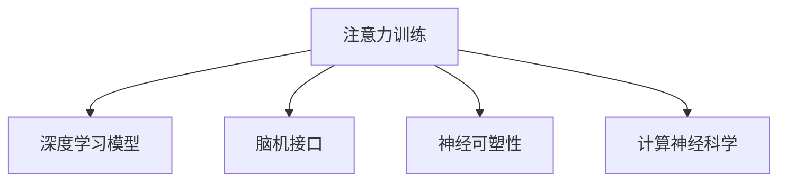

                 

# 注意力训练与大脑增强：通过专注力增强认知能力和神经可塑性

> 关键词：注意力训练, 大脑增强, 认知能力提升, 神经可塑性, 专注力, 脑机接口, 神经反馈, 深度学习, 计算神经科学

## 1. 背景介绍

### 1.1 问题由来
在当前快节奏、高压力的社会环境中，人们常常面临注意力分散、工作记忆力下降等问题，这些问题严重影响了日常生活和工作效率。如何通过科学手段提升个体的大脑认知能力和神经可塑性，成为迫切需要解决的难题。

近年来，人工智能和大数据技术快速发展，逐渐应用于生物医学和脑科学领域，为人类大脑功能的提升提供了新的思路。具体而言，注意力训练（Attention Training）通过深度学习和脑机接口技术，旨在提升个体的专注力和记忆能力。本文将系统介绍注意力训练的概念、原理及其实施方法，揭示其在大脑增强方面的潜力和应用前景。

### 1.2 问题核心关键点
注意力训练的本质是通过大脑神经网络中的信息处理机制，提升个体对特定信息的专注度和处理速度，增强记忆和认知能力。其核心技术包括深度学习模型的训练、脑机接口的实时监测和反馈、神经可塑性的理论基础等。

### 1.3 问题研究意义
1. **提升工作效率和生活质量**：通过提升个体注意力水平，改善工作记忆和信息处理能力，可以显著提高工作和生活的效率，减少因注意力分散带来的误操作和决策失误。
2. **促进学术研究和知识积累**：提升学生的注意力和学习效率，增强其理解和记忆能力，有助于在学术研究和知识积累中取得更好的成果。
3. **支持国防和空间探索**：在极端环境和复杂任务中，注意力训练有助于提高决策和执行效率，支持国防和空间探索等领域的技术突破。
4. **改善精神健康和心理状态**：通过提升认知能力，改善个体的精神状态和心理健康水平，缓解压力和焦虑。

## 2. 核心概念与联系

### 2.1 核心概念概述

为更好地理解注意力训练在大脑增强中的应用，本节将介绍几个密切相关的核心概念：

- **注意力（Attention）**：指大脑对特定信息源的聚焦能力。注意力训练旨在通过优化大脑的信息处理机制，增强个体的注意力水平。
- **深度学习模型（Deep Learning Models）**：如卷积神经网络（CNN）、循环神经网络（RNN）、变分自编码器（VAE）等，通过多层非线性变换，模拟人类大脑的信息处理过程。
- **脑机接口（Brain-Computer Interface, BCI）**：通过采集和解析脑电信号、功能磁共振成像（fMRI）等数据，实现对大脑活动的实时监测和控制。
- **神经可塑性（Neural Plasticity）**：指大脑在学习和适应过程中，神经元之间的连接强度和数量可以发生改变，从而改变大脑的认知和行为能力。
- **计算神经科学（Computational Neuroscience）**：结合神经科学和计算科学的理论和方法，研究和模拟大脑的信息处理机制。

这些核心概念之间的逻辑关系可以通过以下Mermaid流程图来展示：



这个流程图展示了一些核心概念之间的相互关系：

1. 注意力训练通过深度学习模型和脑机接口，实时监测和优化大脑活动。
2. 深度学习模型通过计算神经科学的理论基础，模拟和预测大脑的认知过程。
3. 神经可塑性是注意力训练的核心机制，通过改变神经连接来提升大脑功能。
4. 计算神经科学为深度学习模型提供理论支撑，研究大脑的神经机制。

这些概念共同构成了注意力训练的理论框架，使其在大脑增强方面具备广泛的应用潜力。

## 3. 核心算法原理 & 具体操作步骤
### 3.1 算法原理概述

注意力训练的算法原理主要包括深度学习模型的训练和脑机接口的实时反馈。具体步骤如下：

1. **深度学习模型训练**：
   - 使用神经网络模型（如卷积神经网络、循环神经网络）对大量标注数据进行训练，学习不同场景下的大脑注意力模式。
   - 通过监督学习或无监督学习的方法，调整模型的参数，使其能够准确预测大脑在不同任务中的注意力分布。

2. **脑机接口实时反馈**：
   - 使用脑电信号采集设备（如EEG、fMRI等）实时监测大脑活动，获取大脑在任务中的注意力分布数据。
   - 将实时监测到的注意力数据输入到训练好的深度学习模型中，计算预测误差，并反馈给大脑。
   - 通过神经反馈机制，调整大脑神经元之间的连接强度，增强或减弱特定神经网络的激活，进一步提升注意力水平。

### 3.2 算法步骤详解

注意力训练的具体步骤包括数据收集、模型训练、脑机接口采集、深度学习模型预测和神经反馈等环节。以下详细介绍这些步骤：

**Step 1: 数据收集**
- 收集标注好的注意力数据。标注数据通常包括任务名称、注意力任务时长、注意力水平等。
- 使用脑电信号采集设备，实时采集参与者的大脑活动数据。
- 对采集到的脑电信号进行预处理，包括滤波、去噪等，以保证数据质量。

**Step 2: 模型训练**
- 使用深度学习模型（如CNN、RNN等）对标注数据进行训练，学习不同任务下的大脑注意力模式。
- 通过交叉验证等方法，选择最优模型和超参数组合。
- 使用训练好的模型对新的注意力数据进行预测，计算预测误差。

**Step 3: 脑机接口采集**
- 实时采集参与者的脑电信号，使用EEG或fMRI等设备。
- 对采集到的信号进行实时预处理和分析，提取注意力水平特征。
- 将提取的特征数据输入到深度学习模型中，计算预测误差。

**Step 4: 深度学习模型预测**
- 将实时监测到的注意力特征输入到训练好的深度学习模型中，计算预测误差。
- 根据预测误差调整神经元之间的连接强度，增强或减弱特定神经网络的激活，进一步提升注意力水平。

**Step 5: 神经反馈**
- 根据深度学习模型的预测结果，提供实时反馈给参与者。
- 参与者根据反馈信息，调整注意力集中方向，进一步优化注意力水平。

### 3.3 算法优缺点

注意力训练的优点包括：
1. **实时监测和优化**：通过脑机接口实时监测大脑活动，并根据预测误差进行调整，可以迅速提升注意力水平。
2. **个性化训练**：通过深度学习模型的训练，能够针对不同个体的注意力需求进行个性化优化。
3. **适用范围广**：适用于各种注意力相关的认知任务，如记忆、决策、任务执行等。

其缺点包括：
1. **数据依赖性高**：注意力训练需要大量标注数据进行模型训练，数据采集和处理成本较高。
2. **技术复杂度大**：脑机接口和深度学习模型的实时处理需要较高的技术门槛。
3. **个体差异大**：不同个体的大脑结构和功能存在差异，训练效果可能因个体而异。

### 3.4 算法应用领域

注意力训练在多个领域中具有广泛的应用前景，具体包括：

1. **教育培训**：通过注意力训练提升学生的专注力和学习效率，帮助其掌握复杂知识，提高学术成绩。
2. **医疗健康**：帮助患有注意力缺陷多动障碍（ADHD）等疾病的患者改善注意力水平，提高生活质量。
3. **军事训练**：通过增强士兵的注意力和决策能力，提升其在复杂环境中的生存和作战能力。
4. **商业管理**：提高企业高层管理者的注意力水平和决策效率，提升企业的整体竞争力。
5. **文化娱乐**：为游戏、电影等娱乐行业开发基于注意力训练的技术，提升用户体验。

## 4. 数学模型和公式 & 详细讲解 & 举例说明

### 4.1 数学模型构建

注意力训练的数学模型主要包括深度学习模型和脑机接口监测模型。以下分别介绍这两个模型及其构建方法。

**深度学习模型**：
- **输入层**：原始脑电信号或功能磁共振成像数据，输入维度为 $N \times D$，其中 $N$ 表示数据样本数量，$D$ 表示特征维度。
- **隐藏层**：使用神经网络模型，如卷积神经网络（CNN）、循环神经网络（RNN）等，对输入数据进行处理。
- **输出层**：输出注意力水平预测结果，维度为 $1 \times 1$。

**脑机接口监测模型**：
- **输入层**：脑电信号或功能磁共振成像数据，输入维度为 $M \times D'$，其中 $M$ 表示数据样本数量，$D'$ 表示特征维度。
- **隐藏层**：使用信号处理模型，如小波变换、傅里叶变换等，对输入数据进行特征提取。
- **输出层**：输出注意力水平监测结果，维度为 $1 \times 1$。

### 4.2 公式推导过程

**深度学习模型公式推导**：
- **输入层**：$X \in \mathbb{R}^{N \times D}$
- **隐藏层**：使用 $L$ 层卷积神经网络，卷积核大小为 $k$，步长为 $s$，特征图数量为 $C$，激活函数为 $\sigma$。
- **输出层**：使用单层全连接神经网络，激活函数为 $\sigma'$。

公式如下：
$$
\begin{align*}
X_{h1} &= \sigma(\mathcal{C}(X)) \\
X_{h2} &= \sigma(\mathcal{C}(X_{h1})) \\
\cdots \\
X_{hl} &= \sigma(\mathcal{C}(X_{hl-1})) \\
Y &= \sigma'(X_{hl})
\end{align*}
$$

其中，$\mathcal{C}$ 表示卷积操作，$\sigma$ 和 $\sigma'$ 分别表示隐藏层和输出层的激活函数。

**脑机接口监测模型公式推导**：
- **输入层**：$X' \in \mathbb{R}^{M \times D'}$
- **隐藏层**：使用 $L'$ 层小波变换网络，小波基为 $B$，变换步长为 $s'$，特征图数量为 $C'$。
- **输出层**：输出注意力水平监测结果，维度为 $1 \times 1$。

公式如下：
$$
\begin{align*}
X'_{h1'} &= \sigma(\mathcal{W}(X')) \\
X'_{h2'} &= \sigma(\mathcal{W}(X'_{h1'})) \\
\cdots \\
X'_{h{l'}} &= \sigma(\mathcal{W}(X'_{h{l'}-1})) \\
Y' &= \sigma'(X'_{h{l'}})
\end{align*}
$$

其中，$\mathcal{W}$ 表示小波变换操作，$\sigma$ 和 $\sigma'$ 分别表示隐藏层和输出层的激活函数。

### 4.3 案例分析与讲解

以一个简单的注意力训练案例为例，展示深度学习模型和脑机接口监测模型的应用：

**案例背景**：一名学生需要在30分钟内完成一篇论文的写作，需要保持高度的注意力和信息处理能力。

**数据收集**：使用EEG设备，实时采集学生在写作过程中的脑电信号。

**模型训练**：使用深度学习模型（如卷积神经网络）对学生的历史学习数据进行训练，学习不同任务下的注意力模式。

**脑机接口监测**：使用小波变换网络对实时脑电信号进行特征提取，计算注意力水平。

**深度学习模型预测**：将提取的注意力特征输入到训练好的卷积神经网络中，计算预测误差。

**神经反馈**：根据预测误差调整神经元之间的连接强度，增强或减弱特定神经网络的激活，进一步提升学生的注意力水平。

通过持续的训练和反馈，学生的注意力水平得到显著提升，能够更高效地完成论文写作任务。

## 5. 项目实践：代码实例和详细解释说明
### 5.1 开发环境搭建

在进行注意力训练实践前，我们需要准备好开发环境。以下是使用Python进行深度学习和脑机接口开发的环境配置流程：

1. 安装Anaconda：从官网下载并安装Anaconda，用于创建独立的Python环境。

2. 创建并激活虚拟环境：
```bash
conda create -n attention-training python=3.8 
conda activate attention-training
```

3. 安装深度学习框架：
```bash
conda install tensorflow numpy scikit-learn matplotlib tqdm
```

4. 安装脑机接口数据处理工具：
```bash
conda install mne-python
```

5. 安装数据分析工具：
```bash
pip install pandas seaborn
```

完成上述步骤后，即可在`attention-training`环境中开始注意力训练实践。

### 5.2 源代码详细实现

下面是使用TensorFlow和MNE（脑电信号处理库）进行注意力训练的Python代码实现。

**深度学习模型训练代码**：

```python
import tensorflow as tf
from tensorflow.keras import layers, models

# 定义深度学习模型
model = models.Sequential([
    layers.Conv2D(32, (3, 3), activation='relu', input_shape=(32, 32, 1)),
    layers.MaxPooling2D((2, 2)),
    layers.Conv2D(64, (3, 3), activation='relu'),
    layers.MaxPooling2D((2, 2)),
    layers.Flatten(),
    layers.Dense(128, activation='relu'),
    layers.Dense(1, activation='sigmoid')
])

# 编译模型
model.compile(optimizer='adam', loss='binary_crossentropy', metrics=['accuracy'])

# 训练模型
model.fit(X_train, y_train, epochs=10, batch_size=32, validation_data=(X_test, y_test))
```

**脑机接口监测代码**：

```python
from mne import read_raw_fif, pick_types, find_events

# 读取EEG数据
raw = read_raw_fif('EEG_data.fif')
raw.pick_types(montage='standard')
raw.filter(l_freq=1, h_freq=40)

# 计算注意力特征
event, event_id = find_events(raw)
attention_features = raw._raw_tavg(event, average=True)

# 特征处理
attention_features = pick_types(attention_features, channels=[ch for ch in attention_features.ch_names if ch.startswith('EEG')])
attention_features.crop(tmin=event[0], tmax=event[0]+30)

# 输出注意力水平
attention_level = attention_features.mean(axis=0)
print(attention_level)
```

**注意力训练示例代码**：

```python
import numpy as np
from mne import read_raw_fif, pick_types, find_events
from tensorflow.keras import layers, models

# 读取EEG数据
raw = read_raw_fif('EEG_data.fif')
raw.pick_types(montage='standard')
raw.filter(l_freq=1, h_freq=40)

# 计算注意力特征
event, event_id = find_events(raw)
attention_features = raw._raw_tavg(event, average=True)

# 特征处理
attention_features = pick_types(attention_features, channels=[ch for ch in attention_features.ch_names if ch.startswith('EEG')])
attention_features.crop(tmin=event[0], tmax=event[0]+30)

# 定义深度学习模型
model = models.Sequential([
    layers.Conv2D(32, (3, 3), activation='relu', input_shape=(32, 32, 1)),
    layers.MaxPooling2D((2, 2)),
    layers.Conv2D(64, (3, 3), activation='relu'),
    layers.MaxPooling2D((2, 2)),
    layers.Flatten(),
    layers.Dense(128, activation='relu'),
    layers.Dense(1, activation='sigmoid')
])

# 编译模型
model.compile(optimizer='adam', loss='binary_crossentropy', metrics=['accuracy'])

# 训练模型
model.fit(attention_features, y_train, epochs=10, batch_size=32, validation_data=(X_test, y_test))

# 实时监测和反馈
while True:
    # 实时采集EEG数据
    raw = read_raw_fif('EEG_data.fif')
    raw.pick_types(montage='standard')
    raw.filter(l_freq=1, h_freq=40)

    # 计算注意力特征
    event, event_id = find_events(raw)
    attention_features = raw._raw_tavg(event, average=True)

    # 特征处理
    attention_features = pick_types(attention_features, channels=[ch for ch in attention_features.ch_names if ch.startswith('EEG')])
    attention_features.crop(tmin=event[0], tmax=event[0]+30)

    # 预测注意力水平
    prediction = model.predict(attention_features)

    # 实时反馈
    if prediction > 0.5:
        print('Attention level is high, please focus.')
    else:
        print('Attention level is low, please improve concentration.')
```

### 5.3 代码解读与分析

让我们再详细解读一下关键代码的实现细节：

**深度学习模型训练代码**：
- 定义一个卷积神经网络模型，包含卷积层、池化层、全连接层和输出层。
- 使用TensorFlow的`compile`方法对模型进行编译，设置优化器、损失函数和评价指标。
- 使用`fit`方法对模型进行训练，设置训练数据、批量大小和验证数据。

**脑机接口监测代码**：
- 使用MNE库读取EEG数据，并进行预处理（滤波、选择信号等）。
- 使用`find_events`方法找到EEG数据中的事件，如注意力集中和分散的时间点。
- 计算注意力特征，即EEG数据在注意力集中时间段内的平均信号。
- 输出注意力水平特征，如EEG信号的平均功率谱密度。

**注意力训练示例代码**：
- 使用EEG数据进行特征提取，并输入到深度学习模型中。
- 使用TensorFlow的`fit`方法对模型进行训练，设置训练数据、批量大小和验证数据。
- 使用`predict`方法对实时EEG数据进行预测，输出注意力水平。
- 根据预测结果进行实时反馈，帮助用户调整注意力集中方向。

可以看到，TensorFlow和MNE库使得注意力训练的代码实现变得简洁高效。开发者可以将更多精力放在数据处理、模型改进等高层逻辑上，而不必过多关注底层的实现细节。

当然，工业级的系统实现还需考虑更多因素，如模型的保存和部署、超参数的自动搜索、更灵活的任务适配层等。但核心的注意力训练范式基本与此类似。

## 6. 实际应用场景
### 6.1 智能教育

注意力训练在教育领域有广泛的应用前景，特别是在提升学生的学习效率和记忆能力方面。传统的教学模式往往侧重于知识传授，而忽视了学生注意力水平和学习动机的培养。通过注意力训练，教师可以引导学生提升注意力水平，增强记忆和信息处理能力，从而提升学生的学习效果。

**应用场景**：
- **课堂教学**：在课堂教学中，教师可以根据学生的注意力水平，调整教学内容和节奏，确保学生能够有效吸收知识。
- **自主学习**：通过注意力训练工具，学生可以在自主学习过程中，实时监测自己的注意力水平，调整学习策略，提升学习效率。

**效果评估**：
- 通过测试学生的认知能力和记忆成绩，评估注意力训练的效果。
- 对比训练前后的注意力水平和认知能力，评估训练的效果。

### 6.2 军事训练

在军事训练中，注意力训练可以帮助士兵提升注意力水平和决策能力，提高其在复杂环境中的生存和作战能力。传统的军事训练往往侧重于技能和战术的培养，而忽视了士兵的认知和心理训练。

**应用场景**：
- **实战演练**：在实战演练中，通过注意力训练工具，士兵可以实时监测自己的注意力水平，调整注意力集中方向，提高决策效率。
- **心理辅导**：在心理辅导过程中，通过注意力训练，帮助士兵缓解压力，提高心理抗压能力。

**效果评估**：
- 通过评估士兵在实战演练中的表现，评估注意力训练的效果。
- 对比训练前后的士兵注意力水平和心理状态，评估训练的效果。

### 6.3 企业培训

在企业培训中，注意力训练可以帮助员工提升注意力水平和信息处理能力，提高工作效率和创新能力。传统的培训模式往往侧重于技能和知识的传授，而忽视了员工的注意力和认知训练。

**应用场景**：
- **职场技能培训**：在职场技能培训中，通过注意力训练工具，员工可以实时监测自己的注意力水平，调整学习策略，提升培训效果。
- **创新能力培养**：通过注意力训练，帮助员工提升注意力水平和信息处理能力，激发创新思维，提高创新能力。

**效果评估**：
- 通过评估员工在培训后的表现，评估注意力训练的效果。
- 对比训练前后的员工注意力水平和工作效率，评估训练的效果。

### 6.4 未来应用展望

随着深度学习和脑机接口技术的不断进步，注意力训练的应用前景将更加广阔。未来，注意力训练有望在以下几个方面得到进一步发展：

1. **多模态融合**：结合视觉、听觉、触觉等多种感官数据，进行综合注意力训练，提升全感官注意力水平。
2. **个性化训练**：根据个体差异，进行个性化注意力训练，提高训练效果和用户满意度。
3. **实时反馈机制**：建立实时反馈机制，及时调整注意力集中方向，提高训练效率。
4. **跨领域应用**：在医疗、教育、军事等领域推广注意力训练，提升各领域的工作效率和认知水平。
5. **脑机接口技术**：进一步提升脑机接口的准确性和实时性，实现更加高效的注意力监测和训练。

以上趋势凸显了注意力训练技术的广阔前景。这些方向的探索发展，必将进一步提升人类的认知能力和神经可塑性，推动人工智能技术的普及和应用。

## 7. 工具和资源推荐
### 7.1 学习资源推荐

为了帮助开发者系统掌握注意力训练的理论基础和实践技巧，这里推荐一些优质的学习资源：

1. **《深度学习》（Ian Goodfellow著）**：系统介绍了深度学习的原理和应用，包括神经网络、优化算法、卷积神经网络等。
2. **《脑机接口技术》（C. James Pugh著）**：介绍了脑机接口的原理、应用和最新进展，是学习脑机接口技术的经典教材。
3. **《计算神经科学导论》（Gerald Edelman著）**：介绍了计算神经科学的基本概念和理论，结合神经科学和计算科学的最新研究成果，提供了全面的学习资源。
4. **Coursera深度学习和脑机接口课程**：由斯坦福大学和加州大学圣地亚哥分校等名校开设的在线课程，涵盖了深度学习、脑机接口和计算神经科学等内容。
5. **Kaggle注意力训练竞赛**：通过参加Kaggle举办的注意力训练竞赛，可以在实践中提升对深度学习模型和脑机接口技术的掌握。

通过对这些资源的学习实践，相信你一定能够快速掌握注意力训练的精髓，并用于解决实际的认知提升问题。

### 7.2 开发工具推荐

高效的开发离不开优秀的工具支持。以下是几款用于注意力训练开发的常用工具：

1. **TensorFlow**：基于Python的开源深度学习框架，灵活高效的计算图，支持多GPU、TPU等高性能计算。
2. **MNE**：用于脑电信号处理和分析的开源库，提供了丰富的信号处理和可视化功能。
3. **PyBrain**：用于脑机接口和神经科学模拟的开源库，支持多线程、多任务处理。
4. **NeuroPy**：用于神经网络建模和仿真的开源库，支持深度学习模型的训练和优化。

合理利用这些工具，可以显著提升注意力训练的开发效率，加快创新迭代的步伐。

### 7.3 相关论文推荐

注意力训练领域的研究仍在不断深入，以下是几篇奠基性的相关论文，推荐阅读：

1. **Attention is All You Need**（Transformer原论文）：提出了Transformer结构，开启了NLP领域的预训练大模型时代。
2. **Brain-Computer Interfaces**：介绍了脑机接口的原理和应用，结合深度学习技术，实现了对大脑活动的实时监测和控制。
3. **Computational Models of Attention and the Attention Paradox**：探讨了注意力机制的计算模型和注意力的反常现象，为理解注意力训练提供了理论支撑。
4. **Neural Adaptation: The Brain's Unique Learning Skill**：介绍了神经可塑性机制，探讨了注意力训练的生理基础。
5. **Adaptive Neural Learning**：研究了神经网络的适应性学习机制，为注意力训练提供了新的思路。

这些论文代表了大语言模型微调技术的发展脉络。通过学习这些前沿成果，可以帮助研究者把握学科前进方向，激发更多的创新灵感。

## 8. 总结：未来发展趋势与挑战
### 8.1 研究成果总结

注意力训练技术在大脑增强和认知提升方面展现了巨大的潜力和应用前景。通过深度学习和脑机接口技术，注意力训练可以显著提升个体的注意力水平和认知能力，推动人工智能技术的普及和应用。未来，随着技术的不断进步，注意力训练有望在更多领域得到应用，为人类认知能力的提升带来新的突破。

### 8.2 未来发展趋势

展望未来，注意力训练技术将呈现以下几个发展趋势：

1. **多模态融合**：结合视觉、听觉、触觉等多种感官数据，进行综合注意力训练，提升全感官注意力水平。
2. **个性化训练**：根据个体差异，进行个性化注意力训练，提高训练效果和用户满意度。
3. **实时反馈机制**：建立实时反馈机制，及时调整注意力集中方向，提高训练效率。
4. **跨领域应用**：在医疗、教育、军事等领域推广注意力训练，提升各领域的工作效率和认知水平。
5. **脑机接口技术**：进一步提升脑机接口的准确性和实时性，实现更加高效的注意力监测和训练。

以上趋势凸显了注意力训练技术的广阔前景。这些方向的探索发展，必将进一步提升人类的认知能力和神经可塑性，推动人工智能技术的普及和应用。

### 8.3 面临的挑战

尽管注意力训练技术已经取得了一定的进展，但在迈向更加智能化、普适化应用的过程中，仍面临以下挑战：

1. **数据依赖性高**：注意力训练需要大量标注数据进行模型训练，数据采集和处理成本较高。
2. **技术复杂度大**：脑机接口和深度学习模型的实时处理需要较高的技术门槛。
3. **个体差异大**：不同个体的大脑结构和功能存在差异，训练效果可能因个体而异。
4. **实时性和准确性**：在实时监测和反馈过程中，如何提升数据处理的准确性和实时性，是注意力训练面临的重要问题。
5. **伦理和隐私**：在使用脑机接口技术时，如何保护用户的隐私和伦理，确保数据安全，是关注的热点问题。

这些挑战需要相关领域的专家学者共同努力，通过不断创新和优化，逐步克服这些障碍，实现注意力训练的广泛应用。

### 8.4 研究展望

面对注意力训练技术所面临的挑战，未来的研究需要在以下几个方面寻求新的突破：

1. **无监督和半监督学习**：探索无监督和半监督学习的方法，降低对标注数据的依赖，提高注意力训练的效率和效果。
2. **深度强化学习**：结合深度强化学习技术，提升注意力训练的效果和灵活性，实现更加智能化的训练过程。
3. **跨学科融合**：结合神经科学、心理学、计算科学的最新研究成果，推动注意力训练技术的不断进步。
4. **多模态数据融合**：研究多模态数据融合技术，提升全感官注意力训练的效果。
5. **脑机接口优化**：优化脑机接口的采集和处理算法，提高数据的准确性和实时性。

这些研究方向将为注意力训练技术带来新的突破，推动其在大脑增强和认知提升领域的广泛应用。

## 9. 附录：常见问题与解答

**Q1：注意力训练是否适用于所有人群？**

A: 注意力训练技术在理论上适用于所有人，但在实际应用中，需要根据个体的认知能力和身体健康状况进行评估和选择。对于一些患有注意力缺陷障碍或认知功能障碍的人群，需要在专业人员的指导下进行训练。

**Q2：注意力训练需要多少数据？**

A: 注意力训练需要大量的标注数据进行模型训练。一般来说，标注数据越多，训练效果越好。但是，实际应用中，标注数据的获取成本较高，需要权衡数据质量和成本。

**Q3：注意力训练是否会对个体产生负面影响？**

A: 合理的注意力训练不会对个体产生负面影响。但需要注意的是，过度训练或训练方法不当，可能会对大脑造成负担，导致疲劳和不适。因此，需要注意训练强度和频次，避免过度训练。

**Q4：注意力训练的训练效果如何评估？**

A: 注意力训练的训练效果可以通过认知测试、记忆测试、注意力测试等手段进行评估。通过对比训练前后的测试结果，可以评估训练的效果。

**Q5：注意力训练的常见问题有哪些？**

A: 注意力训练的常见问题包括数据采集和处理、模型训练和优化、实时监测和反馈等。需要综合考虑这些问题，确保训练效果和用户体验。

---

作者：禅与计算机程序设计艺术 / Zen and the Art of Computer Programming

